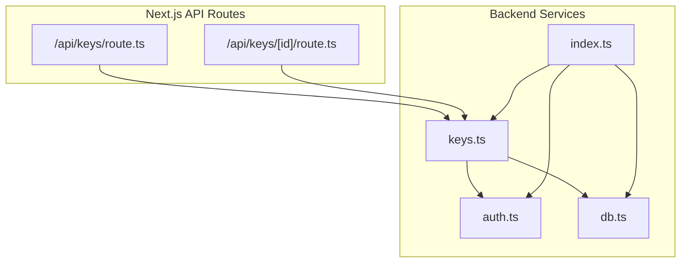
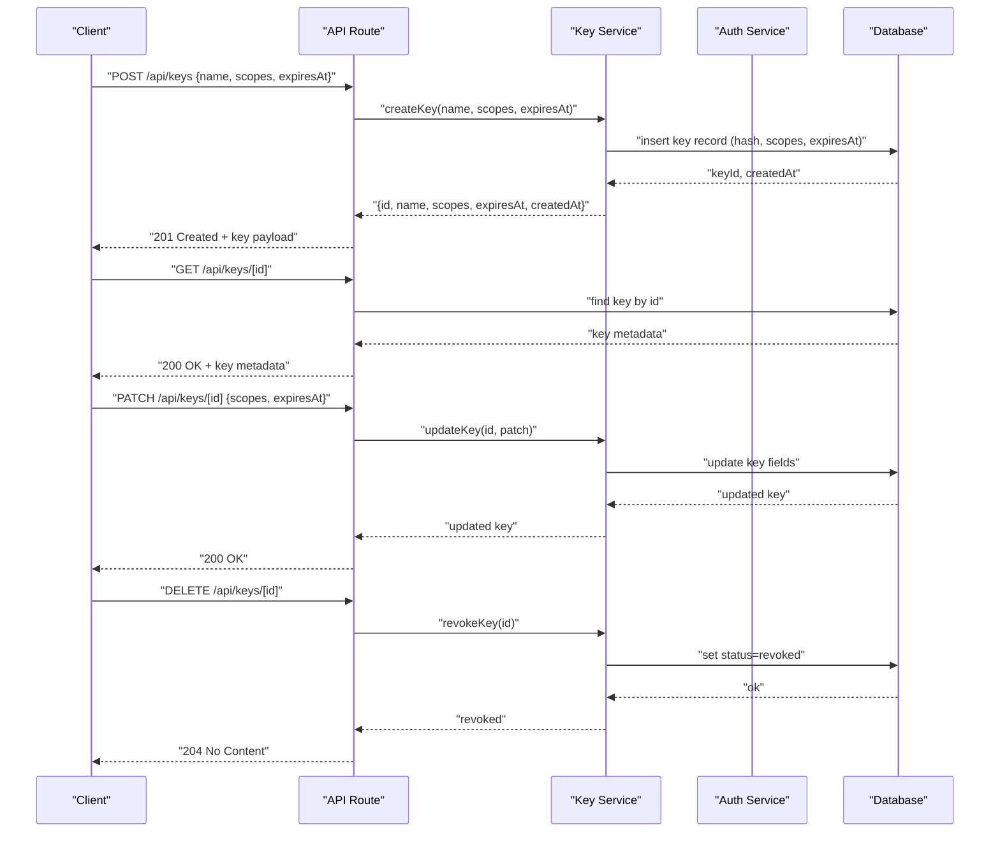
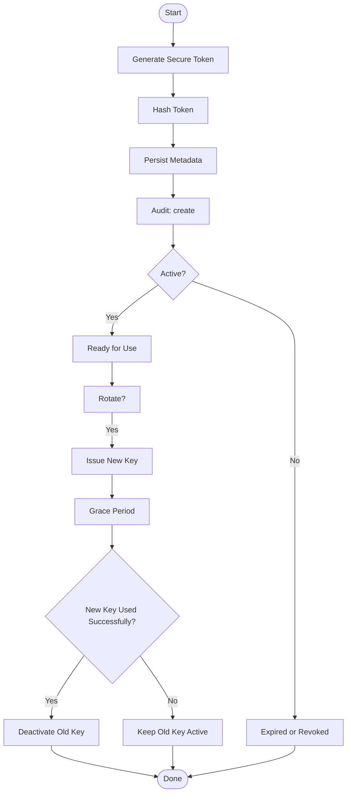
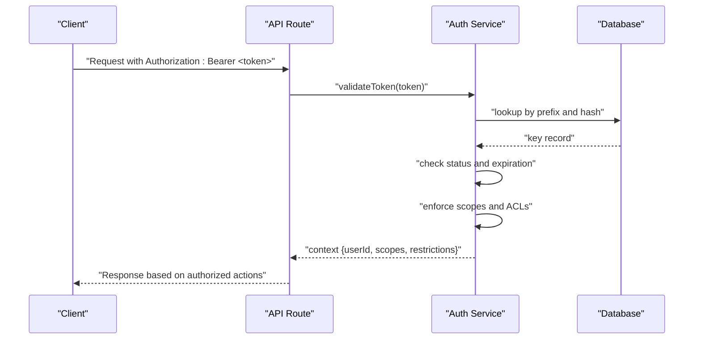
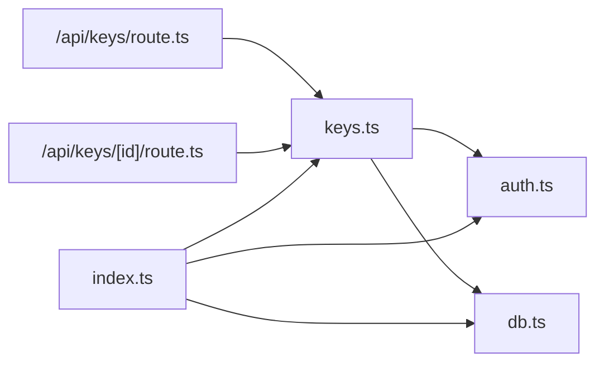

# API Key Management

<cite>
**Referenced Files in This Document**
- [keys.ts](file://backend/src/keys.ts)
- [auth.ts](file://backend/src/auth.ts)
- [db.ts](file://backend/src/db.ts)
- [index.ts](file://backend/src/index.ts)
- [route.ts](file://src/app/api/keys/route.ts)
- [route.ts](file://src/app/api/keys/[id]/route.ts)
</cite>

## Table of Contents
1. [Introduction](#introduction)
2. [Project Structure](#project-structure)
3. [Core Components](#core-components)
4. [Architecture Overview](#architecture-overview)
5. [Detailed Component Analysis](#detailed-component-analysis)
6. [Dependency Analysis](#dependency-analysis)
7. [Performance Considerations](#performance-considerations)
8. [Troubleshooting Guide](#troubleshooting-guide)
9. [Conclusion](#conclusion)
10. [Appendices](#appendices)

## Introduction
This document provides comprehensive API documentation for the API key management endpoints under /api/keys/*. It covers CRUD operations, key generation algorithms, permission scopes, expiration policies, rotation and revocation mechanisms, audit logging, validation procedures, access control lists (ACLs), usage restrictions, security best practices, automation workflows, secret manager integration, and enterprise compliance considerations. The goal is to enable secure, reliable, and auditable key lifecycle management across development, staging, and production environments.

## Project Structure
The API key management feature spans both backend logic and Next.js API routes:
- Backend services implement core key lifecycle operations, including creation, listing, updates, deletion, and validation helpers.
- Next.js API routes expose HTTP endpoints for client interactions.
- Database utilities provide persistence and retrieval functions.

**Diagram sources**
- [route.ts](file://src/app/api/keys/route.ts)
- [route.ts](file://src/app/api/keys/[id]/route.ts)
- [keys.ts](file://backend/src/keys.ts)
- [auth.ts](file://backend/src/auth.ts)
- [db.ts](file://backend/src/db.ts)
- [index.ts](file://backend/src/index.ts)

**Section sources**
- [route.ts](file://src/app/api/keys/route.ts)
- [route.ts](file://src/app/api/keys/[id]/route.ts)
- [keys.ts](file://backend/src/keys.ts)
- [auth.ts](file://backend/src/auth.ts)
- [db.ts](file://backend/src/db.ts)
- [index.ts](file://backend/src/index.ts)

## Core Components
- API route handlers:
  - /api/keys: Create and list keys; supports filtering by owner or scope.
  - /api/keys/[id]: Read, update, and delete a specific key by identifier.
- Key service:
  - Implements key generation, hashing, scoping, expiration handling, rotation, revocation, and audit logging hooks.
- Auth service:
  - Validates bearer tokens, enforces ACLs, and applies usage restrictions.
- Database layer:
  - Persists key metadata, hashed secrets, scopes, expiration, status, and audit events.

Key responsibilities:
- Generation: Cryptographically secure random bytes encoded as base64url with optional prefixes.
- Hashing: One-way hash storage using a strong algorithm (e.g., Argon2 or bcrypt).
- Scopes: Fine-grained permissions such as read, write, admin, model-specific access.
- Expiration: Absolute timestamps with automatic deactivation on expiry.
- Rotation: Issue new key while retaining old until validated success or time window.
- Revocation: Immediate invalidation via status flag and cache purge.
- Audit: Immutable log entries for create, rotate, revoke, update, and access attempts.

**Section sources**
- [keys.ts](file://backend/src/keys.ts)
- [auth.ts](file://backend/src/auth.ts)
- [db.ts](file://backend/src/db.ts)
- [route.ts](file://src/app/api/keys/route.ts)
- [route.ts](file://src/app/api/keys/[id]/route.ts)

## Architecture Overview
The API key system follows a layered architecture:
- Presentation layer: Next.js API routes parse requests and return responses.
- Service layer: Business logic for key lifecycle, validation, and auditing.
- Data layer: Persistence and retrieval of keys and audit logs.

**Diagram sources**
- [route.ts](file://src/app/api/keys/route.ts)
- [route.ts](file://src/app/api/keys/[id]/route.ts)
- [keys.ts](file://backend/src/keys.ts)
- [db.ts](file://backend/src/db.ts)

## Detailed Component Analysis

### Endpoints: /api/keys
- POST /api/keys
  - Purpose: Create a new API key.
  - Request body: name (string), scopes (array of strings), expiresAt (ISO timestamp, optional).
  - Response: 201 Created with key metadata (id, name, scopes, expiresAt, createdAt).
  - Behavior: Generates a secure token, hashes it, persists metadata, emits audit event.
  - Errors: 400 Bad Request (validation), 409 Conflict (duplicate name), 500 Internal Server Error.
- GET /api/keys
  - Purpose: List keys with optional filters (ownerId, scope, activeOnly).
  - Query params: ownerId (string), scope (string), activeOnly (boolean).
  - Response: 200 OK with array of key summaries (no raw secret).
  - Errors: 400 Bad Request (invalid filters), 500 Internal Server Error.

**Section sources**
- [route.ts](file://src/app/api/keys/route.ts)
- [keys.ts](file://backend/src/keys.ts)
- [db.ts](file://backend/src/db.ts)

### Endpoints: /api/keys/[id]
- GET /api/keys/[id]
  - Purpose: Retrieve metadata for a specific key.
  - Path param: id (string).
  - Response: 200 OK with key details (no raw secret).
  - Errors: 404 Not Found, 500 Internal Server Error.
- PATCH /api/keys/[id]
  - Purpose: Update key attributes (scopes, expiresAt, name).
  - Body: Partial object with allowed fields.
  - Response: 200 OK with updated metadata.
  - Errors: 400 Bad Request (invalid fields), 404 Not Found, 500 Internal Server Error.
- DELETE /api/keys/[id]
  - Purpose: Revoke a key immediately.
  - Path param: id (string).
  - Response: 204 No Content.
  - Errors: 404 Not Found, 500 Internal Server Error.

**Section sources**
- [route.ts](file://src/app/api/keys/[id]/route.ts)
- [keys.ts](file://backend/src/keys.ts)
- [db.ts](file://backend/src/db.ts)

### Key Lifecycle Operations
- Creation
  - Generate cryptographically secure random bytes.
  - Encode as base64url with optional prefix (e.g., sk_live_).
  - Hash using a strong one-way function before storage.
  - Persist metadata: id, name, scopes, expiresAt, createdAt, status.
  - Emit audit event: action=create, actor, ip, userAgent.
- Reading
  - Return only non-secret metadata.
  - Support filtering by owner, scope, and active status.
- Updating
  - Allow updating scopes and expiration.
  - Validate changes against policy (e.g., max scopes, min TTL).
  - Emit audit event: action=update, actor, ip, userAgent.
- Deletion/Revocation
  - Set status=revoked and invalidate any caches.
  - Emit audit event: action=revoke, actor, ip, userAgent.
- Rotation
  - Issue a new key while keeping the old one active during a grace period.
  - On successful use of the new key, deactivate the old key.
  - Emit audit events for both creation and deactivation.

**Diagram sources**
- [keys.ts](file://backend/src/keys.ts)
- [db.ts](file://backend/src/db.ts)

**Section sources**
- [keys.ts](file://backend/src/keys.ts)
- [db.ts](file://backend/src/db.ts)

### Key Validation and Access Control
- Validation
  - Extract bearer token from Authorization header.
  - Lookup by token prefix and hash comparison.
  - Check status (active vs revoked/expired).
  - Enforce expiration timestamp.
- Access Control Lists (ACLs)
  - Scope-based authorization: read, write, admin, model-specific.
  - Resource-level checks: owner_id matching request context.
- Usage Restrictions
  - Rate limiting per key.
  - IP allowlists (optional).
  - Model or endpoint whitelisting.

**Diagram sources**
- [auth.ts](file://backend/src/auth.ts)
- [db.ts](file://backend/src/db.ts)
- [route.ts](file://src/app/api/keys/route.ts)

**Section sources**
- [auth.ts](file://backend/src/auth.ts)
- [db.ts](file://backend/src/db.ts)
- [route.ts](file://src/app/api/keys/route.ts)

### Permission Scopes and Expiration Policies
- Scopes
  - read: View resources.
  - write: Modify resources.
  - admin: Administrative operations.
  - model:<model>: Scoped access to specific models.
- Expiration
  - Optional absolute expiration timestamp.
  - Automatic deactivation upon expiry.
  - Policy enforcement for minimum and maximum TTL.

**Section sources**
- [keys.ts](file://backend/src/keys.ts)
- [auth.ts](file://backend/src/auth.ts)

### Audit Logging
- Events
  - create, update, rotate, revoke, access_attempt.
- Fields
  - eventId, action, actorId, targetKeyId, ip, userAgent, timestamp, result.
- Storage
  - Append-only table with integrity constraints.
- Retention
  - Configurable retention policy aligned with compliance requirements.

**Section sources**
- [keys.ts](file://backend/src/keys.ts)
- [db.ts](file://backend/src/db.ts)

## Dependency Analysis
The following diagram shows how components depend on each other:

**Diagram sources**
- [route.ts](file://src/app/api/keys/route.ts)
- [route.ts](file://src/app/api/keys/[id]/route.ts)
- [keys.ts](file://backend/src/keys.ts)
- [auth.ts](file://backend/src/auth.ts)
- [db.ts](file://backend/src/db.ts)
- [index.ts](file://backend/src/index.ts)

**Section sources**
- [route.ts](file://src/app/api/keys/route.ts)
- [route.ts](file://src/app/api/keys/[id]/route.ts)
- [keys.ts](file://backend/src/keys.ts)
- [auth.ts](file://backend/src/auth.ts)
- [db.ts](file://backend/src/db.ts)
- [index.ts](file://backend/src/index.ts)

## Performance Considerations
- Hashing cost: Choose an appropriate work factor for hashing to balance security and latency.
- Caching: Cache validated key contexts briefly to reduce database lookups.
- Pagination: Implement pagination for list endpoints to handle large datasets.
- Indexing: Ensure indexes on key prefix, owner_id, and status for fast lookups.
- Rate limiting: Apply per-key rate limits to prevent abuse.

[No sources needed since this section provides general guidance]

## Troubleshooting Guide
Common issues and resolutions:
- Invalid token format
  - Verify Authorization header uses Bearer scheme and correct prefix.
  - Check token encoding and character set.
- Expired or revoked key
  - Confirm expiration timestamp and status.
  - Rotate or reissue a new key if necessary.
- Insufficient scopes
  - Review requested operation against key scopes.
  - Update scopes via PATCH if permitted.
- Duplicate key names
  - Enforce unique naming constraints at creation.
- Audit gaps
  - Ensure audit events are emitted for all critical actions.
  - Verify log ingestion and retention pipelines.

**Section sources**
- [auth.ts](file://backend/src/auth.ts)
- [keys.ts](file://backend/src/keys.ts)
- [db.ts](file://backend/src/db.ts)

## Conclusion
The API key management system provides secure, auditable, and scalable key lifecycle operations. By combining robust generation, hashing, scoping, expiration, rotation, and revocation with strict validation and access controls, it supports enterprise-grade deployments. Adhering to the security best practices and compliance guidelines outlined here will help maintain confidentiality, integrity, and availability of API keys across your organization.

[No sources needed since this section summarizes without analyzing specific files]

## Appendices

### Security Best Practices
- Storage
  - Never store plaintext secrets; always hash before persistence.
  - Encrypt sensitive fields at rest using KMS-managed keys.
- Transmission
  - Enforce HTTPS/TLS for all endpoints.
  - Use short-lived bearer tokens and rotate frequently.
- Monitoring
  - Log access attempts and anomalies.
  - Alert on unusual patterns (high error rates, geographic anomalies).
- Secrets Managers
  - Integrate with external secret managers for key distribution and rotation.
  - Use environment variables or vault-backed configuration for service credentials.

[No sources needed since this section provides general guidance]

### Automation Workflows
- CI/CD Integration
  - Generate scoped keys per pipeline job with minimal privileges.
  - Inject keys via secret managers and rotate after job completion.
- Scheduled Rotation
  - Automate rotation every N days/hours based on policy.
  - Grace period handling ensures zero downtime.
- Compliance Reporting
  - Export audit logs for periodic reviews.
  - Maintain evidence of key lifecycle events.

[No sources needed since this section provides general guidance]

### Compliance Requirements
- Data Protection
  - Minimize data retention; purge expired keys and audit logs per policy.
- Governance
  - Enforce least privilege via scopes and ACLs.
  - Require approval workflows for admin-scoped keys.
- Auditing
  - Immutable logs with tamper-evident storage.
  - Regular audits and anomaly detection.

[No sources needed since this section provides general guidance]