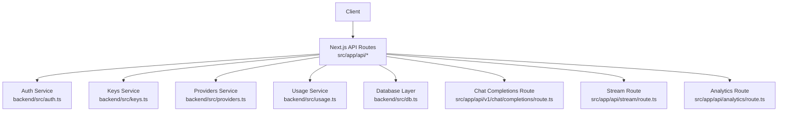
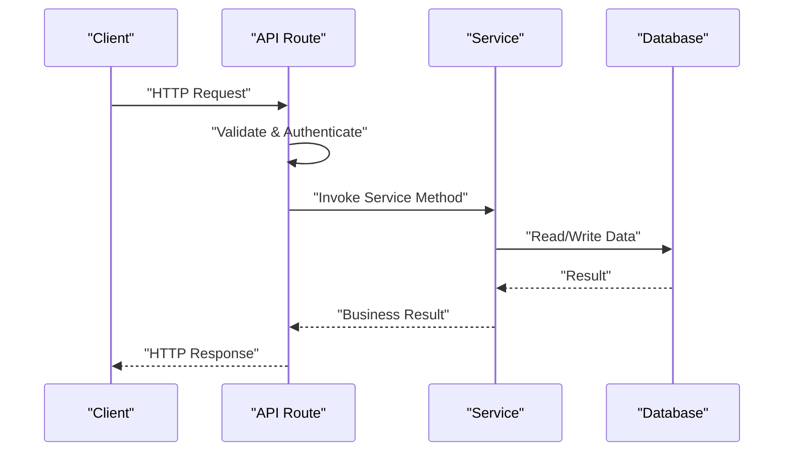
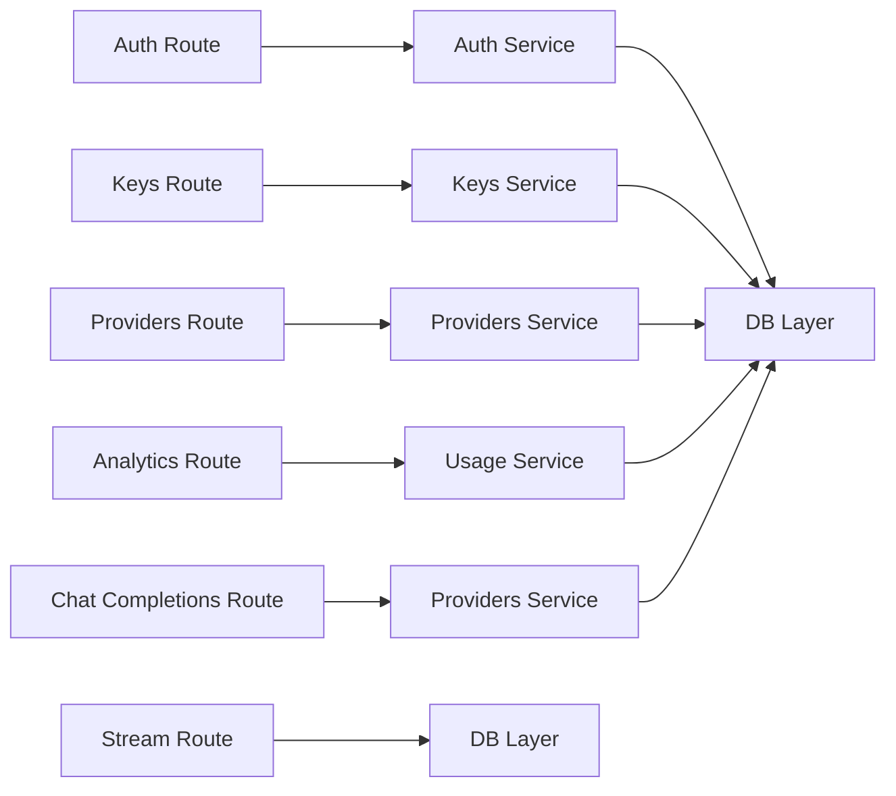

# API Reference

<cite>
**Referenced Files in This Document**
- [index.ts](file://backend/src/index.ts)
- [auth.ts](file://backend/src/auth.ts)
- [keys.ts](file://backend/src/keys.ts)
- [providers.ts](file://backend/src/providers.ts)
- [usage.ts](file://backend/src/usage.ts)
- [db.ts](file://backend/src/db.ts)
- [route.ts (Auth Login)](file://src/app/api/auth/login/route.ts)
- [route.ts (Auth Signup)](file://src/app/api/auth/signup/route.ts)
- [route.ts (Chat Completions)](file://src/app/api/v1/chat/completions/route.ts)
- [route.ts (Stream)](file://src/app/api/stream/route.ts)
- [route.ts (Analytics)](file://src/app/api/analytics/route.ts)
- [route.ts (Keys List/Create)](file://src/app/api/keys/route.ts)
- [route.ts (Key by ID)](file://src/app/api/keys/[id]/route.ts)
- [route.ts (Providers List/Create)](file://src/app/api/providers/route.ts)
- [route.ts (Provider by ID)](file://src/app/api/providers/[id]/route.ts)
</cite>

## Table of Contents
1. Introduction
2. Project Structure
3. Core Components
4. Architecture Overview
5. Detailed Component Analysis
6. Dependency Analysis
7. Performance Considerations
8. Troubleshooting Guide
9. Conclusion

## Introduction
This document provides comprehensive API reference documentation for the application’s public endpoints, including authentication, OpenAI-compatible chat completions with streaming support, real-time streaming, analytics, API key management, and provider configuration. It includes request/response schemas, error handling patterns, rate limiting considerations, and security guidance.

## Project Structure
The project exposes APIs via two layers:
- Next.js App Router routes under src/app/api/* handle HTTP requests and orchestrate business logic.
- Backend services under backend/src/* implement core functionality such as authentication, keys, providers, usage tracking, and database access.

**Diagram sources**
- [index.ts](file://backend/src/index.ts)
- [auth.ts](file://backend/src/auth.ts)
- [keys.ts](file://backend/src/keys.ts)
- [providers.ts](file://backend/src/providers.ts)
- [usage.ts](file://backend/src/usage.ts)
- [db.ts](file://backend/src/db.ts)
- [route.ts (Chat Completions)](file://src/app/api/v1/chat/completions/route.ts)
- [route.ts (Stream)](file://src/app/api/stream/route.ts)
- [route.ts (Analytics)](file://src/app/api/analytics/route.ts)

**Section sources**
- [index.ts](file://backend/src/index.ts)
- [auth.ts](file://backend/src/auth.ts)
- [keys.ts](file://backend/src/keys.ts)
- [providers.ts](file://backend/src/providers.ts)
- [usage.ts](file://backend/src/usage.ts)
- [db.ts](file://backend/src/db.ts)

## Core Components
- Authentication service: handles login and signup flows, token issuance, and session management.
- API Key service: manages creation, listing, updates, and deletion of API keys; enforces permissions.
- Provider configuration service: manages provider settings and credentials used to route model calls.
- Usage service: tracks and aggregates usage metrics for analytics and billing.
- Database layer: abstracts persistence operations across all services.

These components are consumed by Next.js API routes that define the public contract.

**Section sources**
- [auth.ts](file://backend/src/auth.ts)
- [keys.ts](file://backend/src/keys.ts)
- [providers.ts](file://backend/src/providers.ts)
- [usage.ts](file://backend/src/usage.ts)
- [db.ts](file://backend/src/db.ts)

## Architecture Overview
The system follows a layered architecture:
- Presentation layer: Next.js API routes parse requests, validate inputs, enforce auth, and return responses.
- Service layer: Business logic encapsulated in backend services.
- Data layer: Database interactions via a shared data access module.

[No sources needed since this diagram shows conceptual workflow, not actual code structure]

## Detailed Component Analysis

### Authentication Endpoints

#### POST /api/auth/login
- Purpose: Authenticate user and issue tokens/session.
- Request body:
  - email: string (required)
  - password: string (required)
- Response:
  - success: boolean
  - token: string (JWT or session token)
  - user: object (id, email, roles)
- Errors:
  - 400 Bad Request: missing fields or invalid format
  - 401 Unauthorized: invalid credentials
  - 429 Too Many Requests: rate limited
  - 500 Internal Server Error: server failure

Example request:
- Content-Type: application/json
- Body: { "email": "user@example.com", "password": "secret" }

Example response:
- Status: 200 OK
- Body: { "success": true, "token": "...", "user": { "id": "...", "email": "user@example.com" } }

Error handling pattern:
- Validate input on entry
- Return consistent error envelope with message and code
- Enforce rate limiting per IP/user

Security considerations:
- Use HTTPS only
- Store passwords hashed
- Set secure cookie flags if using cookies
- Short-lived tokens with refresh flow

Rate limiting:
- Apply per-IP and per-user limits
- Return 429 with retry-after header when exceeded

**Section sources**
- [route.ts (Auth Login)](file://src/app/api/auth/login/route.ts)
- [auth.ts](file://backend/src/auth.ts)

#### POST /api/auth/signup
- Purpose: Register a new user account.
- Request body:
  - email: string (required, unique)
  - password: string (required, min length enforced)
  - name: string (optional)
- Response:
  - success: boolean
  - user: object (id, email, name)
- Errors:
  - 400 Bad Request: validation errors
  - 409 Conflict: email already exists
  - 429 Too Many Requests: rate limited
  - 500 Internal Server Error: server failure

Example request:
- Content-Type: application/json
- Body: { "email": "new@example.com", "password": "securepass123", "name": "New User" }

Example response:
- Status: 201 Created
- Body: { "success": true, "user": { "id": "...", "email": "new@example.com", "name": "New User" } }

Security considerations:
- Enforce strong password policy
- Hash passwords before storage
- Send confirmation email if applicable

**Section sources**
- [route.ts (Auth Signup)](file://src/app/api/auth/signup/route.ts)
- [auth.ts](file://backend/src/auth.ts)

### OpenAI-Compatible Chat Completions API

#### POST /api/v1/chat/completions
- Purpose: Provide an OpenAI-compatible interface for chat completions with streaming support and provider selection.
- Authentication: Bearer token required in Authorization header.
- Request body:
  - model: string (required)
  - messages: array of message objects (required)
    - role: enum ["system", "user", "assistant"]
    - content: string
  - stream: boolean (optional, default false)
  - provider: string (optional) — selects provider implementation
  - temperature: number (optional)
  - max_tokens: number (optional)
  - top_p: number (optional)
  - stop: string | string[] (optional)
  - tools: array (optional)
  - tool_choice: string | object (optional)
- Streaming response:
  - If stream is true, returns Server-Sent Events (SSE) with chunks containing partial deltas until completion.
- Non-streaming response:
  - Returns a single JSON object with choices and usage.

Message format example:
- { "role": "user", "content": "Hello!" }

Provider selection:
- The provider parameter allows routing to different LLM backends configured in the system.

Example non-streaming request:
- Headers: Authorization: Bearer <token>, Content-Type: application/json
- Body: { "model": "gpt-4o", "messages": [{ "role": "user", "content": "Explain quantum computing." }], "stream": false }

Example streaming request:
- Headers: Authorization: Bearer <token>, Content-Type: application/json
- Body: { "model": "gpt-4o", "messages": [{ "role": "user", "content": "Tell me a joke." }], "stream": true }

Streaming event format:
- Event: message
- Data: JSON chunk with delta content and finish_reason when complete

Errors:
- 400 Bad Request: invalid payload
- 401 Unauthorized: missing or invalid token
- 403 Forbidden: insufficient permissions
- 404 Not Found: model/provider not available
- 429 Too Many Requests: rate limited
- 500 Internal Server Error: server failure
- 503 Service Unavailable: upstream provider error

Security considerations:
- Validate and sanitize messages
- Enforce per-key quotas and scopes
- Log minimal PII

Rate limiting:
- Per-key and per-model limits
- Respect upstream provider constraints

**Section sources**
- [route.ts (Chat Completions)](file://src/app/api/v1/chat/completions/route.ts)
- [providers.ts](file://backend/src/providers.ts)
- [usage.ts](file://backend/src/usage.ts)

### Real-Time Streaming API

#### GET /api/stream
- Purpose: Establish a persistent connection for real-time events (e.g., live updates, notifications).
- Authentication: Optional depending on use case; supports query param or header-based token.
- Connection handling:
  - Uses SSE or WebSocket depending on implementation.
  - Supports reconnection with exponential backoff on client side.
- Event formats:
  - type: string (event category)
  - payload: object (event-specific data)
  - id: string (event identifier)
  - timestamp: string (ISO 8601)

Example connection:
- URL: /api/stream?token=<token>&channels=updates
- Headers: Accept: text/event-stream

Event example:
- Event: update
- Data: { "type": "model_status", "payload": { "status": "ready" }, "id": "evt_123", "timestamp": "2025-01-01T00:00:00Z" }

Errors:
- 401 Unauthorized: invalid or missing token
- 403 Forbidden: no access to requested channels
- 429 Too Many Requests: too many concurrent connections
- 500 Internal Server Error: server failure

Security considerations:
- Validate channel subscriptions
- Limit connection duration and frequency
- Rotate tokens periodically

**Section sources**
- [route.ts (Stream)](file://src/app/api/stream/route.ts)

### Analytics API

#### GET /api/analytics
- Purpose: Retrieve usage metrics and reporting data.
- Authentication: Admin or owner token required.
- Query parameters:
  - start: string (ISO 8601)
  - end: string (ISO 8601)
  - group_by: enum ["day", "week", "month"]
  - metric: enum ["requests", "tokens", "latency", "errors"]
  - provider: string (optional filter)
  - model: string (optional filter)
- Response:
  - summary: object (totals and averages)
  - series: array of time-bucketed metrics
  - filters_applied: object (echo of query params)

Example request:
- GET /api/analytics?start=2025-01-01&end=2025-01-31&group_by=day&metric=requests

Example response:
- { "summary": { "total_requests": 12345, "avg_latency_ms": 230 }, "series": [...], "filters_applied": { ... } }

Errors:
- 400 Bad Request: invalid date range or unsupported metric
- 401 Unauthorized: missing or invalid token
- 403 Forbidden: insufficient permissions
- 429 Too Many Requests: rate limited
- 500 Internal Server Error: server failure

Security considerations:
- Restrict access to authorized users
- Sanitize and validate filters
- Paginate large datasets

**Section sources**
- [route.ts (Analytics)](file://src/app/api/analytics/route.ts)
- [usage.ts](file://backend/src/usage.ts)

### API Key Management

#### List and Create Keys
- Endpoint:
  - GET /api/keys
  - POST /api/keys
- Authentication: Owner/admin token required.
- Request (POST):
  - name: string (required)
  - scopes: array of strings (optional)
  - expires_at: string ISO 8601 (optional)
- Response:
  - id: string
  - name: string
  - scopes: array
  - created_at: string
  - expires_at: string | null
  - last_used_at: string | null
- Errors:
  - 400 Bad Request: validation errors
  - 401 Unauthorized: missing or invalid token
  - 403 Forbidden: insufficient permissions
  - 429 Too Many Requests: rate limited
  - 500 Internal Server Error: server failure

#### Manage Key by ID
- Endpoint:
  - GET /api/keys/:id
  - PUT /api/keys/:id
  - DELETE /api/keys/:id
- Authentication: Owner/admin token required.
- Request (PUT):
  - name: string (optional)
  - scopes: array of strings (optional)
  - expires_at: string ISO 8601 (optional)
- Response: Updated key object
- Errors:
  - 404 Not Found: key does not exist
  - 400 Bad Request: validation errors
  - 401 Unauthorized: missing or invalid token
  - 403 Forbidden: insufficient permissions
  - 429 Too Many Requests: rate limited
  - 500 Internal Server Error: server failure

Security considerations:
- Never log full key values
- Scope keys narrowly
- Rotate keys regularly
- Enforce expiration

**Section sources**
- [route.ts (Keys List/Create)](file://src/app/api/keys/route.ts)
- [route.ts (Key by ID)](file://src/app/api/keys/[id]/route.ts)
- [keys.ts](file://backend/src/keys.ts)

### Provider Configuration

#### List and Create Providers
- Endpoint:
  - GET /api/providers
  - POST /api/providers
- Authentication: Admin token required.
- Request (POST):
  - name: string (required)
  - type: string (required)
  - config: object (provider-specific settings, e.g., base_url, api_key)
  - enabled: boolean (optional)
- Response:
  - id: string
  - name: string
  - type: string
  - config: object (masked secrets)
  - enabled: boolean
  - created_at: string
  - updated_at: string
- Errors:
  - 400 Bad Request: validation errors
  - 401 Unauthorized: missing or invalid token
  - 403 Forbidden: insufficient permissions
  - 429 Too Many Requests: rate limited
  - 500 Internal Server Error: server failure

#### Manage Provider by ID
- Endpoint:
  - GET /api/providers/:id
  - PUT /api/providers/:id
  - DELETE /api/providers/:id
- Authentication: Admin token required.
- Request (PUT):
  - name: string (optional)
  - config: object (optional)
  - enabled: boolean (optional)
- Response: Updated provider object
- Errors:
  - 404 Not Found: provider does not exist
  - 400 Bad Request: validation errors
  - 401 Unauthorized: missing or invalid token
  - 403 Forbidden: insufficient permissions
  - 429 Too Many Requests: rate limited
  - 500 Internal Server Error: server failure

Security considerations:
- Mask sensitive configuration values in responses
- Validate provider configs against schema
- Restrict admin-only access

**Section sources**
- [route.ts (Providers List/Create)](file://src/app/api/providers/route.ts)
- [route.ts (Provider by ID)](file://src/app/api/providers/[id]/route.ts)
- [providers.ts](file://backend/src/providers.ts)

## Dependency Analysis
The API routes depend on backend services which in turn rely on the database layer. Proper separation ensures maintainability and testability.

**Diagram sources**
- [auth.ts](file://backend/src/auth.ts)
- [keys.ts](file://backend/src/keys.ts)
- [providers.ts](file://backend/src/providers.ts)
- [usage.ts](file://backend/src/usage.ts)
- [db.ts](file://backend/src/db.ts)
- [route.ts (Auth Login)](file://src/app/api/auth/login/route.ts)
- [route.ts (Auth Signup)](file://src/app/api/auth/signup/route.ts)
- [route.ts (Keys List/Create)](file://src/app/api/keys/route.ts)
- [route.ts (Key by ID)](file://src/app/api/keys/[id]/route.ts)
- [route.ts (Providers List/Create)](file://src/app/api/providers/route.ts)
- [route.ts (Provider by ID)](file://src/app/api/providers/[id]/route.ts)
- [route.ts (Analytics)](file://src/app/api/analytics/route.ts)
- [route.ts (Chat Completions)](file://src/app/api/v1/chat/completions/route.ts)
- [route.ts (Stream)](file://src/app/api/stream/route.ts)

**Section sources**
- [auth.ts](file://backend/src/auth.ts)
- [keys.ts](file://backend/src/keys.ts)
- [providers.ts](file://backend/src/providers.ts)
- [usage.ts](file://backend/src/usage.ts)
- [db.ts](file://backend/src/db.ts)

## Performance Considerations
- Prefer streaming for long-running chat completions to reduce latency perception.
- Cache frequently accessed provider configurations.
- Use pagination and filtering for analytics queries.
- Implement connection pooling for database operations.
- Monitor upstream provider latency and apply circuit breakers where appropriate.

[No sources needed since this section provides general guidance]

## Troubleshooting Guide
Common issues and resolutions:
- Authentication failures: verify token presence, scope, and expiration.
- Rate limiting: check 429 responses and adjust client retry strategy with exponential backoff.
- Provider errors: inspect provider configuration and network connectivity; fallback to alternate providers if configured.
- Streaming interruptions: ensure stable network and implement reconnection logic on the client.
- Analytics gaps: confirm time ranges and filters; validate timezone handling.

Error handling patterns:
- Consistent error envelope with message, code, and optional details.
- Structured logging without sensitive data.
- Graceful degradation for non-critical features.

**Section sources**
- [auth.ts](file://backend/src/auth.ts)
- [keys.ts](file://backend/src/keys.ts)
- [providers.ts](file://backend/src/providers.ts)
- [usage.ts](file://backend/src/usage.ts)

## Conclusion
This API reference outlines the public interfaces for authentication, chat completions, streaming, analytics, API keys, and provider configuration. Follow the provided schemas, error codes, and security recommendations to integrate reliably and securely. For performance and resilience, adopt streaming, caching, pagination, and robust retry strategies.