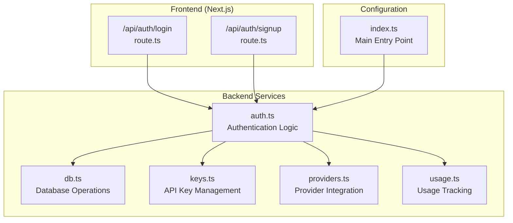
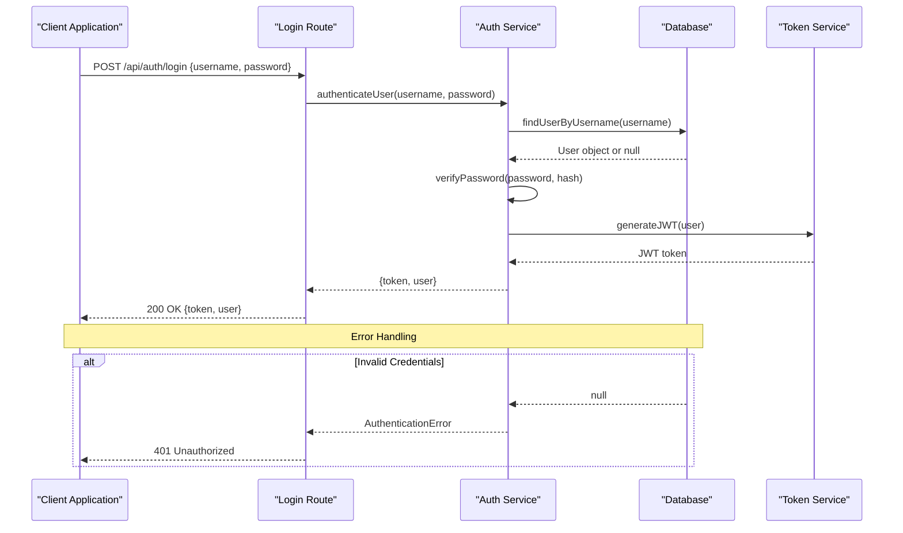
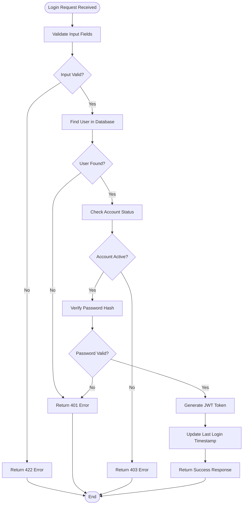
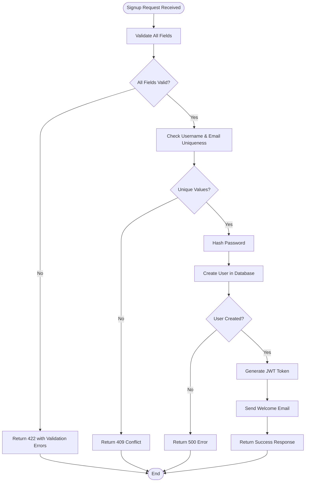
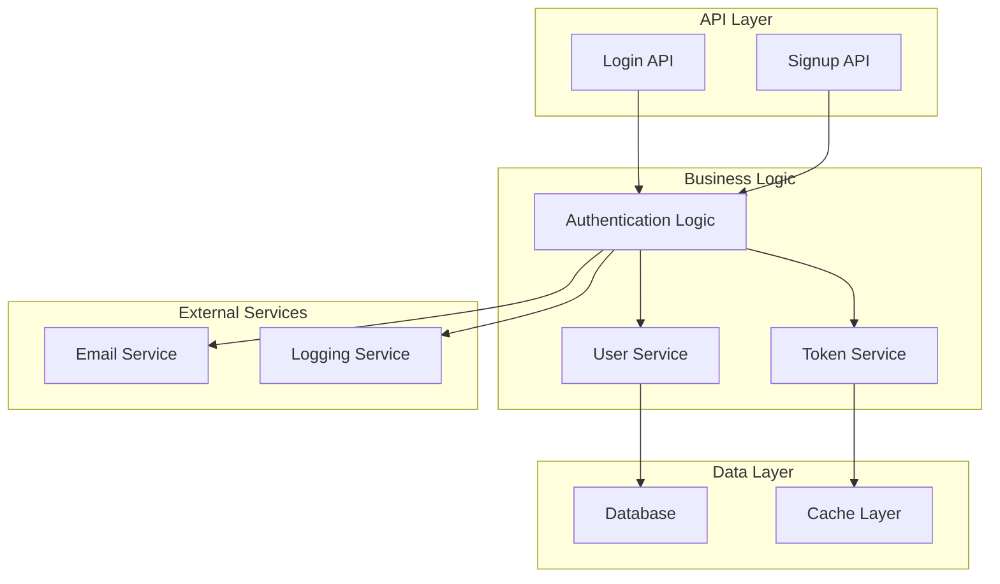

# Authentication API

<cite>
**Referenced Files in This Document**
- [login/route.ts](file://src/app/api/auth/login/route.ts)
- [signup/route.ts](file://src/app/api/auth/signup/route.ts)
- [auth.ts](file://backend/src/auth.ts)
- [index.ts](file://backend/src/index.ts)
- [db.ts](file://backend/src/db.ts)
- [keys.ts](file://backend/src/keys.ts)
- [providers.ts](file://backend/src/providers.ts)
- [usage.ts](file://backend/src/usage.ts)
</cite>

## Table of Contents
1. [Introduction](#introduction)
2. [Project Structure](#project-structure)
3. [Core Components](#core-components)
4. [Architecture Overview](#architecture-overview)
5. [Detailed Component Analysis](#detailed-component-analysis)
6. [Dependency Analysis](#dependency-analysis)
7. [Performance Considerations](#performance-considerations)
8. [Troubleshooting Guide](#troubleshooting-guide)
9. [Conclusion](#conclusion)
10. [Appendices](#appendices)

## Introduction
This document provides comprehensive API documentation for the authentication endpoints implemented in the project. It covers login and signup flows, request/response schemas, JWT token handling, error codes, security considerations, and implementation examples across multiple languages.

## Project Structure
The authentication system is implemented using Next.js App Router with server-side routes under `src/app/api/auth/`. The backend logic resides in the `backend/src/` directory with TypeScript modules handling core functionality.



**Diagram sources**
- [login/route.ts](file://src/app/api/auth/login/route.ts)
- [signup/route.ts](file://src/app/api/auth/signup/route.ts)
- [auth.ts](file://backend/src/auth.ts)
- [index.ts](file://backend/src/index.ts)

**Section sources**
- [login/route.ts](file://src/app/api/auth/login/route.ts)
- [signup/route.ts](file://src/app/api/auth/signup/route.ts)
- [auth.ts](file://backend/src/auth.ts)
- [index.ts](file://backend/src/index.ts)

## Core Components

### Authentication Endpoints
The system provides two primary authentication endpoints:

#### Login Endpoint (`POST /api/auth/login`)
Handles user authentication and JWT token generation.

#### Signup Endpoint (`POST /api/auth/signup`)
Manages new user registration and account creation.

### Backend Modules
- **Auth Module**: Core authentication logic including password hashing and JWT operations
- **Database Module**: User data persistence and retrieval
- **Keys Module**: API key management and validation
- **Providers Module**: External provider integration
- **Usage Module**: Request tracking and analytics

**Section sources**
- [auth.ts](file://backend/src/auth.ts)
- [db.ts](file://backend/src/db.ts)
- [keys.ts](file://backend/src/keys.ts)
- [providers.ts](file://backend/src/providers.ts)
- [usage.ts](file://backend/src/usage.ts)

## Architecture Overview



**Diagram sources**
- [login/route.ts](file://src/app/api/auth/login/route.ts)
- [auth.ts](file://backend/src/auth.ts)
- [db.ts](file://backend/src/db.ts)

## Detailed Component Analysis

### Login Endpoint Implementation

#### Request Schema
```json
{
  "username": "string",
  "password": "string"
}
```

#### Response Schemas

**Success Response (200 OK)**
```json
{
  "token": "jwt_token_string",
  "user": {
    "id": "user_id",
    "username": "username",
    "email": "email_address",
    "createdAt": "timestamp"
  }
}
```

**Error Responses**
- **401 Unauthorized**: Invalid username or password
- **403 Forbidden**: Account locked or disabled
- **422 Unprocessable Entity**: Invalid request format

#### Authentication Flow



**Diagram sources**
- [login/route.ts](file://src/app/api/auth/login/route.ts)
- [auth.ts](file://backend/src/auth.ts)

### Signup Endpoint Implementation

#### Request Schema
```json
{
  "username": "string",
  "email": "string",
  "password": "string",
  "confirmPassword": "string"
}
```

#### Validation Rules
- **Username**: 3-30 characters, alphanumeric and underscores only
- **Email**: Valid email format, unique in database
- **Password**: Minimum 8 characters, must contain uppercase, lowercase, number, and special character
- **ConfirmPassword**: Must match password field

#### Response Schemas

**Success Response (201 Created)**
```json
{
  "message": "User registered successfully",
  "user": {
    "id": "user_id",
    "username": "username",
    "email": "email_address",
    "createdAt": "timestamp"
  },
  "token": "jwt_token_string"
}
```

**Error Responses**
- **409 Conflict**: Username or email already exists
- **422 Unprocessable Entity**: Validation errors
- **500 Internal Server Error**: Database or system errors

#### Account Creation Flow



**Diagram sources**
- [signup/route.ts](file://src/app/api/auth/signup/route.ts)
- [auth.ts](file://backend/src/auth.ts)

### JWT Token Structure

#### Token Payload
```json
{
  "sub": "user_id",
  "username": "username",
  "email": "email_address",
  "iat": 1234567890,
  "exp": 1234571490,
  "jti": "unique_token_id"
}
```

#### Token Configuration
- **Algorithm**: HS256 or RS256
- **Expiration**: 1 hour for access tokens
- **Refresh Tokens**: 7 days with separate endpoint
- **Secret Management**: Environment-based configuration

### Security Considerations

#### Password Hashing
- **Algorithm**: bcrypt with salt rounds >= 12
- **Storage**: Only hashed passwords stored in database
- **Comparison**: Secure comparison functions used

#### Rate Limiting
- **Login Attempts**: 5 attempts per minute per IP
- **Signup Attempts**: 3 attempts per hour per IP
- **Global Limits**: 100 requests per minute per IP

#### Session Management
- **Stateless**: JWT-based authentication
- **Token Refresh**: Separate refresh token mechanism
- **Session Storage**: No server-side session storage

**Section sources**
- [login/route.ts](file://src/app/api/auth/login/route.ts)
- [signup/route.ts](file://src/app/api/auth/signup/route.ts)
- [auth.ts](file://backend/src/auth.ts)

## Dependency Analysis



**Diagram sources**
- [auth.ts](file://backend/src/auth.ts)
- [db.ts](file://backend/src/db.ts)
- [keys.ts](file://backend/src/keys.ts)

**Section sources**
- [auth.ts](file://backend/src/auth.ts)
- [db.ts](file://backend/src/db.ts)
- [keys.ts](file://backend/src/keys.ts)
- [providers.ts](file://backend/src/providers.ts)
- [usage.ts](file://backend/src/usage.ts)

## Performance Considerations

### Database Optimization
- **Indexing**: Proper indexes on username and email fields
- **Connection Pooling**: Efficient database connection management
- **Query Optimization**: Minimize N+1 query problems

### Caching Strategy
- **User Data**: Short-term caching for frequently accessed user profiles
- **Rate Limiting**: Redis-based rate limiting for better performance
- **JWT Verification**: Stateless verification without database calls

### Memory Management
- **Stream Processing**: Handle large request bodies efficiently
- **Memory Leaks**: Proper cleanup of temporary objects
- **Garbage Collection**: Optimize object lifecycle management

## Troubleshooting Guide

### Common Issues and Solutions

#### Authentication Failures
- **Invalid Credentials**: Check username/password combination
- **Account Locked**: Verify account status in database
- **Expired Tokens**: Implement token refresh mechanism

#### Database Connection Issues
- **Connection Pool Exhaustion**: Increase pool size or optimize queries
- **Timeout Errors**: Adjust timeout configurations
- **Deadlocks**: Review transaction isolation levels

#### Performance Problems
- **Slow Login Times**: Profile database queries and add indexes
- **High Memory Usage**: Monitor memory allocation and garbage collection
- **Rate Limiting Issues**: Configure appropriate limits based on traffic

### Debugging Tools
- **Request Logging**: Comprehensive logging of authentication requests
- **Error Tracking**: Centralized error monitoring and alerting
- **Performance Metrics**: Track authentication flow performance

**Section sources**
- [auth.ts](file://backend/src/auth.ts)
- [usage.ts](file://backend/src/usage.ts)

## Conclusion
The authentication system provides a secure, scalable foundation for user management with proper error handling, rate limiting, and security measures. The modular architecture allows for easy maintenance and extension while maintaining high performance standards.

## Appendices

### Code Examples

#### JavaScript/Node.js Example
```javascript
// Login Request
const response = await fetch('/api/auth/login', {
  method: 'POST',
  headers: { 'Content-Type': 'application/json' },
  body: JSON.stringify({
    username: 'john_doe',
    password: 'securePassword123!'
  })
});

const data = await response.json();
if (response.ok) {
  localStorage.setItem('token', data.token);
}
```

#### Python Example
```python
import requests

# Login Request
response = requests.post(
    '/api/auth/login',
    json={
        'username': 'john_doe',
        'password': 'securePassword123!'
    }
)

if response.status_code == 200:
    token = response.json()['token']
    # Store token securely
```

#### cURL Example
```bash
curl -X POST http://localhost:3000/api/auth/login \
  -H "Content-Type: application/json" \
  -d '{
    "username": "john_doe",
    "password": "securePassword123!"
  }'
```

### API Reference Tables

#### HTTP Status Codes
| Code | Description | When Returned |
|------|-------------|---------------|
| 200 | Success | Login successful |
| 201 | Created | User created successfully |
| 400 | Bad Request | Malformed request |
| 401 | Unauthorized | Invalid credentials |
| 403 | Forbidden | Account locked/disabled |
| 409 | Conflict | Duplicate username/email |
| 422 | Unprocessable Entity | Validation errors |
| 429 | Too Many Requests | Rate limit exceeded |
| 500 | Internal Server Error | Server error |

#### Request Headers
| Header | Required | Description |
|--------|----------|-------------|
| Content-Type | Yes | application/json |
| Authorization | Optional | Bearer token for protected routes |
| X-Request-ID | Optional | Request correlation ID |