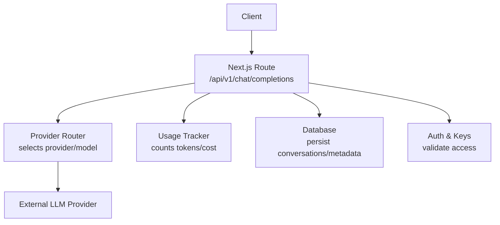
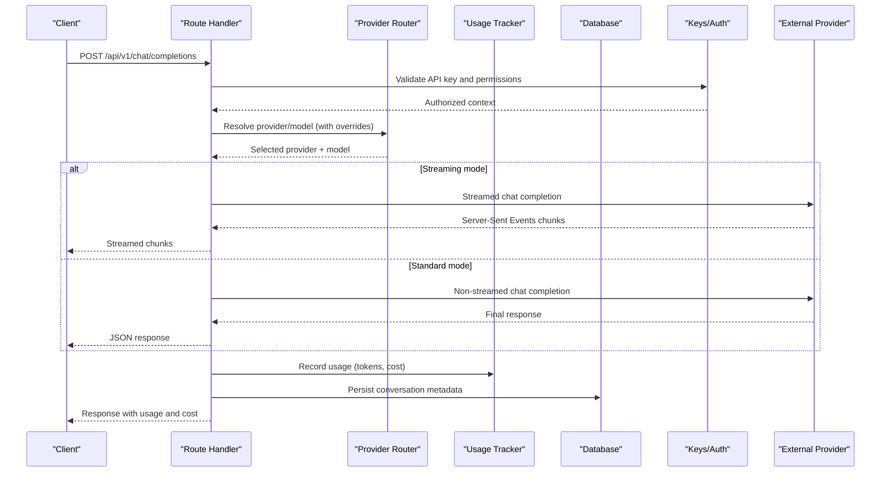
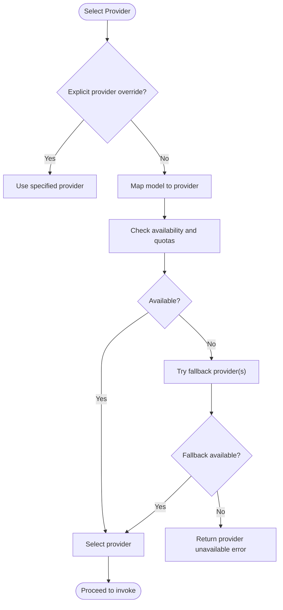
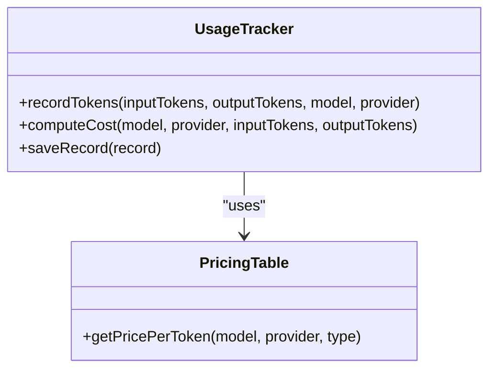
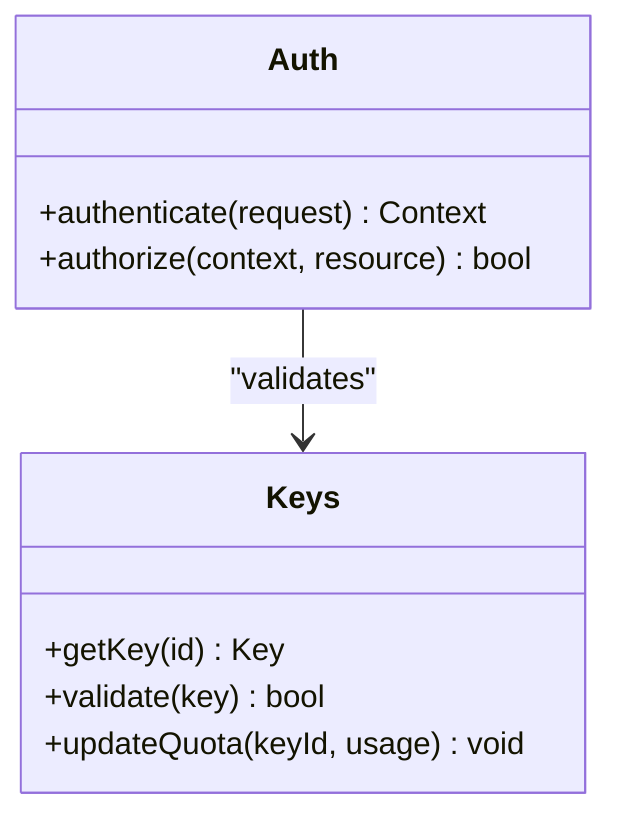
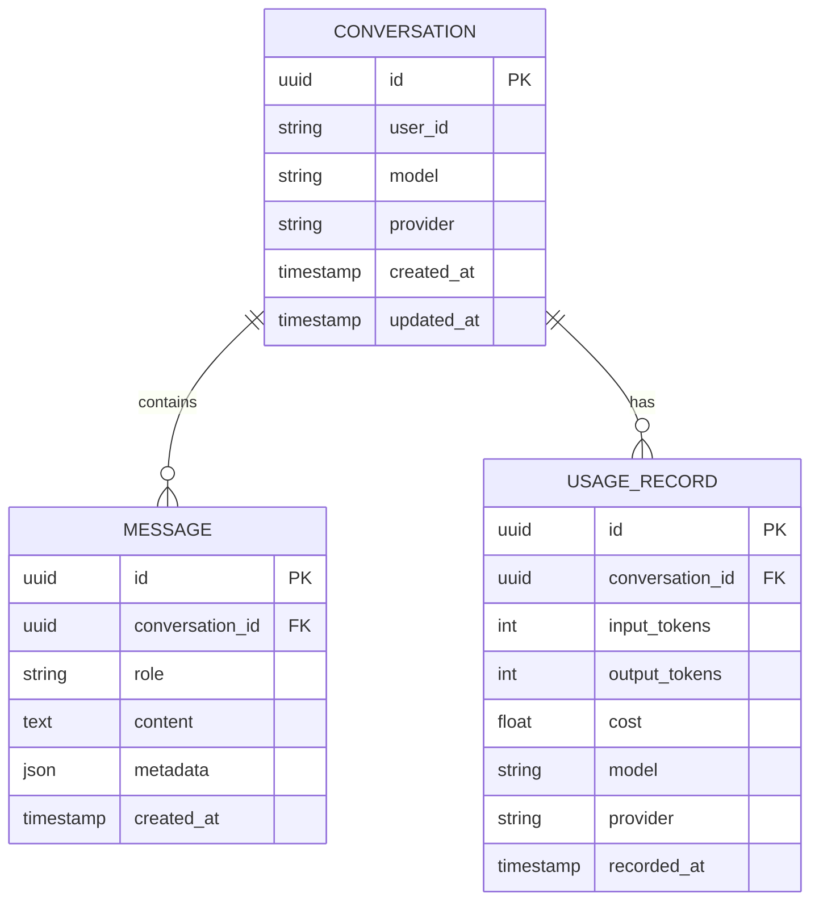
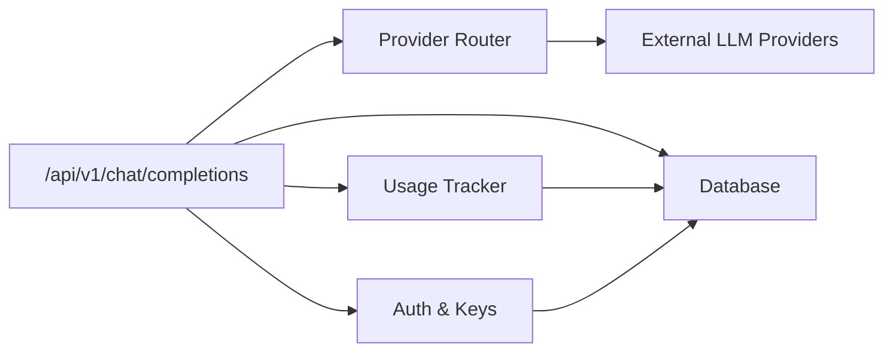

# Chat Completions API

<cite>
**Referenced Files in This Document**
- [route.ts](file://src/app/api/v1/chat/completions/route.ts)
- [providers.ts](file://backend/src/providers.ts)
- [index.ts](file://backend/src/index.ts)
- [usage.ts](file://backend/src/usage.ts)
- [db.ts](file://backend/src/db.ts)
- [keys.ts](file://backend/src/keys.ts)
- [auth.ts](file://backend/src/auth.ts)
- [conversations.ts](file://backend/src/conversations.ts)
</cite>

## Table of Contents
1. [Introduction](#introduction)
2. [Project Structure](#project-structure)
3. [Core Components](#core-components)
4. [Architecture Overview](#architecture-overview)
5. [Detailed Component Analysis](#detailed-component-analysis)
6. [Dependency Analysis](#dependency-analysis)
7. [Performance Considerations](#performance-considerations)
8. [Troubleshooting Guide](#troubleshooting-guide)
9. [Conclusion](#conclusion)
10. [Appendices](#appendices)

## Introduction
This document provides comprehensive API documentation for the OpenAI-compatible chat completions endpoint at /api/v1/chat/completions. It covers request and response schemas, provider routing logic, model availability checks, fallback mechanisms, streaming behavior, usage statistics, cost information, rate limiting, content filtering, and safety measures. The goal is to enable developers to integrate reliably with the service across both standard and streaming modes.

## Project Structure
The chat completions endpoint is implemented as a Next.js App Router route that delegates to backend services for provider selection, model invocation, usage tracking, and persistence.

**Diagram sources**
- [route.ts:1-200](file://src/app/api/v1/chat/completions/route.ts#L1-L200)
- [providers.ts:1-200](file://backend/src/providers.ts#L1-L200)
- [usage.ts:1-200](file://backend/src/usage.ts#L1-L200)
- [db.ts:1-200](file://backend/src/db.ts#L1-L200)
- [keys.ts:1-200](file://backend/src/keys.ts#L1-L200)
- [auth.ts:1-200](file://backend/src/auth.ts#L1-L200)

**Section sources**
- [route.ts:1-200](file://src/app/api/v1/chat/completions/route.ts#L1-L200)
- [providers.ts:1-200](file://backend/src/providers.ts#L1-L200)
- [usage.ts:1-200](file://backend/src/usage.ts#L1-L200)
- [db.ts:1-200](file://backend/src/db.ts#L1-L200)
- [keys.ts:1-200](file://backend/src/keys.ts#L1-L200)
- [auth.ts:1-200](file://backend/src/auth.ts#L1-L200)

## Core Components
- Request validation and parsing: Ensures messages array structure, model selection, temperature, max_tokens, and optional provider overrides are valid.
- Provider routing: Chooses an appropriate provider based on model name or explicit override, checking availability and quotas.
- Model invocation: Calls the selected provider’s chat completion interface, supporting both standard and streaming responses.
- Usage tracking: Counts input/output tokens and computes cost using configured pricing.
- Persistence: Stores conversation metadata and optionally full message history for analytics and billing.
- Authentication and keys: Validates API keys and enforces per-key limits and scopes.

Key responsibilities map to files:
- Route handler: [route.ts](file://src/app/api/v1/chat/completions/route.ts)
- Provider selection and client adapters: [providers.ts](file://backend/src/providers.ts)
- Usage counting and cost calculation: [usage.ts](file://backend/src/usage.ts)
- Database operations: [db.ts](file://backend/src/db.ts)
- Key management and validation: [keys.ts](file://backend/src/keys.ts)
- Authentication middleware: [auth.ts](file://backend/src/auth.ts)
- Conversation persistence helpers: [conversations.ts](file://backend/src/conversations.ts)

**Section sources**
- [route.ts:1-200](file://src/app/api/v1/chat/completions/route.ts#L1-L200)
- [providers.ts:1-200](file://backend/src/providers.ts#L1-L200)
- [usage.ts:1-200](file://backend/src/usage.ts#L1-L200)
- [db.ts:1-200](file://backend/src/db.ts#L1-L200)
- [keys.ts:1-200](file://backend/src/keys.ts#L1-L200)
- [auth.ts:1-200](file://backend/src/auth.ts#L1-L200)
- [conversations.ts:1-200](file://backend/src/conversations.ts#L1-L200)

## Architecture Overview
The endpoint follows a layered architecture:
- HTTP layer (Next.js route) parses requests, validates inputs, and manages streaming.
- Business layer performs provider routing, model availability checks, and fallback handling.
- Integration layer calls external providers via typed adapters.
- Telemetry layer records usage and costs.
- Storage layer persists conversation metadata and logs.

**Diagram sources**
- [route.ts:1-200](file://src/app/api/v1/chat/completions/route.ts#L1-L200)
- [providers.ts:1-200](file://backend/src/providers.ts#L1-L200)
- [usage.ts:1-200](file://backend/src/usage.ts#L1-L200)
- [db.ts:1-200](file://backend/src/db.ts#L1-L200)
- [keys.ts:1-200](file://backend/src/keys.ts#L1-L200)
- [auth.ts:1-200](file://backend/src/auth.ts#L1-L200)

## Detailed Component Analysis

### Endpoint: /api/v1/chat/completions
- Method: POST
- Content-Type: application/json
- Authentication: Bearer token derived from API key validated by auth and keys modules.

Request schema highlights:
- model: string; selects target model. If omitted, defaults may apply depending on configuration.
- messages: array of message objects. Each object includes role (system, user, assistant), content (string or structured parts), and optional tool_calls/tool_results when tools are used.
- temperature: number; sampling temperature.
- max_tokens: integer; maximum output tokens.
- stream: boolean; enables server-sent events streaming when true.
- provider: optional string; explicit provider override.
- stop: optional array of strings; stop sequences.
- top_p, frequency_penalty, presence_penalty: optional numbers; sampling controls.
- tools: optional array of tool definitions for function calling.
- tool_choice: optional string or object; controls tool selection strategy.

Response formats:
- Standard mode returns a JSON object containing choices (message text or tool calls), usage statistics (input/output tokens, total tokens), and cost breakdown.
- Streaming mode returns a stream of JSON-like chunks with incremental delta content and final usage summary.

Error handling:
- Returns standardized error codes for invalid input, authentication failures, provider errors, and quota exceeded conditions.

Rate limiting:
- Enforced per API key and optionally per model/provider. Limits are applied before invoking providers.

Content filtering and safety:
- Input/output moderation can be enabled via configuration. When triggered, the response indicates filtered content and may return partial or safe alternatives.

Examples:
- Basic conversation with system prompt and user message.
- Multi-turn conversation including assistant replies.
- Tool usage with function definitions and tool results.
- Streaming mode with incremental deltas.

**Section sources**
- [route.ts:1-200](file://src/app/api/v1/chat/completions/route.ts#L1-L200)

### Provider Routing and Fallbacks
Routing logic:
- Determines provider based on model name mapping or explicit provider override.
- Checks provider availability and quotas before selecting.
- Applies fallback chains if primary provider fails or is unavailable.

Availability checks:
- Verifies provider health and model support.
- Considers regional constraints and key-specific allowances.

Fallback mechanisms:
- On failure, retries with alternate provider or degraded model.
- Maintains consistent response shape across providers.

**Diagram sources**
- [providers.ts:1-200](file://backend/src/providers.ts#L1-L200)

**Section sources**
- [providers.ts:1-200](file://backend/src/providers.ts#L1-L200)

### Usage Tracking and Cost Calculation
- Counts input and output tokens from provider responses.
- Computes cost using configured pricing tables per model/provider.
- Persists usage records for analytics and billing.

**Diagram sources**
- [usage.ts:1-200](file://backend/src/usage.ts#L1-L200)

**Section sources**
- [usage.ts:1-200](file://backend/src/usage.ts#L1-L200)

### Authentication and API Keys
- Validates API keys and associates them with user accounts and quotas.
- Enforces scope restrictions and feature flags.
- Integrates with database for key lifecycle management.

**Diagram sources**
- [auth.ts:1-200](file://backend/src/auth.ts#L1-L200)
- [keys.ts:1-200](file://backend/src/keys.ts#L1-L200)

**Section sources**
- [auth.ts:1-200](file://backend/src/auth.ts#L1-L200)
- [keys.ts:1-200](file://backend/src/keys.ts#L1-L200)

### Data Persistence
- Stores conversation metadata, usage summaries, and optional full message histories.
- Supports querying for analytics and debugging.

**Diagram sources**
- [db.ts:1-200](file://backend/src/db.ts#L1-L200)
- [conversations.ts:1-200](file://backend/src/conversations.ts#L1-L200)

**Section sources**
- [db.ts:1-200](file://backend/src/db.ts#L1-L200)
- [conversations.ts:1-200](file://backend/src/conversations.ts#L1-L200)

## Dependency Analysis
The endpoint depends on several internal modules and external providers. Coupling is minimized through clear interfaces between route, provider router, usage tracker, and storage.

**Diagram sources**
- [route.ts:1-200](file://src/app/api/v1/chat/completions/route.ts#L1-L200)
- [providers.ts:1-200](file://backend/src/providers.ts#L1-L200)
- [usage.ts:1-200](file://backend/src/usage.ts#L1-L200)
- [db.ts:1-200](file://backend/src/db.ts#L1-L200)
- [keys.ts:1-200](file://backend/src/keys.ts#L1-L200)
- [auth.ts:1-200](file://backend/src/auth.ts#L1-L200)

**Section sources**
- [route.ts:1-200](file://src/app/api/v1/chat/completions/route.ts#L1-L200)
- [providers.ts:1-200](file://backend/src/providers.ts#L1-L200)
- [usage.ts:1-200](file://backend/src/usage.ts#L1-L200)
- [db.ts:1-200](file://backend/src/db.ts#L1-L200)
- [keys.ts:1-200](file://backend/src/keys.ts#L1-L200)
- [auth.ts:1-200](file://backend/src/auth.ts#L1-L200)

## Performance Considerations
- Prefer streaming for long responses to reduce latency and improve perceived performance.
- Cache frequently requested model metadata and pricing where appropriate.
- Batch usage recording to minimize database writes during high-throughput scenarios.
- Tune provider timeouts and retry policies to balance reliability and responsiveness.
- Monitor token throughput and adjust rate limits dynamically based on provider capacity.

[No sources needed since this section provides general guidance]

## Troubleshooting Guide
Common issues and resolutions:
- Invalid request schema: Ensure messages array conforms to expected roles and content types. Verify temperature and max_tokens ranges.
- Authentication failures: Confirm API key validity and permissions. Check key expiration and quota status.
- Provider unavailability: Review provider health endpoints and fallback configurations. Inspect error codes returned by providers.
- Rate limit exceeded: Reduce request frequency or upgrade plan. Implement exponential backoff on client side.
- Content filtering triggers: Adjust moderation thresholds or sanitize inputs. Review filtered content indicators in responses.

Operational checks:
- Validate usage counters against provider-reported token counts.
- Inspect persisted conversation metadata for anomalies.
- Enable detailed logging for provider interactions and error traces.

**Section sources**
- [route.ts:1-200](file://src/app/api/v1/chat/completions/route.ts#L1-L200)
- [providers.ts:1-200](file://backend/src/providers.ts#L1-L200)
- [usage.ts:1-200](file://backend/src/usage.ts#L1-L200)
- [db.ts:1-200](file://backend/src/db.ts#L1-L200)
- [keys.ts:1-200](file://backend/src/keys.ts#L1-L200)
- [auth.ts:1-200](file://backend/src/auth.ts#L1-L200)

## Conclusion
The /api/v1/chat/completions endpoint offers an OpenAI-compatible interface with robust provider routing, usage tracking, and persistence. By adhering to the documented request and response schemas, leveraging streaming for efficiency, and implementing proper error handling and rate limiting, clients can achieve reliable and scalable integrations.

[No sources needed since this section summarizes without analyzing specific files]

## Appendices

### Request Schema Reference
- model: string; required unless default applies.
- messages: array; each item includes role (system/user/assistant), content (string or structured parts), and optional tool_calls/tool_results.
- temperature: number; optional; controls randomness.
- max_tokens: integer; optional; caps output length.
- stream: boolean; optional; enables SSE streaming.
- provider: string; optional; explicit provider override.
- stop: array of strings; optional; stop sequences.
- top_p, frequency_penalty, presence_penalty: numbers; optional; sampling parameters.
- tools: array; optional; function definitions for tool use.
- tool_choice: string/object; optional; tool selection strategy.

**Section sources**
- [route.ts:1-200](file://src/app/api/v1/chat/completions/route.ts#L1-L200)

### Response Schema Reference
Standard mode:
- choices: array; each choice includes message (role/content/tool_calls), finish_reason, and index.
- usage: object; input_tokens, output_tokens, total_tokens.
- cost: object; currency, amount, breakdown by model/provider.
- id: string; request identifier.
- created: timestamp; request creation time.

Streaming mode:
- Chunks: incremental objects with delta content and optional tool call deltas.
- Final chunk: includes usage summary and cost.

**Section sources**
- [route.ts:1-200](file://src/app/api/v1/chat/completions/route.ts#L1-L200)

### Examples
- Basic conversation: Provide system and user messages; receive assistant reply.
- Multi-turn dialogue: Include prior assistant messages; maintain context.
- Tool usage: Define functions in tools; include tool_calls in assistant message; provide tool_results in subsequent user messages.
- Streaming: Set stream=true; process incremental deltas until final usage summary.

For concrete payloads and responses, refer to the route implementation and associated tests.

**Section sources**
- [route.ts:1-200](file://src/app/api/v1/chat/completions/route.ts#L1-L200)