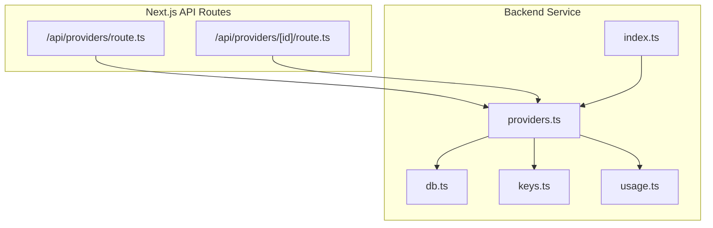
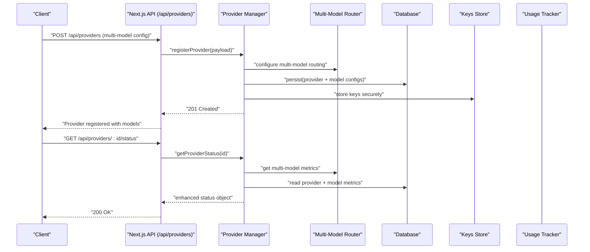
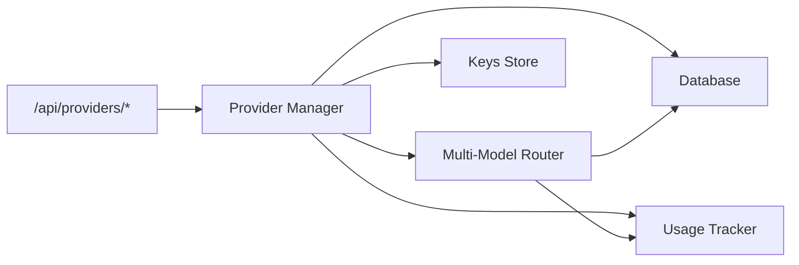

# Provider Management API

<cite>
**Referenced Files in This Document**
- [providers.ts](file://backend/src/providers.ts)
- [index.ts](file://backend/src/index.ts)
- [route.ts](file://src/app/api/providers/route.ts)
- [route.ts](file://src/app/api/providers/[id]/route.ts)
- [db.ts](file://backend/src/db.ts)
- [keys.ts](file://backend/src/keys.ts)
- [usage.ts](file://backend/src/usage.ts)
</cite>

## Update Summary
**Changes Made**
- Updated provider management endpoints to reflect enhanced CRUD operations with expanded configuration interfaces
- Added documentation for multi-model AI service connections support
- Enhanced provider registration and configuration management capabilities
- Updated routing algorithms and load balancing strategies for multi-provider orchestration
- Expanded rate limiting and cost optimization features

## Table of Contents
1. [Introduction](#introduction)
2. [Project Structure](#project-structure)
3. [Core Components](#core-components)
4. [Architecture Overview](#architecture-overview)
5. [Detailed Component Analysis](#detailed-component-analysis)
6. [Dependency Analysis](#dependency-analysis)
7. [Performance Considerations](#performance-considerations)
8. [Troubleshooting Guide](#troubleshooting-guide)
9. [Conclusion](#conclusion)
10. [Appendices](#appendices)

## Introduction
This document provides detailed API documentation for AI provider management endpoints under /api/providers/*. It covers provider registration, configuration management, and status monitoring with enhanced CRUD operations and multi-model AI service connections support. The system now includes advanced provider abstraction layer architecture, comprehensive routing algorithms, sophisticated load balancing strategies, robust failover mechanisms, per-provider rate limiting, cost optimization strategies, and multi-provider orchestration patterns. Examples are included to guide adding new providers, configuring provider-specific settings, and monitoring provider health across multiple models and services.

## Project Structure
The provider management feature spans both backend services and Next.js API routes with enhanced capabilities:
- Backend service exposes core provider logic, database access, key management, usage tracking, and multi-model orchestration.
- Next.js API routes expose HTTP endpoints for comprehensive provider CRUD operations and status monitoring.

**Diagram sources**
- [route.ts](file://src/app/api/providers/route.ts)
- [route.ts](file://src/app/api/providers/[id]/route.ts)
- [providers.ts](file://backend/src/providers.ts)
- [db.ts](file://backend/src/db.ts)
- [keys.ts](file://backend/src/keys.ts)
- [usage.ts](file://backend/src/usage.ts)
- [index.ts](file://backend/src/index.ts)

**Section sources**
- [providers.ts](file://backend/src/providers.ts)
- [index.ts](file://backend/src/index.ts)
- [route.ts](file://src/app/api/providers/route.ts)
- [route.ts](file://src/app/api/providers/[id]/route.ts)
- [db.ts](file://backend/src/db.ts)
- [keys.ts](file://backend/src/keys.ts)
- [usage.ts](file://backend/src/usage.ts)

## Core Components
- **Enhanced Provider Abstraction Layer**: Encapsulates provider-specific implementations behind a unified interface with multi-model support. Standardizes request/response formats, error handling, metadata (costs, quotas), and model-specific configurations.
- **Advanced Provider Registry**: Maintains available providers, their configurations, runtime state, and multi-model associations with dynamic loading capabilities.
- **Intelligent Routing Engine**: Selects optimal providers for each request based on configured strategy including round-robin, least-cost, health-aware, and multi-model routing with fallback chains.
- **Comprehensive Health Monitor**: Periodically checks provider availability, model performance, and updates status with detailed metrics and circuit breaker integration.
- **Sophisticated Rate Limiter**: Enforces per-provider and per-model limits using token bucket or sliding window counters stored via the database with burst handling.
- **Advanced Cost Tracker**: Aggregates token usage, costs, and performance metrics per provider and model for billing, optimization, and analytics.

Key responsibilities:
- **Enhanced Registration**: Add/update/remove providers and credentials with multi-model configuration support.
- **Advanced Configuration**: Manage model mappings, pricing tiers, timeouts, retries, headers, and provider-specific parameters.
- **Comprehensive Status Monitoring**: Track latency, error rates, uptime, model performance, and quota usage.
- **Multi-Provider Orchestration**: Route requests across multiple providers and models with intelligent fallbacks and load distribution.

**Section sources**
- [providers.ts](file://backend/src/providers.ts)
- [db.ts](file://backend/src/db.ts)
- [keys.ts](file://backend/src/keys.ts)
- [usage.ts](file://backend/src/usage.ts)

## Architecture Overview
The system separates concerns between HTTP endpoints, provider orchestration, and persistence with enhanced multi-model support. The Next.js API routes delegate to the backend provider manager, which coordinates with the database, keys store, usage tracker, and multi-model routing engine.

**Diagram sources**
- [route.ts](file://src/app/api/providers/route.ts)
- [route.ts](file://src/app/api/providers/[id]/route.ts)
- [providers.ts](file://backend/src/providers.ts)
- [db.ts](file://backend/src/db.ts)
- [keys.ts](file://backend/src/keys.ts)
- [usage.ts](file://backend/src/usage.ts)

## Detailed Component Analysis

### Enhanced Provider Management Endpoints
Endpoints exposed by Next.js API routes with expanded CRUD operations:
- **POST /api/providers**
  - Purpose: Register a new provider with enhanced configuration and multi-model support.
  - Request body: provider type, name, base URL, model mapping array, pricing tiers, timeouts, retry policy, headers, secret keys, and multi-model routing rules.
  - Response: created provider ID, initial status, and configured models.
- **GET /api/providers**
  - Purpose: List all providers with summary info, health status, and model availability.
  - Query params: optional filters (type, enabled, model).
  - Response: array of provider summaries with model details.
- **GET /api/providers/:id**
  - Purpose: Retrieve full configuration for a specific provider including all models.
  - Response: provider details (excluding secrets unless explicitly requested) with model configurations.
- **PATCH /api/providers/:id**
  - Purpose: Update provider configuration (non-secret fields) and model mappings.
  - Request body: partial update fields including model additions/removals.
  - Response: updated provider with revised model list.
- **PUT /api/providers/:id/models**
  - Purpose: Configure multi-model routing and model-specific settings.
  - Request body: model priorities, weights, fallback chains, and routing rules.
  - Response: confirmation and effective model configuration.
- **DELETE /api/providers/:id**
  - Purpose: Remove a provider and associated keys and models.
  - Response: deletion confirmation.
- **GET /api/providers/:id/status**
  - Purpose: Get current health, latency, error rate, quota usage, and per-model metrics.
  - Response: status object including last check timestamp, metrics, and model availability.
- **POST /api/providers/:id/test**
  - Purpose: Test provider connectivity and model accessibility.
  - Request body: optional model specification for targeted testing.
  - Response: test results with connection status and model validation.

Notes:
- Authentication and authorization are enforced at the route level before delegating to the provider manager.
- Validation ensures required fields, safe defaults, and multi-model configuration integrity.
- Enhanced error handling provides detailed diagnostics for multi-model routing issues.

**Section sources**
- [route.ts](file://src/app/api/providers/route.ts)
- [route.ts](file://src/app/api/providers/[id]/route.ts)

### Enhanced Provider Abstraction Layer
The abstraction layer defines a consistent interface for all providers with multi-model support:
- **Methods**: initialize, configure, request, healthCheck, getQuota, resetQuota, getModelCapabilities, switchModel.
- **Metadata**: providerType, displayName, defaultModel, pricingPerToken, maxTokens, supportedFeatures, modelList.
- **Error normalization**: maps provider-specific errors to common codes and messages with model context.
- **Retry and timeout policies**: configurable per provider and per model with adaptive backoff.

Supported provider types:
- OpenAI-compatible REST APIs with multi-model support
- Anthropic-style chat completions with model routing
- Custom HTTP-based LLM endpoints with dynamic model discovery
- Multi-service aggregators that combine multiple AI providers

Custom provider implementation guidelines:
- Implement the standardized interface methods with multi-model awareness.
- Provide accurate pricing and quota information per model.
- Normalize errors and include diagnostic context with model identifiers.
- Support streaming responses if applicable with model-specific optimizations.
- Expose health check endpoint behavior via healthCheck method with model validation.
- Implement model capability detection and dynamic configuration.

**Section sources**
- [providers.ts](file://backend/src/providers.ts)

### Advanced Routing Algorithms and Load Balancing
Routing engine selects optimal providers and models based on:
- **Round-robin**: distribute evenly across enabled providers and models.
- **Least-cost**: prefer providers with lower cost per token within budget constraints across models.
- **Health-aware**: avoid unhealthy providers; prioritize those with low latency and error rates per model.
- **Weighted distribution**: assign weights per provider and model for traffic shaping.
- **Multi-model routing**: select appropriate models based on task complexity, input size, and requirements.
- **Geographic routing**: select providers closest to users for latency optimization.

Failover mechanisms:
- Automatic fallback to next healthy provider and model on failure.
- Circuit breaker: temporarily stop sending requests to failing providers or models.
- Backoff and retry: exponential backoff with jitter for transient errors with model-specific handling.
- Graceful degradation: fall back to simpler models when complex models fail.

Configuration options:
- Strategy selection per request or globally with model-specific overrides.
- Per-provider weights, per-model priorities, and fallback chains.
- Thresholds for health checks, circuit breaking, and model switching.

**Section sources**
- [providers.ts](file://backend/src/providers.ts)

### Enhanced Rate Limiting Per Provider and Model
Rate limiting is enforced per provider and per model using:
- Token bucket or sliding window counters persisted in the database with model-specific tracking.
- Configurable limits: requests per minute, tokens per hour, concurrent sessions per model.
- Quota enforcement: reject requests exceeding limits with appropriate error codes and model suggestions.
- Burst handling: allow temporary bursts above normal limits with cooldown periods.

Operational behaviors:
- Increment counters atomically on each request with model-specific tracking.
- Reset counters based on time windows with model-aware scheduling.
- Return informative headers indicating remaining quota per model.
- Provide rate limit exhaustion notifications with upgrade suggestions.

**Section sources**
- [providers.ts](file://backend/src/providers.ts)
- [db.ts](file://backend/src/db.ts)
- [usage.ts](file://backend/src/usage.ts)

### Advanced Cost Optimization Strategies
Strategies to reduce costs across multiple providers and models:
- Prefer cheaper providers and models when quality thresholds are met.
- Cache frequent prompts/responses where allowed with model-specific cache keys.
- Batch requests to reduce overhead with intelligent model selection.
- Adjust model selection dynamically based on task complexity and cost constraints.
- Monitor usage trends and adjust weights accordingly with predictive scaling.
- Implement model tiering: use simple models for easy tasks, complex models for difficult ones.

Metrics to track:
- Cost per request and per token across all providers and models.
- Error-induced re-runs and their impact on costs.
- Latency vs. cost trade-offs per model.
- ROI analysis for premium models vs. cost savings.

**Section sources**
- [providers.ts](file://backend/src/providers.ts)
- [usage.ts](file://backend/src/usage.ts)

### Multi-Provider Orchestration Patterns
Patterns for orchestrating multiple providers and models:
- **Primary-secondary**: use one provider as primary and another as backup with automatic failover.
- **A/B testing**: split traffic to compare performance and cost across different providers and models.
- **Task-based routing**: direct different tasks to specialized providers and optimal models.
- **Geographic routing**: select providers closest to users for latency with model localization.
- **Cost-tiered routing**: automatically select models based on budget constraints and task importance.
- **Load distribution**: balance requests across providers to prevent overload and ensure reliability.

Implementation considerations:
- Maintain consistent response schemas across providers and models.
- Ensure idempotency for retries and failovers with model-specific handling.
- Log routing decisions for observability and cost analysis.
- Implement graceful degradation when premium models are unavailable.
- Provide model capability discovery and dynamic configuration updates.

**Section sources**
- [providers.ts](file://backend/src/providers.ts)

## Dependency Analysis
The provider management module depends on database, keys storage, usage tracking, and multi-model routing components. The Next.js API routes depend on the provider manager for business logic with enhanced multi-model support.

**Diagram sources**
- [route.ts](file://src/app/api/providers/route.ts)
- [route.ts](file://src/app/api/providers/[id]/route.ts)
- [providers.ts](file://backend/src/providers.ts)
- [db.ts](file://backend/src/db.ts)
- [keys.ts](file://backend/src/keys.ts)
- [usage.ts](file://backend/src/usage.ts)

**Section sources**
- [providers.ts](file://backend/src/providers.ts)
- [db.ts](file://backend/src/db.ts)
- [keys.ts](file://backend/src/keys.ts)
- [usage.ts](file://backend/src/usage.ts)

## Performance Considerations
- Use connection pooling for provider HTTP clients with model-specific pools.
- Minimize serialization overhead by reusing request builders and response parsers.
- Cache provider metadata, routing tables, and model capabilities with invalidation strategies.
- Implement efficient health checks with short timeouts and parallel execution.
- Avoid blocking operations in request paths; offload to background jobs for heavy processing.
- Optimize multi-model routing with pre-computed decision trees and caching.
- Implement request deduplication across providers to reduce redundant calls.

## Troubleshooting Guide
Common issues and resolutions:
- Provider registration fails due to invalid configuration: validate required fields and ensure secure key storage with model compatibility checks.
- Health checks report failures: verify network connectivity, authentication, and endpoint availability with model-specific diagnostics.
- Rate limit exceeded: adjust limits or implement client-side backoff with model-aware queuing.
- High error rates: inspect normalized error codes and logs; consider enabling circuit breaker with model fallbacks.
- Cost spikes: review routing strategy and adjust weights toward cheaper providers and models.
- Multi-model routing failures: validate model configurations and capability detection.
- Performance degradation: monitor model-specific metrics and optimize routing decisions.

Diagnostic steps:
- Check provider status endpoint for recent metrics and model availability.
- Review usage logs for anomalies and cost analysis.
- Validate keys and permissions for all configured models.
- Inspect routing decisions and fallback events with model context.
- Test individual models and provider connections separately.

**Section sources**
- [route.ts](file://src/app/api/providers/[id]/route.ts)
- [providers.ts](file://backend/src/providers.ts)
- [usage.ts](file://backend/src/usage.ts)

## Conclusion
The enhanced provider management API offers a robust foundation for registering, configuring, and monitoring AI providers with comprehensive multi-model support. With flexible routing, sophisticated load balancing, intelligent failover mechanisms, and advanced cost optimization, it supports complex multi-provider orchestration while maintaining cost efficiency and reliability. The expanded CRUD operations and configuration interfaces enable seamless integration of diverse providers and models. By following the implementation guidelines and leveraging the enhanced endpoints, teams can integrate multiple AI providers seamlessly, manage complex multi-model configurations, and monitor operational health effectively across diverse AI services.

## Appendices

### Example: Adding a New Provider with Multi-Model Support
Steps:
- Implement the provider interface in the abstraction layer with multi-model capabilities.
- Register the provider type in the registry with model discovery support.
- Configure provider-specific settings and model mappings via the enhanced API.
- Set up multi-model routing rules and fallback chains.
- Test health checks, model capabilities, and routing behavior.
- Monitor usage, costs, and performance across all models after deployment.

**Section sources**
- [providers.ts](file://backend/src/providers.ts)
- [route.ts](file://src/app/api/providers/route.ts)

### Example: Configuring Multi-Model Provider Settings
Use the enhanced provider update endpoints to set:
- Base URL and model mappings with capability detection.
- Timeouts and retry policies per model with adaptive backoff.
- Pricing per token and quota limits per model tier.
- Headers and authentication parameters with model-specific overrides.
- Multi-model routing rules with priority and fallback chains.

**Section sources**
- [route.ts](file://src/app/api/providers/[id]/route.ts)

### Example: Monitoring Multi-Provider Health and Performance
Call the enhanced status endpoint to retrieve:
- Last health check timestamp with model-specific status.
- Latency percentiles per model and provider.
- Error rate and circuit breaker state with model context.
- Quota usage and remaining capacity per model.
- Cost analysis and performance metrics across all providers.
- Routing decisions and model selection patterns.

**Section sources**
- [route.ts](file://src/app/api/providers/[id]/route.ts)

### Example: Implementing Multi-Model Fallback Chains
Configure fallback chains for resilience:
- Define primary models with high capability and premium pricing.
- Set up secondary models for cost-effective alternatives.
- Configure tertiary models for basic functionality when others fail.
- Implement automatic switching based on availability and cost constraints.
- Monitor fallback effectiveness and adjust chain priorities.

**Section sources**
- [providers.ts](file://backend/src/providers.ts)
- [route.ts](file://src/app/api/providers/[id]/route.ts)