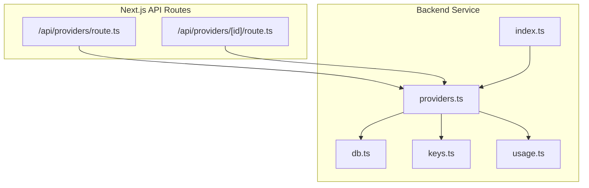
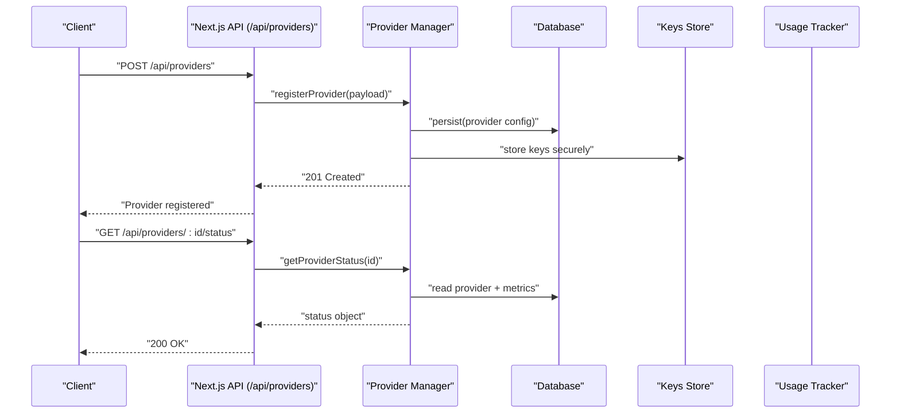
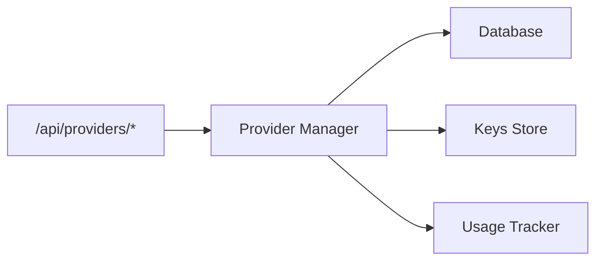

# Provider Management API

<cite>
**Referenced Files in This Document**
- [providers.ts](file://backend/src/providers.ts)
- [index.ts](file://backend/src/index.ts)
- [route.ts](file://src/app/api/providers/route.ts)
- [route.ts](file://src/app/api/providers/[id]/route.ts)
- [db.ts](file://backend/src/db.ts)
- [keys.ts](file://backend/src/keys.ts)
- [usage.ts](file://backend/src/usage.ts)
</cite>

## Table of Contents
1. [Introduction](#introduction)
2. [Project Structure](#project-structure)
3. [Core Components](#core-components)
4. [Architecture Overview](#architecture-overview)
5. [Detailed Component Analysis](#detailed-component-analysis)
6. [Dependency Analysis](#dependency-analysis)
7. [Performance Considerations](#performance-considerations)
8. [Troubleshooting Guide](#troubleshooting-guide)
9. [Conclusion](#conclusion)
10. [Appendices](#appendices)

## Introduction
This document provides detailed API documentation for AI provider management endpoints under /api/providers/*. It covers provider registration, configuration management, and status monitoring. It also explains the provider abstraction layer architecture, supported provider types, custom provider implementation guidelines, routing algorithms, load balancing strategies, failover mechanisms, rate limiting per provider, cost optimization strategies, and multi-provider orchestration patterns. Examples are included to guide adding new providers, configuring provider-specific settings, and monitoring provider health.

## Project Structure
The provider management feature spans both backend services and Next.js API routes:
- Backend service exposes core provider logic, database access, key management, and usage tracking.
- Next.js API routes expose HTTP endpoints for provider CRUD and status operations.

**Diagram sources**
- [route.ts](file://src/app/api/providers/route.ts)
- [route.ts](file://src/app/api/providers/[id]/route.ts)
- [providers.ts](file://backend/src/providers.ts)
- [db.ts](file://backend/src/db.ts)
- [keys.ts](file://backend/src/keys.ts)
- [usage.ts](file://backend/src/usage.ts)
- [index.ts](file://backend/src/index.ts)

**Section sources**
- [providers.ts](file://backend/src/providers.ts)
- [index.ts](file://backend/src/index.ts)
- [route.ts](file://src/app/api/providers/route.ts)
- [route.ts](file://src/app/api/providers/[id]/route.ts)
- [db.ts](file://backend/src/db.ts)
- [keys.ts](file://backend/src/keys.ts)
- [usage.ts](file://backend/src/usage.ts)

## Core Components
- Provider Abstraction Layer: Encapsulates provider-specific implementations behind a unified interface. It standardizes request/response formats, error handling, and metadata (costs, quotas).
- Provider Registry: Maintains available providers, their configurations, and runtime state.
- Routing Engine: Selects a provider for each request based on configured strategy (e.g., round-robin, least-cost, health-aware).
- Health Monitor: Periodically checks provider availability and updates status.
- Rate Limiter: Enforces per-provider limits using counters or tokens stored via the database.
- Cost Tracker: Aggregates token usage and costs per provider for billing and optimization.

Key responsibilities:
- Registration: Add/update/remove providers and credentials.
- Configuration: Manage model mappings, pricing, timeouts, retries, and headers.
- Status Monitoring: Track latency, error rates, and uptime.
- Orchestration: Route requests across multiple providers with fallbacks.

**Section sources**
- [providers.ts](file://backend/src/providers.ts)
- [db.ts](file://backend/src/db.ts)
- [keys.ts](file://backend/src/keys.ts)
- [usage.ts](file://backend/src/usage.ts)

## Architecture Overview
The system separates concerns between HTTP endpoints, provider orchestration, and persistence. The Next.js API routes delegate to the backend provider manager, which coordinates with the database, keys store, and usage tracker.

**Diagram sources**
- [route.ts](file://src/app/api/providers/route.ts)
- [route.ts](file://src/app/api/providers/[id]/route.ts)
- [providers.ts](file://backend/src/providers.ts)
- [db.ts](file://backend/src/db.ts)
- [keys.ts](file://backend/src/keys.ts)
- [usage.ts](file://backend/src/usage.ts)

## Detailed Component Analysis

### Provider Management Endpoints
Endpoints exposed by Next.js API routes:
- POST /api/providers
  - Purpose: Register a new provider with configuration and credentials.
  - Request body: provider type, name, base URL, model mapping, pricing, timeouts, retry policy, headers, and secret keys.
  - Response: created provider ID and initial status.
- GET /api/providers
  - Purpose: List all providers with summary info and health status.
  - Query params: optional filters (type, enabled).
  - Response: array of provider summaries.
- GET /api/providers/:id
  - Purpose: Retrieve full configuration for a specific provider.
  - Response: provider details (excluding secrets unless explicitly requested).
- PATCH /api/providers/:id
  - Purpose: Update provider configuration (non-secret fields).
  - Request body: partial update fields.
  - Response: updated provider.
- PUT /api/providers/:id/keys
  - Purpose: Rotate or add provider keys.
  - Request body: new key(s), rotation policy.
  - Response: confirmation and effective key set.
- DELETE /api/providers/:id
  - Purpose: Remove a provider and associated keys.
  - Response: deletion confirmation.
- GET /api/providers/:id/status
  - Purpose: Get current health, latency, error rate, and quota usage.
  - Response: status object including last check timestamp and metrics.

Notes:
- Authentication and authorization are enforced at the route level before delegating to the provider manager.
- Validation ensures required fields and safe defaults are applied.

**Section sources**
- [route.ts](file://src/app/api/providers/route.ts)
- [route.ts](file://src/app/api/providers/[id]/route.ts)

### Provider Abstraction Layer
The abstraction layer defines a consistent interface for all providers:
- Methods: initialize, configure, request, healthCheck, getQuota, resetQuota.
- Metadata: providerType, displayName, defaultModel, pricingPerToken, maxTokens, supportedFeatures.
- Error normalization: maps provider-specific errors to common codes and messages.
- Retry and timeout policies: configurable per provider.

Supported provider types:
- OpenAI-compatible REST APIs
- Anthropic-style chat completions
- Custom HTTP-based LLM endpoints

Custom provider implementation guidelines:
- Implement the standardized interface methods.
- Provide accurate pricing and quota information.
- Normalize errors and include diagnostic context.
- Support streaming responses if applicable.
- Expose health check endpoint behavior via healthCheck method.

**Section sources**
- [providers.ts](file://backend/src/providers.ts)

### Routing Algorithms and Load Balancing
Routing engine selects a provider based on:
- Round-robin: distribute evenly across enabled providers.
- Least-cost: prefer providers with lower cost per token within budget constraints.
- Health-aware: avoid unhealthy providers; prioritize those with low latency and error rates.
- Weighted distribution: assign weights per provider for traffic shaping.

Failover mechanisms:
- Automatic fallback to next healthy provider on failure.
- Circuit breaker: temporarily stop sending requests to failing providers.
- Backoff and retry: exponential backoff with jitter for transient errors.

Configuration options:
- Strategy selection per request or globally.
- Per-provider weights and priorities.
- Thresholds for health checks and circuit breaking.

**Section sources**
- [providers.ts](file://backend/src/providers.ts)

### Rate Limiting Per Provider
Rate limiting is enforced per provider using:
- Token bucket or sliding window counters persisted in the database.
- Configurable limits: requests per minute, tokens per hour, concurrent sessions.
- Quota enforcement: reject requests exceeding limits with appropriate error codes.

Operational behaviors:
- Increment counters atomically on each request.
- Reset counters based on time windows.
- Return informative headers indicating remaining quota.

**Section sources**
- [providers.ts](file://backend/src/providers.ts)
- [db.ts](file://backend/src/db.ts)
- [usage.ts](file://backend/src/usage.ts)

### Cost Optimization Strategies
Strategies to reduce costs:
- Prefer cheaper providers when quality thresholds are met.
- Cache frequent prompts/responses where allowed.
- Batch requests to reduce overhead.
- Adjust model selection dynamically based on task complexity.
- Monitor usage trends and adjust weights accordingly.

Metrics to track:
- Cost per request and per token.
- Error-induced re-runs and their impact.
- Latency vs. cost trade-offs.

**Section sources**
- [providers.ts](file://backend/src/providers.ts)
- [usage.ts](file://backend/src/usage.ts)

### Multi-Provider Orchestration Patterns
Patterns for orchestrating multiple providers:
- Primary-secondary: use one provider as primary and another as backup.
- A/B testing: split traffic to compare performance and cost.
- Task-based routing: direct different tasks to specialized providers.
- Geographic routing: select providers closest to users for latency.

Implementation considerations:
- Maintain consistent response schemas across providers.
- Ensure idempotency for retries and failovers.
- Log routing decisions for observability.

**Section sources**
- [providers.ts](file://backend/src/providers.ts)

## Dependency Analysis
The provider management module depends on database, keys storage, and usage tracking. The Next.js API routes depend on the provider manager for business logic.

**Diagram sources**
- [route.ts](file://src/app/api/providers/route.ts)
- [route.ts](file://src/app/api/providers/[id]/route.ts)
- [providers.ts](file://backend/src/providers.ts)
- [db.ts](file://backend/src/db.ts)
- [keys.ts](file://backend/src/keys.ts)
- [usage.ts](file://backend/src/usage.ts)

**Section sources**
- [providers.ts](file://backend/src/providers.ts)
- [db.ts](file://backend/src/db.ts)
- [keys.ts](file://backend/src/keys.ts)
- [usage.ts](file://backend/src/usage.ts)

## Performance Considerations
- Use connection pooling for provider HTTP clients.
- Minimize serialization overhead by reusing request builders.
- Cache provider metadata and routing tables.
- Implement efficient health checks with short timeouts.
- Avoid blocking operations in request paths; offload to background jobs.

[No sources needed since this section provides general guidance]

## Troubleshooting Guide
Common issues and resolutions:
- Provider registration fails due to invalid configuration: validate required fields and ensure secure key storage.
- Health checks report failures: verify network connectivity, authentication, and endpoint availability.
- Rate limit exceeded: adjust limits or implement client-side backoff.
- High error rates: inspect normalized error codes and logs; consider enabling circuit breaker.
- Cost spikes: review routing strategy and adjust weights toward cheaper providers.

Diagnostic steps:
- Check provider status endpoint for recent metrics.
- Review usage logs for anomalies.
- Validate keys and permissions.
- Inspect routing decisions and fallback events.

**Section sources**
- [route.ts](file://src/app/api/providers/[id]/route.ts)
- [providers.ts](file://backend/src/providers.ts)
- [usage.ts](file://backend/src/usage.ts)

## Conclusion
The provider management API offers a robust foundation for registering, configuring, and monitoring AI providers. With flexible routing, load balancing, and failover mechanisms, it supports multi-provider orchestration while maintaining cost efficiency and reliability. By following the implementation guidelines and leveraging the provided endpoints, teams can integrate diverse providers seamlessly and monitor their operational health effectively.

[No sources needed since this section summarizes without analyzing specific files]

## Appendices

### Example: Adding a New Provider
Steps:
- Implement the provider interface in the abstraction layer.
- Register the provider type in the registry.
- Configure provider-specific settings via the API.
- Test health checks and routing behavior.
- Monitor usage and costs after deployment.

**Section sources**
- [providers.ts](file://backend/src/providers.ts)
- [route.ts](file://src/app/api/providers/route.ts)

### Example: Configuring Provider-Specific Settings
Use the provider update endpoint to set:
- Base URL and model mappings.
- Timeouts and retry policies.
- Pricing per token and quota limits.
- Headers and authentication parameters.

**Section sources**
- [route.ts](file://src/app/api/providers/[id]/route.ts)

### Example: Monitoring Provider Health
Call the status endpoint to retrieve:
- Last health check timestamp.
- Latency percentiles.
- Error rate and circuit breaker state.
- Quota usage and remaining capacity.

**Section sources**
- [route.ts](file://src/app/api/providers/[id]/route.ts)