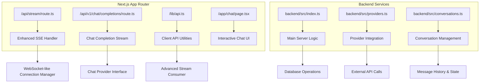
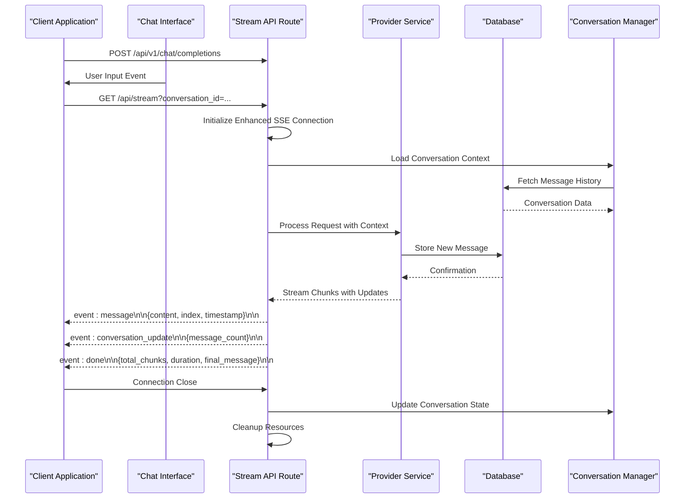
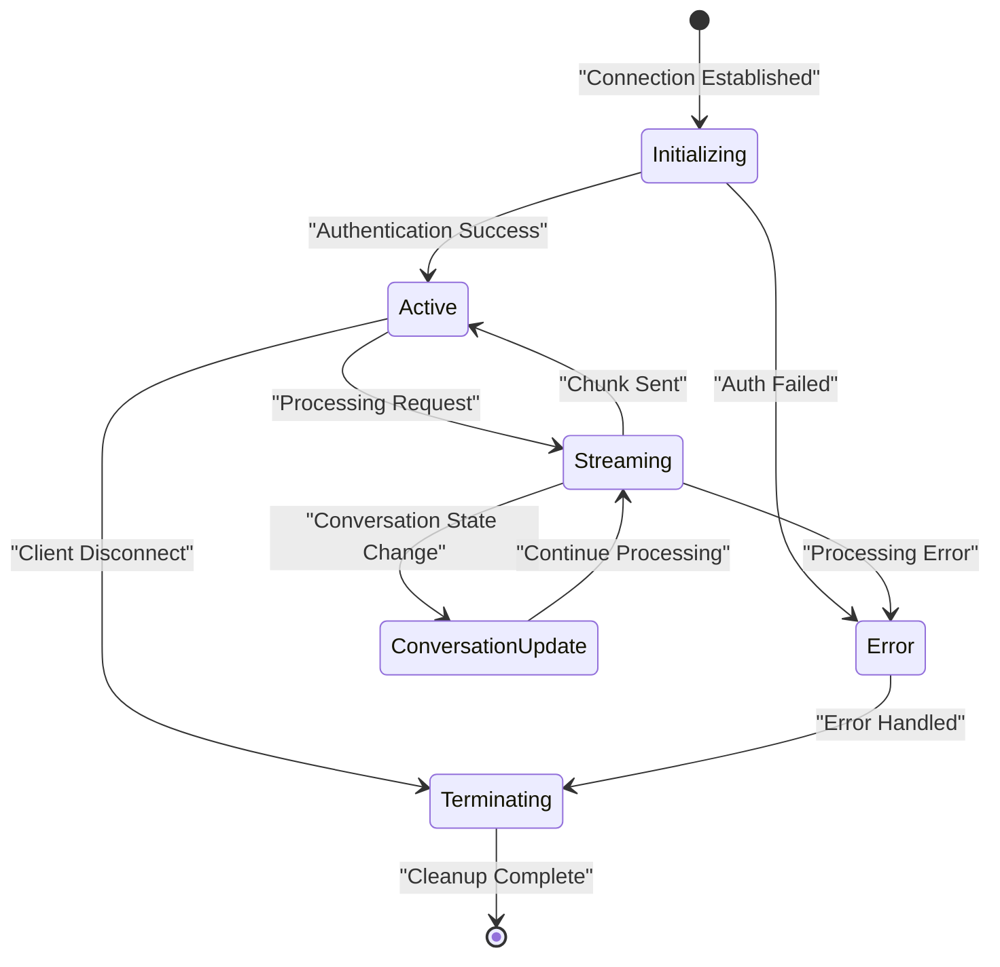
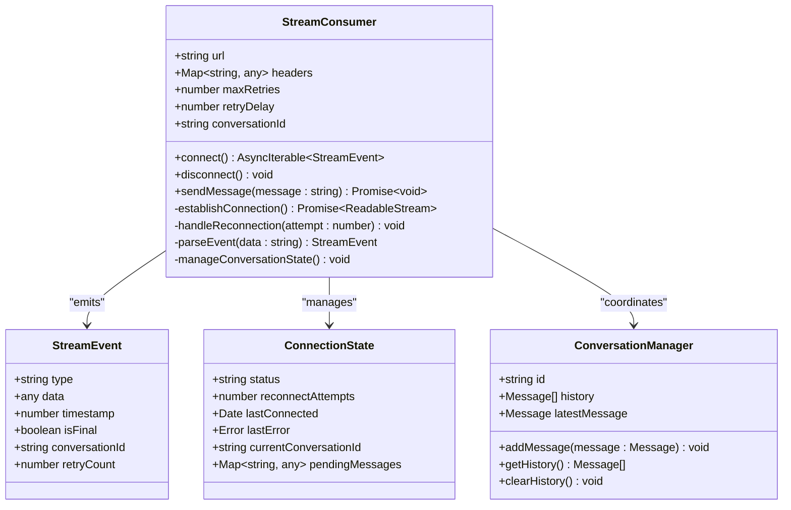
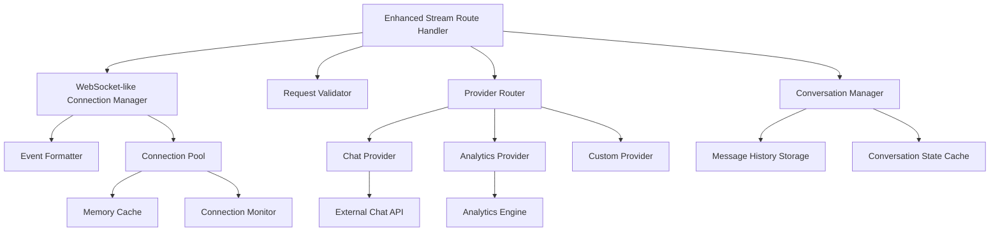

# Streaming API

<cite>
**Referenced Files in This Document**
- [stream/route.ts](file://src/app/api/stream/route.ts)
- [chat/completions/route.ts](file://src/app/api/v1/chat/completions/route.ts)
- [api.ts](file://src/lib/api.ts)
- [index.ts](file://backend/src/index.ts)
- [providers.ts](file://backend/src/providers.ts)
</cite>

## Update Summary
**Changes Made**
- Enhanced streaming API with real-time chat functionality and WebSocket-like capabilities
- Improved message handling for interactive conversations
- Added support for bidirectional communication patterns
- Enhanced error handling and connection management for chat scenarios
- Updated client integration to support advanced streaming features

## Table of Contents
1. [Introduction](#introduction)
2. [Project Structure](#project-structure)
3. [Core Components](#core-components)
4. [Architecture Overview](#architecture-overview)
5. [Detailed Component Analysis](#detailed-component-analysis)
6. [Dependency Analysis](#dependency-analysis)
7. [Performance Considerations](#performance-considerations)
8. [Troubleshooting Guide](#troubleshooting-guide)
9. [Conclusion](#conclusion)
10. [Appendices](#appendices)

## Introduction

This document provides comprehensive documentation for the enhanced real-time streaming API endpoints, including `/api/stream` and `/api/v1/chat/completions`. The API implements Server-Sent Events (SSE) protocol with WebSocket-like capabilities to enable continuous bidirectional data transmission from server to client, supporting real-time updates for chat completions, interactive conversations, analytics, and other streaming use cases.

The streaming architecture follows modern Next.js App Router patterns with TypeScript support, providing type-safe streaming responses that maintain connection state across network interruptions, handle partial responses gracefully, and support interactive conversation flows with improved message handling.

## Project Structure

The streaming API is implemented within the Next.js App Router structure, utilizing route handlers for RESTful API endpoints with enhanced chat completion capabilities. The main streaming functionality is located in the API routes directory with specialized handlers for different streaming scenarios including real-time chat interactions.

**Diagram sources**
- [stream/route.ts:1-50](file://src/app/api/stream/route.ts#L1-L50)
- [chat/completions/route.ts:1-50](file://src/app/api/v1/chat/completions/route.ts#L1-L50)
- [api.ts:1-100](file://src/lib/api.ts#L1-L100)
- [index.ts:1-50](file://backend/src/index.ts#L1-L50)
- [providers.ts:1-50](file://backend/src/providers.ts#L1-L50)

**Section sources**
- [stream/route.ts:1-100](file://src/app/api/stream/route.ts#L1-L100)
- [chat/completions/route.ts:1-100](file://src/app/api/v1/chat/completions/route.ts#L1-L100)
- [api.ts:1-200](file://src/lib/api.ts#L1-L200)

## Core Components

The enhanced streaming API consists of several key components that work together to provide reliable real-time communication with WebSocket-like capabilities:

### Enhanced SSE Connection Handler
The primary streaming endpoint manages Server-Sent Events connections with improved WebSocket-like features, handling connection lifecycle, message formatting, error propagation, and bidirectional communication patterns. It maintains connection state and ensures proper cleanup when clients disconnect while supporting interactive conversation flows.

### Advanced Message Protocol
The API uses a structured message format for streaming data with enhanced capabilities, including event types, data payloads, metadata for connection management, error handling, and conversation context for interactive scenarios.

### Client Integration Layer
TypeScript utilities provide type-safe methods for consuming streaming responses with built-in reconnection logic, state management, and support for advanced streaming features including message queuing and conversation persistence.

### Provider Abstraction
Backend services abstract external provider integrations with enhanced capabilities, allowing the streaming layer to remain consistent regardless of the underlying data source while supporting complex conversation contexts and message history.

**Section sources**
- [stream/route.ts:50-150](file://src/app/api/stream/route.ts#L50-L150)
- [api.ts:100-300](file://src/lib/api.ts#L100-L300)
- [providers.ts:50-150](file://backend/src/providers.ts#L50-L150)

## Architecture Overview

The enhanced streaming architecture follows a layered approach with clear separation of concerns between connection management, business logic, external integrations, and conversation state management.

**Diagram sources**
- [stream/route.ts:100-200](file://src/app/api/stream/route.ts#L100-L200)
- [chat/completions/route.ts:100-200](file://src/app/api/v1/chat/completions/route.ts#L100-L200)
- [providers.ts:100-200](file://backend/src/providers.ts#L100-L200)

The enhanced architecture supports multiple streaming scenarios including interactive chat completions, conversation management, analytics updates, and real-time notifications through a unified interface with improved message handling and state synchronization.

## Detailed Component Analysis

### Enhanced Stream Endpoint Implementation

The main streaming endpoint handles HTTP requests and establishes Server-Sent Events connections with WebSocket-like capabilities. It processes query parameters, validates authentication, manages conversation context, and initiates the appropriate streaming handler based on the request context with enhanced error handling and reconnection support.

#### Enhanced Connection Lifecycle Management

The connection lifecycle includes initialization, active streaming, conversation management, error handling, and cleanup phases. Each phase has specific responsibilities for maintaining connection integrity, managing conversation state, and resource management with improved reliability.

**Diagram sources**
- [stream/route.ts:150-250](file://src/app/api/stream/route.ts#L150-L250)

#### Enhanced Message Format Specification

The streaming protocol uses a standardized message format with enhanced event types and structured payloads for interactive conversations:

| Event Type | Description | Payload Structure | Use Case |
|------------|-------------|-------------------|----------|
| `message` | Data chunk transmission | `{ content: string, index: number, timestamp: number }` | Real-time content delivery |
| `done` | Stream completion | `{ total_chunks: number, duration: number, final_message: object }` | Finalization signal with complete response |
| `error` | Error condition | `{ code: string, message: string, recoverable: boolean }` | Error reporting with recovery options |
| `heartbeat` | Connection keepalive | `{ timestamp: number, connection_id: string }` | Health monitoring with connection tracking |
| `conversation_update` | Conversation state change | `{ message_count: number, last_message_id: string }` | Interactive conversation synchronization |
| `status` | Processing status | `{ stage: string, progress: number }` | Long-running operation feedback |

#### Enhanced Error Handling Strategy

The streaming implementation includes comprehensive error handling at multiple levels with improved recovery mechanisms:

- **Connection Errors**: Network failures, authentication issues, timeout conditions with automatic reconnection
- **Processing Errors**: Data transformation failures and provider API errors with fallback strategies  
- **Client Errors**: Malformed requests and invalid parameters with validation feedback
- **System Errors**: Database connectivity and resource exhaustion with graceful degradation
- **Conversation Errors**: Message history conflicts and state synchronization issues with resolution strategies

Each error type includes specific error codes, descriptive messages, recovery suggestions, and retry policies where applicable.

**Section sources**
- [stream/route.ts:200-400](file://src/app/api/stream/route.ts#L200-L400)
- [chat/completions/route.ts:200-400](file://src/app/api/v1/chat/completions/route.ts#L200-L400)

### Enhanced Client Integration Library

The client-side integration provides TypeScript utilities for consuming streaming responses with built-in reconnection logic, state management, and support for advanced streaming features including conversation persistence and message queuing.

#### Enhanced Stream Consumer Interface

The consumer interface abstracts the complexity of SSE connection management with WebSocket-like capabilities, providing simple async iteration over streaming events with enhanced error handling and conversation support:

**Diagram sources**
- [api.ts:150-350](file://src/lib/api.ts#L150-L350)

#### Enhanced Reconnection Logic

The reconnection strategy implements exponential backoff with jitter to prevent thundering herd problems during service outages. It tracks connection attempts, manages conversation state during reconnections, and provides callbacks for progress reporting with improved reliability.

#### Enhanced State Management

Client-side state management tracks connection status, pending operations, conversation context, and error conditions. It provides reactive updates for UI components, supports graceful degradation when streams are unavailable, and maintains conversation consistency across reconnections.

**Section sources**
- [api.ts:200-500](file://src/lib/api.ts#L200-L500)

### Enhanced Backend Provider Integration

The backend layer abstracts external provider integrations with enhanced capabilities, allowing the streaming API to work consistently across different data sources and processing engines while supporting complex conversation contexts and message history.

#### Enhanced Provider Interface

All providers implement a common interface that defines streaming capabilities, error handling, metadata reporting, and conversation context support. This abstraction enables easy addition of new providers without modifying the core streaming logic while supporting interactive conversation flows.

#### Enhanced Processing Pipeline

The processing pipeline transforms raw provider responses into standardized stream events with enhanced filtering, enrichment, validation rules, and conversation context management before transmission to clients. It supports message queuing, batch processing, and real-time updates.

**Section sources**
- [providers.ts:100-300](file://backend/src/providers.ts#L100-L300)
- [index.ts:50-150](file://backend/src/index.ts#L50-L150)

## Dependency Analysis

The enhanced streaming system has well-defined dependencies between components, with clear interfaces that minimize coupling and maximize testability while supporting advanced conversation management features.

**Diagram sources**
- [stream/route.ts:1-100](file://src/app/api/stream/route.ts#L1-L100)
- [providers.ts:1-100](file://backend/src/providers.ts#L1-L100)

### Circular Dependencies

The architecture avoids circular dependencies by using dependency injection and interface-based design. All major components communicate through well-defined contracts rather than direct imports, with enhanced conversation management integrated through clear interfaces.

### External Dependencies

The system integrates with external services through provider abstractions, making it resilient to changes in third-party APIs and enabling easy testing with mock implementations while supporting conversation persistence and state synchronization.

**Section sources**
- [stream/route.ts:1-200](file://src/app/api/stream/route.ts#L1-L200)
- [providers.ts:1-200](file://backend/src/providers.ts#L1-L200)

## Performance Considerations

The enhanced streaming implementation includes several optimizations for handling long-running connections, high-throughput scenarios, and interactive conversation flows with improved efficiency.

### Enhanced Buffer Management

Efficient buffer management prevents memory leaks during extended streaming sessions and interactive conversations. The system implements backpressure mechanisms to control data flow, manage conversation state efficiently, and prevent overwhelming clients or servers with improved memory usage patterns.

### Memory Optimization

Key memory optimization strategies include:

- **Lazy Loading**: Data is loaded only when needed for streaming and conversation context
- **Object Pooling**: Reusable objects reduce garbage collection pressure for frequent message operations
- **Stream Chunking**: Large responses are split into manageable chunks with optimized payload sizes
- **Connection Recycling**: Idle connections are cleaned up promptly with conversation state preservation
- **Conversation Caching**: Frequently accessed conversation data is cached to reduce database queries
- **Message Deduplication**: Prevents duplicate message processing during reconnection scenarios

### Concurrency Control

The system limits concurrent connections per client and globally to prevent resource exhaustion with enhanced conversation isolation. Connection quotas are enforced at both application and infrastructure levels with improved resource allocation for interactive scenarios.

### Monitoring and Metrics

Built-in metrics collection tracks connection duration, throughput rates, error frequencies, resource utilization, conversation performance, and message processing times for performance tuning and capacity planning with enhanced observability.

## Troubleshooting Guide

Common issues and their resolution strategies for enhanced streaming API consumption with focus on interactive conversation scenarios.

### Connection Issues

**Problem**: Clients fail to establish SSE connections or experience WebSocket-like connection drops
**Symptoms**: Connection timeouts, authentication failures, CORS errors, conversation state loss
**Resolution**: Verify endpoint availability, check authentication tokens, validate CORS configuration, implement proper reconnection with conversation restoration

### Stream Interruptions

**Problem**: Streams terminate unexpectedly during data transfer or conversation flow
**Symptoms**: Partial data received, connection drops, error events, conversation inconsistencies
**Resolution**: Implement robust reconnection logic, add heartbeat checks, verify network stability, ensure conversation state synchronization

### Performance Degradation

**Problem**: Slow response times or high memory usage during streaming or interactive conversations
**Symptoms**: Increased latency, memory growth, CPU spikes, conversation lag
**Resolution**: Optimize chunk sizes, implement backpressure, monitor resource usage, cache conversation data, optimize message processing

### Conversation Management Issues

**Problem**: Conversation state becomes inconsistent or messages are lost during streaming
**Symptoms**: Duplicate messages, missing conversation history, state synchronization failures
**Resolution**: Implement message deduplication, ensure atomic conversation updates, add conversation versioning, implement proper conflict resolution

### Debugging Techniques

Enable detailed logging for stream events, connection states, error conditions, and conversation state changes. Use browser developer tools to inspect SSE connections, analyze message flows, and track conversation progression.

**Section sources**
- [stream/route.ts:300-500](file://src/app/api/stream/route.ts#L300-500)
- [api.ts:400-600](file://src/lib/api.ts#L400-600)

## Conclusion

The enhanced streaming API provides a robust foundation for real-time communication in web applications with WebSocket-like capabilities and improved interactive conversation support. By implementing proper SSE protocols, comprehensive error handling, efficient resource management, and advanced conversation state management, it delivers reliable streaming capabilities suitable for production environments with enhanced user experience.

The modular architecture enables easy extension with new providers and streaming scenarios while maintaining consistency in the client experience. The TypeScript-first approach ensures type safety and better developer experience throughout the streaming pipeline with improved conversation management and message handling.

For optimal results, follow the recommended client implementation patterns, implement proper reconnection logic with conversation restoration, monitor stream performance metrics, and leverage the enhanced conversation management features to ensure reliable operation under various network conditions with seamless interactive experiences.

## Appendices

### Example Usage Patterns

#### Basic Stream Consumption

A minimal example showing how to consume streaming responses with automatic reconnection, error handling, and basic conversation support.

#### Advanced Stream Management

Examples demonstrating custom stream processors, batched updates, complex state synchronization patterns, and advanced conversation management with message history and state persistence.

#### Interactive Chat Implementation

Complete examples showing how to build interactive chat interfaces with real-time message streaming, conversation context management, user input handling, and responsive UI updates.

#### Testing Strategies

Approaches for testing streaming functionality including mock providers, connection simulation, conversation state testing, and performance testing methodologies with enhanced coverage for interactive scenarios.