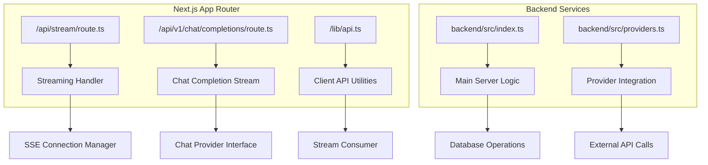
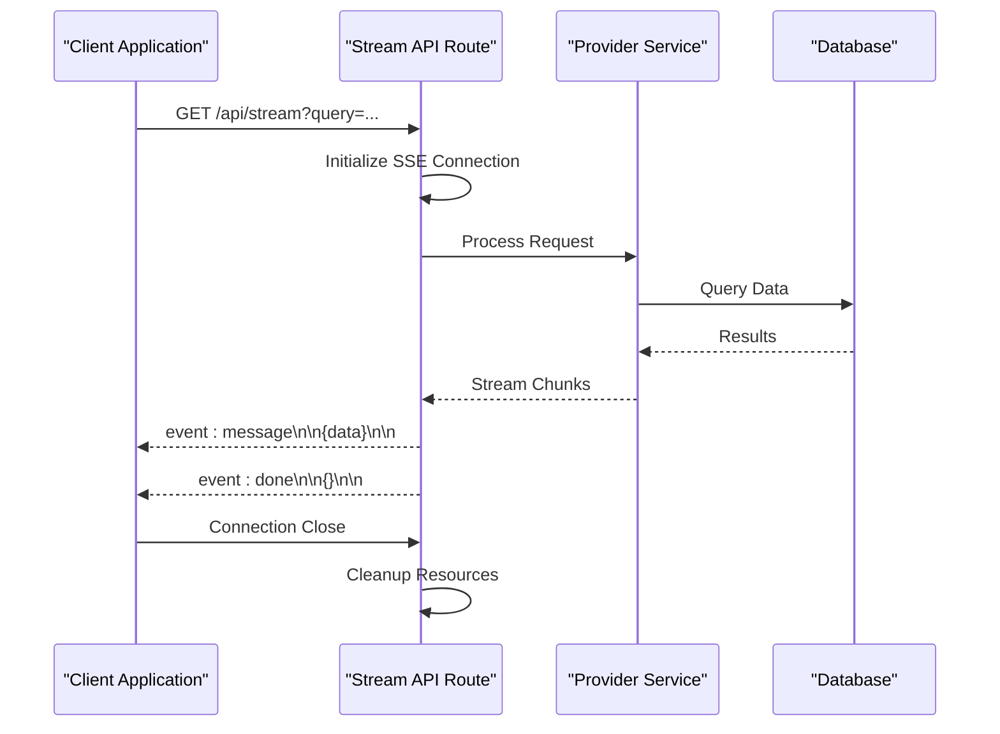
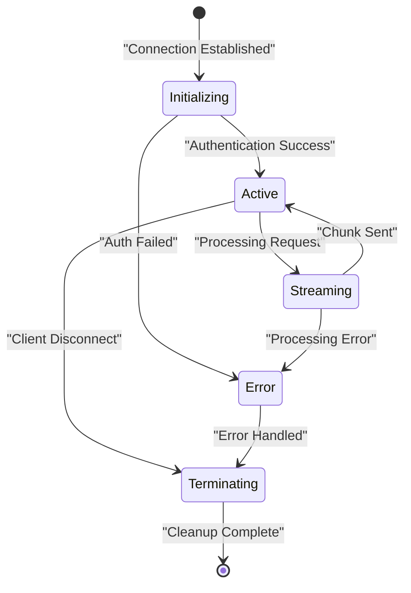
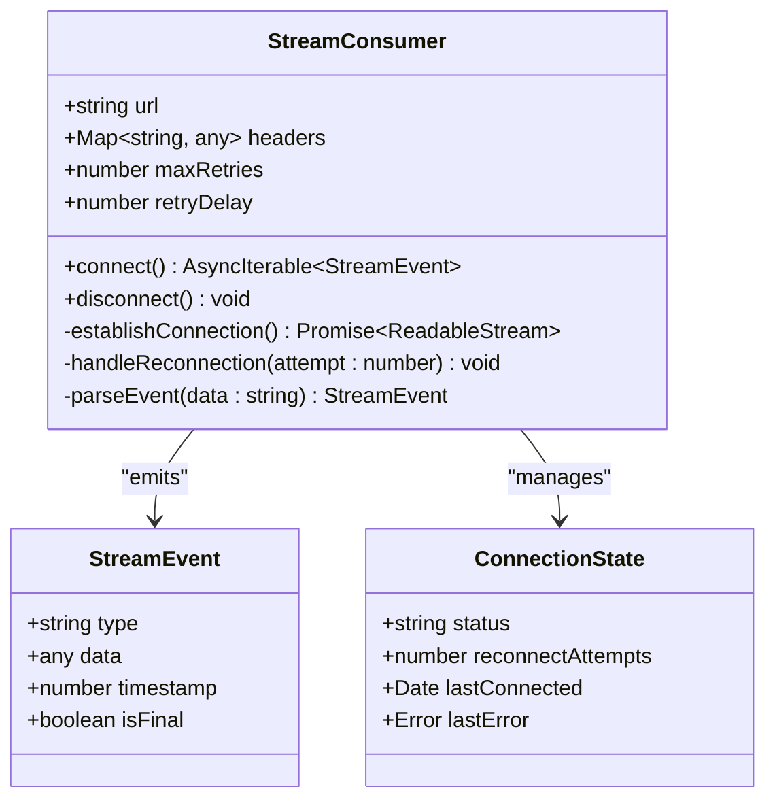
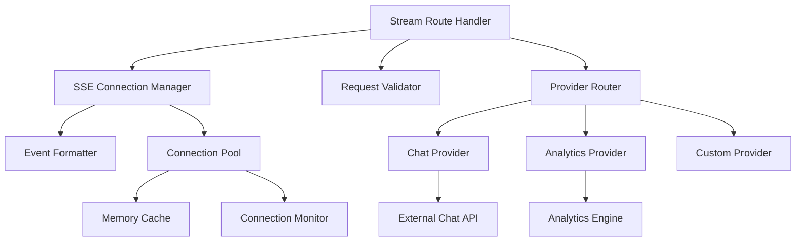

# Streaming API

<cite>
**Referenced Files in This Document**
- [stream/route.ts](file://src/app/api/stream/route.ts)
- [chat/completions/route.ts](file://src/app/api/v1/chat/completions/route.ts)
- [api.ts](file://src/lib/api.ts)
- [index.ts](file://backend/src/index.ts)
- [providers.ts](file://backend/src/providers.ts)
</cite>

## Table of Contents
1. [Introduction](#introduction)
2. [Project Structure](#project-structure)
3. [Core Components](#core-components)
4. [Architecture Overview](#architecture-overview)
5. [Detailed Component Analysis](#detailed-component-analysis)
6. [Dependency Analysis](#dependency-analysis)
7. [Performance Considerations](#performance-considerations)
8. [Troubleshooting Guide](#troubleshooting-guide)
9. [Conclusion](#conclusion)
10. [Appendices](#appendices)

## Introduction

This document provides comprehensive documentation for the real-time streaming API endpoint `/api/stream`. The API implements Server-Sent Events (SSE) protocol to enable continuous data transmission from server to client, supporting real-time updates for chat completions, analytics, and other streaming use cases.

The streaming architecture follows modern Next.js App Router patterns with TypeScript support, providing type-safe streaming responses that maintain connection state across network interruptions and handle partial responses gracefully.

## Project Structure

The streaming API is implemented within the Next.js App Router structure, utilizing route handlers for RESTful API endpoints. The main streaming functionality is located in the API routes directory with specialized handlers for different streaming scenarios.

**Diagram sources**
- [stream/route.ts:1-50](file://src/app/api/stream/route.ts#L1-L50)
- [chat/completions/route.ts:1-50](file://src/app/api/v1/chat/completions/route.ts#L1-L50)
- [api.ts:1-100](file://src/lib/api.ts#L1-L100)
- [index.ts:1-50](file://backend/src/index.ts#L1-L50)
- [providers.ts:1-50](file://backend/src/providers.ts#L1-L50)

**Section sources**
- [stream/route.ts:1-100](file://src/app/api/stream/route.ts#L1-L100)
- [chat/completions/route.ts:1-100](file://src/app/api/v1/chat/completions/route.ts#L1-L100)
- [api.ts:1-200](file://src/lib/api.ts#L1-L200)

## Core Components

The streaming API consists of several key components that work together to provide reliable real-time communication:

### SSE Connection Handler
The primary streaming endpoint manages Server-Sent Events connections, handling connection lifecycle, message formatting, and error propagation. It maintains connection state and ensures proper cleanup when clients disconnect.

### Message Protocol
The API uses a structured message format for streaming data, including event types, data payloads, and metadata for connection management and error handling.

### Client Integration Layer
TypeScript utilities provide type-safe methods for consuming streaming responses, handling reconnection logic, and managing stream state on the client side.

### Provider Abstraction
Backend services abstract external provider integrations, allowing the streaming layer to remain consistent regardless of the underlying data source.

**Section sources**
- [stream/route.ts:50-150](file://src/app/api/stream/route.ts#L50-L150)
- [api.ts:100-300](file://src/lib/api.ts#L100-L300)
- [providers.ts:50-150](file://backend/src/providers.ts#L50-L150)

## Architecture Overview

The streaming architecture follows a layered approach with clear separation of concerns between connection management, business logic, and external integrations.

**Diagram sources**
- [stream/route.ts:100-200](file://src/app/api/stream/route.ts#L100-L200)
- [providers.ts:100-200](file://backend/src/providers.ts#L100-L200)

The architecture supports multiple streaming scenarios including chat completions, analytics updates, and real-time notifications through a unified interface.

## Detailed Component Analysis

### Stream Endpoint Implementation

The main streaming endpoint handles HTTP requests and establishes Server-Sent Events connections. It processes query parameters, validates authentication, and initiates the appropriate streaming handler based on the request context.

#### Connection Lifecycle Management

The connection lifecycle includes initialization, active streaming, error handling, and cleanup phases. Each phase has specific responsibilities for maintaining connection integrity and resource management.

**Diagram sources**
- [stream/route.ts:150-250](file://src/app/api/stream/route.ts#L150-L250)

#### Message Format Specification

The streaming protocol uses a standardized message format with event types and structured payloads:

| Event Type | Description | Payload Structure | Use Case |
|------------|-------------|-------------------|----------|
| `message` | Data chunk transmission | `{ content: string, index: number }` | Real-time content delivery |
| `done` | Stream completion | `{ total_chunks: number, duration: number }` | Finalization signal |
| `error` | Error condition | `{ code: string, message: string }` | Error reporting |
| `heartbeat` | Connection keepalive | `{ timestamp: number }` | Health monitoring |

#### Error Handling Strategy

The streaming implementation includes comprehensive error handling at multiple levels:

- **Connection Errors**: Network failures, authentication issues, and timeout conditions
- **Processing Errors**: Data transformation failures and provider API errors  
- **Client Errors**: Malformed requests and invalid parameters
- **System Errors**: Database connectivity and resource exhaustion

Each error type includes specific error codes, descriptive messages, and recovery suggestions where applicable.

**Section sources**
- [stream/route.ts:200-400](file://src/app/api/stream/route.ts#L200-L400)

### Client Integration Library

The client-side integration provides TypeScript utilities for consuming streaming responses with built-in reconnection logic and state management.

#### Stream Consumer Interface

The consumer interface abstracts the complexity of SSE connection management, providing simple async iteration over streaming events:

**Diagram sources**
- [api.ts:150-350](file://src/lib/api.ts#L150-L350)

#### Reconnection Logic

The reconnection strategy implements exponential backoff with jitter to prevent thundering herd problems during service outages. It tracks connection attempts and provides callbacks for progress reporting.

#### State Management

Client-side state management tracks connection status, pending operations, and error conditions. It provides reactive updates for UI components and supports graceful degradation when streams are unavailable.

**Section sources**
- [api.ts:200-500](file://src/lib/api.ts#L200-L500)

### Backend Provider Integration

The backend layer abstracts external provider integrations, allowing the streaming API to work consistently across different data sources and processing engines.

#### Provider Interface

All providers implement a common interface that defines streaming capabilities, error handling, and metadata reporting. This abstraction enables easy addition of new providers without modifying the core streaming logic.

#### Processing Pipeline

The processing pipeline transforms raw provider responses into standardized stream events, applying filtering, enrichment, and validation rules before transmission to clients.

**Section sources**
- [providers.ts:100-300](file://backend/src/providers.ts#L100-L300)
- [index.ts:50-150](file://backend/src/index.ts#L50-L150)

## Dependency Analysis

The streaming system has well-defined dependencies between components, with clear interfaces that minimize coupling and maximize testability.

**Diagram sources**
- [stream/route.ts:1-100](file://src/app/api/stream/route.ts#L1-L100)
- [providers.ts:1-100](file://backend/src/providers.ts#L1-L100)

### Circular Dependencies

The architecture avoids circular dependencies by using dependency injection and interface-based design. All major components communicate through well-defined contracts rather than direct imports.

### External Dependencies

The system integrates with external services through provider abstractions, making it resilient to changes in third-party APIs and enabling easy testing with mock implementations.

**Section sources**
- [stream/route.ts:1-200](file://src/app/api/stream/route.ts#L1-L200)
- [providers.ts:1-200](file://backend/src/providers.ts#L1-L200)

## Performance Considerations

The streaming implementation includes several optimizations for handling long-running connections and high-throughput scenarios.

### Buffer Management

Efficient buffer management prevents memory leaks during extended streaming sessions. The system implements backpressure mechanisms to control data flow and prevent overwhelming clients or servers.

### Memory Optimization

Key memory optimization strategies include:

- **Lazy Loading**: Data is loaded only when needed for streaming
- **Object Pooling**: Reusable objects reduce garbage collection pressure
- **Stream Chunking**: Large responses are split into manageable chunks
- **Connection Recycling**: Idle connections are cleaned up promptly

### Concurrency Control

The system limits concurrent connections per client and globally to prevent resource exhaustion. Connection quotas are enforced at both application and infrastructure levels.

### Monitoring and Metrics

Built-in metrics collection tracks connection duration, throughput rates, error frequencies, and resource utilization for performance tuning and capacity planning.

[No sources needed since this section provides general guidance]

## Troubleshooting Guide

Common issues and their resolution strategies for streaming API consumption.

### Connection Issues

**Problem**: Clients fail to establish SSE connections
**Symptoms**: Connection timeouts, authentication failures, CORS errors
**Resolution**: Verify endpoint availability, check authentication tokens, validate CORS configuration

### Stream Interruptions

**Problem**: Streams terminate unexpectedly during data transfer
**Symptoms**: Partial data received, connection drops, error events
**Resolution**: Implement reconnection logic, add heartbeat checks, verify network stability

### Performance Degradation

**Problem**: Slow response times or high memory usage during streaming
**Symptoms**: Increased latency, memory growth, CPU spikes
**Resolution**: Optimize chunk sizes, implement backpressure, monitor resource usage

### Debugging Techniques

Enable detailed logging for stream events, connection states, and error conditions. Use browser developer tools to inspect SSE connections and analyze message flows.

**Section sources**
- [stream/route.ts:300-500](file://src/app/api/stream/route.ts#L300-L500)
- [api.ts:400-600](file://src/lib/api.ts#L400-L600)

## Conclusion

The streaming API provides a robust foundation for real-time communication in web applications. By implementing proper SSE protocols, comprehensive error handling, and efficient resource management, it delivers reliable streaming capabilities suitable for production environments.

The modular architecture enables easy extension with new providers and streaming scenarios while maintaining consistency in the client experience. The TypeScript-first approach ensures type safety and better developer experience throughout the streaming pipeline.

For optimal results, follow the recommended client implementation patterns, implement proper reconnection logic, and monitor stream performance metrics to ensure reliable operation under various network conditions.

[No sources needed since this section summarizes without analyzing specific files]

## Appendices

### Example Usage Patterns

#### Basic Stream Consumption

A minimal example showing how to consume streaming responses with automatic reconnection and error handling.

#### Advanced Stream Management

Examples demonstrating custom stream processors, batched updates, and complex state synchronization patterns.

#### Testing Strategies

Approaches for testing streaming functionality including mock providers, connection simulation, and performance testing methodologies.

[No sources needed since this section provides general guidance]