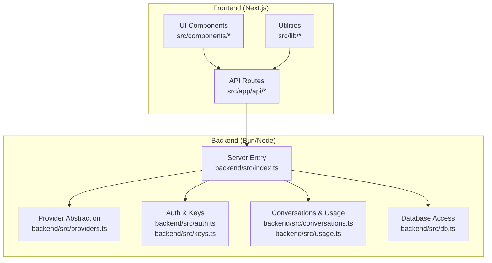
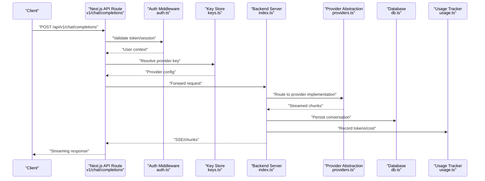
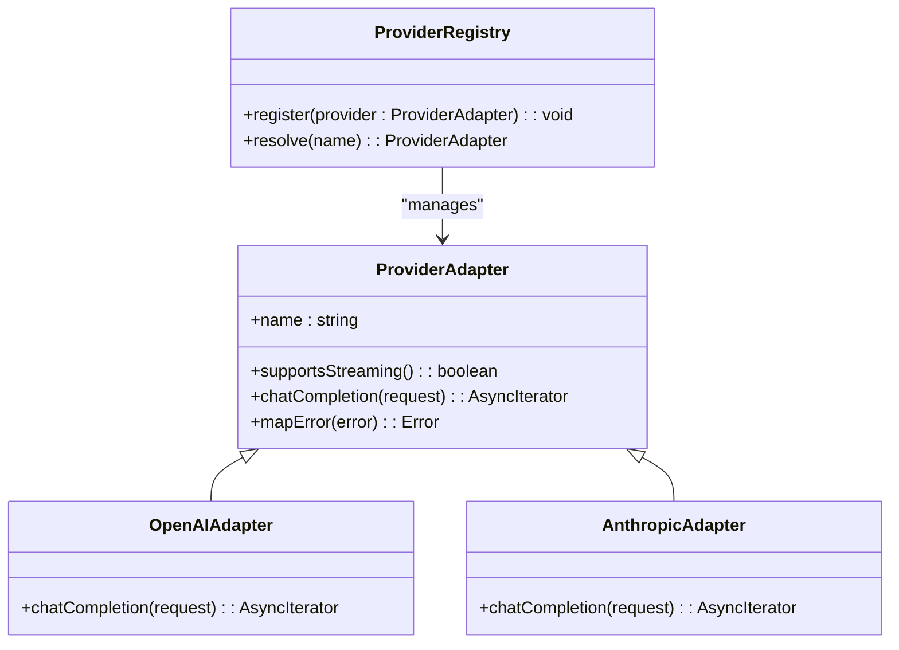
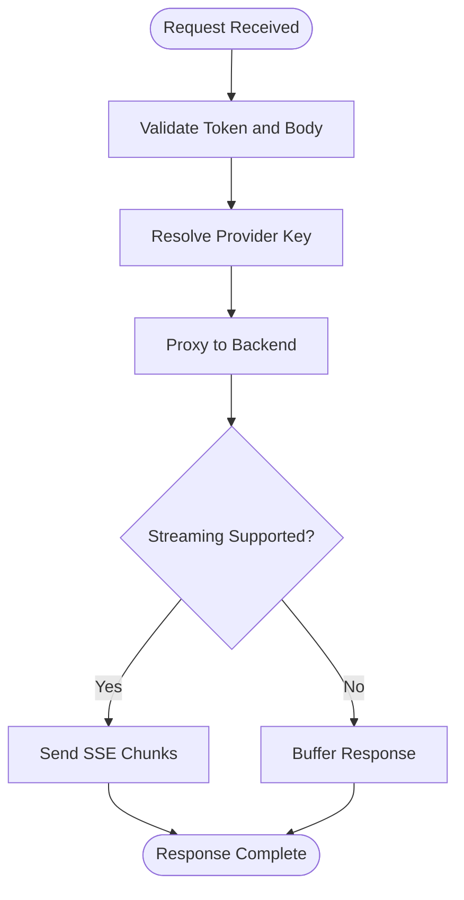
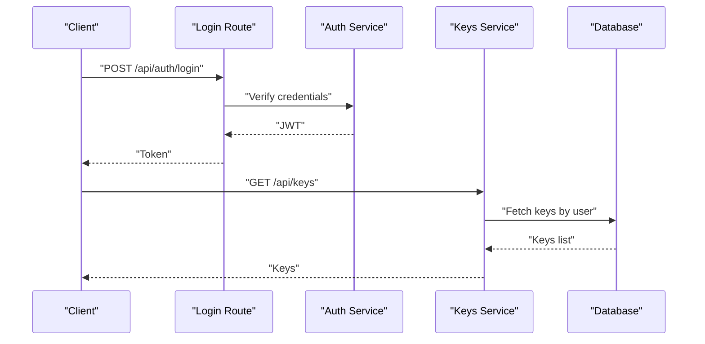
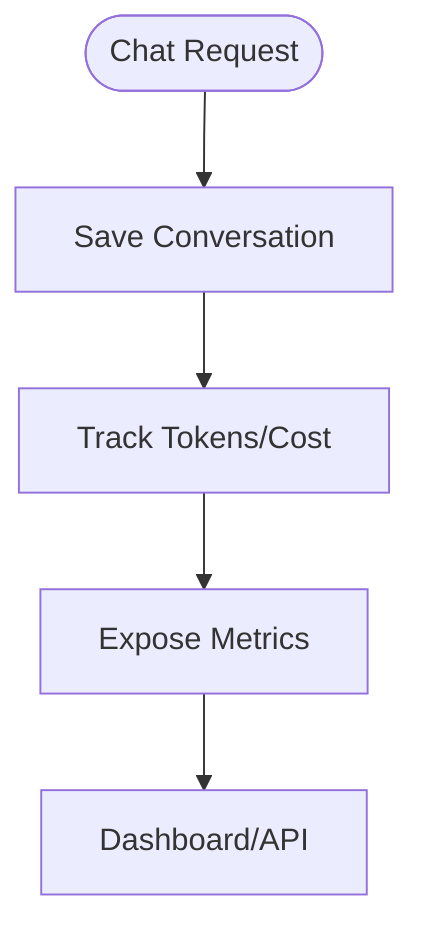
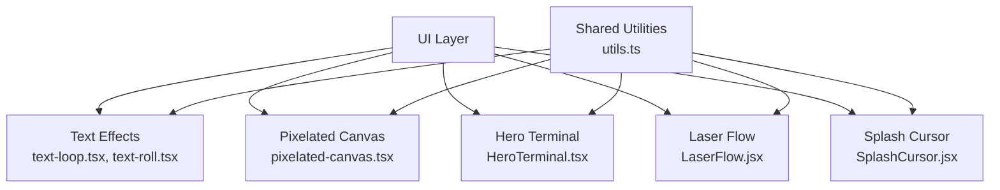
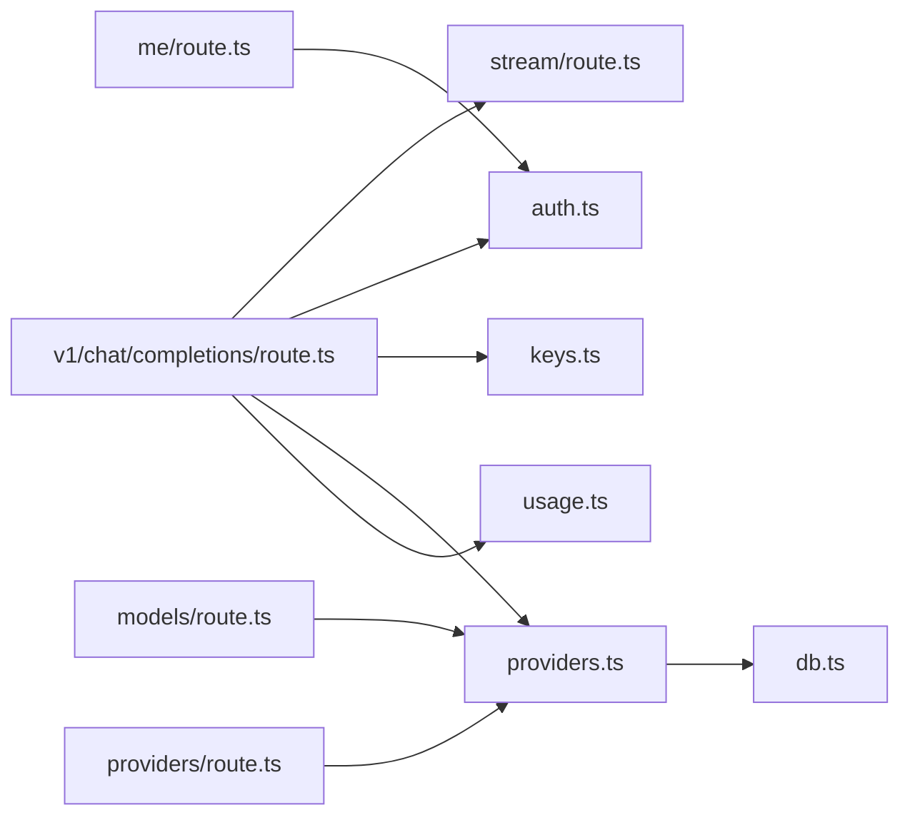

# Advanced Topics

<cite>
**Referenced Files in This Document**
- [backend/src/providers.ts](file://backend/src/providers.ts)
- [backend/src/index.ts](file://backend/src/index.ts)
- [backend/src/auth.ts](file://backend/src/auth.ts)
- [backend/src/keys.ts](file://backend/src/keys.ts)
- [backend/src/conversations.ts](file://backend/src/conversations.ts)
- [backend/src/db.ts](file://backend/src/db.ts)
- [backend/src/usage.ts](file://backend/src/usage.ts)
- [src/app/api/v1/chat/completions/route.ts](file://src/app/api/v1/chat/completions/route.ts)
- [src/app/api/stream/route.ts](file://src/app/api/stream/route.ts)
- [src/app/api/providers/route.ts](file://src/app/api/providers/route.ts)
- [src/app/api/providers/[id]/route.ts](file://src/app/api/providers/[id]/route.ts)
- [src/app/api/models/route.ts](file://src/app/api/models/route.ts)
- [src/app/api/analytics/route.ts](file://src/app/api/analytics/route.ts)
- [src/app/api/me/route.ts](file://src/app/api/me/route.ts)
- [src/app/api/auth/login/route.ts](file://src/app/api/auth/login/route.ts)
- [src/app/api/auth/signup/route.ts](file://src/app/api/auth/signup/route.ts)
- [src/app/api/keys/route.ts](file://src/app/api/keys/route.ts)
- [src/app/api/keys/[id]/route.ts](file://src/app/api/keys/[id]/route.ts)
- [src/components/ui/pixelated-canvas.tsx](file://src/components/ui/pixelated-canvas.tsx)
- [src/components/HeroTerminal.tsx](file://src/components/HeroTerminal.tsx)
- [src/components/LaserFlow.jsx](file://src/components/LaserFlow.jsx)
- [src/components/SplashCursor.jsx](file://src/components/SplashCursor.jsx)
- [src/components/core/text-loop.tsx](file://src/components/core/text-loop.tsx)
- [src/components/core/text-roll.tsx](file://src/components/core/text-roll.tsx)
- [src/components/PixelatedCanvasDemo.tsx](file://src/components/PixelatedCanvasDemo.tsx)
- [src/lib/utils.ts](file://src/lib/utils.ts)
- [next.config.ts](file://next.config.ts)
</cite>

## Table of Contents
1. Introduction
2. Project Structure
3. Core Components
4. Architecture Overview
5. Detailed Component Analysis
6. Dependency Analysis
7. Performance Considerations
8. Troubleshooting Guide
9. Conclusion
10. Appendices

## Introduction
This document provides expert-level guidance for extending the AI provider abstraction, optimizing performance and scaling, building advanced animations and interactive components, and implementing robust debugging, monitoring, security hardening, and production strategies. It is designed to help you customize the system for complex deployments while maintaining reliability and performance.

## Project Structure
The project follows a Next.js App Router frontend with a separate backend service:
- Frontend (Next.js): API routes under src/app/api, UI components under src/components, configuration under src/config, and shared utilities under src/lib.
- Backend (Bun/Node): Server entry point, authentication, keys management, provider orchestration, conversations, usage tracking, and database access under backend/src.

[No sources needed since this diagram shows conceptual workflow, not actual code structure]

## Core Components
- Provider Abstraction Layer: Centralizes model routing, request normalization, streaming, and error handling across different AI providers.
- API Gateway: Next.js API routes that authenticate requests, validate inputs, proxy to the backend, and stream responses.
- Authentication and Keys: JWT-based auth and per-user API key management for secure access control.
- Conversations and Usage Tracking: Persisted conversation history and usage metrics for billing and analytics.
- Interactive UI Components: Canvas-based visuals, text effects, and terminal-style interactions.

**Section sources**
- [backend/src/providers.ts](file://backend/src/providers.ts)
- [backend/src/index.ts](file://backend/src/index.ts)
- [backend/src/auth.ts](file://backend/src/auth.ts)
- [backend/src/keys.ts](file://backend/src/keys.ts)
- [backend/src/conversations.ts](file://backend/src/conversations.ts)
- [backend/src/usage.ts](file://backend/src/usage.ts)
- [src/app/api/v1/chat/completions/route.ts](file://src/app/api/v1/chat/completions/route.ts)
- [src/app/api/stream/route.ts](file://src/app/api/stream/route.ts)

## Architecture Overview
The system integrates an OpenAI-compatible chat completions endpoint with a pluggable provider layer. The frontend exposes API routes that enforce authentication and rate limiting before delegating to the backend. Streaming responses are handled via server-sent events or chunked transfer.

**Diagram sources**
- [src/app/api/v1/chat/completions/route.ts](file://src/app/api/v1/chat/completions/route.ts)
- [backend/src/index.ts](file://backend/src/index.ts)
- [backend/src/auth.ts](file://backend/src/auth.ts)
- [backend/src/keys.ts](file://backend/src/keys.ts)
- [backend/src/providers.ts](file://backend/src/providers.ts)
- [backend/src/conversations.ts](file://backend/src/conversations.ts)
- [backend/src/usage.ts](file://backend/src/usage.ts)
- [backend/src/db.ts](file://backend/src/db.ts)

## Detailed Component Analysis

### Custom AI Providers: Extending the Abstraction Layer
Implementing a new provider involves:
- Defining a provider adapter that normalizes input and output formats.
- Implementing streaming support using Readable streams or async iterators.
- Mapping provider-specific errors to a unified error schema.
- Registering the provider in the provider registry and configuration.

**Diagram sources**
- [backend/src/providers.ts](file://backend/src/providers.ts)

Implementation checklist:
- Normalize messages, tools, and parameters to the provider’s expected schema.
- Handle retries, timeouts, and backoff policies.
- Emit structured logs for observability.
- Ensure idempotency where applicable.

**Section sources**
- [backend/src/providers.ts](file://backend/src/providers.ts)

### API Gateway and Streaming
The v1 chat completions route enforces authentication, resolves provider keys, and proxies requests to the backend. Streaming is implemented via server-sent events or chunked responses.

**Diagram sources**
- [src/app/api/v1/chat/completions/route.ts](file://src/app/api/v1/chat/completions/route.ts)
- [src/app/api/stream/route.ts](file://src/app/api/stream/route.ts)

**Section sources**
- [src/app/api/v1/chat/completions/route.ts](file://src/app/api/v1/chat/completions/route.ts)
- [src/app/api/stream/route.ts](file://src/app/api/stream/route.ts)

### Authentication and Keys Management
Authentication uses JWT or session-based mechanisms. Keys are scoped per user and can be rotated or revoked.

**Diagram sources**
- [src/app/api/auth/login/route.ts](file://src/app/api/auth/login/route.ts)
- [backend/src/auth.ts](file://backend/src/auth.ts)
- [backend/src/keys.ts](file://backend/src/keys.ts)
- [backend/src/db.ts](file://backend/src/db.ts)

**Section sources**
- [backend/src/auth.ts](file://backend/src/auth.ts)
- [backend/src/keys.ts](file://backend/src/keys.ts)
- [src/app/api/auth/login/route.ts](file://src/app/api/auth/login/route.ts)
- [src/app/api/keys/route.ts](file://src/app/api/keys/route.ts)
- [src/app/api/keys/[id]/route.ts](file://src/app/api/keys/[id]/route.ts)

### Conversations and Usage Tracking
Conversations are persisted with metadata, and usage metrics are recorded for cost accounting and analytics.

**Diagram sources**
- [backend/src/conversations.ts](file://backend/src/conversations.ts)
- [backend/src/usage.ts](file://backend/src/usage.ts)
- [src/app/api/analytics/route.ts](file://src/app/api/analytics/route.ts)

**Section sources**
- [backend/src/conversations.ts](file://backend/src/conversations.ts)
- [backend/src/usage.ts](file://backend/src/usage.ts)
- [src/app/api/analytics/route.ts](file://src/app/api/analytics/route.ts)

### Animation and Interactive Component System
Advanced visual features include canvas-based animations, text effects, and terminal-like interactions.

- Pixelated Canvas: High-performance rendering with pixel manipulation.
- Hero Terminal: Simulated terminal typing and command execution.
- Laser Flow and Splash Cursor: Particle systems and cursor trails.
- Text Loop and Text Roll: Animated text transitions.

**Diagram sources**
- [src/components/ui/pixelated-canvas.tsx](file://src/components/ui/pixelated-canvas.tsx)
- [src/components/HeroTerminal.tsx](file://src/components/HeroTerminal.tsx)
- [src/components/LaserFlow.jsx](file://src/components/LaserFlow.jsx)
- [src/components/SplashCursor.jsx](file://src/components/SplashCursor.jsx)
- [src/components/core/text-loop.tsx](file://src/components/core/text-loop.tsx)
- [src/components/core/text-roll.tsx](file://src/components/core/text-roll.tsx)
- [src/lib/utils.ts](file://src/lib/utils.ts)

**Section sources**
- [src/components/ui/pixelated-canvas.tsx](file://src/components/ui/pixelated-canvas.tsx)
- [src/components/HeroTerminal.tsx](file://src/components/HeroTerminal.tsx)
- [src/components/LaserFlow.jsx](file://src/components/LaserFlow.jsx)
- [src/components/SplashCursor.jsx](file://src/components/SplashCursor.jsx)
- [src/components/core/text-loop.tsx](file://src/components/core/text-loop.tsx)
- [src/components/core/text-roll.tsx](file://src/components/core/text-roll.tsx)
- [src/components/PixelatedCanvasDemo.tsx](file://src/components/PixelatedCanvasDemo.tsx)
- [src/lib/utils.ts](file://src/lib/utils.ts)

## Dependency Analysis
The following diagram highlights key dependencies between API routes, backend services, and data layers.

**Diagram sources**
- [src/app/api/v1/chat/completions/route.ts](file://src/app/api/v1/chat/completions/route.ts)
- [src/app/api/stream/route.ts](file://src/app/api/stream/route.ts)
- [src/app/api/models/route.ts](file://src/app/api/models/route.ts)
- [src/app/api/providers/route.ts](file://src/app/api/providers/route.ts)
- [src/app/api/me/route.ts](file://src/app/api/me/route.ts)
- [backend/src/auth.ts](file://backend/src/auth.ts)
- [backend/src/keys.ts](file://backend/src/keys.ts)
- [backend/src/providers.ts](file://backend/src/providers.ts)
- [backend/src/db.ts](file://backend/src/db.ts)
- [backend/src/usage.ts](file://backend/src/usage.ts)

**Section sources**
- [src/app/api/v1/chat/completions/route.ts](file://src/app/api/v1/chat/completions/route.ts)
- [src/app/api/stream/route.ts](file://src/app/api/stream/route.ts)
- [src/app/api/models/route.ts](file://src/app/api/models/route.ts)
- [src/app/api/providers/route.ts](file://src/app/api/providers/route.ts)
- [src/app/api/me/route.ts](file://src/app/api/me/route.ts)
- [backend/src/auth.ts](file://backend/src/auth.ts)
- [backend/src/keys.ts](file://backend/src/keys.ts)
- [backend/src/providers.ts](file://backend/src/providers.ts)
- [backend/src/db.ts](file://backend/src/db.ts)
- [backend/src/usage.ts](file://backend/src/usage.ts)

## Performance Considerations
- Streaming Optimization: Prefer server-sent events or chunked transfer to reduce latency and memory pressure.
- Connection Pooling: Reuse HTTP connections to providers; configure timeouts and retry budgets.
- Caching Strategies:
  - Cache model listings and provider capabilities at startup or on change.
  - Use short-lived caches for frequent prompts with TTLs.
  - Avoid caching sensitive payloads; cache only normalized, non-sensitive metadata.
- Scaling Considerations:
  - Horizontal scaling behind a load balancer; ensure stateless API routes.
  - Offload heavy computations to workers or background jobs.
  - Rate limit per user and per key; implement backpressure for streaming.
- Database Efficiency:
  - Index frequently queried fields (user_id, created_at).
  - Paginate large datasets; use read replicas if necessary.
- Frontend Rendering:
  - Debounce high-frequency updates in canvas animations.
  - Use requestAnimationFrame efficiently; avoid layout thrashing.

[No sources needed since this section provides general guidance]

## Troubleshooting Guide
Common issues and diagnostics:
- Authentication Failures: Verify token issuance, expiration, and secret rotation. Check login and me endpoints.
- Provider Errors: Inspect provider mapping and error normalization; log raw provider responses safely.
- Streaming Interruptions: Monitor SSE connection health; implement client-side reconnection logic.
- Usage Mismatch: Cross-check recorded tokens against provider billing reports; audit usage logs.
- Performance Degradation: Profile API routes and backend handlers; identify slow provider calls and DB queries.

Operational checks:
- Health endpoints and readiness probes.
- Structured logging with correlation IDs.
- Metrics collection for latency, error rates, and throughput.

**Section sources**
- [backend/src/auth.ts](file://backend/src/auth.ts)
- [backend/src/providers.ts](file://backend/src/providers.ts)
- [backend/src/usage.ts](file://backend/src/usage.ts)
- [src/app/api/me/route.ts](file://src/app/api/me/route.ts)
- [src/app/api/v1/chat/completions/route.ts](file://src/app/api/v1/chat/completions/route.ts)

## Conclusion
By extending the provider abstraction, optimizing streaming and caching, and leveraging robust UI components, you can build a scalable, secure, and performant AI platform. Adopt comprehensive monitoring and security practices to maintain reliability in production environments.

[No sources needed since this section summarizes without analyzing specific files]

## Appendices

### Security Hardening Guidelines
- Enforce HTTPS and secure cookies; rotate secrets regularly.
- Validate and sanitize all inputs; apply strict CORS policies.
- Scope API keys to minimal permissions; implement key rotation and revocation.
- Apply rate limiting and abuse detection at the gateway.
- Audit logs for sensitive data; redact PII and secrets.

[No sources needed since this section provides general guidance]

### Deployment Optimization
- Containerize both frontend and backend; use immutable images.
- Configure CDN for static assets; enable compression.
- Use environment-based feature flags for gradual rollouts.
- Implement blue/green or canary deployments.

[No sources needed since this section provides general guidance]

### Production Monitoring Strategies
- Collect application metrics (latency, error rates, throughput).
- Track provider-specific metrics (token usage, cost, failure reasons).
- Set up alerts for anomalies and SLO breaches.
- Maintain runbooks for common incidents.

[No sources needed since this section provides general guidance]