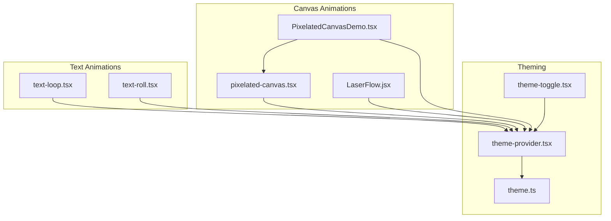
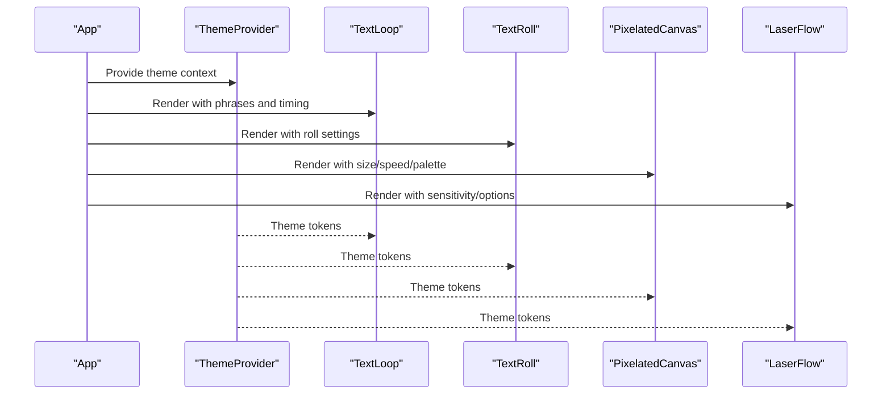
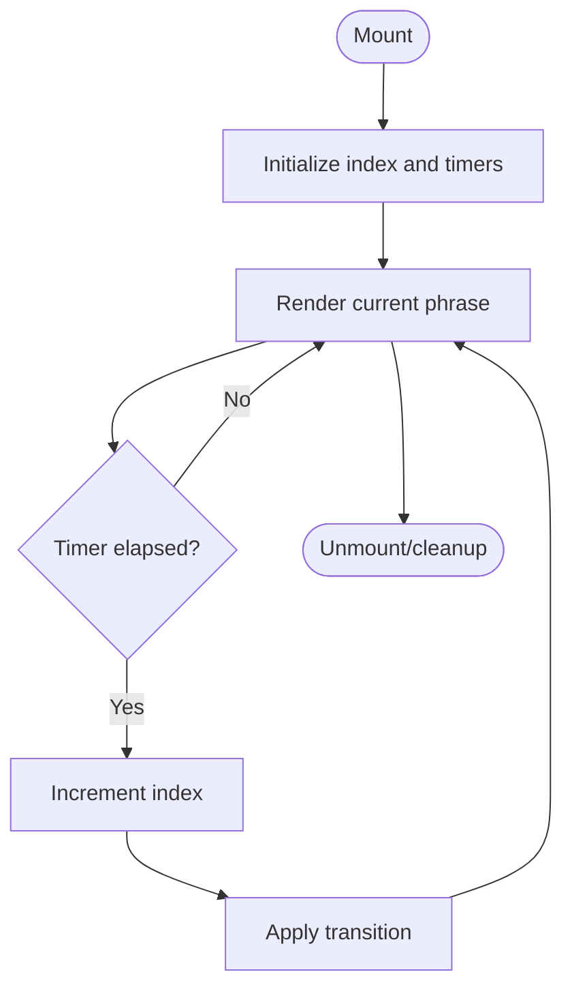
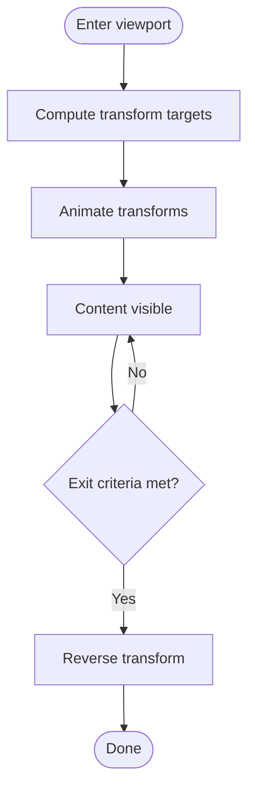
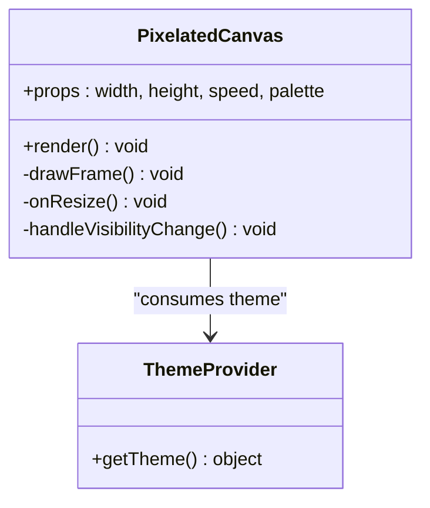
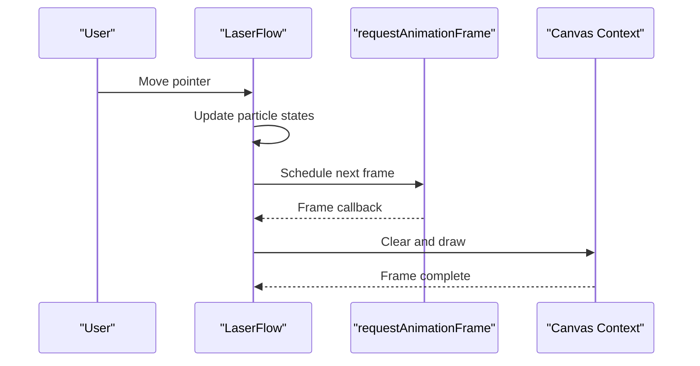
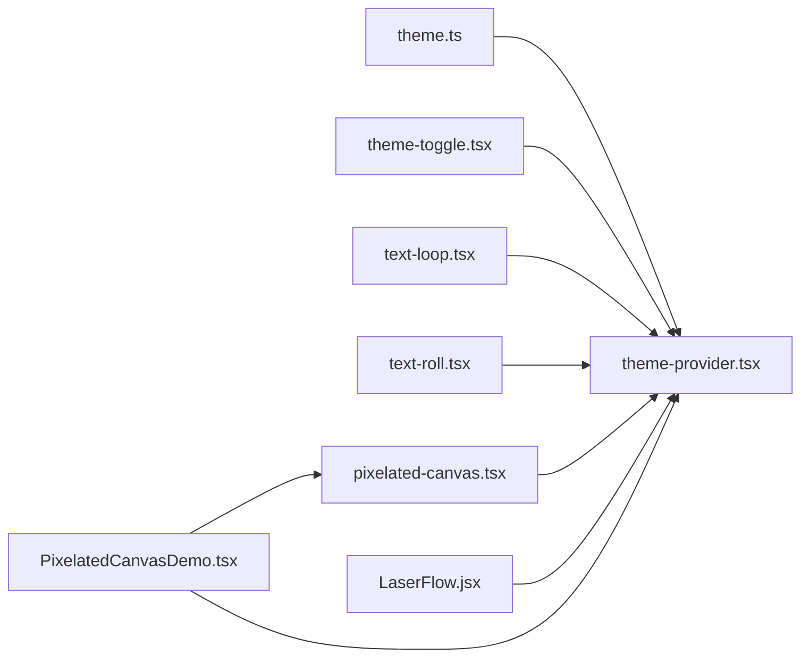

# Animation and Interactive Components

<cite>
**Referenced Files in This Document**
- [text-loop.tsx](file://src/components/core/text-loop.tsx)
- [text-roll.tsx](file://src/components/core/text-roll.tsx)
- [pixelated-canvas.tsx](file://src/components/ui/pixelated-canvas.tsx)
- [LaserFlow.jsx](file://src/components/LaserFlow.jsx)
- [PixelatedCanvasDemo.tsx](file://src/components/PixelatedCanvasDemo.tsx)
- [theme-provider.tsx](file://src/components/theme-provider.tsx)
- [theme-toggle.tsx](file://src/components/theme-toggle.tsx)
- [theme.ts](file://src/config/theme.ts)
</cite>

## Table of Contents
1. [Introduction](#introduction)
2. [Project Structure](#project-structure)
3. [Core Components](#core-components)
4. [Architecture Overview](#architecture-overview)
5. [Detailed Component Analysis](#detailed-component-analysis)
6. [Dependency Analysis](#dependency-analysis)
7. [Performance Considerations](#performance-considerations)
8. [Accessibility Considerations](#accessibility-considerations)
9. [Customization and Theming](#customization-and-theming)
10. [Integration Patterns](#integration-patterns)
11. [Troubleshooting Guide](#troubleshooting-guide)
12. [Conclusion](#conclusion)

## Introduction
This document explains the animation and interactive component system with a focus on:
- Text animations: text-loop and text-roll
- Canvas-based animations: LaserFlow and PixelatedCanvas
- Performance optimization, browser compatibility, and accessibility
- Customization options, theming support, and integration patterns
- How to create custom animations and extend existing components

The goal is to help you understand how these components work, how to use them effectively, and how to build new animations that are performant, accessible, and theme-aware.

## Project Structure
Animation-related code is organized into two main areas:
- Core text animation primitives under src/components/core
- UI-level canvas animations and demos under src/components/ui and src/components

**Diagram sources**
- [text-loop.tsx](file://src/components/core/text-loop.tsx)
- [text-roll.tsx](file://src/components/core/text-roll.tsx)
- [pixelated-canvas.tsx](file://src/components/ui/pixelated-canvas.tsx)
- [LaserFlow.jsx](file://src/components/LaserFlow.jsx)
- [PixelatedCanvasDemo.tsx](file://src/components/PixelatedCanvasDemo.tsx)
- [theme-provider.tsx](file://src/components/theme-provider.tsx)
- [theme-toggle.tsx](file://src/components/theme-toggle.tsx)
- [theme.ts](file://src/config/theme.ts)

**Section sources**
- [text-loop.tsx](file://src/components/core/text-loop.tsx)
- [text-roll.tsx](file://src/components/core/text-roll.tsx)
- [pixelated-canvas.tsx](file://src/components/ui/pixelated-canvas.tsx)
- [LaserFlow.jsx](file://src/components/LaserFlow.jsx)
- [PixelatedCanvasDemo.tsx](file://src/components/PixelatedCanvasDemo.tsx)
- [theme-provider.tsx](file://src/components/theme-provider.tsx)
- [theme-toggle.tsx](file://src/components/theme-toggle.tsx)
- [theme.ts](file://src/config/theme.ts)

## Core Components
- Text Loop: Cycles through an array of phrases with smooth transitions. It typically uses React state and requestAnimationFrame or CSS transitions for timing control.
- Text Roll: Displays text with a rolling or scrolling effect, often used for headlines or hero sections. It may animate vertical offsets or clip regions.
- Pixelated Canvas: A canvas-based animation that renders pixel-art style visuals. It manages a canvas element, draws frames via requestAnimationFrame, and exposes props for size, speed, and palette.
- LaserFlow: A canvas-based particle/flow animation that simulates laser-like motion across the screen. It handles pointer/mouse events, updates particles, and redraws each frame.

These components share common concerns:
- Rendering lifecycle (mount/unmount)
- Animation loop management (start/stop)
- Responsive sizing and device pixel ratio handling
- Accessibility (reduced motion, aria attributes)
- Theme integration (colors, contrast)

**Section sources**
- [text-loop.tsx](file://src/components/core/text-loop.tsx)
- [text-roll.tsx](file://src/components/core/text-roll.tsx)
- [pixelated-canvas.tsx](file://src/components/ui/pixelated-canvas.tsx)
- [LaserFlow.jsx](file://src/components/LaserFlow.jsx)

## Architecture Overview
The animation system follows a layered approach:
- Presentation layer: TextLoop and TextRoll render DOM nodes and rely on lightweight JS/CSS transitions.
- Canvas layer: PixelatedCanvas and LaserFlow manage offscreen buffers and draw frames at high frequency.
- Theming layer: ThemeProvider supplies colors and tokens; components consume theme values to adapt visuals.
- Demo layer: PixelatedCanvasDemo composes PixelatedCanvas with controls and examples.

**Diagram sources**
- [theme-provider.tsx](file://src/components/theme-provider.tsx)
- [text-loop.tsx](file://src/components/core/text-loop.tsx)
- [text-roll.tsx](file://src/components/core/text-roll.tsx)
- [pixelated-canvas.tsx](file://src/components/ui/pixelated-canvas.tsx)
- [LaserFlow.jsx](file://src/components/LaserFlow.jsx)

## Detailed Component Analysis

### Text Loop
Responsibilities:
- Maintain current phrase index and transition state
- Trigger next phrase after a delay or on interaction
- Respect reduced motion preferences
- Use theme-aware colors and typography

Key behaviors:
- Interval or RAF-driven cycling
- Optional fade or slide transitions
- Pause on hover/focus for readability

**Diagram sources**
- [text-loop.tsx](file://src/components/core/text-loop.tsx)

**Section sources**
- [text-loop.tsx](file://src/components/core/text-loop.tsx)

### Text Roll
Responsibilities:
- Animate text entry/exit with a rolling effect
- Control direction, duration, and easing
- Support multiple lines or stacked items

Key behaviors:
- Transform-based animation for performance
- Staggered timing for multi-line content
- Keyboard navigation and focus management

**Diagram sources**
- [text-roll.tsx](file://src/components/core/text-roll.tsx)

**Section sources**
- [text-roll.tsx](file://src/components/core/text-roll.tsx)

### Pixelated Canvas
Responsibilities:
- Manage a <canvas> element and drawing context
- Run an animation loop using requestAnimationFrame
- Draw pixelated visuals based on internal state and props
- Handle resize, DPR scaling, and visibility changes

Key behaviors:
- Debounced resize handling
- Offscreen buffer when needed
- Throttling or frame capping for performance

**Diagram sources**
- [pixelated-canvas.tsx](file://src/components/ui/pixelated-canvas.tsx)
- [theme-provider.tsx](file://src/components/theme-provider.tsx)

**Section sources**
- [pixelated-canvas.tsx](file://src/components/ui/pixelated-canvas.tsx)

### LaserFlow
Responsibilities:
- Simulate flowing laser-like particles
- Respond to pointer/mouse movement
- Update positions and redraw frames efficiently

Key behaviors:
- Particle pool and velocity vectors
- Easing and trail effects
- Pointer event throttling

**Diagram sources**
- [LaserFlow.jsx](file://src/components/LaserFlow.jsx)

**Section sources**
- [LaserFlow.jsx](file://src/components/LaserFlow.jsx)

### PixelatedCanvasDemo
Responsibilities:
- Showcase PixelatedCanvas with configurable options
- Provide controls for speed, palette, and size
- Demonstrate integration with theme toggles

Usage pattern:
- Wrap with ThemeProvider
- Pass theme-derived colors to PixelatedCanvas
- Expose user controls to update props

**Section sources**
- [PixelatedCanvasDemo.tsx](file://src/components/PixelatedCanvasDemo.tsx)
- [theme-provider.tsx](file://src/components/theme-provider.tsx)
- [theme-toggle.tsx](file://src/components/theme-toggle.tsx)

## Dependency Analysis
High-level dependencies among animation components and theming:

**Diagram sources**
- [theme.ts](file://src/config/theme.ts)
- [theme-provider.tsx](file://src/components/theme-provider.tsx)
- [theme-toggle.tsx](file://src/components/theme-toggle.tsx)
- [text-loop.tsx](file://src/components/core/text-loop.tsx)
- [text-roll.tsx](file://src/components/core/text-roll.tsx)
- [pixelated-canvas.tsx](file://src/components/ui/pixelated-canvas.tsx)
- [LaserFlow.jsx](file://src/components/LaserFlow.jsx)
- [PixelatedCanvasDemo.tsx](file://src/components/PixelatedCanvasDemo.tsx)

**Section sources**
- [theme.ts](file://src/config/theme.ts)
- [theme-provider.tsx](file://src/components/theme-provider.tsx)
- [theme-toggle.tsx](file://src/components/theme-toggle.tsx)
- [text-loop.tsx](file://src/components/core/text-loop.tsx)
- [text-roll.tsx](file://src/components/core/text-roll.tsx)
- [pixelated-canvas.tsx](file://src/components/ui/pixelated-canvas.tsx)
- [LaserFlow.jsx](file://src/components/LaserFlow.jsx)
- [PixelatedCanvasDemo.tsx](file://src/components/PixelatedCanvasDemo.tsx)

## Performance Considerations
- Prefer transform and opacity animations for DOM-based effects to leverage GPU acceleration.
- Use requestAnimationFrame for canvas loops; avoid setInterval for precise timing.
- Cap frame rates where appropriate (e.g., throttle to 30–60 fps).
- Reduce work when the tab is hidden or the component is off-screen (visibility change listeners).
- Scale canvases by devicePixelRatio for crisp rendering without overdraw.
- Debounce resize handlers; recalculate only when necessary.
- Avoid heavy allocations inside the animation loop; reuse objects and arrays.
- For text animations, batch state updates and minimize re-renders.

[No sources needed since this section provides general guidance]

## Accessibility Considerations
- Respect prefers-reduced-motion: disable or simplify animations when requested.
- Ensure keyboard operability for interactive animations (focus management, activation keys).
- Provide meaningful labels and roles for animated regions (aria-live, aria-label).
- Maintain sufficient color contrast for all themes and modes.
- Offer pause/resume controls for long-running animations.
- Announce state changes for dynamic text (e.g., rotating phrases) using aria-live regions.

[No sources needed since this section provides general guidance]

## Customization and Theming
- Centralize design tokens in theme.ts and expose them via theme-provider.tsx.
- Consume theme values in components to derive colors, fonts, and spacing.
- Allow overrides via props while falling back to theme defaults.
- Integrate theme-toggle.tsx to switch between light/dark palettes at runtime.
- For canvas animations, pass theme-derived palettes and adjust brightness/contrast accordingly.

Best practices:
- Keep animation durations and easings consistent with brand tokens.
- Provide semantic prop names (e.g., primaryColor, accentColor) mapped to theme variables.
- Validate theme availability before rendering to prevent flash-of-unstyled-content.

**Section sources**
- [theme.ts](file://src/config/theme.ts)
- [theme-provider.tsx](file://src/components/theme-provider.tsx)
- [theme-toggle.tsx](file://src/components/theme-toggle.tsx)
- [pixelated-canvas.tsx](file://src/components/ui/pixelated-canvas.tsx)
- [LaserFlow.jsx](file://src/components/LaserFlow.jsx)

## Integration Patterns
- Compose TextLoop and TextRoll within page layouts to highlight key messaging.
- Embed PixelatedCanvas or LaserFlow as background layers behind content; ensure z-index and pointer-events are configured so they do not block interactions.
- Use PixelatedCanvasDemo as a reference implementation for wiring controls and theme integration.
- Wrap application or feature sections with ThemeProvider to propagate theme tokens.

Example references:
- See [PixelatedCanvasDemo.tsx](file://src/components/PixelatedCanvasDemo.tsx) for a working composition.
- See [theme-provider.tsx](file://src/components/theme-provider.tsx) for context usage.

**Section sources**
- [PixelatedCanvasDemo.tsx](file://src/components/PixelatedCanvasDemo.tsx)
- [theme-provider.tsx](file://src/components/theme-provider.tsx)

## Troubleshooting Guide
Common issues and resolutions:
- Canvas appears blurry: Ensure proper devicePixelRatio scaling and correct canvas dimensions.
- Janky animations: Check for heavy operations inside the animation loop; move calculations outside or cache results.
- High CPU usage: Throttle pointer events and cap frame rate; stop animations when hidden.
- Reduced motion not respected: Verify media query checks and conditional logic around animation start.
- Theme colors not applied: Confirm theme context is provided and components read from it rather than hard-coded values.
- Interactions blocked by canvas: Adjust pointer-events or z-index so underlying elements remain clickable.

[No sources needed since this section provides general guidance]

## Conclusion
The animation system combines lightweight text animations with powerful canvas-based effects, unified by a theming layer. By following the performance, accessibility, and customization guidelines outlined here, you can build engaging experiences that are robust, efficient, and inclusive. Use the demo and core components as starting points for creating your own animations and extending the system to fit your product needs.

[No sources needed since this section summarizes without analyzing specific files]