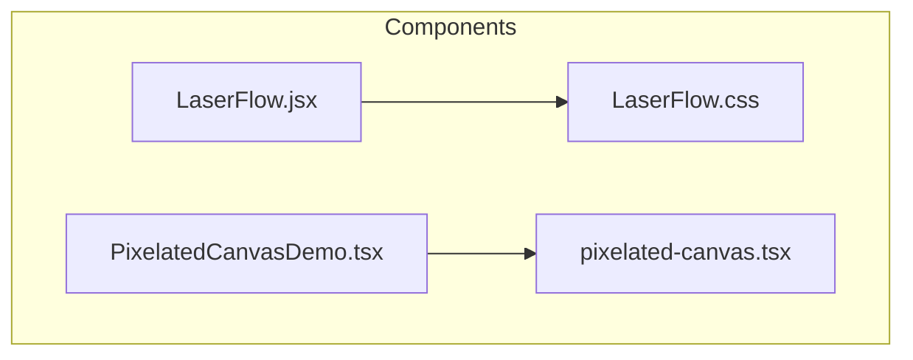
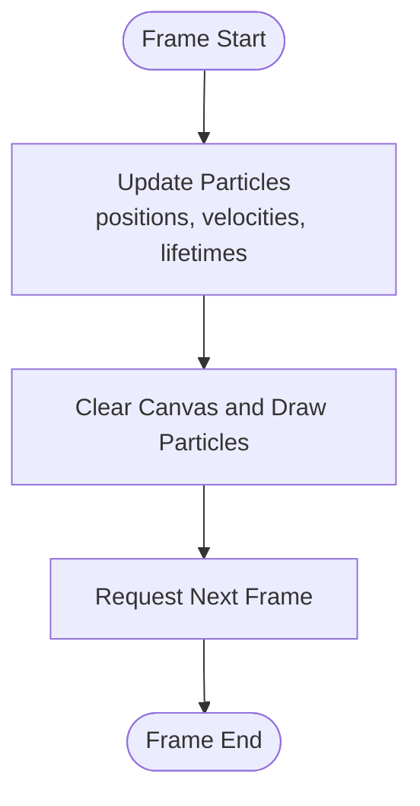
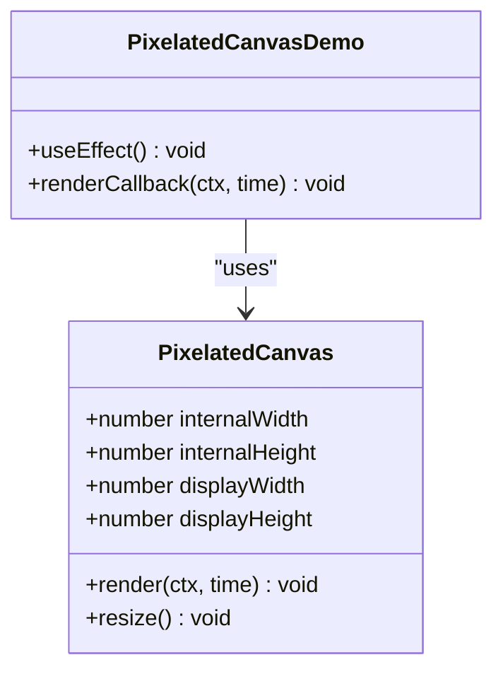
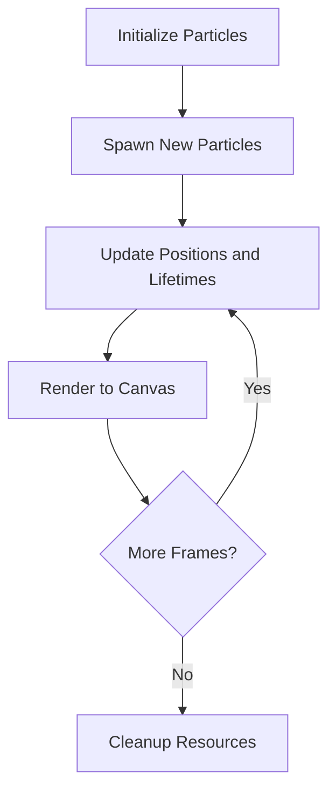
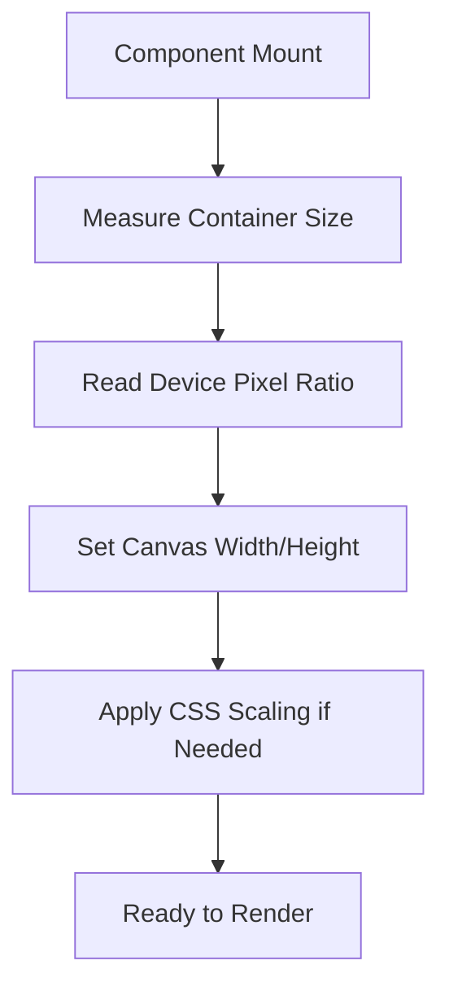
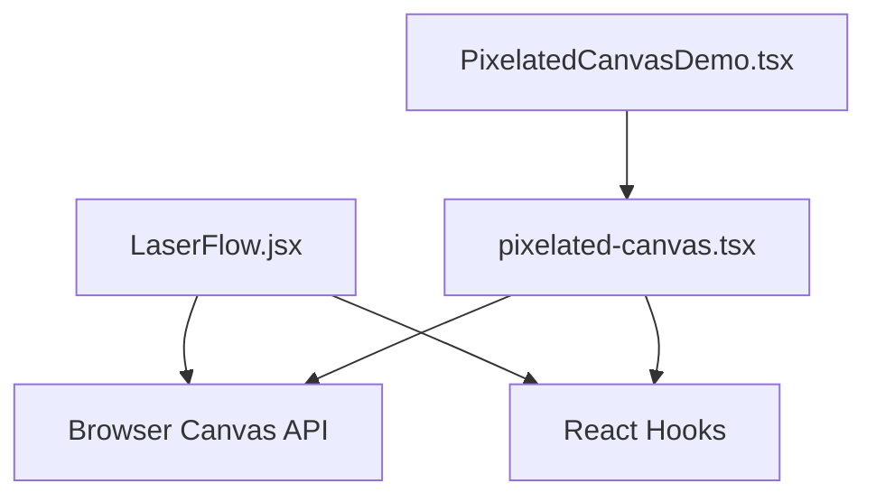

# Canvas-based Animations

<cite>
**Referenced Files in This Document**
- [LaserFlow.jsx](file://src/components/LaserFlow.jsx)
- [LaserFlow.css](file://src/components/LaserFlow.css)
- [pixelated-canvas.tsx](file://src/components/ui/pixelated-canvas.tsx)
- [PixelatedCanvasDemo.tsx](file://src/components/PixelatedCanvasDemo.tsx)
</cite>

## Table of Contents
1. [Introduction](#introduction)
2. [Project Structure](#project-structure)
3. [Core Components](#core-components)
4. [Architecture Overview](#architecture-overview)
5. [Detailed Component Analysis](#detailed-component-analysis)
6. [Dependency Analysis](#dependency-analysis)
7. [Performance Considerations](#performance-considerations)
8. [Troubleshooting Guide](#troubleshooting-guide)
9. [Conclusion](#conclusion)
10. [Appendices](#appendices)

## Introduction
This document explains canvas-based animation implementations in the project, focusing on two key components: LaserFlow and PixelatedCanvas. It covers rendering techniques, performance optimization strategies, memory management, particle systems, flow animations, pixel manipulation effects, responsive sizing, touch interaction handling, cross-browser compatibility, and integration with React component lifecycle. The goal is to help you understand how these components work and how to create custom canvas animations that are performant and accessible across devices.

## Project Structure
The relevant files for canvas-based animations are located under src/components and src/components/ui:
- LaserFlow.jsx: Implements a laser-like flow animation using canvas.
- LaserFlow.css: Styles associated with the LaserFlow container.
- pixelated-canvas.tsx: A reusable pixelated canvas component with configurable resolution and scaling.
- PixelatedCanvasDemo.tsx: A demo page integrating the PixelatedCanvas component.



**Diagram sources**
- [LaserFlow.jsx](file://src/components/LaserFlow.jsx)
- [LaserFlow.css](file://src/components/LaserFlow.css)
- [pixelated-canvas.tsx](file://src/components/ui/pixelated-canvas.tsx)
- [PixelatedCanvasDemo.tsx](file://src/components/PixelatedCanvasDemo.tsx)

**Section sources**
- [LaserFlow.jsx](file://src/components/LaserFlow.jsx)
- [LaserFlow.css](file://src/components/LaserFlow.css)
- [pixelated-canvas.tsx](file://src/components/ui/pixelated-canvas.tsx)
- [PixelatedCanvasDemo.tsx](file://src/components/PixelatedCanvasDemo.tsx)

## Core Components
- LaserFlow: A canvas-driven flow animation that simulates laser-like trails or particles moving along paths. It typically manages an animation loop, updates particle positions, and renders frames efficiently.
- PixelatedCanvas: A flexible canvas wrapper that allows rendering at a lower internal resolution and scaling up visually, enabling pixel-art style effects and improved performance on high-DPI displays.

Key responsibilities:
- Lifecycle management: Initialize canvas, start/stop animation loops, handle resize events, and clean up resources.
- Rendering pipeline: Clear frame buffer, update state (particles/flow), draw shapes or pixels, and commit to screen.
- Responsiveness: Adjust canvas size based on container dimensions and device pixel ratio.
- Interaction: Capture mouse/touch events to influence animation behavior.

**Section sources**
- [LaserFlow.jsx](file://src/components/LaserFlow.jsx)
- [pixelated-canvas.tsx](file://src/components/ui/pixelated-canvas.tsx)

## Architecture Overview
At a high level, both components follow a similar pattern:
- Mount phase: Create or obtain a canvas element, set context, configure resolution and scaling, and initialize state.
- Update phase: On each frame, compute new positions/effects and redraw.
- Resize phase: Recalculate canvas dimensions and internal buffers when the container changes.
- Unmount phase: Cancel animation frames, release references, and prevent memory leaks.

```mermaid
sequenceDiagram
participant R as "React Component"
participant C as "Canvas Element"
participant CTX as "2D Context"
participant LOOP as "Animation Loop"
R->>C : "Create/Attach Canvas"
R->>CTX : "Get Context and Configure"
R->>LOOP : "Start Animation Frame"
LOOP->>R : "Update State (Particles/Flow)"
LOOP->>CTX : "Draw Frame"
R-->>LOOP : "Resize/Interaction Events"
R->>LOOP : "Stop Animation Frame on Unmount"
```

[No sources needed since this diagram shows conceptual workflow, not actual code structure]

## Detailed Component Analysis

### LaserFlow Component
LaserFlow implements a flow animation using canvas. It likely uses a particle system where each particle has position, velocity, color, and lifetime. The animation loop updates particle states and draws them to the canvas to produce a flowing effect.

Key aspects:
- Particle system: Array of particles with properties such as position, velocity, opacity, and trail length.
- Flow dynamics: Forces or easing functions guide movement; optional attraction to pointers or boundaries.
- Rendering: Batch drawing operations per frame; use globalAlpha or composite operations for glow/trail effects.
- Performance: Limit particle count, reuse objects, avoid allocations inside the loop, and throttle updates if needed.
- Responsiveness: Recompute bounds and scale factors on resize; adjust particle spawn rates accordingly.
- Interactions: Mouse/touch coordinates can attract or repel particles, creating interactive flows.



**Diagram sources**
- [LaserFlow.jsx](file://src/components/LaserFlow.jsx)

**Section sources**
- [LaserFlow.jsx](file://src/components/LaserFlow.jsx)
- [LaserFlow.css](file://src/components/LaserFlow.css)

### PixelatedCanvas Component
PixelatedCanvas provides a scalable canvas abstraction that renders at a lower internal resolution and scales up visually. This approach yields crisp pixel-art aesthetics and reduces GPU/CPU load by lowering pixel counts.

Key aspects:
- Internal resolution vs display size: Set a smaller width/height internally while using CSS to scale up to the container size.
- Device pixel ratio: Account for DPR to ensure sharpness without overdraw.
- Pixel manipulation: Use ImageData or direct pixel writes for effects like dithering, palette swaps, or retro filters.
- Reusability: Accept props for resolution, scaling mode, and render callback.
- Integration: Used by PixelatedCanvasDemo to showcase pixelated visuals.



**Diagram sources**
- [pixelated-canvas.tsx](file://src/components/ui/pixelated-canvas.tsx)
- [PixelatedCanvasDemo.tsx](file://src/components/PixelatedCanvasDemo.tsx)

**Section sources**
- [pixelated-canvas.tsx](file://src/components/ui/pixelated-canvas.tsx)
- [PixelatedCanvasDemo.tsx](file://src/components/PixelatedCanvasDemo.tsx)

### Conceptual Overview
The following diagrams illustrate general patterns used across canvas animations in the project.

#### Particle System Flow


[No sources needed since this diagram shows conceptual workflow, not actual code structure]

#### Responsive Sizing Strategy


[No sources needed since this diagram shows conceptual workflow, not actual code structure]

## Dependency Analysis
The components have minimal external dependencies and primarily rely on browser APIs:
- Canvas API: getContext("2d"), requestAnimationFrame, ImageData.
- DOM APIs: getBoundingClientRect, addEventListener/removeEventListener.
- React hooks: useEffect, useRef, useCallback for lifecycle and memoization.



**Diagram sources**
- [LaserFlow.jsx](file://src/components/LaserFlow.jsx)
- [pixelated-canvas.tsx](file://src/components/ui/pixelated-canvas.tsx)
- [PixelatedCanvasDemo.tsx](file://src/components/PixelatedCanvasDemo.tsx)

**Section sources**
- [LaserFlow.jsx](file://src/components/LaserFlow.jsx)
- [pixelated-canvas.tsx](file://src/components/ui/pixelated-canvas.tsx)
- [PixelatedCanvasDemo.tsx](file://src/components/PixelatedCanvasDemo.tsx)

## Performance Considerations
- Reduce draw calls: Batch drawing operations and minimize state changes within the frame loop.
- Lower internal resolution: For pixelated effects, render at a reduced resolution and scale up via CSS to improve performance.
- Object pooling: Reuse particle objects to avoid garbage collection spikes.
- Throttling: Cap update frequency or skip frames on low-power devices.
- Memory management: Cancel animation frames on unmount, remove event listeners, and nullify large arrays or ImageData references.
- DPR awareness: Avoid unnecessary overdraw by accounting for device pixel ratio when setting canvas dimensions.
- Efficient transforms: Prefer simple transformations and avoid heavy compositing unless necessary.

[No sources needed since this section provides general guidance]

## Troubleshooting Guide
Common issues and resolutions:
- Blurry canvas on high-DPI screens: Ensure canvas width/height match logical size times DPR, and use CSS scaling appropriately.
- Jittery animations: Stabilize frame timing by using requestAnimationFrame consistently and avoiding heavy synchronous work in the loop.
- Memory leaks: Verify cleanup of animation frames and event listeners during unmount.
- Touch interactions not working: Confirm pointer events are attached to the correct element and default behaviors are prevented when necessary.
- Cross-browser quirks: Test context creation and image data access across browsers; fallback gracefully if certain features are unsupported.

[No sources needed since this section provides general guidance]

## Conclusion
LaserFlow and PixelatedCanvas demonstrate effective canvas-based animation patterns in a React application. By leveraging particle systems, flow dynamics, and pixel manipulation, these components deliver engaging visuals while maintaining performance through careful resource management and responsive design. Following the guidelines here will help you build custom canvas animations that are robust, efficient, and compatible across devices and browsers.

[No sources needed since this section summarizes without analyzing specific files]

## Appendices

### Creating Custom Canvas Animations
Steps to implement a new canvas animation:
- Define a render function that accepts a canvas context and time.
- Manage state outside the render loop and mutate minimally per frame.
- Use requestAnimationFrame to drive the loop and cancel it on unmount.
- Handle resize events to recalculate dimensions and internal buffers.
- Attach pointer/mouse/touch listeners for interactivity and detach them on cleanup.

### Integrating with React Lifecycle
- Use refs to hold canvas elements and contexts.
- Use useEffect to initialize and tear down resources.
- Use useCallback to memoize handlers and render callbacks.
- Debounce or throttle resize and input events to reduce overhead.

[No sources needed since this section provides general guidance]