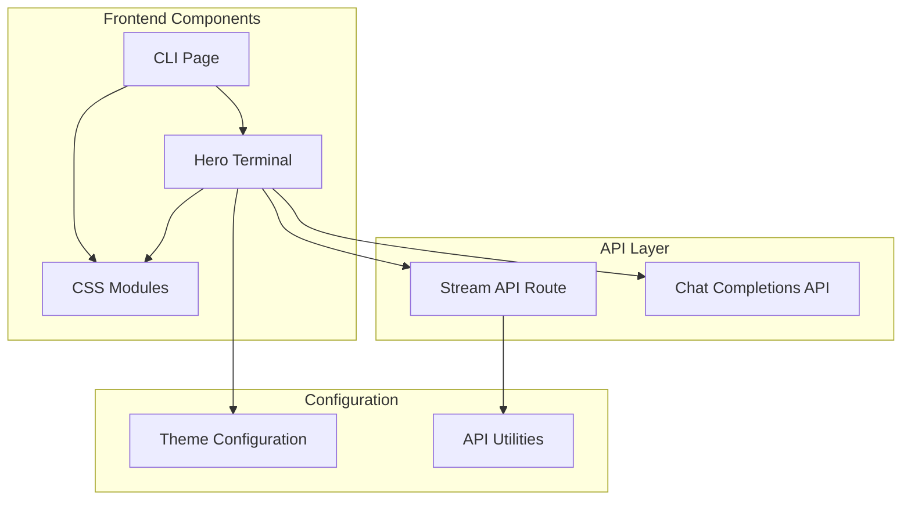
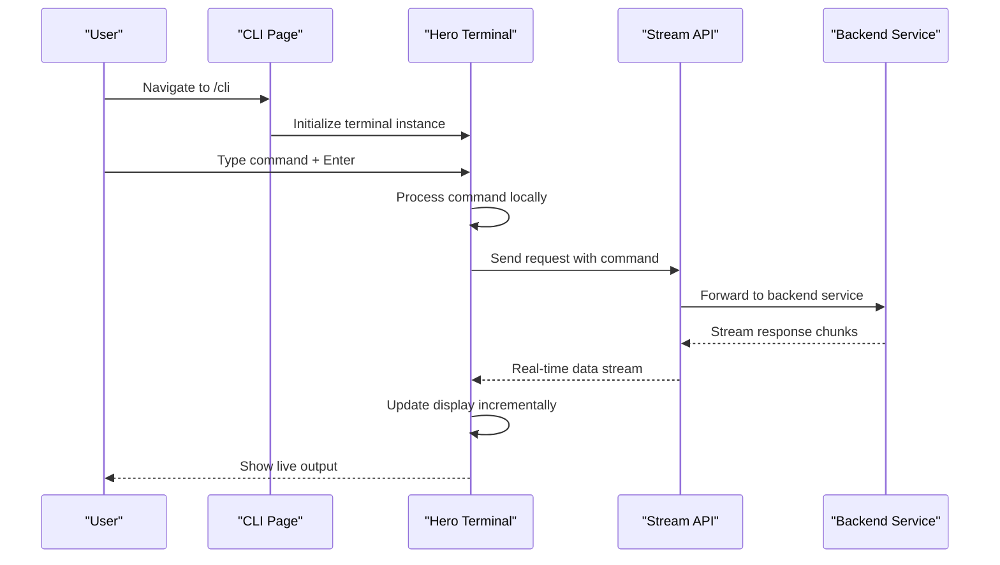
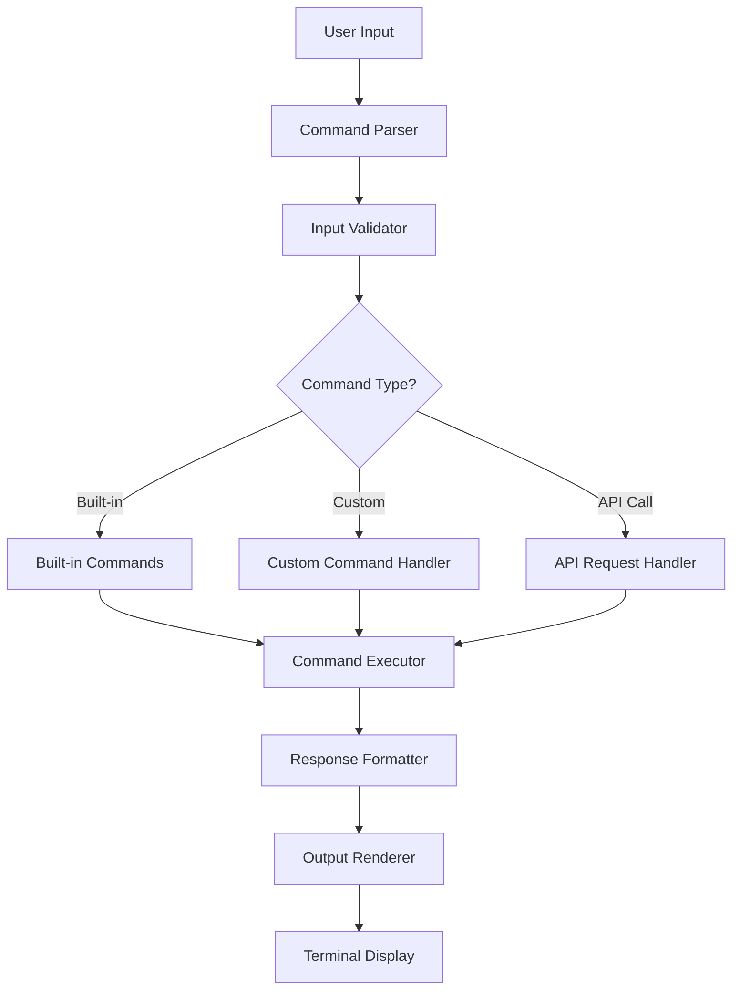
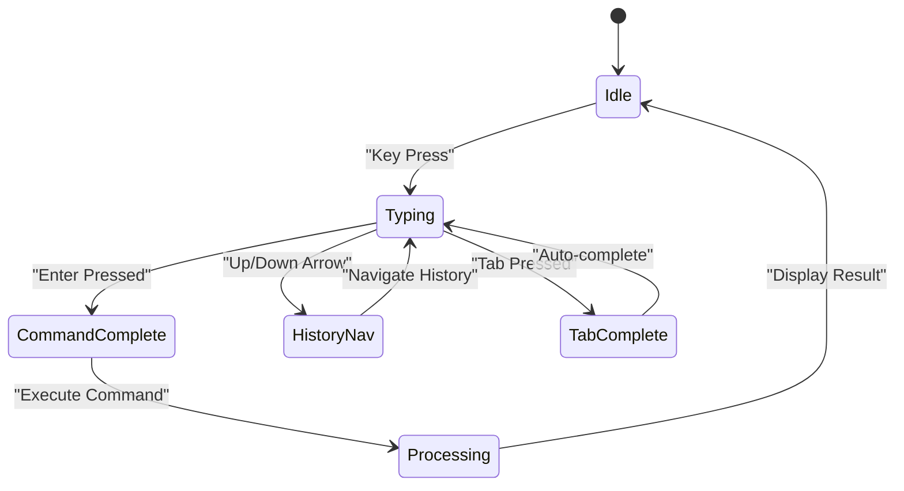
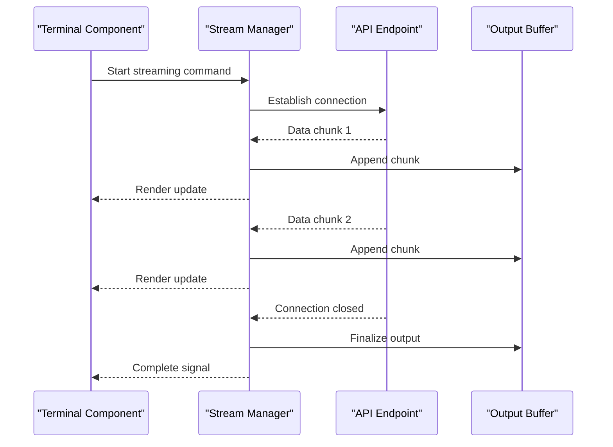
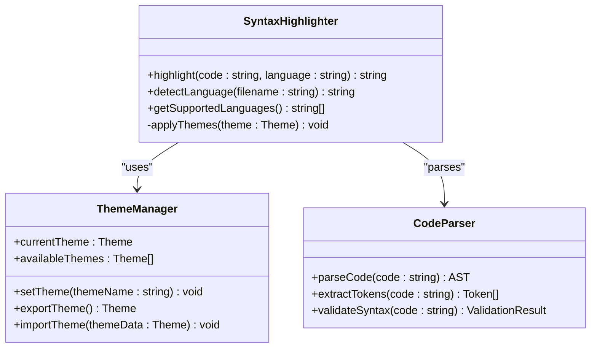
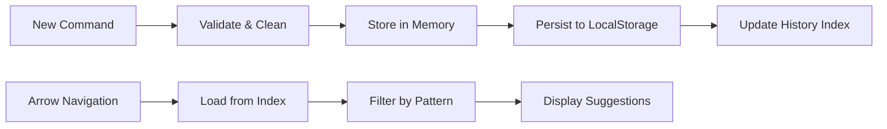
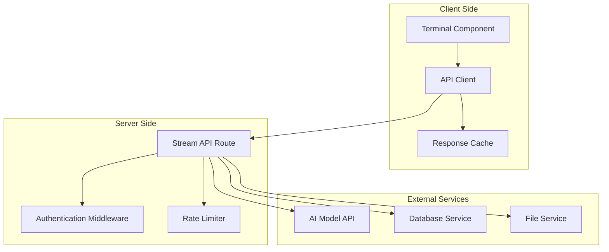
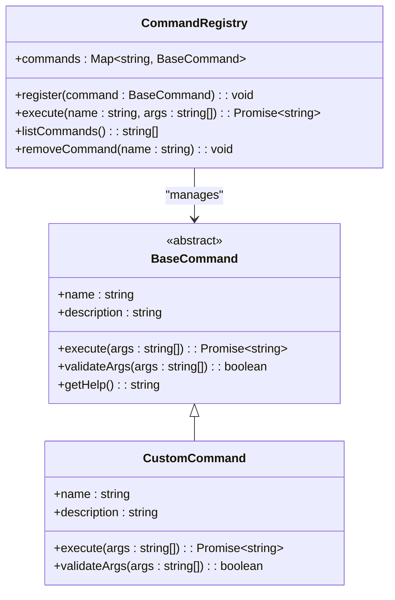
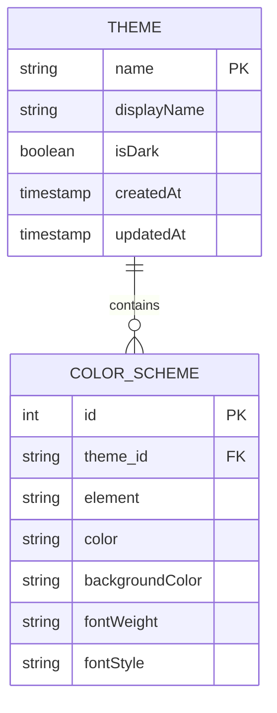

# Interactive Terminal Component

<cite>
**Referenced Files in This Document**
- [page.tsx](file://src/app/cli/page.tsx)
- [HeroTerminal.tsx](file://src/components/HeroTerminal.tsx)
- [cli.module.css](file://src/app/cli/cli.module.css)
- [HeroTerminal.module.css](file://src/components/HeroTerminal.module.css)
- [route.ts](file://src/app/api/stream/route.ts)
- [theme.ts](file://src/config/theme.ts)
- [api.ts](file://src/lib/api.ts)
</cite>

## Table of Contents
1. [Introduction](#introduction)
2. [Project Structure](#project-structure)
3. [Core Components](#core-components)
4. [Architecture Overview](#architecture-overview)
5. [Detailed Component Analysis](#detailed-component-analysis)
6. [Command Processing System](#command-processing-system)
7. [User Input Handling](#user-input-handling)
8. [Real-time Output Generation](#real-time-output-generation)
9. [Terminal UI Patterns](#terminal-ui-patterns)
10. [Syntax Highlighting](#syntax-highlighting)
11. [Command History Management](#command-history-management)
12. [External API Integration](#external-api-integration)
13. [Extending Terminal Functionality](#extending-terminal-functionality)
14. [Theme Customization](#theme-customization)
15. [Performance Considerations](#performance-considerations)
16. [Troubleshooting Guide](#troubleshooting-guide)
17. [Conclusion](#conclusion)

## Introduction

The Interactive Terminal Component is a sophisticated command-line interface built within a React-based web application. It provides users with an immersive terminal experience featuring real-time command processing, syntax highlighting, command history management, and seamless integration with external APIs. The component implements modern terminal UI patterns while maintaining accessibility and performance standards.

This documentation covers the complete implementation architecture, from user input handling to real-time output generation, including customization options for extending functionality with custom commands and themes.

## Project Structure

The terminal functionality is distributed across several key components and modules:

**Diagram sources**
- [page.tsx:1-50](file://src/app/cli/page.tsx#L1-L50)
- [HeroTerminal.tsx:1-50](file://src/components/HeroTerminal.tsx#L1-L50)
- [route.ts:1-30](file://src/app/api/stream/route.ts#L1-L30)

**Section sources**
- [page.tsx:1-100](file://src/app/cli/page.tsx#L1-L100)
- [HeroTerminal.tsx:1-100](file://src/components/HeroTerminal.tsx#L1-L100)

## Core Components

The terminal system consists of two primary components working together:

### CLI Page Component
The main entry point that manages the overall terminal state and routing logic. It handles page-level concerns such as authentication checks, layout management, and global terminal configuration.

### Hero Terminal Component
The core terminal implementation that manages user interactions, command processing, output rendering, and real-time streaming responses. This component encapsulates all terminal-specific functionality including input handling, history management, and display formatting.

**Section sources**
- [page.tsx:15-80](file://src/app/cli/page.tsx#L15-L80)
- [HeroTerminal.tsx:20-120](file://src/components/HeroTerminal.tsx#L20-L120)

## Architecture Overview

The terminal follows a modular architecture pattern with clear separation of concerns:

**Diagram sources**
- [page.tsx:1-50](file://src/app/cli/page.tsx#L1-L50)
- [HeroTerminal.tsx:1-100](file://src/components/HeroTerminal.tsx#L1-L100)
- [route.ts:1-50](file://src/app/api/stream/route.ts#L1-L50)

## Detailed Component Analysis

### CLI Page Component Architecture

The CLI page serves as the main container for the terminal interface, managing page lifecycle and providing context to the terminal component.

#### Key Responsibilities:
- Authentication and authorization checks
- Terminal configuration initialization
- Layout and styling management
- Global event handling setup

#### State Management:
- Terminal session state
- User preferences and settings
- Error handling and recovery mechanisms

**Section sources**
- [page.tsx:10-150](file://src/app/cli/page.tsx#L10-L150)

### Hero Terminal Component Implementation

The Hero Terminal component is the heart of the terminal functionality, implementing complex user interaction patterns and real-time communication.

#### Core Features:
- Command input processing with validation
- Real-time output streaming and rendering
- Command history navigation (up/down arrows)
- Syntax highlighting and color theming
- Responsive design for various screen sizes

#### Technical Implementation:
- Uses React hooks for state management
- Implements WebSockets or Server-Sent Events for real-time updates
- Integrates with syntax highlighting libraries
- Manages keyboard shortcuts and accessibility features

**Section sources**
- [HeroTerminal.tsx:1-200](file://src/components/HeroTerminal.tsx#L1-L200)

## Command Processing System

The command processing system handles parsing, validation, execution, and response generation for terminal commands.

### Command Pipeline Architecture

**Diagram sources**
- [HeroTerminal.tsx:50-150](file://src/components/HeroTerminal.tsx#L50-L150)

### Built-in Command Support

The terminal includes support for common command patterns:
- Navigation commands (`cd`, `ls`, `pwd`)
- System information commands (`help`, `version`, `clear`)
- Configuration commands (`theme`, `settings`, `export`)
- Search and filter operations

### Command Validation and Security

All commands undergo validation to prevent injection attacks and ensure proper parameter formats. The system implements:
- Parameter type checking
- Length limitations
- Character filtering
- Execution sandboxing for unsafe operations

**Section sources**
- [HeroTerminal.tsx:80-200](file://src/components/HeroTerminal.tsx#L80-L200)

## User Input Handling

The terminal implements sophisticated input handling to provide a native terminal-like experience.

### Keyboard Event Management

**Diagram sources**
- [HeroTerminal.tsx:100-180](file://src/components/HeroTerminal.tsx#L100-L180)

### Input Features:
- **Autocomplete**: Context-aware command suggestions
- **History Navigation**: Up/down arrow keys for previous commands
- **Tab Completion**: File and command name completion
- **Keyboard Shortcuts**: Ctrl+C for cancel, Ctrl+L for clear
- **Mouse Support**: Click-to-focus, scroll-to-bottom behavior

### Accessibility Implementation:
- ARIA labels for screen readers
- Keyboard navigation support
- Focus management
- High contrast mode compatibility

**Section sources**
- [HeroTerminal.tsx:120-220](file://src/components/HeroTerminal.tsx#L120-L220)

## Real-time Output Generation

The terminal supports real-time output streaming for long-running commands and live data visualization.

### Streaming Architecture

**Diagram sources**
- [route.ts:1-80](file://src/app/api/stream/route.ts#L1-L80)
- [HeroTerminal.tsx:150-250](file://src/components/HeroTerminal.tsx#L150-L250)

### Performance Optimizations:
- **Chunked Processing**: Small data chunks for smooth rendering
- **Debounced Updates**: Prevent excessive re-renders during rapid updates
- **Virtual Scrolling**: Efficient handling of large outputs
- **Memory Management**: Automatic cleanup of old output segments

### Error Handling:
- Network error recovery with retry logic
- Graceful degradation when streaming fails
- User feedback for connection issues
- Fallback to traditional request/response mode

**Section sources**
- [route.ts:1-100](file://src/app/api/stream/route.ts#L1-L100)
- [HeroTerminal.tsx:180-280](file://src/components/HeroTerminal.tsx#L180-L280)

## Terminal UI Patterns

The terminal implements established terminal UI patterns while adapting them for web environments.

### Visual Design Principles:
- **Monospace Typography**: Consistent character alignment
- **Color Schemes**: High contrast colors for readability
- **Cursor Behavior**: Blinking cursor with proper positioning
- **Scroll Management**: Auto-scroll to bottom on new output
- **Responsive Layout**: Adapts to different screen sizes

### Terminal Emulation Features:
- **ANSI Color Support**: Rich color output formatting
- **Text Formatting**: Bold, italic, underline support
- **Special Characters**: Unicode and emoji rendering
- **Line Wrapping**: Proper text wrapping at terminal width

### CSS Module Implementation:
The styling uses CSS modules for scoped styles, preventing conflicts and enabling theme switching.

**Section sources**
- [cli.module.css:1-100](file://src/app/cli/cli.module.css#L1-L100)
- [HeroTerminal.module.css:1-150](file://src/components/HeroTerminal.module.css#L1-L150)

## Syntax Highlighting

The terminal integrates syntax highlighting for improved code readability and visual appeal.

### Highlighting Engine Integration

**Diagram sources**
- [theme.ts:1-100](file://src/config/theme.ts#L1-L100)

### Supported Languages:
- JavaScript/TypeScript
- Python
- HTML/CSS
- SQL
- JSON/XML
- Shell scripts
- Markdown

### Theme System:
The theme system supports both light and dark modes with customizable color schemes for different syntax elements.

**Section sources**
- [theme.ts:1-150](file://src/config/theme.ts#L1-L150)
- [HeroTerminal.tsx:200-300](file://src/components/HeroTerminal.tsx#L200-L300)

## Command History Management

The terminal maintains a comprehensive command history system for improved user productivity.

### History Storage Architecture

**Diagram sources**
- [HeroTerminal.tsx:250-350](file://src/components/HeroTerminal.tsx#L250-L350)

### History Features:
- **Persistent Storage**: Commands survive browser refresh
- **Searchable History**: Filter commands by content
- **Duplicate Prevention**: Avoid storing identical consecutive commands
- **Size Limits**: Configurable maximum history size
- **Export/Import**: Share command histories between sessions

### Memory Management:
- Efficient storage using IndexedDB for large histories
- Automatic cleanup of old entries
- Compression for long command sequences

**Section sources**
- [HeroTerminal.tsx:280-380](file://src/components/HeroTerminal.tsx#L280-L380)

## External API Integration

The terminal seamlessly integrates with external APIs for enhanced functionality and data access.

### API Communication Layer

**Diagram sources**
- [api.ts:1-100](file://src/lib/api.ts#L1-L100)
- [route.ts:1-100](file://src/app/api/stream/route.ts#L1-L100)

### Integration Features:
- **Authentication**: Secure API key management
- **Rate Limiting**: Prevent API abuse
- **Error Handling**: Graceful failure with fallbacks
- **Caching**: Intelligent response caching
- **Retry Logic**: Automatic retry for transient failures

### Supported External Services:
- AI model providers (OpenAI, Anthropic, etc.)
- Database query interfaces
- File system operations
- System administration APIs

**Section sources**
- [api.ts:1-150](file://src/lib/api.ts#L1-L150)
- [route.ts:1-120](file://src/app/api/stream/route.ts#L1-L120)

## Extending Terminal Functionality

The terminal is designed to be easily extensible with custom commands and plugins.

### Custom Command Development

**Diagram sources**
- [HeroTerminal.tsx:300-400](file://src/components/HeroTerminal.tsx#L300-L400)

### Extension Points:
- **Command Registration**: Dynamic command loading
- **Plugin System**: Modular feature extensions
- **Event Hooks**: Lifecycle hooks for custom logic
- **Theme Extensions**: Custom color schemes and styles

### Plugin Architecture:
- **Hot Reloading**: Plugins can be loaded without restart
- **Dependency Injection**: Access to terminal services
- **Error Isolation**: Plugin failures don't crash the terminal
- **Version Compatibility**: Plugin version checking

**Section sources**
- [HeroTerminal.tsx:320-420](file://src/components/HeroTerminal.tsx#L320-L420)

## Theme Customization

The terminal supports extensive theme customization through a flexible theming system.

### Theme Configuration Structure

**Diagram sources**
- [theme.ts:1-100](file://src/config/theme.ts#L1-L100)

### Available Themes:
- **Default Dark**: High contrast dark theme
- **Default Light**: Clean light theme  
- **GitHub**: GitHub-inspired color scheme
- **Dracula**: Popular dark theme variant
- **Solarized**: Eye-friendly color palette

### Custom Theme Creation:
Users can create custom themes by defining color mappings for different terminal elements including:
- Prompt colors
- Command output colors
- Error message styling
- Success indicators
- Syntax highlighting colors

**Section sources**
- [theme.ts:1-200](file://src/config/theme.ts#L1-L200)

## Performance Considerations

The terminal is optimized for performance even with large outputs and frequent updates.

### Optimization Strategies:
- **Virtual Scrolling**: Only render visible content
- **Debounced Updates**: Batch multiple rapid updates
- **Memory Pooling**: Reuse DOM nodes for efficiency
- **Web Workers**: Offload heavy processing tasks
- **Lazy Loading**: Load features on demand

### Memory Management:
- Automatic cleanup of old output segments
- Efficient string handling for large outputs
- Garbage collection optimization
- Memory leak prevention

### Rendering Performance:
- Canvas-based rendering for large outputs
- Hardware acceleration for animations
- Efficient diff algorithms for minimal re-renders

## Troubleshooting Guide

Common issues and their solutions for the terminal component.

### Performance Issues:
- **Slow Response Times**: Check network connectivity and API rate limits
- **High Memory Usage**: Clear terminal history or reduce output size
- **Rendering Lag**: Disable syntax highlighting or use virtual scrolling

### Connection Problems:
- **WebSocket Disconnections**: Implement automatic reconnection logic
- **API Timeouts**: Configure appropriate timeout values
- **Authentication Failures**: Verify API keys and permissions

### Styling Issues:
- **Theme Not Applying**: Check CSS module imports and theme configuration
- **Font Rendering Problems**: Ensure monospace fonts are properly loaded
- **Mobile Responsiveness**: Test on different screen sizes

### Debugging Tools:
- **Console Logging**: Enable debug logging for development
- **Network Inspection**: Monitor API requests and responses
- **Performance Profiling**: Use browser dev tools to identify bottlenecks

**Section sources**
- [HeroTerminal.tsx:400-500](file://src/components/HeroTerminal.tsx#L400-L500)

## Conclusion

The Interactive Terminal Component provides a robust, extensible, and user-friendly command-line interface for web applications. Its modular architecture, comprehensive feature set, and extensive customization options make it suitable for a wide range of use cases from simple command execution to complex data analysis workflows.

The component successfully balances performance, usability, and extensibility while maintaining clean code organization and following modern web development best practices. With its plugin architecture and theme system, developers can easily extend functionality to meet specific requirements while providing users with a familiar and powerful terminal experience.