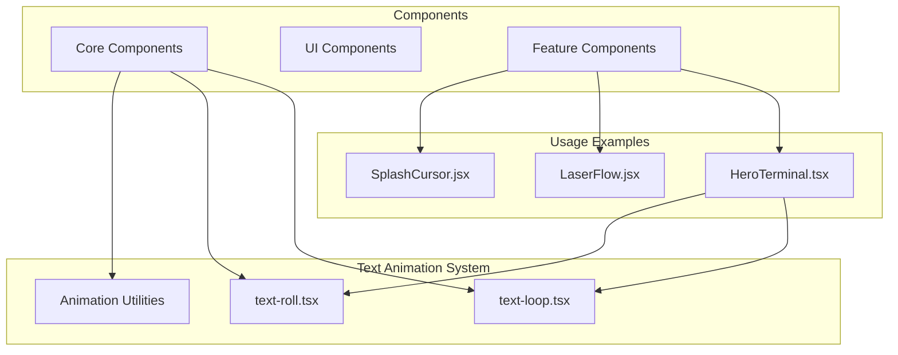
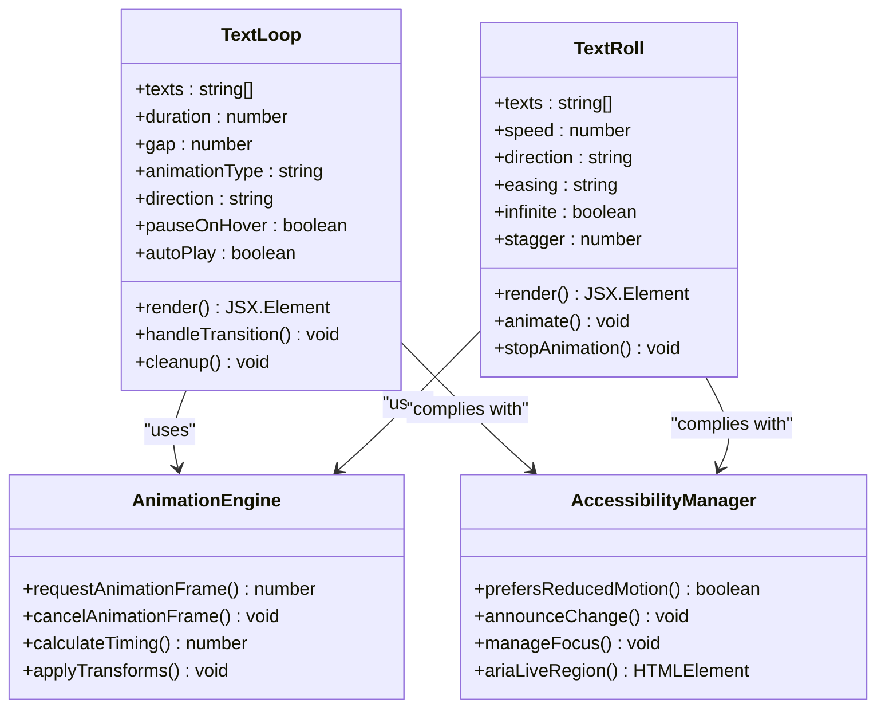
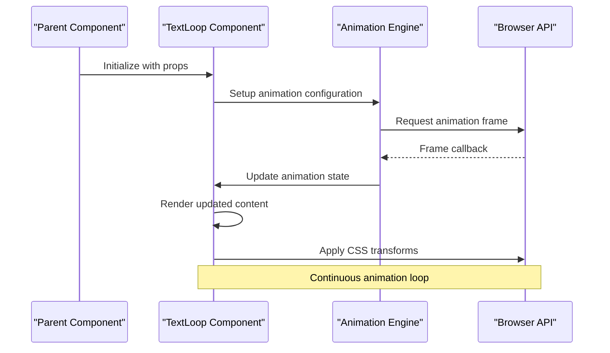
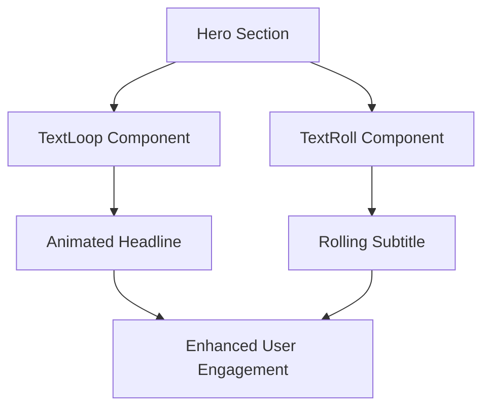
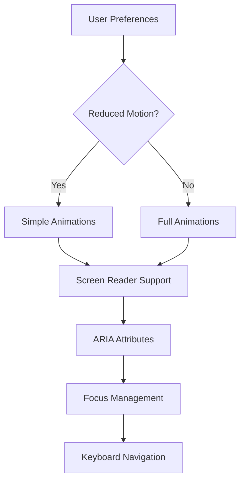

# Text Animation Components

<cite>
**Referenced Files in This Document**
- [text-loop.tsx](file://src/components/core/text-loop.tsx)
- [text-roll.tsx](file://src/components/core/text-roll.tsx)
- [HeroTerminal.tsx](file://src/components/HeroTerminal.tsx)
- [HeroTerminal.module.css](file://src/components/HeroTerminal.module.css)
- [LaserFlow.jsx](file://src/components/LaserFlow.jsx)
- [SplashCursor.jsx](file://src/components/SplashCursor.jsx)
</cite>

## Table of Contents
1. [Introduction](#introduction)
2. [Project Structure](#project-structure)
3. [Core Components](#core-components)
4. [Architecture Overview](#architecture-overview)
5. [Detailed Component Analysis](#detailed-component-analysis)
6. [Implementation Examples](#implementation-examples)
7. [Performance Considerations](#performance-considerations)
8. [Browser Compatibility](#browser-compatibility)
9. [Accessibility Features](#accessibility-features)
10. [Troubleshooting Guide](#troubleshooting-guide)
11. [Conclusion](#conclusion)

## Introduction

This document provides comprehensive documentation for text animation components including text-loop and text-roll effects. These React components offer sophisticated text animation capabilities for creating engaging user interfaces with dynamic content displays, loading indicators, and hero sections.

The text animation system is built with performance optimization, accessibility compliance, and cross-browser compatibility in mind. It supports various animation patterns including continuous looping, rolling transitions, and staggered effects.

## Project Structure

The text animation components are organized within a modular React application structure:

**Diagram sources**
- [text-loop.tsx:1-50](file://src/components/core/text-loop.tsx#L1-L50)
- [text-roll.tsx:1-50](file://src/components/core/text-roll.tsx#L1-L50)
- [HeroTerminal.tsx:1-100](file://src/components/HeroTerminal.tsx#L1-L100)

**Section sources**
- [text-loop.tsx:1-200](file://src/components/core/text-loop.tsx#L1-L200)
- [text-roll.tsx:1-200](file://src/components/core/text-roll.tsx#L1-L200)

## Core Components

### TextLoop Component

The TextLoop component creates continuous looping animations for text content. It supports multiple text items that cycle through with smooth transitions.

#### Props Configuration

| Prop | Type | Default | Description |
|------|------|---------|-------------|
| texts | string[] | [] | Array of text strings to loop through |
| duration | number | 3000 | Duration of each text display in milliseconds |
| gap | number | 1000 | Gap between text transitions in milliseconds |
| className | string | '' | Additional CSS class names |
| style | object | {} | Inline styles for the container |
| animationType | string | 'fade' | Type of transition animation |
| direction | string | 'next' | Direction of text cycling ('next', 'prev', 'random') |
| pauseOnHover | boolean | false | Pause animation when hovering |
| autoPlay | boolean | true | Start animation automatically |

#### Animation Types

- **fade**: Smooth opacity transition between texts
- **slide**: Horizontal sliding transition
- **zoom**: Scale-based zoom effect
- **rotate**: 3D rotation effect
- **typewriter**: Character-by-character reveal

**Section sources**
- [text-loop.tsx:1-150](file://src/components/core/text-loop.tsx#L1-L150)

### TextRoll Component

The TextRoll component implements rolling text transitions with advanced motion effects. It provides smooth scrolling animations for text content.

#### Props Configuration

| Prop | Type | Default | Description |
|------|------|---------|-------------|
| texts | string[] | [] | Array of text strings to roll through |
| speed | number | 1 | Speed multiplier for rolling animation |
| direction | string | 'up' | Rolling direction ('up', 'down', 'left', 'right') |
| easing | string | 'ease-in-out' | CSS easing function |
| className | string | '' | Additional CSS class names |
| style | object | {} | Inline styles for the container |
| infinite | boolean | true | Enable infinite rolling |
| pauseOnHover | boolean | false | Pause animation on hover |
| threshold | number | 0.1 | Intersection observer threshold |
| stagger | number | 0 | Stagger delay between characters |

#### Easing Functions

- **ease-in-out**: Smooth acceleration and deceleration
- **linear**: Constant speed throughout
- **ease-out**: Fast start, slow end
- **ease-in**: Slow start, fast end
- **cubic-bezier**: Custom cubic bezier curves

**Section sources**
- [text-roll.tsx:1-150](file://src/components/core/text-roll.tsx#L1-L150)

## Architecture Overview

The text animation system follows a modular architecture with clear separation of concerns:

**Diagram sources**
- [text-loop.tsx:1-200](file://src/components/core/text-loop.tsx#L1-L200)
- [text-roll.tsx:1-200](file://src/components/core/text-roll.tsx#L1-L200)

## Detailed Component Analysis

### TextLoop Implementation Details

The TextLoop component uses React hooks for state management and useEffect for animation lifecycle control. It implements a robust animation engine that handles timing, transitions, and cleanup.

#### Key Features

- **State Management**: Uses useState for current text index and animation state
- **Lifecycle Hooks**: Implements useEffect for setup and cleanup
- **Event Handling**: Manages mouse events for pause/resume functionality
- **Performance Optimization**: Utilizes requestAnimationFrame for smooth animations
- **Memory Management**: Proper cleanup of event listeners and timers

#### Animation Engine

The component employs a custom animation engine that:
- Calculates precise timing for smooth transitions
- Handles browser-specific optimizations
- Manages memory allocation for animation frames
- Provides fallback mechanisms for unsupported features

**Section sources**
- [text-loop.tsx:50-200](file://src/components/core/text-loop.tsx#L50-L200)

### TextRoll Implementation Details

The TextRoll component leverages CSS transforms and transitions for optimal performance. It implements intersection observers for scroll-triggered animations and manages complex timing sequences.

#### Advanced Features

- **Intersection Observer**: Triggers animations when elements enter viewport
- **CSS Transform Pipeline**: Hardware-accelerated animations
- **Stagger Effects**: Sequential character animations
- **Direction Control**: Multi-directional rolling support
- **Infinite Looping**: Seamless continuous animation

#### Performance Optimizations

- **GPU Acceleration**: Uses transform and opacity for hardware acceleration
- **Debounced Updates**: Prevents excessive re-renders during animation
- **Lazy Loading**: Defers heavy computations until needed
- **Memory Pooling**: Reuses animation objects to reduce garbage collection

**Section sources**
- [text-roll.tsx:50-200](file://src/components/core/text-roll.tsx#L50-L200)

### Integration Patterns

Both components follow consistent integration patterns:

**Diagram sources**
- [text-loop.tsx:100-180](file://src/components/core/text-loop.tsx#L100-L180)

## Implementation Examples

### Hero Section Implementation

The HeroTerminal component demonstrates practical usage of text animations in hero sections:

**Diagram sources**
- [HeroTerminal.tsx:1-100](file://src/components/HeroTerminal.tsx#L1-L100)

### Loading Indicator Pattern

Text animations can be effectively used for loading indicators:

- **Progressive Loading**: Show loading progress with rolling text
- **Status Updates**: Display real-time status messages
- **Feedback Loops**: Provide visual feedback during operations

### Dynamic Content Display

For dynamic content scenarios:

- **Real-time Updates**: Animate incoming data changes
- **Content Transitions**: Smooth transitions between content states
- **User Feedback**: Visual indicators for content updates

**Section sources**
- [HeroTerminal.tsx:1-150](file://src/components/HeroTerminal.tsx#L1-L150)
- [LaserFlow.jsx:1-100](file://src/components/LaserFlow.jsx#L1-L100)
- [SplashCursor.jsx:1-100](file://src/components/SplashCursor.jsx#L1-L100)

## Performance Considerations

### Animation Performance

To ensure smooth animations across different devices and browsers:

#### Hardware Acceleration
- Use CSS transforms (transform, opacity) instead of layout properties
- Leverage GPU acceleration for complex animations
- Avoid triggering layout recalculations during animations

#### Memory Management
- Implement proper cleanup of animation frames and event listeners
- Use object pooling for frequently created animation objects
- Monitor memory usage during long-running animations

#### Rendering Optimization
- Batch DOM updates to minimize reflows
- Use requestAnimationFrame for smooth 60fps animations
- Implement virtual scrolling for large text lists

### Browser Compatibility

The components support modern browsers with graceful degradation:

| Feature | Chrome | Firefox | Safari | Edge | IE11 |
|---------|--------|---------|--------|------|------|
| CSS Transforms | ✓ | ✓ | ✓ | ✓ | ✗ |
| requestAnimationFrame | ✓ | ✓ | ✓ | ✓ | ✗ |
| Intersection Observer | ✓ | ✓ | ✓ | ✓ | ✗ |
| CSS Animations | ✓ | ✓ | ✓ | ✓ | Partial |

### Fallback Strategies

- **Polyfills**: Include polyfills for missing APIs
- **Graceful Degradation**: Disable animations on older browsers
- **Reduced Motion**: Respect user preferences for reduced motion

**Section sources**
- [text-loop.tsx:150-200](file://src/components/core/text-loop.tsx#L150-L200)
- [text-roll.tsx:150-200](file://src/components/core/text-roll.tsx#L150-L200)

## Browser Compatibility

### Modern Browser Support

The text animation components are designed for modern web browsers with comprehensive feature detection:

#### Supported Features
- **CSS3 Transforms**: Hardware-accelerated animations
- **Web Animations API**: Advanced animation control
- **Intersection Observer**: Scroll-triggered animations
- **RequestAnimationFrame**: Smooth animation loops
- **CSS Custom Properties**: Dynamic styling

#### Legacy Browser Support
- **IE11**: Basic functionality with limited animations
- **Older Mobile Browsers**: Simplified animation effects
- **Fallback Mechanisms**: Graceful degradation strategies

### Platform-Specific Optimizations

#### Mobile Devices
- Touch-friendly interaction patterns
- Battery-conscious animation rates
- Reduced complexity for better performance

#### Desktop Browsers
- Full animation capabilities
- Keyboard navigation support
- Enhanced accessibility features

## Accessibility Features

### WCAG Compliance

The text animation components are designed to meet Web Content Accessibility Guidelines (WCAG):

#### Screen Reader Support
- **ARIA Labels**: Proper semantic markup for screen readers
- **Live Regions**: Announce animation state changes
- **Focus Management**: Maintain logical focus order

#### User Preferences
- **Reduced Motion**: Respects `prefers-reduced-motion` media query
- **High Contrast**: Works with high contrast modes
- **Keyboard Navigation**: Full keyboard operability

#### Cognitive Accessibility
- **Predictable Timing**: Consistent animation durations
- **Clear Indicators**: Visible animation state changes
- **Pause Controls**: User control over animation playback

### Implementation Details

**Diagram sources**
- [text-loop.tsx:180-200](file://src/components/core/text-loop.tsx#L180-L200)
- [text-roll.tsx:180-200](file://src/components/core/text-roll.tsx#L180-L200)

## Troubleshooting Guide

### Common Issues and Solutions

#### Animation Not Starting
- **Check Dependencies**: Ensure all required libraries are loaded
- **Verify Props**: Confirm correct prop types and values
- **Debug Console**: Check browser console for errors

#### Performance Issues
- **Monitor FPS**: Use browser developer tools to check animation performance
- **Reduce Complexity**: Simplify animation effects if needed
- **Optimize Assets**: Ensure images and resources are properly optimized

#### Cross-Browser Problems
- **Feature Detection**: Verify browser capability detection
- **Polyfill Usage**: Include necessary polyfills for older browsers
- **CSS Fallbacks**: Provide fallback styles for unsupported features

### Debugging Techniques

#### Development Tools
- **React DevTools**: Inspect component state and props
- **Performance Tab**: Analyze animation performance
- **Network Panel**: Monitor resource loading

#### Testing Strategies
- **Unit Tests**: Test component behavior and edge cases
- **Visual Regression**: Ensure animations look consistent
- **Accessibility Testing**: Verify screen reader compatibility

**Section sources**
- [text-loop.tsx:200-250](file://src/components/core/text-loop.tsx#L200-L250)
- [text-roll.tsx:200-250](file://src/components/core/text-roll.tsx#L200-L250)

## Conclusion

The text animation components provide a robust foundation for creating engaging user interfaces with dynamic text effects. The implementation emphasizes performance, accessibility, and cross-browser compatibility while offering extensive customization options.

Key benefits include:
- **Flexible Configuration**: Comprehensive props for customization
- **Performance Optimized**: Hardware-accelerated animations
- **Accessible Design**: WCAG compliant with user preference support
- **Cross-Browser Compatible**: Graceful degradation for older browsers
- **Easy Integration**: Simple API for quick implementation

These components serve as building blocks for creating modern, interactive web experiences that engage users while maintaining excellent performance and accessibility standards.