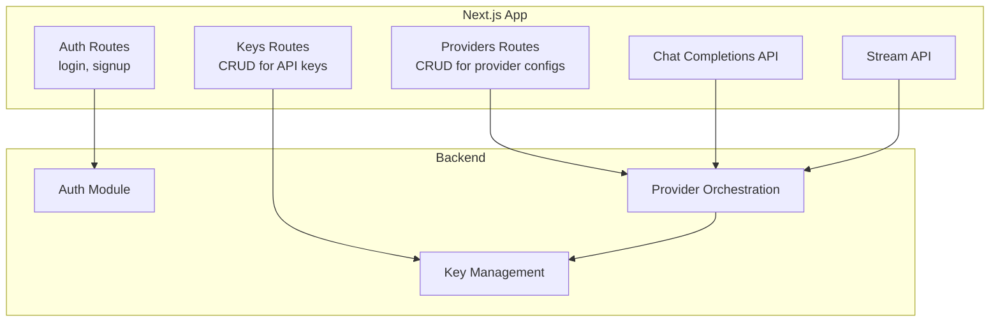
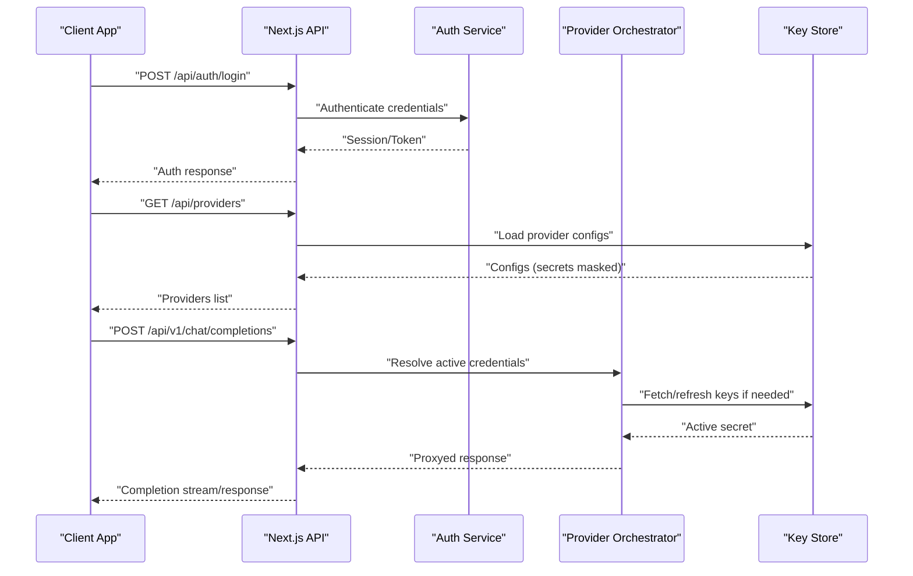
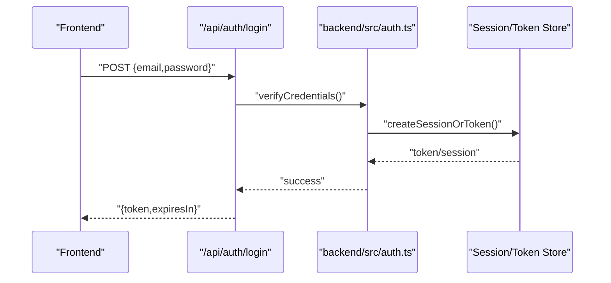
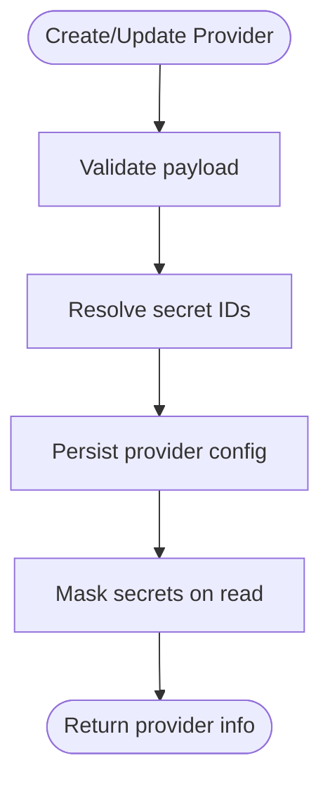
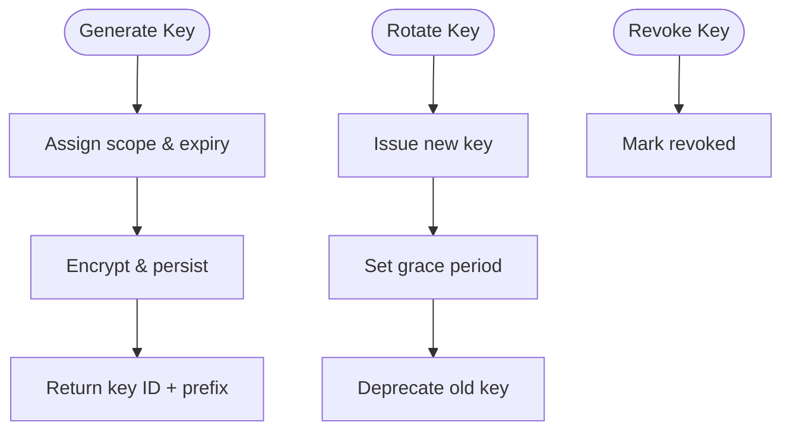
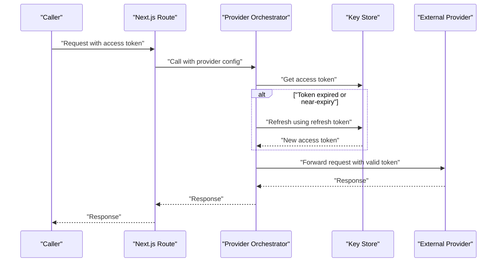
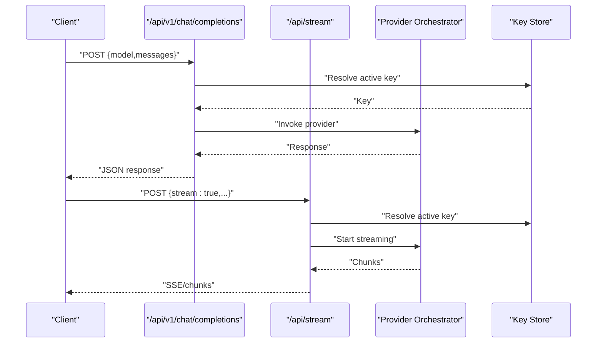
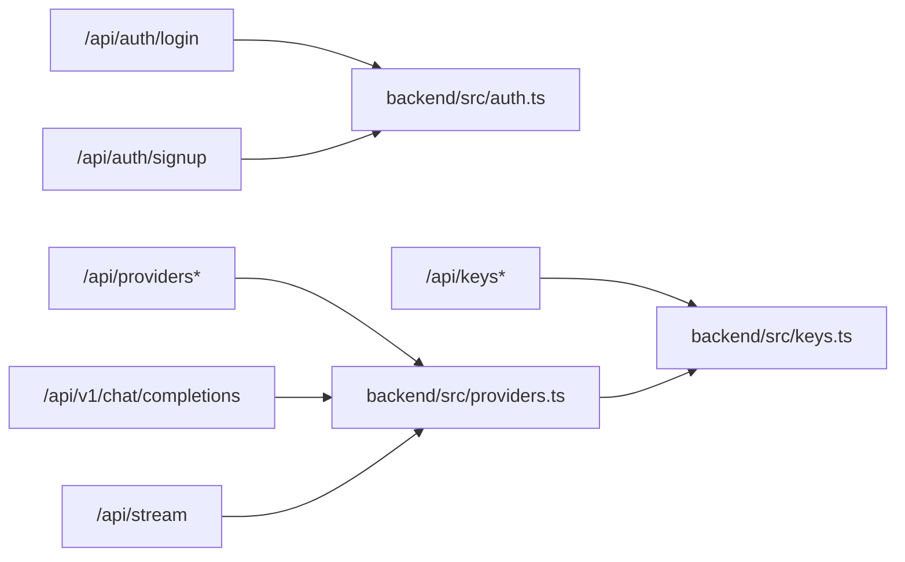

# Authentication Implementation

<cite>
**Referenced Files in This Document**
- [backend/src/auth.ts](file://backend/src/auth.ts)
- [backend/src/keys.ts](file://backend/src/keys.ts)
- [backend/src/providers.ts](file://backend/src/providers.ts)
- [backend/src/index.ts](file://backend/src/index.ts)
- [src/app/api/auth/login/route.ts](file://src/app/api/auth/login/route.ts)
- [src/app/api/auth/signup/route.ts](file://src/app/api/auth/signup/route.ts)
- [src/app/api/keys/route.ts](file://src/app/api/keys/route.ts)
- [src/app/api/keys/[id]/route.ts](file://src/app/api/keys/[id]/route.ts)
- [src/app/api/providers/route.ts](file://src/app/api/providers/route.ts)
- [src/app/api/providers/[id]/route.ts](file://src/app/api/providers/[id]/route.ts)
- [src/app/api/v1/chat/completions/route.ts](file://src/app/api/v1/chat/completions/route.ts)
- [src/app/api/stream/route.ts](file://src/app/api/stream/route.ts)
- [src/components/auth-provider.tsx](file://src/components/auth-provider.tsx)
</cite>

## Table of Contents
1. [Introduction](#introduction)
2. [Project Structure](#project-structure)
3. [Core Components](#core-components)
4. [Architecture Overview](#architecture-overview)
5. [Detailed Component Analysis](#detailed-component-analysis)
6. [Dependency Analysis](#dependency-analysis)
7. [Performance Considerations](#performance-considerations)
8. [Troubleshooting Guide](#troubleshooting-guide)
9. [Conclusion](#conclusion)
10. [Appendices](#appendices)

## Introduction
This document explains how to implement authentication for custom AI providers within the project. It covers API keys, OAuth flows, and token-based authentication; secure credential storage and rotation; token refresh mechanisms; error handling; environment variable management; and testing strategies. The guidance is grounded in the existing backend and Next.js API routes that manage user authentication, provider configuration, and key lifecycle operations.

## Project Structure
The repository separates concerns between a Node/Bun backend (for provider orchestration and secrets management) and a Next.js frontend with API routes (for user-facing auth and provider/key management). Key areas:
- Backend authentication and provider orchestration
- Next.js API routes for login/signup, keys, providers, chat completions, and streaming
- Frontend auth context/provider component

**Diagram sources**
- [src/app/api/auth/login/route.ts](file://src/app/api/auth/login/route.ts)
- [src/app/api/auth/signup/route.ts](file://src/app/api/auth/signup/route.ts)
- [src/app/api/keys/route.ts](file://src/app/api/keys/route.ts)
- [src/app/api/keys/[id]/route.ts](file://src/app/api/keys/[id]/route.ts)
- [src/app/api/providers/route.ts](file://src/app/api/providers/route.ts)
- [src/app/api/providers/[id]/route.ts](file://src/app/api/providers/[id]/route.ts)
- [src/app/api/v1/chat/completions/route.ts](file://src/app/api/v1/chat/completions/route.ts)
- [src/app/api/stream/route.ts](file://src/app/api/stream/route.ts)
- [backend/src/auth.ts](file://backend/src/auth.ts)
- [backend/src/providers.ts](file://backend/src/providers.ts)
- [backend/src/keys.ts](file://backend/src/keys.ts)

**Section sources**
- [backend/src/index.ts](file://backend/src/index.ts)
- [src/app/api/auth/login/route.ts](file://src/app/api/auth/login/route.ts)
- [src/app/api/auth/signup/route.ts](file://src/app/api/auth/signup/route.ts)
- [src/app/api/keys/route.ts](file://src/app/api/keys/route.ts)
- [src/app/api/keys/[id]/route.ts](file://src/app/api/keys/[id]/route.ts)
- [src/app/api/providers/route.ts](file://src/app/api/providers/route.ts)
- [src/app/api/providers/[id]/route.ts](file://src/app/api/providers/[id]/route.ts)
- [src/app/api/v1/chat/completions/route.ts](file://src/app/api/v1/chat/completions/route.ts)
- [src/app/api/stream/route.ts](file://src/app/api/stream/route.ts)
- [backend/src/auth.ts](file://backend/src/auth.ts)
- [backend/src/providers.ts](file://backend/src/providers.ts)
- [backend/src/keys.ts](file://backend/src/keys.ts)

## Core Components
- User authentication endpoints: login and signup APIs that establish sessions or tokens for client applications.
- Provider configuration endpoints: create, update, list, and delete provider definitions including credentials and settings.
- API key management endpoints: generate, rotate, enable/disable, and revoke keys scoped to users or providers.
- Chat completion and streaming endpoints: consume provider configurations and keys to call external AI services.
- Backend auth module: centralizes authentication logic, token issuance/validation, and integration points.
- Provider orchestration: resolves active credentials, applies refresh logic, and invokes provider APIs.
- Key management: persists and rotates secrets securely, enforces scoping and expiration policies.

**Section sources**
- [src/app/api/auth/login/route.ts](file://src/app/api/auth/login/route.ts)
- [src/app/api/auth/signup/route.ts](file://src/app/api/auth/signup/route.ts)
- [src/app/api/providers/route.ts](file://src/app/api/providers/route.ts)
- [src/app/api/providers/[id]/route.ts](file://src/app/api/providers/[id]/route.ts)
- [src/app/api/keys/route.ts](file://src/app/api/keys/route.ts)
- [src/app/api/keys/[id]/route.ts](file://src/app/api/keys/[id]/route.ts)
- [src/app/api/v1/chat/completions/route.ts](file://src/app/api/v1/chat/completions/route.ts)
- [src/app/api/stream/route.ts](file://src/app/api/stream/route.ts)
- [backend/src/auth.ts](file://backend/src/auth.ts)
- [backend/src/providers.ts](file://backend/src/providers.ts)
- [backend/src/keys.ts](file://backend/src/keys.ts)

## Architecture Overview
Authentication spans three layers:
- Client layer: UI components and API clients that hold short-lived tokens and forward them to protected endpoints.
- API layer: Next.js routes that validate requests, enforce authorization, and delegate to backend services.
- Backend layer: Auth service, provider orchestrator, and key store that handle secrets, token refresh, and provider calls.

**Diagram sources**
- [src/app/api/auth/login/route.ts](file://src/app/api/auth/login/route.ts)
- [src/app/api/providers/route.ts](file://src/app/api/providers/route.ts)
- [src/app/api/v1/chat/completions/route.ts](file://src/app/api/v1/chat/completions/route.ts)
- [backend/src/auth.ts](file://backend/src/auth.ts)
- [backend/src/providers.ts](file://backend/src/providers.ts)
- [backend/src/keys.ts](file://backend/src/keys.ts)

## Detailed Component Analysis

### User Authentication Endpoints
- Login route validates credentials and returns an authenticated session or token.
- Signup route creates new accounts and initializes default provider/key state.
- Both routes should enforce rate limiting, input validation, and return standardized error codes.

**Diagram sources**
- [src/app/api/auth/login/route.ts](file://src/app/api/auth/login/route.ts)
- [backend/src/auth.ts](file://backend/src/auth.ts)

**Section sources**
- [src/app/api/auth/login/route.ts](file://src/app/api/auth/login/route.ts)
- [src/app/api/auth/signup/route.ts](file://src/app/api/auth/signup/route.ts)
- [backend/src/auth.ts](file://backend/src/auth.ts)

### Provider Configuration Management
- Create/update provider definitions include endpoint URLs, model mappings, and credential references.
- Secrets are stored separately from provider metadata and referenced by ID.
- List/get endpoints mask sensitive fields and expose only necessary configuration.

**Diagram sources**
- [src/app/api/providers/route.ts](file://src/app/api/providers/route.ts)
- [src/app/api/providers/[id]/route.ts](file://src/app/api/providers/[id]/route.ts)

**Section sources**
- [src/app/api/providers/route.ts](file://src/app/api/providers/route.ts)
- [src/app/api/providers/[id]/route.ts](file://src/app/api/providers/[id]/route.ts)

### API Key Lifecycle
- Generate keys scoped to users or providers with optional expiration and scopes.
- Rotate keys by issuing a new key and deprecating the old one after a grace period.
- Revoke keys immediately when compromised.

**Diagram sources**
- [src/app/api/keys/route.ts](file://src/app/api/keys/route.ts)
- [src/app/api/keys/[id]/route.ts](file://src/app/api/keys/[id]/route.ts)
- [backend/src/keys.ts](file://backend/src/keys.ts)

**Section sources**
- [src/app/api/keys/route.ts](file://src/app/api/keys/route.ts)
- [src/app/api/keys/[id]/route.ts](file://src/app/api/keys/[id]/route.ts)
- [backend/src/keys.ts](file://backend/src/keys.ts)

### Token-Based Authentication and Refresh
- Use short-lived access tokens with long-lived refresh tokens where applicable.
- Implement automatic refresh before expiry during provider calls.
- Cache refreshed tokens per provider/user scope to reduce overhead.

**Diagram sources**
- [backend/src/providers.ts](file://backend/src/providers.ts)
- [backend/src/keys.ts](file://backend/src/keys.ts)

**Section sources**
- [backend/src/providers.ts](file://backend/src/providers.ts)
- [backend/src/keys.ts](file://backend/src/keys.ts)

### Chat Completions and Streaming Integration
- Chat completions route authenticates the caller, resolves provider and key, then proxies the request.
- Streaming route handles server-sent events or chunked responses while maintaining auth context.

**Diagram sources**
- [src/app/api/v1/chat/completions/route.ts](file://src/app/api/v1/chat/completions/route.ts)
- [src/app/api/stream/route.ts](file://src/app/api/stream/route.ts)
- [backend/src/providers.ts](file://backend/src/providers.ts)
- [backend/src/keys.ts](file://backend/src/keys.ts)

**Section sources**
- [src/app/api/v1/chat/completions/route.ts](file://src/app/api/v1/chat/completions/route.ts)
- [src/app/api/stream/route.ts](file://src/app/api/stream/route.ts)
- [backend/src/providers.ts](file://backend/src/providers.ts)
- [backend/src/keys.ts](file://backend/src/keys.ts)

### Frontend Auth Context
- The auth provider component manages client-side auth state, token injection into requests, and redirects based on auth status.
- Ensure tokens are stored securely (e.g., httpOnly cookies or secure storage) and never logged.

**Section sources**
- [src/components/auth-provider.tsx](file://src/components/auth-provider.tsx)

## Dependency Analysis
The following diagram shows high-level dependencies among core modules and routes.

**Diagram sources**
- [src/app/api/auth/login/route.ts](file://src/app/api/auth/login/route.ts)
- [src/app/api/auth/signup/route.ts](file://src/app/api/auth/signup/route.ts)
- [src/app/api/providers/route.ts](file://src/app/api/providers/route.ts)
- [src/app/api/providers/[id]/route.ts](file://src/app/api/providers/[id]/route.ts)
- [src/app/api/keys/route.ts](file://src/app/api/keys/route.ts)
- [src/app/api/keys/[id]/route.ts](file://src/app/api/keys/[id]/route.ts)
- [src/app/api/v1/chat/completions/route.ts](file://src/app/api/v1/chat/completions/route.ts)
- [src/app/api/stream/route.ts](file://src/app/api/stream/route.ts)
- [backend/src/auth.ts](file://backend/src/auth.ts)
- [backend/src/providers.ts](file://backend/src/providers.ts)
- [backend/src/keys.ts](file://backend/src/keys.ts)

**Section sources**
- [backend/src/index.ts](file://backend/src/index.ts)
- [backend/src/auth.ts](file://backend/src/auth.ts)
- [backend/src/providers.ts](file://backend/src/providers.ts)
- [backend/src/keys.ts](file://backend/src/keys.ts)

## Performance Considerations
- Cache provider configurations and access tokens with appropriate TTLs to minimize repeated lookups.
- Use connection pooling for external provider HTTP calls.
- Prefer streaming responses for large payloads to reduce memory pressure.
- Implement idempotency for key rotation and token refresh operations.

## Troubleshooting Guide
Common issues and resolutions:
- Invalid or expired tokens: ensure refresh flow triggers before expiry and that tokens are reissued correctly.
- Missing provider credentials: verify secret references exist and are unmasked only on the server side.
- Rate limits from external providers: implement backoff and retry with jitter.
- Key rotation conflicts: enforce grace periods and atomic updates to avoid race conditions.

**Section sources**
- [backend/src/auth.ts](file://backend/src/auth.ts)
- [backend/src/providers.ts](file://backend/src/providers.ts)
- [backend/src/keys.ts](file://backend/src/keys.ts)

## Conclusion
By separating concerns across authentication, provider orchestration, and key management, the system supports multiple authentication schemes (API keys, OAuth, token-based), secure credential storage, token refresh, and robust error handling. Following the patterns outlined here ensures safe integration with diverse AI providers and scalable operation.

## Appendices

### Security Best Practices
- Never log secrets; mask them in logs and responses.
- Enforce least privilege scopes for API keys.
- Use HTTPS everywhere and secure cookies for tokens.
- Rotate keys regularly and support immediate revocation.
- Validate all inputs and reject malformed provider configurations.

### Environment Variable Management
- Store secrets via environment variables injected at runtime.
- Avoid committing secrets to version control.
- Provide clear documentation for required variables and their scopes.

### Testing Authentication Flows
- Unit test token issuance and validation logic.
- Integration test provider proxying with mocked external services.
- Test key rotation and revocation workflows end-to-end.
- Simulate token expiry and refresh scenarios.