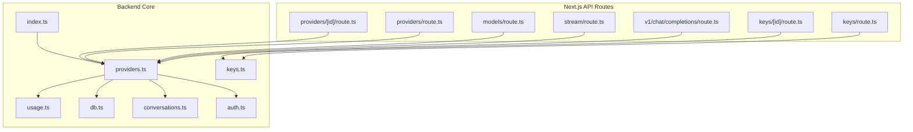
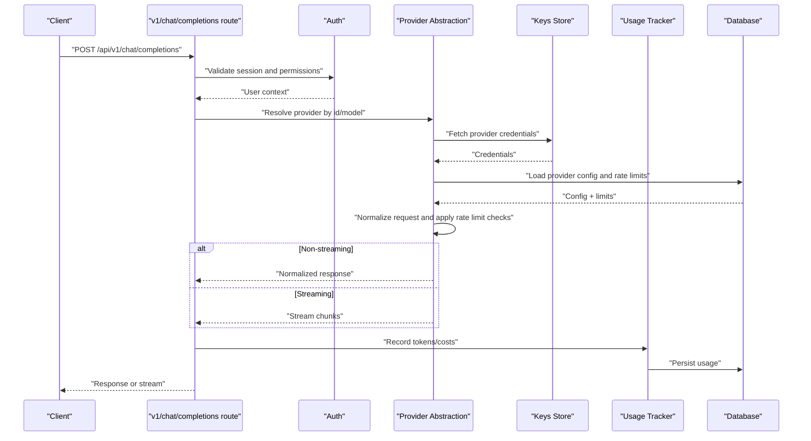
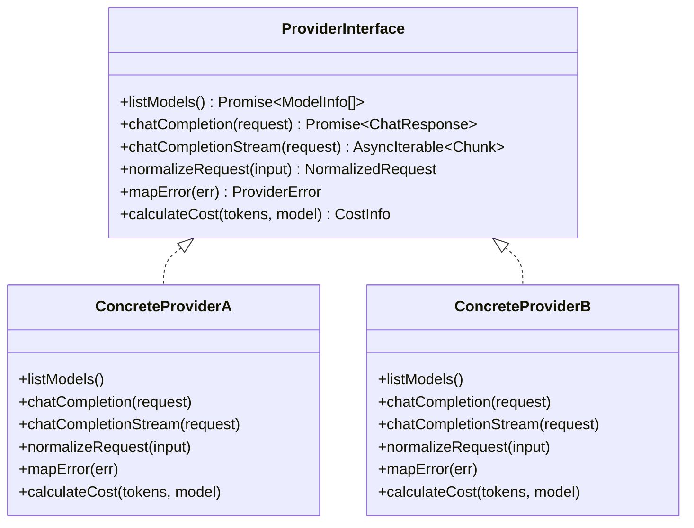
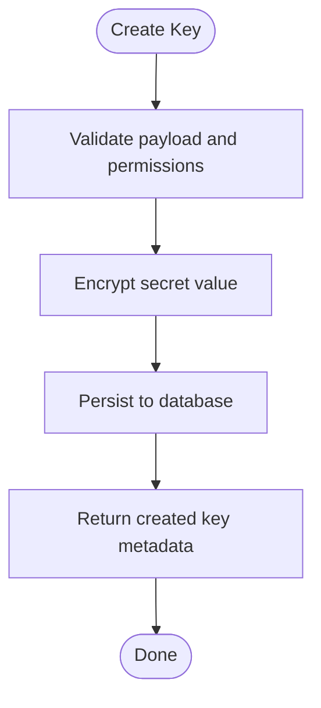
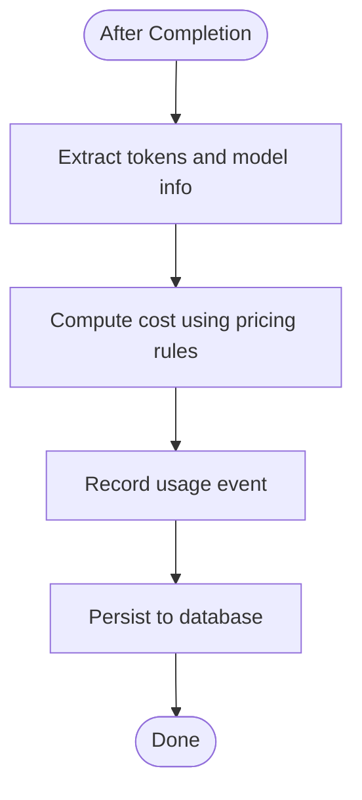
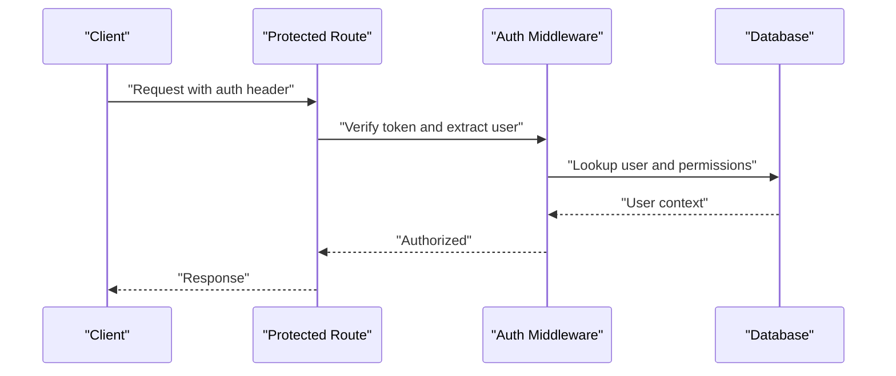
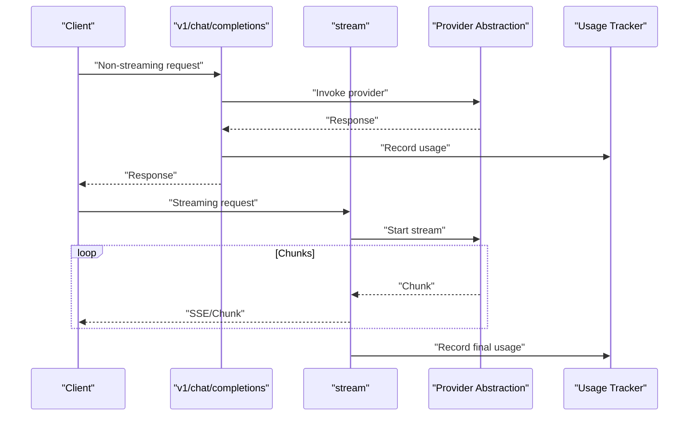
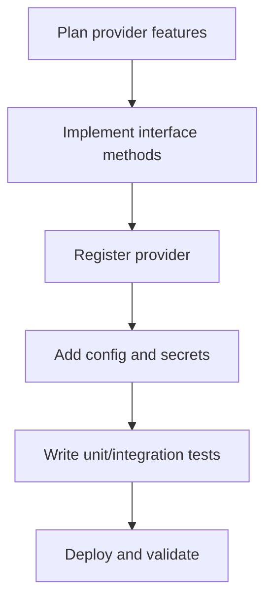
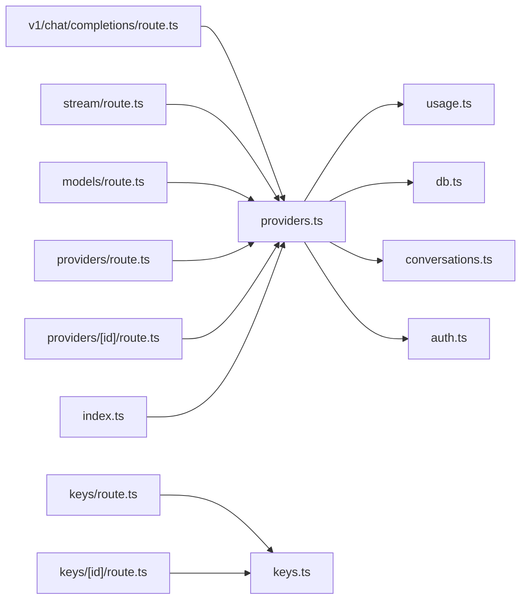

# Custom Provider Development

<cite>
**Referenced Files in This Document**
- [backend/src/providers.ts](file://backend/src/providers.ts)
- [backend/src/keys.ts](file://backend/src/keys.ts)
- [backend/src/auth.ts](file://backend/src/auth.ts)
- [backend/src/index.ts](file://backend/src/index.ts)
- [backend/src/conversations.ts](file://backend/src/conversations.ts)
- [backend/src/db.ts](file://backend/src/db.ts)
- [backend/src/usage.ts](file://backend/src/usage.ts)
- [src/app/api/v1/chat/completions/route.ts](file://src/app/api/v1/chat/completions/route.ts)
- [src/app/api/stream/route.ts](file://src/app/api/stream/route.ts)
- [src/app/api/models/route.ts](file://src/app/api/models/route.ts)
- [src/app/api/providers/route.ts](file://src/app/api/providers/route.ts)
- [src/app/api/providers/[id]/route.ts](file://src/app/api/providers/[id]/route.ts)
- [src/app/api/keys/route.ts](file://src/app/api/keys/route.ts)
- [src/app/api/keys/[id]/route.ts](file://src/app/api/keys/[id]/route.ts)
</cite>

## Table of Contents
1. [Introduction](#introduction)
2. [Project Structure](#project-structure)
3. [Core Components](#core-components)
4. [Architecture Overview](#architecture-overview)
5. [Detailed Component Analysis](#detailed-component-analysis)
6. [Dependency Analysis](#dependency-analysis)
7. [Performance Considerations](#performance-considerations)
8. [Troubleshooting Guide](#troubleshooting-guide)
9. [Conclusion](#conclusion)
10. [Appendices](#appendices)

## Introduction
This document explains how to implement custom AI providers within the project’s provider abstraction layer. It covers the architecture, interface requirements, implementation patterns, authentication and API key management, streaming responses, configuration, rate limiting, cost tracking, error handling strategies, and testing approaches. The goal is to enable developers to extend the existing provider system to support new AI services with minimal friction while maintaining consistency across the platform.

## Project Structure
The provider system spans both backend logic and Next.js API routes:
- Backend core modules define provider abstractions, key management, usage tracking, and database access.
- Next.js API routes expose endpoints for chat completions, streaming, models listing, provider CRUD, and key management.

**Diagram sources**
- [backend/src/providers.ts](file://backend/src/providers.ts)
- [backend/src/keys.ts](file://backend/src/keys.ts)
- [backend/src/usage.ts](file://backend/src/usage.ts)
- [backend/src/db.ts](file://backend/src/db.ts)
- [backend/src/conversations.ts](file://backend/src/conversations.ts)
- [backend/src/auth.ts](file://backend/src/auth.ts)
- [backend/src/index.ts](file://backend/src/index.ts)
- [src/app/api/v1/chat/completions/route.ts](file://src/app/api/v1/chat/completions/route.ts)
- [src/app/api/stream/route.ts](file://src/app/api/stream/route.ts)
- [src/app/api/models/route.ts](file://src/app/api/models/route.ts)
- [src/app/api/providers/route.ts](file://src/app/api/providers/route.ts)
- [src/app/api/providers/[id]/route.ts](file://src/app/api/providers/[id]/route.ts)
- [src/app/api/keys/route.ts](file://src/app/api/keys/route.ts)
- [src/app/api/keys/[id]/route.ts](file://src/app/api/keys/[id]/route.ts)

**Section sources**
- [backend/src/providers.ts](file://backend/src/providers.ts)
- [backend/src/index.ts](file://backend/src/index.ts)
- [src/app/api/v1/chat/completions/route.ts](file://src/app/api/v1/chat/completions/route.ts)
- [src/app/api/stream/route.ts](file://src/app/api/stream/route.ts)
- [src/app/api/models/route.ts](file://src/app/api/models/route.ts)
- [src/app/api/providers/route.ts](file://src/app/api/providers/route.ts)
- [src/app/api/providers/[id]/route.ts](file://src/app/api/providers/[id]/route.ts)
- [src/app/api/keys/route.ts](file://src/app/api/keys/route.ts)
- [src/app/api/keys/[id]/route.ts](file://src/app/api/keys/[id]/route.ts)

## Core Components
- Provider Abstraction Layer: Defines a unified interface for invoking AI models, including non-streaming and streaming modes, model discovery, and metadata.
- Key Management: Secure storage and retrieval of provider-specific credentials (e.g., API keys), with lifecycle operations.
- Usage Tracking: Aggregates token counts, request counts, and cost metrics per provider and model.
- Database Access: Persists provider configurations, keys, usage records, and conversation history.
- Authentication: Validates user sessions and scopes for protected endpoints.
- API Routes: Expose REST endpoints for chat completions, streaming, models, providers, and keys.

Key responsibilities:
- Normalize requests across providers.
- Enforce rate limits and quotas.
- Track costs and usage consistently.
- Provide consistent error semantics.

**Section sources**
- [backend/src/providers.ts](file://backend/src/providers.ts)
- [backend/src/keys.ts](file://backend/src/keys.ts)
- [backend/src/usage.ts](file://backend/src/usage.ts)
- [backend/src/db.ts](file://backend/src/db.ts)
- [backend/src/auth.ts](file://backend/src/auth.ts)
- [backend/src/conversations.ts](file://backend/src/conversations.ts)

## Architecture Overview
The provider abstraction sits at the center of the system. API routes orchestrate authentication, validation, routing to the appropriate provider, and response formatting. Providers encapsulate vendor-specific HTTP calls, streaming handling, and normalization into a common contract.

**Diagram sources**
- [src/app/api/v1/chat/completions/route.ts](file://src/app/api/v1/chat/completions/route.ts)
- [backend/src/auth.ts](file://backend/src/auth.ts)
- [backend/src/providers.ts](file://backend/src/providers.ts)
- [backend/src/keys.ts](file://backend/src/keys.ts)
- [backend/src/usage.ts](file://backend/src/usage.ts)
- [backend/src/db.ts](file://backend/src/db.ts)

## Detailed Component Analysis

### Provider Abstraction Interface
The provider abstraction defines a uniform contract that all concrete providers must implement. Typical responsibilities include:
- Model listing and capabilities
- Chat completion invocation (non-streaming)
- Chat completion streaming
- Request/response normalization
- Error mapping and retry policies
- Rate limiting and quota enforcement hooks
- Cost calculation inputs (tokens, pricing tiers)

Implementation pattern:
- Create a provider module implementing the interface.
- Register the provider with the central registry.
- Ensure consistent error types and metadata.

**Diagram sources**
- [backend/src/providers.ts](file://backend/src/providers.ts)

**Section sources**
- [backend/src/providers.ts](file://backend/src/providers.ts)

### Key Management
Securely manage provider credentials:
- Create, read, update, delete keys associated with providers.
- Encrypt sensitive values at rest.
- Scope keys to users or tenants.
- Validate presence before invoking providers.

**Diagram sources**
- [backend/src/keys.ts](file://backend/src/keys.ts)
- [backend/src/db.ts](file://backend/src/db.ts)
- [src/app/api/keys/route.ts](file://src/app/api/keys/route.ts)
- [src/app/api/keys/[id]/route.ts](file://src/app/api/keys/[id]/route.ts)

**Section sources**
- [backend/src/keys.ts](file://backend/src/keys.ts)
- [src/app/api/keys/route.ts](file://src/app/api/keys/route.ts)
- [src/app/api/keys/[id]/route.ts](file://src/app/api/keys/[id]/route.ts)

### Usage Tracking and Cost Integration
Track usage and compute costs:
- Count tokens and requests per provider/model.
- Apply pricing rules to calculate cost.
- Persist usage records for analytics and billing.

**Diagram sources**
- [backend/src/usage.ts](file://backend/src/usage.ts)
- [backend/src/db.ts](file://backend/src/db.ts)

**Section sources**
- [backend/src/usage.ts](file://backend/src/usage.ts)

### Authentication and Authorization
Protect provider-related endpoints:
- Validate user sessions and roles.
- Ensure users can only access their own keys and providers.
- Enforce scope-based access for admin operations.

**Diagram sources**
- [backend/src/auth.ts](file://backend/src/auth.ts)
- [backend/src/db.ts](file://backend/src/db.ts)

**Section sources**
- [backend/src/auth.ts](file://backend/src/auth.ts)

### API Routes Orchestration
- v1/chat/completions: Normalizes input, resolves provider, invokes provider, tracks usage, returns response or stream.
- stream: Handles server-sent events or chunked transfer for streaming responses.
- models: Lists available models from registered providers.
- providers: CRUD for provider definitions and configuration.
- keys: CRUD for provider credentials.

**Diagram sources**
- [src/app/api/v1/chat/completions/route.ts](file://src/app/api/v1/chat/completions/route.ts)
- [src/app/api/stream/route.ts](file://src/app/api/stream/route.ts)
- [backend/src/providers.ts](file://backend/src/providers.ts)
- [backend/src/usage.ts](file://backend/src/usage.ts)

**Section sources**
- [src/app/api/v1/chat/completions/route.ts](file://src/app/api/v1/chat/completions/route.ts)
- [src/app/api/stream/route.ts](file://src/app/api/stream/route.ts)
- [src/app/api/models/route.ts](file://src/app/api/models/route.ts)
- [src/app/api/providers/route.ts](file://src/app/api/providers/route.ts)
- [src/app/api/providers/[id]/route.ts](file://src/app/api/providers/[id]/route.ts)

### Step-by-Step: Creating a Custom Provider
1. Define provider metadata and capabilities.
2. Implement the provider interface:
   - listModels
   - chatCompletion
   - chatCompletionStream
   - normalizeRequest
   - mapError
   - calculateCost
3. Register the provider with the central registry.
4. Add provider-specific configuration fields and secrets.
5. Wire up rate limiting and quota checks.
6. Add tests for normal flows, errors, and streaming.

[No sources needed since this section provides general guidance]

### Handling Authentication and API Keys
- Use the key management module to store and retrieve provider credentials securely.
- Inject credentials into provider requests during invocation.
- Rotate keys without downtime by supporting multiple active keys and fallbacks.

**Section sources**
- [backend/src/keys.ts](file://backend/src/keys.ts)
- [backend/src/providers.ts](file://backend/src/providers.ts)

### Implementing Streaming Responses
- For streaming, return an async iterable or SSE-compatible stream.
- Map provider-specific streaming formats to a normalized chunk structure.
- Ensure proper cleanup and error propagation on stream termination.

**Section sources**
- [backend/src/providers.ts](file://backend/src/providers.ts)
- [src/app/api/stream/route.ts](file://src/app/api/stream/route.ts)

### Error Handling Strategies
- Normalize provider errors into a common schema.
- Distinguish transient vs permanent errors; apply retries for transient cases.
- Include actionable messages and codes for clients.

**Section sources**
- [backend/src/providers.ts](file://backend/src/providers.ts)

### Testing Approaches
- Unit tests: Mock provider HTTP calls and verify normalization and error mapping.
- Integration tests: Use test fixtures and sandboxed endpoints to validate end-to-end flows.
- Streaming tests: Assert chunk ordering and final aggregated result.
- Security tests: Verify key encryption and access controls.

[No sources needed since this section provides general guidance]

### Configuration, Rate Limiting, and Cost Tracking
- Configuration: Store provider settings (base URL, headers, timeouts) in the database and load them at runtime.
- Rate Limiting: Enforce per-provider and per-model limits; reject requests exceeding quotas.
- Cost Tracking: Integrate pricing tables and compute costs based on tokens and model tier.

**Section sources**
- [backend/src/providers.ts](file://backend/src/providers.ts)
- [backend/src/usage.ts](file://backend/src/usage.ts)
- [backend/src/db.ts](file://backend/src/db.ts)

## Dependency Analysis
The following diagram shows dependencies between core modules and API routes.

**Diagram sources**
- [src/app/api/v1/chat/completions/route.ts](file://src/app/api/v1/chat/completions/route.ts)
- [src/app/api/stream/route.ts](file://src/app/api/stream/route.ts)
- [src/app/api/models/route.ts](file://src/app/api/models/route.ts)
- [src/app/api/providers/route.ts](file://src/app/api/providers/route.ts)
- [src/app/api/providers/[id]/route.ts](file://src/app/api/providers/[id]/route.ts)
- [backend/src/providers.ts](file://backend/src/providers.ts)
- [backend/src/keys.ts](file://backend/src/keys.ts)
- [backend/src/usage.ts](file://backend/src/usage.ts)
- [backend/src/db.ts](file://backend/src/db.ts)
- [backend/src/conversations.ts](file://backend/src/conversations.ts)
- [backend/src/auth.ts](file://backend/src/auth.ts)
- [backend/src/index.ts](file://backend/src/index.ts)

**Section sources**
- [backend/src/index.ts](file://backend/src/index.ts)
- [backend/src/providers.ts](file://backend/src/providers.ts)
- [backend/src/keys.ts](file://backend/src/keys.ts)
- [backend/src/usage.ts](file://backend/src/usage.ts)
- [backend/src/db.ts](file://backend/src/db.ts)
- [backend/src/auth.ts](file://backend/src/auth.ts)
- [backend/src/conversations.ts](file://backend/src/conversations.ts)
- [src/app/api/v1/chat/completions/route.ts](file://src/app/api/v1/chat/completions/route.ts)
- [src/app/api/stream/route.ts](file://src/app/api/stream/route.ts)
- [src/app/api/models/route.ts](file://src/app/api/models/route.ts)
- [src/app/api/providers/route.ts](file://src/app/api/providers/route.ts)
- [src/app/api/providers/[id]/route.ts](file://src/app/api/providers/[id]/route.ts)
- [src/app/api/keys/route.ts](file://src/app/api/keys/route.ts)
- [src/app/api/keys/[id]/route.ts](file://src/app/api/keys/[id]/route.ts)

## Performance Considerations
- Prefer streaming for long-running generations to reduce latency and memory pressure.
- Cache model listings and static provider configs where safe.
- Batch usage recording to minimize database writes.
- Tune timeouts and concurrency per provider to avoid overload.
- Implement circuit breakers for failing providers to protect overall availability.

[No sources needed since this section provides general guidance]

## Troubleshooting Guide
Common issues and resolutions:
- Missing or invalid API keys: Verify key existence and permissions via key management endpoints.
- Rate limit exceeded: Check provider quotas and adjust limits or back off.
- Streaming interruptions: Ensure proper cleanup and reconnection logic; log partial usage.
- Inconsistent costs: Validate pricing rules and token counting logic.
- Authentication failures: Inspect token validity and user scopes.

**Section sources**
- [backend/src/keys.ts](file://backend/src/keys.ts)
- [backend/src/providers.ts](file://backend/src/providers.ts)
- [backend/src/usage.ts](file://backend/src/usage.ts)
- [backend/src/auth.ts](file://backend/src/auth.ts)

## Conclusion
By adhering to the provider abstraction interface and leveraging shared modules for keys, usage, and authentication, you can integrate new AI providers quickly and consistently. Focus on robust normalization, clear error semantics, streaming support, and accurate cost tracking to deliver a reliable multi-provider experience.

## Appendices

### API Reference Summary
- Chat Completions: POST /api/v1/chat/completions
- Streaming: GET/POST /api/stream (provider-dependent)
- Models: GET /api/models
- Providers: CRUD /api/providers and /api/providers/:id
- Keys: CRUD /api/keys and /api/keys/:id

**Section sources**
- [src/app/api/v1/chat/completions/route.ts](file://src/app/api/v1/chat/completions/route.ts)
- [src/app/api/stream/route.ts](file://src/app/api/stream/route.ts)
- [src/app/api/models/route.ts](file://src/app/api/models/route.ts)
- [src/app/api/providers/route.ts](file://src/app/api/providers/route.ts)
- [src/app/api/providers/[id]/route.ts](file://src/app/api/providers/[id]/route.ts)
- [src/app/api/keys/route.ts](file://src/app/api/keys/route.ts)
- [src/app/api/keys/[id]/route.ts](file://src/app/api/keys/[id]/route.ts)