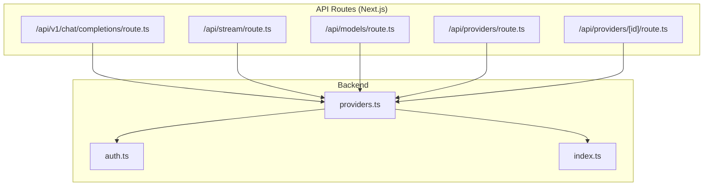
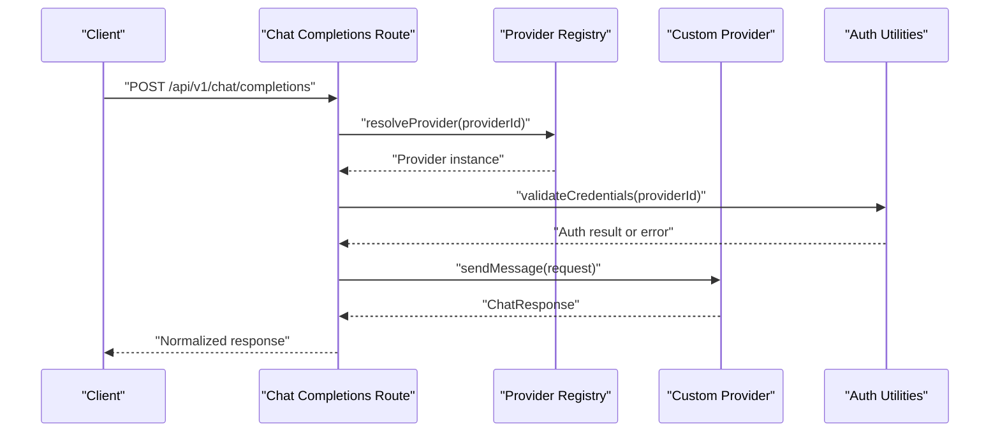
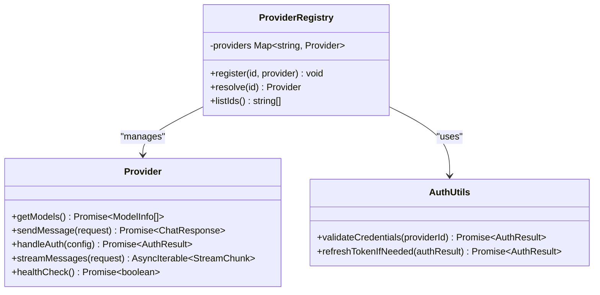
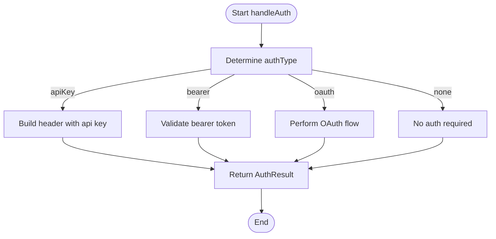
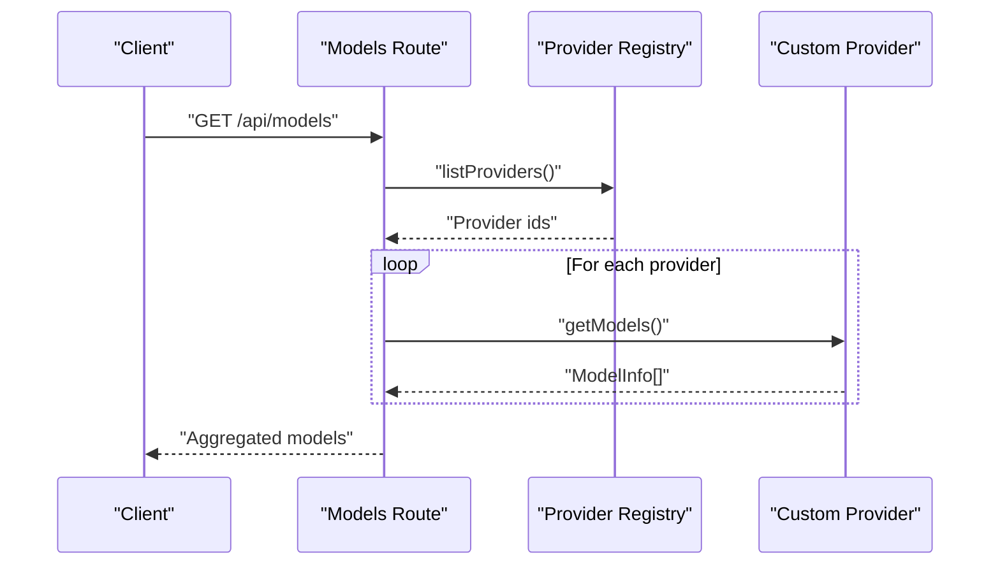
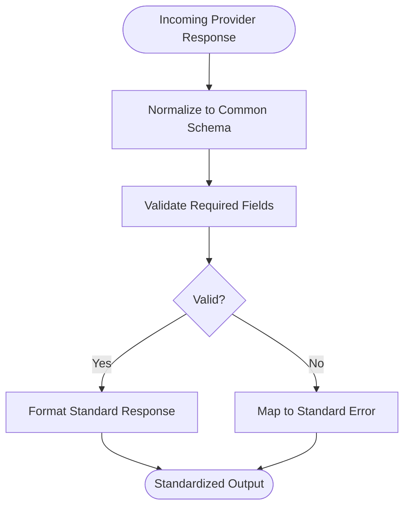
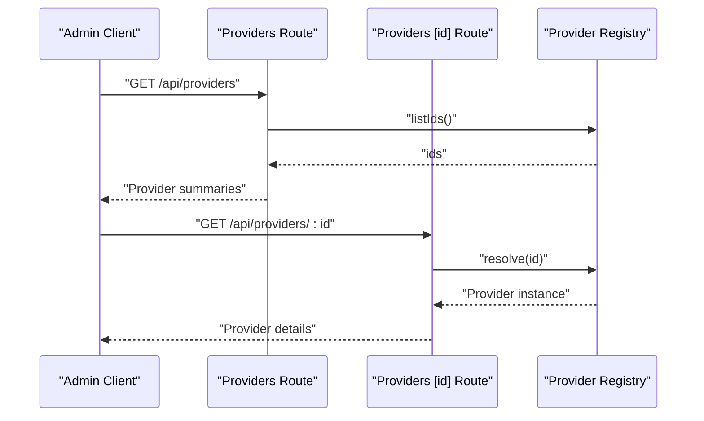
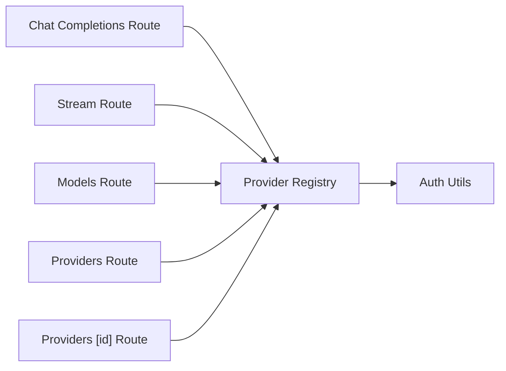

# Provider Interface Design

<cite>
**Referenced Files in This Document**
- [providers.ts](file://backend/src/providers.ts)
- [auth.ts](file://backend/src/auth.ts)
- [index.ts](file://backend/src/index.ts)
- [route.ts](file://src/app/api/v1/chat/completions/route.ts)
- [route.ts](file://src/app/api/stream/route.ts)
- [route.ts](file://src/app/api/models/route.ts)
- [route.ts](file://src/app/api/providers/route.ts)
- [route.ts](file://src/app/api/providers/[id]/route.ts)
</cite>

## Table of Contents
1. [Introduction](#introduction)
2. [Project Structure](#project-structure)
3. [Core Components](#core-components)
4. [Architecture Overview](#architecture-overview)
5. [Detailed Component Analysis](#detailed-component-analysis)
6. [Dependency Analysis](#dependency-analysis)
7. [Performance Considerations](#performance-considerations)
8. [Troubleshooting Guide](#troubleshooting-guide)
9. [Conclusion](#conclusion)

## Introduction
This document defines the provider interface design and abstraction layer for integrating custom AI model providers into the system. It specifies the required interfaces, method signatures, data structures, authentication flows, model listing capabilities, response formatting standards, error handling patterns, and compatibility guidelines to ensure a consistent provider ecosystem.

## Project Structure
The provider abstraction is implemented in the backend with routing and API endpoints exposed via Next.js app routes. The key files include:
- Backend provider registry and core logic
- Authentication utilities
- API routes for chat completions, streaming, models, and provider management

**Diagram sources**
- [providers.ts](file://backend/src/providers.ts)
- [auth.ts](file://backend/src/auth.ts)
- [index.ts](file://backend/src/index.ts)
- [route.ts](file://src/app/api/v1/chat/completions/route.ts)
- [route.ts](file://src/app/api/stream/route.ts)
- [route.ts](file://src/app/api/models/route.ts)
- [route.ts](file://src/app/api/providers/route.ts)
- [route.ts](file://src/app/api/providers/[id]/route.ts)

**Section sources**
- [providers.ts](file://backend/src/providers.ts)
- [auth.ts](file://backend/src/auth.ts)
- [index.ts](file://backend/src/index.ts)
- [route.ts](file://src/app/api/v1/chat/completions/route.ts)
- [route.ts](file://src/app/api/stream/route.ts)
- [route.ts](file://src/app/api/models/route.ts)
- [route.ts](file://src/app/api/providers/route.ts)
- [route.ts](file://src/app/api/providers/[id]/route.ts)

## Core Components
This section outlines the provider interface requirements that custom providers must implement.

- ProviderConfig interface
  - Purpose: Describes configuration metadata for a provider instance.
  - Required fields typically include:
    - id: Unique identifier for the provider
    - name: Human-readable provider name
    - baseUrl or endpoint template: Base URL or endpoint pattern used by the provider
    - authType: Authentication strategy (e.g., apiKey, oauth, none)
    - headers: Default HTTP headers to attach to requests
    - options: Provider-specific options (e.g., timeout, retries)
  - Validation: Implementers should validate config at initialization and throw descriptive errors on invalid inputs.

- Provider interface contract
  - getModels(): Promise<ModelInfo[]>
    - Returns a list of available models supported by the provider.
    - ModelInfo should include:
      - id: Model identifier
      - name: Display name
      - capabilities: Array of capabilities (e.g., "chat", "streaming")
      - pricing: Optional pricing metadata
  - sendMessage(request: ChatRequest): Promise<ChatResponse>
    - Handles non-streaming chat completion requests.
    - ChatRequest includes:
      - model: Selected model id
      - messages: Array of message objects with role and content
      - options: Optional parameters (temperature, maxTokens, etc.)
    - ChatResponse includes:
      - id: Response id
      - choices: Array of choice objects with message content and finishReason
      - usage: Token usage metrics
  - handleAuth(config: ProviderConfig): Promise<AuthResult>
    - Performs authentication based on authType.
    - AuthResult includes:
      - token: Access token or credentials payload
      - expiresAt: Expiration timestamp if applicable
      - headers: Headers to attach to subsequent requests
  - streamMessages(request: ChatRequest): AsyncIterable<StreamChunk>
    - Streams incremental responses when supported.
    - StreamChunk includes:
      - delta: Partial message content
      - index: Choice index
      - finishReason: Completion reason if final chunk
  - healthCheck(): Promise<boolean>
    - Verifies connectivity and basic functionality.

- Error handling patterns
  - Use typed error classes or structured error objects with:
    - code: Machine-readable error code
    - message: Human-readable description
    - details: Additional context (provider-specific)
  - Distinguish between transient errors (retryable) and permanent errors (non-retryable).
  - Normalize provider-specific errors into a common schema before returning to callers.

- Type definitions and contracts
  - All public methods must be strongly typed.
  - Return types must be stable across versions; avoid breaking changes to existing fields.
  - New optional fields should be additive only.

- Naming conventions
  - Provider ids: lowercase, hyphen-separated (e.g., "openai-compatible")
  - Methods: camelCase
  - Config keys: snake_case for external-facing configs; camelCase internally
  - Capabilities: lowercase tokens (e.g., "chat", "streaming", "vision")

**Section sources**
- [providers.ts](file://backend/src/providers.ts)
- [auth.ts](file://backend/src/auth.ts)

## Architecture Overview
The provider abstraction sits behind API routes that normalize client requests and route them to the appropriate provider implementation.

**Diagram sources**
- [route.ts](file://src/app/api/v1/chat/completions/route.ts)
- [providers.ts](file://backend/src/providers.ts)
- [auth.ts](file://backend/src/auth.ts)

## Detailed Component Analysis

### Provider Registry and Abstraction Layer
- Responsibilities:
  - Register provider implementations by id
  - Resolve provider instances dynamically
  - Enforce interface compliance
  - Provide default behaviors (e.g., fallbacks, timeouts)
- Key interactions:
  - Used by all API routes to obtain provider instances
  - Integrates with authentication utilities for credential validation

**Diagram sources**
- [providers.ts](file://backend/src/providers.ts)
- [auth.ts](file://backend/src/auth.ts)

**Section sources**
- [providers.ts](file://backend/src/providers.ts)
- [auth.ts](file://backend/src/auth.ts)

### Authentication Methods
- Supported strategies:
  - apiKey: Header-based secret
  - bearer: Bearer token
  - oauth: Authorization code flow with refresh
  - none: Public endpoints
- Implementation guidance:
  - handleAuth should return normalized headers and token metadata
  - Cache tokens where possible and refresh before expiration
  - Surface clear errors for invalid or expired credentials

**Diagram sources**
- [auth.ts](file://backend/src/auth.ts)

**Section sources**
- [auth.ts](file://backend/src/auth.ts)

### Model Listing Capabilities
- getModels() must return a stable list of models with consistent fields.
- Providers may cache model lists and invalidate on configuration changes.
- API route exposes a normalized models endpoint for clients.

**Diagram sources**
- [route.ts](file://src/app/api/models/route.ts)
- [providers.ts](file://backend/src/providers.ts)

**Section sources**
- [route.ts](file://src/app/api/models/route.ts)
- [providers.ts](file://backend/src/providers.ts)

### Response Formatting Standards
- Non-streaming responses:
  - Must include id, choices, and usage
  - choices[i].message.content must be present
  - finishReason indicates completion status
- Streaming responses:
  - Each chunk contains partial deltas
  - Final chunk includes finishReason
- Normalization:
  - Convert provider-specific formats into a unified schema
  - Preserve original provider fields under an extension namespace if needed

**Diagram sources**
- [route.ts](file://src/app/api/v1/chat/completions/route.ts)
- [route.ts](file://src/app/api/stream/route.ts)

**Section sources**
- [route.ts](file://src/app/api/v1/chat/completions/route.ts)
- [route.ts](file://src/app/api/stream/route.ts)

### Provider Management Endpoints
- List providers:
  - GET /api/providers returns registered provider metadata
- Get provider by id:
  - GET /api/providers/:id returns detailed configuration and capabilities
- These endpoints rely on the registry to enumerate and describe providers.

**Diagram sources**
- [route.ts](file://src/app/api/providers/route.ts)
- [route.ts](file://src/app/api/providers/[id]/route.ts)
- [providers.ts](file://backend/src/providers.ts)

**Section sources**
- [route.ts](file://src/app/api/providers/route.ts)
- [route.ts](file://src/app/api/providers/[id]/route.ts)
- [providers.ts](file://backend/src/providers.ts)

## Dependency Analysis
The following diagram shows how API routes depend on the provider registry and authentication utilities.

**Diagram sources**
- [route.ts](file://src/app/api/v1/chat/completions/route.ts)
- [route.ts](file://src/app/api/stream/route.ts)
- [route.ts](file://src/app/api/models/route.ts)
- [route.ts](file://src/app/api/providers/route.ts)
- [route.ts](file://src/app/api/providers/[id]/route.ts)
- [providers.ts](file://backend/src/providers.ts)
- [auth.ts](file://backend/src/auth.ts)

**Section sources**
- [route.ts](file://src/app/api/v1/chat/completions/route.ts)
- [route.ts](file://src/app/api/stream/route.ts)
- [route.ts](file://src/app/api/models/route.ts)
- [route.ts](file://src/app/api/providers/route.ts)
- [route.ts](file://src/app/api/providers/[id]/route.ts)
- [providers.ts](file://backend/src/providers.ts)
- [auth.ts](file://backend/src/auth.ts)

## Performance Considerations
- Cache model listings and provider metadata to reduce overhead.
- Reuse authenticated sessions and refresh tokens proactively.
- Implement request timeouts and retry policies with exponential backoff for transient errors.
- Prefer streaming for long-running generations to improve perceived latency.
- Avoid synchronous blocking operations in provider implementations.

## Troubleshooting Guide
Common issues and resolutions:
- Invalid provider configuration
  - Ensure all required fields are present and valid
  - Validate base URLs and header formats
- Authentication failures
  - Confirm credentials and scopes
  - Check token expiration and refresh logic
- Model listing errors
  - Verify network connectivity and provider availability
  - Inspect normalization mappings for unexpected provider responses
- Streaming interruptions
  - Handle partial chunks gracefully
  - Implement reconnection and resume logic where feasible

**Section sources**
- [auth.ts](file://backend/src/auth.ts)
- [providers.ts](file://backend/src/providers.ts)

## Conclusion
By adhering to the defined provider interface, authentication strategies, response normalization, and error handling patterns, custom providers can integrate seamlessly into the ecosystem. Maintaining backward compatibility, following naming conventions, and leveraging caching and streaming will ensure robust performance and a consistent developer experience.