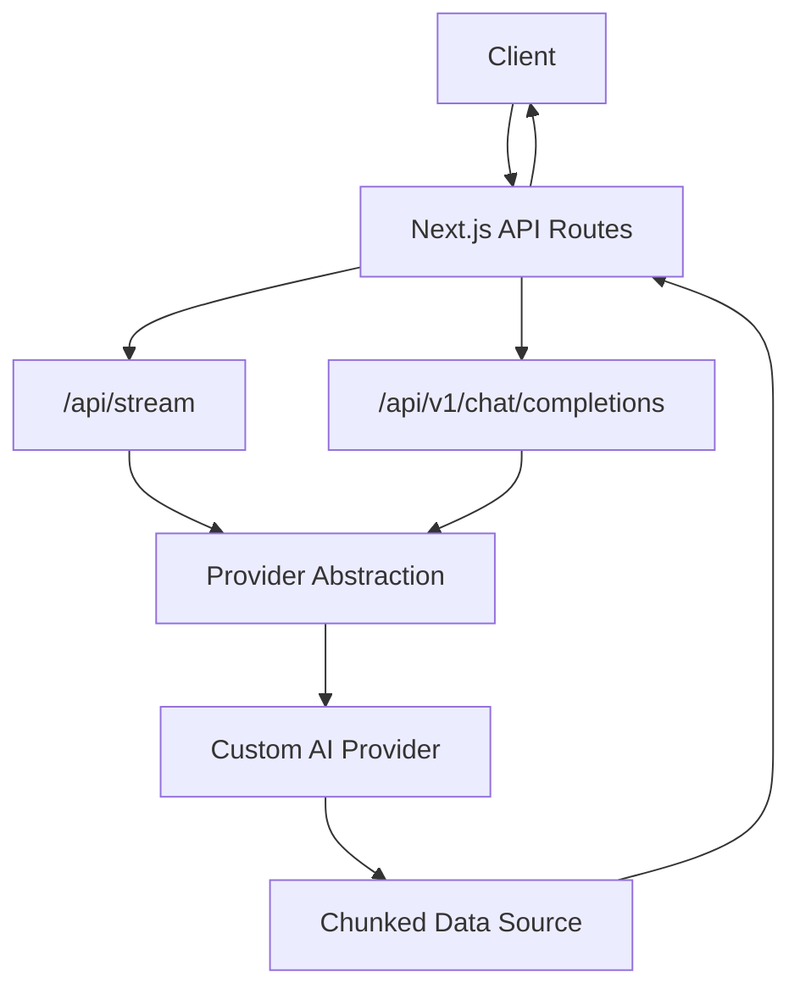
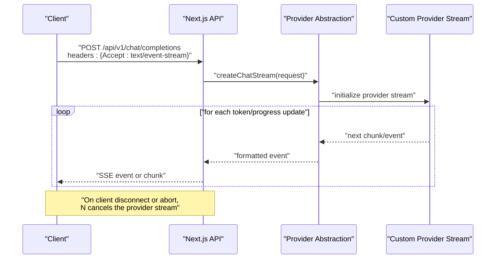
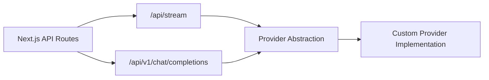

# Streaming Responses

<cite>
**Referenced Files in This Document**
- [index.ts](file://backend/src/index.ts)
- [providers.ts](file://backend/src/providers.ts)
- [route.ts](file://src/app/api/stream/route.ts)
- [route.ts](file://src/app/api/v1/chat/completions/route.ts)
</cite>

## Table of Contents
1. [Introduction](#introduction)
2. [Project Structure](#project-structure)
3. [Core Components](#core-components)
4. [Architecture Overview](#architecture-overview)
5. [Detailed Component Analysis](#detailed-component-analysis)
6. [Dependency Analysis](#dependency-analysis)
7. [Performance Considerations](#performance-considerations)
8. [Troubleshooting Guide](#troubleshooting-guide)
9. [Conclusion](#conclusion)

## Introduction
This document explains how to implement streaming responses for custom AI providers using server-sent events (SSE) and chunked transfer encoding. It covers real-time data transmission patterns, proper formatting of streaming payloads, handling connection errors and client disconnections, and best practices for performance and memory management. It also includes examples for streaming chat completions, progress updates, and partial content delivery.

## Project Structure
The project is a Next.js application with a Node backend. Streaming-related endpoints are implemented under the API routes:
- A generic streaming endpoint at /api/stream
- A v1-compatible chat completions endpoint at /api/v1/chat/completions

[No sources needed since this diagram shows conceptual workflow, not actual code structure]

## Core Components
- Streaming route handler: Accepts requests, validates inputs, initializes provider streams, and writes SSE or chunked responses back to the client.
- Chat completions route: Implements OpenAI-compatible streaming semantics for chat completions, including delta tokens and optional usage metadata.
- Provider abstraction: Encapsulates provider-specific streaming logic behind a common interface so clients can consume any provider uniformly.

Key responsibilities:
- Parse request bodies and headers
- Initialize provider stream
- Write SSE events or HTTP chunks
- Handle cancellation and errors
- Emit progress and partial content

**Section sources**
- [route.ts](file://src/app/api/stream/route.ts)
- [route.ts](file://src/app/api/v1/chat/completions/route.ts)
- [providers.ts](file://backend/src/providers.ts)
- [index.ts](file://backend/src/index.ts)

## Architecture Overview
The streaming architecture uses an event-driven pipeline:
- The API layer receives a request and delegates to the provider abstraction.
- The provider returns a readable stream of events or chunks.
- The API layer formats these into SSE or chunked HTTP responses.
- Cancellation signals from the client terminate the upstream provider stream.

**Diagram sources**
- [route.ts](file://src/app/api/v1/chat/completions/route.ts)
- [providers.ts](file://backend/src/providers.ts)
- [index.ts](file://backend/src/index.ts)

## Detailed Component Analysis

### Streaming Route (/api/stream)
Purpose:
- Generic streaming endpoint that forwards a request to a selected provider and relays its output as SSE or chunked data.

Responsibilities:
- Validate input parameters and provider selection
- Initialize provider stream with request context
- Set appropriate response headers for streaming
- Write events/chunks until completion or error
- Ensure cleanup on client disconnect

Error handling:
- Map provider errors to SSE error events or HTTP error codes
- Abort upstream stream on client disconnect
- Log diagnostics without leaking sensitive details

Progress updates:
- Emit typed events for progress (e.g., start, token, done)
- Include optional metadata such as token counts or latency hints

**Section sources**
- [route.ts](file://src/app/api/stream/route.ts)

### Chat Completions Route (/api/v1/chat/completions)
Purpose:
- Implements OpenAI-compatible streaming chat completions.

Responsibilities:
- Parse messages, model, and streaming flags
- Create a provider chat stream
- Emit incremental deltas per token
- Optionally emit final usage summary
- Support client-side cancellation via AbortController

Data format:
- Each event contains a minimal payload with id, object type, choices array, and delta fields
- Final event may include usage metrics

Cancellation:
- Honor AbortSignal to stop reading from the provider stream
- Close the writable stream cleanly

**Section sources**
- [route.ts](file://src/app/api/v1/chat/completions/route.ts)

### Provider Abstraction Layer
Purpose:
- Define a uniform interface for streaming across multiple AI providers.

Interface highlights:
- createChatStream(params): returns an async iterable or Readable stream
- Event types: token, message, progress, error, done
- Error normalization: map provider-specific errors to common shapes

Implementation notes:
- Use backpressure-aware iteration to avoid memory spikes
- Respect timeouts and retry policies where applicable
- Provide telemetry hooks for metrics collection

**Section sources**
- [providers.ts](file://backend/src/providers.ts)
- [index.ts](file://backend/src/index.ts)

### Server-Sent Events (SSE) Implementation
Guidelines:
- Set Content-Type to text/event-stream and Cache-Control to no-cache
- Send events as newline-delimited blocks with event:, data:, and id: fields
- Use keep-alive comments periodically if long idle times are expected
- Terminate the stream by ending the response after the last event

Formatting rules:
- Each field ends with a colon and a space
- Multiple lines of data must be split across multiple data: lines
- End each event with two newlines

Connection lifecycle:
- On connect, send a welcome or ping event
- On error, send an event with a non-zero status and close
- On completion, send a final event and close

**Section sources**
- [route.ts](file://src/app/api/stream/route.ts)

### Chunked Transfer Encoding
When SSE is not required:
- Use HTTP 200 with Transfer-Encoding: chunked
- Write small JSON fragments or plain text chunks
- Maintain ordering and ensure the client can reassemble the stream

Backpressure:
- Check writable stream state before writing
- Pause upstream producers when the buffer grows too large

**Section sources**
- [route.ts](file://src/app/api/stream/route.ts)

### Real-Time Data Transmission Patterns
Patterns:
- Token-by-token streaming for chat completions
- Progress events for long-running tasks (e.g., file processing)
- Partial content delivery for search results or suggestions

Best practices:
- Keep events small and frequent
- Batch only when it improves throughput without hurting latency
- Include sequence numbers or IDs for ordering guarantees

**Section sources**
- [route.ts](file://src/app/api/v1/chat/completions/route.ts)
- [route.ts](file://src/app/api/stream/route.ts)

### Handling Connection Errors and Client Disconnections
Strategies:
- Listen for abort/close events on the incoming request
- Cancel upstream provider streams immediately
- Clean up resources (timers, buffers, temporary files)
- Return structured error events rather than raw stack traces

Recovery:
- Implement idempotent resume markers when feasible
- Provide retry guidance in error events

**Section sources**
- [route.ts](file://src/app/api/stream/route.ts)
- [route.ts](file://src/app/api/v1/chat/completions/route.ts)

### Examples

#### Streaming Chat Completions
- Request: POST /api/v1/chat/completions with streaming enabled
- Response: SSE events containing incremental choice deltas
- Completion: Final event with usage summary

**Section sources**
- [route.ts](file://src/app/api/v1/chat/completions/route.ts)

#### Progress Updates
- Emit typed events like "start", "token", "done"
- Include optional metadata such as token count or estimated time remaining

**Section sources**
- [route.ts](file://src/app/api/stream/route.ts)

#### Partial Content Delivery
- For non-chat use cases, stream intermediate results as they become available
- Ensure consistent schema across partial and final payloads

**Section sources**
- [route.ts](file://src/app/api/stream/route.ts)

## Dependency Analysis
The streaming flow depends on:
- Next.js API routing for request handling
- Provider abstraction for pluggable streaming implementations
- Standard Node streams or async iterables for backpressure control

**Diagram sources**
- [route.ts](file://src/app/api/stream/route.ts)
- [route.ts](file://src/app/api/v1/chat/completions/route.ts)
- [providers.ts](file://backend/src/providers.ts)
- [index.ts](file://backend/src/index.ts)

**Section sources**
- [route.ts](file://src/app/api/stream/route.ts)
- [route.ts](file://src/app/api/v1/chat/completions/route.ts)
- [providers.ts](file://backend/src/providers.ts)
- [index.ts](file://backend/src/index.ts)

## Performance Considerations
- Backpressure: Always respect writable stream backpressure; pause producers when buffers grow.
- Memory: Avoid buffering entire responses; stream incrementally and release references promptly.
- Batching: Combine small tokens only when necessary to reduce overhead.
- Timeouts: Enforce per-request timeouts and propagate cancellation signals.
- Compression: Prefer not to compress SSE streams; let the network handle transport-level compression.
- Metrics: Track latency, throughput, and error rates per provider and event type.

[No sources needed since this section provides general guidance]

## Troubleshooting Guide
Common issues:
- Missing or incorrect SSE headers: Ensure Content-Type and Cache-Control are set correctly.
- Incomplete events: Verify each event ends with two newlines and multi-line data is split properly.
- Stalled connections: Add periodic keep-alive comments if idle for extended periods.
- High memory usage: Inspect buffering points and enforce backpressure checks.
- Provider errors: Normalize and surface clear error events; log detailed diagnostics server-side.

Debugging steps:
- Enable verbose logging for request IDs and provider calls
- Capture event sequences for reproduction
- Test with curl or a dedicated SSE client to isolate client-side issues

**Section sources**
- [route.ts](file://src/app/api/stream/route.ts)
- [route.ts](file://src/app/api/v1/chat/completions/route.ts)

## Conclusion
Streaming responses enable low-latency, interactive experiences for AI applications. By implementing robust SSE or chunked pipelines, normalizing provider outputs, and carefully managing backpressure and errors, you can deliver reliable real-time interactions at scale. Use the provided patterns and guidelines to integrate custom AI providers seamlessly while maintaining high performance and observability.