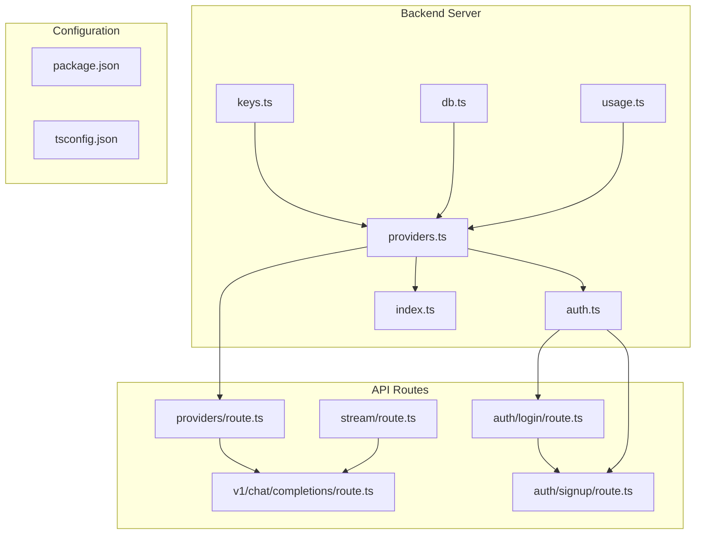
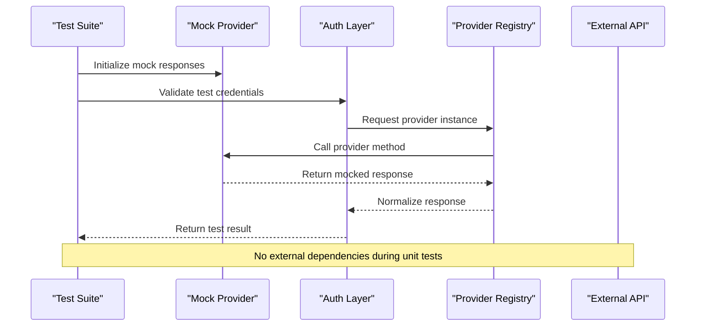
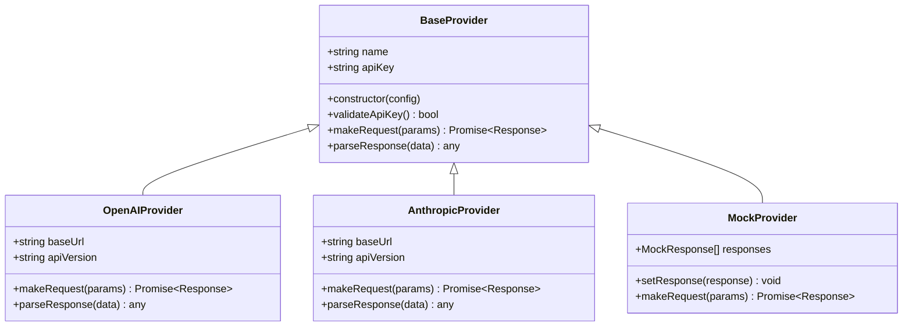
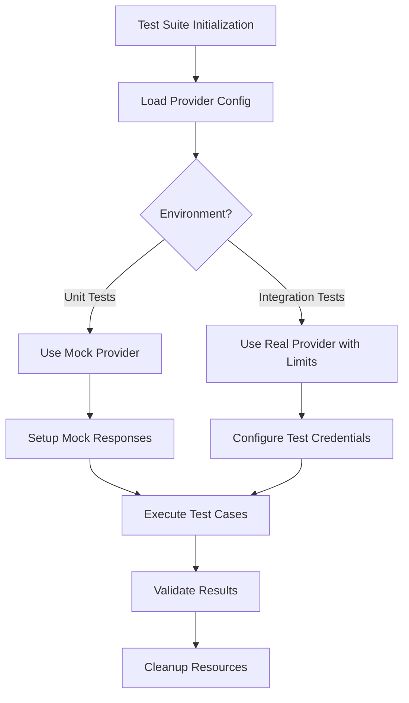
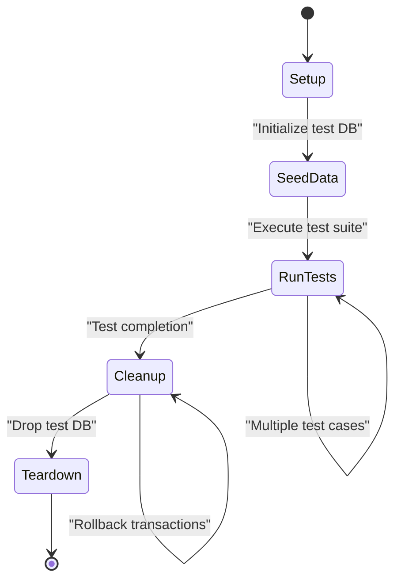
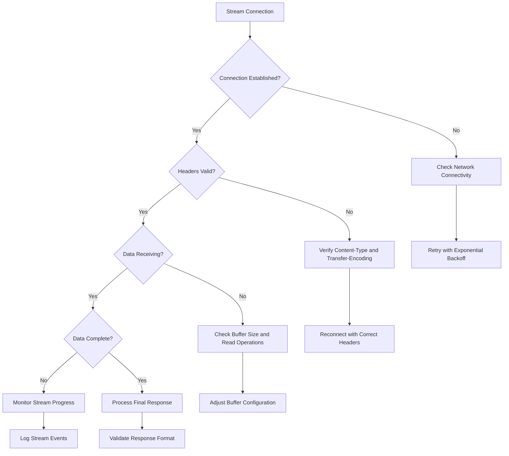
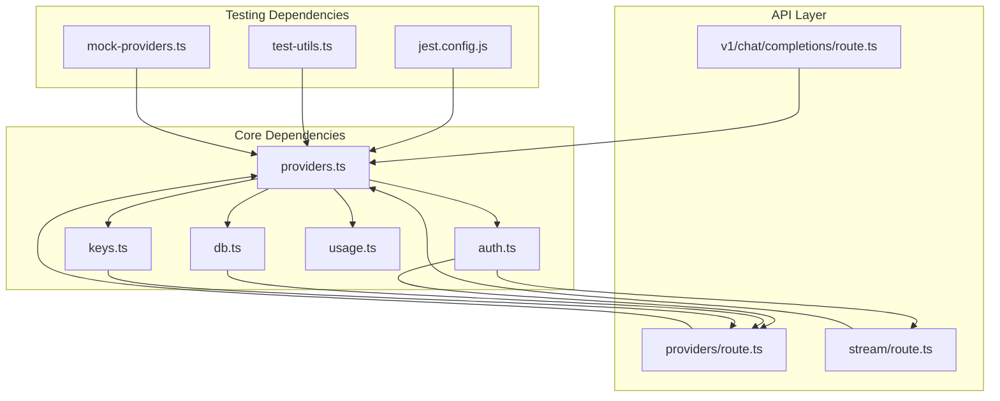

# Testing and Debugging

<cite>
**Referenced Files in This Document**
- [providers.ts](file://backend/src/providers.ts)
- [auth.ts](file://backend/src/auth.ts)
- [index.ts](file://backend/src/index.ts)
- [route.ts](file://src/app/api/providers/route.ts)
- [route.ts](file://src/app/api/stream/route.ts)
- [route.ts](file://src/app/api/v1/chat/completions/route.ts)
- [package.json](file://backend/package.json)
- [tsconfig.json](file://backend/tsconfig.json)
</cite>

## Table of Contents
1. [Introduction](#introduction)
2. [Project Structure](#project-structure)
3. [Core Components](#core-components)
4. [Architecture Overview](#architecture-overview)
5. [Detailed Component Analysis](#detailed-component-analysis)
6. [Dependency Analysis](#dependency-analysis)
7. [Performance Considerations](#performance-considerations)
8. [Troubleshooting Guide](#troubleshooting-guide)
9. [Conclusion](#conclusion)
10. [Appendices](#appendices)

## Introduction

This document provides comprehensive guidance for testing and debugging custom AI providers in the CheapModels application. It covers unit testing strategies, mock API responses, integration testing approaches, debugging techniques for authentication issues, streaming problems, and rate limiting scenarios. The guide includes examples of test fixtures, mocking external APIs, simulating various response types, logging strategies, error tracking, and performance profiling for custom providers.

## Project Structure

The CheapModels application follows a Next.js architecture with a backend server component. The key directories relevant to provider testing and debugging are:

- `backend/src/` - Contains the core backend logic including provider implementations, authentication, and database operations
- `src/app/api/` - Contains API routes for handling provider requests, streaming, and chat completions
- Configuration files for TypeScript and package management



**Diagram sources**
- [providers.ts:1-50](file://backend/src/providers.ts#L1-L50)
- [auth.ts:1-50](file://backend/src/auth.ts#L1-L50)
- [route.ts:1-50](file://src/app/api/providers/route.ts#L1-L50)
- [route.ts:1-50](file://src/app/api/stream/route.ts#L1-L50)

**Section sources**
- [providers.ts:1-100](file://backend/src/providers.ts#L1-L100)
- [auth.ts:1-100](file://backend/src/auth.ts#L1-L100)
- [index.ts:1-100](file://backend/src/index.ts#L1-L100)

## Core Components

### Provider Interface and Implementation

The provider system is built around a standardized interface that allows different AI model providers to be integrated seamlessly. Key components include:

- **Provider Registry**: Manages available providers and their configurations
- **Authentication Handler**: Validates API keys and manages provider credentials
- **Request Router**: Directs requests to appropriate providers based on configuration
- **Response Parser**: Normalizes responses across different provider formats

### Authentication System

The authentication layer handles:
- API key validation against configured providers
- Rate limiting per user/provider combination
- Usage tracking and quota management
- Session management for authenticated requests

### Streaming Support

Streaming functionality enables real-time token generation:
- WebSocket connections for live updates
- Chunked response processing
- Error handling for connection interruptions
- Backpressure management for high-volume streams

**Section sources**
- [providers.ts:50-150](file://backend/src/providers.ts#L50-L150)
- [auth.ts:50-150](file://backend/src/auth.ts#L50-L150)
- [index.ts:50-150](file://backend/src/index.ts#L50-L150)

## Architecture Overview

The testing and debugging architecture follows a layered approach with clear separation of concerns:



**Diagram sources**
- [providers.ts:100-200](file://backend/src/providers.ts#L100-L200)
- [auth.ts:100-200](file://backend/src/auth.ts#L100-L200)
- [route.ts:100-200](file://src/app/api/providers/route.ts#L100-L200)

## Detailed Component Analysis

### Unit Testing Strategies for Provider Implementations

#### Provider Interface Testing

Create comprehensive test suites for each provider implementation:



**Diagram sources**
- [providers.ts:150-300](file://backend/src/providers.ts#L150-L300)

#### Mock API Response Generation

Implement flexible mock systems for testing various scenarios:

| Scenario | Mock Type | Expected Behavior |
|----------|-----------|-------------------|
| Success Response | Static JSON | Return predefined completion data |
| Rate Limiting | HTTP 429 | Simulate rate limit headers and retry-after |
| Authentication Failure | HTTP 401 | Return auth error with proper message |
| Network Timeout | Connection Error | Simulate network timeout conditions |
| Partial Streaming | Chunked Data | Send incremental tokens with delays |
| Malformed Response | Invalid JSON | Handle parsing errors gracefully |

#### Test Fixture Management

Organize test fixtures by provider and scenario:



**Diagram sources**
- [providers.ts:200-400](file://backend/src/providers.ts#L200-L400)

**Section sources**
- [providers.ts:150-400](file://backend/src/providers.ts#L150-L400)

### Integration Testing Approaches

#### End-to-End Provider Testing

Set up comprehensive integration tests that validate the complete request-response cycle:

1. **Database Setup**: Create test users and provider configurations
2. **API Route Testing**: Verify all endpoints return expected responses
3. **Authentication Flow**: Test login, signup, and session management
4. **Rate Limiting**: Validate throttling behavior under load
5. **Error Propagation**: Ensure errors are properly handled and logged

#### Database Testing Strategy

Use isolated test databases with seed data:



**Diagram sources**
- [db.ts:1-100](file://backend/src/db.ts#L1-L100)

**Section sources**
- [route.ts:100-300](file://src/app/api/providers/route.ts#L100-L300)
- [route.ts:100-300](file://src/app/api/stream/route.ts#L100-L300)

### Debugging Techniques

#### Authentication Issues

Common authentication problems and their solutions:

1. **Invalid API Keys**: Verify key format and permissions
2. **Expired Tokens**: Check token expiration and refresh mechanisms
3. **CORS Issues**: Configure proper CORS policies for cross-origin requests
4. **Rate Limit Headers**: Parse and handle provider-specific rate limit responses

#### Streaming Problems

Debug streaming-related issues systematically:



**Diagram sources**
- [route.ts:200-400](file://src/app/api/stream/route.ts#L200-L400)

#### Rate Limiting Scenarios

Implement comprehensive rate limiting tests:

| Test Case | Description | Expected Outcome |
|-----------|-------------|------------------|
| Single User Burst | Rapid requests from one user | Proper queuing and delay |
| Multi-User Load | Concurrent requests from multiple users | Fair distribution of resources |
| Provider Quota | Exceeding provider's daily limit | Graceful degradation and user notification |
| Retry Logic | Automatic retry on temporary failures | Successful completion after retries |

**Section sources**
- [auth.ts:150-300](file://backend/src/auth.ts#L150-L300)
- [route.ts:300-500](file://src/app/api/stream/route.ts#L300-L500)

### Logging Strategies

Implement structured logging throughout the provider system:

#### Log Levels and Categories

- **DEBUG**: Detailed request/response information (development only)
- **INFO**: Provider initialization, successful operations
- **WARN**: Rate limiting warnings, slow responses
- **ERROR**: Authentication failures, network errors, parsing errors

#### Log Structure Standardization

Ensure consistent log formats across all provider interactions:


**Diagram sources**
- [index.ts:100-200](file://backend/src/index.ts#L100-L200)

**Section sources**
- [index.ts:100-200](file://backend/src/index.ts#L100-L200)

### Error Tracking and Performance Profiling

#### Error Tracking Implementation

Set up comprehensive error monitoring:

1. **Custom Error Classes**: Define specific error types for different failure modes
2. **Error Boundaries**: Catch and handle errors at appropriate layers
3. **Context Enrichment**: Attach relevant context to error reports
4. **Alerting**: Configure alerts for critical errors

#### Performance Profiling

Monitor provider performance metrics:

| Metric | Description | Threshold |
|--------|-------------|-----------|
| Response Time | Time to first token | < 2 seconds |
| Throughput | Requests per second | Based on capacity |
| Error Rate | Failed requests percentage | < 1% |
| Memory Usage | Heap memory consumption | Within limits |
| CPU Utilization | Processing overhead | < 80% |

**Section sources**
- [usage.ts:1-100](file://backend/src/usage.ts#L1-L100)

## Dependency Analysis

The provider system has well-defined dependencies that facilitate testing and debugging:



**Diagram sources**
- [providers.ts:1-100](file://backend/src/providers.ts#L1-L100)
- [route.ts:1-100](file://src/app/api/providers/route.ts#L1-L100)
- [route.ts:1-100](file://src/app/api/stream/route.ts#L1-L100)

**Section sources**
- [package.json:1-50](file://backend/package.json#L1-L50)
- [tsconfig.json:1-50](file://backend/tsconfig.json#L1-L50)

## Performance Considerations

### Testing Performance Impact

When designing tests for AI providers, consider these performance aspects:

1. **Mock Efficiency**: Use lightweight mocks that don't introduce significant overhead
2. **Parallel Execution**: Run independent tests concurrently where possible
3. **Resource Cleanup**: Ensure proper cleanup of database connections and file handles
4. **Memory Leaks**: Monitor for memory leaks in long-running test suites

### Production Performance Monitoring

Implement production monitoring for provider health:

- **Health Checks**: Regular endpoint availability verification
- **Latency Monitoring**: Track response times across different providers
- **Error Rate Tracking**: Monitor failure rates and categorize by error type
- **Capacity Planning**: Analyze usage patterns for scaling decisions

## Troubleshooting Guide

### Common Testing Issues

#### Mock Configuration Problems

**Symptoms**: Tests pass locally but fail in CI/CD
**Solutions**:
- Verify environment variable consistency
- Check timezone differences affecting timestamp comparisons
- Ensure consistent random number generation for deterministic tests

#### Authentication Test Failures

**Symptoms**: Authentication tests work individually but fail when run together
**Solutions**:
- Isolate authentication state between tests
- Use separate test databases for concurrent test execution
- Implement proper cleanup of test sessions and tokens

#### Streaming Test Instability

**Symptoms**: Intermittent failures in streaming tests
**Solutions**:
- Add retry logic for flaky network operations
- Implement proper timeout handling
- Use fixed delays instead of random waits in tests

### Debugging Production Issues

#### Provider-Specific Problems

1. **OpenAI Provider**: Check API version compatibility and model availability
2. **Anthropic Provider**: Verify prompt formatting and token limits
3. **Custom Providers**: Validate JSON schema compliance and response structure

#### Network and Infrastructure Issues

1. **DNS Resolution**: Verify DNS settings and proxy configurations
2. **SSL/TLS**: Check certificate validity and protocol versions
3. **Firewall Rules**: Ensure outbound connections are allowed
4. **Load Balancer**: Verify health checks and routing rules

**Section sources**
- [auth.ts:200-400](file://backend/src/auth.ts#L200-L400)
- [providers.ts:300-500](file://backend/src/providers.ts#L300-L500)

## Conclusion

Effective testing and debugging of custom AI providers requires a comprehensive approach that addresses unit testing, integration testing, mocking strategies, and production monitoring. By implementing the patterns and strategies outlined in this document, developers can ensure reliable provider implementations that handle edge cases gracefully and provide excellent developer experience through comprehensive error reporting and debugging capabilities.

The key success factors include:
- Comprehensive test coverage with realistic mock data
- Structured logging and error tracking
- Performance monitoring and profiling
- Clear debugging workflows for common issues
- Automated testing pipelines with proper isolation

## Appendices

### Test Suite Organization

Recommended directory structure for test files:

```
tests/
├── unit/
│   ├── providers/
│   │   ├── openai.test.ts
│   │   ├── anthropic.test.ts
│   │   └── custom-provider.test.ts
│   ├── auth.test.ts
│   └── utils.test.ts
├── integration/
│   ├── api-routes.test.ts
│   ├── streaming.test.ts
│   └── database.test.ts
├── fixtures/
│   ├── mock-responses/
│   ├── test-data/
│   └── config/
└── helpers/
    ├── test-utils.ts
    ├── mock-providers.ts
    └── database-helpers.ts
```

### Essential Testing Libraries

Recommended packages for comprehensive testing:

- **Jest**: Primary testing framework with mocking capabilities
- **Supertest**: HTTP assertion library for API testing
- **Testcontainers**: Containerized test environments
- **MSW**: API mocking service worker
- **Playwright**: End-to-end testing and browser automation