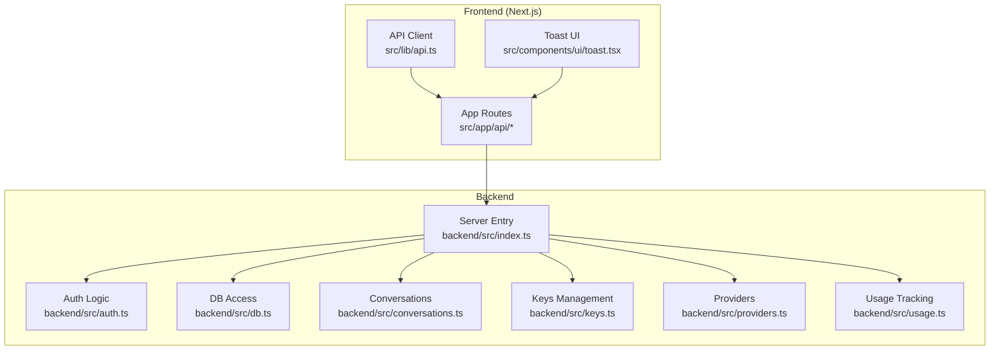
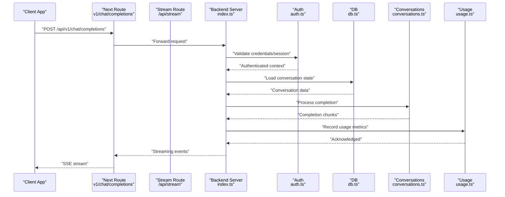
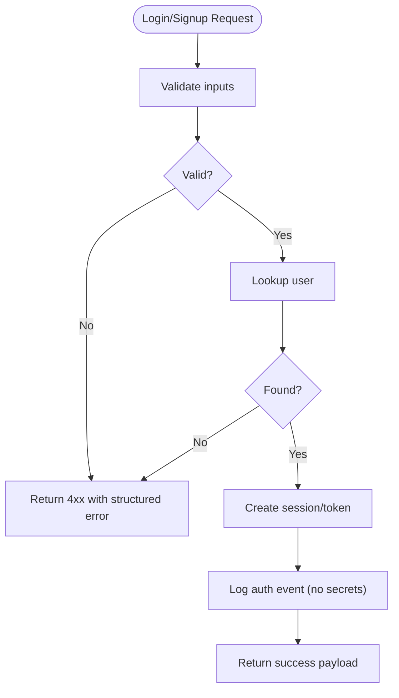
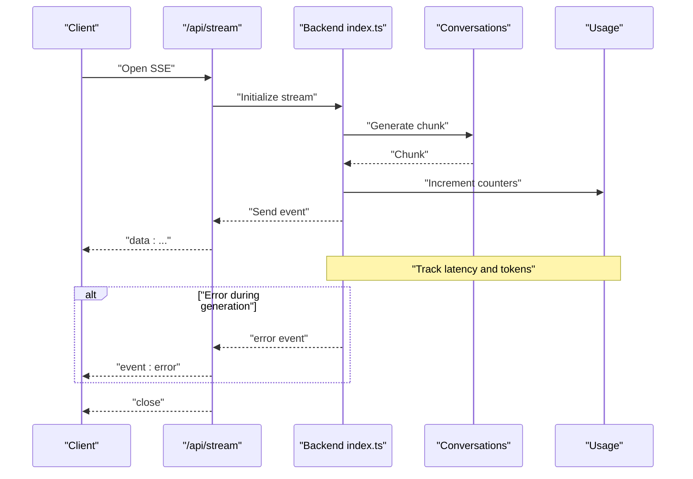
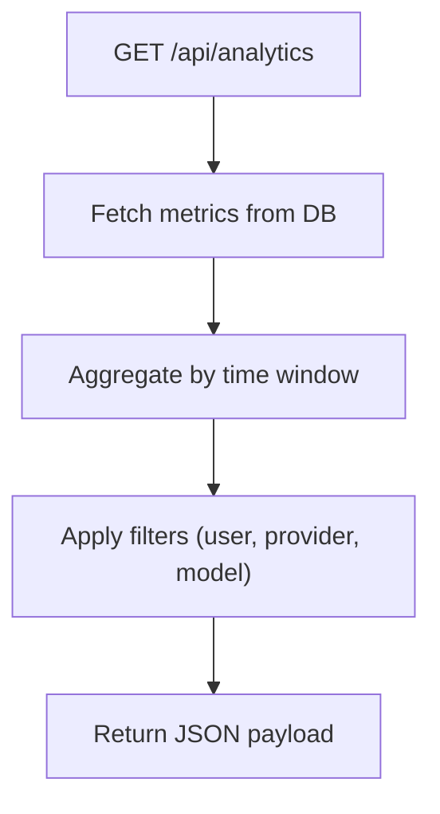
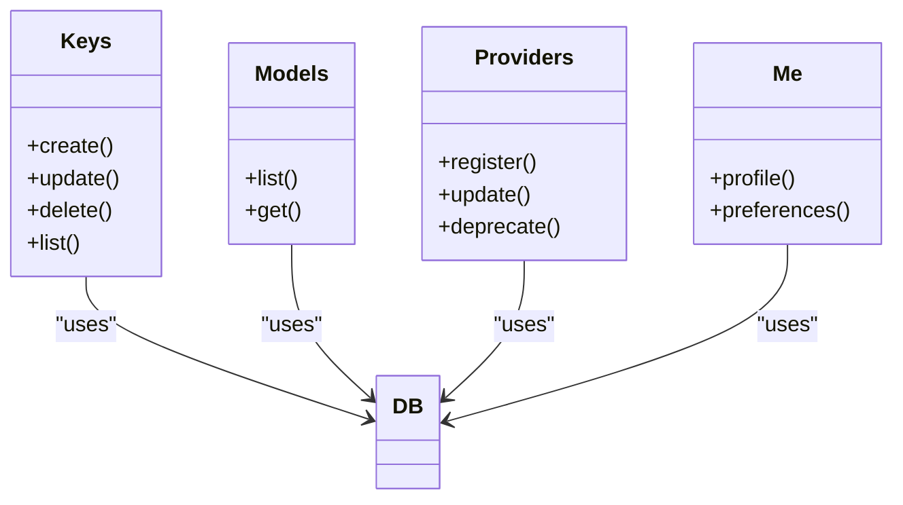
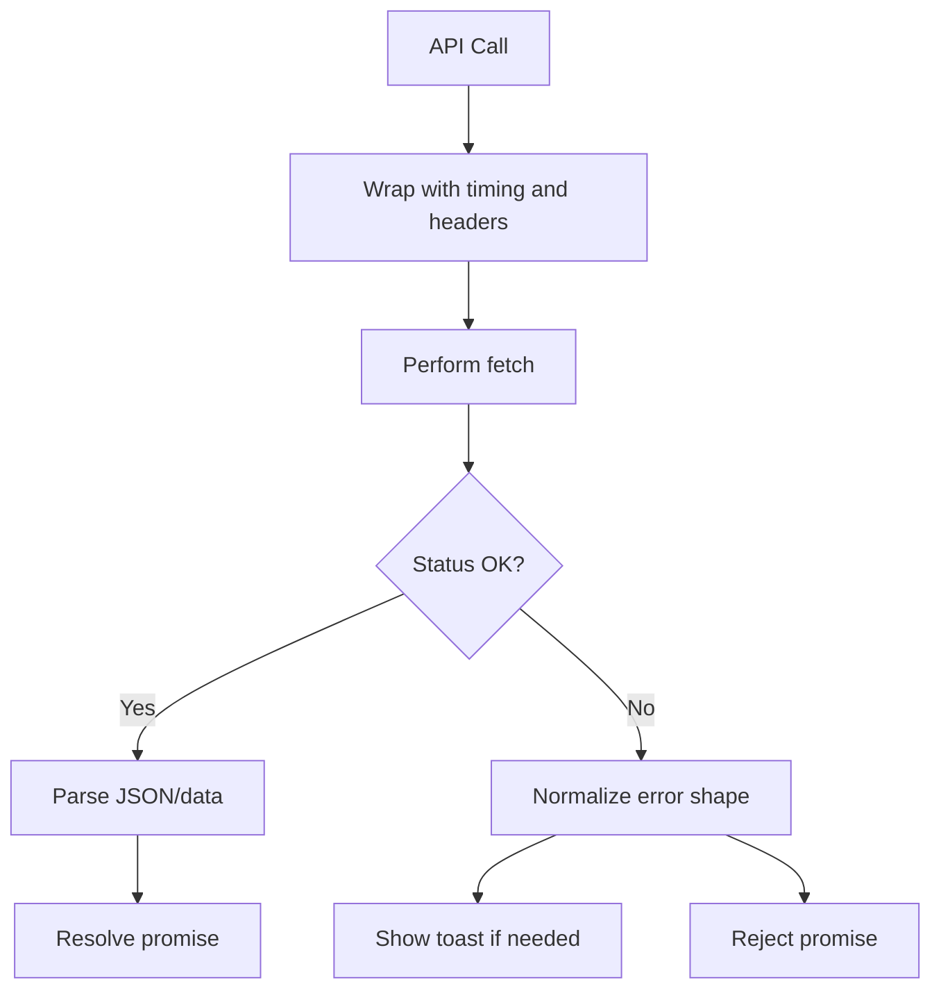
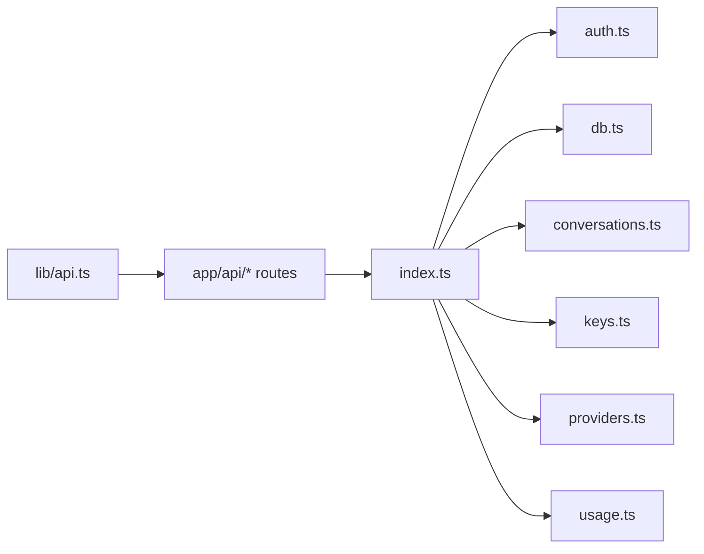

# Debugging and Monitoring

<cite>
**Referenced Files in This Document**
- [backend/src/index.ts](file://backend/src/index.ts)
- [backend/src/auth.ts](file://backend/src/auth.ts)
- [backend/src/db.ts](file://backend/src/db.ts)
- [backend/src/conversations.ts](file://backend/src/conversations.ts)
- [backend/src/keys.ts](file://backend/src/keys.ts)
- [backend/src/providers.ts](file://backend/src/providers.ts)
- [backend/src/usage.ts](file://backend/src/usage.ts)
- [src/app/api/stream/route.ts](file://src/app/api/stream/route.ts)
- [src/app/api/v1/chat/completions/route.ts](file://src/app/api/v1/chat/completions/route.ts)
- [src/app/api/analytics/route.ts](file://src/app/api/analytics/route.ts)
- [src/app/api/auth/login/route.ts](file://src/app/api/auth/login/route.ts)
- [src/app/api/auth/signup/route.ts](file://src/app/api/auth/signup/route.ts)
- [src/app/api/me/route.ts](file://src/app/api/me/route.ts)
- [src/app/api/models/route.ts](file://src/app/api/models/route.ts)
- [src/app/api/providers/route.ts](file://src/app/api/providers/route.ts)
- [src/app/api/keys/route.ts](file://src/app/api/keys/route.ts)
- [src/lib/api.ts](file://src/lib/api.ts)
- [src/lib/db.ts](file://src/lib/db.ts)
- [src/components/ui/toast.tsx](file://src/components/ui/toast.tsx)
</cite>

## Table of Contents
1. Introduction
2. Project Structure
3. Core Components
4. Architecture Overview
5. Detailed Component Analysis
6. Dependency Analysis
7. Performance Considerations
8. Troubleshooting Guide
9. Conclusion
10. Appendices

## Introduction
This document provides a comprehensive guide to debugging and monitoring for the application, covering logging strategies, error tracking, performance monitoring, API request/response inspection, streaming connection troubleshooting, database query optimization, dashboards, alerting, log analysis tools, and common issue resolution patterns. It is designed for both frontend and backend contributors and operators.

## Project Structure
The project uses a Next.js frontend with an internal backend module under backend/. Key areas relevant to debugging and monitoring include:
- Backend entrypoint and server configuration
- API routes for authentication, chat completions, streaming, analytics, keys, models, providers, and user info
- Shared libraries for API client and database access
- UI components for toast notifications

**Diagram sources**
- [backend/src/index.ts](file://backend/src/index.ts)
- [backend/src/auth.ts](file://backend/src/auth.ts)
- [backend/src/db.ts](file://backend/src/db.ts)
- [backend/src/conversations.ts](file://backend/src/conversations.ts)
- [backend/src/keys.ts](file://backend/src/keys.ts)
- [backend/src/providers.ts](file://backend/src/providers.ts)
- [backend/src/usage.ts](file://backend/src/usage.ts)
- [src/app/api/stream/route.ts](file://src/app/api/stream/route.ts)
- [src/app/api/v1/chat/completions/route.ts](file://src/app/api/v1/chat/completions/route.ts)
- [src/app/api/analytics/route.ts](file://src/app/api/analytics/route.ts)
- [src/app/api/auth/login/route.ts](file://src/app/api/auth/login/route.ts)
- [src/app/api/auth/signup/route.ts](file://src/app/api/auth/signup/route.ts)
- [src/app/api/me/route.ts](file://src/app/api/me/route.ts)
- [src/app/api/models/route.ts](file://src/app/api/models/route.ts)
- [src/app/api/providers/route.ts](file://src/app/api/providers/route.ts)
- [src/app/api/keys/route.ts](file://src/app/api/keys/route.ts)
- [src/lib/api.ts](file://src/lib/api.ts)
- [src/components/ui/toast.tsx](file://src/components/ui/toast.tsx)

**Section sources**
- [backend/src/index.ts](file://backend/src/index.ts)
- [src/app/api/stream/route.ts](file://src/app/api/stream/route.ts)
- [src/app/api/v1/chat/completions/route.ts](file://src/app/api/v1/chat/completions/route.ts)
- [src/app/api/analytics/route.ts](file://src/app/api/analytics/route.ts)
- [src/app/api/auth/login/route.ts](file://src/app/api/auth/login/route.ts)
- [src/app/api/auth/signup/route.ts](file://src/app/api/auth/signup/route.ts)
- [src/app/api/me/route.ts](file://src/app/api/me/route.ts)
- [src/app/api/models/route.ts](file://src/app/api/models/route.ts)
- [src/app/api/providers/route.ts](file://src/app/api/providers/route.ts)
- [src/app/api/keys/route.ts](file://src/app/api/keys/route.ts)
- [src/lib/api.ts](file://src/lib/api.ts)
- [src/components/ui/toast.tsx](file://src/components/ui/toast.tsx)

## Core Components
- Server entrypoint: centralizes request handling, routing, and integration points for auth, DB, conversations, keys, providers, and usage.
- Authentication routes: login and signup endpoints that coordinate session or token issuance.
- Chat completions and streaming: v1/chat/completions and stream route implement standard chat flows and SSE streaming.
- Analytics endpoint: exposes metrics and usage data for dashboards.
- Keys, models, providers, me: resource management and user context endpoints.
- Frontend API client: standardized HTTP calls and error normalization.
- Toast UI: user-facing feedback for errors and status.

Key responsibilities for debugging and monitoring:
- Structured logging at boundaries (HTTP, DB, external APIs).
- Error classification and consistent response shapes.
- Metrics collection (latency, throughput, error rates).
- Streaming diagnostics (SSE lifecycle, backpressure, retries).
- Database instrumentation (slow queries, connection health).

**Section sources**
- [backend/src/index.ts](file://backend/src/index.ts)
- [backend/src/auth.ts](file://backend/src/auth.ts)
- [backend/src/db.ts](file://backend/src/db.ts)
- [backend/src/conversations.ts](file://backend/src/conversations.ts)
- [backend/src/keys.ts](file://backend/src/keys.ts)
- [backend/src/providers.ts](file://backend/src/providers.ts)
- [backend/src/usage.ts](file://backend/src/usage.ts)
- [src/app/api/stream/route.ts](file://src/app/api/stream/route.ts)
- [src/app/api/v1/chat/completions/route.ts](file://src/app/api/v1/chat/completions/route.ts)
- [src/app/api/analytics/route.ts](file://src/app/api/analytics/route.ts)
- [src/app/api/auth/login/route.ts](file://src/app/api/auth/login/route.ts)
- [src/app/api/auth/signup/route.ts](file://src/app/api/auth/signup/route.ts)
- [src/app/api/me/route.ts](file://src/app/api/me/route.ts)
- [src/app/api/models/route.ts](file://src/app/api/models/route.ts)
- [src/app/api/providers/route.ts](file://src/app/api/providers/route.ts)
- [src/app/api/keys/route.ts](file://src/app/api/keys/route.ts)
- [src/lib/api.ts](file://src/lib/api.ts)
- [src/components/ui/toast.tsx](file://src/components/ui/toast.tsx)

## Architecture Overview
End-to-end flow for chat completions and streaming:

**Diagram sources**
- [src/app/api/v1/chat/completions/route.ts](file://src/app/api/v1/chat/completions/route.ts)
- [src/app/api/stream/route.ts](file://src/app/api/stream/route.ts)
- [backend/src/index.ts](file://backend/src/index.ts)
- [backend/src/auth.ts](file://backend/src/auth.ts)
- [backend/src/db.ts](file://backend/src/db.ts)
- [backend/src/conversations.ts](file://backend/src/conversations.ts)
- [backend/src/usage.ts](file://backend/src/usage.ts)

## Detailed Component Analysis

### Authentication Endpoints
Focus areas:
- Input validation and error responses
- Session/token creation and propagation
- Logging of auth events without sensitive data

**Diagram sources**
- [src/app/api/auth/login/route.ts](file://src/app/api/auth/login/route.ts)
- [src/app/api/auth/signup/route.ts](file://src/app/api/auth/signup/route.ts)
- [backend/src/auth.ts](file://backend/src/auth.ts)

**Section sources**
- [src/app/api/auth/login/route.ts](file://src/app/api/auth/login/route.ts)
- [src/app/api/auth/signup/route.ts](file://src/app/api/auth/signup/route.ts)
- [backend/src/auth.ts](file://backend/src/auth.ts)

### Chat Completions and Streaming
Focus areas:
- SSE lifecycle: open, message, close, error
- Backpressure and retry behavior
- Chunk-level timing and size metrics
- Error propagation and partial content handling

**Diagram sources**
- [src/app/api/stream/route.ts](file://src/app/api/stream/route.ts)
- [backend/src/index.ts](file://backend/src/index.ts)
- [backend/src/conversations.ts](file://backend/src/conversations.ts)
- [backend/src/usage.ts](file://backend/src/usage.ts)

**Section sources**
- [src/app/api/stream/route.ts](file://src/app/api/stream/route.ts)
- [backend/src/index.ts](file://backend/src/index.ts)
- [backend/src/conversations.ts](file://backend/src/conversations.ts)
- [backend/src/usage.ts](file://backend/src/usage.ts)

### Analytics Endpoint
Focus areas:
- Aggregation of usage and performance metrics
- Time-windowed queries and caching considerations
- Response shape for dashboard consumption

**Diagram sources**
- [src/app/api/analytics/route.ts](file://src/app/api/analytics/route.ts)
- [backend/src/db.ts](file://backend/src/db.ts)
- [backend/src/usage.ts](file://backend/src/usage.ts)

**Section sources**
- [src/app/api/analytics/route.ts](file://src/app/api/analytics/route.ts)
- [backend/src/db.ts](file://backend/src/db.ts)
- [backend/src/usage.ts](file://backend/src/usage.ts)

### Keys, Models, Providers, Me
Focus areas:
- CRUD operations with authorization checks
- Audit logging for key rotations and provider updates
- Validation and sanitization of inputs

**Diagram sources**
- [src/app/api/keys/route.ts](file://src/app/api/keys/route.ts)
- [src/app/api/models/route.ts](file://src/app/api/models/route.ts)
- [src/app/api/providers/route.ts](file://src/app/api/providers/route.ts)
- [src/app/api/me/route.ts](file://src/app/api/me/route.ts)
- [backend/src/db.ts](file://backend/src/db.ts)

**Section sources**
- [src/app/api/keys/route.ts](file://src/app/api/keys/route.ts)
- [src/app/api/models/route.ts](file://src/app/api/models/route.ts)
- [src/app/api/providers/route.ts](file://src/app/api/providers/route.ts)
- [src/app/api/me/route.ts](file://src/app/api/me/route.ts)
- [backend/src/db.ts](file://backend/src/db.ts)

### Frontend API Client and Toast
Focus areas:
- Centralized request/response logging
- Error normalization and user-visible messages
- Retry policies and timeouts

**Diagram sources**
- [src/lib/api.ts](file://src/lib/api.ts)
- [src/components/ui/toast.tsx](file://src/components/ui/toast.tsx)

**Section sources**
- [src/lib/api.ts](file://src/lib/api.ts)
- [src/components/ui/toast.tsx](file://src/components/ui/toast.tsx)

## Dependency Analysis
High-level dependencies between modules relevant to observability:

**Diagram sources**
- [backend/src/index.ts](file://backend/src/index.ts)
- [backend/src/auth.ts](file://backend/src/auth.ts)
- [backend/src/db.ts](file://backend/src/db.ts)
- [backend/src/conversations.ts](file://backend/src/conversations.ts)
- [backend/src/keys.ts](file://backend/src/keys.ts)
- [backend/src/providers.ts](file://backend/src/providers.ts)
- [backend/src/usage.ts](file://backend/src/usage.ts)
- [src/lib/api.ts](file://src/lib/api.ts)
- [src/app/api/stream/route.ts](file://src/app/api/stream/route.ts)
- [src/app/api/v1/chat/completions/route.ts](file://src/app/api/v1/chat/completions/route.ts)
- [src/app/api/analytics/route.ts](file://src/app/api/analytics/route.ts)
- [src/app/api/auth/login/route.ts](file://src/app/api/auth/login/route.ts)
- [src/app/api/auth/signup/route.ts](file://src/app/api/auth/signup/route.ts)
- [src/app/api/me/route.ts](file://src/app/api/me/route.ts)
- [src/app/api/models/route.ts](file://src/app/api/models/route.ts)
- [src/app/api/providers/route.ts](file://src/app/api/providers/route.ts)
- [src/app/api/keys/route.ts](file://src/app/api/keys/route.ts)

**Section sources**
- [backend/src/index.ts](file://backend/src/index.ts)
- [src/lib/api.ts](file://src/lib/api.ts)
- [src/app/api/stream/route.ts](file://src/app/api/stream/route.ts)
- [src/app/api/v1/chat/completions/route.ts](file://src/app/api/v1/chat/completions/route.ts)
- [src/app/api/analytics/route.ts](file://src/app/api/analytics/route.ts)
- [src/app/api/auth/login/route.ts](file://src/app/api/auth/login/route.ts)
- [src/app/api/auth/signup/route.ts](file://src/app/api/auth/signup/route.ts)
- [src/app/api/me/route.ts](file://src/app/api/me/route.ts)
- [src/app/api/models/route.ts](file://src/app/app/api/models/route.ts)
- [src/app/api/providers/route.ts](file://src/app/api/providers/route.ts)
- [src/app/api/keys/route.ts](file://src/app/api/keys/route.ts)

## Performance Considerations
- Instrument request lifecycle timings at route boundaries and within backend handlers.
- Track streaming chunk intervals and total duration; surface p50/p95 latencies.
- Monitor DB connection pool utilization and slow query thresholds.
- Use analytics endpoint to aggregate usage counts, token counts, and error rates.
- Apply timeouts and cancellation for long-running streams to prevent resource leaks.
- Cache read-heavy endpoints where appropriate and invalidate on writes.

[No sources needed since this section provides general guidance]

## Troubleshooting Guide

### API Request/Response Debugging
- Inspect request headers, method, path, and body in route handlers.
- Capture response status codes and normalized error payloads.
- For failures, correlate client-side logs with backend logs using correlation IDs.

**Section sources**
- [src/lib/api.ts](file://src/lib/api.ts)
- [src/app/api/v1/chat/completions/route.ts](file://src/app/api/v1/chat/completions/route.ts)
- [src/app/api/auth/login/route.ts](file://src/app/api/auth/login/route.ts)
- [src/app/api/auth/signup/route.ts](file://src/app/api/auth/signup/route.ts)

### Streaming Connection Troubleshooting
- Verify SSE open, message, and close events are emitted consistently.
- Check for network interruptions and implement reconnection logic on the client.
- Measure inter-chunk latency and detect stalls; add heartbeat events if needed.
- Ensure proper error events are sent when upstream processing fails.

**Section sources**
- [src/app/api/stream/route.ts](file://src/app/api/stream/route.ts)
- [backend/src/index.ts](file://backend/src/index.ts)
- [backend/src/conversations.ts](file://backend/src/conversations.ts)

### Database Query Optimization
- Identify slow queries via DB logs and add indexes where necessary.
- Avoid N+1 queries by batching reads and using joins where applicable.
- Limit result sets and paginate large collections.
- Monitor connection pool saturation and adjust sizing based on load.

**Section sources**
- [backend/src/db.ts](file://backend/src/db.ts)
- [backend/src/conversations.ts](file://backend/src/conversations.ts)
- [backend/src/keys.ts](file://backend/src/keys.ts)
- [backend/src/providers.ts](file://backend/src/providers.ts)
- [backend/src/usage.ts](file://backend/src/usage.ts)

### Common Issues and Resolutions
- Authentication failures: validate credentials early, return structured 4xx errors, and log non-sensitive details.
- Missing or malformed requests: enforce input schemas and respond with clear error messages.
- Streaming drops: implement client-side reconnects and server-side heartbeats; track error events.
- High error rates: use analytics endpoint to identify spikes and correlate with deployments or external provider outages.

**Section sources**
- [backend/src/auth.ts](file://backend/src/auth.ts)
- [src/app/api/auth/login/route.ts](file://src/app/api/auth/login/route.ts)
- [src/app/api/auth/signup/route.ts](file://src/app/api/auth/signup/route.ts)
- [src/app/api/stream/route.ts](file://src/app/api/stream/route.ts)
- [src/app/api/analytics/route.ts](file://src/app/api/analytics/route.ts)

## Conclusion
Adopt structured logging, consistent error shapes, and robust metrics collection across routes and backend services. Prioritize streaming diagnostics and database instrumentation to maintain reliability. Use the analytics endpoint and frontend toast system to provide actionable insights to users and operators.

[No sources needed since this section summarizes without analyzing specific files]

## Appendices

### Logging Strategy
- Include timestamp, level, service, trace ID, user/provider/model identifiers, and outcome fields.
- Avoid logging secrets or PII; redact sensitive values before emission.
- Separate debug, info, warn, and error levels; ensure errors include stack traces only in development.

[No sources needed since this section provides general guidance]

### Error Tracking
- Normalize error responses with code, message, and optional details.
- Surface user-friendly messages via toast while retaining detailed logs for operators.

**Section sources**
- [src/components/ui/toast.tsx](file://src/components/ui/toast.tsx)
- [src/lib/api.ts](file://src/lib/api.ts)

### Performance Monitoring Setup
- Collect per-request latency, throughput, and error rate.
- Track streaming chunk timing and total duration.
- Aggregate usage metrics (requests, tokens, providers) via the analytics endpoint.

**Section sources**
- [src/app/api/analytics/route.ts](file://src/app/api/analytics/route.ts)
- [backend/src/usage.ts](file://backend/src/usage.ts)

### Monitoring Dashboards and Alerting
- Build dashboards around:
  - Request latency percentiles
  - Error rates by endpoint
  - Streaming stall frequency
  - DB slow query count and connection pool usage
- Configure alerts for:
  - Elevated error rates
  - Latency SLO breaches
  - Streaming dropouts
  - DB saturation

[No sources needed since this section provides general guidance]

### Log Analysis Tools
- Use centralized log aggregation with filtering by service, level, and trace ID.
- Correlate frontend and backend logs via shared correlation IDs.
- Create saved queries for common issues (auth failures, streaming errors, DB slowdowns).

[No sources needed since this section provides general guidance]