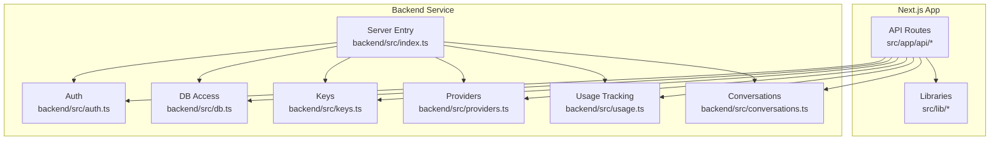
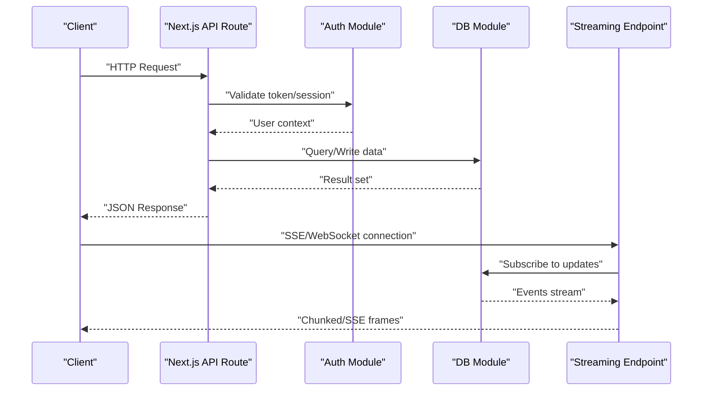
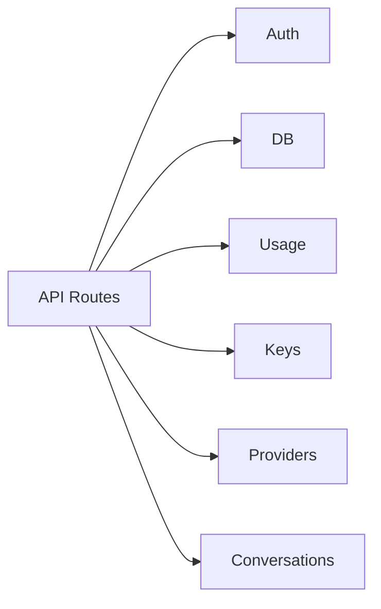

# API Performance Optimization

<cite>
**Referenced Files in This Document**
- [index.ts](file://backend/src/index.ts)
- [auth.ts](file://backend/src/auth.ts)
- [db.ts](file://backend/src/db.ts)
- [keys.ts](file://backend/src/keys.ts)
- [providers.ts](file://backend/src/providers.ts)
- [usage.ts](file://backend/src/usage.ts)
- [conversations.ts](file://backend/src/conversations.ts)
- [route.ts](file://src/app/api/stream/route.ts)
- [route.ts](file://src/app/api/v1/chat/completions/route.ts)
- [route.ts](file://src/app/api/auth/login/route.ts)
- [route.ts](file://src/app/api/auth/signup/route.ts)
- [route.ts](file://src/app/api/me/route.ts)
- [route.ts](file://src/app/api/models/route.ts)
- [route.ts](file://src/app/api/providers/route.ts)
- [route.ts](file://src/app/api/providers/[id]/route.ts)
- [route.ts](file://src/app/api/keys/route.ts)
- [route.ts](file://src/app/api/keys/[id]/route.ts)
- [api.ts](file://src/lib/api.ts)
- [db.ts](file://src/lib/db.ts)
- [utils.ts](file://src/lib/utils.ts)
</cite>

## Table of Contents
1. [Introduction](#introduction)
2. [Project Structure](#project-structure)
3. [Core Components](#core-components)
4. [Architecture Overview](#architecture-overview)
5. [Detailed Component Analysis](#detailed-component-analysis)
6. [Dependency Analysis](#dependency-analysis)
7. [Performance Considerations](#performance-considerations)
8. [Troubleshooting Guide](#troubleshooting-guide)
9. [Conclusion](#conclusion)

## Introduction
This document provides a comprehensive guide to optimizing API performance for the project’s RESTful endpoints and streaming APIs. It covers request/response optimization, payload compression, efficient data serialization, caching strategies, rate limiting, load balancing considerations, authentication optimization, token validation efficiency, session management, and streaming performance including server-sent events (SSE), WebSocket connections, and real-time synchronization patterns. The guidance is grounded in the repository’s Next.js App Router API routes and backend services.

## Project Structure
The application uses a Next.js frontend with an App Router-based API layer and a separate backend service written in TypeScript. Key areas relevant to API performance include:
- API routes under src/app/api for REST endpoints and streaming
- Backend services under backend/src for core logic such as auth, database access, keys, providers, usage tracking, and conversations
- Shared libraries under src/lib for API client utilities, database helpers, and general utilities

**Diagram sources**
- [index.ts](file://backend/src/index.ts)
- [auth.ts](file://backend/src/auth.ts)
- [db.ts](file://backend/src/db.ts)
- [keys.ts](file://backend/src/keys.ts)
- [providers.ts](file://backend/src/providers.ts)
- [usage.ts](file://backend/src/usage.ts)
- [conversations.ts](file://backend/src/conversations.ts)
- [route.ts](file://src/app/api/stream/route.ts)
- [route.ts](file://src/app/api/v1/chat/completions/route.ts)
- [route.ts](file://src/app/api/auth/login/route.ts)
- [route.ts](file://src/app/api/auth/signup/route.ts)
- [route.ts](file://src/app/api/me/route.ts)
- [route.ts](file://src/app/api/models/route.ts)
- [route.ts](file://src/app/api/providers/route.ts)
- [route.ts](file://src/app/api/providers/[id]/route.ts)
- [route.ts](file://src/app/api/keys/route.ts)
- [route.ts](file://src/app/api/keys/[id]/route.ts)
- [api.ts](file://src/lib/api.ts)
- [db.ts](file://src/lib/db.ts)
- [utils.ts](file://src/lib/utils.ts)

**Section sources**
- [index.ts](file://backend/src/index.ts)
- [auth.ts](file://backend/src/auth.ts)
- [db.ts](file://backend/src/db.ts)
- [keys.ts](file://backend/src/keys.ts)
- [providers.ts](file://backend/src/providers.ts)
- [usage.ts](file://backend/src/usage.ts)
- [conversations.ts](file://backend/src/conversations.ts)
- [route.ts](file://src/app/api/stream/route.ts)
- [route.ts](file://src/app/api/v1/chat/completions/route.ts)
- [route.ts](file://src/app/api/auth/login/route.ts)
- [route.ts](file://src/app/api/auth/signup/route.ts)
- [route.ts](file://src/app/api/me/route.ts)
- [route.ts](file://src/app/api/models/route.ts)
- [route.ts](file://src/app/api/providers/route.ts)
- [route.ts](file://src/app/api/providers/[id]/route.ts)
- [route.ts](file://src/app/api/keys/route.ts)
- [route.ts](file://src/app/api/keys/[id]/route.ts)
- [api.ts](file://src/lib/api.ts)
- [db.ts](file://src/lib/db.ts)
- [utils.ts](file://src/lib/utils.ts)

## Core Components
- Authentication and authorization: Centralized auth handling in the backend service and route-level guards in API routes.
- Data access: Database helpers in both backend and frontend libraries for consistent query patterns.
- Streaming: Dedicated streaming endpoint for SSE or chunked responses.
- Domain modules: Keys, providers, usage tracking, and conversations encapsulate business logic.

Key responsibilities:
- Auth module: Token issuance/validation, session setup, and middleware-like checks.
- DB module: Connection pooling, prepared statements, and transaction boundaries.
- Usage module: Quota enforcement and rate-limiting hooks.
- Providers and keys: Configuration and credential management with minimal overhead.
- Conversations: Efficient persistence and retrieval patterns for chat history.

**Section sources**
- [auth.ts](file://backend/src/auth.ts)
- [db.ts](file://backend/src/db.ts)
- [usage.ts](file://backend/src/usage.ts)
- [keys.ts](file://backend/src/keys.ts)
- [providers.ts](file://backend/src/providers.ts)
- [conversations.ts](file://backend/src/conversations.ts)

## Architecture Overview
The system exposes REST endpoints via Next.js App Router and supports streaming through dedicated routes. The backend service centralizes critical operations like authentication, database interactions, and domain logic.

**Diagram sources**
- [route.ts](file://src/app/api/v1/chat/completions/route.ts)
- [route.ts](file://src/app/api/stream/route.ts)
- [auth.ts](file://backend/src/auth.ts)
- [db.ts](file://backend/src/db.ts)

## Detailed Component Analysis

### Authentication Optimization
Focus areas:
- Token validation efficiency: Cache validated tokens and user sessions to avoid repeated cryptographic checks.
- Session management: Use short-lived access tokens with refresh flows; store session state in a fast cache (e.g., in-memory or Redis).
- Middleware pattern: Apply auth checks early in the request pipeline to fail fast on invalid credentials.

Recommendations:
- Implement token introspection caching with TTL aligned to token lifetime.
- Prefer stateless JWTs with minimal claims; offload heavy profile lookups to cache.
- Add idempotency keys for sensitive mutations to reduce redundant processing.

**Section sources**
- [auth.ts](file://backend/src/auth.ts)
- [route.ts](file://src/app/api/auth/login/route.ts)
- [route.ts](file://src/app/api/auth/signup/route.ts)
- [route.ts](file://src/app/api/me/route.ts)

### Rate Limiting and Quotas
Implementation points:
- Enforce per-user and per-key limits using counters stored in a fast key-value store.
- Integrate usage tracking into the response path to record consumption accurately.
- Return standard headers indicating remaining quota and reset time.

Optimization tips:
- Batch counter increments and use atomic operations to minimize contention.
- Apply sliding window algorithms for smoother throttling.
- Combine rate limiting with feature flags to gracefully degrade under load.

**Section sources**
- [usage.ts](file://backend/src/usage.ts)
- [keys.ts](file://backend/src/keys.ts)
- [route.ts](file://src/app/api/keys/route.ts)
- [route.ts](file://src/app/api/keys/[id]/route.ts)

### Data Serialization and Payload Compression
Guidelines:
- Serialize only required fields; avoid over-fetching by selecting specific columns.
- Use efficient formats (e.g., JSON) and consider binary formats for large payloads if clients support them.
- Enable gzip/br compression at the HTTP layer for text-heavy responses.

Database-side optimizations:
- Use projections to limit returned fields.
- Leverage indexes to speed up queries that feed API responses.

**Section sources**
- [db.ts](file://backend/src/db.ts)
- [db.ts](file://src/lib/db.ts)
- [utils.ts](file://src/lib/utils.ts)

### Caching Strategies for API Responses
Approaches:
- Edge caching for static or infrequently changing resources (e.g., provider metadata).
- In-process cache for hot paths with short TTLs.
- Stale-while-revalidate patterns to improve perceived latency.

Cache keys:
- Normalize inputs (query params, headers) to generate stable cache keys.
- Include versioning to invalidate caches safely after schema changes.

**Section sources**
- [route.ts](file://src/app/api/providers/route.ts)
- [route.ts](file://src/app/api/providers/[id]/route.ts)
- [route.ts](file://src/app/api/models/route.ts)

### Streaming API Performance
Endpoints:
- Chat completions streaming endpoint for SSE or chunked responses.
- Generic streaming route for real-time updates.

Optimizations:
- Backpressure-aware streaming to prevent memory spikes.
- Minimize per-chunk overhead by batching small messages when appropriate.
- Use keep-alive and connection reuse to reduce handshake costs.

Real-time synchronization patterns:
- Event-driven updates from DB listeners or message queues.
- Deduplicate events on the client side to handle reconnections gracefully.

**Section sources**
- [route.ts](file://src/app/api/v1/chat/completions/route.ts)
- [route.ts](file://src/app/api/stream/route.ts)
- [conversations.ts](file://backend/src/conversations.ts)

### Load Balancing Considerations
- Stateless design: Ensure requests can be routed to any instance without shared mutable state.
- Sticky sessions: If necessary, configure LB stickiness for long-lived connections (e.g., WebSockets).
- Health checks and graceful shutdown: Drain connections before scaling down instances.

[No sources needed since this section provides general guidance]

## Dependency Analysis
The API layer depends on auth, db, usage, keys, providers, and conversations modules. Clear separation of concerns reduces coupling and improves testability.

**Diagram sources**
- [route.ts](file://src/app/api/v1/chat/completions/route.ts)
- [route.ts](file://src/app/api/stream/route.ts)
- [auth.ts](file://backend/src/auth.ts)
- [db.ts](file://backend/src/db.ts)
- [usage.ts](file://backend/src/usage.ts)
- [keys.ts](file://backend/src/keys.ts)
- [providers.ts](file://backend/src/providers.ts)
- [conversations.ts](file://backend/src/conversations.ts)

**Section sources**
- [route.ts](file://src/app/api/v1/chat/completions/route.ts)
- [route.ts](file://src/app/api/stream/route.ts)
- [auth.ts](file://backend/src/auth.ts)
- [db.ts](file://backend/src/db.ts)
- [usage.ts](file://backend/src/usage.ts)
- [keys.ts](file://backend/src/keys.ts)
- [providers.ts](file://backend/src/providers.ts)
- [conversations.ts](file://backend/src/conversations.ts)

## Performance Considerations
- Request/response optimization:
  - Validate and sanitize inputs early to avoid expensive downstream work.
  - Use pagination and cursor-based navigation for list endpoints.
  - Apply field selection and filtering to reduce payload size.
- Compression:
  - Enable gzip/br for text responses; disable for already-compressed assets.
- Serialization:
  - Avoid unnecessary transformations; prefer direct mapping from DB rows to DTOs.
- Caching:
  - Layer edge, CDN, and in-process caches with appropriate invalidation policies.
- Rate limiting:
  - Combine per-user and per-key limits; expose quota headers for transparency.
- Streaming:
  - Tune buffer sizes; implement backpressure; deduplicate events on reconnect.
- Authentication:
  - Cache token validations; use short-lived tokens with refresh flows.
- Load balancing:
  - Keep instances stateless; manage long-lived connections carefully.

[No sources needed since this section provides general guidance]

## Troubleshooting Guide
Common issues and resolutions:
- High latency on auth:
  - Check token cache hit rates and TTL alignment.
  - Profile cryptographic operations and consider hardware acceleration where supported.
- Memory pressure during streaming:
  - Inspect chunk sizes and backpressure handling; ensure streams are closed on errors.
- Rate limit false positives:
  - Verify atomicity of counter updates and clock skew across instances.
- Cache inconsistencies:
  - Review cache key normalization and invalidation triggers after schema changes.
- Database bottlenecks:
  - Analyze slow queries; add indexes; use connection pooling effectively.

**Section sources**
- [auth.ts](file://backend/src/auth.ts)
- [db.ts](file://backend/src/db.ts)
- [usage.ts](file://backend/src/usage.ts)
- [route.ts](file://src/app/api/stream/route.ts)

## Conclusion
By applying targeted optimizations across authentication, data access, caching, rate limiting, and streaming, the API layer can achieve lower latency, higher throughput, and better resilience under load. Focus on measurable improvements—cache hit ratios, p95 latencies, error budgets—and iterate based on telemetry.