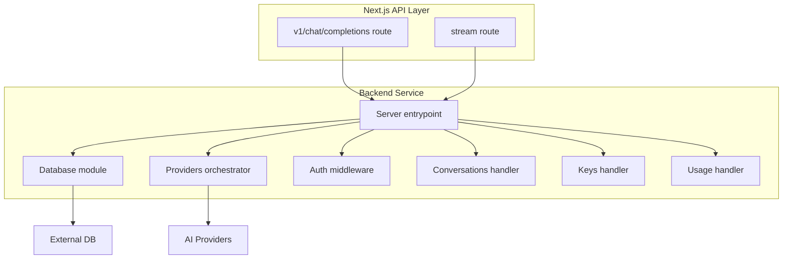
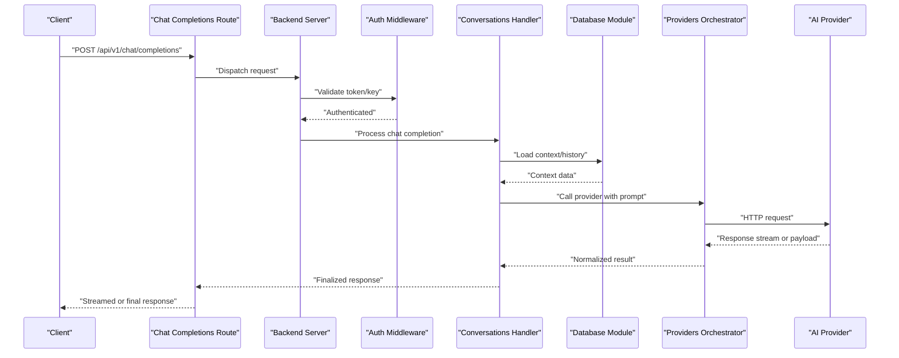
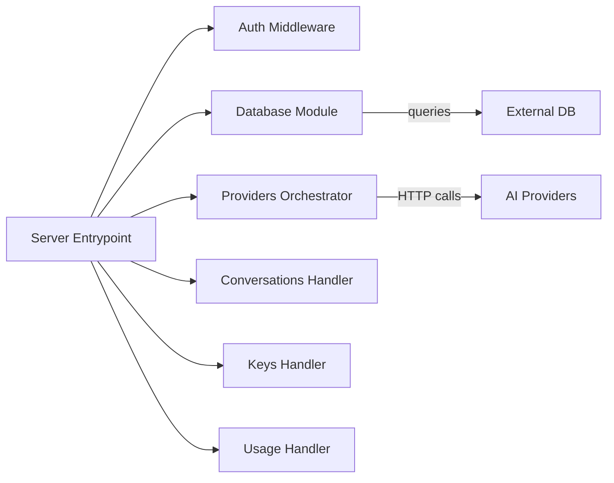

# Backend Performance Optimization

<cite>
**Referenced Files in This Document**
- [backend/src/index.ts](file://backend/src/index.ts)
- [backend/src/db.ts](file://backend/src/db.ts)
- [backend/src/providers.ts](file://backend/src/providers.ts)
- [backend/src/auth.ts](file://backend/src/auth.ts)
- [backend/src/conversations.ts](file://backend/src/conversations.ts)
- [backend/src/keys.ts](file://backend/src/keys.ts)
- [backend/src/usage.ts](file://backend/src/usage.ts)
- [src/app/api/v1/chat/completions/route.ts](file://src/app/api/v1/chat/completions/route.ts)
- [src/app/api/stream/route.ts](file://src/app/api/stream/route.ts)
- [src/lib/db.ts](file://src/lib/db.ts)
</cite>

## Table of Contents
1. [Introduction](#introduction)
2. [Project Structure](#project-structure)
3. [Core Components](#core-components)
4. [Architecture Overview](#architecture-overview)
5. [Detailed Component Analysis](#detailed-component-analysis)
6. [Dependency Analysis](#dependency-analysis)
7. [Performance Considerations](#performance-considerations)
8. [Troubleshooting Guide](#troubleshooting-guide)
9. [Conclusion](#conclusion)
10. [Appendices](#appendices)

## Introduction
This document focuses on backend performance optimization for the project, with emphasis on:
- Database query optimization and connection pooling strategies
- Efficient data retrieval patterns
- AI provider call optimization (request batching, caching, error handling)
- Memory management, garbage collection tuning, and resource cleanup
- Streaming response optimization for real-time features and concurrent request handling
- Monitoring setup, profiling tools, and bottleneck identification techniques

The guidance is grounded in the repository’s backend implementation and API routes to ensure practical applicability.

## Project Structure
The backend is implemented as a Node.js service under backend/src, with Next.js API routes acting as entry points that delegate to backend logic. Key areas relevant to performance include:
- Server bootstrap and routing
- Database configuration and connection management
- Provider orchestration for AI model calls
- API routes for chat completions and streaming responses
- Shared database utilities used by both frontend and backend

**Diagram sources**
- [backend/src/index.ts](file://backend/src/index.ts)
- [backend/src/db.ts](file://backend/src/db.ts)
- [backend/src/providers.ts](file://backend/src/providers.ts)
- [backend/src/auth.ts](file://backend/src/auth.ts)
- [backend/src/conversations.ts](file://backend/src/conversations.ts)
- [backend/src/keys.ts](file://backend/src/keys.ts)
- [backend/src/usage.ts](file://backend/src/usage.ts)
- [src/app/api/v1/chat/completions/route.ts](file://src/app/api/v1/chat/completions/route.ts)
- [src/app/api/stream/route.ts](file://src/app/api/stream/route.ts)

**Section sources**
- [backend/src/index.ts](file://backend/src/index.ts)
- [backend/src/db.ts](file://backend/src/db.ts)
- [backend/src/providers.ts](file://backend/src/providers.ts)
- [backend/src/auth.ts](file://backend/src/auth.ts)
- [backend/src/conversations.ts](file://backend/src/conversations.ts)
- [backend/src/keys.ts](file://backend/src/keys.ts)
- [backend/src/usage.ts](file://backend/src/usage.ts)
- [src/app/api/v1/chat/completions/route.ts](file://src/app/api/v1/chat/completions/route.ts)
- [src/app/api/stream/route.ts](file://src/app/api/stream/route.ts)

## Core Components
- Server entrypoint: Initializes HTTP server, registers routes, and wires middleware such as authentication. It should be configured for concurrency and graceful shutdown.
- Database module: Manages connection lifecycle, pool sizing, timeouts, retries, and query execution.
- Providers orchestrator: Abstracts external AI provider calls; supports selection, retry/backoff, and potential batching/caching at this layer.
- Auth middleware: Validates requests early to avoid unnecessary downstream work.
- Conversations handler: Encapsulates conversation-related operations, including efficient reads/writes and pagination.
- Keys handler: Manages API keys with minimal overhead and safe access patterns.
- Usage handler: Tracks usage metrics efficiently without blocking hot paths.

**Section sources**
- [backend/src/index.ts](file://backend/src/index.ts)
- [backend/src/db.ts](file://backend/src/db.ts)
- [backend/src/providers.ts](file://backend/src/providers.ts)
- [backend/src/auth.ts](file://backend/src/auth.ts)
- [backend/src/conversations.ts](file://backend/src/conversations.ts)
- [backend/src/keys.ts](file://backend/src/keys.ts)
- [backend/src/usage.ts](file://backend/src/usage.ts)

## Architecture Overview
The system follows a layered architecture:
- API routes receive requests and validate inputs
- Middleware enforces auth and rate limiting
- Handlers coordinate business logic
- Database module executes queries with pooled connections
- Providers orchestrator calls external AI services with resilience patterns

**Diagram sources**
- [src/app/api/v1/chat/completions/route.ts](file://src/app/api/v1/chat/completions/route.ts)
- [backend/src/index.ts](file://backend/src/index.ts)
- [backend/src/auth.ts](file://backend/src/auth.ts)
- [backend/src/conversations.ts](file://backend/src/conversations.ts)
- [backend/src/db.ts](file://backend/src/db.ts)
- [backend/src/providers.ts](file://backend/src/providers.ts)

## Detailed Component Analysis

### Database Query Optimization and Connection Pooling
Key considerations:
- Connection pool sizing: Tune min/max connections based on CPU cores and expected concurrency. Avoid over-provisioning to prevent context switching overhead.
- Query efficiency: Use selective fields, proper indexes, and avoid N+1 queries. Prefer batched reads where possible.
- Timeouts and retries: Configure per-query timeouts and implement exponential backoff for transient failures.
- Read replicas: Offload read-heavy endpoints to replicas to reduce primary load.
- Prepared statements: Reuse prepared statements to reduce parsing overhead.
- Transaction boundaries: Keep transactions short and scope them tightly around critical writes.

Implementation anchors:
- Connection pool configuration and lifecycle are centralized in the database module.
- Queries executed through the database module should leverage these settings consistently.

**Section sources**
- [backend/src/db.ts](file://backend/src/db.ts)

### Efficient Data Retrieval Patterns
Patterns to adopt:
- Pagination and cursor-based navigation for large datasets
- Field projection to minimize payload size
- Cache frequently accessed reference data (e.g., models, providers)
- Coalesce multiple small reads into single batched queries when feasible

Where applicable:
- Conversations handler should use pagination and projection for history retrieval
- Keys and usage handlers should aggregate metrics asynchronously to avoid blocking hot paths

**Section sources**
- [backend/src/conversations.ts](file://backend/src/conversations.ts)
- [backend/src/keys.ts](file://backend/src/keys.ts)
- [backend/src/usage.ts](file://backend/src/usage.ts)

### AI Provider Call Optimization
Optimization strategies:
- Request batching: Group independent prompts when supported by the provider to reduce round-trips
- Caching: Implement response caching keyed by normalized input parameters; consider TTL and invalidation policies
- Concurrency control: Limit parallel outbound calls to respect provider quotas and avoid overload
- Retry and backoff: Apply jittered exponential backoff for transient errors; circuit breaker for sustained failures
- Stream processing: For streaming providers, process chunks incrementally and forward to clients without buffering entire responses

Orchestration point:
- The providers orchestrator centralizes provider selection, normalization, and resilience logic, making it the ideal place to implement batching, caching, and circuit breaking.

**Section sources**
- [backend/src/providers.ts](file://backend/src/providers.ts)

### Streaming Response Optimization
Goals:
- Minimize latency by forwarding provider chunks immediately
- Avoid unnecessary buffering and serialization
- Ensure backpressure handling to prevent memory spikes

Recommendations:
- Use streaming APIs from the provider client and pipe directly to the HTTP response
- Set appropriate headers for streaming (e.g., content-type, transfer-encoding)
- Close streams promptly on client disconnect or error
- Debounce or throttle upstream chunk rates if needed to stabilize throughput

Relevant entry points:
- Chat completions route may return streamed responses
- Dedicated stream route can handle long-lived SSE or WebSocket-like flows

**Section sources**
- [src/app/api/v1/chat/completions/route.ts](file://src/app/api/v1/chat/completions/route.ts)
- [src/app/api/stream/route.ts](file://src/app/api/stream/route.ts)

### Concurrent Request Handling
Guidelines:
- Configure server concurrency limits to match available resources
- Use async/await patterns to avoid blocking event loop
- Employ worker queues for heavy tasks (e.g., analytics aggregation)
- Rate limit per user or key to protect against abuse and maintain fairness

Integration points:
- Server entrypoint should expose configurable concurrency and graceful shutdown hooks
- Auth middleware should enforce rate limits early

**Section sources**
- [backend/src/index.ts](file://backend/src/index.ts)
- [backend/src/auth.ts](file://backend/src/auth.ts)

### Memory Management and Garbage Collection Tuning
Practices:
- Avoid retaining large objects in closures or global scopes
- Release references after processing (e.g., clear buffers, close file handles)
- Monitor heap growth and identify leaks via snapshots
- Tune GC flags for your runtime (e.g., V8 options) based on workload characteristics
- Prefer streaming and incremental processing for large payloads

Operational tips:
- Periodically profile under realistic load to observe GC pauses
- Use object pools for frequently allocated structures if beneficial

[No sources needed since this section provides general guidance]

### Resource Cleanup Patterns
Ensure deterministic cleanup:
- Always close database connections and streams in finally blocks or using structured concurrency
- Unregister event listeners and timers to prevent leaks
- Gracefully shut down servers and drain in-flight requests

**Section sources**
- [backend/src/index.ts](file://backend/src/index.ts)
- [backend/src/db.ts](file://backend/src/db.ts)

## Dependency Analysis
High-level dependencies among core modules:

**Diagram sources**
- [backend/src/index.ts](file://backend/src/index.ts)
- [backend/src/auth.ts](file://backend/src/auth.ts)
- [backend/src/db.ts](file://backend/src/db.ts)
- [backend/src/providers.ts](file://backend/src/providers.ts)
- [backend/src/conversations.ts](file://backend/src/conversations.ts)
- [backend/src/keys.ts](file://backend/src/keys.ts)
- [backend/src/usage.ts](file://backend/src/usage.ts)

**Section sources**
- [backend/src/index.ts](file://backend/src/index.ts)
- [backend/src/db.ts](file://backend/src/db.ts)
- [backend/src/providers.ts](file://backend/src/providers.ts)
- [backend/src/auth.ts](file://backend/src/auth.ts)
- [backend/src/conversations.ts](file://backend/src/conversations.ts)
- [backend/src/keys.ts](file://backend/src/keys.ts)
- [backend/src/usage.ts](file://backend/src/usage.ts)

## Performance Considerations
- Database
  - Right-size connection pools; monitor utilization and wait times
  - Add indexes for frequent filters and joins; analyze query plans
  - Use read replicas for read-heavy workloads
- AI Providers
  - Batch requests when possible; cache stable responses
  - Implement retries with jitter and circuit breakers
  - Stream responses to reduce tail latency
- Streaming
  - Forward chunks immediately; avoid full buffering
  - Handle backpressure and client disconnects gracefully
- Concurrency
  - Cap concurrent outbound calls; use semaphores or worker queues
  - Enforce rate limits at the gateway/middleware layer
- Memory
  - Profile heap snapshots under load; release large buffers promptly
  - Tune GC flags according to observed pause profiles

[No sources needed since this section provides general guidance]

## Troubleshooting Guide
Common issues and diagnostics:
- Slow queries: Inspect execution plans, add missing indexes, and reduce payload sizes
- Connection exhaustion: Monitor pool saturation; adjust pool sizes and timeouts
- Provider throttling: Implement retries/backoff and circuit breakers; cache more aggressively
- High memory usage: Capture heap snapshots, identify retained objects, and fix leaks
- Streaming stalls: Verify stream piping, check backpressure, and ensure timely cleanup

Profiling and monitoring:
- Enable structured logging with correlation IDs across request boundaries
- Collect metrics: request latency percentiles, error rates, queue lengths, pool utilization
- Use APM tools to trace spans from API routes through DB and provider calls
- Periodically run load tests to identify bottlenecks and regressions

**Section sources**
- [backend/src/db.ts](file://backend/src/db.ts)
- [backend/src/providers.ts](file://backend/src/providers.ts)
- [backend/src/index.ts](file://backend/src/index.ts)

## Conclusion
By optimizing database interactions, implementing resilient and cached provider calls, streamlining streaming responses, and adopting robust concurrency and memory practices, the backend can achieve higher throughput and lower latency. Continuous monitoring and profiling are essential to sustain performance as traffic grows.

[No sources needed since this section summarizes without analyzing specific files]

## Appendices

### API Endpoints Relevant to Performance
- Chat completions: POST /api/v1/chat/completions
- Streaming endpoint: GET/POST /api/stream

These routes integrate with the backend server, auth middleware, conversations handler, database module, and providers orchestrator.

**Section sources**
- [src/app/api/v1/chat/completions/route.ts](file://src/app/api/v1/chat/completions/route.ts)
- [src/app/api/stream/route.ts](file://src/app/api/stream/route.ts)
- [backend/src/index.ts](file://backend/src/index.ts)
- [backend/src/auth.ts](file://backend/src/auth.ts)
- [backend/src/conversations.ts](file://backend/src/conversations.ts)
- [backend/src/db.ts](file://backend/src/db.ts)
- [backend/src/providers.ts](file://backend/src/providers.ts)