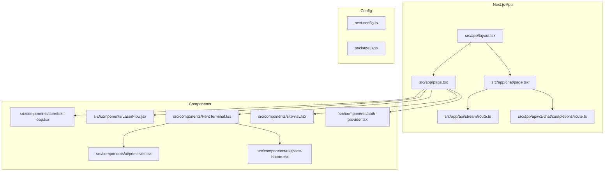
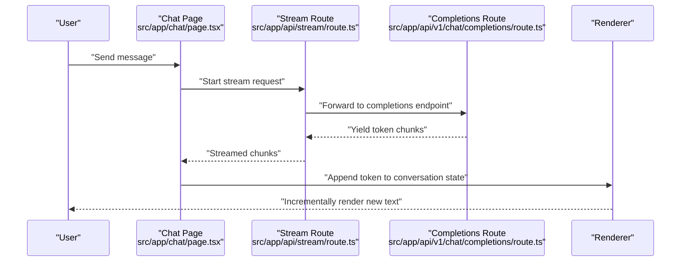
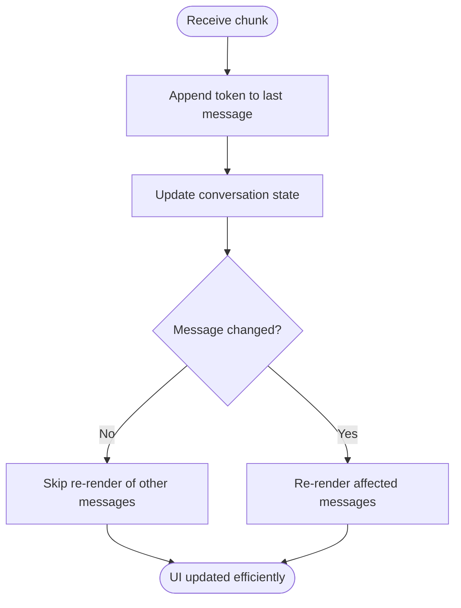
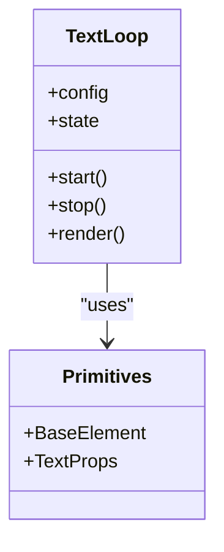
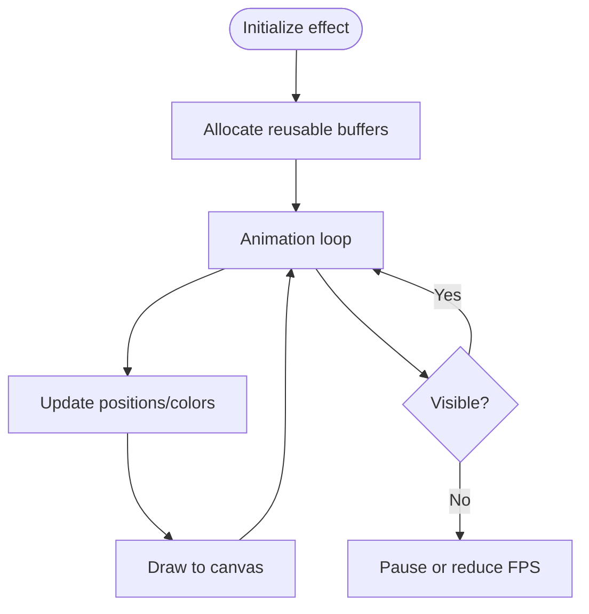
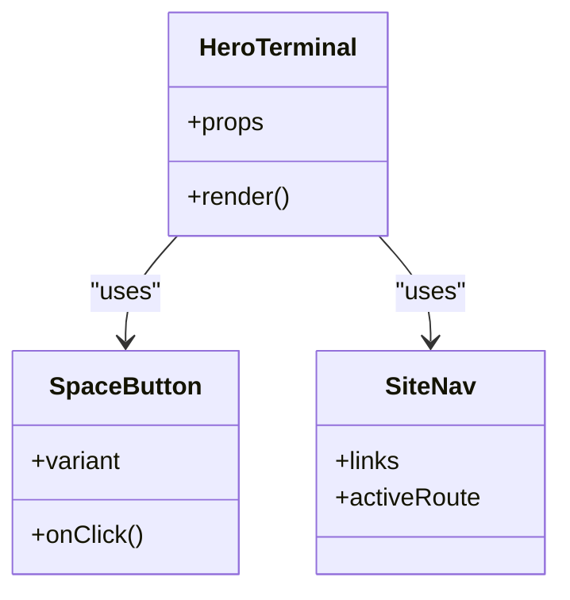
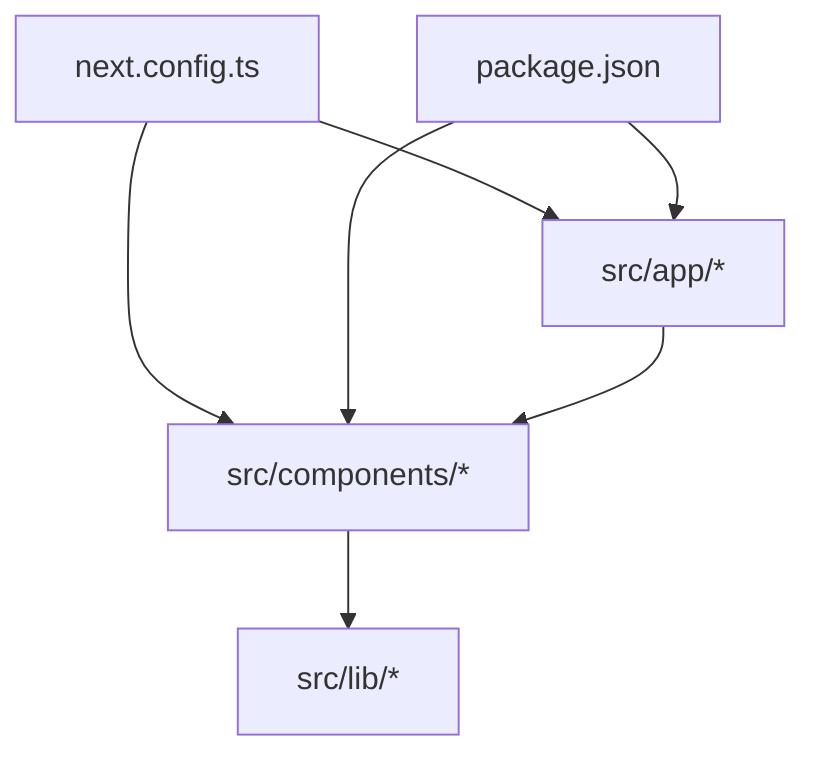

# Frontend Performance Optimization

<cite>
**Referenced Files in This Document**
- [next.config.ts](file://next.config.ts)
- [package.json](file://package.json)
- [src/app/layout.tsx](file://src/app/layout.tsx)
- [src/app/page.tsx](file://src/app/page.tsx)
- [src/app/chat/page.tsx](file://src/app/chat/page.tsx)
- [src/app/chat/chat.module.css](file://src/app/chat/chat.module.css)
- [src/app/api/stream/route.ts](file://src/app/api/stream/route.ts)
- [src/app/api/v1/chat/completions/route.ts](file://src/app/api/v1/chat/completions/route.ts)
- [src/components/core/text-loop.tsx](file://src/components/core/text-loop.tsx)
- [src/components/LaserFlow.jsx](file://src/components/LaserFlow.jsx)
- [src/components/HeroTerminal.tsx](file://src/components/HeroTerminal.tsx)
- [src/components/HeroTerminal.module.css](file://src/components/HeroTerminal.module.css)
- [src/components/ui/primitives.tsx](file://src/components/ui/primitives.tsx)
- [src/components/ui/space-button.tsx](file://src/components/ui/space-button.tsx)
- [src/components/site-nav.tsx](file://src/components/site-nav.tsx)
- [src/components/auth-provider.tsx](file://src/components/auth-provider.tsx)
- [src/lib/utils.ts](file://src/lib/utils.ts)
</cite>

## Table of Contents
1. Introduction
2. Project Structure
3. Core Components
4. Architecture Overview
5. Detailed Component Analysis
6. Dependency Analysis
7. Performance Considerations
8. Troubleshooting Guide
9. Conclusion

## Introduction
This document provides a comprehensive guide to frontend performance optimization for the project, focusing on React component-level optimizations (React.memo, useMemo, useCallback), bundle size reduction, code splitting and lazy loading, rendering strategies for real-time chat and streaming responses, memory management for long conversations, CSS and animation performance, and Next.js-specific optimizations such as image and font handling and static generation strategies. The guidance is grounded in the actual codebase structure and components present in this repository.

## Project Structure
The application follows a Next.js App Router layout with feature-based pages under src/app and shared UI components under src/components. Streaming endpoints are implemented under src/app/api, and utilities reside under src/lib.

**Diagram sources**
- [src/app/layout.tsx](file://src/app/layout.tsx)
- [src/app/page.tsx](file://src/app/page.tsx)
- [src/app/chat/page.tsx](file://src/app/chat/page.tsx)
- [src/app/api/stream/route.ts](file://src/app/api/stream/route.ts)
- [src/app/api/v1/chat/completions/route.ts](file://src/app/api/v1/chat/completions/route.ts)
- [src/components/core/text-loop.tsx](file://src/components/core/text-loop.tsx)
- [src/components/LaserFlow.jsx](file://src/components/LaserFlow.jsx)
- [src/components/HeroTerminal.tsx](file://src/components/HeroTerminal.tsx)
- [src/components/ui/primitives.tsx](file://src/components/ui/primitives.tsx)
- [src/components/ui/space-button.tsx](file://src/components/ui/space-button.tsx)
- [src/components/site-nav.tsx](file://src/components/site-nav.tsx)
- [src/components/auth-provider.tsx](file://src/components/auth-provider.tsx)
- [next.config.ts](file://next.config.ts)
- [package.json](file://package.json)

**Section sources**
- [next.config.ts](file://next.config.ts)
- [package.json](file://package.json)
- [src/app/layout.tsx](file://src/app/layout.tsx)
- [src/app/page.tsx](file://src/app/page.tsx)
- [src/app/chat/page.tsx](file://src/app/chat/chat/page.tsx)

## Core Components
Key areas where performance matters most:
- Chat page and streaming endpoints for real-time updates
- Animated components like text-loop and LaserFlow
- Shared UI primitives and navigation
- Global providers and theme setup

Optimization focus areas:
- Minimize re-renders using memoization
- Reduce bundle size via dynamic imports and tree-shaking
- Stream server responses to reduce perceived latency
- Optimize CSS animations and avoid layout thrashing
- Configure Next.js for optimal image/font delivery and caching

**Section sources**
- [src/app/chat/page.tsx](file://src/app/chat/page.tsx)
- [src/app/api/stream/route.ts](file://src/app/api/stream/route.ts)
- [src/app/api/v1/chat/completions/route.ts](file://src/app/api/v1/chat/completions/route.ts)
- [src/components/core/text-loop.tsx](file://src/components/core/text-loop.tsx)
- [src/components/LaserFlow.jsx](file://src/components/LaserFlow.jsx)
- [src/components/HeroTerminal.tsx](file://src/components/HeroTerminal.tsx)
- [src/components/ui/primitives.tsx](file://src/components/ui/primitives.tsx)
- [src/components/ui/space-button.tsx](file://src/components/ui/space-button.tsx)
- [src/components/site-nav.tsx](file://src/components/site-nav.tsx)
- [src/components/auth-provider.tsx](file://src/components/auth-provider.tsx)

## Architecture Overview
The chat experience combines client-side streaming with server-side response chunks. The chat page initiates requests to streaming endpoints and progressively renders tokens as they arrive.

**Diagram sources**
- [src/app/chat/page.tsx](file://src/app/chat/page.tsx)
- [src/app/api/stream/route.ts](file://src/app/api/stream/route.ts)
- [src/app/api/v1/chat/completions/route.ts](file://src/app/api/v1/chat/completions/route.ts)

## Detailed Component Analysis

### Chat Page and Streaming Rendering
Goals:
- Keep the UI responsive while appending tokens
- Avoid unnecessary re-renders of entire conversation lists
- Manage memory for long conversations

Recommendations:
- Use React.memo for individual message components to prevent re-rendering unchanged messages when only the latest token changes.
- Stabilize props with useMemo for derived values (e.g., formatted timestamps or computed summaries).
- Stabilize event handlers with useCallback to keep referential equality across renders.
- Implement virtualized lists for large histories to limit DOM nodes.
- Debounce or throttle non-critical UI updates if needed; prefer incremental appends for streaming.
- Consider offloading heavy computations to Web Workers if parsing or transforming tokens is expensive.

**Diagram sources**
- [src/app/chat/page.tsx](file://src/app/chat/page.tsx)
- [src/app/api/stream/route.ts](file://src/app/api/stream/route.ts)

**Section sources**
- [src/app/chat/page.tsx](file://src/app/chat/page.tsx)
- [src/app/api/stream/route.ts](file://src/app/api/stream/route.ts)
- [src/app/api/v1/chat/completions/route.ts](file://src/app/api/v1/chat/completions/route.ts)

### Text Loop Animation (text-loop)
Goals:
- Smooth transitions without layout shifts
- Minimal CPU usage during animation cycles

Recommendations:
- Prefer CSS transforms and opacity over properties that trigger layout/paint.
- Use requestAnimationFrame sparingly; batch updates.
- Memoize any derived text arrays or timing configs with useMemo.
- Avoid creating new objects/arrays each frame; reuse references.

**Diagram sources**
- [src/components/core/text-loop.tsx](file://src/components/core/text-loop.tsx)
- [src/components/ui/primitives.tsx](file://src/components/ui/primitives.tsx)

**Section sources**
- [src/components/core/text-loop.tsx](file://src/components/core/text-loop.tsx)
- [src/components/ui/primitives.tsx](file://src/components/ui/primitives.tsx)

### Laser Flow Effect
Goals:
- High-performance canvas-based animation
- Avoid GC pressure from frequent allocations

Recommendations:
- Reuse buffers and typed arrays for particle data.
- Throttle update loops based on device capability.
- Pause or reduce intensity when the tab is hidden or offscreen.
- Use CSS containment on containers to isolate paint regions.

**Diagram sources**
- [src/components/LaserFlow.jsx](file://src/components/LaserFlow.jsx)

**Section sources**
- [src/components/LaserFlow.jsx](file://src/components/LaserFlow.jsx)

### Hero Terminal and Shared UI
Goals:
- Fast interactions and minimal reflows
- Consistent styling with low-cost CSS

Recommendations:
- Wrap frequently re-rendered UI pieces with React.memo.
- Stabilize callbacks for buttons and inputs with useCallback.
- Use CSS modules to scope styles and enable dead-code elimination.
- Prefer transform/opacity animations and will-change judiciously.

**Diagram sources**
- [src/components/HeroTerminal.tsx](file://src/components/HeroTerminal.tsx)
- [src/components/ui/space-button.tsx](file://src/components/ui/space-button.tsx)
- [src/components/site-nav.tsx](file://src/components/site-nav.tsx)

**Section sources**
- [src/components/HeroTerminal.tsx](file://src/components/HeroTerminal.tsx)
- [src/components/ui/space-button.tsx](file://src/components/ui/space-button.tsx)
- [src/components/site-nav.tsx](file://src/components/site-nav.tsx)
- [src/components/ui/primitives.tsx](file://src/components/ui/primitives.tsx)

### Providers and Theme
Goals:
- Avoid provider churn causing global re-renders
- Efficient theme switching

Recommendations:
- Split providers into smaller contexts to minimize broadcast updates.
- Memoize context values with useMemo to prevent unnecessary subscriber updates.
- Defer heavy initialization until first interaction.

**Section sources**
- [src/components/auth-provider.tsx](file://src/components/auth-provider.tsx)

## Dependency Analysis
Focus on runtime dependencies that impact performance:
- Next.js configuration influences bundling, image/font handling, and caching.
- Package versions affect tree-shaking and runtime overhead.
- Client-only heavy libraries should be dynamically imported.

**Diagram sources**
- [next.config.ts](file://next.config.ts)
- [package.json](file://package.json)
- [src/app/layout.tsx](file://src/app/layout.tsx)
- [src/app/page.tsx](file://src/app/page.tsx)
- [src/components/HeroTerminal.tsx](file://src/components/HeroTerminal.tsx)
- [src/components/ui/primitives.tsx](file://src/components/ui/primitives.tsx)
- [src/lib/utils.ts](file://src/lib/utils.ts)

**Section sources**
- [next.config.ts](file://next.config.ts)
- [package.json](file://package.json)
- [src/app/layout.tsx](file://src/app/layout.tsx)
- [src/app/page.tsx](file://src/app/page.tsx)
- [src/components/HeroTerminal.tsx](file://src/components/HeroTerminal.tsx)
- [src/components/ui/primitives.tsx](file://src/components/ui/primitives.tsx)
- [src/lib/utils.ts](file://src/lib/utils.ts)

## Performance Considerations

### React Component-Level Optimizations
- React.memo: Wrap pure components (messages, list items, small UI widgets) to skip re-renders when props are stable.
- useMemo: Cache expensive computations (e.g., derived stats, formatted strings) and memoize complex object/array props passed to memoized children.
- useCallback: Stabilize event handlers and callbacks to preserve referential equality for memoized children and effects.

Best practices:
- Only memoize where profiling shows benefit.
- Keep prop shapes shallow and stable.
- Avoid over-memoizing trivial components.

### Bundle Size and Code Splitting
- Dynamic imports for heavy components (e.g., charts, visual effects) to reduce initial payload.
- Route-level splitting via Next.js App Router (each route is already split by default).
- Externalize large third-party libraries and load them conditionally.
- Analyze bundles with built-in tools to identify oversized dependencies.

### Lazy Loading Implementation
- Use dynamic imports with loading states for non-critical features.
- Prefetch critical resources at idle time.
- Combine with Suspense boundaries for graceful fallbacks.

### Real-Time Chat Rendering and Streaming
- Incremental rendering: append tokens to the last message rather than replacing the whole list.
- Virtualization for long histories to cap DOM nodes.
- Debounce non-essential side effects triggered by rapid updates.
- Ensure server routes yield chunks promptly and handle backpressure.

### Memory Management for Long Conversations
- Cap history length and prune old entries after reaching thresholds.
- Release references to large objects when no longer needed.
- Avoid storing redundant copies of streamed content.
- Consider pagination or windowing for very long sessions.

### CSS Performance and Animations
- Prefer transform and opacity for animations; avoid layout-triggering properties.
- Use CSS containment to isolate repaint regions.
- Limit use of will-change; apply it only to elements actively animating.
- For text-loop and laser flow, batch updates and reuse buffers to reduce GC pressure.

### Next.js Specific Optimizations
- Image optimization: leverage Next.js Image component for automatic resizing, format selection, and caching.
- Font optimization: use next/font to self-host fonts and eliminate external network bottlenecks.
- Static generation: pre-render static pages where possible; use ISR for frequently updated content.
- Configure caching headers and asset fingerprinting via next.config.ts.

[No sources needed since this section provides general guidance]

## Troubleshooting Guide
Common issues and remedies:
- Excessive re-renders in chat: verify memoization of message components and stability of props/handlers.
- Jank during streaming: ensure incremental updates and avoid synchronous heavy work on the main thread.
- Large bundle sizes: inspect dependencies and move heavy features behind dynamic imports.
- Animation stutter: check for layout thrashing and excessive style recalculations; switch to GPU-friendly properties.
- Memory growth over time: implement history pruning and release unused references.

[No sources needed since this section provides general guidance]

## Conclusion
By applying targeted memoization, efficient streaming patterns, careful memory management, and Next.js-native optimizations, the application can deliver a smooth, responsive chat experience even with long conversations and rich animations. Prioritize measurement with profiling tools, adopt incremental improvements, and continuously monitor bundle size and runtime performance.

[No sources needed since this section summarizes without analyzing specific files]