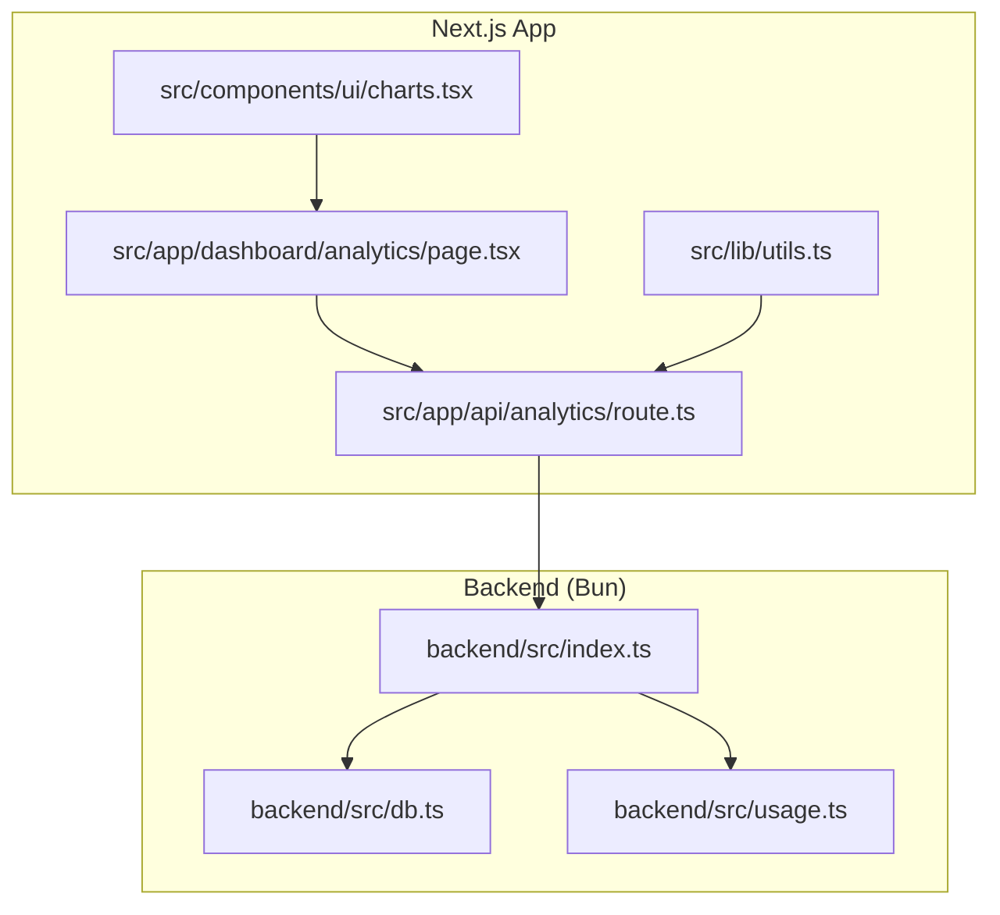
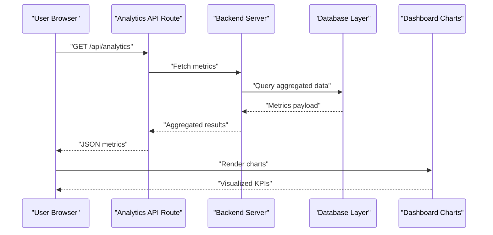
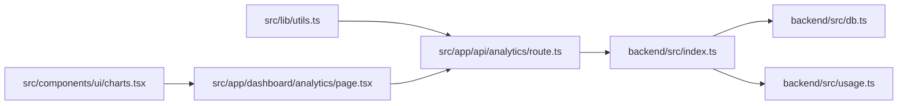

# Monitoring and Profiling

<cite>
**Referenced Files in This Document**
- [package.json](file://package.json)
- [next.config.ts](file://next.config.ts)
- [backend/src/index.ts](file://backend/src/index.ts)
- [backend/src/db.ts](file://backend/src/db.ts)
- [backend/src/auth.ts](file://backend/src/auth.ts)
- [backend/src/usage.ts](file://backend/src/usage.ts)
- [src/app/api/analytics/route.ts](file://src/app/api/analytics/route.ts)
- [src/app/dashboard/analytics/page.tsx](file://src/app/dashboard/analytics/page.tsx)
- [src/components/ui/charts.tsx](file://src/components/ui/charts.tsx)
- [src/lib/utils.ts](file://src/lib/utils.ts)
</cite>

## Table of Contents
1. [Introduction](#introduction)
2. [Project Structure](#project-structure)
3. [Core Components](#core-components)
4. [Architecture Overview](#architecture-overview)
5. [Detailed Component Analysis](#detailed-component-analysis)
6. [Dependency Analysis](#dependency-analysis)
7. [Performance Considerations](#performance-considerations)
8. [Troubleshooting Guide](#troubleshooting-guide)
9. [Conclusion](#conclusion)
10. [Appendices](#appendices)

## Introduction
This document provides comprehensive monitoring and profiling guidance for the project, focusing on performance metrics collection, custom analytics implementation, dashboard visualization, profiling integration, bottleneck identification, debugging techniques, logging strategies, error tracking, alerting, user experience monitoring, API response time tracking, resource utilization monitoring, performance testing methodologies, and continuous performance monitoring setup. It maps these practices to the existing codebase structure and highlights where to instrument or extend functionality.

## Project Structure
The repository is a Next.js application with a separate backend module. Monitoring and observability touchpoints include:
- Backend server entrypoint and database access
- Usage tracking utilities
- Analytics API route
- Dashboard analytics page and chart components
- Shared utilities

**Diagram sources**
- [src/app/api/analytics/route.ts](file://src/app/api/analytics/route.ts)
- [src/app/dashboard/analytics/page.tsx](file://src/app/dashboard/analytics/page.tsx)
- [src/components/ui/charts.tsx](file://src/components/ui/charts.tsx)
- [src/lib/utils.ts](file://src/lib/utils.ts)
- [backend/src/index.ts](file://backend/src/index.ts)
- [backend/src/db.ts](file://backend/src/db.ts)
- [backend/src/usage.ts](file://backend/src/usage.ts)

**Section sources**
- [package.json](file://package.json)
- [next.config.ts](file://next.config.ts)
- [backend/src/index.ts](file://backend/src/index.ts)
- [backend/src/db.ts](file://backend/src/db.ts)
- [backend/src/usage.ts](file://backend/src/usage.ts)
- [src/app/api/analytics/route.ts](file://src/app/api/analytics/route.ts)
- [src/app/dashboard/analytics/page.tsx](file://src/app/dashboard/analytics/page.tsx)
- [src/components/ui/charts.tsx](file://src/components/ui/charts.tsx)
- [src/lib/utils.ts](file://src/lib/utils.ts)

## Core Components
- Backend server entrypoint: initializes runtime, routes, and core services; ideal place to add global request timing, error handling, and health checks.
- Database layer: centralizes DB connections and queries; suitable for query-level latency and error instrumentation.
- Usage tracker: aggregates usage events; can be extended to capture key business metrics and performance signals.
- Analytics API route: exposes endpoints for collecting and querying analytics data from the frontend.
- Dashboard analytics page: renders charts and KPIs using chart components.
- Chart component: reusable UI for visualizing metrics.
- Utilities: shared helpers that can encapsulate timing, logging, and formatting logic.

**Section sources**
- [backend/src/index.ts](file://backend/src/index.ts)
- [backend/src/db.ts](file://backend/src/db.ts)
- [backend/src/usage.ts](file://backend/src/usage.ts)
- [src/app/api/analytics/route.ts](file://src/app/api/analytics/route.ts)
- [src/app/dashboard/analytics/page.tsx](file://src/app/dashboard/analytics/page.tsx)
- [src/components/ui/charts.tsx](file://src/components/ui/charts.tsx)
- [src/lib/utils.ts](file://src/lib/utils.ts)

## Architecture Overview
The monitoring architecture spans client-side interactions, API routes, backend services, and storage. The following diagram shows how requests flow through the system and where observability hooks can be added.

**Diagram sources**
- [src/app/api/analytics/route.ts](file://src/app/api/analytics/route.ts)
- [backend/src/index.ts](file://backend/src/index.ts)
- [backend/src/db.ts](file://backend/src/db.ts)
- [src/components/ui/charts.tsx](file://src/components/ui/charts.tsx)

## Detailed Component Analysis

### Backend Server Entrypoint
Responsibilities:
- Initialize HTTP server and middleware
- Register routes and handlers
- Centralize error handling and logging
- Expose health check endpoints

Monitoring opportunities:
- Global request lifecycle hooks for timing and status codes
- Structured logging for all incoming requests
- Health and readiness probes for orchestration
- Resource utilization snapshots at startup

Implementation references:
- Server initialization and routing registration
- Error handling patterns
- Health endpoint exposure

**Section sources**
- [backend/src/index.ts](file://backend/src/index.ts)

### Database Layer
Responsibilities:
- Manage connection lifecycle
- Execute queries and transactions
- Handle errors and retries

Monitoring opportunities:
- Query-level latency histograms
- Connection pool metrics (active/idle/waiting)
- Slow query detection and sampling
- Error rate and failure reasons

Implementation references:
- Connection setup and configuration
- Query execution wrappers
- Error propagation and logging

**Section sources**
- [backend/src/db.ts](file://backend/src/db.ts)

### Usage Tracker
Responsibilities:
- Aggregate usage events
- Persist counters and summaries
- Provide read APIs for dashboards

Monitoring opportunities:
- Business KPIs (requests per provider/model)
- Cost and quota tracking
- Anomaly detection thresholds
- Batched writes to reduce overhead

Implementation references:
- Event ingestion and aggregation
- Persistence strategy
- Read endpoints for analytics

**Section sources**
- [backend/src/usage.ts](file://backend/src/usage.ts)

### Analytics API Route
Responsibilities:
- Serve analytics queries to the frontend
- Validate inputs and enforce permissions
- Return structured metric payloads

Monitoring opportunities:
- Request timing and throughput
- Input validation failures
- Cache hits vs misses
- Response size distribution

Implementation references:
- Route handler logic
- Data fetching and transformation
- Error responses and status codes

**Section sources**
- [src/app/api/analytics/route.ts](file://src/app/api/analytics/route.ts)

### Dashboard Analytics Page
Responsibilities:
- Fetch metrics from analytics API
- Render KPIs and trends
- Handle loading and error states

Monitoring opportunities:
- Client-side navigation timing
- Time-to-first-byte and TTFB
- Interaction latencies
- Error rates and fallback behavior

Implementation references:
- Data fetching and state management
- Loading/error UI patterns
- Refresh intervals and caching

**Section sources**
- [src/app/dashboard/analytics/page.tsx](file://src/app/dashboard/analytics/page.tsx)

### Chart Component
Responsibilities:
- Visualize metrics over time
- Support multiple chart types
- Handle responsive layouts

Monitoring opportunities:
- Rendering performance (frame drops)
- Memory usage during large datasets
- Accessibility and contrast compliance

Implementation references:
- Chart rendering logic
- Data binding and transformations
- Performance optimizations (virtualization, throttling)

**Section sources**
- [src/components/ui/charts.tsx](file://src/components/ui/charts.tsx)

### Utilities
Responsibilities:
- Shared helpers for formatting, timing, and logging
- Common patterns for error handling

Monitoring opportunities:
- Centralized timing wrapper for functions
- Structured log formatter
- Sampling and redaction utilities

Implementation references:
- Timing helpers
- Logging formatters
- Utility functions used across modules

**Section sources**
- [src/lib/utils.ts](file://src/lib/utils.ts)

## Dependency Analysis
The following diagram illustrates dependencies among key files involved in monitoring and analytics.

**Diagram sources**
- [src/lib/utils.ts](file://src/lib/utils.ts)
- [src/app/api/analytics/route.ts](file://src/app/api/analytics/route.ts)
- [backend/src/index.ts](file://backend/src/index.ts)
- [backend/src/db.ts](file://backend/src/db.ts)
- [backend/src/usage.ts](file://backend/src/usage.ts)
- [src/app/dashboard/analytics/page.tsx](file://src/app/dashboard/analytics/page.tsx)
- [src/components/ui/charts.tsx](file://src/components/ui/charts.tsx)

**Section sources**
- [package.json](file://package.json)
- [next.config.ts](file://next.config.ts)

## Performance Considerations
- Instrument request lifecycles at the server entrypoint to capture end-to-end latency and error rates.
- Add query-level timing and slow-query sampling in the database layer.
- Use batched writes and aggregation windows in the usage tracker to minimize overhead.
- Implement caching strategies for frequently accessed analytics endpoints.
- Monitor client-side performance via navigation timing and interaction latencies.
- Ensure chart rendering remains performant by limiting dataset sizes and using efficient updates.

[No sources needed since this section provides general guidance]

## Troubleshooting Guide
Common issues and diagnostics:
- High latency spikes: correlate server request logs with database slow queries and usage event backlogs.
- Intermittent failures: inspect error handling paths in the server entrypoint and database layer.
- Dashboard not updating: verify analytics API availability, input validation, and cache invalidation.
- Memory growth: monitor chart rendering memory usage and ensure periodic cleanup of large datasets.

Actionable steps:
- Enable structured logging around critical paths.
- Add health check endpoints and probe them continuously.
- Set up alerts for error rate thresholds and slow query counts.
- Use sampling for high-volume metrics to reduce cost and noise.

**Section sources**
- [backend/src/index.ts](file://backend/src/index.ts)
- [backend/src/db.ts](file://backend/src/db.ts)
- [src/app/api/analytics/route.ts](file://src/app/api/analytics/route.ts)
- [src/app/dashboard/analytics/page.tsx](file://src/app/dashboard/analytics/page.tsx)

## Conclusion
By integrating observability into the server entrypoint, database layer, usage tracker, analytics API, and dashboard, the system gains comprehensive visibility into performance, reliability, and user experience. Extending logging, error tracking, and alerting with structured metrics enables proactive monitoring and rapid troubleshooting. Continuous performance testing and profiling should complement runtime telemetry to sustain quality under load.

[No sources needed since this section summarizes without analyzing specific files]

## Appendices

### Performance Metrics Collection Plan
- Server-level: request duration percentiles, error rates, throughput, active connections.
- Database-level: query latency histograms, slow query count, connection pool stats.
- Usage-level: event ingestion rate, aggregation lag, write latency.
- Client-level: navigation timing, TTFB, interaction latency, chart render time.

### Custom Analytics Implementation
- Define canonical event schema and naming conventions.
- Implement ingestion endpoint with validation and batching.
- Provide read APIs for dashboards with caching and pagination.
- Maintain versioning for schema evolution.

### Dashboard Visualization
- KPI cards for latency, error rate, throughput, and usage.
- Trend charts for request volume and response times.
- Provider/model breakdowns and anomaly markers.
- Accessible color schemes and responsive layouts.

### Profiling Tools Integration
- Attach CPU and heap profilers to the backend process.
- Capture flame graphs for hot paths in request handlers and DB calls.
- Correlate profiles with production incidents using trace IDs.

### Bottleneck Identification
- Use latency percentiles and error budgets to prioritize issues.
- Identify slow queries and optimize indexes or queries.
- Reduce payload sizes and enable compression where appropriate.

### Debugging Techniques
- Structured logs with correlation IDs.
- Feature flags for toggling verbose logging in staging.
- Synthetic requests to validate health and performance.

### Logging Strategies
- Centralized structured logging with levels and tags.
- Redact sensitive fields and sample high-volume logs.
- Log rotation and retention policies.

### Error Tracking and Alerting
- Group errors by root cause and track recurrence.
- Alert on SLO breaches and unusual error spikes.
- Runbooks for common incidents.

### User Experience Monitoring
- Track navigation timing and interaction latencies.
- Measure chart rendering performance and memory usage.
- Report client-side errors and network failures.

### API Response Time Tracking
- End-to-end timing from client to backend.
- Per-route latency distributions and p95/p99.
- Timeout and retry policies.

### Resource Utilization Monitoring
- CPU, memory, disk I/O, and network usage.
- Connection pool saturation and queue lengths.
- Autoscaling triggers based on metrics.

### Performance Testing Methodologies
- Load tests simulating realistic traffic patterns.
- Stress tests to identify breaking points.
- Soak tests for long-running stability.
- Chaos experiments for resilience validation.

### Continuous Performance Monitoring Setup
- Integrate metrics into a time-series store.
- Build dashboards and alerts in an observability platform.
- Automate regression detection in CI pipelines.

[No sources needed since this section provides general guidance]