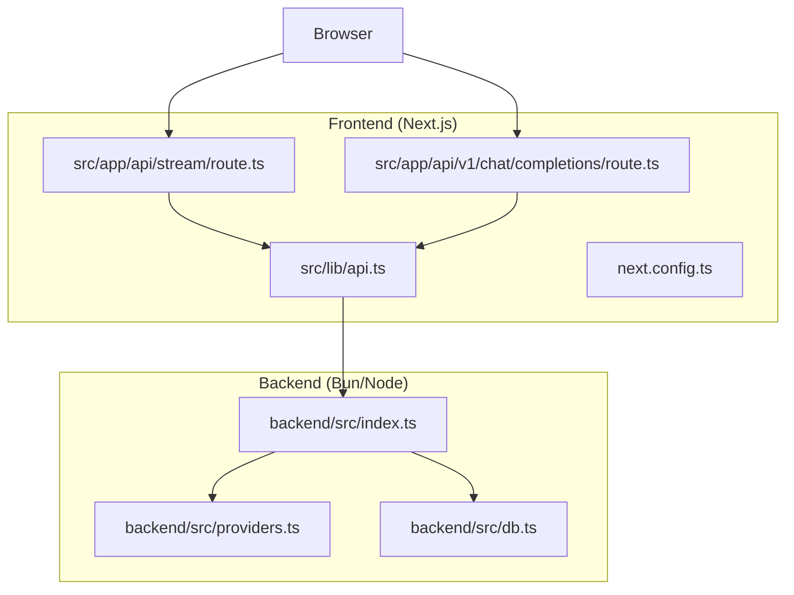
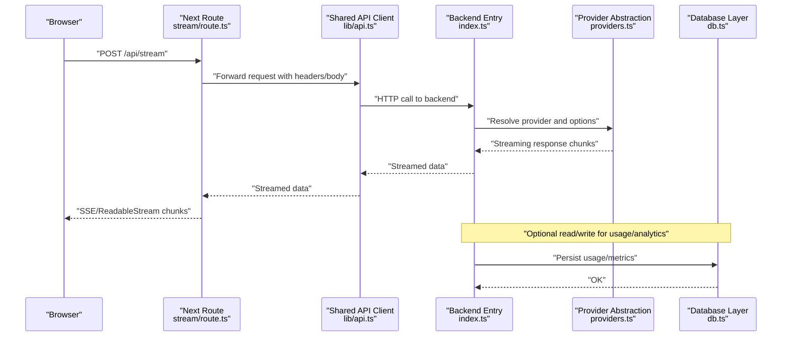
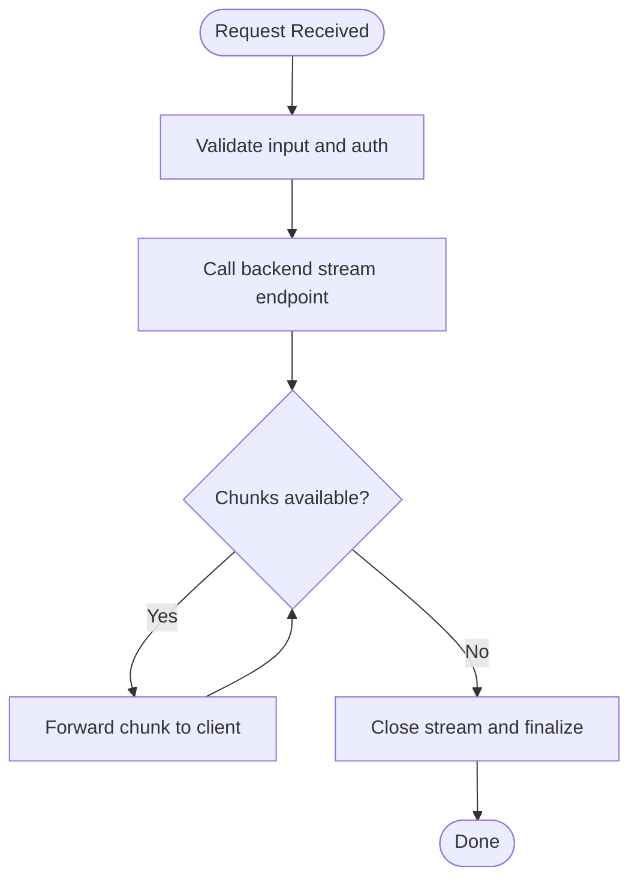
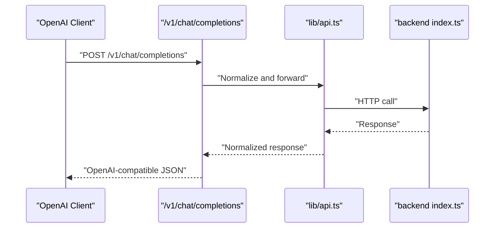
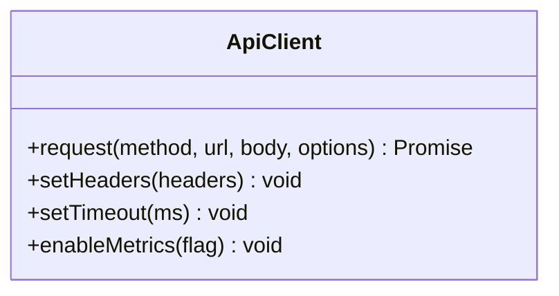
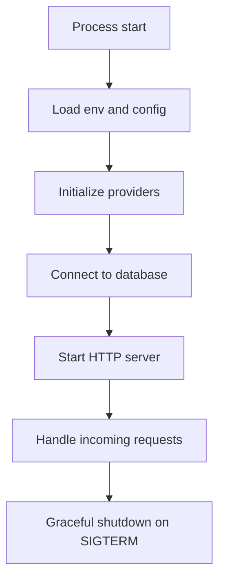
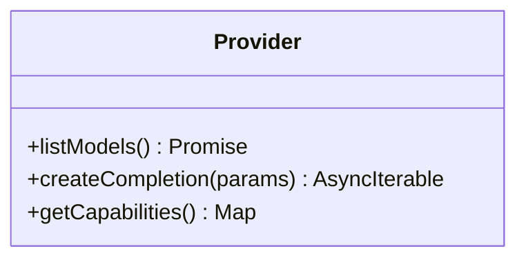
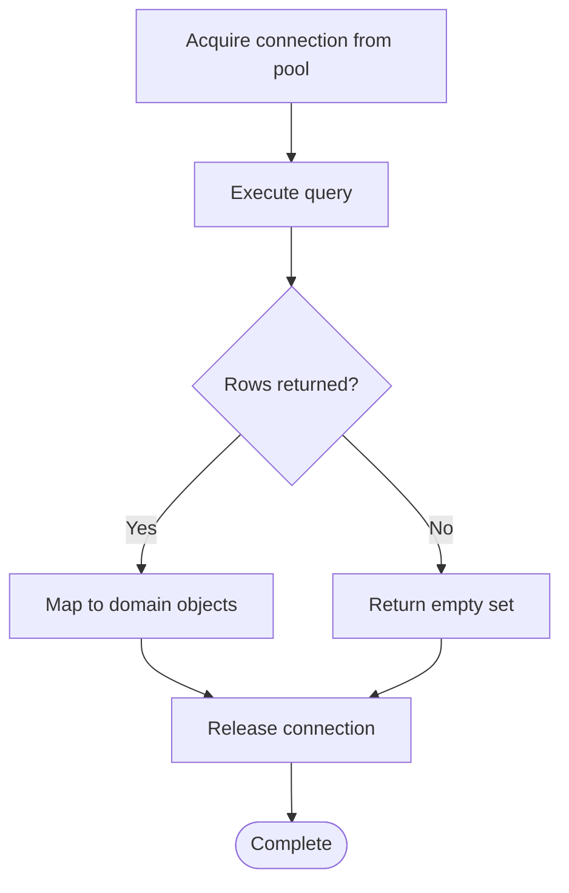
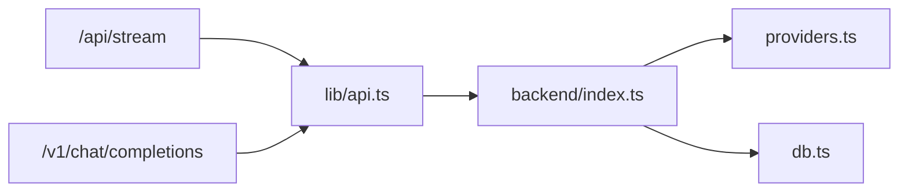

# Performance Optimization

<cite>
**Referenced Files in This Document**
- [backend/src/index.ts](file://backend/src/index.ts)
- [backend/src/providers.ts](file://backend/src/providers.ts)
- [backend/src/db.ts](file://backend/src/db.ts)
- [src/app/api/stream/route.ts](file://src/app/api/stream/route.ts)
- [src/app/api/v1/chat/completions/route.ts](file://src/app/api/v1/chat/completions/route.ts)
- [src/lib/api.ts](file://src/lib/api.ts)
- [next.config.ts](file://next.config.ts)
- [package.json](file://package.json)
</cite>

## Table of Contents
1. [Introduction](#introduction)
2. [Project Structure](#project-structure)
3. [Core Components](#core-components)
4. [Architecture Overview](#architecture-overview)
5. [Detailed Component Analysis](#detailed-component-analysis)
6. [Dependency Analysis](#dependency-analysis)
7. [Performance Considerations](#performance-considerations)
8. [Troubleshooting Guide](#troubleshooting-guide)
9. [Conclusion](#conclusion)
10. [Appendices](#appendices)

## Introduction
This document provides a comprehensive performance optimization guide for the application, focusing on caching strategies, memory management, rendering optimizations, efficient AI model calls, streaming responses, latency reduction, frontend bundle size and lazy loading, backend connection pooling, query optimization, resource management, monitoring, profiling, and metrics collection. It maps recommendations to concrete files in the codebase where applicable and includes diagrams to visualize key flows.

## Project Structure
The project is a Next.js application with an optional backend module:
- Frontend (Next.js): pages/routes under src/app, components under src/components, shared utilities under src/lib, and configuration via next.config.ts.
- Backend (Bun/Node): server entry and modules under backend/src.

**Diagram sources**
- [src/app/api/stream/route.ts](file://src/app/api/stream/route.ts)
- [src/app/api/v1/chat/completions/route.ts](file://src/app/api/v1/chat/completions/route.ts)
- [src/lib/api.ts](file://src/lib/api.ts)
- [backend/src/index.ts](file://backend/src/index.ts)
- [backend/src/providers.ts](file://backend/src/providers.ts)
- [backend/src/db.ts](file://backend/src/db.ts)

**Section sources**
- [next.config.ts](file://next.config.ts)
- [package.json](file://package.json)

## Core Components
Key areas impacting performance:
- Streaming API route for real-time token delivery.
- Chat completions proxy route for compatibility with OpenAI-style clients.
- Shared HTTP client utility for consistent request behavior.
- Backend server entrypoint orchestrating providers and database access.
- Providers abstraction for external AI services.
- Database access layer for persistent storage.

Optimization focus areas:
- Reduce round-trips and payload sizes.
- Stream large responses to improve Time-To-First-Token (TTFB).
- Cache repeated or expensive operations at appropriate layers.
- Tune runtime and bundler settings for faster startup and smaller bundles.

**Section sources**
- [src/app/api/stream/route.ts](file://src/app/api/stream/route.ts)
- [src/app/api/v1/chat/completions/route.ts](file://src/app/api/v1/chat/completions/route.ts)
- [src/lib/api.ts](file://src/lib/api.ts)
- [backend/src/index.ts](file://backend/src/index.ts)
- [backend/src/providers.ts](file://backend/src/providers.ts)
- [backend/src/db.ts](file://backend/src/db.ts)

## Architecture Overview
End-to-end flow for chat interactions and streaming:

**Diagram sources**
- [src/app/api/stream/route.ts](file://src/app/api/stream/route.ts)
- [src/lib/api.ts](file://src/lib/api.ts)
- [backend/src/index.ts](file://backend/src/index.ts)
- [backend/src/providers.ts](file://backend/src/providers.ts)
- [backend/src/db.ts](file://backend/src/db.ts)

## Detailed Component Analysis

### Streaming Endpoint (/api/stream)
Responsibilities:
- Accepts chat requests and streams tokens back to the client.
- Manages headers, timeouts, and error propagation.
- Optionally records usage or analytics.

Optimization techniques:
- Use server-side streaming to minimize TTFB and reduce perceived latency.
- Avoid buffering entire responses; forward chunks immediately.
- Set appropriate timeouts and abort signals to free resources on client disconnect.
- Compress only if CPU-bound; prefer streaming raw text for speed.

**Diagram sources**
- [src/app/api/stream/route.ts](file://src/app/api/stream/route.ts)

**Section sources**
- [src/app/api/stream/route.ts](file://src/app/api/stream/route.ts)

### Chat Completions Proxy (/api/v1/chat/completions)
Responsibilities:
- Provides OpenAI-compatible interface by forwarding requests to the backend.
- Normalizes payloads and responses.

Optimization techniques:
- Minimize transformation overhead; pass through fields when safe.
- Cache static provider metadata and model lists.
- Add request-level tracing for latency attribution.

**Diagram sources**
- [src/app/api/v1/chat/completions/route.ts](file://src/app/api/v1/chat/completions/route.ts)
- [src/lib/api.ts](file://src/lib/api.ts)
- [backend/src/index.ts](file://backend/src/index.ts)

**Section sources**
- [src/app/api/v1/chat/completions/route.ts](file://src/app/api/v1/chat/completions/route.ts)
- [src/lib/api.ts](file://src/lib/api.ts)

### Shared API Client (lib/api.ts)
Responsibilities:
- Centralized HTTP client configuration, retries, timeouts, and headers.
- May include request/response logging and metrics.

Optimization techniques:
- Reuse connections via keep-alive and proper agent configuration.
- Implement exponential backoff with jitter for transient errors.
- Limit concurrent outbound requests to avoid overwhelming providers.
- Add per-request timing instrumentation.

**Diagram sources**
- [src/lib/api.ts](file://src/lib/api.ts)

**Section sources**
- [src/lib/api.ts](file://src/lib/api.ts)

### Backend Entry (index.ts)
Responsibilities:
- Initializes server, routes, middleware, and global config.
- Orchestrates provider selection and database interactions.

Optimization techniques:
- Pre-warm provider clients and caches at startup.
- Configure graceful shutdown to drain in-flight requests.
- Enable structured logging and sampling for high-volume endpoints.

**Diagram sources**
- [backend/src/index.ts](file://backend/src/index.ts)

**Section sources**
- [backend/src/index.ts](file://backend/src/index.ts)

### Providers Abstraction (providers.ts)
Responsibilities:
- Encapsulates external AI provider integrations.
- Normalizes models, parameters, and streaming formats.

Optimization techniques:
- Cache provider capabilities and model catalogs.
- Implement circuit breakers and fallback providers.
- Batch non-streaming metadata calls; stream only token payloads.

**Diagram sources**
- [backend/src/providers.ts](file://backend/src/providers.ts)

**Section sources**
- [backend/src/providers.ts](file://backend/src/providers.ts)

### Database Layer (db.ts)
Responsibilities:
- Connection management, queries, and transactions.
- Usage tracking and analytics persistence.

Optimization techniques:
- Use connection pooling with tuned min/max pool sizes.
- Index frequently queried columns and use selective projections.
- Paginate large result sets and avoid N+1 queries.

**Diagram sources**
- [backend/src/db.ts](file://backend/src/db.ts)

**Section sources**
- [backend/src/db.ts](file://backend/src/db.ts)

## Dependency Analysis
High-level dependencies between frontend routes, shared client, and backend modules:

**Diagram sources**
- [src/app/api/stream/route.ts](file://src/app/api/stream/route.ts)
- [src/app/api/v1/chat/completions/route.ts](file://src/app/api/v1/chat/completions/route.ts)
- [src/lib/api.ts](file://src/lib/api.ts)
- [backend/src/index.ts](file://backend/src/index.ts)
- [backend/src/providers.ts](file://backend/src/providers.ts)
- [backend/src/db.ts](file://backend/src/db.ts)

**Section sources**
- [src/app/api/stream/route.ts](file://src/app/api/stream/route.ts)
- [src/app/api/v1/chat/completions/route.ts](file://src/app/api/v1/chat/completions/route.ts)
- [src/lib/api.ts](file://src/lib/api.ts)
- [backend/src/index.ts](file://backend/src/index.ts)
- [backend/src/providers.ts](file://backend/src/providers.ts)
- [backend/src/db.ts](file://backend/src/db.ts)

## Performance Considerations

### Caching Strategies
- Static assets and UI fragments:
  - Leverage Next.js image optimization and font preloading.
  - Use immutable cache headers for versioned assets.
- Data caching:
  - Cache provider model lists and capabilities at startup or with short TTL.
  - Apply request deduplication for identical concurrent requests.
- In-memory caches:
  - Use process-scoped caches for small, hot datasets; consider expiration and eviction policies.
- Edge caching:
  - For read-only endpoints, enable CDN caching where possible.

[No sources needed since this section provides general guidance]

### Memory Management
- Avoid retaining large buffers; stream payloads instead of accumulating them.
- Clear references after processing to allow garbage collection.
- Monitor heap growth during long-running processes; implement periodic checkpoints.
- Use object pools for frequently allocated structures if necessary.

[No sources needed since this section provides general guidance]

### Rendering Optimizations (Frontend)
- Prefer React.memo and useMemo for expensive computations.
- Virtualize long lists and defer offscreen content.
- Split heavy components with dynamic imports and Suspense boundaries.
- Optimize images and fonts; use modern formats and responsive sizing.

[No sources needed since this section provides general guidance]

### Bundle Size Reduction
- Tree-shake unused libraries and remove dev-only code paths.
- Analyze bundle with built-in tools and remove duplicates.
- Lazy-load routes and heavy third-party modules.
- Configure compression and asset minification appropriately.

**Section sources**
- [next.config.ts](file://next.config.ts)
- [package.json](file://package.json)

### Lazy Loading
- Route-based code splitting using dynamic imports.
- Defer non-critical scripts and analytics.
- Load charts and visualizations on demand.

**Section sources**
- [next.config.ts](file://next.config.ts)

### Backend Optimization Techniques
- Connection pooling:
  - Tune pool size based on concurrency and provider limits.
  - Ensure connections are released promptly and handle leaks.
- Query optimization:
  - Add indexes for filter/sort columns.
  - Use projection to fetch only required fields.
  - Avoid N+1 patterns by batching reads.
- Resource management:
  - Enforce request timeouts and cancellation.
  - Implement rate limiting and backpressure.
  - Graceful shutdown to finish in-flight work.

**Section sources**
- [backend/src/db.ts](file://backend/src/db.ts)
- [backend/src/index.ts](file://backend/src/index.ts)

### Optimizing AI Model Calls
- Choose optimal model variants and context lengths.
- Stream tokens to reduce perceived latency.
- Cache prompt templates and common parameters.
- Implement retry with exponential backoff and jitter.
- Use provider-specific optimizations (e.g., temperature, top_p) to balance quality and cost.

**Section sources**
- [backend/src/providers.ts](file://backend/src/providers.ts)
- [src/app/api/stream/route.ts](file://src/app/api/stream/route.ts)

### Efficient Streaming Responses
- Forward chunks immediately without buffering.
- Use appropriate transfer encodings and avoid unnecessary serialization.
- Handle client disconnects by aborting upstream requests.
- Emit heartbeats if idle periods are expected.

**Section sources**
- [src/app/api/stream/route.ts](file://src/app/api/stream/route.ts)

### Reducing Latency
- Co-locate services and databases geographically.
- Use HTTP/2 or HTTP/3 where supported.
- Minimize header sizes and remove unused cookies.
- Preconnect to upstream domains and preload critical resources.

[No sources needed since this section provides general guidance]

### Monitoring Tools, Profiling, and Metrics
- Request-level metrics:
  - Track latency percentiles, error rates, and throughput.
  - Instrument provider call durations and failure reasons.
- Structured logging:
  - Include correlation IDs across frontend and backend.
  - Sample logs for high-volume endpoints.
- Profiling:
  - Use CPU and heap profilers to identify hotspots.
  - Profile database queries and network I/O.
- Dashboards and alerts:
  - Visualize SLOs like TTFB, p95 latency, and error budgets.
  - Alert on anomalies and degradation.

**Section sources**
- [src/lib/api.ts](file://src/lib/api.ts)
- [backend/src/index.ts](file://backend/src/index.ts)

## Troubleshooting Guide
Common issues and resolutions:
- High latency spikes:
  - Check provider response times and rate limits.
  - Inspect database query plans and missing indexes.
- Memory leaks:
  - Verify that streams are closed and connections released.
  - Review event listeners and timers not being cleaned up.
- Streaming interruptions:
  - Ensure proper handling of client disconnects and upstream cancellations.
  - Validate timeout configurations on both sides.
- Bundle bloat:
  - Identify large dependencies and replace with lighter alternatives.
  - Remove unused routes and components.

**Section sources**
- [backend/src/db.ts](file://backend/src/db.ts)
- [backend/src/index.ts](file://backend/src/index.ts)
- [src/lib/api.ts](file://src/lib/api.ts)

## Conclusion
By applying targeted optimizations—streaming responses, caching hot data, tuning connection pools, optimizing queries, reducing frontend bundle sizes, and instrumenting metrics—you can significantly improve responsiveness, scalability, and reliability. Continuously monitor performance, profile bottlenecks, and iterate on configurations to maintain strong user experience under load.

[No sources needed since this section summarizes without analyzing specific files]

## Appendices

### Configuration Checklist
- Enable compression and HTTP/2.
- Set sensible timeouts and retry policies.
- Configure connection pool sizes and max idle connections.
- Turn on structured logging and metrics collection.

**Section sources**
- [next.config.ts](file://next.config.ts)
- [package.json](file://package.json)
- [backend/src/index.ts](file://backend/src/index.ts)