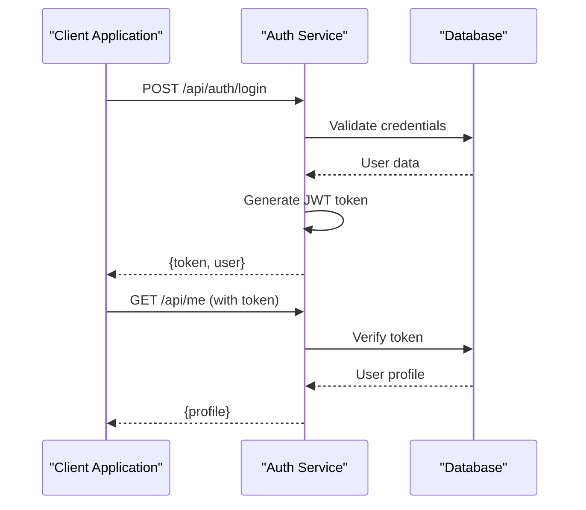

# API Route Handlers

<cite>
**Referenced Files in This Document**
- [backend/src/index.ts](file://backend/src/index.ts)
- [src/app/api/v1/chat/completions/route.ts](file://src/app/api/v1/chat/completions/route.ts)
- [src/app/api/stream/route.ts](file://src/app/api/stream/route.ts)
- [src/app/api/auth/login/route.ts](file://src/app/api/auth/login/route.ts)
- [src/app/api/auth/signup/route.ts](file://src/app/api/auth/signup/route.ts)
- [src/app/api/keys/route.ts](file://src/app/api/keys/route.ts)
- [src/app/api/keys/[id]/route.ts](file://src/app/api/keys/[id]/route.ts)
- [src/app/api/providers/route.ts](file://src/app/api/providers/route.ts)
- [src/app/api/providers/[id]/route.ts](file://src/app/api/providers/[id]/route.ts)
- [src/app/api/analytics/route.ts](file://src/app/api/analytics/route.ts)
- [src/app/api/me/route.ts](file://src/app/api/me/route.ts)
- [src/app/api/models/route.ts](file://src/app/api/models/route.ts)
</cite>

## Table of Contents
1. [Introduction](#introduction)
2. [Authentication Overview](#authentication-overview)
3. [Chat Completions API](#chat-completions-api)
4. [Streaming API](#streaming-api)
5. [Authentication Endpoints](#authentication-endpoints)
6. [Key Management API](#key-management-api)
7. [Provider Configuration API](#provider-configuration-api)
8. [Analytics API](#analytics-api)
9. [User Management API](#user-management-api)
10. [Model Management API](#model-management-api)
11. [Error Handling](#error-handling)
12. [Rate Limiting](#rate-limiting)
13. [Client Integration Examples](#client-integration-examples)
14. [Troubleshooting Guide](#troubleshooting-guide)
15. [Conclusion](#conclusion)

## Introduction

This document provides comprehensive API documentation for the backend route handlers in the CheapModels application. The API follows RESTful conventions and supports both standard JSON responses and streaming responses for real-time chat completions. The system includes authentication, key management, provider configuration, analytics collection, and model management capabilities.

The API is built using Next.js App Router with TypeScript support and provides a unified interface for managing AI model interactions through multiple providers.

## Authentication Overview

All protected endpoints require authentication via JWT tokens. The authentication system supports:

- **Bearer Token Authentication**: Include `Authorization: Bearer <token>` header
- **Session-based Authentication**: For web dashboard access
- **API Key Authentication**: For programmatic access to specific endpoints

### Authentication Flow



**Diagram sources**
- [src/app/api/auth/login/route.ts](file://src/app/api/auth/login/route.ts)
- [src/app/api/auth/signup/route.ts](file://src/app/api/auth/signup/route.ts)
- [src/app/api/me/route.ts](file://src/app/api/me/route.ts)

## Chat Completions API

The Chat Completions API provides OpenAI-compatible endpoints for generating text completions using various AI models.

### Endpoint: `/api/v1/chat/completions`

**HTTP Method**: `POST`

**Authentication**: Required (Bearer token or API key)

**Content-Type**: `application/json`

#### Request Schema

```json
{
  "model": "string",
  "messages": [
    {
      "role": "system | user | assistant",
      "content": "string"
    }
  ],
  "max_tokens": "number",
  "temperature": "number",
  "top_p": "number",
  "frequency_penalty": "number",
  "presence_penalty": "number",
  "stop": ["string"],
  "stream": "boolean"
}
```

#### Response Schema (Non-streaming)

```json
{
  "id": "string",
  "object": "chat.completion",
  "created": "number",
  "model": "string",
  "choices": [
    {
      "index": "number",
      "message": {
        "role": "assistant",
        "content": "string"
      },
      "finish_reason": "stop | length | content_filter"
    }
  ],
  "usage": {
    "prompt_tokens": "number",
    "completion_tokens": "number",
    "total_tokens": "number"
  }
}
```

#### Streaming Response Format

For streaming responses (`stream: true`), the endpoint returns Server-Sent Events (SSE):

```
data: {"id":"...","object":"chat.completion.chunk","created":...,"model":"...","choices":[{"index":0,"delta":{"content":"Hello"},"finish_reason":null}]}

data: {"id":"...","object":"chat.completion.chunk","created":...,"model":"...","choices":[{"index":0,"delta":{"content":" world"},"finish_reason":null}]}

data: {"id":"...","object":"chat.completion.chunk","created":...,"model":"...","choices":[{"index":0,"delta":{},"finish_reason":"stop"}]}

data: [DONE]
```

#### Status Codes

- `200 OK`: Successful completion
- `400 Bad Request`: Invalid request parameters
- `401 Unauthorized`: Missing or invalid authentication
- `403 Forbidden`: Insufficient permissions
- `429 Too Many Requests`: Rate limit exceeded
- `500 Internal Server Error`: Server error

**Section sources**
- [src/app/api/v1/chat/completions/route.ts](file://src/app/api/v1/chat/completions/route.ts)

## Streaming API

The dedicated streaming endpoint provides enhanced streaming capabilities for real-time applications.

### Endpoint: `/api/stream`

**HTTP Method**: `POST`

**Authentication**: Required (Bearer token or API key)

**Content-Type**: `application/json`

#### Request Schema

```json
{
  "type": "chat | completion | embedding",
  "model": "string",
  "input": "string | array",
  "stream": true,
  "options": {
    "temperature": "number",
    "max_tokens": "number",
    "top_p": "number"
  }
}
```

#### Streaming Response Format

The endpoint uses WebSocket-like streaming with JSON chunks:

```json
{"type": "chunk", "data": "partial response text"}
{"type": "metadata", "usage": {"tokens": 123}}
{"type": "complete", "final": true}
```

#### Supported Stream Types

- **Chat Streaming**: Real-time conversation responses
- **Completion Streaming**: Text generation with progress updates
- **Embedding Streaming**: Vector embeddings with intermediate results

**Section sources**
- [src/app/api/stream/route.ts](file://src/app/api/stream/route.ts)

## Authentication Endpoints

### Login Endpoint

**Endpoint**: `/api/auth/login`

**HTTP Method**: `POST`

**Authentication**: None required

#### Request Schema

```json
{
  "email": "string",
  "password": "string"
}
```

#### Response Schema

```json
{
  "success": "boolean",
  "token": "string",
  "user": {
    "id": "string",
    "email": "string",
    "name": "string",
    "role": "admin | user"
  }
}
```

#### Status Codes

- `200 OK`: Login successful
- `401 Unauthorized`: Invalid credentials
- `400 Bad Request`: Missing required fields

### Signup Endpoint

**Endpoint**: `/api/auth/signup`

**HTTP Method**: `POST`

**Authentication**: None required

#### Request Schema

```json
{
  "email": "string",
  "password": "string",
  "name": "string",
  "company": "string"
}
```

#### Response Schema

```json
{
  "success": "boolean",
  "message": "string",
  "user": {
    "id": "string",
    "email": "string",
    "name": "string"
  }
}
```

#### Validation Rules

- Email must be valid format
- Password must be at least 8 characters
- Name is required
- Company is optional

**Section sources**
- [src/app/api/auth/login/route.ts](file://src/app/api/auth/login/route.ts)
- [src/app/api/auth/signup/route.ts](file://src/app/api/auth/signup/route.ts)

## Key Management API

The Key Management API allows users to create, manage, and monitor API keys for programmatic access.

### Create API Key

**Endpoint**: `/api/keys`

**HTTP Method**: `POST`

**Authentication**: Required (Bearer token)

#### Request Schema

```json
{
  "name": "string",
  "permissions": ["read", "write", "admin"],
  "expires_at": "ISO 8601 timestamp",
  "description": "string"
}
```

#### Response Schema

```json
{
  "id": "string",
  "name": "string",
  "key": "string",
  "permissions": ["array"],
  "created_at": "timestamp",
  "expires_at": "timestamp",
  "last_used": "timestamp"
}
```

### List API Keys

**Endpoint**: `/api/keys`

**HTTP Method**: `GET`

**Authentication**: Required (Bearer token)

#### Query Parameters

- `page`: number (default: 1)
- `limit`: number (default: 20)
- `search`: string (filter by name)

#### Response Schema

```json
{
  "keys": [
    {
      "id": "string",
      "name": "string",
      "permissions": ["array"],
      "created_at": "timestamp",
      "last_used": "timestamp",
      "is_active": "boolean"
    }
  ],
  "total": "number",
  "page": "number",
  "limit": "number"
}
```

### Get API Key Details

**Endpoint**: `/api/keys/{id}`

**HTTP Method**: `GET`

**Authentication**: Required (Bearer token)

#### Path Parameters

- `id`: string (API key ID)

#### Response Schema

```json
{
  "id": "string",
  "name": "string",
  "permissions": ["array"],
  "created_at": "timestamp",
  "expires_at": "timestamp",
  "last_used": "timestamp",
  "usage_count": "number",
  "ip_whitelist": ["string"]
}
```

### Update API Key

**Endpoint**: `/api/keys/{id}`

**HTTP Method**: `PUT`

**Authentication**: Required (Bearer token)

#### Request Schema

```json
{
  "name": "string",
  "permissions": ["array"],
  "expires_at": "ISO 8601 timestamp",
  "is_active": "boolean"
}
```

### Delete API Key

**Endpoint**: `/api/keys/{id}`

**HTTP Method**: `DELETE`

**Authentication**: Required (Bearer token)

#### Response Schema

```json
{
  "success": "boolean",
  "message": "string"
}
```

#### Status Codes

- `200 OK`: Operation successful
- `404 Not Found`: API key not found
- `400 Bad Request`: Invalid request data

**Section sources**
- [src/app/api/keys/route.ts](file://src/app/api/keys/route.ts)
- [src/app/api/keys/[id]/route.ts](file://src/app/api/keys/[id]/route.ts)

## Provider Configuration API

The Provider Configuration API manages AI model providers and their settings.

### Create Provider

**Endpoint**: `/api/providers`

**HTTP Method**: `POST`

**Authentication**: Required (Admin role)

#### Request Schema

```json
{
  "name": "string",
  "type": "openai | anthropic | google | custom",
  "api_key": "string",
  "base_url": "string",
  "models": ["string"],
  "rate_limit": {
    "requests_per_minute": "number",
    "tokens_per_minute": "number"
  },
  "enabled": "boolean"
}
```

#### Response Schema

```json
{
  "id": "string",
  "name": "string",
  "type": "string",
  "models": ["string"],
  "rate_limit": "object",
  "enabled": "boolean",
  "created_at": "timestamp",
  "updated_at": "timestamp"
}
```

### List Providers

**Endpoint**: `/api/providers`

**HTTP Method**: `GET`

**Authentication**: Required (Admin role)

#### Query Parameters

- `enabled_only`: boolean (filter enabled providers)
- `type`: string (filter by provider type)

#### Response Schema

```json
{
  "providers": [
    {
      "id": "string",
      "name": "string",
      "type": "string",
      "models": ["string"],
      "enabled": "boolean",
      "status": "active | inactive | error"
    }
  ],
  "total": "number"
}
```

### Get Provider Details

**Endpoint**: `/api/providers/{id}`

**HTTP Method**: `GET`

**Authentication**: Required (Admin role)

#### Response Schema

```json
{
  "id": "string",
  "name": "string",
  "type": "string",
  "api_key": "string",
  "base_url": "string",
  "models": ["string"],
  "rate_limit": "object",
  "enabled": "boolean",
  "health_status": "healthy | unhealthy",
  "last_checked": "timestamp",
  "created_at": "timestamp",
  "updated_at": "timestamp"
}
```

### Update Provider

**Endpoint**: `/api/providers/{id}`

**HTTP Method**: `PUT`

**Authentication**: Required (Admin role)

#### Request Schema

```json
{
  "name": "string",
  "api_key": "string",
  "base_url": "string",
  "models": ["string"],
  "rate_limit": "object",
  "enabled": "boolean"
}
```

### Delete Provider

**Endpoint**: `/api/providers/{id}`

**HTTP Method**: `DELETE`

**Authentication**: Required (Admin role)

#### Response Schema

```json
{
  "success": "boolean",
  "message": "string"
}
```

#### Status Codes

- `200 OK`: Operation successful
- `404 Not Found`: Provider not found
- `403 Forbidden`: Insufficient permissions
- `400 Bad Request`: Invalid provider configuration

**Section sources**
- [src/app/api/providers/route.ts](file://src/app/api/providers/route.ts)
- [src/app/api/providers/[id]/route.ts](file://src/app/api/providers/[id]/route.ts)

## Analytics API

The Analytics API provides usage statistics and performance metrics.

### Get Usage Analytics

**Endpoint**: `/api/analytics`

**HTTP Method**: `GET`

**Authentication**: Required (Bearer token)

#### Query Parameters

- `start_date`: ISO 8601 timestamp
- `end_date`: ISO 8601 timestamp
- `group_by`: "day | week | month"
- `metrics`: "usage | cost | latency"

#### Response Schema

```json
{
  "period": {
    "start": "timestamp",
    "end": "timestamp"
  },
  "summary": {
    "total_requests": "number",
    "total_tokens": "number",
    "total_cost": "number",
    "average_latency": "number",
    "success_rate": "number"
  },
  "daily_data": [
    {
      "date": "timestamp",
      "requests": "number",
      "tokens": "number",
      "cost": "number",
      "latency": "number"
    }
  ]
}
```

### Get Model Performance

**Endpoint**: `/api/analytics/performance`

**HTTP Method**: `GET`

**Authentication**: Required (Bearer token)

#### Query Parameters

- `model`: string (filter by model)
- `provider`: string (filter by provider)
- `time_range`: "24h | 7d | 30d"

#### Response Schema

```json
{
  "model_stats": {
    "model_name": "string",
    "total_requests": "number",
    "avg_response_time": "number",
    "error_rate": "number",
    "cost_per_request": "number"
  },
  "trends": {
    "request_volume": "array",
    "response_times": "array",
    "cost_trends": "array"
  }
}
```

#### Status Codes

- `200 OK`: Analytics data retrieved successfully
- `400 Bad Request`: Invalid date range or parameters
- `403 Forbidden`: Insufficient permissions

**Section sources**
- [src/app/api/analytics/route.ts](file://src/app/api/analytics/route.ts)

## User Management API

### Get Current User

**Endpoint**: `/api/me`

**HTTP Method**: `GET`

**Authentication**: Required (Bearer token)

#### Response Schema

```json
{
  "id": "string",
  "email": "string",
  "name": "string",
  "role": "admin | user",
  "subscription": {
    "plan": "free | pro | enterprise",
    "status": "active | cancelled",
    "expires_at": "timestamp"
  },
  "usage": {
    "current_period_usage": "number",
    "monthly_limit": "number",
    "overage_rate": "number"
  },
  "preferences": {
    "theme": "light | dark",
    "language": "string",
    "notifications": "boolean"
  }
}
```

#### Status Codes

- `200 OK`: User profile retrieved successfully
- `401 Unauthorized`: Invalid or missing token
- `404 Not Found`: User not found

**Section sources**
- [src/app/api/me/route.ts](file://src/app/api/me/route.ts)

## Model Management API

### List Available Models

**Endpoint**: `/api/models`

**HTTP Method**: `GET`

**Authentication**: Optional (public endpoint)

#### Query Parameters

- `provider`: string (filter by provider)
- `type`: string (filter by model type)
- `available_only`: boolean (filter available models)

#### Response Schema

```json
{
  "models": [
    {
      "id": "string",
      "name": "string",
      "provider": "string",
      "type": "text | image | audio",
      "context_length": "number",
      "max_tokens": "number",
      "pricing": {
        "input_cost": "number",
        "output_cost": "number",
        "currency": "USD"
      },
      "capabilities": ["string"],
      "available": "boolean"
    }
  ],
  "total": "number"
}
```

#### Status Codes

- `200 OK`: Models list retrieved successfully
- `500 Internal Server Error`: Provider connection failed

**Section sources**
- [src/app/api/models/route.ts](file://src/app/api/models/route.ts)

## Error Handling

The API uses consistent error response formats across all endpoints:

### Standard Error Response

```json
{
  "error": {
    "code": "string",
    "message": "string",
    "details": "object",
    "timestamp": "timestamp",
    "request_id": "string"
  }
}
```

### Common Error Codes

| Code | HTTP Status | Description |
|------|-------------|-------------|
| `AUTHENTICATION_FAILED` | 401 | Invalid or expired authentication token |
| `INSUFFICIENT_PERMISSIONS` | 403 | User lacks required permissions |
| `INVALID_REQUEST` | 400 | Malformed or incomplete request |
| `RESOURCE_NOT_FOUND` | 404 | Requested resource does not exist |
| `RATE_LIMIT_EXCEEDED` | 429 | Too many requests in time window |
| `INTERNAL_ERROR` | 500 | Unexpected server error |
| `SERVICE_UNAVAILABLE` | 503 | External service temporarily unavailable |

### Error Response Examples

**Authentication Error:**
```json
{
  "error": {
    "code": "AUTHENTICATION_FAILED",
    "message": "Invalid or expired authentication token",
    "details": {
      "reason": "token_expired",
      "expires_at": "2024-01-01T00:00:00Z"
    },
    "timestamp": "2024-01-15T10:30:00Z",
    "request_id": "req_abc123"
  }
}
```

**Validation Error:**
```json
{
  "error": {
    "code": "INVALID_REQUEST",
    "message": "Request validation failed",
    "details": {
      "fields": {
        "email": "Invalid email format",
        "password": "Password must be at least 8 characters"
      }
    },
    "timestamp": "2024-01-15T10:30:00Z",
    "request_id": "req_def456"
  }
}
```

## Rate Limiting

The API implements rate limiting to ensure fair usage and prevent abuse:

### Rate Limit Tiers

| Plan | Requests per Minute | Requests per Hour | Daily Limit |
|------|-------------------|------------------|-------------|
| Free | 10 | 100 | 1,000 |
| Pro | 60 | 1,000 | 10,000 |
| Enterprise | Custom | Custom | Unlimited |

### Rate Limit Headers

All API responses include rate limit information:

```
X-RateLimit-Limit: 60
X-RateLimit-Remaining: 45
X-RateLimit-Reset: 1705312200
X-RateLimit-Window: minute
```

### Rate Limit Exceeded Response

```json
{
  "error": {
    "code": "RATE_LIMIT_EXCEEDED",
    "message": "Too many requests. Please try again later.",
    "details": {
      "retry_after": 60,
      "limit": 60,
      "remaining": 0,
      "reset_at": "2024-01-15T10:31:00Z"
    },
    "timestamp": "2024-01-15T10:30:00Z",
    "request_id": "req_ghi789"
  }
}
```

### Rate Limiting Strategies

- **Sliding Window**: Smooth rate limiting across time periods
- **Token Bucket**: Burst-friendly rate limiting for short-term spikes
- **Per-User Limits**: Individual rate limits based on subscription tier
- **Global Limits**: System-wide limits to protect infrastructure

## Client Integration Examples

### JavaScript/Node.js Example

```javascript
// Basic chat completion
const response = await fetch('/api/v1/chat/completions', {
  method: 'POST',
  headers: {
    'Authorization': 'Bearer YOUR_TOKEN',
    'Content-Type': 'application/json'
  },
  body: JSON.stringify({
    model: 'gpt-4',
    messages: [
      { role: 'user', content: 'Hello, how are you?' }
    ]
  })
});

const data = await response.json();
console.log(data.choices[0].message.content);
```

### Python Example

```python
import requests

headers = {
    'Authorization': 'Bearer YOUR_TOKEN',
    'Content-Type': 'application/json'
}

payload = {
    'model': 'gpt-4',
    'messages': [
        {'role': 'user', 'content': 'Explain quantum computing'}
    ]
}

response = requests.post(
    'https://api.cheapmodels.com/api/v1/chat/completions',
    headers=headers,
    json=payload
)

result = response.json()
print(result['choices'][0]['message']['content'])
```

### Streaming Example (JavaScript)

```javascript
async function streamChatCompletion(messages) {
  const response = await fetch('/api/v1/chat/completions', {
    method: 'POST',
    headers: {
      'Authorization': 'Bearer YOUR_TOKEN',
      'Content-Type': 'application/json'
    },
    body: JSON.stringify({
      model: 'gpt-4',
      messages: messages,
      stream: true
    })
  });

  const reader = response.body.getReader();
  const decoder = new TextDecoder();
  
  while (true) {
    const { done, value } = await reader.read();
    if (done) break;
    
    const chunk = decoder.decode(value);
    const lines = chunk.split('\n');
    
    for (const line of lines) {
      if (line.startsWith('data: ') && line !== 'data: [DONE]') {
        const data = JSON.parse(line.slice(6));
        console.log(data.choices[0].delta.content);
      }
    }
  }
}
```

### cURL Examples

**Basic Request:**
```bash
curl -X POST https://api.cheapmodels.com/api/v1/chat/completions \
  -H "Authorization: Bearer YOUR_TOKEN" \
  -H "Content-Type: application/json" \
  -d '{
    "model": "gpt-4",
    "messages": [{"role": "user", "content": "Hello"}]
  }'
```

**Create API Key:**
```bash
curl -X POST https://api.cheapmodels.com/api/keys \
  -H "Authorization: Bearer YOUR_ADMIN_TOKEN" \
  -H "Content-Type: application/json" \
  -d '{
    "name": "Production API Key",
    "permissions": ["read", "write"]
  }'
```

## Troubleshooting Guide

### Common Issues and Solutions

**Authentication Problems:**
- Ensure token is valid and not expired
- Check token has required permissions
- Verify correct Authorization header format

**Rate Limiting Issues:**
- Monitor X-RateLimit headers
- Implement exponential backoff
- Consider upgrading subscription tier

**Streaming Connection Issues:**
- Check network connectivity
- Verify server-sent events support
- Implement reconnection logic

**Model Availability:**
- Check provider health status
- Verify model availability in selected region
- Implement fallback providers

### Debugging Tools

**Request Logging:**
- Enable debug logging in development
- Use request IDs for tracking
- Log response times and status codes

**Performance Monitoring:**
- Track API response times
- Monitor error rates
- Analyze usage patterns

**Health Checks:**
- Monitor provider connectivity
- Check database connections
- Verify external service availability

## Conclusion

The CheapModels API provides a comprehensive platform for integrating AI model capabilities into applications. With support for multiple providers, real-time streaming, robust authentication, and detailed analytics, it offers everything needed to build production-ready AI-powered applications.

The API's design emphasizes simplicity, reliability, and scalability while maintaining compatibility with existing AI ecosystem standards. Whether you're building a simple chatbot or a complex AI-powered application, the API provides the tools and flexibility needed to succeed.

For additional support, consult the developer documentation, join the community forum, or contact the support team for enterprise assistance.