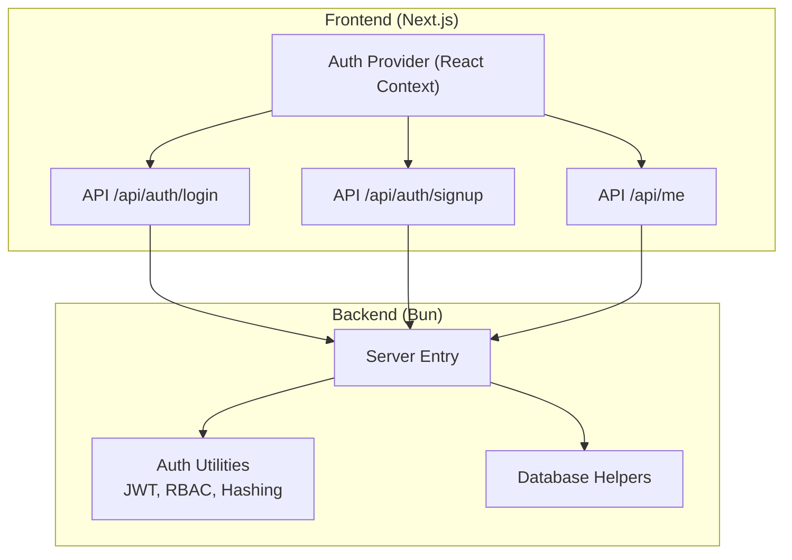
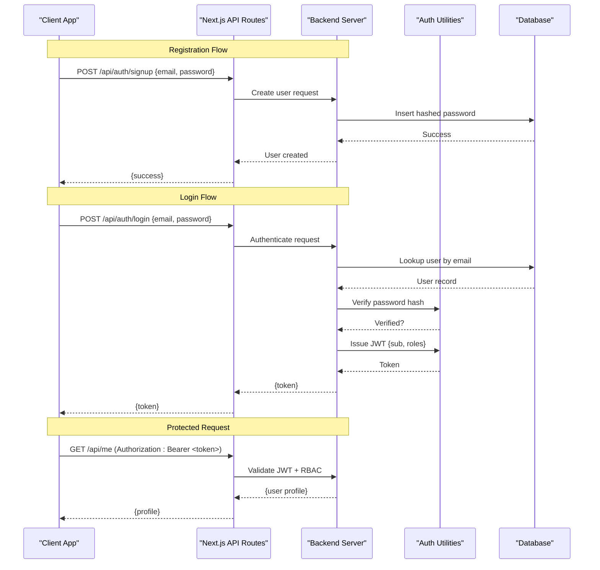
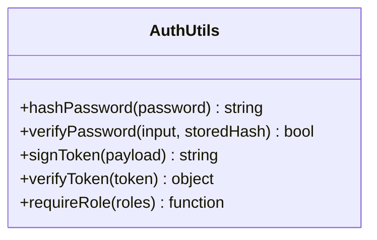
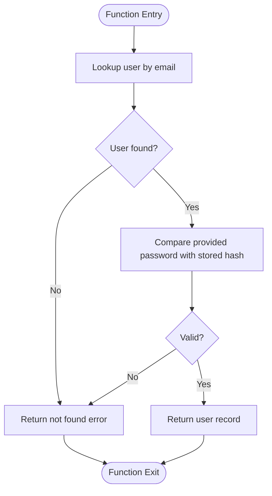
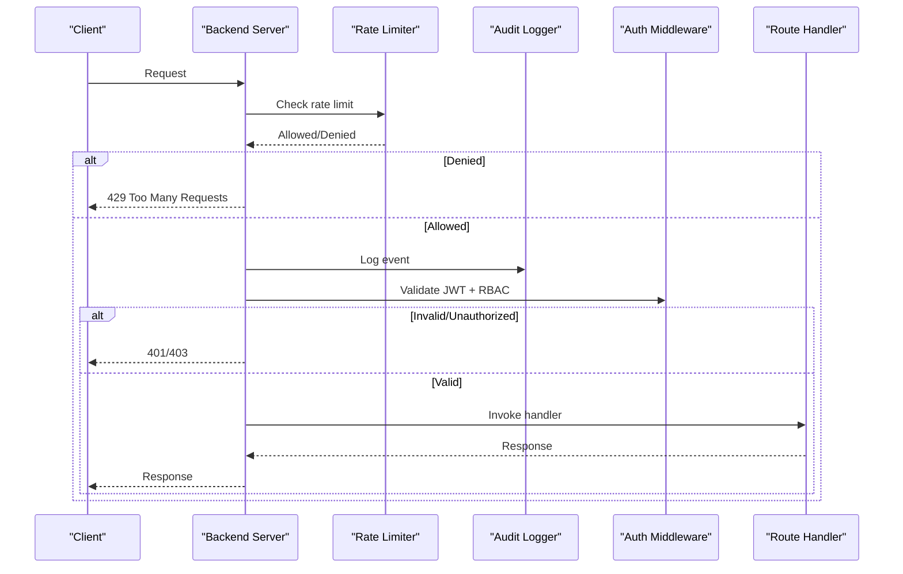
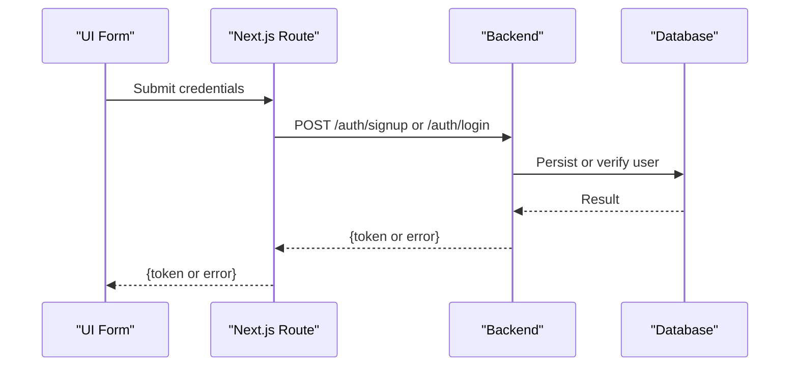
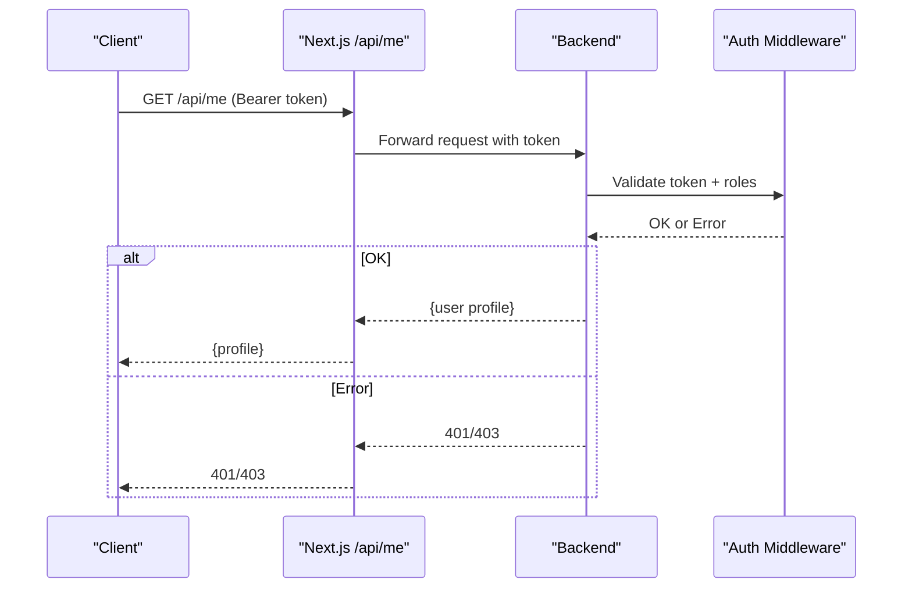
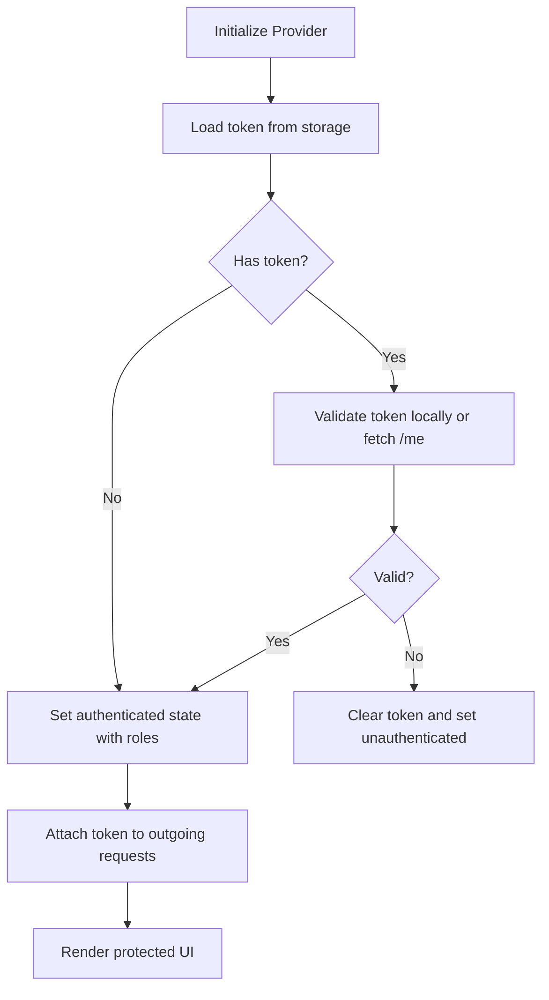
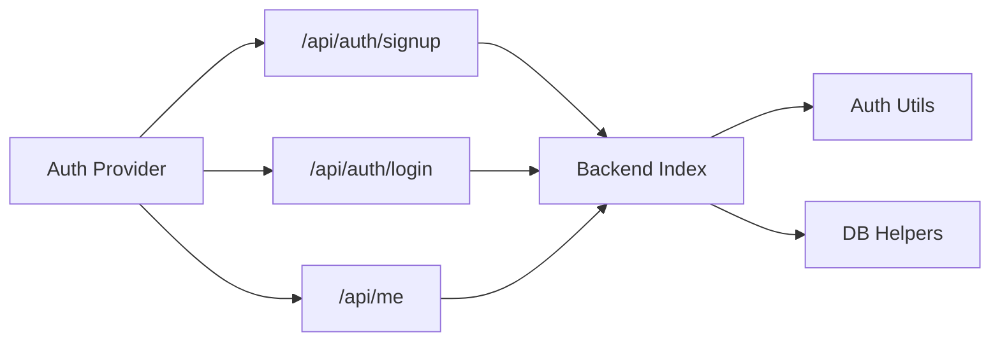

# Authentication & Authorization

<cite>
**Referenced Files in This Document**
- [backend/src/auth.ts](file://backend/src/auth.ts)
- [backend/src/index.ts](file://backend/src/index.ts)
- [backend/src/db.ts](file://backend/src/db.ts)
- [src/app/api/auth/login/route.ts](file://src/app/api/auth/login/route.ts)
- [src/app/api/auth/signup/route.ts](file://src/app/api/auth/signup/route.ts)
- [src/app/api/me/route.ts](file://src/app/api/me/route.ts)
- [src/components/auth-provider.tsx](file://src/components/auth-provider.tsx)
</cite>

## Table of Contents
1. [Introduction](#introduction)
2. [Project Structure](#project-structure)
3. [Core Components](#core-components)
4. [Architecture Overview](#architecture-overview)
5. [Detailed Component Analysis](#detailed-component-analysis)
6. [Dependency Analysis](#dependency-analysis)
7. [Performance Considerations](#performance-considerations)
8. [Troubleshooting Guide](#troubleshooting-guide)
9. [Conclusion](#conclusion)

## Introduction
This document explains the authentication and authorization system implemented across the Next.js frontend and a small backend service. It covers JWT-based authentication, user registration and login flows, session management on the client side, role-based access control (RBAC), password hashing, token refresh mechanisms, middleware for protecting API routes, permission checks, audit logging, rate limiting, and brute-force protection. The goal is to provide both high-level understanding and code-level traceability for developers and operators.

## Project Structure
The authentication system spans two layers:
- Backend (Bun/TypeScript): Provides core auth utilities, database helpers, and server entry points.
- Frontend (Next.js App Router): Implements API route handlers for signup/login, an authenticated “me” endpoint, and a React context provider for managing tokens and roles.

**Diagram sources**
- [backend/src/index.ts](file://backend/src/index.ts)
- [backend/src/auth.ts](file://backend/src/auth.ts)
- [backend/src/db.ts](file://backend/src/db.ts)
- [src/app/api/auth/login/route.ts](file://src/app/api/auth/login/route.ts)
- [src/app/api/auth/signup/route.ts](file://src/app/api/auth/signup/route.ts)
- [src/app/api/me/route.ts](file://src/app/api/me/route.ts)
- [src/components/auth-provider.tsx](file://src/components/auth-provider.tsx)

**Section sources**
- [backend/src/index.ts](file://backend/src/index.ts)
- [backend/src/auth.ts](file://backend/src/auth.ts)
- [backend/src/db.ts](file://backend/src/db.ts)
- [src/app/api/auth/login/route.ts](file://src/app/api/auth/login/route.ts)
- [src/app/api/auth/signup/route.ts](file://src/app/api/auth/signup/route.ts)
- [src/app/api/me/route.ts](file://src/app/api/me/route.ts)
- [src/components/auth-provider.tsx](file://src/components/auth-provider.tsx)

## Core Components
- Auth utilities (backend): Centralizes JWT creation/validation, RBAC checks, and password hashing.
- Database helpers (backend): Encapsulates user lookup and persistence operations used by auth flows.
- Server entry (backend): Wires up routes and applies middleware such as rate limiting and audit logging.
- Frontend API routes: Implement signup and login endpoints that call backend services and return tokens.
- Authenticated “me” endpoint: Validates JWT and returns current user profile.
- Client-side auth provider: Manages token storage, injection into requests, and role-based UI logic.

Key responsibilities:
- Password hashing with a secure algorithm before persisting credentials.
- JWT issuance upon successful login; validation on protected routes.
- Role-based access control enforced at API boundaries.
- Rate limiting and brute-force protections around sensitive endpoints.
- Audit logging for security-sensitive actions.

**Section sources**
- [backend/src/auth.ts](file://backend/src/auth.ts)
- [backend/src/db.ts](file://backend/src/db.ts)
- [backend/src/index.ts](file://backend/src/index.ts)
- [src/app/api/auth/login/route.ts](file://src/app/api/auth/login/route.ts)
- [src/app/api/auth/signup/route.ts](file://src/app/api/auth/signup/route.ts)
- [src/app/api/me/route.ts](file://src/app/api/me/route.ts)
- [src/components/auth-provider.tsx](file://src/components/auth-provider.tsx)

## Architecture Overview
The system follows a stateless JWT model:
- On signup, the client sends credentials; the backend hashes the password and persists the user.
- On login, the backend verifies credentials and issues a signed JWT containing user identity and roles.
- Subsequent requests include the JWT in the Authorization header; the backend validates it and enforces RBAC.
- The frontend stores the token securely and attaches it to outgoing requests via the auth provider.

**Diagram sources**
- [src/app/api/auth/signup/route.ts](file://src/app/api/auth/signup/route.ts)
- [src/app/api/auth/login/route.ts](file://src/app/api/auth/login/route.ts)
- [src/app/api/me/route.ts](file://src/app/api/me/route.ts)
- [backend/src/index.ts](file://backend/src/index.ts)
- [backend/src/auth.ts](file://backend/src/auth.ts)
- [backend/src/db.ts](file://backend/src/db.ts)

## Detailed Component Analysis

### Backend Auth Utilities
Responsibilities:
- Password hashing and verification using a strong, salted algorithm.
- JWT signing and verification with short-lived tokens and optional refresh flow.
- RBAC enforcement functions to check roles against resource permissions.
- Utility functions for extracting and validating bearer tokens from requests.

Security considerations:
- Use a modern, memory-hard hashing function for passwords.
- Store only hashed passwords; never log or expose secrets.
- Sign JWTs with a strong secret or asymmetric key; validate audience and issuer if applicable.
- Keep tokens short-lived; implement refresh tokens where needed.

**Diagram sources**
- [backend/src/auth.ts](file://backend/src/auth.ts)

**Section sources**
- [backend/src/auth.ts](file://backend/src/auth.ts)

### Database Helpers
Responsibilities:
- User lookup by email.
- Creating new users with hashed passwords.
- Optional: fetching user roles and metadata.

Data integrity:
- Enforce unique constraints on email.
- Ensure password fields are never returned in queries.

**Diagram sources**
- [backend/src/db.ts](file://backend/src/db.ts)

**Section sources**
- [backend/src/db.ts](file://backend/src/db.ts)

### Server Entry and Middleware
Responsibilities:
- Register API routes for auth and protected resources.
- Apply global middleware:
  - Rate limiting for sensitive endpoints (signup, login).
  - Audit logging for authentication events.
  - CORS and content-type handling.
  - JWT validation and RBAC enforcement for protected routes.

**Diagram sources**
- [backend/src/index.ts](file://backend/src/index.ts)
- [backend/src/auth.ts](file://backend/src/auth.ts)

**Section sources**
- [backend/src/index.ts](file://backend/src/index.ts)
- [backend/src/auth.ts](file://backend/src/auth.ts)

### Frontend API Routes (Signup/Login)
Responsibilities:
- Accept credentials from the client.
- Call backend endpoints to create users or authenticate.
- Return tokens and handle errors consistently.

Security practices:
- Validate input on the client and server.
- Do not store plaintext passwords.
- Handle errors without leaking sensitive details.

**Diagram sources**
- [src/app/api/auth/signup/route.ts](file://src/app/api/auth/signup/route.ts)
- [src/app/api/auth/login/route.ts](file://src/app/api/auth/login/route.ts)
- [backend/src/index.ts](file://backend/src/index.ts)

**Section sources**
- [src/app/api/auth/signup/route.ts](file://src/app/api/auth/signup/route.ts)
- [src/app/api/auth/login/route.ts](file://src/app/api/auth/login/route.ts)

### Authenticated “Me” Endpoint
Responsibilities:
- Require a valid JWT in the Authorization header.
- Decode payload, enforce RBAC if necessary.
- Return minimal user profile data.

**Diagram sources**
- [src/app/api/me/route.ts](file://src/app/api/me/route.ts)
- [backend/src/auth.ts](file://backend/src/auth.ts)

**Section sources**
- [src/app/api/me/route.ts](file://src/app/api/me/route.ts)
- [backend/src/auth.ts](file://backend/src/auth.ts)

### Client-Side Auth Provider
Responsibilities:
- Manage token lifecycle (store, retrieve, attach to requests).
- Provide current user and roles to components.
- Handle token refresh when supported.

Storage strategy:
- Prefer httpOnly cookies for tokens when possible.
- If using localStorage, ensure XSS mitigations and avoid storing secrets longer than necessary.

**Diagram sources**
- [src/components/auth-provider.tsx](file://src/components/auth-provider.tsx)
- [src/app/api/me/route.ts](file://src/app/api/me/route.ts)

**Section sources**
- [src/components/auth-provider.tsx](file://src/components/auth-provider.tsx)
- [src/app/api/me/route.ts](file://src/app/api/me/route.ts)

## Dependency Analysis
High-level dependencies:
- Frontend API routes depend on backend endpoints and rely on the auth provider for token handling.
- Backend server depends on auth utilities and database helpers.
- Auth utilities encapsulate cryptographic operations and RBAC logic.

**Diagram sources**
- [src/app/api/auth/signup/route.ts](file://src/app/api/auth/signup/route.ts)
- [src/app/api/auth/login/route.ts](file://src/app/api/auth/login/route.ts)
- [src/app/api/me/route.ts](file://src/app/api/me/route.ts)
- [backend/src/index.ts](file://backend/src/index.ts)
- [backend/src/auth.ts](file://backend/src/auth.ts)
- [backend/src/db.ts](file://backend/src/db.ts)
- [src/components/auth-provider.tsx](file://src/components/auth-provider.tsx)

**Section sources**
- [src/app/api/auth/signup/route.ts](file://src/app/api/auth/signup/route.ts)
- [src/app/api/auth/login/route.ts](file://src/app/api/auth/login/route.ts)
- [src/app/api/me/route.ts](file://src/app/api/me/route.ts)
- [backend/src/index.ts](file://backend/src/index.ts)
- [backend/src/auth.ts](file://backend/src/auth.ts)
- [backend/src/db.ts](file://backend/src/db.ts)
- [src/components/auth-provider.tsx](file://src/components/auth-provider.tsx)

## Performance Considerations
- Keep JWT payloads small to reduce bandwidth and parsing overhead.
- Cache user profiles after successful validation where appropriate.
- Use efficient password hashing parameters tuned for your environment.
- Apply rate limiting close to the edge to mitigate abuse early.
- Avoid synchronous I/O in hot paths; prefer asynchronous database calls.

[No sources needed since this section provides general guidance]

## Troubleshooting Guide
Common issues and resolutions:
- Invalid or expired token:
  - Ensure the Authorization header uses the correct scheme and includes a valid token.
  - Refresh tokens if supported; otherwise prompt re-login.
- 401 Unauthorized:
  - Verify token signature and expiration; confirm server clock skew is handled.
- 403 Forbidden:
  - Check RBAC configuration; ensure the user’s roles include required permissions.
- 429 Too Many Requests:
  - Respect retry-after headers; back off exponentially.
- Password verification failures:
  - Confirm hashing algorithm and parameters match between signup and login.

Operational tips:
- Enable detailed audit logs for failed authentications and privilege escalations.
- Monitor rate limiter thresholds and adjust based on traffic patterns.
- Rotate signing keys periodically and invalidate existing tokens when rotating secrets.

**Section sources**
- [backend/src/auth.ts](file://backend/src/auth.ts)
- [backend/src/index.ts](file://backend/src/index.ts)

## Conclusion
The system implements a robust, stateless JWT-based authentication flow with clear separation of concerns between frontend and backend. Security is reinforced through password hashing, token validation, RBAC, rate limiting, and audit logging. By following the recommended best practices—short-lived tokens, secure storage, strict input validation, and comprehensive logging—the application can maintain strong security posture while remaining performant and maintainable.

[No sources needed since this section summarizes without analyzing specific files]