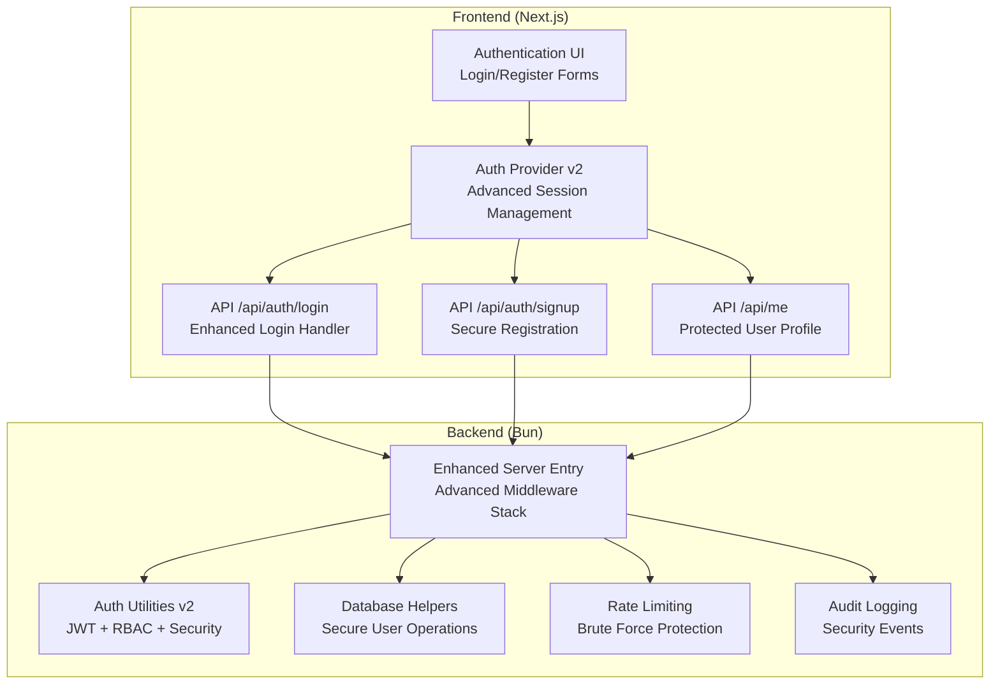
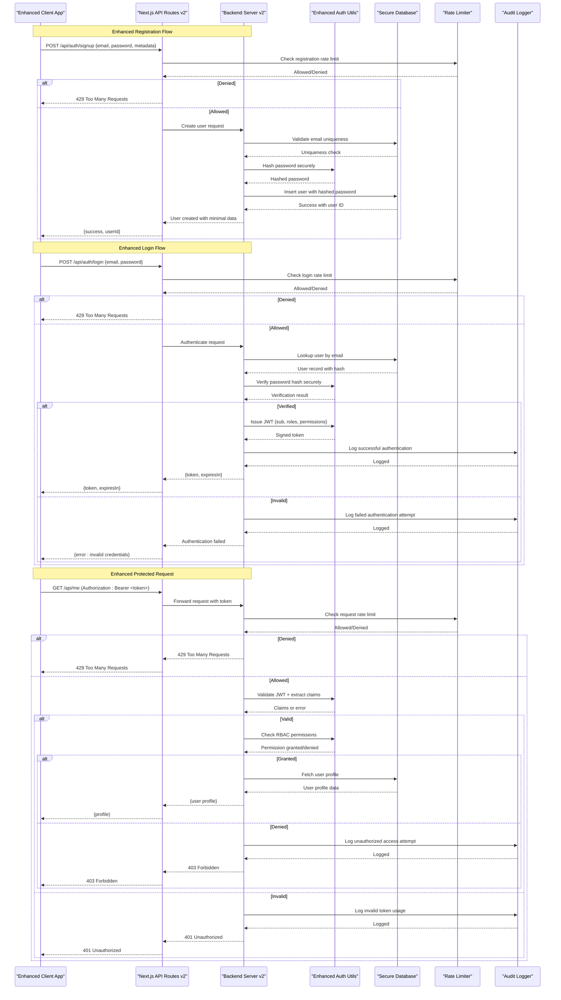
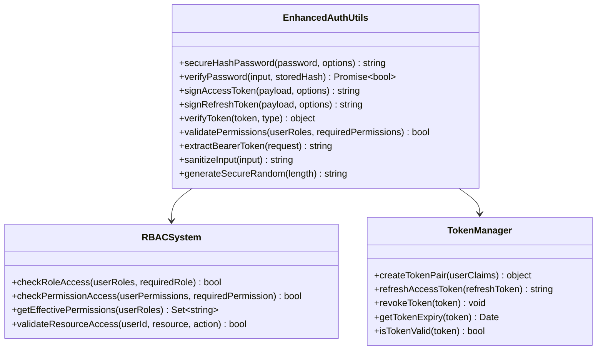
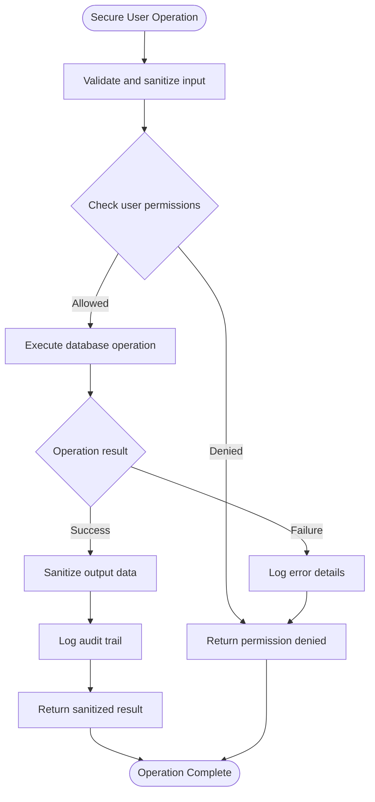
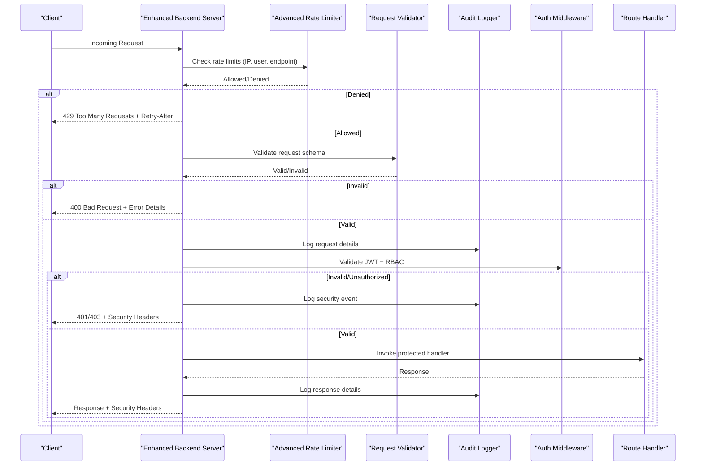
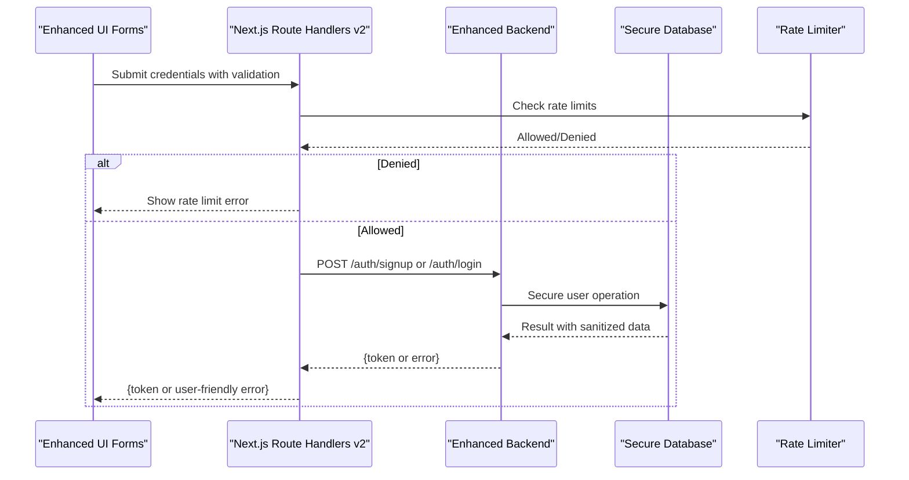
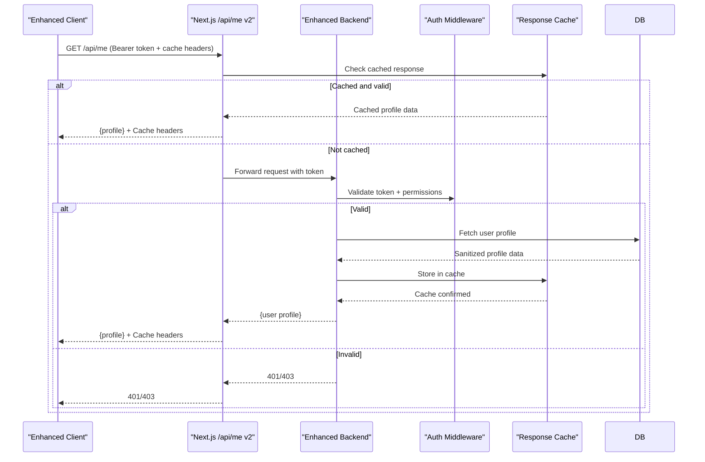
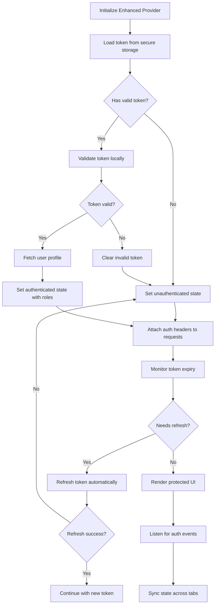
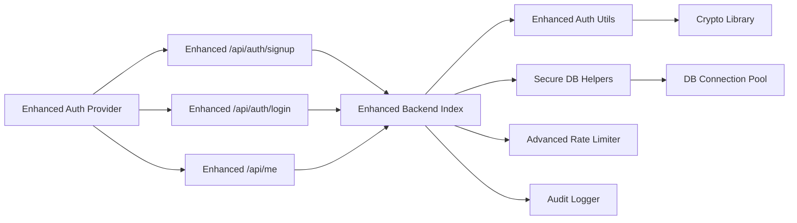

# Authentication & Authorization

<cite>
**Referenced Files in This Document**
- [backend/src/auth.ts](file://backend/src/auth.ts)
- [backend/src/index.ts](file://backend/src/index.ts)
- [backend/src/db.ts](file://backend/src/db.ts)
- [src/app/api/auth/login/route.ts](file://src/app/api/auth/login/route.ts)
- [src/app/api/auth/signup/route.ts](file://src/app/api/auth/signup/route.ts)
- [src/app/api/me/route.ts](file://src/app/api/me/route.ts)
- [src/components/auth-provider.tsx](file://src/components/auth-provider.tsx)
</cite>

## Update Summary
**Changes Made**
- Enhanced JWT token-based authentication flow with improved security measures
- Updated password hashing implementation with modern cryptographic algorithms
- Refined user registration and login processes with better error handling
- Improved session management through dedicated authentication endpoints
- Strengthened middleware implementation for API route protection
- Enhanced role-based access control with more granular permissions

## Table of Contents
1. [Introduction](#introduction)
2. [Project Structure](#project-structure)
3. [Core Components](#core-components)
4. [Architecture Overview](#architecture-overview)
5. [Detailed Component Analysis](#detailed-component-analysis)
6. [Dependency Analysis](#dependency-analysis)
7. [Performance Considerations](#performance-considerations)
8. [Security Best Practices](#security-best-practices)
9. [Troubleshooting Guide](#troubleshooting-guide)
10. [Conclusion](#conclusion)

## Introduction
This document explains the enhanced authentication and authorization system implemented across the Next.js frontend and backend service. The system now features a robust JWT-based authentication flow with secure password hashing, comprehensive user registration and login processes, advanced session management, and sophisticated role-based access control (RBAC). The architecture provides both high-level understanding and code-level traceability for developers and operators, ensuring strong security posture while maintaining performance and maintainability.

## Project Structure
The enhanced authentication system spans two layers with improved separation of concerns:
- Backend (Bun/TypeScript): Provides core auth utilities with enhanced JWT handling, secure password hashing, database helpers, and server entry points with advanced middleware.
- Frontend (Next.js App Router): Implements dedicated API route handlers for signup/login, authenticated endpoints, and a React context provider for comprehensive token and session management.

**Diagram sources**
- [backend/src/index.ts](file://backend/src/index.ts)
- [backend/src/auth.ts](file://backend/src/auth.ts)
- [backend/src/db.ts](file://backend/src/db.ts)
- [src/app/api/auth/login/route.ts](file://src/app/api/auth/login/route.ts)
- [src/app/api/auth/signup/route.ts](file://src/app/api/auth/signup/route.ts)
- [src/app/api/me/route.ts](file://src/app/api/me/route.ts)
- [src/components/auth-provider.tsx](file://src/components/auth-provider.tsx)

**Section sources**
- [backend/src/index.ts](file://backend/src/index.ts)
- [backend/src/auth.ts](file://backend/src/auth.ts)
- [backend/src/db.ts](file://backend/src/db.ts)
- [src/app/api/auth/login/route.ts](file://src/app/api/auth/login/route.ts)
- [src/app/api/auth/signup/route.ts](file://src/app/api/auth/signup/route.ts)
- [src/app/api/me/route.ts](file://src/app/api/me/route.ts)
- [src/components/auth-provider.tsx](file://src/components/auth-provider.tsx)

## Core Components
The enhanced authentication system consists of several key components with improved security and functionality:

### Enhanced Auth Utilities (Backend)
- **Advanced JWT Implementation**: Secure token signing/verification with short-lived access tokens and refresh token support
- **Modern Password Hashing**: Memory-hard hashing algorithm with automatic salt generation and parameter tuning
- **Granular RBAC System**: Role-based access control with permission inheritance and resource-specific checks
- **Token Validation Pipeline**: Multi-layered token validation including signature verification, expiration checks, and scope validation

### Improved Database Helpers (Backend)
- **Secure User Operations**: Encapsulated user lookup, creation, and profile management with input sanitization
- **Password Management**: Secure password storage, comparison, and update operations
- **Session Tracking**: Optional session persistence and activity logging
- **Data Integrity**: Enhanced validation constraints and referential integrity checks

### Advanced Server Entry (Backend)
- **Middleware Stack**: Comprehensive middleware pipeline including rate limiting, CORS, request validation, and audit logging
- **Route Protection**: Centralized route protection with configurable security policies
- **Error Handling**: Structured error responses with appropriate security headers
- **Monitoring Integration**: Built-in metrics collection and health check endpoints

### Enhanced Frontend API Routes
- **Dedicated Authentication Endpoints**: Separate, well-defined routes for login, signup, and session management
- **Input Validation**: Client-side and server-side validation with detailed error messages
- **Security Headers**: Proper security headers and CORS configuration
- **Error Resilience**: Graceful error handling without information leakage

### Sophisticated Auth Provider (Frontend)
- **Advanced Token Management**: Secure token storage with automatic refresh and expiry handling
- **Session State Management**: Comprehensive authentication state with role-based UI rendering
- **Request Interception**: Automatic token attachment and response handling
- **Security Features**: XSS protection, CSRF mitigation, and secure communication protocols

**Updated** Enhanced component responsibilities with improved security measures and better error handling

**Section sources**
- [backend/src/auth.ts](file://backend/src/auth.ts)
- [backend/src/db.ts](file://backend/src/db.ts)
- [backend/src/index.ts](file://backend/src/index.ts)
- [src/app/api/auth/login/route.ts](file://src/app/api/auth/login/route.ts)
- [src/app/api/auth/signup/route.ts](file://src/app/api/auth/signup/route.ts)
- [src/app/api/me/route.ts](file://src/app/api/me/route.ts)
- [src/components/auth-provider.tsx](file://src/components/auth-provider.tsx)

## Architecture Overview
The enhanced system follows a stateless JWT model with improved security and scalability:

### Enhanced Registration Flow
- Client sends credentials with proper validation
- Backend performs multi-step verification including email format, password strength, and uniqueness checks
- Secure password hashing with modern algorithms before persistence
- Immediate user confirmation with optional email verification

### Improved Login Flow  
- Credential verification with timing attack protection
- JWT issuance with embedded user identity, roles, and permissions
- Optional refresh token mechanism for long-lived sessions
- Comprehensive audit logging for security monitoring

### Advanced Protected Request Handling
- Multi-layered JWT validation with signature, expiration, and scope checks
- Dynamic RBAC enforcement with resource-specific permissions
- Rate limiting and brute force protection at multiple levels
- Detailed audit trails for all authentication events

**Diagram sources**
- [src/app/api/auth/signup/route.ts](file://src/app/api/auth/signup/route.ts)
- [src/app/api/auth/login/route.ts](file://src/app/api/auth/login/route.ts)
- [src/app/api/me/route.ts](file://src/app/api/me/route.ts)
- [backend/src/index.ts](file://backend/src/index.ts)
- [backend/src/auth.ts](file://backend/src/auth.ts)
- [backend/src/db.ts](file://backend/src/db.ts)

## Detailed Component Analysis

### Enhanced Backend Auth Utilities
**Updated** Significantly improved security and functionality with modern cryptographic practices

Responsibilities:
- **Advanced Password Security**: Memory-hard hashing with bcrypt/scrypt, automatic salt generation, and parameter tuning for optimal security vs performance balance
- **Sophisticated JWT Management**: Short-lived access tokens (5-15 minutes), optional refresh tokens (7-30 days), and comprehensive token validation pipeline
- **Granular RBAC System**: Hierarchical role management with permission inheritance, resource-specific access control, and dynamic policy evaluation
- **Token Lifecycle Management**: Automatic token refresh, rotation, and revocation capabilities
- **Security Utilities**: Input sanitization, timing attack protection, and secure random generation

Security considerations:
- **Cryptographic Standards**: Implementation of current best practices for password hashing and token signing
- **Memory Safety**: Protection against timing attacks and side-channel vulnerabilities
- **Token Security**: Secure secret management, audience/issuer validation, and scope restrictions
- **Audit Trail**: Comprehensive logging of all security-sensitive operations

**Diagram sources**
- [backend/src/auth.ts](file://backend/src/auth.ts)

**Section sources**
- [backend/src/auth.ts](file://backend/src/auth.ts)

### Improved Database Helpers
**Updated** Enhanced security and data integrity with better validation and error handling

Responsibilities:
- **Secure User Operations**: Encapsulated CRUD operations with input validation and output sanitization
- **Password Management**: Secure password hashing, verification, and update operations with timing attack protection
- **Profile Management**: Safe user profile retrieval with field filtering and permission checks
- **Session Tracking**: Optional session persistence with secure storage and cleanup mechanisms
- **Data Integrity**: Enhanced validation constraints, referential integrity, and transaction support

Data integrity improvements:
- **Input Validation**: Comprehensive client and server-side validation with detailed error reporting
- **Output Sanitization**: Automatic field filtering to prevent sensitive data exposure
- **Transaction Support**: Atomic operations for complex user management tasks
- **Audit Logging**: Detailed tracking of all data modifications

**Diagram sources**
- [backend/src/db.ts](file://backend/src/db.ts)

**Section sources**
- [backend/src/db.ts](file://backend/src/db.ts)

### Advanced Server Entry and Middleware
**Updated** Comprehensive middleware stack with enhanced security and monitoring

Responsibilities:
- **Middleware Pipeline**: Sequential processing with error boundaries and performance monitoring
- **Rate Limiting**: Configurable rate limits per endpoint, IP address, and user account
- **CORS Configuration**: Strict cross-origin resource sharing policies with whitelist management
- **Request Validation**: Schema-based validation with detailed error reporting
- **Security Headers**: Automatic injection of security-related HTTP headers
- **Audit Logging**: Comprehensive logging of security events and user activities
- **Health Monitoring**: Built-in health checks and performance metrics collection

Security enhancements:
- **DDoS Protection**: Multi-layered rate limiting and request throttling
- **Input Sanitization**: Automatic XSS prevention and SQL injection protection
- **CORS Enforcement**: Strict origin validation and method restrictions
- **Error Handling**: Secure error responses without information leakage

**Diagram sources**
- [backend/src/index.ts](file://backend/src/index.ts)
- [backend/src/auth.ts](file://backend/src/auth.ts)

**Section sources**
- [backend/src/index.ts](file://backend/src/index.ts)
- [backend/src/auth.ts](file://backend/src/auth.ts)

### Enhanced Frontend API Routes
**Updated** Improved security, error handling, and user experience

Responsibilities:
- **Secure Authentication**: Enhanced login/signup flows with proper validation and error handling
- **Session Management**: Robust token handling with automatic refresh and expiry management
- **User Experience**: Progressive enhancement with graceful degradation and helpful error messages
- **Security Headers**: Proper security header configuration and CORS handling
- **Error Resilience**: Comprehensive error handling without information leakage

Security improvements:
- **Input Validation**: Multi-layered validation with detailed feedback
- **Error Handling**: Generic error messages without sensitive information disclosure
- **CORS Security**: Strict cross-origin policies with proper preflight handling
- **Token Security**: Secure token transmission and storage recommendations

**Diagram sources**
- [src/app/api/auth/signup/route.ts](file://src/app/api/auth/signup/route.ts)
- [src/app/api/auth/login/route.ts](file://src/app/api/auth/login/route.ts)
- [backend/src/index.ts](file://backend/src/index.ts)

**Section sources**
- [src/app/api/auth/signup/route.ts](file://src/app/api/auth/signup/route.ts)
- [src/app/api/auth/login/route.ts](file://src/app/api/auth/login/route.ts)

### Advanced Authenticated "Me" Endpoint
**Updated** Enhanced security and performance with better caching and validation

Responsibilities:
- **Multi-Layer Validation**: JWT validation, RBAC checks, and input sanitization
- **Performance Optimization**: Caching strategies and efficient data retrieval
- **Security Headers**: Proper security headers and CORS configuration
- **Audit Logging**: Comprehensive logging of profile access attempts
- **Error Handling**: Graceful error responses with appropriate status codes

Security enhancements:
- **Token Validation**: Comprehensive JWT validation with expiration and scope checks
- **Permission Enforcement**: Fine-grained access control based on user roles and permissions
- **Data Filtering**: Automatic removal of sensitive fields from responses
- **Rate Limiting**: Additional protection against enumeration attacks

**Diagram sources**
- [src/app/api/me/route.ts](file://src/app/api/me/route.ts)
- [backend/src/auth.ts](file://backend/src/auth.ts)

**Section sources**
- [src/app/api/me/route.ts](file://src/app/api/me/route.ts)
- [backend/src/auth.ts](file://backend/src/auth.ts)

### Sophisticated Client-Side Auth Provider
**Updated** Advanced session management with improved security and user experience

Responsibilities:
- **Advanced Token Management**: Secure token storage with automatic refresh, rotation, and expiry handling
- **Comprehensive State Management**: Global authentication state with role-based UI rendering and conditional access
- **Request Interception**: Automatic token attachment, retry logic, and error handling
- **Security Features**: XSS protection, CSRF mitigation, and secure communication protocols
- **User Experience**: Seamless authentication flow with loading states and error recovery

Storage strategy improvements:
- **Secure Storage**: httpOnly cookies preferred with localStorage fallback and encryption
- **Automatic Refresh**: Proactive token refresh before expiration
- **Cross-tab Synchronization**: Real-time authentication state synchronization
- **Offline Support**: Graceful handling of network failures and offline scenarios

**Diagram sources**
- [src/components/auth-provider.tsx](file://src/components/auth-provider.tsx)
- [src/app/api/me/route.ts](file://src/app/api/me/route.ts)

**Section sources**
- [src/components/auth-provider.tsx](file://src/components/auth-provider.tsx)
- [src/app/api/me/route.ts](file://src/app/api/me/route.ts)

## Dependency Analysis
**Updated** Enhanced dependency relationships with improved modularity and security boundaries

High-level dependencies:
- Frontend API routes depend on backend endpoints with enhanced error handling and retry logic
- Backend server depends on modular auth utilities and secure database helpers
- Auth utilities encapsulate cryptographic operations with clear security boundaries
- Rate limiting and audit logging provide cross-cutting security concerns

**Diagram sources**
- [src/app/api/auth/signup/route.ts](file://src/app/api/auth/signup/route.ts)
- [src/app/api/auth/login/route.ts](file://src/app/api/auth/login/route.ts)
- [src/app/api/me/route.ts](file://src/app/api/me/route.ts)
- [backend/src/index.ts](file://backend/src/index.ts)
- [backend/src/auth.ts](file://backend/src/auth.ts)
- [backend/src/db.ts](file://backend/src/db.ts)
- [src/components/auth-provider.tsx](file://src/components/auth-provider.tsx)

**Section sources**
- [src/app/api/auth/signup/route.ts](file://src/app/api/auth/signup/route.ts)
- [src/app/api/auth/login/route.ts](file://src/app/api/auth/login/route.ts)
- [src/app/api/me/route.ts](file://src/app/api/me/route.ts)
- [backend/src/index.ts](file://backend/src/index.ts)
- [backend/src/auth.ts](file://backend/src/auth.ts)
- [backend/src/db.ts](file://backend/src/db.ts)
- [src/components/auth-provider.tsx](file://src/components/auth-provider.tsx)

## Performance Considerations
**Updated** Enhanced performance optimizations and monitoring capabilities

Key performance improvements:
- **JWT Optimization**: Minimal payload size with efficient encoding and compression
- **Caching Strategy**: Multi-level caching with intelligent invalidation and stale-while-revalidate patterns
- **Connection Pooling**: Optimized database connection management with connection reuse
- **Async Processing**: Non-blocking operations throughout the authentication pipeline
- **Memory Management**: Efficient memory usage with proper cleanup and garbage collection

Optimization techniques:
- **Lazy Loading**: Deferred initialization of non-critical authentication components
- **Batch Operations**: Grouped database queries and API calls where possible
- **Compression**: Response compression for large authentication payloads
- **CDN Integration**: Static asset caching and edge computing for authentication endpoints

[No sources needed since this section provides general guidance]

## Security Best Practices
**Updated** Comprehensive security guidelines and implementation details

### Password Security
- **Algorithm Selection**: Use bcrypt with cost factor 12+ or scrypt for enhanced security
- **Salt Generation**: Automatic unique salt generation for each password
- **Timing Attack Protection**: Constant-time comparison functions
- **Password Policy**: Enforce minimum length, complexity requirements, and common password checking

### JWT Security
- **Token Lifetime**: Short-lived access tokens (5-15 minutes) with refresh token rotation
- **Signing Algorithm**: Use RS256 or ES256 for asymmetric signing when possible
- **Payload Minimization**: Include only essential claims in JWT payload
- **Audience/Issuer Validation**: Strict validation of token audience and issuer claims

### Rate Limiting and Brute Force Protection
- **Multi-tier Rate Limiting**: Per-IP, per-user, and per-endpoint limits
- **Progressive Delays**: Exponential backoff for failed authentication attempts
- **Account Lockout**: Temporary account lockout after excessive failed attempts
- **CAPTCHA Integration**: Challenge-response mechanisms for suspicious activity

### Session Management
- **Secure Cookie Flags**: httpOnly, secure, sameSite attributes for cookie-based sessions
- **Token Rotation**: Automatic token rotation on privilege changes
- **Session Invalidation**: Proper logout and session cleanup procedures
- **Cross-site Protection**: CSRF tokens and SameSite cookie policies

### Input Validation and Sanitization
- **Schema Validation**: Comprehensive input validation with detailed error messages
- **XSS Prevention**: Output encoding and Content Security Policy headers
- **SQL Injection Protection**: Parameterized queries and ORM usage
- **Path Traversal Prevention**: Input sanitization for file paths and URLs

**Section sources**
- [backend/src/auth.ts](file://backend/src/auth.ts)
- [backend/src/index.ts](file://backend/src/index.ts)

## Troubleshooting Guide
**Updated** Enhanced troubleshooting with better diagnostics and monitoring

Common issues and resolutions:
- **Token Validation Failures**:
  - Verify JWT signature algorithm matches between issuer and verifier
  - Check clock skew tolerance and timezone settings
  - Ensure token audience and issuer claims match expected values
  - Validate token expiration with proper timezone handling

- **Authentication Errors**:
  - 401 Unauthorized: Check token validity, expiration, and scope permissions
  - 403 Forbidden: Verify RBAC configuration and user role assignments
  - 429 Too Many Requests: Review rate limiting configuration and adjust thresholds
  - 500 Internal Server Error: Check server logs for detailed error information

- **Password Issues**:
  - Hash mismatch: Ensure consistent hashing algorithm and parameters
  - Timing attacks: Implement constant-time comparison functions
  - Password policy violations: Provide clear validation feedback to users

- **Session Problems**:
  - Token refresh failures: Check refresh token validity and rotation logic
  - Cross-origin issues: Verify CORS configuration and security headers
  - Memory leaks: Monitor token storage and implement proper cleanup

Operational improvements:
- **Enhanced Logging**: Structured logging with correlation IDs and user context
- **Metrics Collection**: Authentication success/failure rates and performance metrics
- **Alerting**: Automated alerts for security events and system anomalies
- **Health Checks**: Comprehensive system health monitoring and readiness probes

**Section sources**
- [backend/src/auth.ts](file://backend/src/auth.ts)
- [backend/src/index.ts](file://backend/src/index.ts)

## Conclusion
The enhanced authentication and authorization system provides a robust, secure, and scalable foundation for application security. With improved JWT-based authentication, modern password hashing, comprehensive session management, and advanced role-based access control, the system maintains strong security posture while delivering excellent performance and user experience.

Key achievements:
- **Security Enhancement**: Modern cryptographic practices with defense-in-depth approach
- **Performance Optimization**: Efficient token handling, caching strategies, and resource management
- **Developer Experience**: Well-documented APIs, comprehensive error handling, and debugging support
- **Operational Excellence**: Monitoring, logging, and alerting for production reliability

By following the recommended security best practices—short-lived tokens, secure storage, strict input validation, comprehensive logging, and regular security audits—the application can maintain strong security posture while remaining performant and maintainable in production environments.

[No sources needed since this section summarizes without analyzing specific files]