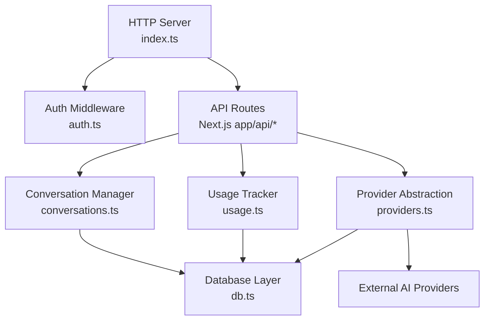
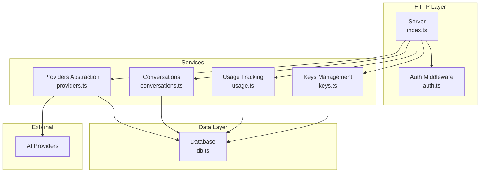
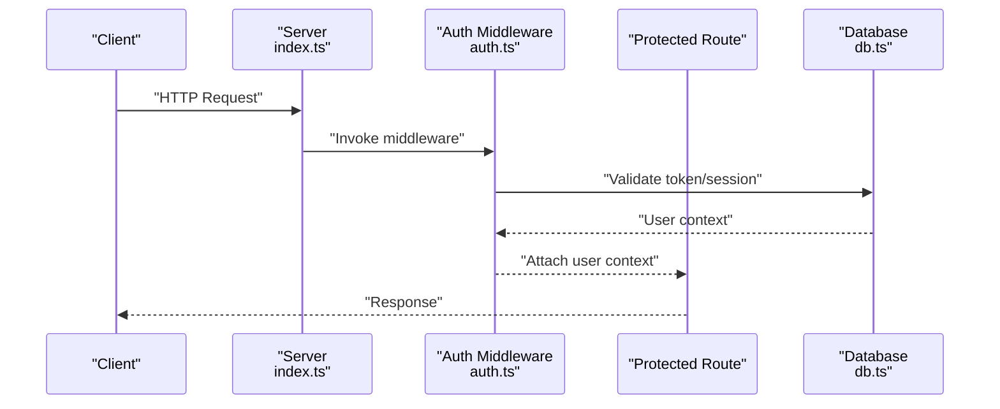
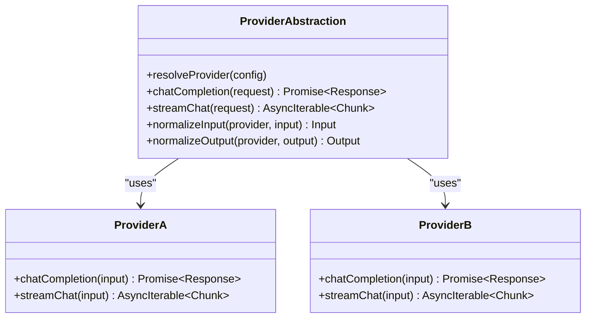
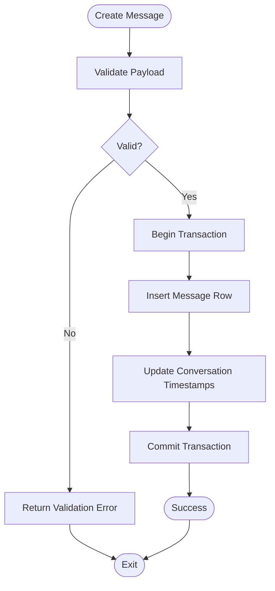
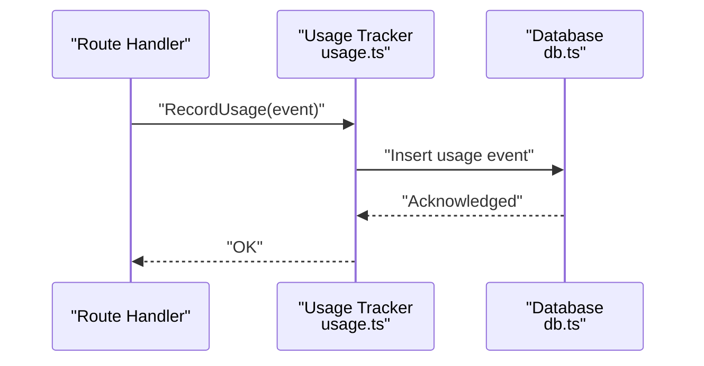
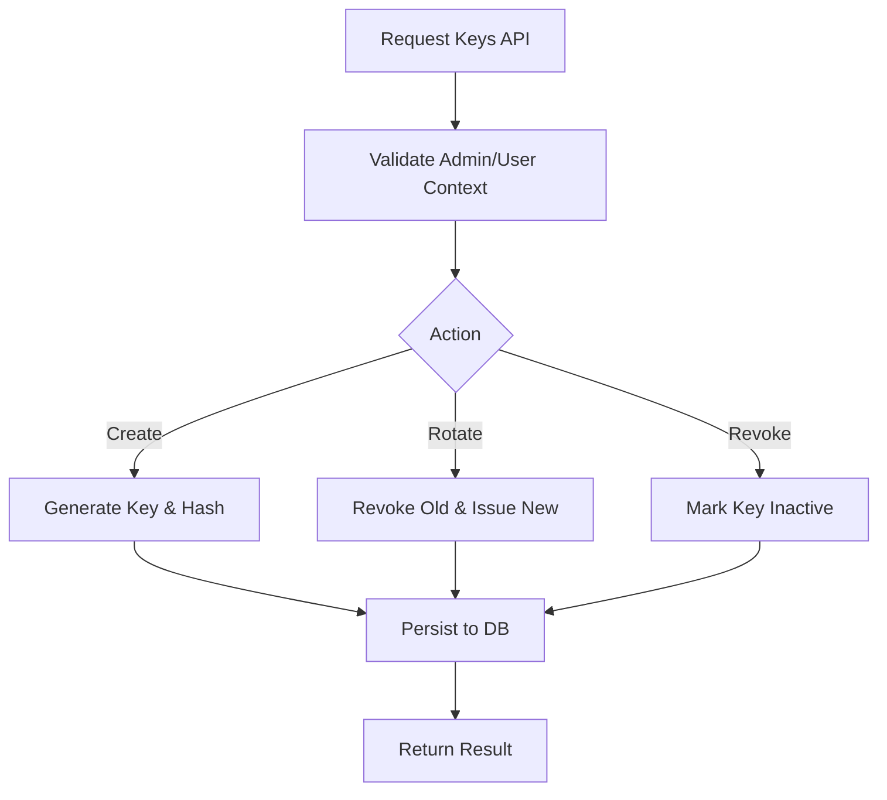
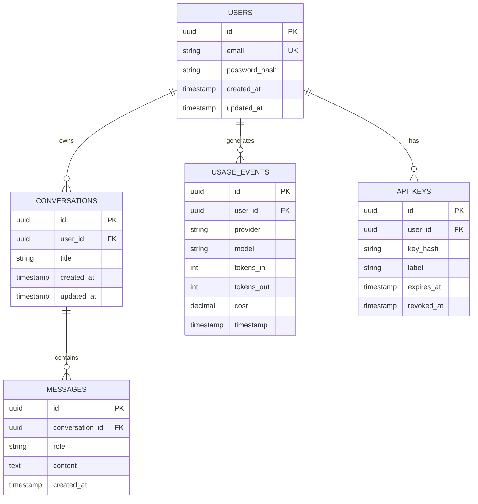
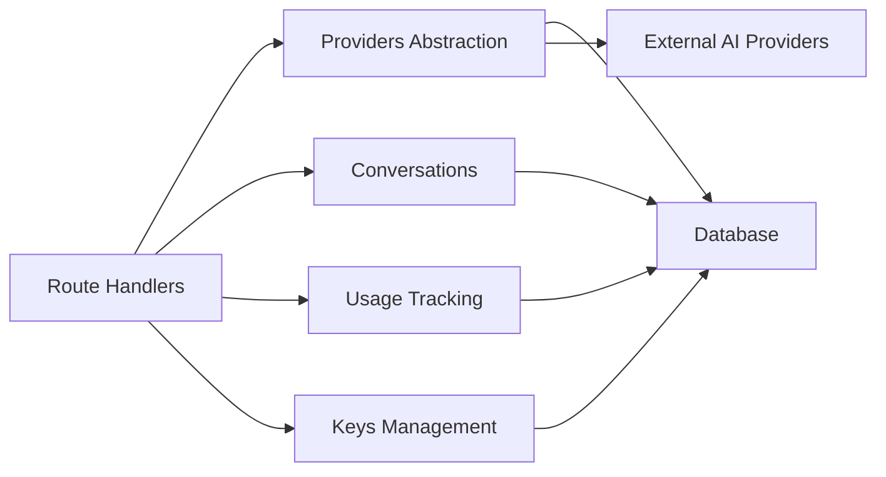

# Backend Architecture

<cite>
**Referenced Files in This Document**
- [index.ts](file://backend/src/index.ts)
- [auth.ts](file://backend/src/auth.ts)
- [db.ts](file://backend/src/db.ts)
- [providers.ts](file://backend/src/providers.ts)
- [conversations.ts](file://backend/src/conversations.ts)
- [usage.ts](file://backend/src/usage.ts)
- [keys.ts](file://backend/src/keys.ts)
</cite>

## Table of Contents
1. [Introduction](#introduction)
2. [Project Structure](#project-structure)
3. [Core Components](#core-components)
4. [Architecture Overview](#architecture-overview)
5. [Detailed Component Analysis](#detailed-component-analysis)
6. [Dependency Analysis](#dependency-analysis)
7. [Performance Considerations](#performance-considerations)
8. [Troubleshooting Guide](#troubleshooting-guide)
9. [Conclusion](#conclusion)

## Introduction
This document describes the backend service built with the Bun runtime. It focuses on the service-oriented architecture, database schema design, API route handler patterns, provider abstraction for multiple AI services, authentication middleware, conversation management, usage tracking, database operations, caching strategies, performance optimizations, error handling, logging, and monitoring approaches. The goal is to provide a comprehensive yet accessible guide for both technical and non-technical readers.

## Project Structure
The backend resides under the backend directory and is organized by responsibility:
- index.ts: Application bootstrap, server setup, and global middleware registration
- auth.ts: Authentication middleware and session/token utilities
- db.ts: Database connection, schema initialization, and query helpers
- providers.ts: Provider abstraction layer for multiple AI service integrations
- conversations.ts: Conversation lifecycle and persistence
- usage.ts: Usage tracking and analytics aggregation
- keys.ts: API key management (CRUD and validation)

[No sources needed since this diagram shows conceptual workflow, not actual code structure]

## Core Components
- HTTP Server and Global Middleware: Initializes the Bun server, registers global middleware (including authentication), and mounts API routes.
- Authentication Middleware: Validates requests using tokens or sessions, attaches user context, and enforces access control.
- Database Layer: Manages connections, initializes schema, and exposes typed query helpers.
- Provider Abstraction: Defines a unified interface for multiple AI providers, routing requests through a single entry point while isolating provider-specific logic.
- Conversation Management: Persists messages, manages conversation state, and supports retrieval and updates.
- Usage Tracking: Records token usage, model calls, and aggregates metrics for billing and analytics.
- Keys Management: Provides CRUD operations for API keys, including creation, rotation, and revocation.

**Section sources**
- [index.ts](file://backend/src/index.ts)
- [auth.ts](file://backend/src/auth.ts)
- [db.ts](file://backend/src/db.ts)
- [providers.ts](file://backend/src/providers.ts)
- [conversations.ts](file://backend/src/conversations.ts)
- [usage.ts](file://backend/src/usage.ts)
- [keys.ts](file://backend/src/keys.ts)

## Architecture Overview
The backend follows a service-oriented architecture with clear separation between HTTP handling, business logic, data access, and external integrations.

**Diagram sources**
- [index.ts](file://backend/src/index.ts)
- [auth.ts](file://backend/src/auth.ts)
- [providers.ts](file://backend/src/providers.ts)
- [conversations.ts](file://backend/src/conversations.ts)
- [usage.ts](file://backend/src/usage.ts)
- [keys.ts](file://backend/src/keys.ts)
- [db.ts](file://backend/src/db.ts)

## Detailed Component Analysis

### Authentication Middleware
- Purpose: Enforce authentication across protected routes, validate tokens/sessions, and attach user context to requests.
- Responsibilities:
  - Parse and verify credentials
  - Create or refresh sessions/tokens
  - Attach authenticated user metadata to request context
  - Reject unauthorized requests with appropriate status codes
- Integration: Registered globally in the server bootstrap so all API routes inherit protection unless explicitly exempted.

**Diagram sources**
- [index.ts](file://backend/src/index.ts)
- [auth.ts](file://backend/src/auth.ts)
- [db.ts](file://backend/src/db.ts)

**Section sources**
- [auth.ts](file://backend/src/auth.ts)
- [index.ts](file://backend/src/index.ts)

### Provider Abstraction Layer
- Purpose: Provide a unified interface for multiple AI service integrations, enabling easy addition/removal of providers without changing route handlers.
- Responsibilities:
  - Define a common provider interface (e.g., chat completions, streaming responses)
  - Resolve the active provider based on configuration or request parameters
  - Normalize input/output formats across providers
  - Handle provider-specific errors and retries
- Data Flow:
  - Route handler invokes provider abstraction
  - Abstraction selects provider and forwards normalized payload
  - Provider returns standardized response stream or result
  - Response is streamed back to client if applicable

**Diagram sources**
- [providers.ts](file://backend/src/providers.ts)

**Section sources**
- [providers.ts](file://backend/src/providers.ts)

### Conversation Management System
- Purpose: Manage conversation lifecycles, persist messages, and support retrieval and updates.
- Responsibilities:
  - Create new conversations
  - Append messages and maintain ordering
  - Retrieve conversation history
  - Update or delete conversations
- Data Model:
  - Conversations table: id, user_id, title, created_at, updated_at
  - Messages table: id, conversation_id, role, content, created_at
- Operations:
  - Insert message with transactional guarantees
  - Fetch paginated messages
  - Aggregate conversation stats for UI

**Diagram sources**
- [conversations.ts](file://backend/src/conversations.ts)
- [db.ts](file://backend/src/db.ts)

**Section sources**
- [conversations.ts](file://backend/src/conversations.ts)
- [db.ts](file://backend/src/db.ts)

### Usage Tracking Mechanisms
- Purpose: Record usage events for billing, analytics, and rate limiting.
- Responsibilities:
  - Log model calls, token counts, latency, and costs
  - Aggregate daily/monthly usage per user/provider/model
  - Expose endpoints for analytics dashboards
- Implementation Notes:
  - Batch inserts for high-throughput scenarios
  - Periodic aggregation jobs to summarize metrics
  - Idempotent event ingestion to prevent duplicates

**Diagram sources**
- [usage.ts](file://backend/src/usage.ts)
- [db.ts](file://backend/src/db.ts)

**Section sources**
- [usage.ts](file://backend/src/usage.ts)
- [db.ts](file://backend/src/db.ts)

### API Key Management
- Purpose: Manage API keys for clients and internal services.
- Responsibilities:
  - Create, rotate, and revoke keys
  - Associate keys with users or scopes
  - Validate keys at request time
- Security Considerations:
  - Hash stored keys
  - Limit key lifetime and scope
  - Audit key usage

**Diagram sources**
- [keys.ts](file://backend/src/keys.ts)
- [db.ts](file://backend/src/db.ts)

**Section sources**
- [keys.ts](file://backend/src/keys.ts)
- [db.ts](file://backend/src/db.ts)

### Database Schema Design
- Entities:
  - Users: id, email, password_hash, created_at, updated_at
  - Conversations: id, user_id, title, created_at, updated_at
  - Messages: id, conversation_id, role, content, created_at
  - UsageEvents: id, user_id, provider, model, tokens_in, tokens_out, cost, timestamp
  - APIKeys: id, user_id, key_hash, label, expires_at, revoked_at
- Relationships:
  - Users have many Conversations
  - Conversations have many Messages
  - Users have many UsageEvents
  - Users have many APIKeys

**Diagram sources**
- [db.ts](file://backend/src/db.ts)

**Section sources**
- [db.ts](file://backend/src/db.ts)

## Dependency Analysis
- Coupling:
  - Route handlers depend on services (providers, conversations, usage, keys)
  - Services depend on the database layer
  - Provider abstraction depends on external AI providers
- Cohesion:
  - Each module encapsulates a specific concern (auth, data, providers, usage, keys)
- External Dependencies:
  - AI provider SDKs via provider implementations
  - Database driver configured in db.ts

**Diagram sources**
- [index.ts](file://backend/src/index.ts)
- [providers.ts](file://backend/src/providers.ts)
- [conversations.ts](file://backend/src/conversations.ts)
- [usage.ts](file://backend/src/usage.ts)
- [keys.ts](file://backend/src/keys.ts)
- [db.ts](file://backend/src/db.ts)

**Section sources**
- [index.ts](file://backend/src/index.ts)
- [providers.ts](file://backend/src/providers.ts)
- [conversations.ts](file://backend/src/conversations.ts)
- [usage.ts](file://backend/src/usage.ts)
- [keys.ts](file://backend/src/keys.ts)
- [db.ts](file://backend/src/db.ts)

## Performance Considerations
- Streaming Responses: Use async iterables for provider streams to reduce memory footprint and improve latency.
- Connection Pooling: Configure database connection pools to handle concurrent requests efficiently.
- Batch Inserts: Aggregate usage events and batch write to minimize round trips.
- Indexing: Add indexes on frequently queried columns (user_id, conversation_id, timestamps).
- Caching Strategies:
  - Cache provider configurations and model lists
  - Short-lived cache for hot conversation metadata
  - Avoid caching sensitive data; ensure proper invalidation
- Rate Limiting: Implement per-user and per-key limits at the middleware layer.
- Backpressure Handling: Ensure streaming pipelines respect consumer backpressure to avoid memory spikes.

[No sources needed since this section provides general guidance]

## Troubleshooting Guide
- Common Issues:
  - Authentication failures: Verify token format, expiration, and secret configuration
  - Provider errors: Check provider credentials, network connectivity, and rate limits
  - Database errors: Inspect connection pool exhaustion, deadlocks, and schema mismatches
  - Usage anomalies: Confirm idempotency keys and deduplication logic
- Logging and Monitoring:
  - Structured logs for requests, provider calls, and DB operations
  - Metrics for latency, throughput, error rates, and token usage
  - Alerts for critical failures and threshold breaches
- Debugging Tips:
  - Enable verbose logging in development
  - Correlate requests via unique IDs propagated across layers
  - Validate payloads before sending to providers

**Section sources**
- [auth.ts](file://backend/src/auth.ts)
- [providers.ts](file://backend/src/providers.ts)
- [db.ts](file://backend/src/db.ts)
- [usage.ts](file://backend/src/usage.ts)

## Conclusion
The backend service leverages a clean service-oriented architecture with Bun’s high-performance runtime. The provider abstraction enables flexible integration of multiple AI services, while robust authentication, conversation management, and usage tracking ensure secure and observable operations. Thoughtful database design, caching strategies, and performance optimizations contribute to scalability and reliability. Comprehensive error handling, logging, and monitoring complete the operational picture.