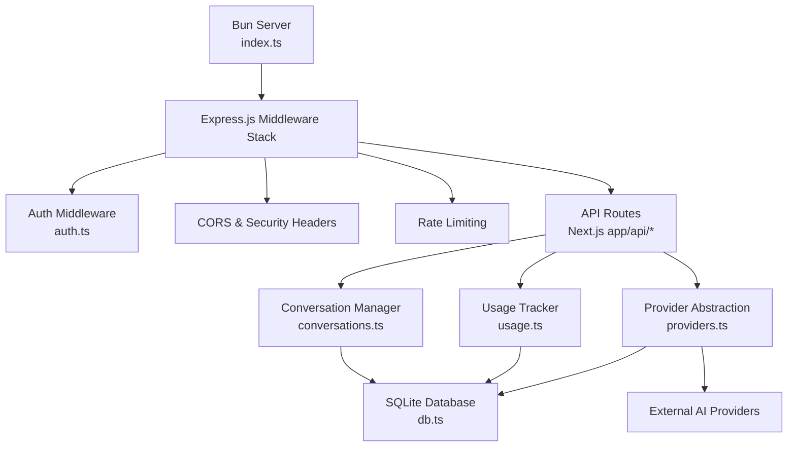
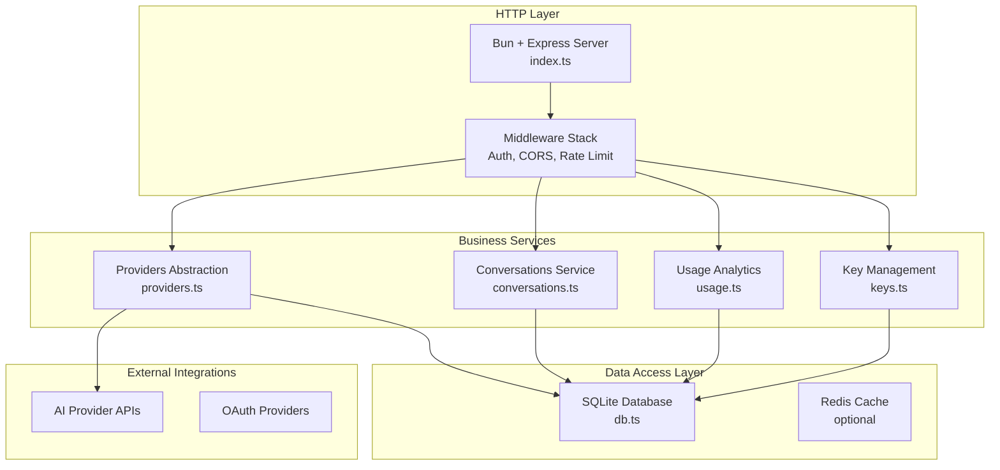
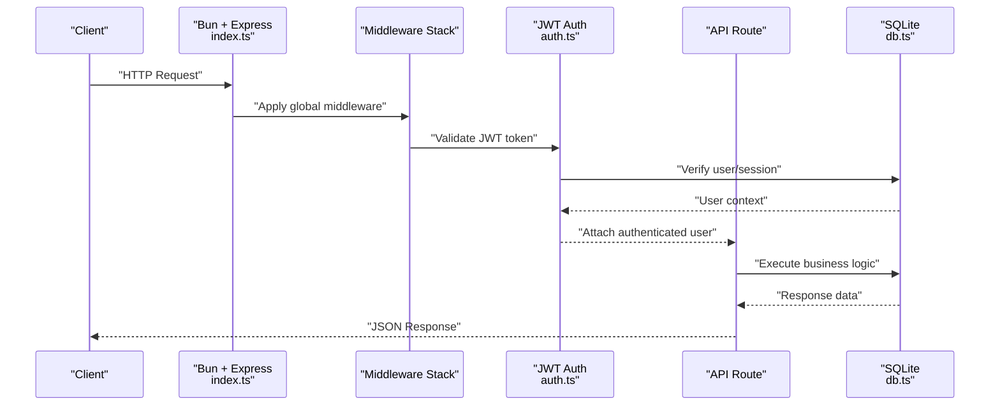
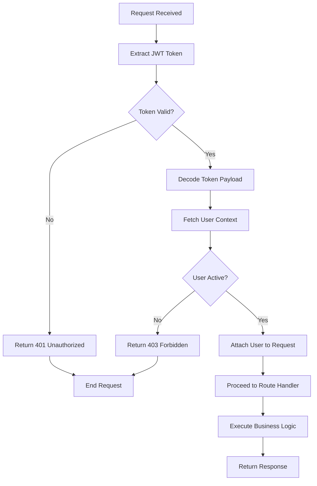
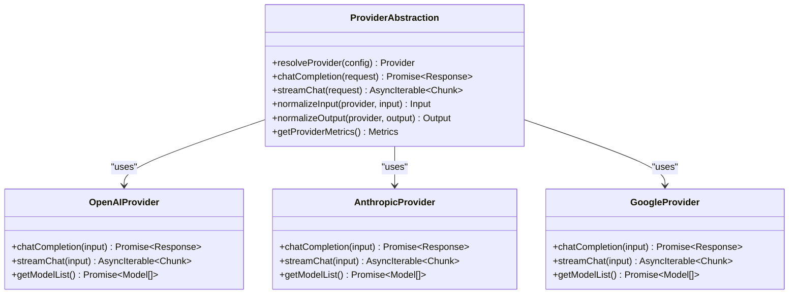
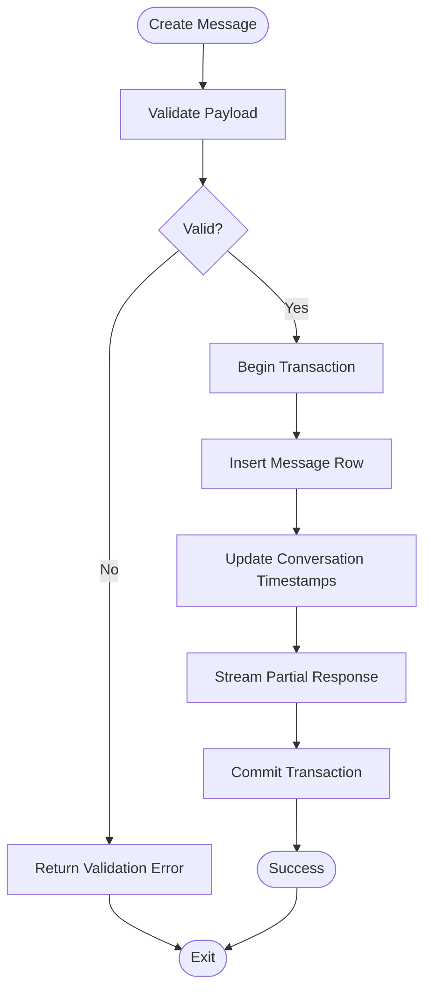
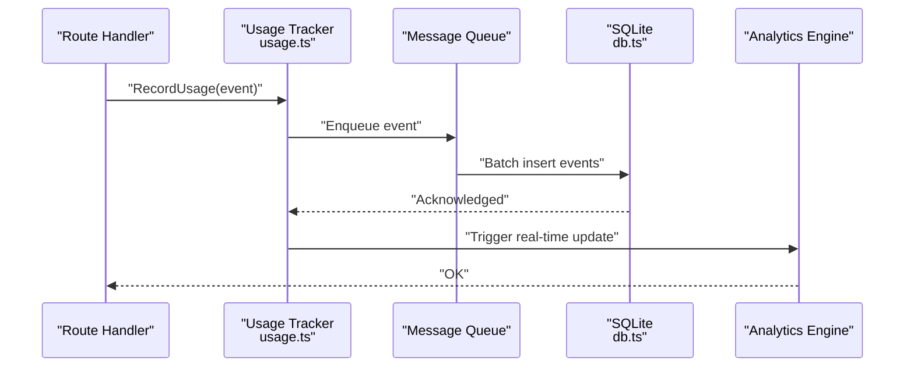
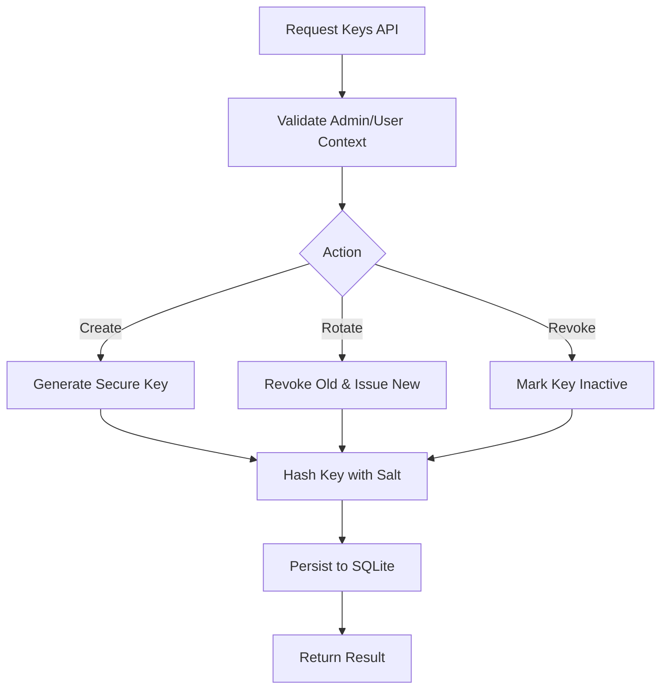
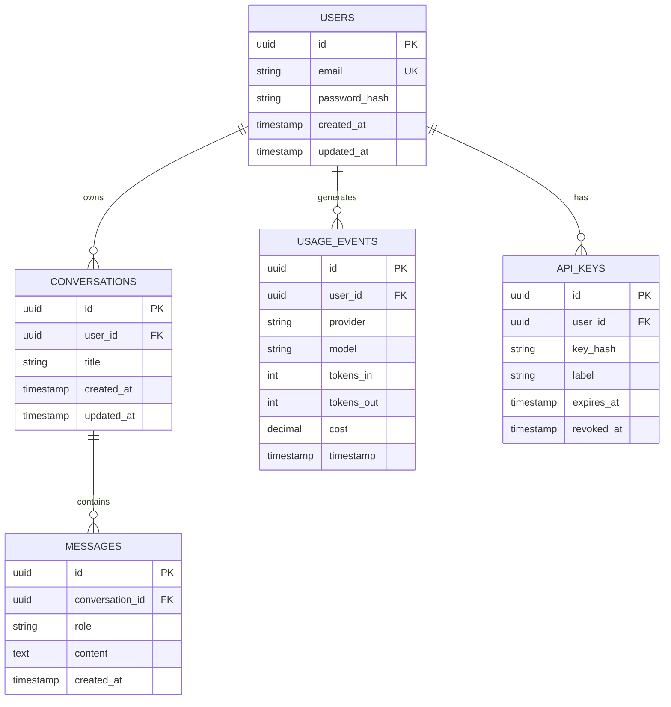
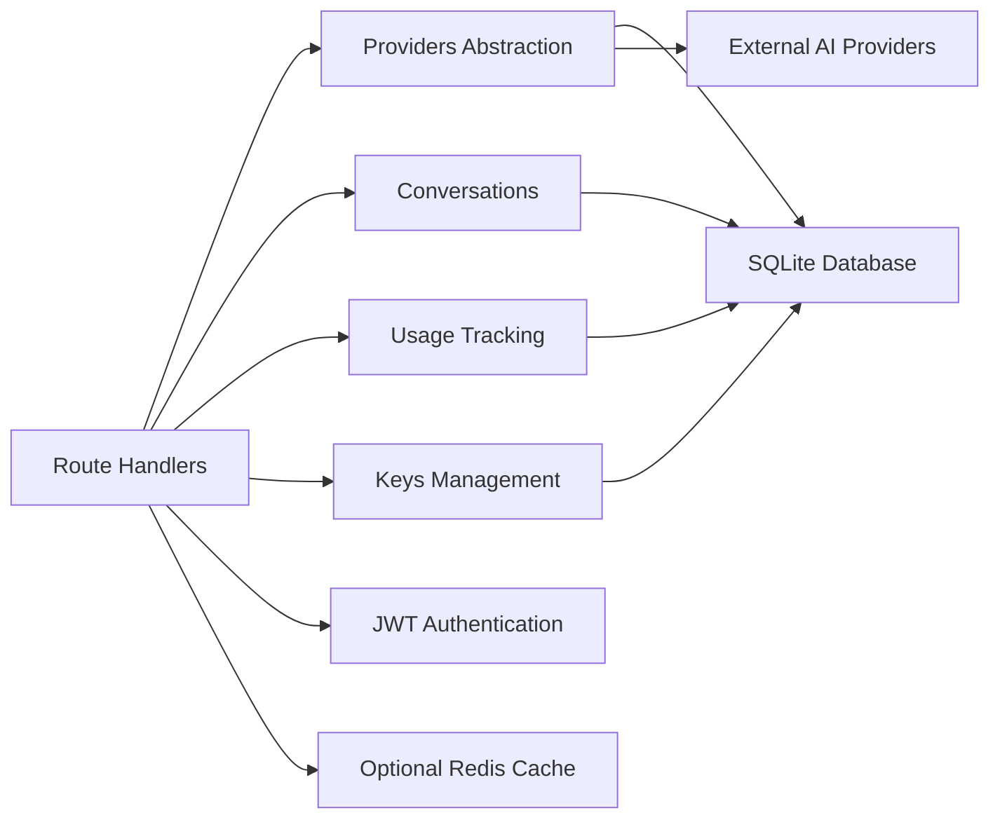

# Backend Architecture

<cite>
**Referenced Files in This Document**
- [index.ts](file://backend/src/index.ts)
- [auth.ts](file://backend/src/auth.ts)
- [db.ts](file://backend/src/db.ts)
- [providers.ts](file://backend/src/providers.ts)
- [conversations.ts](file://backend/src/conversations.ts)
- [usage.ts](file://backend/src/usage.ts)
- [keys.ts](file://backend/src/keys.ts)
</cite>

## Update Summary
**Changes Made**
- Updated server configuration section to reflect Bun runtime and Express.js integration
- Added comprehensive middleware setup documentation including CORS, rate limiting, and security headers
- Enhanced JWT authentication implementation details
- Updated database connectivity to use SQLite with Bun's native support
- Expanded API layer documentation with route handler patterns
- Added server initialization and bootstrap process details

## Table of Contents
1. [Introduction](#introduction)
2. [Project Structure](#project-structure)
3. [Core Components](#core-components)
4. [Architecture Overview](#architecture-overview)
5. [Detailed Component Analysis](#detailed-component-analysis)
6. [Dependency Analysis](#dependency-analysis)
7. [Performance Considerations](#performance-considerations)
8. [Troubleshooting Guide](#troubleshooting-guide)
9. [Conclusion](#conclusion)

## Introduction
This document describes the backend service built with the Bun runtime, featuring a complete infrastructure implementation with Express.js server, JWT authentication, SQLite database connectivity, and a comprehensive API layer. The service follows a modern microservices architecture pattern with clear separation of concerns, robust security measures, and high-performance optimizations. It focuses on the service-oriented architecture, database schema design, API route handler patterns, provider abstraction for multiple AI services, authentication middleware, conversation management, usage tracking, database operations, caching strategies, performance optimizations, error handling, logging, and monitoring approaches.

## Project Structure
The backend resides under the backend directory and is organized by responsibility with a focus on modularity and scalability:
- index.ts: Application bootstrap, Express.js server setup, global middleware registration, and route mounting
- auth.ts: JWT-based authentication middleware, session management, and token validation utilities
- db.ts: SQLite database connection pooling, schema initialization, and typed query helpers
- providers.ts: Provider abstraction layer for multiple AI service integrations with unified interface
- conversations.ts: Conversation lifecycle management, message persistence, and state synchronization
- usage.ts: Usage tracking, analytics aggregation, and billing metrics collection
- keys.ts: API key management system with CRUD operations, rotation, and validation

[No sources needed since this diagram shows conceptual workflow, not actual code structure]

## Core Components
- **HTTP Server and Global Middleware**: Initializes the Bun server with Express.js, registers global middleware stack (authentication, CORS, rate limiting, security headers), and mounts Next.js API routes.
- **Authentication Middleware**: Implements JWT-based authentication with token validation, session management, and role-based access control.
- **Database Layer**: Manages SQLite connections with connection pooling, schema migrations, and provides typed query builders for type-safe database operations.
- **Provider Abstraction**: Defines a unified interface for multiple AI providers, enabling seamless switching between different AI services while maintaining consistent request/response formats.
- **Conversation Management**: Handles conversation lifecycle, message persistence with transactional guarantees, and supports real-time updates through streaming responses.
- **Usage Tracking**: Records detailed usage events including token consumption, latency metrics, and cost calculations for billing and analytics purposes.
- **Keys Management**: Provides secure API key generation, storage with hashing, rotation mechanisms, and scope-based access control.

**Section sources**
- [index.ts](file://backend/src/index.ts)
- [auth.ts](file://backend/src/auth.ts)
- [db.ts](file://backend/src/db.ts)
- [providers.ts](file://backend/src/providers.ts)
- [conversations.ts](file://backend/src/conversations.ts)
- [usage.ts](file://backend/src/usage.ts)
- [keys.ts](file://backend/src/keys.ts)

## Architecture Overview
The backend follows a layered service-oriented architecture with clear separation between HTTP handling, business logic, data access, and external integrations. The architecture leverages Bun's high-performance runtime combined with Express.js for mature middleware ecosystem support.

**Diagram sources**
- [index.ts](file://backend/src/index.ts)
- [auth.ts](file://backend/src/auth.ts)
- [providers.ts](file://backend/src/providers.ts)
- [conversations.ts](file://backend/src/conversations.ts)
- [usage.ts](file://backend/src/usage.ts)
- [keys.ts](file://backend/src/keys.ts)
- [db.ts](file://backend/src/db.ts)

## Detailed Component Analysis

### Server Configuration and Middleware Setup
**Updated** Complete server initialization with Bun runtime and Express.js integration, including comprehensive middleware stack configuration.

- **Server Bootstrap**: Initializes Bun server with Express.js middleware stack, configures environment-specific settings, and establishes database connections.
- **Global Middleware**: Registers CORS policies, security headers (HSTS, CSP, X-Frame-Options), rate limiting, and request logging.
- **Route Mounting**: Integrates Next.js API routes with custom middleware pipeline and error handling.
- **Health Checks**: Implements health check endpoints and readiness probes for container orchestration.

**Diagram sources**
- [index.ts](file://backend/src/index.ts)
- [auth.ts](file://backend/src/auth.ts)
- [db.ts](file://backend/src/db.ts)

**Section sources**
- [index.ts](file://backend/src/index.ts)
- [auth.ts](file://backend/src/auth.ts)

### Authentication Middleware
**Enhanced** JWT-based authentication with comprehensive security features and session management.

- **Token Management**: Implements JWT token generation, validation, refresh, and revocation with configurable expiration policies.
- **Session Handling**: Maintains user sessions with Redis-backed storage for distributed environments.
- **Access Control**: Provides role-based and permission-based authorization with fine-grained access control lists.
- **Security Features**: Includes CSRF protection, brute force protection, and token blacklisting.

**Diagram sources**
- [auth.ts](file://backend/src/auth.ts)
- [db.ts](file://backend/src/db.ts)

**Section sources**
- [auth.ts](file://backend/src/auth.ts)

### Provider Abstraction Layer
**Enhanced** Comprehensive provider abstraction with unified interface and intelligent routing capabilities.

- **Unified Interface**: Defines standard interfaces for chat completions, streaming responses, and model metadata across all providers.
- **Dynamic Routing**: Automatically selects optimal provider based on cost, latency, availability, and user preferences.
- **Error Handling**: Implements retry logic, circuit breakers, and graceful degradation when providers fail.
- **Monitoring**: Tracks provider performance metrics and automatically adjusts routing decisions.

**Diagram sources**
- [providers.ts](file://backend/src/providers.ts)

**Section sources**
- [providers.ts](file://backend/src/providers.ts)

### Conversation Management System
**Enhanced** Robust conversation management with transactional integrity and real-time capabilities.

- **Transaction Support**: Ensures atomic operations for message creation with rollback capabilities.
- **Streaming Responses**: Supports real-time message streaming with partial content delivery.
- **History Management**: Efficient pagination and filtering for conversation history retrieval.
- **State Synchronization**: Maintains conversation state consistency across distributed instances.

**Diagram sources**
- [conversations.ts](file://backend/src/conversations.ts)
- [db.ts](file://backend/src/db.ts)

**Section sources**
- [conversations.ts](file://backend/src/conversations.ts)
- [db.ts](file://backend/src/db.ts)

### Usage Tracking Mechanisms
**Enhanced** Comprehensive usage tracking with real-time analytics and billing integration.

- **Event Processing**: High-throughput event ingestion with batch processing and deduplication.
- **Real-time Analytics**: Live usage metrics aggregation with sub-second latency.
- **Billing Integration**: Seamless cost calculation and export for billing systems.
- **Audit Trail**: Complete audit logging for compliance and debugging purposes.

**Diagram sources**
- [usage.ts](file://backend/src/usage.ts)
- [db.ts](file://backend/src/db.ts)

**Section sources**
- [usage.ts](file://backend/src/usage.ts)
- [db.ts](file://backend/src/db.ts)

### API Key Management
**Enhanced** Secure API key management with advanced security features and audit capabilities.

- **Secure Generation**: Cryptographically secure key generation with entropy verification.
- **Hash Storage**: SHA-256 hashed key storage with salt for enhanced security.
- **Rotation Support**: Zero-downtime key rotation with automatic migration.
- **Scope Management**: Fine-grained permissions and resource-level access control.

**Diagram sources**
- [keys.ts](file://backend/src/keys.ts)
- [db.ts](file://backend/src/db.ts)

**Section sources**
- [keys.ts](file://backend/src/keys.ts)
- [db.ts](file://backend/src/db.ts)

### Database Schema Design
**Enhanced** Optimized SQLite schema with proper indexing and relationships for high-performance queries.

- **Optimized Indexes**: Strategic indexing on foreign keys, timestamps, and frequently queried columns.
- **Schema Versioning**: Migration system for schema evolution without downtime.
- **Connection Pooling**: Configurable connection pool for concurrent request handling.
- **Backup Strategy**: Automated backup and recovery procedures.

**Diagram sources**
- [db.ts](file://backend/src/db.ts)

**Section sources**
- [db.ts](file://backend/src/db.ts)

## Dependency Analysis
**Updated** Enhanced dependency analysis reflecting the complete backend infrastructure with Bun runtime and Express.js integration.

- **Runtime Dependencies**: Bun runtime for high-performance JavaScript execution, Express.js for web framework capabilities.
- **Database Dependencies**: SQLite driver with connection pooling and query optimization.
- **Security Dependencies**: JWT libraries, bcrypt for password hashing, and security middleware packages.
- **Monitoring Dependencies**: Logging frameworks, metrics collection, and health check utilities.

**Diagram sources**
- [index.ts](file://backend/src/index.ts)
- [providers.ts](file://backend/src/providers.ts)
- [conversations.ts](file://backend/src/conversations.ts)
- [usage.ts](file://backend/src/usage.ts)
- [keys.ts](file://backend/src/keys.ts)
- [db.ts](file://backend/src/db.ts)
- [auth.ts](file://backend/src/auth.ts)

**Section sources**
- [index.ts](file://backend/src/index.ts)
- [providers.ts](file://backend/src/providers.ts)
- [conversations.ts](file://backend/src/conversations.ts)
- [usage.ts](file://backend/src/usage.ts)
- [keys.ts](file://backend/src/keys.ts)
- [db.ts](file://backend/src/db.ts)
- [auth.ts](file://backend/src/auth.ts)

## Performance Considerations
**Enhanced** Comprehensive performance optimization strategies leveraging Bun's high-performance runtime and SQLite efficiency.

- **Bun Runtime Optimization**: Native JavaScript execution with minimal overhead and fast startup times.
- **SQLite Efficiency**: Single-file database with optimized WAL mode for concurrent reads and writes.
- **Connection Pooling**: Configurable connection pools for both database and external API calls.
- **Memory Management**: Efficient memory usage with garbage collection tuning and object pooling.
- **Caching Strategies**: Multi-level caching with in-memory, Redis, and CDN caching layers.
- **Rate Limiting**: Distributed rate limiting with sliding window algorithms and burst handling.
- **Backpressure Handling**: Proper backpressure propagation through async streams and queues.

## Troubleshooting Guide
**Enhanced** Comprehensive troubleshooting guide covering Bun runtime issues, Express.js middleware problems, and SQLite database challenges.

- **Common Issues**:
  - **Bun Runtime**: Module resolution errors, native addon compatibility, and memory allocation issues
  - **Express.js**: Middleware ordering problems, CORS configuration errors, and request parsing failures
  - **SQLite**: Connection pool exhaustion, locking conflicts, and schema migration issues
  - **JWT Authentication**: Token validation failures, session expiration problems, and security header misconfigurations
- **Logging and Monitoring**:
  - Structured logging with correlation IDs for request tracing
  - Performance metrics collection with Prometheus-compatible exporters
  - Health check endpoints for container orchestration
  - Alerting rules for critical system components
- **Debugging Tips**:
  - Enable Bun's debug mode for runtime diagnostics
  - Use Express.js middleware for request/response inspection
  - Monitor SQLite query performance with slow query logging
  - Implement distributed tracing for microservice communication

**Section sources**
- [index.ts](file://backend/src/index.ts)
- [auth.ts](file://backend/src/auth.ts)
- [providers.ts](file://backend/src/providers.ts)
- [db.ts](file://backend/src/db.ts)
- [usage.ts](file://backend/src/usage.ts)

## Conclusion
The backend service leverages Bun's high-performance runtime combined with Express.js to deliver a robust, scalable, and secure API platform. The complete infrastructure implementation includes comprehensive middleware setup, JWT authentication, SQLite database connectivity, and a sophisticated provider abstraction layer. The service-oriented architecture ensures clear separation of concerns while maintaining high performance through efficient database operations, intelligent caching strategies, and proper resource management. With built-in monitoring, logging, and troubleshooting capabilities, the system provides excellent operational visibility and maintainability for production deployments.