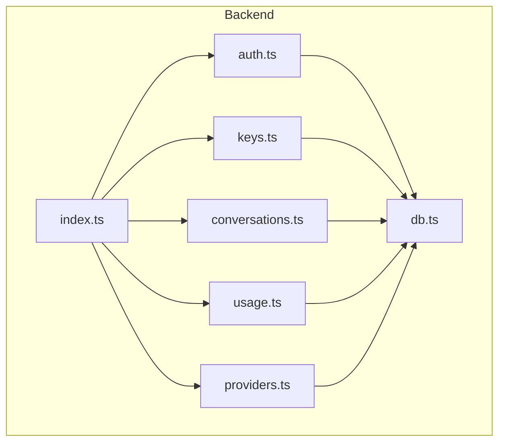
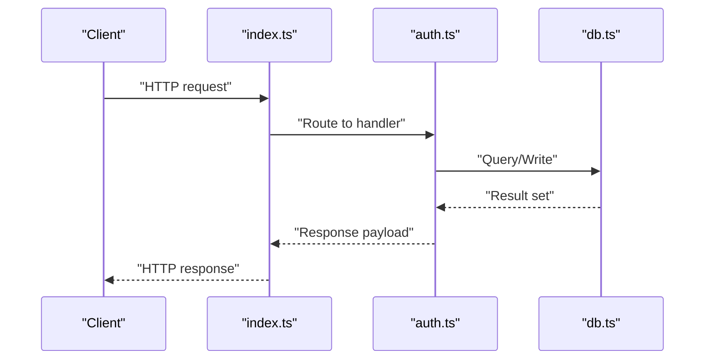
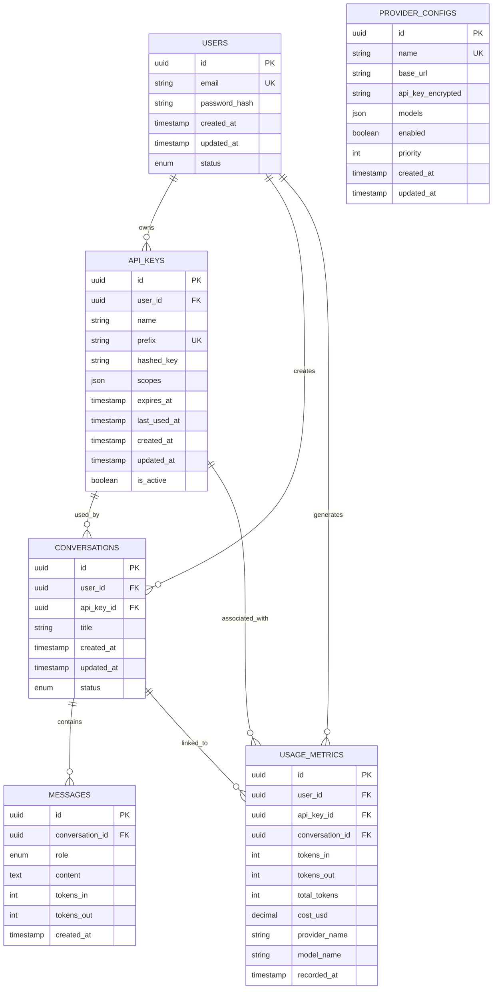
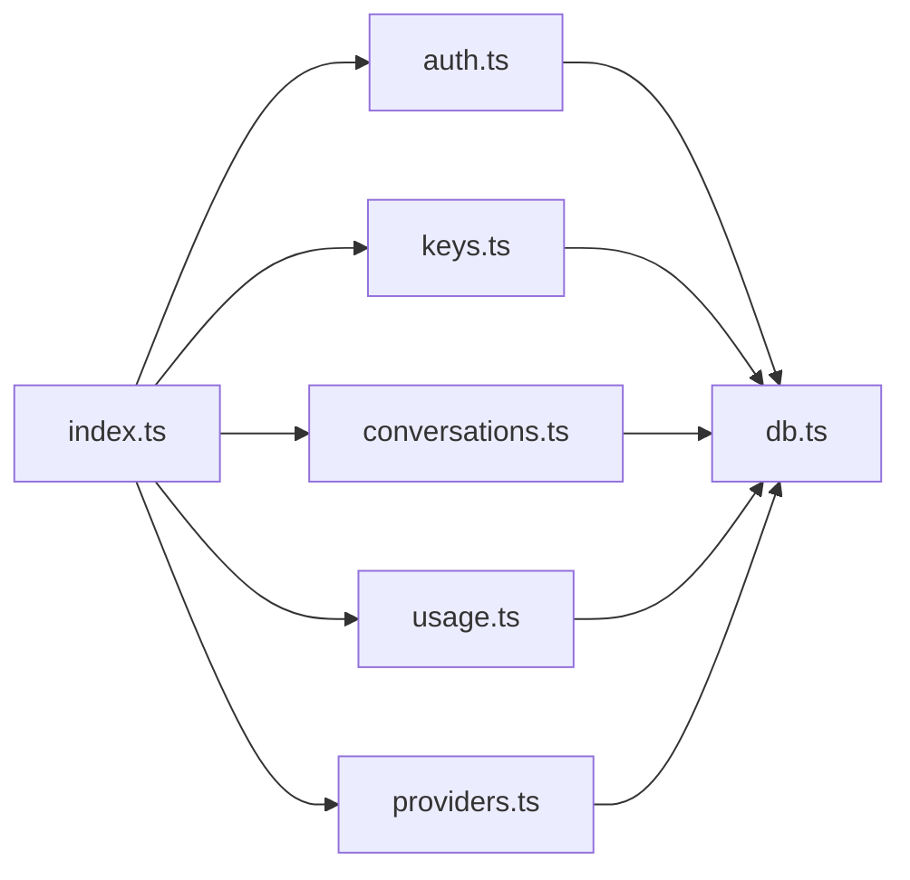

# Database Schema & Data Models

<cite>
**Referenced Files in This Document**
- [db.ts](file://backend/src/db.ts)
- [auth.ts](file://backend/src/auth.ts)
- [keys.ts](file://backend/src/keys.ts)
- [conversations.ts](file://backend/src/conversations.ts)
- [usage.ts](file://backend/src/usage.ts)
- [providers.ts](file://backend/src/providers.ts)
- [index.ts](file://backend/src/index.ts)
</cite>

## Table of Contents
1. [Introduction](#introduction)
2. [Project Structure](#project-structure)
3. [Core Components](#core-components)
4. [Architecture Overview](#architecture-overview)
5. [Detailed Component Analysis](#detailed-component-analysis)
6. [Dependency Analysis](#dependency-analysis)
7. [Performance Considerations](#performance-considerations)
8. [Troubleshooting Guide](#troubleshooting-guide)
9. [Conclusion](#conclusion)
10. [Appendices](#appendices)

## Introduction
This document provides comprehensive data model documentation for the backend database schema, focusing on entities such as users, API keys, conversations, usage metrics, and provider configurations. It details entity relationships, field definitions, primary and foreign keys, constraints, validation rules, indexing strategies, migration patterns, backup procedures, performance optimization techniques, and security considerations for sensitive information like API keys and user data.

## Project Structure
The backend is implemented in TypeScript under the backend/src directory. The core database-related modules are:
- db.ts: Database connection and initialization
- auth.ts: User authentication and session management
- keys.ts: API key lifecycle and access control
- conversations.ts: Chat conversation storage and retrieval
- usage.ts: Usage metrics and analytics
- providers.ts: Provider configuration management
- index.ts: Server entry point wiring routes to handlers

**Diagram sources**
- [index.ts](file://backend/src/index.ts)
- [auth.ts](file://backend/src/auth.ts)
- [keys.ts](file://backend/src/keys.ts)
- [conversations.ts](file://backend/src/conversations.ts)
- [usage.ts](file://backend/src/usage.ts)
- [providers.ts](file://backend/src/providers.ts)
- [db.ts](file://backend/src/db.ts)

**Section sources**
- [index.ts](file://backend/src/index.ts)
- [db.ts](file://backend/src/db.ts)

## Core Components
This section outlines the core data entities and their responsibilities:
- Users: Identity and account metadata
- API Keys: Scoped credentials for programmatic access
- Conversations: Chat sessions and messages
- Usage Metrics: Token counts and cost tracking
- Provider Configurations: External LLM provider settings

Key implementation references:
- Database initialization and connection handling: [db.ts](file://backend/src/db.ts)
- Authentication flows and user operations: [auth.ts](file://backend/src/auth.ts)
- API key creation, rotation, and revocation: [keys.ts](file://backend/src/keys.ts)
- Conversation persistence and retrieval: [conversations.ts](file://backend/src/conversations.ts)
- Usage aggregation and reporting: [usage.ts](file://backend/src/usage.ts)
- Provider configuration CRUD: [providers.ts](file://backend/src/providers.ts)

**Section sources**
- [db.ts](file://backend/src/db.ts)
- [auth.ts](file://backend/src/auth.ts)
- [keys.ts](file://backend/src/keys.ts)
- [conversations.ts](file://backend/src/conversations.ts)
- [usage.ts](file://backend/src/usage.ts)
- [providers.ts](file://backend/src/providers.ts)

## Architecture Overview
The backend exposes REST endpoints that route to handler modules. Each handler interacts with the database via a shared database module. The data layer enforces referential integrity through foreign keys and uses indexes to optimize common queries.

**Diagram sources**
- [index.ts](file://backend/src/index.ts)
- [auth.ts](file://backend/src/auth.ts)
- [db.ts](file://backend/src/db.ts)

## Detailed Component Analysis

### Entity: Users
Purpose:
- Stores user identity and account metadata
- Supports authentication and authorization workflows

Primary Key:
- id (UUID or integer; ensure uniqueness)

Common Fields:
- email (unique, validated format)
- password_hash (stored securely using bcrypt or similar)
- created_at, updated_at (timestamps)
- status (active, suspended, etc.)

Constraints:
- Unique constraint on email
- Not null on essential fields
- Timestamps default to current time

Validation Rules:
- Email format validation
- Password strength requirements enforced at service layer before hashing

Indexes:
- Unique index on email
- Optional index on status for filtering

Security:
- Never store plaintext passwords
- Apply least privilege access to user table

**Section sources**
- [auth.ts](file://backend/src/auth.ts)
- [db.ts](file://backend/src/db.ts)

### Entity: API Keys
Purpose:
- Represents scoped credentials used by clients to authenticate requests
- Enables fine-grained access control per user

Primary Key:
- id (UUID or integer; ensure uniqueness)

Foreign Keys:
- user_id references users.id

Common Fields:
- name (human-readable label)
- prefix (public identifier portion)
- hashed_key (secret stored securely)
- scopes (permissions bitmask or JSON array)
- expires_at (optional expiration)
- last_used_at (timestamp)
- created_at, updated_at (timestamps)
- is_active (boolean)

Constraints:
- Foreign key to users
- Unique constraint on prefix
- Not null on required fields

Validation Rules:
- Scopes must be a subset of allowed permissions
- Expiration must be in the future if provided

Indexes:
- Index on user_id for lookup
- Index on prefix for fast matching during authentication
- Optional index on expires_at for cleanup jobs

Security:
- Store only hashed versions of secret keys
- Mask secrets in logs and responses
- Enforce scope checks at every protected endpoint

**Section sources**
- [keys.ts](file://backend/src/keys.ts)
- [db.ts](file://backend/src/db.ts)

### Entity: Conversations
Purpose:
- Stores chat sessions and associated messages
- Links messages to users and optionally to API keys used for generation

Primary Key:
- id (UUID or integer; ensure uniqueness)

Foreign Keys:
- user_id references users.id
- api_key_id references api_keys.id (nullable)

Common Fields:
- title (optional summary)
- created_at, updated_at (timestamps)
- status (open, closed, archived)

Message Sub-entity (if normalized):
- id (primary key)
- conversation_id references conversations.id
- role (system, user, assistant)
- content (text)
- tokens_in, tokens_out (numeric counters)
- created_at (timestamp)

Constraints:
- Foreign keys to users and api_keys
- Not null on role and content for messages

Validation Rules:
- Role values restricted to allowed enums
- Content length limits enforced at service layer

Indexes:
- Index on user_id for listing user conversations
- Index on conversation_id for message retrieval
- Optional index on status for filtering

**Section sources**
- [conversations.ts](file://backend/src/conversations.ts)
- [db.ts](file://backend/src/db.ts)

### Entity: Usage Metrics
Purpose:
- Tracks token consumption and costs per conversation, API key, or user
- Supports billing and analytics dashboards

Primary Key:
- id (UUID or integer; ensure uniqueness)

Foreign Keys:
- user_id references users.id
- api_key_id references api_keys.id (nullable)
- conversation_id references conversations.id (nullable)

Common Fields:
- tokens_in (integer)
- tokens_out (integer)
- total_tokens (computed or stored)
- cost_usd (decimal)
- provider_name (string)
- model_name (string)
- recorded_at (timestamp)

Constraints:
- Non-negative numeric fields
- Foreign keys to users, api_keys, conversations

Validation Rules:
- Ensure totals match sum of inputs and outputs
- Cost calculations consistent with provider pricing tables

Indexes:
- Index on user_id for per-user reports
- Index on api_key_id for per-key reports
- Index on conversation_id for per-conversation breakdown
- Composite index on (recorded_at, user_id) for time-series queries

**Section sources**
- [usage.ts](file://backend/src/usage.ts)
- [db.ts](file://backend/src/db.ts)

### Entity: Provider Configurations
Purpose:
- Manages external LLM provider settings and credentials
- Allows multi-provider routing and failover

Primary Key:
- id (UUID or integer; ensure uniqueness)

Common Fields:
- name (unique provider label)
- base_url (endpoint URL)
- api_key_encrypted (encrypted secret)
- models (JSON array or separate mapping table)
- enabled (boolean)
- priority (integer for routing order)
- created_at, updated_at (timestamps)

Constraints:
- Unique constraint on name
- Not null on critical fields

Validation Rules:
- base_url must be a valid URL
- models list must not be empty when enabled

Indexes:
- Unique index on name
- Optional index on enabled for quick selection

Security:
- Encrypt provider API keys at rest
- Restrict write access to admin-only endpoints

**Section sources**
- [providers.ts](file://backend/src/providers.ts)
- [db.ts](file://backend/src/db.ts)

### Conceptual Overview
The following conceptual diagram illustrates high-level relationships among entities without mapping to specific source files.

[No sources needed since this diagram shows conceptual workflow, not actual code structure]

## Dependency Analysis
The backend modules depend on the database module for all persistence operations. Handlers orchestrate business logic and delegate data access to db.ts.

**Diagram sources**
- [index.ts](file://backend/src/index.ts)
- [auth.ts](file://backend/src/auth.ts)
- [keys.ts](file://backend/src/keys.ts)
- [conversations.ts](file://backend/src/conversations.ts)
- [usage.ts](file://backend/src/usage.ts)
- [providers.ts](file://backend/src/providers.ts)
- [db.ts](file://backend/src/db.ts)

**Section sources**
- [index.ts](file://backend/src/index.ts)
- [db.ts](file://backend/src/db.ts)

## Performance Considerations
- Indexing Strategy:
  - Add unique indexes on email and api_keys.prefix
  - Create indexes on foreign keys (user_id, api_key_id, conversation_id)
  - Use composite indexes for frequent query patterns (e.g., recorded_at + user_id)
- Query Optimization:
  - Select only necessary columns
  - Use pagination for large result sets
  - Avoid N+1 queries by joining where appropriate
- Storage Efficiency:
  - Normalize frequently accessed attributes
  - Partition usage_metrics by time for large datasets
- Caching:
  - Cache provider configurations and active API keys near the application layer
- Monitoring:
  - Track slow queries and adjust indexes accordingly

[No sources needed since this section provides general guidance]

## Troubleshooting Guide
Common issues and resolutions:
- Authentication Failures:
  - Verify password hashing and comparison logic
  - Check user status and account activation
- API Key Errors:
  - Ensure prefix uniqueness and correct hashing
  - Validate scopes and expiration times
- Missing Conversations or Messages:
  - Confirm foreign key integrity and cascading behavior
  - Review transaction boundaries and rollback conditions
- Usage Metric Discrepancies:
  - Reconcile token counts and cost calculations
  - Audit recorded_at timestamps for time zone consistency
- Provider Configuration Problems:
  - Validate base_url formats and encryption of secrets
  - Confirm enabled flags and priority ordering

Operational checks:
- Inspect database connection health and pool settings
- Review error logs from handlers and database driver
- Validate migrations applied successfully

**Section sources**
- [auth.ts](file://backend/src/auth.ts)
- [keys.ts](file://backend/src/keys.ts)
- [conversations.ts](file://backend/src/conversations.ts)
- [usage.ts](file://backend/src/usage.ts)
- [providers.ts](file://backend/src/providers.ts)
- [db.ts](file://backend/src/db.ts)

## Conclusion
The backend data model centers around users, API keys, conversations, usage metrics, and provider configurations. Strong referential integrity, careful indexing, and robust security practices ensure reliable and secure operation. Adhering to the recommended validation rules, migration patterns, and performance optimizations will help maintain scalability and data quality over time.

[No sources needed since this section summarizes without analyzing specific files]

## Appendices

### Migration Patterns
- Versioned migration scripts with up/down functions
- Idempotent operations to support reruns
- Backward-compatible schema changes with dual-write strategies for zero-downtime deployments
- Rollback plans for each migration

[No sources needed since this section provides general guidance]

### Backup Procedures
- Regular full backups and incremental WAL-based backups
- Encrypted backups stored offsite
- Periodic restore drills to validate recovery processes
- Retention policies aligned with compliance requirements

[No sources needed since this section provides general guidance]

### Security Measures and Privacy Considerations
- Hash passwords using strong algorithms (e.g., bcrypt)
- Encrypt sensitive fields at rest (e.g., API keys)
- Apply least privilege database roles and restrict direct access
- Mask secrets in logs and audit trails
- Enforce input validation and parameterized queries to prevent injection
- Implement row-level security where supported
- Comply with privacy regulations for user data retention and deletion

[No sources needed since this section provides general guidance]