# Provider Abstraction Layer

<cite>
**Referenced Files in This Document**
- [providers.ts](file://backend/src/providers.ts)
- [index.ts](file://backend/src/index.ts)
- [usage.ts](file://backend/src/usage.ts)
- [keys.ts](file://backend/src/keys.ts)
- [db.ts](file://backend/src/db.ts)
- [route.ts](file://src/app/api/v1/chat/completions/route.ts)
- [route.ts](file://src/app/api/stream/route.ts)
- [route.ts](file://src/app/api/models/route.ts)
- [route.ts](file://src/app/api/providers/route.ts)
- [route.ts](file://src/app/api/providers/[id]/route.ts)
- [route.ts](file://src/app/api/keys/route.ts)
- [route.ts](file://src/app/api/keys/[id]/route.ts)
</cite>

## Table of Contents
1. [Introduction](#introduction)
2. [Project Structure](#project-structure)
3. [Core Components](#core-components)
4. [Architecture Overview](#architecture-overview)
5. [Detailed Component Analysis](#detailed-component-analysis)
6. [Dependency Analysis](#dependency-analysis)
7. [Performance Considerations](#performance-considerations)
8. [Troubleshooting Guide](#troubleshooting-guide)
9. [Conclusion](#conclusion)
10. [Appendices](#appendices)

## Introduction
This document explains the provider abstraction layer that enables multi-vendor AI service integration. It covers:
- The interface design for different AI providers
- Request/response transformation and unified API format
- How to add new providers
- Configuration management and fallback mechanisms
- Cost tracking, usage monitoring, and performance optimization strategies
- Examples of implementing custom providers and handling provider-specific features and limitations

The system exposes a unified OpenAI-compatible chat completions endpoint while routing requests through an abstraction layer that can call multiple underlying AI providers.

## Project Structure
At a high level:
- Backend services implement provider orchestration, key management, usage tracking, and database access.
- Next.js API routes expose HTTP endpoints for chat completions, streaming, models listing, provider configuration, and key management.

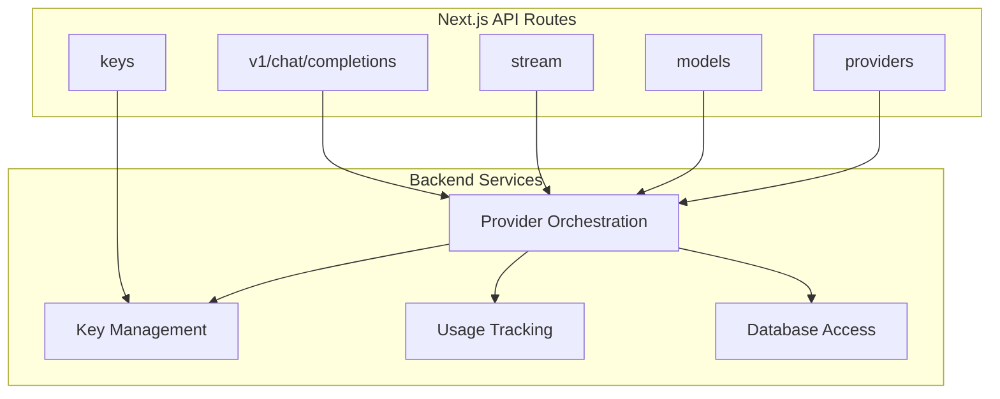

[No sources needed since this diagram shows conceptual workflow, not actual code structure]

## Core Components
- Provider Orchestration: Centralizes request routing, normalization, retries/fallbacks, and cost/usage accounting.
- Key Management: Stores and rotates vendor credentials per tenant/user.
- Usage Tracking: Records token counts, latency, errors, and costs per request.
- Database Access: Persists keys, usage logs, and provider metadata.
- API Routes: Expose standardized endpoints (chat completions, streaming, models, providers, keys).

**Section sources**
- [providers.ts](file://backend/src/providers.ts)
- [keys.ts](file://backend/src/keys.ts)
- [usage.ts](file://backend/src/usage.ts)
- [db.ts](file://backend/src/db.ts)
- [index.ts](file://backend/src/index.ts)

## Architecture Overview
The abstraction layer normalizes incoming requests into a common internal format, selects an appropriate provider based on configuration and availability, transforms responses back to a unified schema, and records usage/cost metrics.

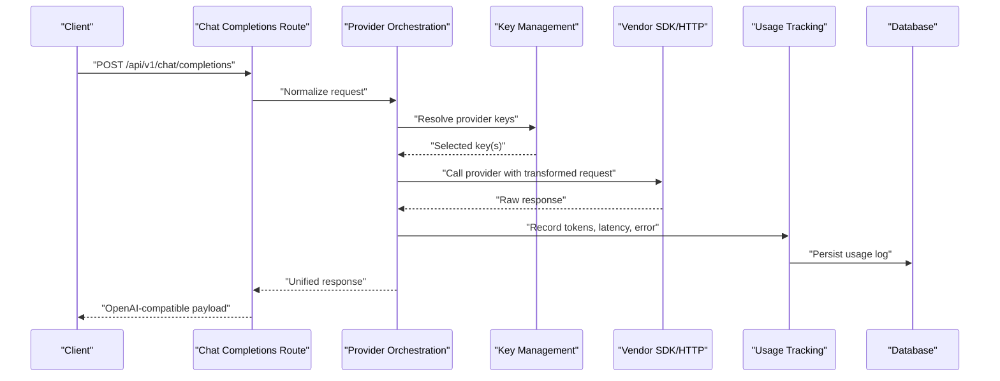

**Diagram sources**
- [route.ts](file://src/app/api/v1/chat/completions/route.ts)
- [providers.ts](file://backend/src/providers.ts)
- [keys.ts](file://backend/src/keys.ts)
- [usage.ts](file://backend/src/usage.ts)
- [db.ts](file://backend/src/db.ts)

## Detailed Component Analysis

### Provider Interface Design
The abstraction defines a minimal contract for each provider implementation:
- Identify the provider by a stable ID
- Accept normalized input and return a normalized output
- Support optional streaming
- Report usage metrics (tokens, latency) and errors consistently
- Provide capability metadata (supported parameters, model list)

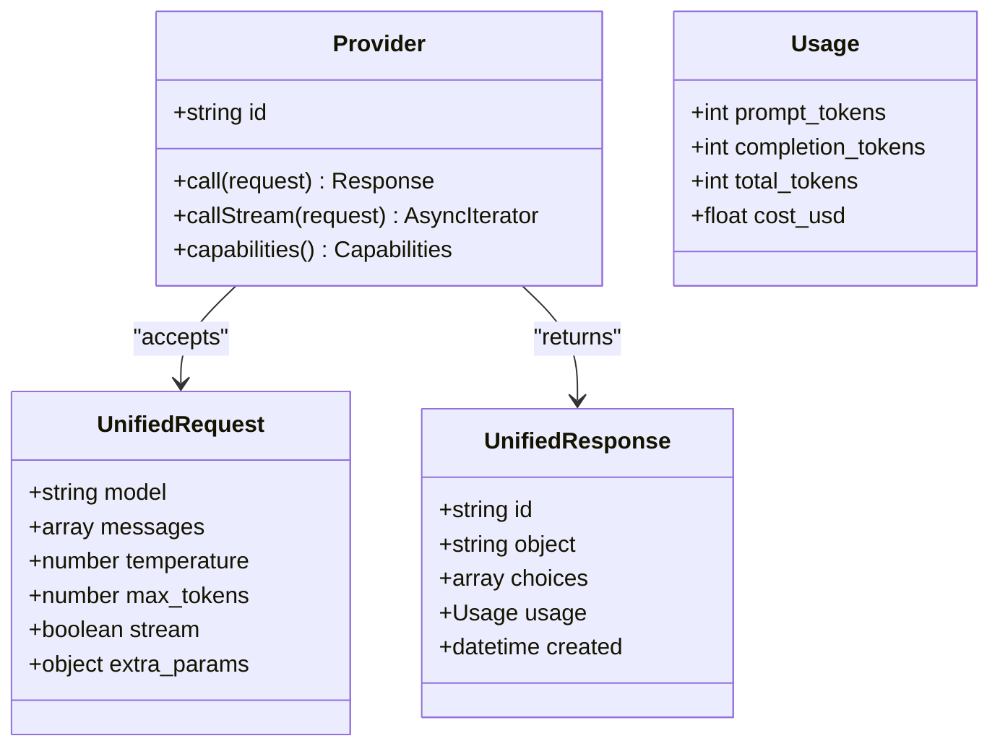

**Diagram sources**
- [providers.ts](file://backend/src/providers.ts)

**Section sources**
- [providers.ts](file://backend/src/providers.ts)

### Request/Response Transformation
- Incoming requests are validated and mapped to a canonical internal shape.
- Provider-specific options are extracted and translated into vendor SDK calls.
- Responses are normalized to a consistent schema including choices, usage, and timestamps.
- Streaming responses are converted to server-sent events or chunked payloads as required by the route.

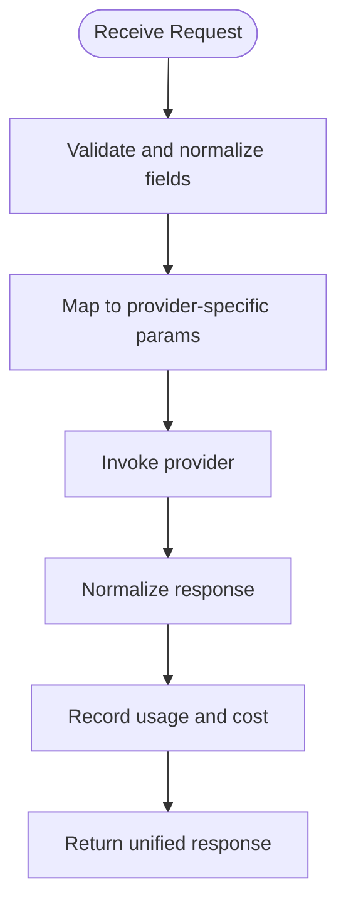

**Diagram sources**
- [providers.ts](file://backend/src/providers.ts)
- [route.ts](file://src/app/api/v1/chat/completions/route.ts)

**Section sources**
- [providers.ts](file://backend/src/providers.ts)
- [route.ts](file://src/app/api/v1/chat/completions/route.ts)

### Unified API Format
The external API follows an OpenAI-compatible shape for chat completions:
- Endpoint: POST /api/v1/chat/completions
- Request fields include model, messages, temperature, max_tokens, and stream flag.
- Response includes id, object type, choices array, usage summary, and created timestamp.
- Streaming mode returns incremental chunks until completion.

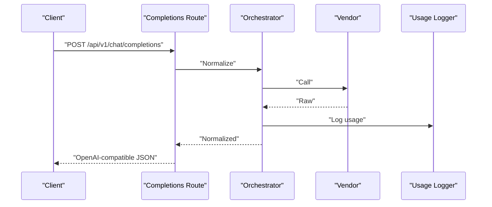

**Diagram sources**
- [route.ts](file://src/app/api/v1/chat/completions/route.ts)
- [providers.ts](file://backend/src/providers.ts)
- [usage.ts](file://backend/src/usage.ts)

**Section sources**
- [route.ts](file://src/app/api/v1/chat/completions/route.ts)

### Adding a New Provider
To integrate a new vendor:
- Implement the provider contract with call and optional callStream methods.
- Map provider capabilities and supported models.
- Register the provider with the orchestrator so it can be selected by model or policy.
- Ensure usage metrics are reported consistently.

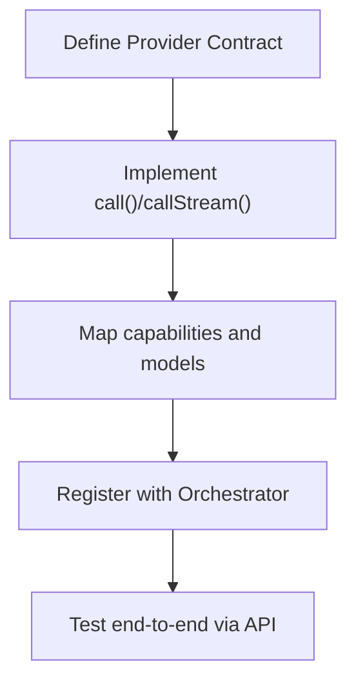

**Diagram sources**
- [providers.ts](file://backend/src/providers.ts)

**Section sources**
- [providers.ts](file://backend/src/providers.ts)

### Configuration Management
- Provider credentials are stored securely and resolved at runtime per request.
- Keys are associated with tenants/users and can be rotated without downtime.
- Model selection can be driven by configuration or dynamic policies.

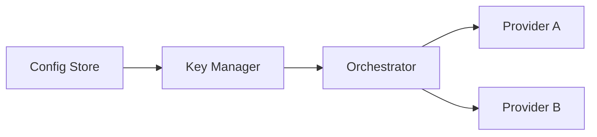

**Diagram sources**
- [keys.ts](file://backend/src/keys.ts)
- [providers.ts](file://backend/src/providers.ts)

**Section sources**
- [keys.ts](file://backend/src/keys.ts)
- [providers.ts](file://backend/src/providers.ts)

### Fallback Mechanisms
- On failure, the orchestrator can retry with alternative keys or switch to a secondary provider.
- Fallback policies consider model availability, error types, and cost constraints.
- Failures are logged with context for observability and alerting.

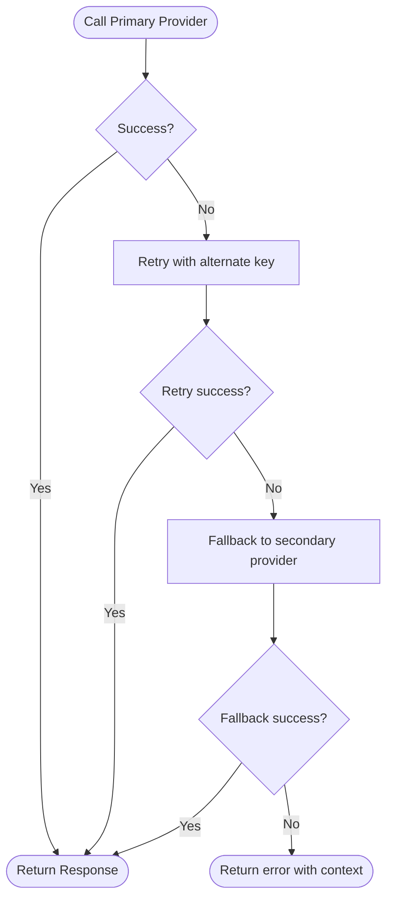

**Diagram sources**
- [providers.ts](file://backend/src/providers.ts)

**Section sources**
- [providers.ts](file://backend/src/providers.ts)

### Cost Tracking and Usage Monitoring
- Each request records prompt tokens, completion tokens, total tokens, latency, and estimated cost.
- Logs are persisted for billing, analytics, and quota enforcement.
- Aggregations support dashboards and alerts.

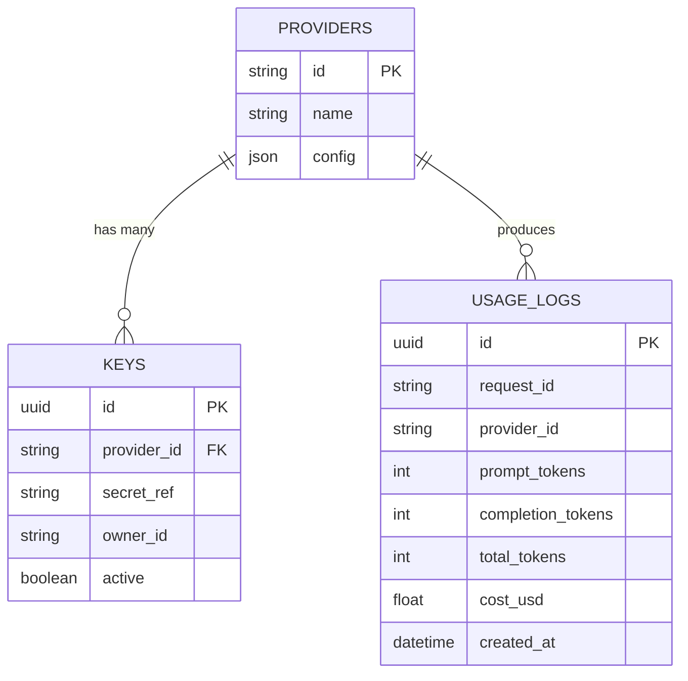

**Diagram sources**
- [usage.ts](file://backend/src/usage.ts)
- [db.ts](file://backend/src/db.ts)
- [keys.ts](file://backend/src/keys.ts)

**Section sources**
- [usage.ts](file://backend/src/usage.ts)
- [db.ts](file://backend/src/db.ts)
- [keys.ts](file://backend/src/keys.ts)

### Performance Optimization Strategies
- Connection pooling and keep-alive for HTTP clients.
- Request batching where supported by providers.
- Adaptive timeouts and circuit breakers to avoid cascading failures.
- Caching static model lists and capability metadata.
- Parallel fan-out for non-dependent operations (e.g., logging after response).

[No sources needed since this section provides general guidance]

### Handling Provider-Specific Features and Limitations
- Capability negotiation: query provider capabilities before sending unsupported parameters.
- Parameter translation: map canonical fields to vendor-specific equivalents.
- Rate limiting: respect provider quotas and implement backoff.
- Feature flags: enable/disable features per provider based on availability.

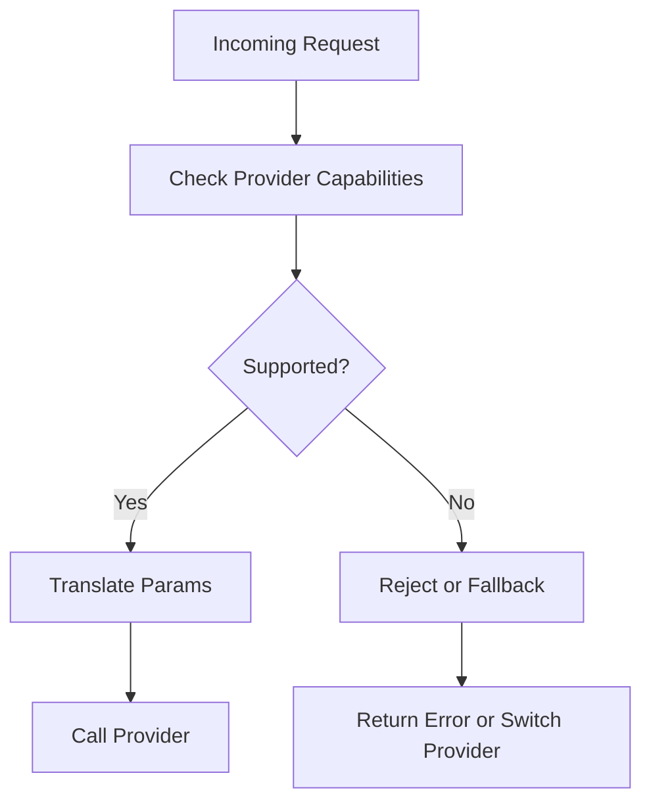

**Diagram sources**
- [providers.ts](file://backend/src/providers.ts)

**Section sources**
- [providers.ts](file://backend/src/providers.ts)

### API Endpoints Reference

#### Chat Completions
- Method: POST
- Path: /api/v1/chat/completions
- Purpose: Send normalized chat requests and receive unified responses.
- Supports streaming mode.

**Section sources**
- [route.ts](file://src/app/api/v1/chat/completions/route.ts)

#### Streaming
- Method: POST
- Path: /api/stream
- Purpose: Stream incremental responses from providers.

**Section sources**
- [route.ts](file://src/app/api/stream/route.ts)

#### Models Listing
- Method: GET
- Path: /api/models
- Purpose: List available models across configured providers.

**Section sources**
- [route.ts](file://src/app/api/models/route.ts)

#### Providers Management
- Methods: GET, POST
- Paths: /api/providers, /api/providers/:id
- Purpose: Manage provider configurations and capabilities.

**Section sources**
- [route.ts](file://src/app/api/providers/route.ts)
- [route.ts](file://src/app/api/providers/[id]/route.ts)

#### Keys Management
- Methods: GET, POST, DELETE
- Paths: /api/keys, /api/keys/:id
- Purpose: Create, list, and delete provider credentials.

**Section sources**
- [route.ts](file://src/app/api/keys/route.ts)
- [route.ts](file://src/app/api/keys/[id]/route.ts)

## Dependency Analysis
The following diagram maps key dependencies between backend services and API routes.

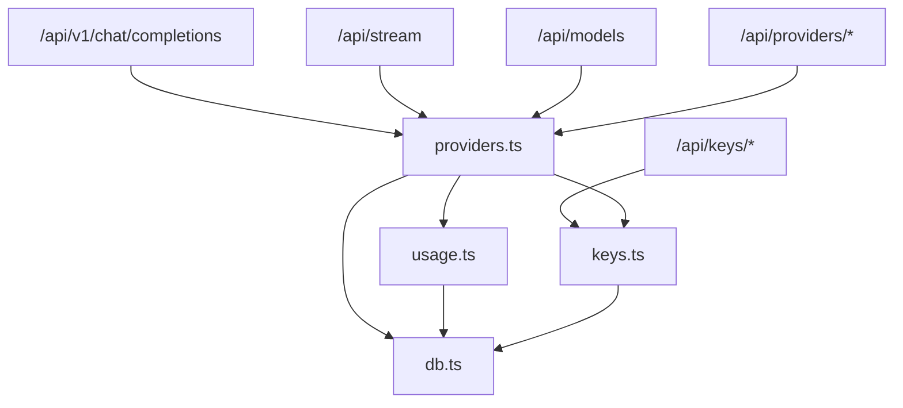

**Diagram sources**
- [route.ts](file://src/app/api/v1/chat/completions/route.ts)
- [route.ts](file://src/app/api/stream/route.ts)
- [route.ts](file://src/app/api/models/route.ts)
- [route.ts](file://src/app/api/providers/route.ts)
- [route.ts](file://src/app/api/providers/[id]/route.ts)
- [route.ts](file://src/app/api/keys/route.ts)
- [route.ts](file://src/app/api/keys/[id]/route.ts)
- [providers.ts](file://backend/src/providers.ts)
- [keys.ts](file://backend/src/keys.ts)
- [usage.ts](file://backend/src/usage.ts)
- [db.ts](file://backend/src/db.ts)

**Section sources**
- [providers.ts](file://backend/src/providers.ts)
- [keys.ts](file://backend/src/keys.ts)
- [usage.ts](file://backend/src/usage.ts)
- [db.ts](file://backend/src/db.ts)
- [index.ts](file://backend/src/index.ts)

## Performance Considerations
- Prefer connection reuse and HTTP keep-alive for provider clients.
- Use timeouts and cancellation to prevent long-running requests from blocking resources.
- Apply rate limiting and exponential backoff when calling providers.
- Cache read-only data such as model catalogs and capability descriptors.
- Batch logging and metrics updates to reduce I/O overhead.

[No sources needed since this section provides general guidance]

## Troubleshooting Guide
Common issues and diagnostics:
- Authentication failures: verify key validity and rotation status.
- Model not found: ensure the requested model is registered and enabled for the selected provider.
- Rate limits exceeded: check provider quotas and adjust retry/backoff settings.
- Streaming interruptions: inspect network stability and server-side timeout configuration.
- High latency: review provider health, regional routing, and caching effectiveness.

Operational checks:
- Inspect usage logs for token counts and error rates.
- Validate provider capability mappings for parameter compatibility.
- Confirm fallback policies trigger correctly under failure conditions.

**Section sources**
- [usage.ts](file://backend/src/usage.ts)
- [providers.ts](file://backend/src/providers.ts)
- [keys.ts](file://backend/src/keys.ts)

## Conclusion
The provider abstraction layer standardizes multi-vendor AI integrations behind a unified API. By centralizing request normalization, response mapping, credential management, and usage tracking, it simplifies adding new providers, supports robust fallbacks, and enables cost-aware routing. With clear interfaces and well-defined endpoints, teams can extend the system efficiently while maintaining consistent behavior and observability.

## Appendices

### Example: Implementing a Custom Provider
Steps:
- Define a provider class implementing the core contract.
- Implement call and callStream methods with proper error handling.
- Map canonical parameters to provider-specific formats.
- Report usage metrics consistently.
- Register the provider and configure model routing.

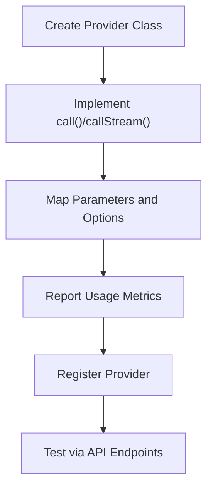

**Diagram sources**
- [providers.ts](file://backend/src/providers.ts)

**Section sources**
- [providers.ts](file://backend/src/providers.ts)