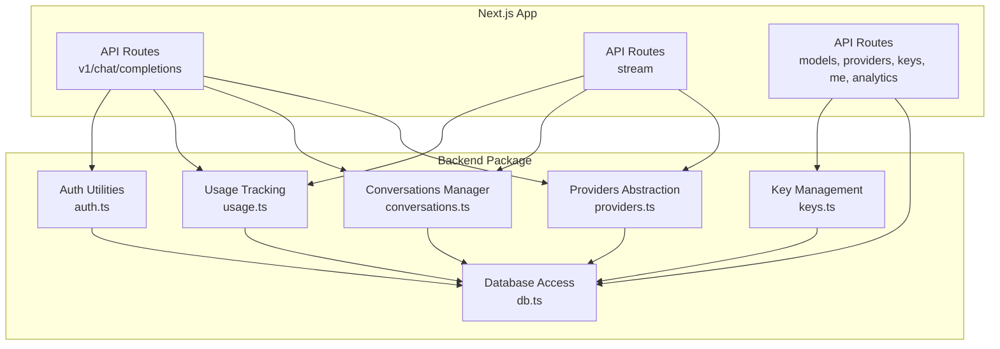
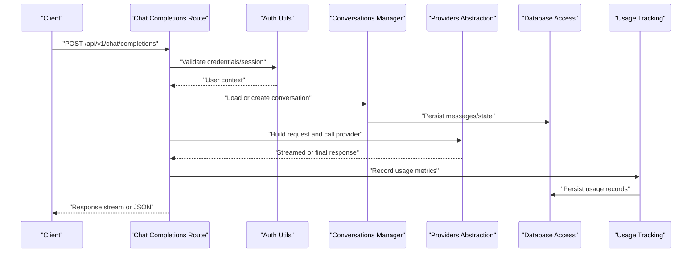
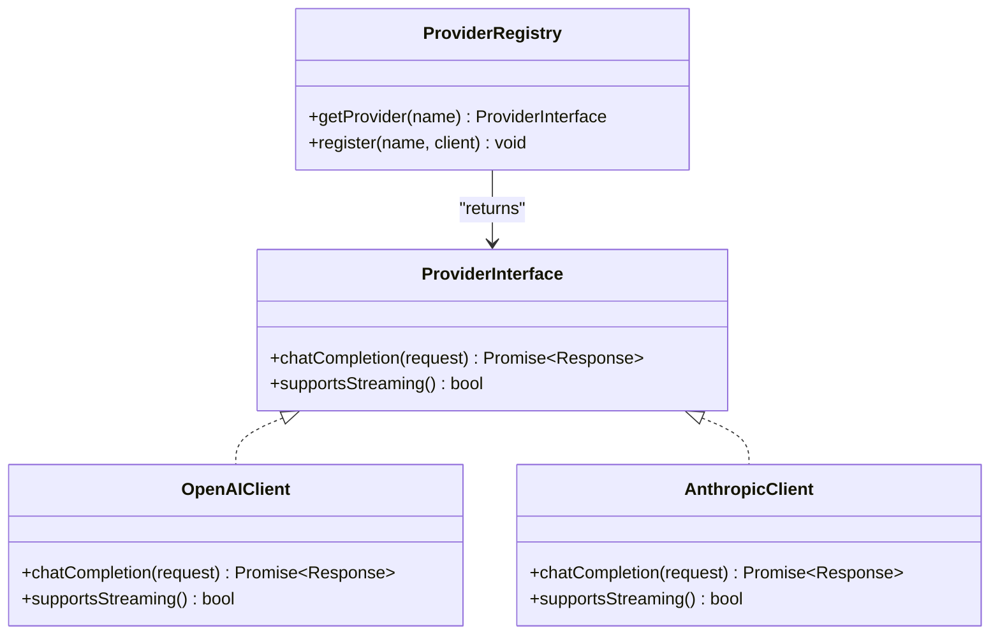
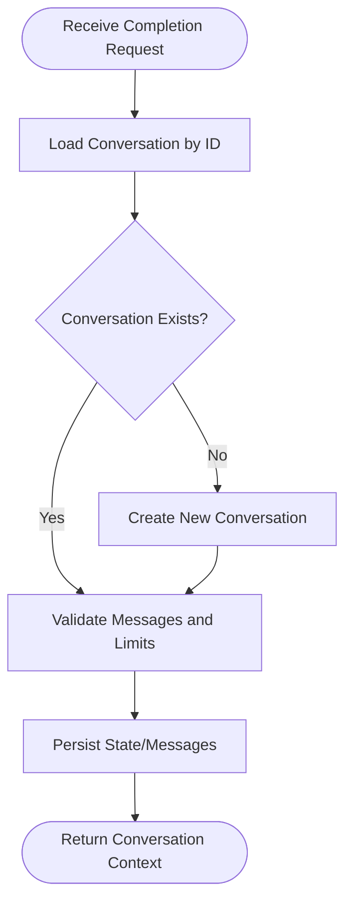
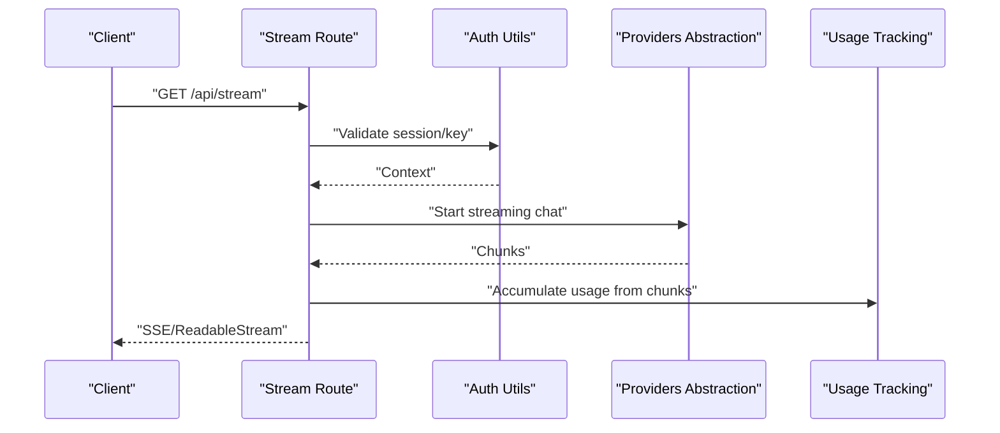
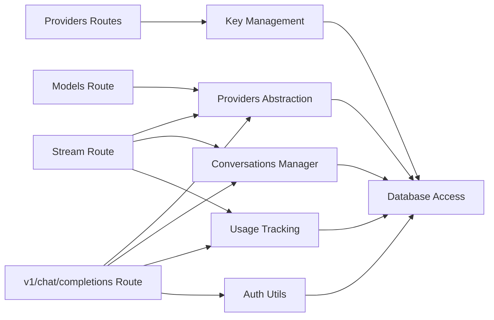

# Service Layer Design

<cite>
**Referenced Files in This Document**
- [index.ts](file://backend/src/index.ts)
- [auth.ts](file://backend/src/auth.ts)
- [conversations.ts](file://backend/src/conversations.ts)
- [db.ts](file://backend/src/db.ts)
- [keys.ts](file://backend/src/keys.ts)
- [providers.ts](file://backend/src/providers.ts)
- [usage.ts](file://backend/src/usage.ts)
- [route.ts](file://src/app/api/v1/chat/completions/route.ts)
- [route.ts](file://src/app/api/stream/route.ts)
- [route.ts](file://src/app/api/models/route.ts)
- [route.ts](file://src/app/api/providers/route.ts)
- [route.ts](file://src/app/api/providers/[id]/route.ts)
- [route.ts](file://src/app/api/keys/route.ts)
- [route.ts](file://src/app/api/keys/[id]/route.ts)
- [route.ts](file://src/app/api/me/route.ts)
- [route.ts](file://src/app/api/analytics/route.ts)
</cite>

## Table of Contents
1. [Introduction](#introduction)
2. [Project Structure](#project-structure)
3. [Core Components](#core-components)
4. [Architecture Overview](#architecture-overview)
5. [Detailed Component Analysis](#detailed-component-analysis)
6. [Dependency Analysis](#dependency-analysis)
7. [Performance Considerations](#performance-considerations)
8. [Troubleshooting Guide](#troubleshooting-guide)
9. [Conclusion](#conclusion)

## Introduction
This document describes the backend service layer design for a multi-provider AI chat platform. It focuses on:
- Service-oriented architecture patterns and module organization
- Provider abstraction layer supporting multiple AI backends (e.g., OpenAI, Anthropic)
- Conversation management, request routing, and response handling
- Error handling strategies, logging, and monitoring approaches

The system is implemented as a Next.js application with API routes that orchestrate requests to provider-specific implementations via an abstraction layer. A small Node/Bun backend package provides shared utilities and integrations.

## Project Structure
At a high level:
- The Next.js app exposes REST endpoints under src/app/api. These endpoints implement routing, authentication, validation, and orchestration logic.
- The backend package under backend/src contains reusable modules such as database access, provider abstractions, conversation state, usage tracking, and key management.

**Diagram sources**
- [route.ts](file://src/app/api/v1/chat/completions/route.ts)
- [route.ts](file://src/app/api/stream/route.ts)
- [route.ts](file://src/app/api/models/route.ts)
- [route.ts](file://src/app/api/providers/route.ts)
- [route.ts](file://src/app/api/providers/[id]/route.ts)
- [route.ts](file://src/app/api/keys/route.ts)
- [route.ts](file://src/app/api/keys/[id]/route.ts)
- [route.ts](file://src/app/api/me/route.ts)
- [route.ts](file://src/app/api/analytics/route.ts)
- [providers.ts](file://backend/src/providers.ts)
- [conversations.ts](file://backend/src/conversations.ts)
- [db.ts](file://backend/src/db.ts)
- [usage.ts](file://backend/src/usage.ts)
- [auth.ts](file://backend/src/auth.ts)
- [keys.ts](file://backend/src/keys.ts)

**Section sources**
- [index.ts](file://backend/src/index.ts)
- [route.ts](file://src/app/api/v1/chat/completions/route.ts)
- [route.ts](file://src/app/api/stream/route.ts)
- [route.ts](file://src/app/api/models/route.ts)
- [route.ts](file://src/app/api/providers/route.ts)
- [route.ts](file://src/app/api/providers/[id]/route.ts)
- [route.ts](file://src/app/api/keys/route.ts)
- [route.ts](file://src/app/api/keys/[id]/route.ts)
- [route.ts](file://src/app/api/me/route.ts)
- [route.ts](file://src/app/api/analytics/route.ts)

## Core Components
- Providers Abstraction: Encapsulates provider-specific clients behind a unified interface. Enables pluggable backends like OpenAI and Anthropic.
- Conversations Manager: Maintains conversation context, message history, and lifecycle operations.
- Database Access: Centralized data access layer for persistence and configuration.
- Usage Tracking: Records token usage, costs, and quotas per user/provider/model.
- Auth Utilities: Validates tokens, sessions, or API keys and enforces authorization.
- Key Management: CRUD operations for provider API keys and their associations.

These components are consumed by API routes which handle HTTP concerns (parsing, validation, streaming, error mapping).

**Section sources**
- [providers.ts](file://backend/src/providers.ts)
- [conversations.ts](file://backend/src/conversations.ts)
- [db.ts](file://backend/src/db.ts)
- [usage.ts](file://backend/src/usage.ts)
- [auth.ts](file://backend/src/auth.ts)
- [keys.ts](file://backend/src/keys.ts)

## Architecture Overview
The service layer follows a provider-agnostic design:
- API routes act as controllers: they authenticate, validate input, route to services, and format responses.
- Services encapsulate business logic: conversation management, usage accounting, and provider calls.
- The provider abstraction isolates vendor specifics, allowing new providers to be added without changing callers.

**Diagram sources**
- [route.ts](file://src/app/api/v1/chat/completions/route.ts)
- [auth.ts](file://backend/src/auth.ts)
- [conversations.ts](file://backend/src/conversations.ts)
- [providers.ts](file://backend/src/providers.ts)
- [db.ts](file://backend/src/db.ts)
- [usage.ts](file://backend/src/usage.ts)

## Detailed Component Analysis

### Provider Abstraction Layer
Responsibilities:
- Define a uniform interface for chat completions across providers.
- Normalize request payloads and responses.
- Handle provider-specific configuration (base URLs, headers, auth).
- Support both streaming and non-streaming modes.

Design considerations:
- Strategy pattern: each provider implements the same interface.
- Factory or registry: selects the active provider based on configuration or request attributes.
- Error normalization: maps provider errors to common error shapes.

**Diagram sources**
- [providers.ts](file://backend/src/providers.ts)

**Section sources**
- [providers.ts](file://backend/src/providers.ts)

### Conversation Management Service
Responsibilities:
- Create, load, update, and delete conversations.
- Append messages and manage context windows.
- Persist conversation state and metadata.

Data flow:
- API route receives a completion request with conversation ID.
- Service loads existing messages, validates constraints, and persists updates.
- For streaming, it may yield partial messages while maintaining state consistency.

**Diagram sources**
- [conversations.ts](file://backend/src/conversations.ts)
- [db.ts](file://backend/src/db.ts)

**Section sources**
- [conversations.ts](file://backend/src/conversations.ts)
- [db.ts](file://backend/src/db.ts)

### Request Routing and Response Handling
Routing responsibilities:
- Parse and validate incoming requests.
- Enforce authentication and authorization.
- Select appropriate provider and mode (stream vs. non-stream).
- Map provider responses to consistent formats.

Response handling:
- For streaming endpoints, forward provider streams to the client with proper headers.
- For non-streaming, aggregate responses and return JSON.

**Diagram sources**
- [route.ts](file://src/app/api/stream/route.ts)
- [auth.ts](file://backend/src/auth.ts)
- [providers.ts](file://backend/src/providers.ts)
- [usage.ts](file://backend/src/usage.ts)

**Section sources**
- [route.ts](file://src/app/api/stream/route.ts)
- [route.ts](file://src/app/api/v1/chat/completions/route.ts)

### Authentication and Authorization
Responsibilities:
- Verify API keys or session tokens.
- Attach user context to requests.
- Gate access to protected resources (keys, analytics).

Integration points:
- Used by all API routes before invoking services.
- May read from database or external identity store.

**Section sources**
- [auth.ts](file://backend/src/auth.ts)
- [route.ts](file://src/app/api/me/route.ts)
- [route.ts](file://src/app/api/keys/route.ts)
- [route.ts](file://src/app/api/keys/[id]/route.ts)

### Key Management
Responsibilities:
- Store and rotate provider API keys securely.
- Associate keys with users or tenants.
- Provide safe retrieval for provider initialization.

Operations:
- Create, list, update, delete keys.
- Validate key format and scope.

**Section sources**
- [keys.ts](file://backend/src/keys.ts)
- [route.ts](file://src/app/api/keys/route.ts)
- [route.ts](file://src/app/api/keys/[id]/route.ts)

### Models and Providers Listing
Responsibilities:
- Expose available models and configured providers.
- Cache or fetch model catalogs from providers when needed.

Endpoints:
- List models.
- Manage provider configurations.

**Section sources**
- [route.ts](file://src/app/api/models/route.ts)
- [route.ts](file://src/app/api/providers/route.ts)
- [route.ts](file://src/app/api/providers/[id]/route.ts)

### Analytics and Usage Metrics
Responsibilities:
- Aggregate usage data (tokens, latency, cost).
- Serve dashboards and export metrics.

Integration:
- Consumed by usage tracking after each completion.
- Stored in database for querying.

**Section sources**
- [usage.ts](file://backend/src/usage.ts)
- [route.ts](file://src/app/api/analytics/route.ts)

## Dependency Analysis
High-level dependencies between modules:
- API routes depend on auth, conversations, providers, usage, and db.
- Providers abstraction depends on db for configuration and keys.
- Conversations manager depends on db for persistence.
- Usage tracking depends on db for recording metrics.

**Diagram sources**
- [route.ts](file://src/app/api/v1/chat/completions/route.ts)
- [route.ts](file://src/app/api/stream/route.ts)
- [route.ts](file://src/app/api/models/route.ts)
- [route.ts](file://src/app/api/providers/route.ts)
- [route.ts](file://src/app/api/keys/route.ts)
- [providers.ts](file://backend/src/providers.ts)
- [conversations.ts](file://backend/src/conversations.ts)
- [usage.ts](file://backend/src/usage.ts)
- [auth.ts](file://backend/src/auth.ts)
- [keys.ts](file://backend/src/keys.ts)
- [db.ts](file://backend/src/db.ts)

**Section sources**
- [providers.ts](file://backend/src/providers.ts)
- [conversations.ts](file://backend/src/conversations.ts)
- [usage.ts](file://backend/src/usage.ts)
- [auth.ts](file://backend/src/auth.ts)
- [keys.ts](file://backend/src/keys.ts)
- [db.ts](file://backend/src/db.ts)

## Performance Considerations
- Streaming: Prefer streaming endpoints for long-running LLM calls to reduce perceived latency and improve UX.
- Connection pooling: Ensure database connections are pooled and reused across requests.
- Caching: Cache provider model lists and frequently accessed configuration to reduce overhead.
- Backpressure: Respect upstream provider rate limits and implement retries with exponential backoff.
- Memory: Avoid buffering large responses; process chunks incrementally.

[No sources needed since this section provides general guidance]

## Troubleshooting Guide
Common issues and strategies:
- Authentication failures: Validate token/key format and expiration; log minimal sensitive details.
- Provider errors: Normalize errors into a common shape; include provider name, code, and message.
- Rate limiting: Detect 429 responses and apply retry/backoff; surface clear errors to clients.
- Database connectivity: Monitor connection health and fail fast with actionable messages.
- Logging and tracing: Add structured logs around request boundaries, provider calls, and usage recording.

Operational tips:
- Use correlation IDs to trace requests across services.
- Record usage deltas even on partial failures to maintain accurate billing.
- Surface detailed diagnostics only in development; sanitize in production.

**Section sources**
- [auth.ts](file://backend/src/auth.ts)
- [providers.ts](file://backend/src/providers.ts)
- [usage.ts](file://backend/src/usage.ts)
- [db.ts](file://backend/src/db.ts)

## Conclusion
The service layer adopts a clean separation of concerns: API routes handle HTTP concerns, services encapsulate business logic, and a provider abstraction enables multi-vendor support. With robust conversation management, usage tracking, and secure key management, the system scales to additional providers and features while maintaining clarity and reliability.

[No sources needed since this section summarizes without analyzing specific files]