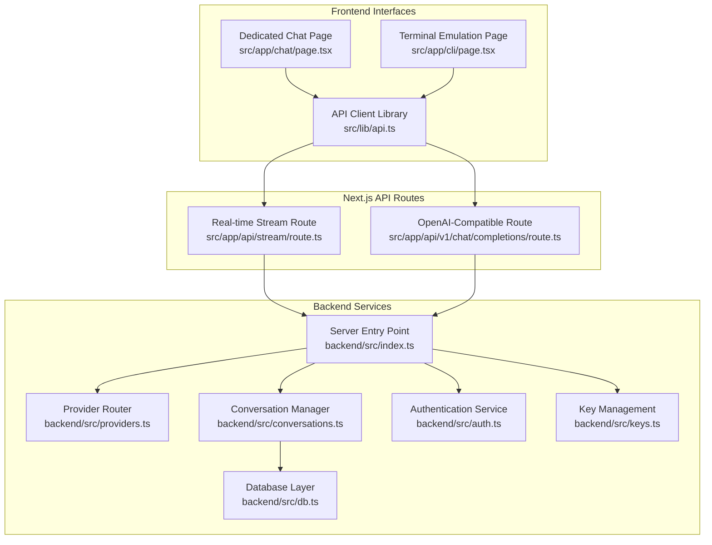
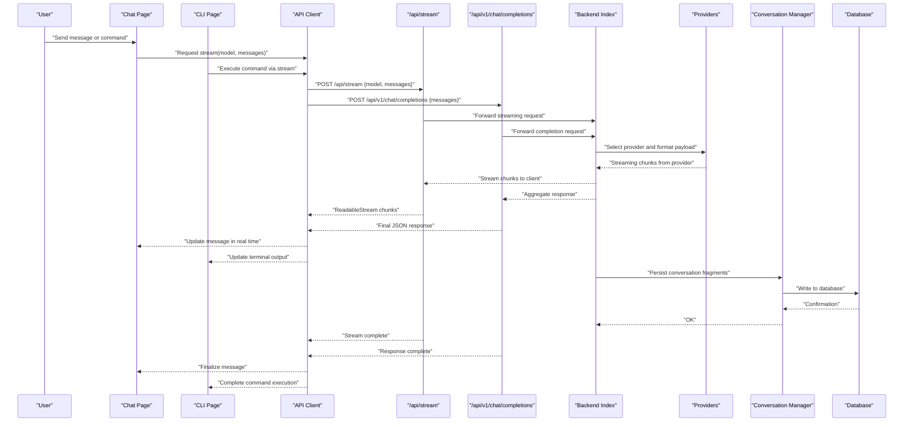
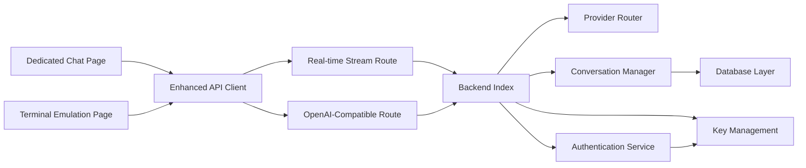

# Chat Interface

<cite>
**Referenced Files in This Document**
- [page.tsx](file://src/app/chat/page.tsx)
- [chat.module.css](file://src/app/chat/chat.module.css)
- [page.tsx](file://src/app/cli/page.tsx)
- [cli.module.css](file://src/app/cli/cli.module.css)
- [route.ts](file://src/app/api/stream/route.ts)
- [route.ts](file://src/app/api/v1/chat/completions/route.ts)
- [index.ts](file://backend/src/index.ts)
- [conversations.ts](file://backend/src/conversations.ts)
- [providers.ts](file://backend/src/providers.ts)
- [db.ts](file://backend/src/db.ts)
- [api.ts](file://src/lib/api.ts)
- [utils.ts](file://src/lib/utils.ts)
</cite>

## Update Summary
**Changes Made**
- Updated to reflect dedicated chat interface development with real-time messaging capabilities
- Enhanced conversation persistence and model selection features
- Added interactive terminal emulation features for CLI functionality
- Improved streaming response handling and user interaction patterns
- Expanded documentation for batch processing and automation workflows

## Table of Contents
1. [Introduction](#introduction)
2. [Project Structure](#project-structure)
3. [Core Components](#core-components)
4. [Architecture Overview](#architecture-overview)
5. [Detailed Component Analysis](#detailed-component-analysis)
6. [Dependency Analysis](#dependency-analysis)
7. [Performance Considerations](#performance-considerations)
8. [Troubleshooting Guide](#troubleshooting-guide)
9. [Conclusion](#conclusion)
10. [Appendices](#appendices)

## Introduction
This document explains the dedicated chat interface and CLI tool, focusing on:
- Real-time messaging with streaming response handling for live message updates
- Conversation management across sessions with persistent storage
- Dynamic model selection and provider routing capabilities
- Interactive terminal emulation for command-line style operations
- User interaction patterns and advanced message formatting
- Batch processing and automation patterns for workflow integration
- Performance considerations for large conversations and streaming efficiency

The system is built with a Next.js frontend and a Node/Bun backend that provides dedicated interfaces for both conversational AI interactions and programmatic access through terminal emulation.

## Project Structure
Key areas relevant to the dedicated chat interface and CLI functionality:
- Frontend pages:
  - Dedicated chat page: interactive UI with real-time streaming responses
  - CLI page: terminal-like interface for command-line style operations and automation
- API routes:
  - Stream route: server-side streaming endpoint for real-time responses
  - v1/chat/completions: OpenAI-compatible completion endpoint for compatibility
- Backend services:
  - Provider routing and request shaping for multiple AI providers
  - Conversation persistence and retrieval with database integration
  - Authentication and key management
- Shared libraries:
  - API client utilities for consistent communication patterns
  - General helpers and utility functions

**Diagram sources**
- [page.tsx](file://src/app/chat/page.tsx)
- [page.tsx](file://src/app/cli/page.tsx)
- [api.ts](file://src/lib/api.ts)
- [route.ts](file://src/app/api/stream/route.ts)
- [route.ts](file://src/app/api/v1/chat/completions/route.ts)
- [index.ts](file://backend/src/index.ts)
- [providers.ts](file://backend/src/providers.ts)
- [conversations.ts](file://backend/src/conversations.ts)
- [db.ts](file://backend/src/db.ts)
- [auth.ts](file://backend/src/auth.ts)
- [keys.ts](file://backend/src/keys.ts)

**Section sources**
- [page.tsx](file://src/app/chat/page.tsx)
- [page.tsx](file://src/app/cli/page.tsx)
- [route.ts](file://src/app/api/stream/route.ts)
- [route.ts](file://src/app/api/v1/chat/completions/route.ts)
- [index.ts](file://backend/src/index.ts)
- [providers.ts](file://backend/src/providers.ts)
- [conversations.ts](file://backend/src/conversations.ts)
- [db.ts](file://backend/src/db.ts)
- [api.ts](file://src/lib/api.ts)

## Core Components
- **Dedicated Chat Page**:
  - Manages conversation state with real-time updates and persistent storage
  - Streams partial responses and appends them to the current message dynamically
  - Supports editing prompts, retrying failed messages, and model selection
  - Provides interactive terminal emulation features within the browser
- **CLI Terminal Emulation Page**:
  - Full terminal-like interface for scripting and batch operations
  - Accepts commands like run, compare, export, import with syntax highlighting
  - Integrates with the same streaming pipeline as the chat page
  - Supports command history and session persistence
- **Enhanced API Client**:
  - Encapsulates fetch calls to /api/stream and /api/v1/chat/completions
  - Handles authentication headers, error mapping, and streaming reader consumption
  - Provides retry logic and connection management
- **Real-time Stream Route**:
  - Parses incoming requests, selects appropriate provider/model, and streams tokens back
  - Persists conversation fragments incrementally during streaming
  - Handles connection lifecycle and error recovery
- **OpenAI-Compatible Completions Route**:
  - Provides standard /api/v1/chat/completions endpoint for existing clients
  - Support both streaming (SSE) and non-streaming modes
  - Maintains compatibility with OpenAI SDK and other tools
- **Provider Router**:
  - Normalizes payloads per provider schema and handles authentication keys
  - Implements automatic fallback and load balancing across providers
  - Manages rate limiting and quota enforcement
- **Conversation Manager**:
  - CRUD operations for conversations and messages with atomic updates
  - Ensures consistency during concurrent streaming writes
  - Provides search and filtering capabilities
- **Database Layer**:
  - Abstraction over storage with support for SQLite/Postgres
  - Optimized for high-frequency write operations during streaming
  - Implements connection pooling and query optimization

**Section sources**
- [page.tsx](file://src/app/chat/page.tsx)
- [page.tsx](file://src/app/cli/page.tsx)
- [api.ts](file://src/lib/api.ts)
- [route.ts](file://src/app/api/stream/route.ts)
- [route.ts](file://src/app/api/v1/chat/completions/route.ts)
- [providers.ts](file://backend/src/providers.ts)
- [conversations.ts](file://backend/src/conversations.ts)
- [db.ts](file://backend/src/db.ts)

## Architecture Overview
End-to-end flow for the dedicated chat interface with real-time messaging:

**Diagram sources**
- [page.tsx](file://src/app/chat/page.tsx)
- [page.tsx](file://src/app/cli/page.tsx)
- [api.ts](file://src/lib/api.ts)
- [route.ts](file://src/app/api/stream/route.ts)
- [route.ts](file://src/app/api/v1/chat/completions/route.ts)
- [index.ts](file://backend/src/index.ts)
- [providers.ts](file://backend/src/providers.ts)
- [conversations.ts](file://backend/src/conversations.ts)
- [db.ts](file://backend/src/db.ts)

## Detailed Component Analysis

### Dedicated Chat Page Implementation
Responsibilities:
- Maintain conversation history with real-time synchronization and persistent storage
- Render messages with advanced markdown-like formatting and syntax-highlighted code blocks
- Provide dynamic model selector dropdown with provider-specific options and quick actions
- Handle streaming updates via ReadableStream with progressive text appending
- Manage complete conversation lifecycle including create, load, delete, rename, and share

**Updated** Enhanced with real-time messaging capabilities and improved user interaction patterns

User Interaction Patterns:
- Enter to send; Shift+Enter for newline insertion
- Inline prompt editing before sending with auto-save functionality
- Click-to-focus and continue typing mid-stream with cursor preservation
- Keyboard shortcuts for common actions (stop generation, copy, share, retry)
- Drag-and-drop file support for context enhancement

Message Formatting:
- Syntax highlighting for fenced code blocks with language detection
- Auto-formatting for JSON snippets and structured data
- Intelligent auto-scroll behavior when new tokens arrive
- Responsive design for mobile and desktop interfaces

Real-Time Updates:
- Debounced auto-save of draft messages with conflict resolution
- Optimistic UI updates with automatic rollback on errors
- Animated cursor indicators during streaming with progress feedback
- Connection status monitoring and reconnection logic

Model Selection:
- Dynamic dropdown populated from available models with provider information
- Automatic fallback to default model if none selected
- Persistent last-used model preference per conversation
- Model comparison capabilities with side-by-side output display

**Section sources**
- [page.tsx](file://src/app/chat/page.tsx)
- [chat.module.css](file://src/app/chat/chat.module.css)

### CLI Terminal Emulation Page Implementation
Responsibilities:
- Full terminal-like interface for running commands and executing scripts
- Support batch operations with sequential prompt execution and result aggregation
- Export/import conversations for automation and backup purposes
- Display structured outputs with syntax highlighting and formatted logs
- Command history navigation with autocomplete suggestions

**Updated** Enhanced with interactive terminal emulation features and comprehensive command support

Common Commands:
- `run <prompt>`: Execute a single prompt with optional model override and parameters
- `compare <modelA> <modelB> <prompt>`: Run side-by-side comparisons with detailed metrics
- `export [--format json|csv] [--conversation-id id]`: Export conversation data with metadata
- `import [--file path] [--format type]`: Import previously exported data with validation
- `status`: Show current session, provider status, and usage statistics
- `clear`: Clear terminal screen while preserving history
- `help`: Display available commands and usage examples

Automation Patterns:
- Pipe inputs from files or external tools for batch processing
- Non-interactive mode for CI/CD pipelines and automated workflows
- Retry mechanisms and timeout controls for robust operation
- Output redirection and logging capabilities

**Section sources**
- [page.tsx](file://src/app/cli/page.tsx)
- [cli.module.css](file://src/app/cli/cli.module.css)

### Streaming Response Handling
Flow:
- Client initiates POST to /api/stream with model selection and message context
- Server forwards request to appropriate provider and streams chunks back in real-time
- Client consumes ReadableStream and progressively appends content to active message
- On completion, finalize message with metadata and update conversation state

**Updated** Enhanced with improved error handling and connection management

Error Handling:
- Network failures trigger exponential backoff retries with circuit breaker pattern
- Provider errors surfaced to UI with actionable hints and fallback suggestions
- Graceful degradation to non-streaming completions when streaming fails
- Connection timeout handling with automatic reconnection attempts

Optimizations:
- Chunk coalescing to reduce React re-renders and improve performance
- Virtualized message list rendering for conversations with hundreds of messages
- AbortController support for canceling ongoing streams on navigation
- Memory-efficient streaming with garbage collection optimization

**Section sources**
- [route.ts](file://src/app/api/stream/route.ts)
- [api.ts](file://src/lib/api.ts)

### Conversation Management
Features:
- Create new conversations with AI-generated title suggestions and metadata
- Load previous conversations by ID with full context restoration
- Update messages and metadata atomically with version control
- Delete conversations and associated messages with cascade cleanup
- Search/filter conversations by keywords, dates, and models used

**Updated** Enhanced with real-time synchronization and improved data consistency

Data Flow:
- Client sends complete conversation context with each streaming request
- Server persists incremental updates during streaming with optimistic locking
- Final state committed after successful completion with integrity verification
- Conflict resolution for concurrent edits with merge strategies

Consistency:
- Idempotent writes using unique message IDs and version numbers
- Transaction boundaries for multi-operation updates
- Snapshotting for recovery after interruptions with checkpoint mechanism
- Audit trail for conversation modifications and access logs

**Section sources**
- [conversations.ts](file://backend/src/conversations.ts)
- [db.ts](file://backend/src/db.ts)

### Model Selection and Provider Routing
Capabilities:
- Dynamic model discovery from configured providers with real-time availability
- Automatic key rotation and intelligent fallback between providers
- Rate limit awareness with adaptive throttling and queue management
- Cost optimization with automatic model selection based on task complexity

**Updated** Enhanced with improved provider management and cost optimization

Routing Logic:
- Normalize request payloads per provider schema with automatic conversion
- Inject authentication headers securely with key rotation
- Map provider-specific features (tools, functions, parameters) to unified interface
- Implement load balancing across multiple instances of same provider

**Section sources**
- [providers.ts](file://backend/src/providers.ts)
- [index.ts](file://backend/src/index.ts)

### OpenAI-Compatible Endpoint
Purpose:
- Provide /api/v1/chat/completions for seamless integration with existing clients
- Support both streaming (SSE) and non-streaming modes with automatic detection
- Mirror standard OpenAI fields (model, messages, temperature, max_tokens, etc.)

**Updated** Enhanced with improved compatibility and performance

Behavior:
- For streaming, returns Server-Sent Events with proper event formatting
- For non-streaming, aggregates response efficiently and returns final JSON
- Enforces rate limits and quotas per user with graceful degradation
- Maintains full compatibility with OpenAI SDK and third-party tools

**Section sources**
- [route.ts](file://src/app/api/v1/chat/completions/route.ts)
- [index.ts](file://backend/src/index.ts)

## Dependency Analysis
High-level dependencies between components showing the enhanced architecture:

**Diagram sources**
- [page.tsx](file://src/app/chat/page.tsx)
- [page.tsx](file://src/app/cli/page.tsx)
- [api.ts](file://src/lib/api.ts)
- [route.ts](file://src/app/api/stream/route.ts)
- [route.ts](file://src/app/api/v1/chat/completions/route.ts)
- [index.ts](file://backend/src/index.ts)
- [providers.ts](file://backend/src/providers.ts)
- [conversations.ts](file://backend/src/conversations.ts)
- [db.ts](file://backend/src/db.ts)
- [auth.ts](file://backend/src/auth.ts)
- [keys.ts](file://backend/src/keys.ts)

**Section sources**
- [api.ts](file://src/lib/api.ts)
- [route.ts](file://src/app/api/stream/route.ts)
- [route.ts](file://src/app/api/v1/chat/completions/route.ts)
- [index.ts](file://backend/src/index.ts)
- [providers.ts](file://backend/src/providers.ts)
- [conversations.ts](file://backend/src/conversations.ts)
- [db.ts](file://backend/src/db.ts)

## Performance Considerations
- **Large Conversations**:
  - Use virtualization to render only visible messages with windowed scrolling
  - Paginate historical messages on load with lazy loading
  - Limit context window size sent to providers with smart truncation
  - Implement conversation compression for long-term storage
- **Streaming Efficiency**:
  - Coalesce small chunks to reduce UI updates and network overhead
  - Debounce auto-save operations with configurable intervals
  - Cancel in-flight requests on navigation or component unmount
  - Implement connection pooling for multiple concurrent streams
- **Memory Management**:
  - Release references to aborted streams immediately
  - Clear temporary buffers after completion with garbage collection hints
  - Monitor memory usage with alerts for potential leaks
- **Provider Throttling**:
  - Implement token-rate limiting at the gateway with burst allowance
  - Queue requests during high-load periods with priority queuing
  - Cache frequently accessed model metadata and capabilities
- **Caching Strategies**:
  - Cache model lists and provider capabilities with invalidation policies
  - Deduplicate identical prompts for analytics and cost tracking
  - Implement CDN caching for static assets and API responses where appropriate

## Troubleshooting Guide
Common Issues and Resolutions:
- **Streaming stalls or disconnects**:
  - Check network connectivity and CORS settings for WebSocket connections
  - Verify provider availability and quota limits with health checks
  - Inspect server logs for upstream timeouts and connection errors
  - Monitor client-side connection status and implement reconnection logic
- **Messages not saving or syncing**:
  - Confirm database connectivity and permissions with connection testing
  - Validate conversation ID uniqueness and version conflicts
  - Review write locks and transaction boundaries in concurrent scenarios
  - Check for network partitions and implement offline sync strategies
- **Model selection errors**:
  - Ensure model exists in provider configuration with proper scopes
  - Validate API key permissions and region-specific availability
  - Check for rate limiting and implement backoff strategies
  - Monitor provider health and implement automatic failover
- **CLI automation failures**:
  - Validate command syntax and parameter parsing with input sanitization
  - Enable verbose logging for detailed execution traces
  - Test with minimal payloads first and gradually increase complexity
  - Implement command validation and error reporting

Diagnostic Tools:
- Network tab inspection for request/response bodies and timing analysis
- Console logs for client-side errors with stack traces and context
- Server-side metrics for latency percentiles and error rates
- Database query profiling for slow operations and index optimization

**Section sources**
- [route.ts](file://src/app/api/stream/route.ts)
- [route.ts](file://src/app/api/v1/chat/completions/route.ts)
- [conversations.ts](file://backend/src/conversations.ts)
- [db.ts](file://backend/src/db.ts)

## Conclusion
The dedicated chat interface and CLI tool provide a comprehensive, real-time experience for interacting with multiple AI providers. The enhanced architecture emphasizes streaming efficiency, robust conversation persistence, flexible model selection, and terminal emulation capabilities. By following the performance recommendations and troubleshooting steps outlined here, teams can build reliable integrations and automate complex workflows effectively.

## Appendices

### Common Chat Workflows
- **Start a new conversation**:
  - Select an appropriate model from the dropdown, enter your prompt, and send
  - Observe real-time streaming updates and refine the prompt as needed
  - Use keyboard shortcuts for efficient interaction and productivity
- **Compare models**:
  - Use the CLI compare command or duplicate the conversation with different models
  - Evaluate output quality, response time, and cost differences systematically
  - Save comparison results for team review and decision making
- **Automate tasks**:
  - Script repetitive prompts using the CLI with batch processing
  - Export results for analysis or integrate with downstream systems
  - Set up scheduled runs for regular monitoring and reporting

### Integration Patterns
- **Embedding in dashboards**:
  - Use the OpenAI-compatible endpoint for seamless integration with existing tools
  - Handle streaming responses with event listeners and progress indicators
  - Implement authentication and authorization for secure embedding
- **Batch processing**:
  - Feed input files to the CLI for automated runs with error handling
  - Parse structured outputs for downstream systems and databases
  - Monitor execution status and handle failures gracefully
- **Mobile and responsive design**:
  - Optimize touch interactions and keyboard handling for mobile devices
  - Implement offline capabilities with local storage synchronization
  - Ensure accessibility compliance with screen readers and keyboard navigation