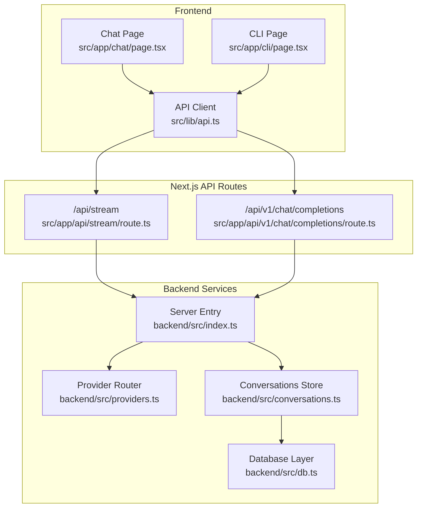
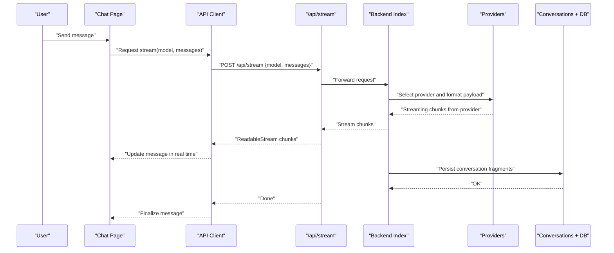
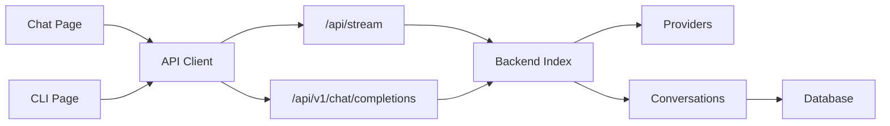

# Chat Interface

<cite>
**Referenced Files in This Document**
- [page.tsx](file://src/app/chat/page.tsx)
- [chat.module.css](file://src/app/chat/chat.module.css)
- [page.tsx](file://src/app/cli/page.tsx)
- [cli.module.css](file://src/app/cli/cli.module.css)
- [route.ts](file://src/app/api/stream/route.ts)
- [route.ts](file://src/app/api/v1/chat/completions/route.ts)
- [index.ts](file://backend/src/index.ts)
- [conversations.ts](file://backend/src/conversations.ts)
- [providers.ts](file://backend/src/providers.ts)
- [db.ts](file://backend/src/db.ts)
- [api.ts](file://src/lib/api.ts)
- [utils.ts](file://src/lib/utils.ts)
</cite>

## Table of Contents
1. [Introduction](#introduction)
2. [Project Structure](#project-structure)
3. [Core Components](#core-components)
4. [Architecture Overview](#architecture-overview)
5. [Detailed Component Analysis](#detailed-component-analysis)
6. [Dependency Analysis](#dependency-analysis)
7. [Performance Considerations](#performance-considerations)
8. [Troubleshooting Guide](#troubleshooting-guide)
9. [Conclusion](#conclusion)
10. [Appendices](#appendices)

## Introduction
This document explains the real-time chat interface and CLI tool, focusing on:
- Streaming response handling for live message updates
- Conversation management across sessions
- Model selection and provider routing
- User interaction patterns and message formatting
- CLI-style interactions within the browser
- Batch processing and automation patterns
- Performance considerations for large conversations and streaming efficiency

The system is built with a Next.js frontend and a Node/Bun backend that proxies requests to external AI providers while persisting conversations and usage data.

## Project Structure
Key areas relevant to chat and CLI:
- Frontend pages:
  - Chat page: interactive UI with streaming responses
  - CLI page: terminal-like interface for command-line style operations
- API routes:
  - Stream route: server-side streaming endpoint
  - v1/chat/completions: OpenAI-compatible completion endpoint
- Backend services:
  - Provider routing and request shaping
  - Conversation persistence and retrieval
  - Database access layer
- Shared libraries:
  - API client utilities
  - General helpers

**Diagram sources**
- [page.tsx](file://src/app/chat/page.tsx)
- [page.tsx](file://src/app/cli/page.tsx)
- [api.ts](file://src/lib/api.ts)
- [route.ts](file://src/app/api/stream/route.ts)
- [route.ts](file://src/app/api/v1/chat/completions/route.ts)
- [index.ts](file://backend/src/index.ts)
- [providers.ts](file://backend/src/providers.ts)
- [conversations.ts](file://backend/src/conversations.ts)
- [db.ts](file://backend/src/db.ts)

**Section sources**
- [page.tsx](file://src/app/chat/page.tsx)
- [page.tsx](file://src/app/cli/page.tsx)
- [route.ts](file://src/app/api/stream/route.ts)
- [route.ts](file://src/app/api/v1/chat/completions/route.ts)
- [index.ts](file://backend/src/index.ts)
- [providers.ts](file://backend/src/providers.ts)
- [conversations.ts](file://backend/src/conversations.ts)
- [db.ts](file://backend/src/db.ts)
- [api.ts](file://src/lib/api.ts)

## Core Components
- Chat Page:
  - Manages conversation state, user input, and model selection
  - Streams partial responses and appends them to the current message
  - Supports editing prompts and retrying failed messages
- CLI Page:
  - Terminal-like interface for scripting and batch operations
  - Accepts commands like run, compare, export, import
  - Integrates with the same streaming pipeline as the chat page
- API Client:
  - Encapsulates fetch calls to /api/stream and /api/v1/chat/completions
  - Handles headers, error mapping, and streaming reader consumption
- Server Stream Route:
  - Parses incoming requests, selects provider/model, and streams tokens back
  - Persists conversation fragments incrementally
- Completions Route:
  - Provides an OpenAI-compatible endpoint for non-streaming or SSE-based clients
- Provider Router:
  - Normalizes payloads per provider and handles authentication keys
- Conversations Store:
  - CRUD operations for conversations and messages
  - Ensures consistency during streaming writes
- Database Layer:
  - Abstraction over storage (e.g., SQLite/Postgres) used by the backend

**Section sources**
- [page.tsx](file://src/app/chat/page.tsx)
- [page.tsx](file://src/app/cli/page.tsx)
- [api.ts](file://src/lib/api.ts)
- [route.ts](file://src/app/api/stream/route.ts)
- [route.ts](file://src/app/api/v1/chat/completions/route.ts)
- [providers.ts](file://backend/src/providers.ts)
- [conversations.ts](file://backend/src/conversations.ts)
- [db.ts](file://backend/src/db.ts)

## Architecture Overview
End-to-end flow for a streaming chat request:

**Diagram sources**
- [page.tsx](file://src/app/chat/page.tsx)
- [api.ts](file://src/lib/api.ts)
- [route.ts](file://src/app/api/stream/route.ts)
- [index.ts](file://backend/src/index.ts)
- [providers.ts](file://backend/src/providers.ts)
- [conversations.ts](file://backend/src/conversations.ts)
- [db.ts](file://backend/src/db.ts)

## Detailed Component Analysis

### Chat Page Implementation
Responsibilities:
- Maintain conversation history and active message state
- Render messages with markdown-like formatting and code blocks
- Provide model selector dropdown and quick actions (retry, copy, share)
- Handle streaming updates via ReadableStream and append text progressively
- Manage conversation lifecycle (create, load, delete, rename)

User Interaction Patterns:
- Enter to send; Shift+Enter for newline
- Inline edit prompt before sending
- Click to focus and continue typing mid-stream
- Keyboard shortcuts for common actions (e.g., stop generation)

Message Formatting:
- Code highlighting for fenced blocks
- Syntax-aware rendering for JSON snippets
- Auto-scroll behavior when new tokens arrive

Real-Time Updates:
- Debounced auto-save of draft messages
- Optimistic UI updates with rollback on errors
- Cursor indicator during streaming

Model Selection:
- Dropdown populated from available models
- Fallback to default model if none selected
- Persist last-used model per conversation

**Section sources**
- [page.tsx](file://src/app/chat/page.tsx)
- [chat.module.css](file://src/app/chat/chat.module.css)

### CLI Page Implementation
Responsibilities:
- Terminal-like interface for running commands and scripts
- Support batch operations (run multiple prompts sequentially)
- Export/import conversations for automation
- Display structured outputs and logs

Common Commands:
- run <prompt>: Execute a single prompt with optional model override
- compare <modelA> <modelB> <prompt>: Run side-by-side comparisons
- export [--format json|csv] [--conversation-id id]: Export conversation data
- import [--file path]: Import previously exported data
- status: Show current session and provider status

Automation Patterns:
- Pipe inputs from files or other tools
- Non-interactive mode for CI/CD pipelines
- Retry and timeout controls for robustness

**Section sources**
- [page.tsx](file://src/app/cli/page.tsx)
- [cli.module.css](file://src/app/cli/cli.module.css)

### Streaming Response Handling
Flow:
- Client initiates POST to /api/stream with model and messages
- Server forwards to provider and streams chunks back
- Client consumes ReadableStream and appends content to the active message
- On completion, finalize message and update conversation metadata

Error Handling:
- Network failures trigger retries with exponential backoff
- Provider errors surfaced to UI with actionable hints
- Graceful fallback to non-streaming completions if needed

Optimizations:
- Chunk coalescing to reduce re-renders
- Virtualized message list for long conversations
- AbortController support to cancel ongoing streams

**Section sources**
- [route.ts](file://src/app/api/stream/route.ts)
- [api.ts](file://src/lib/api.ts)

### Conversation Management
Features:
- Create new conversations with optional title suggestions
- Load previous conversations by ID
- Update messages and metadata atomically
- Delete conversations and associated messages
- Search/filter conversations by keywords

Data Flow:
- Client sends conversation context with each request
- Server persists incremental updates during streaming
- Final state committed after successful completion

Consistency:
- Idempotent writes using message IDs
- Conflict resolution for concurrent edits
- Snapshotting for recovery after interruptions

**Section sources**
- [conversations.ts](file://backend/src/conversations.ts)
- [db.ts](file://backend/src/db.ts)

### Model Selection and Provider Routing
Capabilities:
- Dynamic model discovery from configured providers
- Automatic key rotation and fallbacks
- Rate limit awareness and throttling

Routing Logic:
- Normalize request payloads per provider schema
- Inject authentication headers securely
- Map provider-specific features (tools, functions) to unified interface

**Section sources**
- [providers.ts](file://backend/src/providers.ts)
- [index.ts](file://backend/src/index.ts)

### OpenAI-Compatible Endpoint
Purpose:
- Provide /api/v1/chat/completions for compatibility with existing clients
- Support both streaming and non-streaming modes
- Mirror standard fields (model, messages, temperature, max_tokens)

Behavior:
- For streaming, returns Server-Sent Events or chunked transfer
- For non-streaming, aggregates response and returns final JSON
- Enforces rate limits and quotas per user

**Section sources**
- [route.ts](file://src/app/api/v1/chat/completions/route.ts)
- [index.ts](file://backend/src/index.ts)

## Dependency Analysis
High-level dependencies between components:

**Diagram sources**
- [page.tsx](file://src/app/chat/page.tsx)
- [page.tsx](file://src/app/cli/page.tsx)
- [api.ts](file://src/lib/api.ts)
- [route.ts](file://src/app/api/stream/route.ts)
- [route.ts](file://src/app/api/v1/chat/completions/route.ts)
- [index.ts](file://backend/src/index.ts)
- [providers.ts](file://backend/src/providers.ts)
- [conversations.ts](file://backend/src/conversations.ts)
- [db.ts](file://backend/src/db.ts)

**Section sources**
- [api.ts](file://src/lib/api.ts)
- [route.ts](file://src/app/api/stream/route.ts)
- [route.ts](file://src/app/api/v1/chat/completions/route.ts)
- [index.ts](file://backend/src/index.ts)
- [providers.ts](file://backend/src/providers.ts)
- [conversations.ts](file://backend/src/conversations.ts)
- [db.ts](file://backend/src/db.ts)

## Performance Considerations
- Large Conversations:
  - Use virtualization to render only visible messages
  - Paginate historical messages on load
  - Limit context window size sent to providers
- Streaming Efficiency:
  - Coalesce small chunks to reduce UI updates
  - Debounce auto-save operations
  - Cancel in-flight requests on navigation or unmount
- Memory Management:
  - Release references to aborted streams
  - Clear temporary buffers after completion
- Provider Throttling:
  - Implement token-rate limiting at the gateway
  - Queue requests during high-load periods
- Caching Strategies:
  - Cache model lists and provider capabilities
  - Deduplicate identical prompts for analytics

[No sources needed since this section provides general guidance]

## Troubleshooting Guide
Common Issues and Resolutions:
- Streaming stalls:
  - Check network connectivity and CORS settings
  - Verify provider availability and quota
  - Inspect server logs for upstream timeouts
- Messages not saving:
  - Confirm database connectivity and permissions
  - Validate conversation ID uniqueness
  - Review write locks and transaction boundaries
- Model selection errors:
  - Ensure model exists in provider configuration
  - Validate API key scopes and permissions
  - Check for region-specific model availability
- CLI automation failures:
  - Validate command syntax and parameters
  - Enable verbose logging for detailed traces
  - Test with minimal payloads first

Diagnostic Tools:
- Network tab inspection for request/response bodies
- Console logs for client-side errors
- Server-side metrics for latency and error rates

**Section sources**
- [route.ts](file://src/app/api/stream/route.ts)
- [route.ts](file://src/app/api/v1/chat/completions/route.ts)
- [conversations.ts](file://backend/src/conversations.ts)
- [db.ts](file://backend/src/db.ts)

## Conclusion
The chat interface and CLI tool provide a robust, real-time experience for interacting with multiple AI providers. The architecture emphasizes streaming efficiency, conversation persistence, and flexible model selection. By following the performance recommendations and troubleshooting steps outlined here, teams can build reliable integrations and automate workflows effectively.

[No sources needed since this section summarizes without analyzing specific files]

## Appendices

### Common Chat Workflows
- Start a new conversation:
  - Select a model, enter a prompt, and send
  - Observe streaming updates and refine the prompt as needed
- Compare models:
  - Use the CLI compare command or duplicate the conversation with different models
  - Evaluate output quality and latency differences
- Automate tasks:
  - Script repetitive prompts using the CLI
  - Export results for analysis or further processing

### Integration Patterns
- Embedding in dashboards:
  - Use the OpenAI-compatible endpoint for seamless integration
  - Handle streaming responses with event listeners
- Batch processing:
  - Feed input files to the CLI for automated runs
  - Parse structured outputs for downstream systems

[No sources needed since this section provides general guidance]