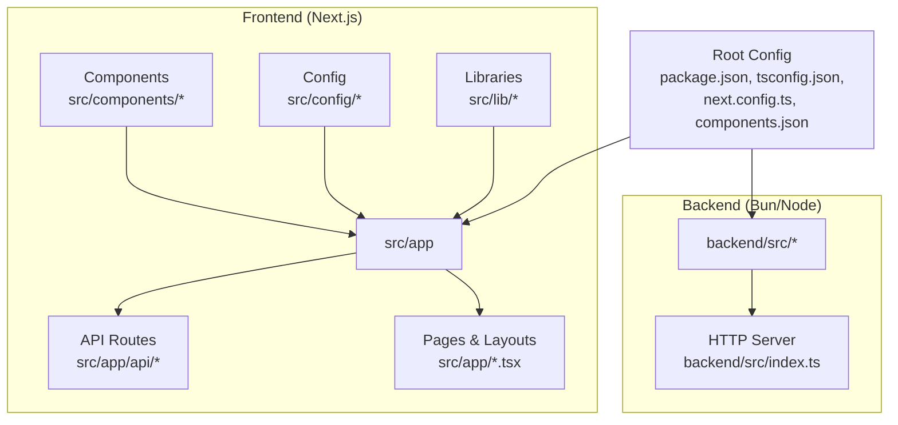
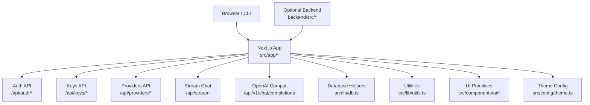
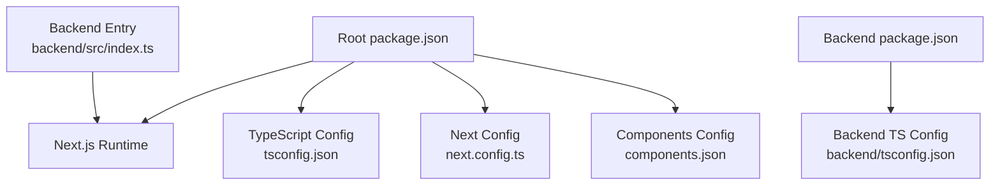

# Contributing

<cite>
**Referenced Files in This Document**
- [README.md](file://README.md)
- [AGENTS.md](file://AGENTS.md)
- [CLAUDE.md](file://CLAUDE.md)
- [package.json](file://package.json)
- [tsconfig.json](file://tsconfig.json)
- [next.config.ts](file://next.config.ts)
- [components.json](file://components.json)
- [backend/package.json](file://backend/package.json)
- [backend/tsconfig.json](file://backend/tsconfig.json)
- [backend/src/index.ts](file://backend/src/index.ts)
- [src/app/layout.tsx](file://src/app/layout.tsx)
- [src/app/page.tsx](file://src/app/page.tsx)
- [src/app/api/auth/login/route.ts](file://src/app/api/auth/login/route.ts)
- [src/app/api/auth/signup/route.ts](file://src/app/api/auth/signup/route.ts)
- [src/app/api/keys/route.ts](file://src/app/api/keys/route.ts)
- [src/app/api/providers/route.ts](file://src/app/api/providers/route.ts)
- [src/app/api/stream/route.ts](file://src/app/api/stream/route.ts)
- [src/app/api/v1/chat/completions/route.ts](file://src/app/api/v1/chat/completions/route.ts)
- [src/lib/db.ts](file://src/lib/db.ts)
- [src/lib/utils.ts](file://src/lib/utils.ts)
- [src/components/ui/primitives.tsx](file://src/components/ui/primitives.tsx)
- [src/config/theme.ts](file://src/config/theme.ts)
</cite>

## Table of Contents
1. Introduction
2. Project Structure
3. Core Components
4. Architecture Overview
5. Detailed Component Analysis
6. Dependency Analysis
7. Performance Considerations
8. Troubleshooting Guide
9. Conclusion
10. Appendices

## Introduction
This document provides contributing guidelines for developers working on the CheapModels project. It covers development environment setup, coding standards, project structure conventions, pull request and code review processes, testing expectations, documentation standards, commit message conventions, issue reporting procedures, and guidance for adding features and fixing bugs. It also explains how to work with the agent framework integration and Claude Code usage, as well as automated development tools used by the project.

## Project Structure
The repository is a Next.js application with an optional backend service. The frontend uses the App Router under src/app, shared UI components under src/components, configuration under src/config, and utilities under src/lib. API routes are implemented within src/app/api. A separate backend service exists under backend/.

**Diagram sources**
- [package.json](file://package.json)
- [tsconfig.json](file://tsconfig.json)
- [next.config.ts](file://next.config.ts)
- [components.json](file://components.json)
- [backend/package.json](file://backend/package.json)
- [backend/tsconfig.json](file://backend/tsconfig.json)
- [backend/src/index.ts](file://backend/src/index.ts)
- [src/app/layout.tsx](file://src/app/layout.tsx)
- [src/app/page.tsx](file://src/app/page.tsx)
- [src/app/api/auth/login/route.ts](file://src/app/api/auth/login/route.ts)
- [src/app/api/auth/signup/route.ts](file://src/app/api/auth/signup/route.ts)
- [src/app/api/keys/route.ts](file://src/app/api/keys/route.ts)
- [src/app/api/providers/route.ts](file://src/app/api/providers/route.ts)
- [src/app/api/stream/route.ts](file://src/app/api/stream/route.ts)
- [src/app/api/v1/chat/completions/route.ts](file://src/app/api/v1/chat/completions/route.ts)
- [src/lib/db.ts](file://src/lib/db.ts)
- [src/lib/utils.ts](file://src/lib/utils.ts)
- [src/components/ui/primitives.tsx](file://src/components/ui/primitives.tsx)
- [src/config/theme.ts](file://src/config/theme.ts)

**Section sources**
- [README.md](file://README.md)
- [package.json](file://package.json)
- [tsconfig.json](file://tsconfig.json)
- [next.config.ts](file://next.config.ts)
- [components.json](file://components.json)
- [backend/package.json](file://backend/package.json)
- [backend/tsconfig.json](file://backend/tsconfig.json)
- [backend/src/index.ts](file://backend/src/index.ts)
- [src/app/layout.tsx](file://src/app/layout.tsx)
- [src/app/page.tsx](file://src/app/page.tsx)

## Core Components
- Frontend app shell and layout:
  - Root layout and page entry points define the application structure and global styles.
- API routes:
  - Authentication endpoints for login and signup.
  - Keys management endpoint.
  - Providers management endpoint.
  - Streaming chat completion endpoint.
  - OpenAI-compatible v1/chat/completions endpoint.
- Shared libraries:
  - Database access helpers.
  - Utility functions.
- UI primitives:
  - Reusable base components for consistent styling and behavior.
- Configuration:
  - Theme definitions and component library configuration.

**Section sources**
- [src/app/layout.tsx](file://src/app/layout.tsx)
- [src/app/page.tsx](file://src/app/page.tsx)
- [src/app/api/auth/login/route.ts](file://src/app/api/auth/login/route.ts)
- [src/app/api/auth/signup/route.ts](file://src/app/api/auth/signup/route.ts)
- [src/app/api/keys/route.ts](file://src/app/api/keys/route.ts)
- [src/app/api/providers/route.ts](file://src/app/api/providers/route.ts)
- [src/app/api/stream/route.ts](file://src/app/api/stream/route.ts)
- [src/app/api/v1/chat/completions/route.ts](file://src/app/api/v1/chat/completions/route.ts)
- [src/lib/db.ts](file://src/lib/db.ts)
- [src/lib/utils.ts](file://src/lib/utils.ts)
- [src/components/ui/primitives.tsx](file://src/components/ui/primitives.tsx)
- [src/config/theme.ts](file://src/config/theme.ts)

## Architecture Overview
The system consists of a Next.js frontend that serves pages and exposes API routes, optionally backed by a lightweight backend service. The frontend integrates with external providers and streaming APIs, while the backend can host additional services or integrations.

**Diagram sources**
- [src/app/api/auth/login/route.ts](file://src/app/api/auth/login/route.ts)
- [src/app/api/auth/signup/route.ts](file://src/app/api/auth/signup/route.ts)
- [src/app/api/keys/route.ts](file://src/app/api/keys/route.ts)
- [src/app/api/providers/route.ts](file://src/app/api/providers/route.ts)
- [src/app/api/stream/route.ts](file://src/app/api/stream/route.ts)
- [src/app/api/v1/chat/completions/route.ts](file://src/app/api/v1/chat/completions/route.ts)
- [src/lib/db.ts](file://src/lib/db.ts)
- [src/lib/utils.ts](file://src/lib/utils.ts)
- [src/components/ui/primitives.tsx](file://src/components/ui/primitives.tsx)
- [src/config/theme.ts](file://src/config/theme.ts)
- [backend/src/index.ts](file://backend/src/index.ts)

## Detailed Component Analysis

### Development Environment Setup
- Install dependencies using the package manager defined in the root package.json.
- Configure TypeScript settings via tsconfig.json at both root and backend levels.
- Initialize the Next.js app using next.config.ts and components.json for UI configuration.
- For the backend service, use backend/package.json and backend/tsconfig.json to install and configure dependencies.

Recommended steps:
- Install dependencies in the root directory.
- Run the development server for the Next.js app.
- If using the backend, install and run it separately from the backend directory.

Environment variables:
- Ensure any required environment variables are set before running the app or backend. Refer to the project’s README for specifics.

**Section sources**
- [README.md](file://README.md)
- [package.json](file://package.json)
- [tsconfig.json](file://tsconfig.json)
- [next.config.ts](file://next.config.ts)
- [components.json](file://components.json)
- [backend/package.json](file://backend/package.json)
- [backend/tsconfig.json](file://backend/tsconfig.json)

### Coding Standards
- Use TypeScript across the project; adhere to strict typing where possible.
- Follow the existing file organization patterns:
  - Pages and layouts under src/app.
  - API routes under src/app/api grouped by feature.
  - Shared components under src/components with UI primitives under src/components/ui.
  - Utilities under src/lib.
  - Configuration under src/config.
- Keep CSS modules co-located with their components when needed.
- Prefer small, focused components and route handlers.
- Maintain consistency with theme configuration in src/config/theme.ts.

**Section sources**
- [tsconfig.json](file://tsconfig.json)
- [src/app/layout.tsx](file://src/app/layout.tsx)
- [src/app/page.tsx](file://src/app/page.tsx)
- [src/app/api/auth/login/route.ts](file://src/app/api/auth/login/route.ts)
- [src/app/api/auth/signup/route.ts](file://src/app/api/auth/signup/route.ts)
- [src/app/api/keys/route.ts](file://src/app/api/keys/route.ts)
- [src/app/api/providers/route.ts](file://src/app/api/providers/route.ts)
- [src/app/api/stream/route.ts](file://src/app/api/stream/route.ts)
- [src/app/api/v1/chat/completions/route.ts](file://src/app/api/v1/chat/completions/route.ts)
- [src/components/ui/primitives.tsx](file://src/components/ui/primitives.tsx)
- [src/config/theme.ts](file://src/config/theme.ts)

### Project Structure Conventions
- Feature-based grouping for API routes:
  - Group related endpoints under a single folder (e.g., auth, keys, providers).
- Component composition:
  - Place reusable UI primitives under src/components/ui.
  - Feature-specific components under src/components.
- Library modules:
  - Centralize database and utility logic under src/lib.
- Configuration:
  - Store theme and app-level config under src/config.

**Section sources**
- [src/app/api/auth/login/route.ts](file://src/app/api/auth/login/route.ts)
- [src/app/api/auth/signup/route.ts](file://src/app/api/auth/signup/route.ts)
- [src/app/api/keys/route.ts](file://src/app/api/keys/route.ts)
- [src/app/api/providers/route.ts](file://src/app/api/providers/route.ts)
- [src/app/api/stream/route.ts](file://src/app/api/stream/route.ts)
- [src/app/api/v1/chat/completions/route.ts](file://src/app/api/v1/chat/completions/route.ts)
- [src/components/ui/primitives.tsx](file://src/components/ui/primitives.tsx)
- [src/lib/db.ts](file://src/lib/db.ts)
- [src/lib/utils.ts](file://src/lib/utils.ts)
- [src/config/theme.ts](file://src/config/theme.ts)

### Pull Request Process
- Create a feature branch from main for each change.
- Ensure all tests pass and linting checks succeed before opening a PR.
- Include a clear description of changes, rationale, and any relevant screenshots or logs.
- Link related issues in the PR description.
- Request reviews from maintainers familiar with the affected areas.
- Address review feedback promptly and keep commits concise and descriptive.

[No sources needed since this section provides general guidance]

### Code Review Guidelines
- Focus on correctness, clarity, and maintainability.
- Verify type safety and adherence to coding standards.
- Check for performance implications and potential regressions.
- Ensure API contracts remain stable or are properly versioned.
- Validate error handling and edge cases.

[No sources needed since this section provides general guidance]

### Testing Requirements
- Add unit tests for new logic and critical paths.
- Include integration tests for API routes where appropriate.
- Ensure existing tests continue to pass after changes.
- Document test coverage goals and report coverage metrics if applicable.

[No sources needed since this section provides general guidance]

### Agent Framework Integration and Claude Code Usage
- The repository includes agent-related documentation files that outline how to integrate agents and use Claude Code effectively.
- Follow the instructions in these files to configure and operate agent workflows alongside the development process.

**Section sources**
- [AGENTS.md](file://AGENTS.md)
- [CLAUDE.md](file://CLAUDE.md)

### Automated Development Tools
- Use the scripts defined in package.json for common tasks such as building, running, and testing.
- Leverage TypeScript configuration for consistent compilation across frontend and backend.
- Utilize Next.js tooling for development, preview, and production builds.

**Section sources**
- [package.json](file://package.json)
- [tsconfig.json](file://tsconfig.json)
- [next.config.ts](file://next.config.ts)

### Documentation Standards
- Update README and relevant docs when introducing new features or changing behavior.
- Keep inline comments concise and meaningful.
- Provide examples and usage notes for new APIs and components.
- Maintain consistency in terminology and style.

**Section sources**
- [README.md](file://README.md)

### Commit Message Conventions
- Use clear, imperative-style messages describing what changed and why.
- Reference related issues or tickets in commit messages.
- Keep commits atomic and focused on a single concern.

[No sources needed since this section provides general guidance]

### Issue Reporting Procedures
- Search existing issues before creating a new one.
- Provide a reproducible example, expected vs actual behavior, and environment details.
- Attach logs or screenshots when helpful.
- Label issues appropriately and link related PRs.

[No sources needed since this section provides general guidance]

### Adding New Features
- Plan the feature scope and identify affected components.
- Implement changes following project structure conventions.
- Add tests and update documentation.
- Open a PR with a detailed description and request reviews.

[No sources needed since this section provides general guidance]

### Fixing Bugs
- Reproduce the bug and add a failing test if possible.
- Implement the fix with minimal changes.
- Ensure no regressions by running existing tests.
- Document the fix and any workarounds.

[No sources needed since this section provides general guidance]

### Maintaining Code Quality
- Adhere to TypeScript strictness and linting rules.
- Refactor incrementally to improve readability and performance.
- Keep dependencies up to date and audit for security vulnerabilities.
- Monitor runtime errors and address them proactively.

[No sources needed since this section provides general guidance]

## Dependency Analysis
The project relies on Next.js for the frontend, TypeScript for type safety, and optional backend dependencies managed via backend/package.json. The root package.json defines scripts and dependencies for the overall project.

**Diagram sources**
- [package.json](file://package.json)
- [tsconfig.json](file://tsconfig.json)
- [next.config.ts](file://next.config.ts)
- [components.json](file://components.json)
- [backend/package.json](file://backend/package.json)
- [backend/tsconfig.json](file://backend/tsconfig.json)
- [backend/src/index.ts](file://backend/src/index.ts)

**Section sources**
- [package.json](file://package.json)
- [tsconfig.json](file://tsconfig.json)
- [next.config.ts](file://next.config.ts)
- [components.json](file://components.json)
- [backend/package.json](file://backend/package.json)
- [backend/tsconfig.json](file://backend/tsconfig.json)
- [backend/src/index.ts](file://backend/src/index.ts)

## Performance Considerations
- Prefer efficient data fetching patterns in API routes.
- Minimize unnecessary re-renders in components.
- Use streaming endpoints judiciously and handle backpressure.
- Profile and optimize heavy computations in utilities.
- Keep bundle sizes lean by avoiding unused dependencies.

[No sources needed since this section provides general guidance]

## Troubleshooting Guide
- Verify environment variables are correctly set for both frontend and backend.
- Check TypeScript compilation errors and resolve type mismatches.
- Inspect API route responses and ensure proper error handling.
- Review logs for runtime exceptions and stack traces.
- Confirm database connectivity and schema alignment.

**Section sources**
- [src/app/api/auth/login/route.ts](file://src/app/api/auth/login/route.ts)
- [src/app/api/auth/signup/route.ts](file://src/app/api/auth/signup/route.ts)
- [src/app/api/keys/route.ts](file://src/app/api/keys/route.ts)
- [src/app/api/providers/route.ts](file://src/app/api/providers/route.ts)
- [src/app/api/stream/route.ts](file://src/app/api/stream/route.ts)
- [src/app/api/v1/chat/completions/route.ts](file://src/app/api/v1/chat/completions/route.ts)
- [src/lib/db.ts](file://src/lib/db.ts)

## Conclusion
By following these contributing guidelines—covering environment setup, coding standards, project structure, PR workflow, testing, documentation, and maintenance—you will help ensure the CheapModels project remains high-quality, maintainable, and collaborative. Use the provided diagrams and references to understand the architecture and key components, and consult the referenced files for implementation details.

## Appendices

### Quick Start Checklist
- Install dependencies and configure environment variables.
- Run the development server and verify basic functionality.
- Add tests for new features and fixes.
- Update documentation and open a PR with a clear description.

[No sources needed since this section provides general guidance]