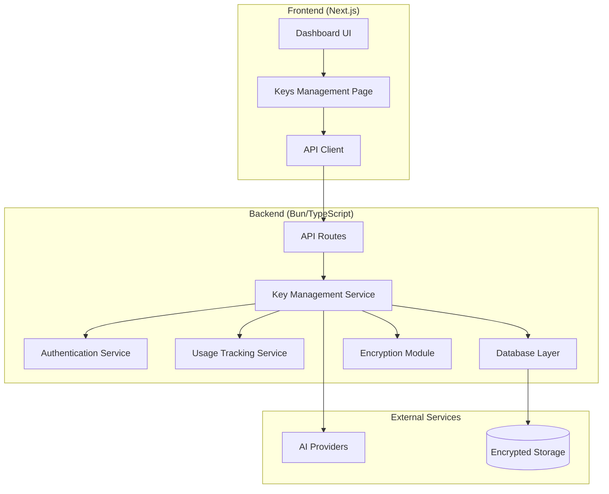
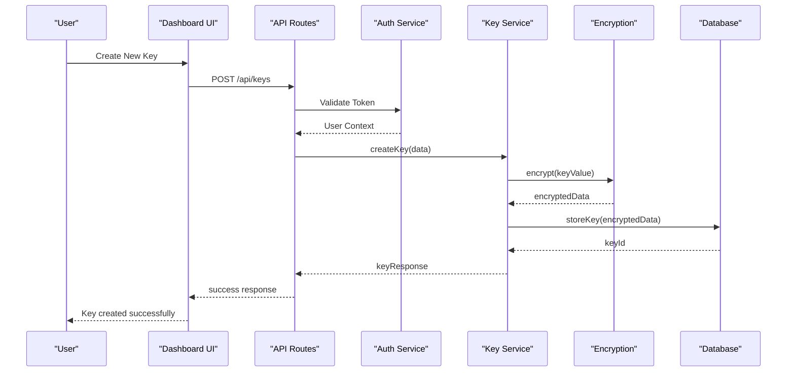
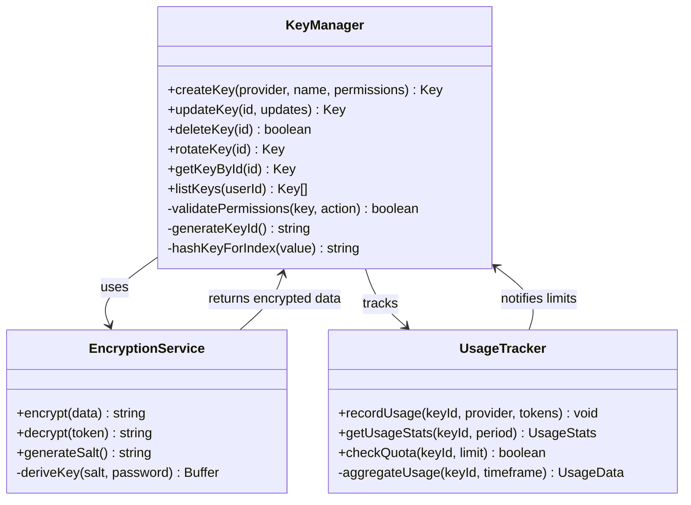
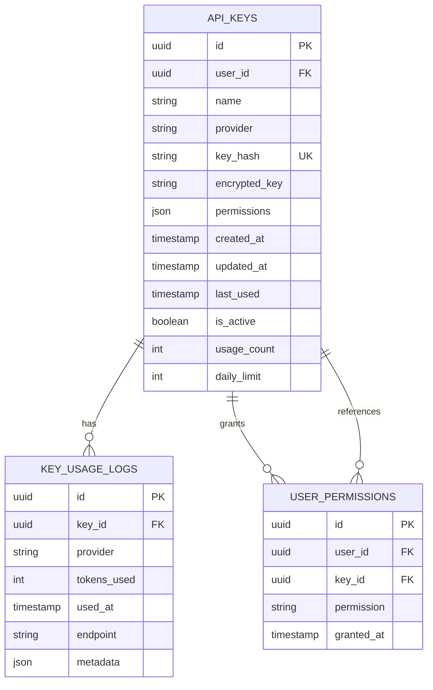
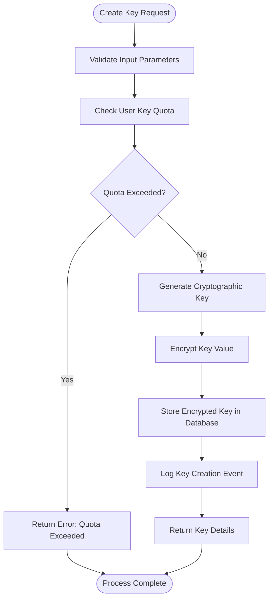

# API Key Management

<cite>
**Referenced Files in This Document**
- [keys.ts](file://backend/src/keys.ts)
- [db.ts](file://backend/src/db.ts)
- [auth.ts](file://backend/src/auth.ts)
- [usage.ts](file://backend/src/usage.ts)
- [route.ts](file://src/app/api/keys/route.ts)
- [route.ts](file://src/app/api/keys/[id]/route.ts)
- [page.tsx](file://src/app/dashboard/keys/page.tsx)
- [index.ts](file://backend/src/index.ts)
- [providers.ts](file://backend/src/providers.ts)
</cite>

## Table of Contents
1. [Introduction](#introduction)
2. [Project Structure](#project-structure)
3. [Core Components](#core-components)
4. [Architecture Overview](#architecture-overview)
5. [Detailed Component Analysis](#detailed-component-analysis)
6. [Security Implementation](#security-implementation)
7. [API Endpoints](#api-endpoints)
8. [Dashboard Interface](#dashboard-interface)
9. [Key Lifecycle Management](#key-lifecycle-management)
10. [Usage Tracking](#usage-tracking)
11. [Best Practices](#best-practices)
12. [Troubleshooting Guide](#troubleshooting-guide)
13. [Conclusion](#conclusion)

## Introduction

The API Key Management System provides a comprehensive solution for securely storing, rotating, and managing multiple API keys across different AI providers. This system implements enterprise-grade security features including encryption at rest, granular access control, and detailed usage tracking per key. The platform supports both programmatic access through RESTful APIs and an intuitive dashboard interface for manual key management operations.

## Project Structure

The API key management system follows a modular architecture with clear separation between frontend and backend concerns:



**Diagram sources**
- [index.ts](file://backend/src/index.ts)
- [keys.ts](file://backend/src/keys.ts)
- [route.ts](file://src/app/api/keys/route.ts)

**Section sources**
- [index.ts](file://backend/src/index.ts)
- [keys.ts](file://backend/src/keys.ts)

## Core Components

### Key Management Service
The core service handles all CRUD operations for API keys, implementing business logic for key generation, validation, and lifecycle management.

### Authentication & Authorization
Implements JWT-based authentication with role-based access control to ensure only authorized users can manage their API keys.

### Encryption Module
Provides cryptographic functions for encrypting sensitive key data at rest using industry-standard algorithms.

### Usage Tracking Service
Monitors and records API key usage patterns, enabling quota management and billing integration.

**Section sources**
- [keys.ts](file://backend/src/keys.ts)
- [auth.ts](file://backend/src/auth.ts)
- [usage.ts](file://backend/src/usage.ts)

## Architecture Overview

The system follows a layered architecture pattern with clear separation of concerns:



**Diagram sources**
- [route.ts](file://src/app/api/keys/route.ts)
- [keys.ts](file://backend/src/keys.ts)
- [auth.ts](file://backend/src/auth.ts)

## Detailed Component Analysis

### Key Management Service

The key management service implements comprehensive functionality for handling API keys throughout their lifecycle:



**Diagram sources**
- [keys.ts](file://backend/src/keys.ts)
- [usage.ts](file://backend/src/usage.ts)

#### Key Generation Algorithm
The system generates cryptographically secure random keys using a combination of timestamps, user context, and random entropy to ensure uniqueness and unpredictability.

#### Permission Model
Each key supports granular permissions including read/write access, provider-specific scopes, and rate limiting controls.

**Section sources**
- [keys.ts](file://backend/src/keys.ts)

### Database Schema Design

The database layer implements a normalized schema optimized for key management operations:



**Diagram sources**
- [db.ts](file://backend/src/db.ts)

**Section sources**
- [db.ts](file://backend/src/db.ts)

## Security Implementation

### Encryption at Rest
All API keys are encrypted before storage using AES-256-GCM with unique initialization vectors for each key. The encryption key is derived from environment variables and never stored alongside the encrypted data.

### Access Control Mechanisms
- **JWT Authentication**: All API requests require valid JWT tokens
- **Row-Level Security**: Users can only access their own keys
- **Permission Scopes**: Fine-grained permissions for different operations
- **Audit Logging**: Complete audit trail for all key operations

### Rate Limiting & Quotas
Per-key rate limiting prevents abuse and ensures fair resource allocation across users.

**Section sources**
- [auth.ts](file://backend/src/auth.ts)
- [keys.ts](file://backend/src/keys.ts)

## API Endpoints

### Key Management Endpoints

| Endpoint | Method | Description | Authentication | Rate Limit |
|----------|--------|-------------|----------------|------------|
| `/api/keys` | GET | List all keys for authenticated user | Required | 100/min |
| `/api/keys` | POST | Create new API key | Required | 10/min |
| `/api/keys/:id` | GET | Get specific key details | Required | 100/min |
| `/api/keys/:id` | PUT | Update key properties | Required | 10/min |
| `/api/keys/:id` | DELETE | Delete API key | Required | 5/min |
| `/api/keys/:id/rotate` | POST | Rotate existing key | Required | 1/min |
| `/api/keys/:id/stats` | GET | Get usage statistics | Required | 10/min |

### Request/Response Examples

#### Create Key Request
```json
{
  "name": "Production API Key",
  "provider": "openai",
  "permissions": ["read", "write"],
  "dailyLimit": 10000,
  "metadata": {
    "environment": "production",
    "team": "ml-engineering"
  }
}
```

#### Success Response
```json
{
  "id": "key_abc123",
  "name": "Production API Key",
  "provider": "openai",
  "key": "sk-live-xxxxx",
  "permissions": ["read", "write"],
  "createdAt": "2024-01-15T10:30:00Z",
  "expiresAt": null
}
```

**Section sources**
- [route.ts](file://src/app/api/keys/route.ts)
- [route.ts](file://src/app/api/keys/[id]/route.ts)

## Dashboard Interface

The dashboard provides an intuitive web interface for managing API keys without requiring API knowledge:

### Key Management Features
- **Visual Key Creation**: Guided workflow for creating new keys with provider selection
- **Real-time Status**: Visual indicators showing key status (active, expired, revoked)
- **Usage Analytics**: Charts and graphs showing consumption patterns
- **Bulk Operations**: Ability to perform actions on multiple keys simultaneously
- **Search & Filter**: Advanced filtering by provider, status, creation date, and tags

### Security Controls
- **Confirmation Dialogs**: Mandatory confirmation for destructive operations
- **Key Masking**: Sensitive portions of keys are masked by default
- **Activity Logs**: View recent activity for each key
- **Export Functionality**: Download key inventory reports

**Section sources**
- [page.tsx](file://src/app/dashboard/keys/page.tsx)

## Key Lifecycle Management

### Key Creation Process
The key creation process involves multiple validation steps and security checks:



**Diagram sources**
- [keys.ts](file://backend/src/keys.ts)

### Key Rotation Strategy
The rotation process ensures zero downtime during key updates:

1. **Generate New Key**: Create replacement key with same configuration
2. **Dual Validation**: Accept both old and new keys during transition period
3. **Gradual Migration**: Monitor usage patterns and force migration after grace period
4. **Cleanup**: Remove old key after successful migration verification

### Key Deletion Process
Secure deletion includes immediate deactivation followed by scheduled cleanup:

1. **Immediate Deactivation**: Mark key as inactive instantly
2. **Grace Period**: Maintain key for 24 hours for rollback capability
3. **Permanent Removal**: Securely delete key data after grace period
4. **Audit Trail**: Maintain deletion logs for compliance

**Section sources**
- [keys.ts](file://backend/src/keys.ts)

## Usage Tracking

### Metrics Collection
The system tracks comprehensive usage metrics for each API key:

- **Token Consumption**: Number of tokens used per request
- **Request Frequency**: Count of API calls over time periods
- **Provider Distribution**: Breakdown of usage across different AI providers
- **Error Rates**: Percentage of failed requests per key
- **Latency Metrics**: Average response times for key-based requests

### Alerting & Notifications
Automated alerts notify users when approaching quotas or detecting unusual usage patterns.

### Billing Integration
Usage data integrates with billing systems for accurate cost attribution per key and per customer.

**Section sources**
- [usage.ts](file://backend/src/usage.ts)

## Best Practices

### Security Recommendations
1. **Never log API keys**: Ensure logging systems strip sensitive information
2. **Use environment variables**: Store master encryption keys in secure environments
3. **Implement key expiration**: Set appropriate expiration dates for temporary keys
4. **Monitor usage patterns**: Set up alerts for anomalous behavior
5. **Regular rotation**: Establish policies for periodic key rotation
6. **Least privilege principle**: Grant minimum required permissions to each key

### Common Pitfalls to Avoid
1. **Hardcoding keys**: Never embed API keys directly in source code
2. **Overly broad permissions**: Avoid granting unnecessary access levels
3. **Ignoring expiration**: Regularly audit and update expiring keys
4. **Poor error handling**: Implement robust error handling for key validation failures
5. **Insufficient monitoring**: Track and alert on suspicious key usage patterns

### Performance Optimization
1. **Connection pooling**: Reuse database connections for key validation
2. **Caching strategies**: Cache frequently accessed key metadata
3. **Async processing**: Handle usage tracking asynchronously to avoid blocking requests
4. **Batch operations**: Support bulk operations for administrative tasks

## Troubleshooting Guide

### Common Issues and Solutions

#### Key Validation Failures
- **Symptom**: API requests fail with authentication errors
- **Causes**: Expired keys, incorrect permissions, network connectivity issues
- **Resolution**: Verify key status, check expiration dates, validate network configuration

#### Encryption Errors
- **Symptom**: Database operations fail with decryption errors
- **Causes**: Corrupted encryption keys, version mismatches, environment variable issues
- **Resolution**: Verify encryption key integrity, check environment configuration, review version compatibility

#### Performance Degradation
- **Symptom**: Slow API responses when validating keys
- **Causes**: Database connection exhaustion, missing indexes, excessive logging
- **Resolution**: Optimize database queries, implement caching, review logging levels

### Debugging Tools
- **Audit Logs**: Review complete operation history for troubleshooting
- **Performance Metrics**: Monitor system performance indicators
- **Error Tracking**: Centralized error collection and analysis
- **Health Checks**: Automated system health monitoring

**Section sources**
- [keys.ts](file://backend/src/keys.ts)
- [auth.ts](file://backend/src/auth.ts)

## Conclusion

The API Key Management System provides a robust, secure, and scalable solution for managing API keys across multiple AI providers. With comprehensive security features, intuitive interfaces, and detailed usage tracking, it enables organizations to maintain tight control over their AI service integrations while providing flexibility for development and production environments.

The system's modular architecture ensures easy maintenance and extension, while its focus on security best practices helps protect against common vulnerabilities associated with API key management. Whether used through the dashboard interface or integrated programmatically, the system delivers enterprise-grade reliability and security for AI-powered applications.