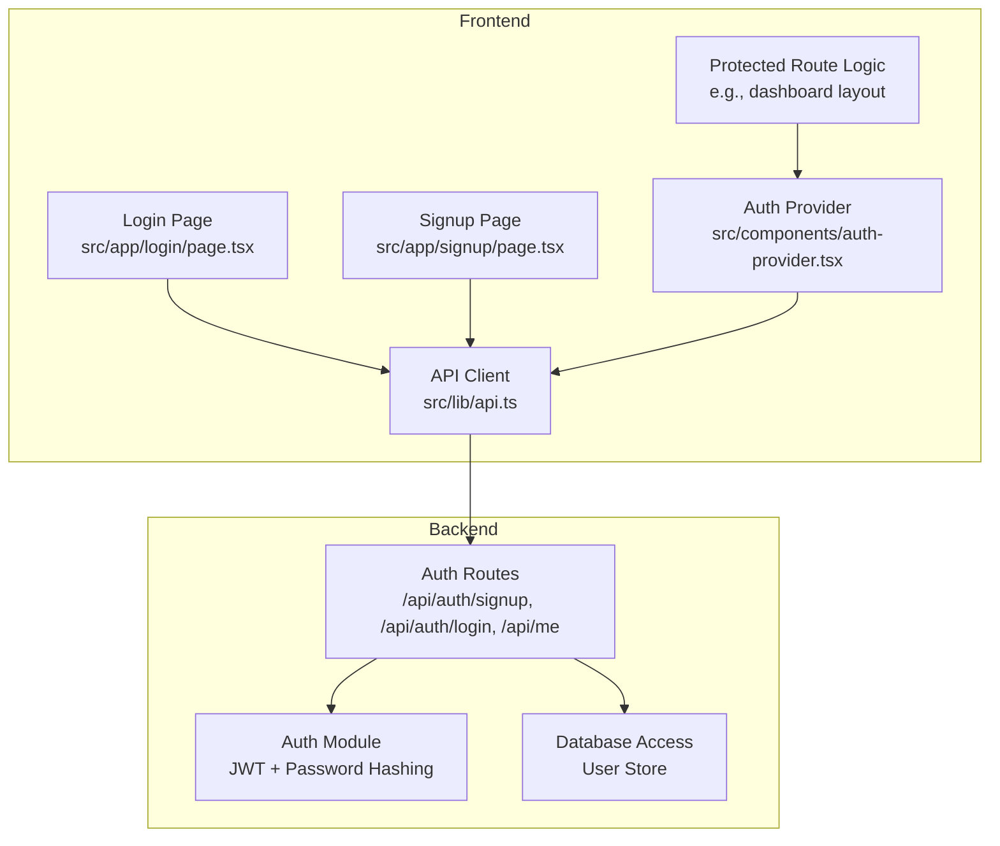
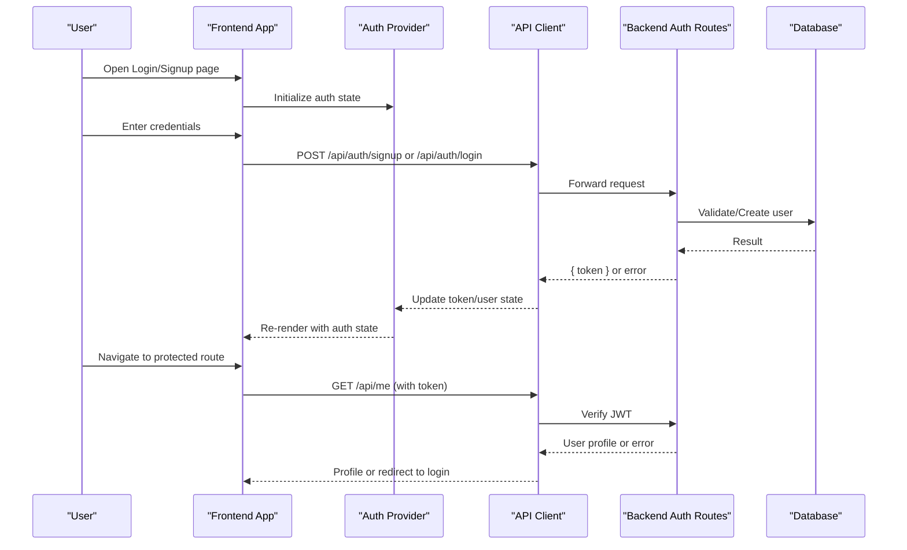
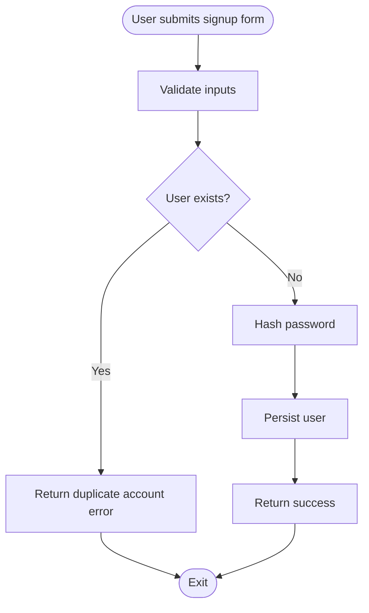
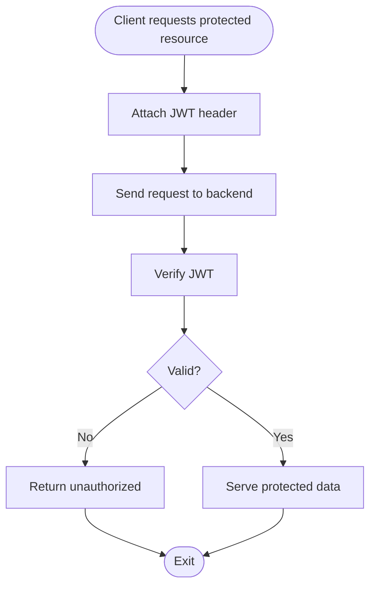
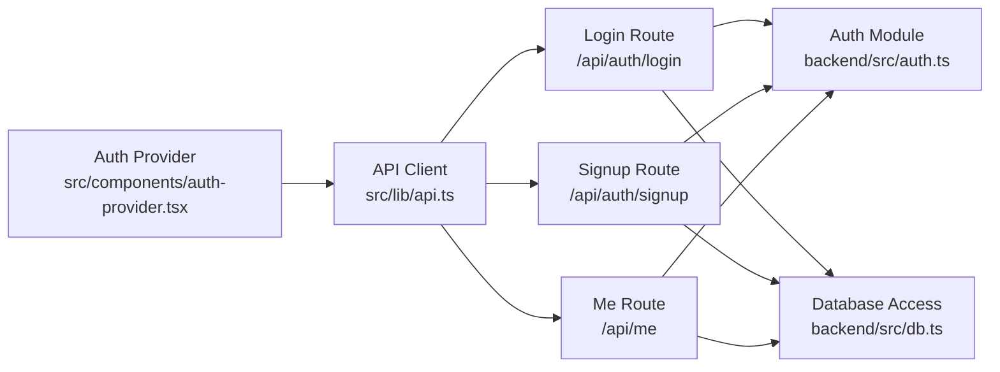

# Authentication System

<cite>
**Referenced Files in This Document**
- [auth.ts](file://backend/src/auth.ts)
- [index.ts](file://backend/src/index.ts)
- [db.ts](file://backend/src/db.ts)
- [login/route.ts](file://src/app/api/auth/login/route.ts)
- [signup/route.ts](file://src/app/api/auth/signup/route.ts)
- [me/route.ts](file://src/app/api/me/route.ts)
- [auth-provider.tsx](file://src/components/auth-provider.tsx)
- [api.ts](file://src/lib/api.ts)
</cite>

## Table of Contents
1. [Introduction](#introduction)
2. [Project Structure](#project-structure)
3. [Core Components](#core-components)
4. [Architecture Overview](#architecture-overview)
5. [Detailed Component Analysis](#detailed-component-analysis)
6. [Dependency Analysis](#dependency-analysis)
7. [Performance Considerations](#performance-considerations)
8. [Troubleshooting Guide](#troubleshooting-guide)
9. [Conclusion](#conclusion)

## Introduction
This document explains the authentication system in CheapModels with a focus on JWT-based flows, including user registration, login, token management, and session handling. It also documents the frontend auth provider that manages authentication state across the application, and clarifies how the frontend auth context integrates with backend authentication endpoints. Practical guidance is provided for implementing protected routes, handling authentication errors, and managing user sessions.

## Project Structure
The authentication system spans both backend and frontend:
- Backend:
  - Authentication utilities and middleware (JWT creation/verification, password hashing).
  - API routes for signup, login, and current user retrieval.
  - Database access for user storage and lookup.
- Frontend:
  - Auth context provider to manage login state and tokens.
  - API client helpers for calling authentication endpoints.
  - Pages and components that rely on the auth context for protected navigation.

**Diagram sources**
- [auth-provider.tsx](file://src/components/auth-provider.tsx)
- [api.ts](file://src/lib/api.ts)
- [login/route.ts](file://src/app/api/auth/login/route.ts)
- [signup/route.ts](file://src/app/api/auth/signup/route.ts)
- [me/route.ts](file://src/app/api/me/route.ts)
- [auth.ts](file://backend/src/auth.ts)
- [db.ts](file://backend/src/db.ts)

**Section sources**
- [auth-provider.tsx](file://src/components/auth-provider.tsx)
- [api.ts](file://src/lib/api.ts)
- [login/route.ts](file://src/app/api/auth/login/route.ts)
- [signup/route.ts](file://src/app/api/auth/signup/route.ts)
- [me/route.ts](file://src/app/api/me/route.ts)
- [auth.ts](file://backend/src/auth.ts)
- [db.ts](file://backend/src/db.ts)

## Core Components
- Backend Auth Module: Implements JWT signing and verification, and password hashing utilities used by authentication routes.
- Backend Auth Routes:
  - Signup: Creates a new user record after validating input and hashing the password.
  - Login: Validates credentials, issues a JWT, and returns it to the client.
  - Me: Verifies the JWT from the request and returns the authenticated user’s profile.
- Frontend Auth Provider: Maintains the current user state and token lifecycle, exposing methods to log in, log out, and refresh user data.
- Frontend API Client: Centralizes HTTP calls to authentication endpoints, attaching the JWT where required and handling common error responses.

Key responsibilities:
- Securely hash passwords before persistence.
- Issue short-lived JWTs with appropriate claims and expiration.
- Persist tokens securely on the client side.
- Provide a consistent auth context to UI components.
- Enforce protected routes based on authentication state.

**Section sources**
- [auth.ts](file://backend/src/auth.ts)
- [login/route.ts](file://src/app/api/auth/login/route.ts)
- [signup/route.ts](file://src/app/api/auth/signup/route.ts)
- [me/route.ts](file://src/app/api/me/route.ts)
- [auth-provider.tsx](file://src/components/auth-provider.tsx)
- [api.ts](file://src/lib/api.ts)

## Architecture Overview
The authentication flow uses JWTs issued by the backend and consumed by the frontend. The frontend stores the token and attaches it to subsequent requests. The backend verifies the token to protect sensitive endpoints.

**Diagram sources**
- [auth-provider.tsx](file://src/components/auth-provider.tsx)
- [api.ts](file://src/lib/api.ts)
- [login/route.ts](file://src/app/api/auth/login/route.ts)
- [signup/route.ts](file://src/app/api/auth/signup/route.ts)
- [me/route.ts](file://src/app/api/me/route.ts)
- [auth.ts](file://backend/src/auth.ts)
- [db.ts](file://backend/src/db.ts)

## Detailed Component Analysis

### Backend Authentication Module
Responsibilities:
- Password hashing: Uses a secure hashing algorithm to transform plaintext passwords into irreversible hashes before storing them.
- JWT operations: Signs tokens with a secret key and verifies incoming tokens to extract user identity and claims.
- Token configuration: Sets token expiration and payload structure to balance security and usability.

Security considerations:
- Use a strong, environment-backed secret for signing.
- Keep token payloads minimal and avoid sensitive data.
- Set reasonable expiration times and consider refresh strategies if needed.

**Section sources**
- [auth.ts](file://backend/src/auth.ts)

### Backend Auth Routes
- Signup:
  - Validates input fields.
  - Checks for existing users.
  - Hashes the password.
  - Persists the user record.
  - Returns success response.
- Login:
  - Validates email/password.
  - Compares hashed password.
  - Issues a JWT with user identifier and expiration.
  - Returns the token to the client.
- Me:
  - Extracts and verifies the JWT from the request.
  - Returns the authenticated user’s profile.
  - Handles invalid/expired tokens gracefully.

Error handling:
- Return clear status codes and messages for validation failures, duplicate accounts, and invalid credentials.
- Avoid leaking internal details in error responses.

**Section sources**
- [login/route.ts](file://src/app/api/auth/login/route.ts)
- [signup/route.ts](file://src/app/api/auth/signup/route.ts)
- [me/route.ts](file://src/app/api/me/route.ts)
- [db.ts](file://backend/src/db.ts)

### Frontend Auth Provider
Responsibilities:
- State management: Holds current user and token state.
- Lifecycle: Initializes from persisted storage, updates on login/logout, and refreshes user info when needed.
- API integration: Calls authentication endpoints via the API client and handles responses.
- Context exposure: Provides login, logout, and user getters to components.

Storage strategy:
- Persist token and minimal user info in a secure storage mechanism.
- Ensure token is attached to subsequent requests automatically.

**Section sources**
- [auth-provider.tsx](file://src/components/auth-provider.tsx)
- [api.ts](file://src/lib/api.ts)

### Frontend API Client
Responsibilities:
- Base URL and headers configuration.
- Attaches JWT to requests requiring authentication.
- Normalizes error responses and maps them to user-friendly messages.
- Provides helper functions for auth-related endpoints.

Integration points:
- Used by the auth provider and pages to call backend endpoints.
- Centralizes retry and error-handling logic for consistency.

**Section sources**
- [api.ts](file://src/lib/api.ts)

### Protected Routes Implementation
Patterns:
- Guard components or layout wrappers check the auth context before rendering protected content.
- Redirect unauthenticated users to the login page.
- Optionally fetch user profile on mount to validate token freshness.

Best practices:
- Avoid rendering protected UI until auth state is resolved.
- Handle network errors and token expiration by prompting re-login.

[No sources needed since this section provides general implementation guidance]

### Security Implementation Details
Password hashing:
- Always hash passwords before storage; never store plaintext.
- Use a robust algorithm with appropriate work factor.

Token expiration:
- Configure short-lived tokens to limit exposure window.
- Consider refresh mechanisms if long sessions are required.

Session handling:
- Persist tokens securely on the client.
- Clear tokens on logout and handle expired tokens gracefully.

**Section sources**
- [auth.ts](file://backend/src/auth.ts)
- [auth-provider.tsx](file://src/components/auth-provider.tsx)

### End-to-End Flow Diagrams

#### Registration Flow

**Diagram sources**
- [signup/route.ts](file://src/app/api/auth/signup/route.ts)
- [db.ts](file://backend/src/db.ts)

#### Login Flow

```mermaid
flowchart TD
Start(["User submits login form"]) --> Validate["Validate inputs"]
Validate --> Lookup["Lookup user by email"]
Lookup --> Found{"User found?"}
Found --> |No| ErrCred["Return invalid credentials"]
Found --> |Yes| Compare["Compare hashed password"]
Compare --> Match{"Match?"}
Match --> |No| ErrCred
Match --> |Yes| Issue["Issue JWT with expiration"]
Issue --> Return["Return token to client"]
ErrCred --> End(["Exit"])
Return --> End
```

**Diagram sources**
- [login/route.ts](file://src/app/api/auth/login/route.ts)
- [auth.ts](file://backend/src/auth.ts)
- [db.ts](file://backend/src/db.ts)

#### Protected Resource Access

**Diagram sources**
- [me/route.ts](file://src/app/api/me/route.ts)
- [auth.ts](file://backend/src/auth.ts)

## Dependency Analysis
The following diagram shows core dependencies between authentication components:

**Diagram sources**
- [auth-provider.tsx](file://src/components/auth-provider.tsx)
- [api.ts](file://src/lib/api.ts)
- [login/route.ts](file://src/app/api/auth/login/route.ts)
- [signup/route.ts](file://src/app/api/auth/signup/route.ts)
- [me/route.ts](file://src/app/api/me/route.ts)
- [auth.ts](file://backend/src/auth.ts)
- [db.ts](file://backend/src/db.ts)

**Section sources**
- [auth-provider.tsx](file://src/components/auth-provider.tsx)
- [api.ts](file://src/lib/api.ts)
- [login/route.ts](file://src/app/api/auth/login/route.ts)
- [signup/route.ts](file://src/app/api/auth/signup/route.ts)
- [me/route.ts](file://src/app/api/me/route.ts)
- [auth.ts](file://backend/src/auth.ts)
- [db.ts](file://backend/src/db.ts)

## Performance Considerations
- Minimize payload size in JWTs to reduce bandwidth overhead.
- Cache user profile briefly on the client to avoid frequent calls to /api/me.
- Implement token refresh only when necessary to balance security and performance.
- Use efficient database queries and indexes for user lookups during login and signup.

[No sources needed since this section provides general guidance]

## Troubleshooting Guide
Common issues and resolutions:
- Invalid or expired token:
  - Ensure the token is attached to requests and not stale.
  - Prompt the user to re-login when the token expires.
- Duplicate account errors:
  - Check signup validation and existing user checks.
- Incorrect credentials:
  - Verify password hashing and comparison logic.
- CORS or network errors:
  - Confirm API base URLs and headers configuration.

Operational tips:
- Log detailed but safe error information on the backend.
- Surface user-friendly messages on the frontend.
- Add retry logic for transient network failures.

**Section sources**
- [auth-provider.tsx](file://src/components/auth-provider.tsx)
- [api.ts](file://src/lib/api.ts)
- [login/route.ts](file://src/app/api/auth/login/route.ts)
- [signup/route.ts](file://src/app/api/auth/signup/route.ts)
- [me/route.ts](file://src/app/api/me/route.ts)
- [auth.ts](file://backend/src/auth.ts)

## Conclusion
CheapModels implements a secure, JWT-based authentication system with clear separation between backend and frontend concerns. The backend handles credential validation, password hashing, and token issuance/verification, while the frontend maintains an auth context and persists tokens for seamless user experiences. By following the patterns outlined here—secure hashing, short-lived tokens, robust error handling, and guarded routes—you can extend and maintain the authentication system effectively.