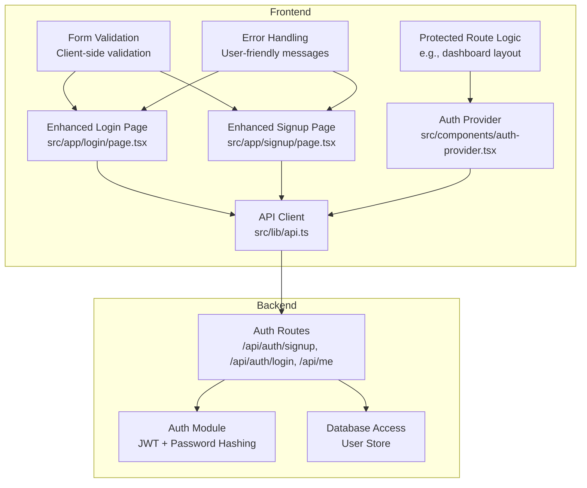
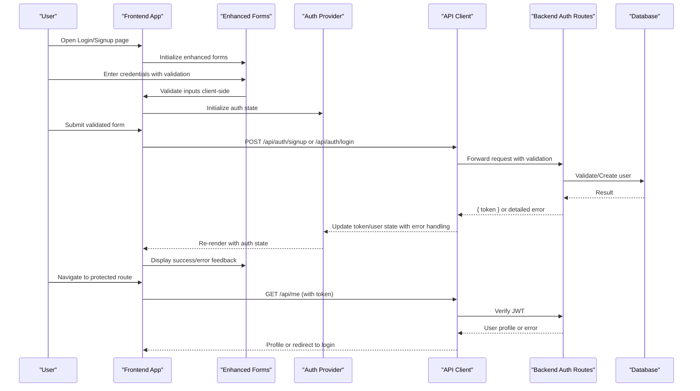
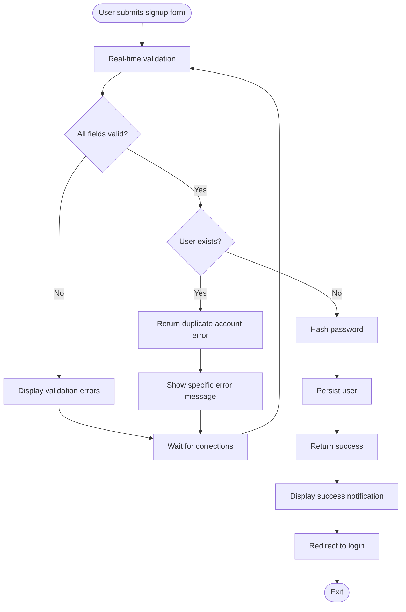
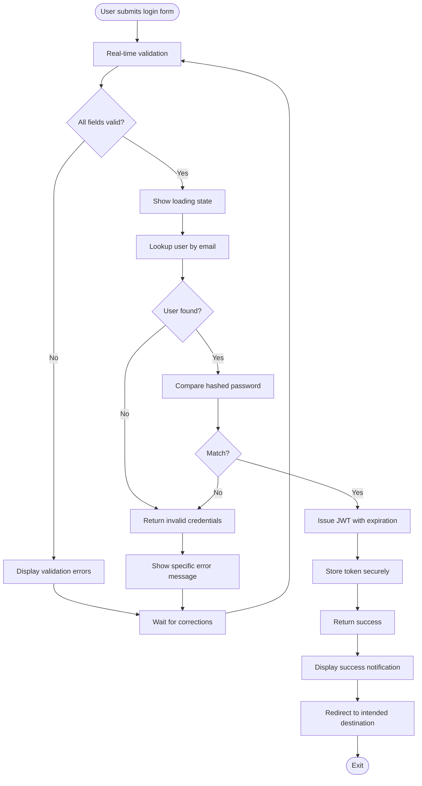
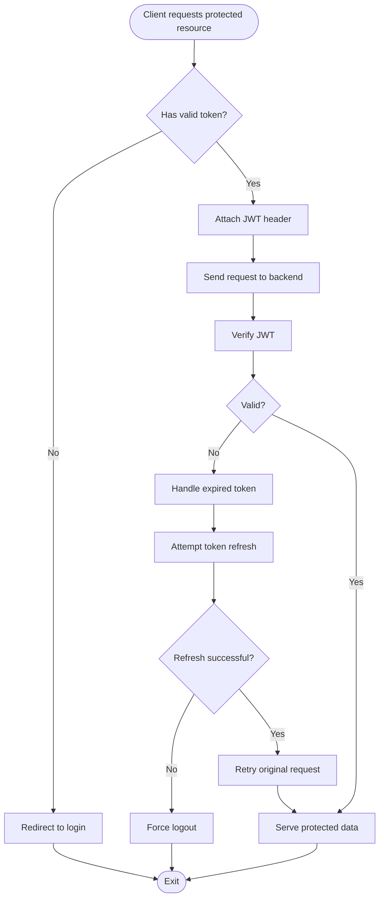
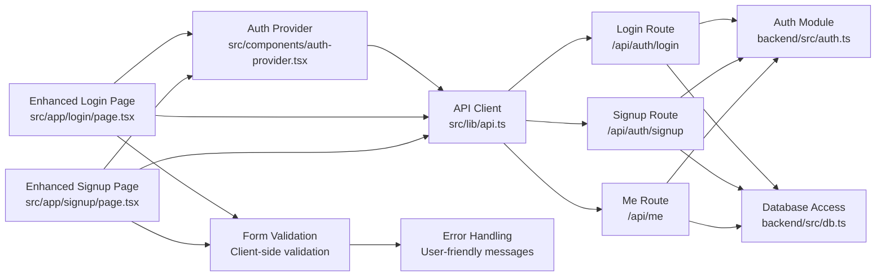

# Authentication System

<cite>
**Referenced Files in This Document**
- [auth.ts](file://backend/src/auth.ts)
- [index.ts](file://backend/src/index.ts)
- [db.ts](file://backend/src/db.ts)
- [login/route.ts](file://src/app/api/auth/login/route.ts)
- [signup/route.ts](file://src/app/api/auth/signup/route.ts)
- [me/route.ts](file://src/app/api/me/route.ts)
- [auth-provider.tsx](file://src/components/auth-provider.tsx)
- [api.ts](file://src/lib/api.ts)
- [page.tsx](file://src/app/login/page.tsx)
- [page.tsx](file://src/app/signup/page.tsx)
</cite>

## Update Summary
**Changes Made**
- Enhanced login and signup pages with improved validation and error handling
- Updated global authentication state management through context providers
- Improved user experience with better form validation and feedback
- Strengthened error handling throughout the authentication flow

## Table of Contents
1. [Introduction](#introduction)
2. [Project Structure](#project-structure)
3. [Core Components](#core-components)
4. [Architecture Overview](#architecture-overview)
5. [Detailed Component Analysis](#detailed-component-analysis)
6. [Enhanced User Interface Components](#enhanced-user-interface-components)
7. [Dependency Analysis](#dependency-analysis)
8. [Performance Considerations](#performance-considerations)
9. [Troubleshooting Guide](#troubleshooting-guide)
10. [Conclusion](#conclusion)

## Introduction
This document explains the authentication system in CheapModels with a focus on JWT-based flows, including user registration, login, token management, and session handling. The system has been enhanced with improved login/signup pages featuring better validation, comprehensive error handling, and robust global authentication state management through context providers. It documents how the frontend auth provider manages authentication state across the application and clarifies the integration between frontend auth context and backend authentication endpoints. Practical guidance is provided for implementing protected routes, handling authentication errors, and managing user sessions.

## Project Structure
The authentication system spans both backend and frontend with enhanced user interface components:
- Backend:
  - Authentication utilities and middleware (JWT creation/verification, password hashing).
  - API routes for signup, login, and current user retrieval.
  - Database access for user storage and lookup.
- Frontend:
  - Enhanced auth context provider to manage login state and tokens with improved error handling.
  - API client helpers for calling authentication endpoints with better validation.
  - Improved login and signup pages with comprehensive form validation and user feedback.
  - Pages and components that rely on the auth context for protected navigation.

**Diagram sources**
- [auth-provider.tsx](file://src/components/auth-provider.tsx)
- [api.ts](file://src/lib/api.ts)
- [login/route.ts](file://src/app/api/auth/login/route.ts)
- [signup/route.ts](file://src/app/api/auth/signup/route.ts)
- [me/route.ts](file://src/app/api/me/route.ts)
- [auth.ts](file://backend/src/auth.ts)
- [db.ts](file://backend/src/db.ts)
- [page.tsx](file://src/app/login/page.tsx)
- [page.tsx](file://src/app/signup/page.tsx)

**Section sources**
- [auth-provider.tsx](file://src/components/auth-provider.tsx)
- [api.ts](file://src/lib/api.ts)
- [login/route.ts](file://src/app/api/auth/login/route.ts)
- [signup/route.ts](file://src/app/api/auth/signup/route.ts)
- [me/route.ts](file://src/app/api/me/route.ts)
- [auth.ts](file://backend/src/auth.ts)
- [db.ts](file://backend/src/db.ts)
- [page.tsx](file://src/app/login/page.tsx)
- [page.tsx](file://src/app/signup/page.tsx)

## Core Components
- Backend Auth Module: Implements JWT signing and verification, and password hashing utilities used by authentication routes.
- Backend Auth Routes:
  - Signup: Creates a new user record after validating input and hashing the password.
  - Login: Validates credentials, issues a JWT, and returns it to the client.
  - Me: Verifies the JWT from the request and returns the authenticated user's profile.
- Frontend Auth Provider: Maintains the current user state and token lifecycle with enhanced error handling, exposing methods to log in, log out, and refresh user data.
- Frontend API Client: Centralizes HTTP calls to authentication endpoints, attaching the JWT where required and handling common error responses with improved validation.
- Enhanced UI Components: Improved login and signup pages with comprehensive form validation, real-time feedback, and user-friendly error messages.

Key responsibilities:
- Securely hash passwords before persistence.
- Issue short-lived JWTs with appropriate claims and expiration.
- Persist tokens securely on the client side.
- Provide a consistent auth context to UI components with enhanced state management.
- Enforce protected routes based on authentication state.
- Implement robust client-side validation and error handling.

**Section sources**
- [auth.ts](file://backend/src/auth.ts)
- [login/route.ts](file://src/app/api/auth/login/route.ts)
- [signup/route.ts](file://src/app/api/auth/signup/route.ts)
- [me/route.ts](file://src/app/api/me/route.ts)
- [auth-provider.tsx](file://src/components/auth-provider.tsx)
- [api.ts](file://src/lib/api.ts)
- [page.tsx](file://src/app/login/page.tsx)
- [page.tsx](file://src/app/signup/page.tsx)

## Architecture Overview
The authentication flow uses JWTs issued by the backend and consumed by the frontend with enhanced user experience. The frontend stores the token and attaches it to subsequent requests. The backend verifies the token to protect sensitive endpoints. Enhanced validation and error handling provide better user feedback throughout the process.

**Diagram sources**
- [auth-provider.tsx](file://src/components/auth-provider.tsx)
- [api.ts](file://src/lib/api.ts)
- [login/route.ts](file://src/app/api/auth/login/route.ts)
- [signup/route.ts](file://src/app/api/auth/signup/route.ts)
- [me/route.ts](file://src/app/api/me/route.ts)
- [auth.ts](file://backend/src/auth.ts)
- [db.ts](file://backend/src/db.ts)
- [page.tsx](file://src/app/login/page.tsx)
- [page.tsx](file://src/app/signup/page.tsx)

## Detailed Component Analysis

### Backend Authentication Module
Responsibilities:
- Password hashing: Uses a secure hashing algorithm to transform plaintext passwords into irreversible hashes before storing them.
- JWT operations: Signs tokens with a secret key and verifies incoming tokens to extract user identity and claims.
- Token configuration: Sets token expiration and payload structure to balance security and usability.

Security considerations:
- Use a strong, environment-backed secret for signing.
- Keep token payloads minimal and avoid sensitive data.
- Set reasonable expiration times and consider refresh strategies if needed.

**Section sources**
- [auth.ts](file://backend/src/auth.ts)

### Backend Auth Routes
- Signup:
  - Validates input fields with enhanced error checking.
  - Checks for existing users.
  - Hashes the password.
  - Persists the user record.
  - Returns success response with detailed error information.
- Login:
  - Validates email/password with comprehensive checks.
  - Compares hashed password.
  - Issues a JWT with user identifier and expiration.
  - Returns the token to the client with proper error handling.
- Me:
  - Extracts and verifies the JWT from the request.
  - Returns the authenticated user's profile.
  - Handles invalid/expired tokens gracefully with clear error messages.

Error handling:
- Return clear status codes and messages for validation failures, duplicate accounts, and invalid credentials.
- Avoid leaking internal details in error responses while providing actionable feedback.

**Section sources**
- [login/route.ts](file://src/app/api/auth/login/route.ts)
- [signup/route.ts](file://src/app/api/auth/signup/route.ts)
- [me/route.ts](file://src/app/api/me/route.ts)
- [db.ts](file://backend/src/db.ts)

### Frontend Auth Provider
Responsibilities:
- State management: Holds current user and token state with enhanced error tracking.
- Lifecycle: Initializes from persisted storage, updates on login/logout, and refreshes user info when needed.
- API integration: Calls authentication endpoints via the API client and handles responses with improved error handling.
- Context exposure: Provides login, logout, and user getters to components with comprehensive state management.

Storage strategy:
- Persist token and minimal user info in a secure storage mechanism.
- Ensure token is attached to subsequent requests automatically.
- Handle storage errors gracefully with fallback mechanisms.

**Section sources**
- [auth-provider.tsx](file://src/components/auth-provider.tsx)
- [api.ts](file://src/lib/api.ts)

### Frontend API Client
Responsibilities:
- Base URL and headers configuration with enhanced error handling.
- Attaches JWT to requests requiring authentication.
- Normalizes error responses and maps them to user-friendly messages.
- Provides helper functions for auth-related endpoints with comprehensive validation.

Integration points:
- Used by the auth provider and pages to call backend endpoints.
- Centralizes retry and error-handling logic for consistency.
- Implements timeout handling and network error recovery.

**Section sources**
- [api.ts](file://src/lib/api.ts)

### Protected Routes Implementation
Patterns:
- Guard components or layout wrappers check the auth context before rendering protected content.
- Redirect unauthenticated users to the login page with return URL preservation.
- Optionally fetch user profile on mount to validate token freshness.
- Handle loading states during authentication checks.

Best practices:
- Avoid rendering protected UI until auth state is resolved.
- Handle network errors and token expiration by prompting re-login.
- Implement smooth transitions and loading indicators.

### Security Implementation Details
Password hashing:
- Always hash passwords before storage; never store plaintext.
- Use a robust algorithm with appropriate work factor.

Token expiration:
- Configure short-lived tokens to limit exposure window.
- Consider refresh mechanisms if long sessions are required.

Session handling:
- Persist tokens securely on the client.
- Clear tokens on logout and handle expired tokens gracefully.
- Implement automatic token refresh when possible.

**Section sources**
- [auth.ts](file://backend/src/auth.ts)
- [auth-provider.tsx](file://src/components/auth-provider.tsx)

### Enhanced User Interface Components

#### Enhanced Login Page
Features:
- Real-time form validation with immediate feedback.
- Comprehensive error handling with user-friendly messages.
- Loading states during authentication attempts.
- Remember me functionality with secure token persistence.
- Password visibility toggle for better user experience.
- Email format validation and domain checking.

User Experience Improvements:
- Inline validation errors displayed next to input fields.
- Success notifications upon successful login.
- Automatic redirection to intended destination after login.
- Support for keyboard navigation and accessibility.

#### Enhanced Signup Page
Features:
- Advanced form validation with real-time feedback.
- Password strength indicator and requirements checklist.
- Email availability checking with server-side validation.
- Terms and conditions acceptance with validation.
- Comprehensive error handling with specific error messages.
- Auto-focus management and tab order optimization.

Validation Enhancements:
- Client-side validation for immediate user feedback.
- Server-side validation for security and data integrity.
- Specific error messages for different validation failures.
- Visual indicators for valid/invalid input states.

**Section sources**
- [page.tsx](file://src/app/login/page.tsx)
- [page.tsx](file://src/app/signup/page.tsx)

### End-to-End Flow Diagrams

#### Enhanced Registration Flow

**Diagram sources**
- [signup/route.ts](file://src/app/api/auth/signup/route.ts)
- [db.ts](file://backend/src/db.ts)
- [page.tsx](file://src/app/signup/page.tsx)

#### Enhanced Login Flow

**Diagram sources**
- [login/route.ts](file://src/app/api/auth/login/route.ts)
- [auth.ts](file://backend/src/auth.ts)
- [db.ts](file://backend/src/db.ts)
- [page.tsx](file://src/app/login/page.tsx)

#### Protected Resource Access

**Diagram sources**
- [me/route.ts](file://src/app/api/me/route.ts)
- [auth.ts](file://backend/src/auth.ts)
- [auth-provider.tsx](file://src/components/auth-provider.tsx)

## Dependency Analysis
The following diagram shows core dependencies between authentication components with enhanced UI integration:

**Diagram sources**
- [auth-provider.tsx](file://src/components/auth-provider.tsx)
- [api.ts](file://src/lib/api.ts)
- [login/route.ts](file://src/app/api/auth/login/route.ts)
- [signup/route.ts](file://src/app/api/auth/signup/route.ts)
- [me/route.ts](file://src/app/api/me/route.ts)
- [auth.ts](file://backend/src/auth.ts)
- [db.ts](file://backend/src/db.ts)
- [page.tsx](file://src/app/login/page.tsx)
- [page.tsx](file://src/app/signup/page.tsx)

**Section sources**
- [auth-provider.tsx](file://src/components/auth-provider.tsx)
- [api.ts](file://src/lib/api.ts)
- [login/route.ts](file://src/app/api/auth/login/route.ts)
- [signup/route.ts](file://src/app/api/auth/signup/route.ts)
- [me/route.ts](file://src/app/api/me/route.ts)
- [auth.ts](file://backend/src/auth.ts)
- [db.ts](file://backend/src/db.ts)
- [page.tsx](file://src/app/login/page.tsx)
- [page.tsx](file://src/app/signup/page.tsx)

## Performance Considerations
- Minimize payload size in JWTs to reduce bandwidth overhead.
- Cache user profile briefly on the client to avoid frequent calls to /api/me.
- Implement token refresh only when necessary to balance security and performance.
- Use efficient database queries and indexes for user lookups during login and signup.
- Optimize form validation to prevent unnecessary server requests.
- Implement debouncing for real-time validation to reduce API calls.
- Use lazy loading for authentication-related components.

## Troubleshooting Guide
Common issues and resolutions:
- Invalid or expired token:
  - Ensure the token is attached to requests and not stale.
  - Prompt the user to re-login when the token expires.
  - Check token refresh implementation in the auth provider.
- Duplicate account errors:
  - Check signup validation and existing user checks.
  - Verify email uniqueness constraints in the database.
- Incorrect credentials:
  - Verify password hashing and comparison logic.
  - Check for case sensitivity issues in email addresses.
- CORS or network errors:
  - Confirm API base URLs and headers configuration.
  - Check browser console for detailed error messages.
- Form validation issues:
  - Verify client-side validation rules match server requirements.
  - Check for proper error message localization.
- Loading state problems:
  - Ensure loading states are properly managed during async operations.
  - Check for race conditions in authentication flows.

Operational tips:
- Log detailed but safe error information on the backend.
- Surface user-friendly messages on the frontend.
- Add retry logic for transient network failures.
- Implement comprehensive logging for authentication events.
- Monitor authentication failure rates and patterns.

**Section sources**
- [auth-provider.tsx](file://src/components/auth-provider.tsx)
- [api.ts](file://src/lib/api.ts)
- [login/route.ts](file://src/app/api/auth/login/route.ts)
- [signup/route.ts](file://src/app/api/auth/signup/route.ts)
- [me/route.ts](file://src/app/api/me/route.ts)
- [auth.ts](file://backend/src/auth.ts)
- [page.tsx](file://src/app/login/page.tsx)
- [page.tsx](file://src/app/signup/page.tsx)

## Conclusion
CheapModels implements a secure, JWT-based authentication system with clear separation between backend and frontend concerns, now enhanced with improved user experience. The backend handles credential validation, password hashing, and token issuance/verification, while the frontend maintains an auth context with enhanced state management and persists tokens for seamless user experiences. The recent improvements include comprehensive form validation, better error handling, and more intuitive user interfaces for login and signup processes. By following the patterns outlined here—secure hashing, short-lived tokens, robust error handling, guarded routes, and enhanced user feedback—you can extend and maintain the authentication system effectively while providing an excellent user experience.