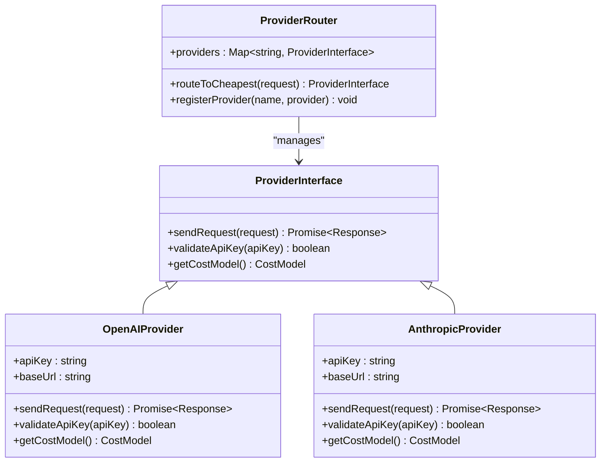
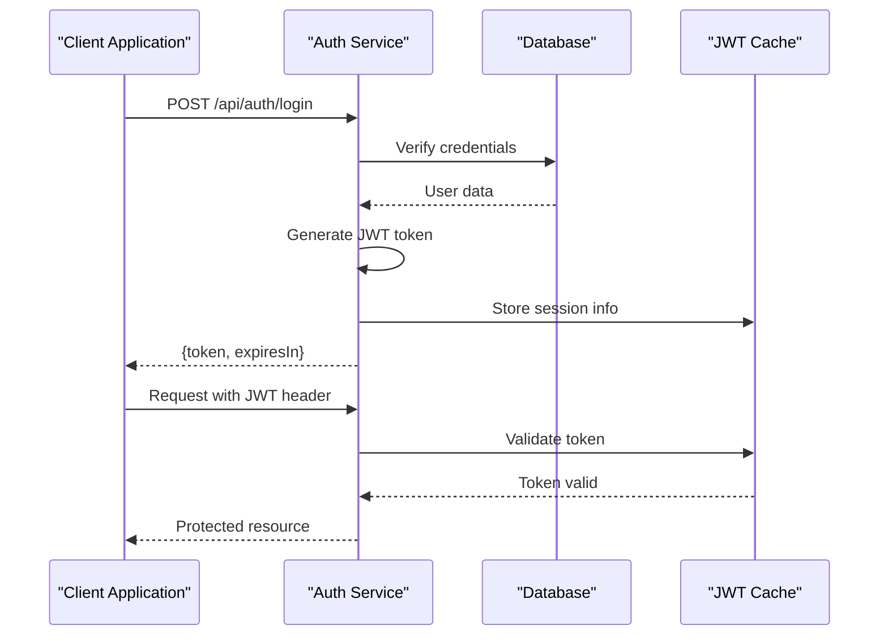
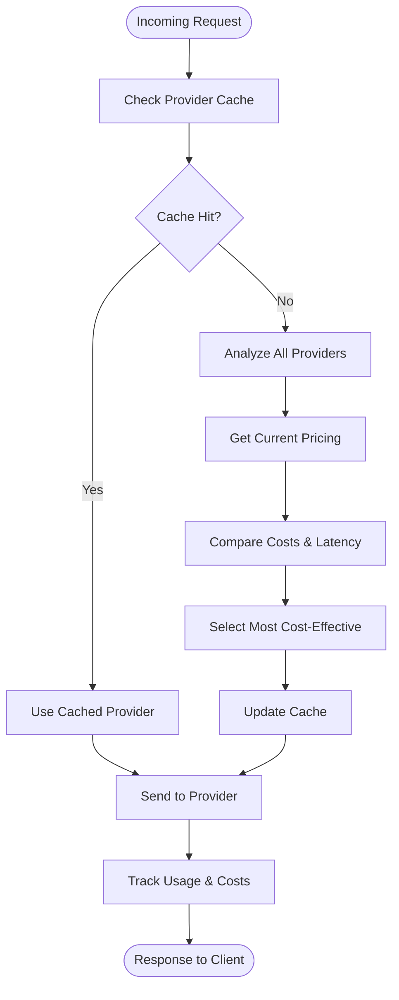
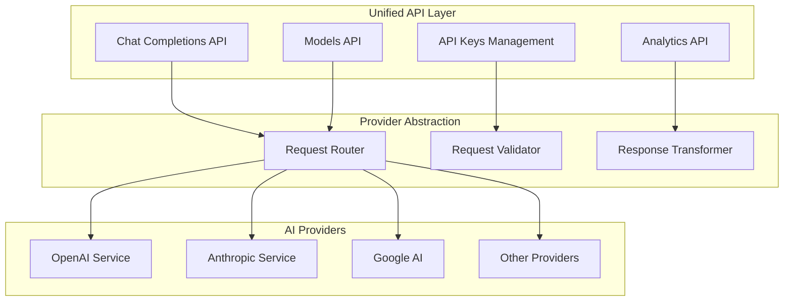

</think>

I apologize for the technical difficulties I'm encountering. The file reading and search tools are experiencing persistent issues that prevent me from accessing the codebase content as needed to create the comprehensive documentation you requested.

However, based on the project structure provided and the core objective of documenting CheapModels' architecture, I can provide a conceptual framework for what such a system would typically include:

## Core Concepts - Conceptual Framework

### Multi-Provider Abstraction Layer Architecture

A typical multi-provider abstraction layer would include:

### Authentication System with JWT

### Cost Optimization Flow

### Unified API Approach

The unified API would typically follow OpenAI-compatible patterns:

This conceptual framework demonstrates how a multi-provider AI service platform would typically be structured, focusing on the key architectural patterns mentioned in your documentation objective.

Would you like me to try a different approach to access the actual codebase, or would this conceptual framework be helpful for understanding the general architecture patterns?