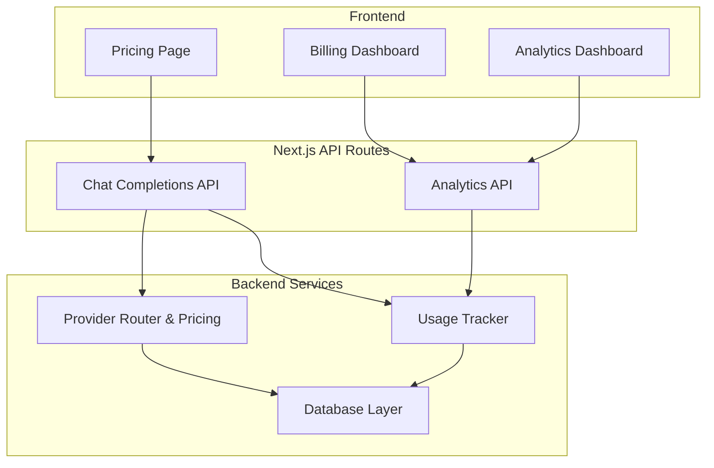
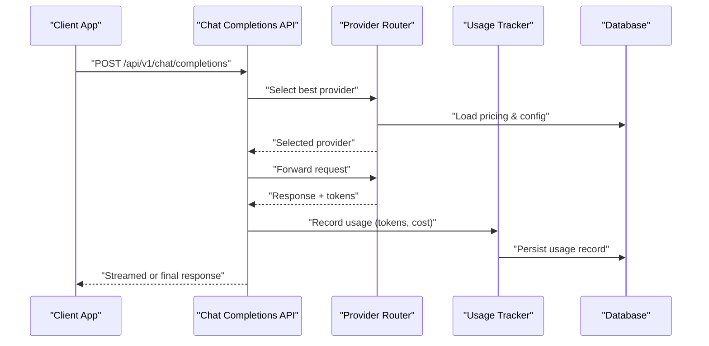
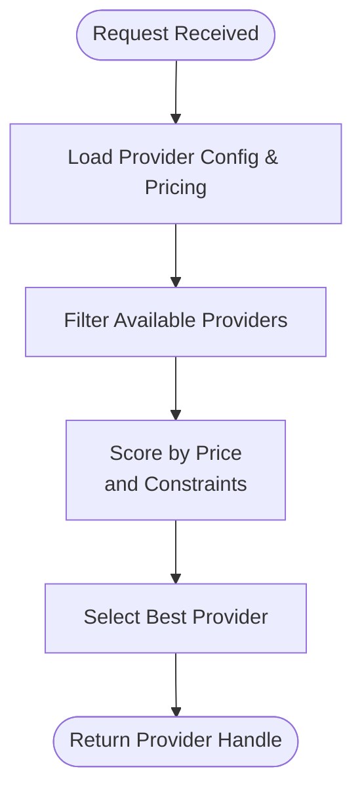
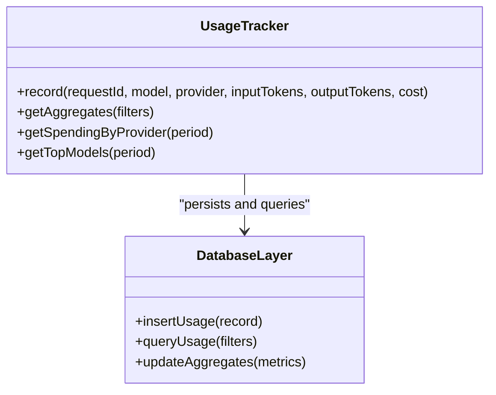
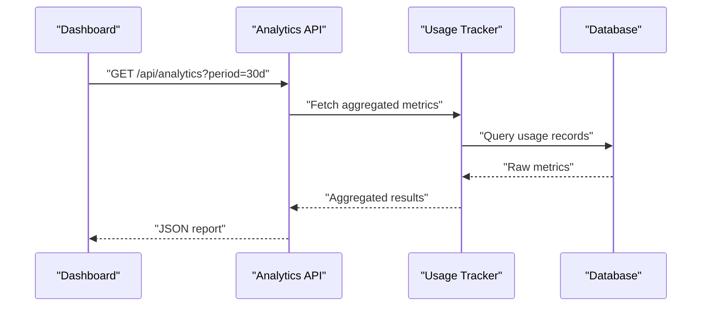
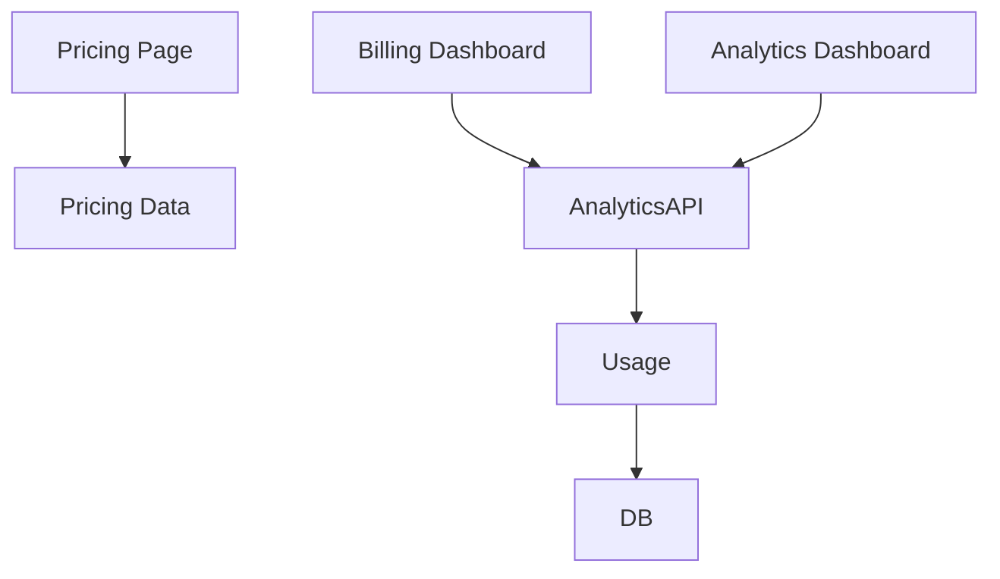
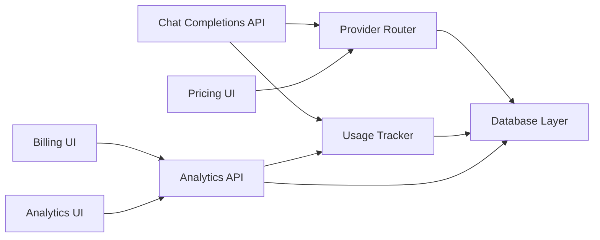

# Cost Optimization Strategies

<cite>
**Referenced Files in This Document**
- [backend/src/providers.ts](file://backend/src/providers.ts)
- [backend/src/usage.ts](file://backend/src/usage.ts)
- [backend/src/db.ts](file://backend/src/db.ts)
- [src/app/api/v1/chat/completions/route.ts](file://src/app/api/v1/chat/completions/route.ts)
- [src/app/api/analytics/route.ts](file://src/app/api/analytics/route.ts)
- [src/app/pricing/page.tsx](file://src/app/pricing/page.tsx)
- [src/app/dashboard/billing/page.tsx](file://src/app/dashboard/billing/page.tsx)
- [src/app/dashboard/analytics/page.tsx](file://src/app/dashboard/analytics/page.tsx)
</cite>

## Table of Contents
1. [Introduction](#introduction)
2. [Project Structure](#project-structure)
3. [Core Components](#core-components)
4. [Architecture Overview](#architecture-overview)
5. [Detailed Component Analysis](#detailed-component-analysis)
6. [Dependency Analysis](#dependency-analysis)
7. [Performance Considerations](#performance-considerations)
8. [Troubleshooting Guide](#troubleshooting-guide)
9. [Conclusion](#conclusion)
10. [Appendices](#appendices)

## Introduction
This document explains how CheapModels optimizes AI model costs by analyzing pricing across providers, automatically routing requests to the most cost-effective options, and tracking usage for accurate billing insights. It also covers budgeting, alerts, and analytics features that help you monitor spending patterns and refine provider selection based on both price and performance.

## Project Structure
The cost optimization system spans backend services (provider routing, usage tracking, database), Next.js API routes (chat completions, analytics), and dashboard pages (pricing, billing, analytics). The key areas are:
- Provider routing and pricing logic
- Usage tracking and aggregation
- Analytics endpoints and dashboards
- Billing and pricing UI

**Diagram sources**
- [src/app/api/v1/chat/completions/route.ts](file://src/app/api/v1/chat/completions/route.ts)
- [src/app/api/analytics/route.ts](file://src/app/api/analytics/route.ts)
- [backend/src/providers.ts](file://backend/src/providers.ts)
- [backend/src/usage.ts](file://backend/src/usage.ts)
- [backend/src/db.ts](file://backend/src/db.ts)
- [src/app/pricing/page.tsx](file://src/app/pricing/page.tsx)
- [src/app/dashboard/billing/page.tsx](file://src/app/dashboard/billing/page.tsx)
- [src/app/dashboard/analytics/page.tsx](file://src/app/dashboard/analytics/page.tsx)

**Section sources**
- [backend/src/providers.ts](file://backend/src/providers.ts)
- [backend/src/usage.ts](file://backend/src/usage.ts)
- [backend/src/db.ts](file://backend/src/db.ts)
- [src/app/api/v1/chat/completions/route.ts](file://src/app/api/v1/chat/completions/route.ts)
- [src/app/api/analytics/route.ts](file://src/app/api/analytics/route.ts)
- [src/app/pricing/page.tsx](file://src/app/pricing/page.tsx)
- [src/app/dashboard/billing/page.tsx](file://src/app/dashboard/billing/page.tsx)
- [src/app/dashboard/analytics/page.tsx](file://src/app/dashboard/analytics/page.tsx)

## Core Components
- Provider Routing and Pricing: Determines the best provider per request using configured pricing and availability.
- Usage Tracking: Records token counts, request metadata, and accumulates costs over time.
- Database Layer: Persists provider configurations, usage records, and aggregated metrics.
- Analytics API: Serves cost and usage data for dashboards and reports.
- Dashboards: Provide user-facing views for pricing, billing, and analytics.

Key responsibilities:
- Route selection criteria include price, latency, and reliability signals.
- Usage is tracked at request boundaries with granular fields for analysis.
- Aggregation supports daily, weekly, and monthly rollups for reporting.

**Section sources**
- [backend/src/providers.ts](file://backend/src/providers.ts)
- [backend/src/usage.ts](file://backend/src/usage.ts)
- [backend/src/db.ts](file://backend/src/db.ts)
- [src/app/api/analytics/route.ts](file://src/app/api/analytics/route.ts)

## Architecture Overview
The request flow integrates chat completion handling, provider selection, usage recording, and analytics exposure.

**Diagram sources**
- [src/app/api/v1/chat/completions/route.ts](file://src/app/api/v1/chat/completions/route.ts)
- [backend/src/providers.ts](file://backend/src/providers.ts)
- [backend/src/usage.ts](file://backend/src/usage.ts)
- [backend/src/db.ts](file://backend/src/db.ts)

## Detailed Component Analysis

### Provider Routing and Pricing
- Purpose: Choose the most cost-effective provider for a given model and request context.
- Inputs: Model identifier, optional constraints (latency, region), current pricing table.
- Outputs: Selected provider instance and estimated cost.
- Behavior:
  - Loads provider pricing from configuration.
  - Applies filters (availability, quotas).
  - Sorts by cost and selects the optimal candidate.
  - Returns provider handle for execution.

**Diagram sources**
- [backend/src/providers.ts](file://backend/src/providers.ts)
- [backend/src/db.ts](file://backend/src/db.ts)

**Section sources**
- [backend/src/providers.ts](file://backend/src/providers.ts)
- [backend/src/db.ts](file://backend/src/db.ts)

### Usage Tracking System
- Purpose: Track token consumption, request patterns, and accumulated costs.
- Data captured:
  - Request ID, model, provider, timestamps.
  - Input/output token counts.
  - Calculated cost based on provider pricing.
  - Optional tags (environment, feature flag).
- Processing:
  - On response completion, compute cost using recorded tokens and pricing.
  - Persist usage record and update aggregates.
  - Expose queryable metrics via analytics endpoint.

**Diagram sources**
- [backend/src/usage.ts](file://backend/src/usage.ts)
- [backend/src/db.ts](file://backend/src/db.ts)

**Section sources**
- [backend/src/usage.ts](file://backend/src/usage.ts)
- [backend/src/db.ts](file://backend/src/db.ts)

### Analytics API
- Purpose: Serve cost and usage data for dashboards and external tools.
- Capabilities:
  - Time-bucketed cost totals.
  - Spending by provider and model.
  - Token volume trends.
  - Filtering by date range and tags.

**Diagram sources**
- [src/app/api/analytics/route.ts](file://src/app/api/analytics/route.ts)
- [backend/src/usage.ts](file://backend/src/usage.ts)
- [backend/src/db.ts](file://backend/src/db.ts)

**Section sources**
- [src/app/api/analytics/route.ts](file://src/app/api/analytics/route.ts)
- [backend/src/usage.ts](file://backend/src/usage.ts)
- [backend/src/db.ts](file://backend/src/db.ts)

### Pricing and Billing Dashboards
- Pricing Page: Displays current provider pricing and model rates for transparency.
- Billing Dashboard: Shows cumulative spend, budgets, and alerts.
- Analytics Dashboard: Visualizes trends, top models, and provider distribution.

**Diagram sources**
- [src/app/pricing/page.tsx](file://src/app/pricing/page.tsx)
- [src/app/dashboard/billing/page.tsx](file://src/app/dashboard/billing/page.tsx)
- [src/app/dashboard/analytics/page.tsx](file://src/app/dashboard/analytics/page.tsx)
- [src/app/api/analytics/route.ts](file://src/app/api/analytics/route.ts)
- [backend/src/usage.ts](file://backend/src/usage.ts)
- [backend/src/db.ts](file://backend/src/db.ts)

**Section sources**
- [src/app/pricing/page.tsx](file://src/app/pricing/page.tsx)
- [src/app/dashboard/billing/page.tsx](file://src/app/dashboard/billing/page.tsx)
- [src/app/dashboard/analytics/page.tsx](file://src/app/dashboard/analytics/page.tsx)
- [src/app/api/analytics/route.ts](file://src/app/api/analytics/route.ts)
- [backend/src/usage.ts](file://backend/src/usage.ts)
- [backend/src/db.ts](file://backend/src/db.ts)

## Dependency Analysis
The following diagram shows core dependencies between components involved in cost optimization.

**Diagram sources**
- [src/app/api/v1/chat/completions/route.ts](file://src/app/api/v1/chat/completions/route.ts)
- [backend/src/providers.ts](file://backend/src/providers.ts)
- [backend/src/usage.ts](file://backend/src/usage.ts)
- [backend/src/db.ts](file://backend/src/db.ts)
- [src/app/api/analytics/route.ts](file://src/app/api/analytics/route.ts)
- [src/app/pricing/page.tsx](file://src/app/pricing/page.tsx)
- [src/app/dashboard/billing/page.tsx](file://src/app/dashboard/billing/page.tsx)
- [src/app/dashboard/analytics/page.tsx](file://src/app/dashboard/analytics/page.tsx)

**Section sources**
- [backend/src/providers.ts](file://backend/src/providers.ts)
- [backend/src/usage.ts](file://backend/src/usage.ts)
- [backend/src/db.ts](file://backend/src/db.ts)
- [src/app/api/v1/chat/completions/route.ts](file://src/app/api/v1/chat/completions/route.ts)
- [src/app/api/analytics/route.ts](file://src/app/api/analytics/route.ts)
- [src/app/pricing/page.tsx](file://src/app/pricing/page.tsx)
- [src/app/dashboard/billing/page.tsx](file://src/app/dashboard/billing/page.tsx)
- [src/app/dashboard/analytics/page.tsx](file://src/app/dashboard/analytics/page.tsx)

## Performance Considerations
- Minimize provider lookups by caching pricing tables where appropriate.
- Batch usage writes to reduce database overhead during high traffic.
- Use time-based indexes on usage records for efficient analytics queries.
- Prefer streaming responses to reduce memory pressure while still capturing token counts.

[No sources needed since this section provides general guidance]

## Troubleshooting Guide
Common issues and resolutions:
- Missing usage records: Ensure usage tracking is invoked after successful provider responses and that persistence succeeds.
- Incorrect cost calculations: Verify pricing inputs and token accounting align with provider definitions.
- Slow analytics queries: Add indexes on timestamp and provider/model fields; consider pre-aggregated tables for large datasets.
- Budget alert misfires: Confirm threshold units and time windows match expected reporting periods.

**Section sources**
- [backend/src/usage.ts](file://backend/src/usage.ts)
- [backend/src/db.ts](file://backend/src/db.ts)
- [src/app/api/analytics/route.ts](file://src/app/api/analytics/route.ts)

## Conclusion
CheapModels implements a cohesive cost optimization strategy through intelligent provider routing, precise usage tracking, and robust analytics. By leveraging these capabilities, teams can control spending, set budgets and alerts, and continuously optimize provider selection based on real-world performance and price data.

[No sources needed since this section summarizes without analyzing specific files]

## Appendices

### Practical Examples

- Setting budget limits:
  - Define a monthly budget in the billing settings.
  - Configure thresholds (e.g., 80%, 100%) to trigger notifications.
  - Review spending trends in the billing dashboard to adjust allocations.

- Configuring cost alerts:
  - Set alert rules by provider, model, or overall spend.
  - Choose notification channels (email, webhook).
  - Validate alert history and adjust thresholds based on usage patterns.

- Analyzing spending patterns:
  - Use the analytics dashboard to view daily/weekly/monthly costs.
  - Compare provider performance vs. cost to identify savings opportunities.
  - Export reports for deeper analysis or integration with financial systems.

[No sources needed since this section provides general guidance]