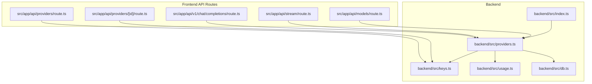
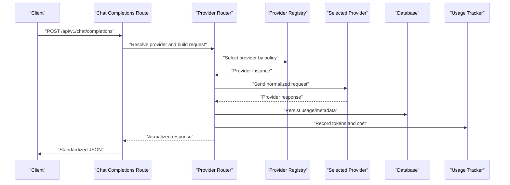
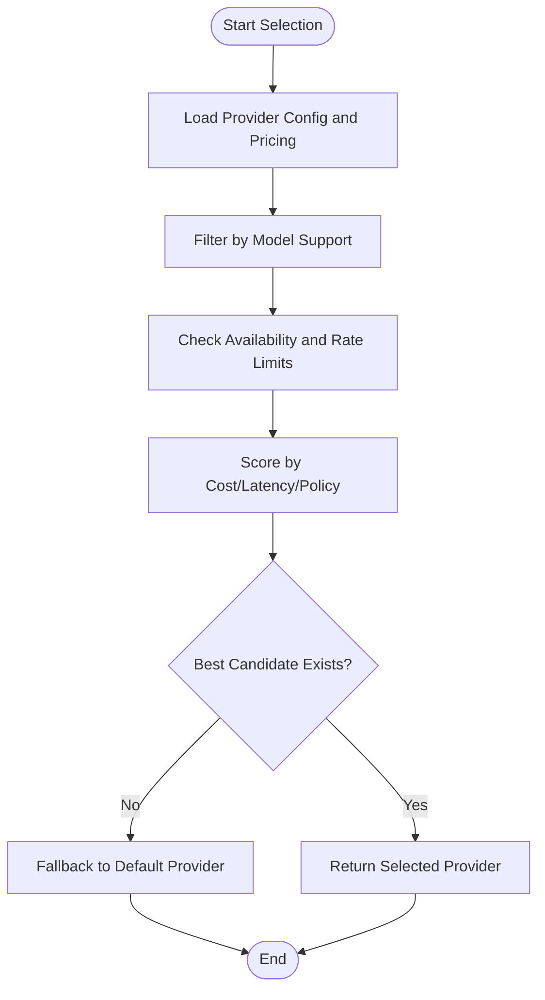
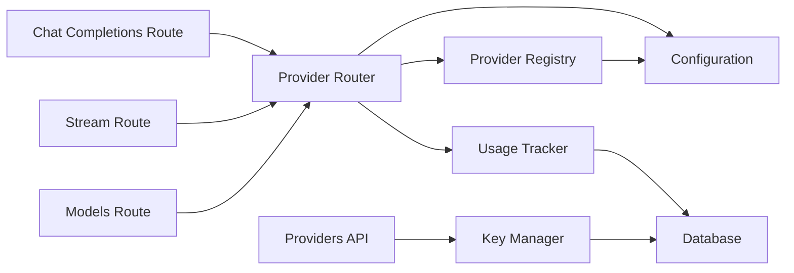

# Provider Abstraction Layer

<cite>
**Referenced Files in This Document**
- [providers.ts](file://backend/src/providers.ts)
- [index.ts](file://backend/src/index.ts)
- [keys.ts](file://backend/src/keys.ts)
- [usage.ts](file://backend/src/usage.ts)
- [db.ts](file://backend/src/db.ts)
- [route.ts](file://src/app/api/v1/chat/completions/route.ts)
- [route.ts](file://src/app/api/stream/route.ts)
- [route.ts](file://src/app/api/models/route.ts)
- [route.ts](file://src/app/api/providers/route.ts)
- [route.ts](file://src/app/api/providers/[id]/route.ts)
</cite>

## Table of Contents
1. [Introduction](#introduction)
2. [Project Structure](#project-structure)
3. [Core Components](#core-components)
4. [Architecture Overview](#architecture-overview)
5. [Detailed Component Analysis](#detailed-component-analysis)
6. [Dependency Analysis](#dependency-analysis)
7. [Performance Considerations](#performance-considerations)
8. [Troubleshooting Guide](#troubleshooting-guide)
9. [Conclusion](#conclusion)
10. [Appendices](#appendices)

## Introduction
This document explains the provider abstraction layer that enables seamless switching between different AI services (for example, OpenAI and Anthropic). It covers how a unified interface hides provider-specific differences, how configuration is managed, how requests are routed to providers, and how responses are normalized. It also includes guidance for adding new providers, customizing behavior, error handling strategies, rate limiting implementation, and cost optimization algorithms that automatically select the most cost-effective provider per request.

## Project Structure
The provider abstraction spans both backend and frontend API routes:
- Backend core logic resides under backend/src, including provider orchestration, key management, usage tracking, and database access.
- Frontend Next.js API routes expose REST endpoints for chat completions, streaming, model listing, and provider management.

**Diagram sources**
- [index.ts](file://backend/src/index.ts)
- [providers.ts](file://backend/src/providers.ts)
- [keys.ts](file://backend/src/keys.ts)
- [usage.ts](file://backend/src/usage.ts)
- [db.ts](file://backend/src/db.ts)
- [route.ts](file://src/app/api/v1/chat/completions/route.ts)
- [route.ts](file://src/app/api/stream/route.ts)
- [route.ts](file://src/app/api/models/route.ts)
- [route.ts](file://src/app/api/providers/route.ts)
- [route.ts](file://src/app/api/providers/[id]/route.ts)

**Section sources**
- [index.ts](file://backend/src/index.ts)
- [providers.ts](file://backend/src/providers.ts)
- [keys.ts](file://backend/src/keys.ts)
- [usage.ts](file://backend/src/usage.ts)
- [db.ts](file://backend/src/db.ts)
- [route.ts](file://src/app/api/v1/chat/completions/route.ts)
- [route.ts](file://src/app/api/stream/route.ts)
- [route.ts](file://src/app/api/models/route.ts)
- [route.ts](file://src/app/api/providers/route.ts)
- [route.ts](file://src/app/api/providers/[id]/route.ts)

## Core Components
- Unified Provider Interface: A common contract defines how any provider must implement request sending, response parsing, streaming support, and metadata retrieval.
- Provider Registry: A registry maps provider identifiers to concrete implementations and exposes selection strategies (e.g., by model, cost, or policy).
- Configuration System: Centralized configuration holds provider credentials, model mappings, pricing, and feature flags.
- Request Router: Chooses the best provider based on configured policies (cost, latency, availability), then dispatches the request.
- Response Normalizer: Converts provider-specific responses into a consistent internal format consumed by the rest of the system.
- Key Management: Securely stores and rotates API keys per provider and user context.
- Usage Tracking: Records tokens, costs, and provider metrics for analytics and billing.
- Database Integration: Persists configuration, keys, usage, and audit logs.

Key responsibilities and interactions:
- The router consults the registry and configuration to pick a provider.
- The selected provider sends the request using its native SDK or HTTP client.
- Responses are normalized before being returned to callers.
- Usage and cost data are recorded for each request.

**Section sources**
- [providers.ts](file://backend/src/providers.ts)
- [keys.ts](file://backend/src/keys.ts)
- [usage.ts](file://backend/src/usage.ts)
- [db.ts](file://backend/src/db.ts)

## Architecture Overview
The abstraction layer sits between API routes and multiple AI providers. It standardizes input/output formats, handles routing decisions, normalizes responses, and tracks usage/costs.

**Diagram sources**
- [route.ts](file://src/app/api/v1/chat/completions/route.ts)
- [providers.ts](file://backend/src/providers.ts)
- [db.ts](file://backend/src/db.ts)
- [usage.ts](file://backend/src/usage.ts)

## Detailed Component Analysis

### Unified Provider Interface
The provider interface defines a consistent set of operations:
- send(request): Sends a chat completion request and returns a normalized response.
- supports(model): Indicates whether a provider supports a given model.
- stream(request): Optional streaming capability returning an event stream.
- getModels(): Returns available models and capabilities.
- getPrice(model): Returns pricing metadata used for cost optimization.

Implementation patterns:
- Each provider adapter implements the interface and encapsulates provider-specific SDK calls and response parsing.
- Error mapping translates provider errors into standardized error codes and messages.
- Feature detection ensures compatibility with requested parameters (e.g., tools, temperature).

**Section sources**
- [providers.ts](file://backend/src/providers.ts)

### Provider Registry and Selection Strategy
Responsibilities:
- Register all available provider adapters.
- Expose selection strategies such as:
  - Cost-first: Choose the cheapest provider supporting the requested model.
  - Latency-first: Choose the fastest provider based on recent performance.
  - Availability-aware: Skip providers with failures or rate limits.
  - Policy-based: Honor user or tenant preferences.

Selection algorithm overview:
- Filter providers by model support and availability.
- Score candidates by cost, latency, and policy weights.
- Pick the highest-scoring provider; fallback to next candidate on failure.

**Diagram sources**
- [providers.ts](file://backend/src/providers.ts)
- [keys.ts](file://backend/src/keys.ts)
- [usage.ts](file://backend/src/usage.ts)

**Section sources**
- [providers.ts](file://backend/src/providers.ts)
- [keys.ts](file://backend/src/keys.ts)
- [usage.ts](file://backend/src/usage.ts)

### Configuration System
Configuration includes:
- Provider credentials and endpoints.
- Model-to-provider mappings and supported features.
- Pricing tables for cost optimization.
- Global and per-user overrides.
- Feature toggles for enabling/disabling providers.

Storage and loading:
- Static defaults are merged with dynamic values from the database or environment variables.
- Hot-reloadable settings allow runtime updates without restarts.

Security:
- Secrets are stored encrypted at rest and injected securely at runtime.
- Access control restricts who can modify provider configurations.

**Section sources**
- [keys.ts](file://backend/src/keys.ts)
- [db.ts](file://backend/src/db.ts)
- [providers.ts](file://backend/src/providers.ts)

### Request Routing Logic
Routing flow:
- API route receives a normalized request payload.
- Router resolves the target provider using the registry and selection strategy.
- The request is transformed into the provider’s expected schema.
- The provider executes the call and returns a response.
- The router normalizes the response back to the common format.

Error handling during routing:
- On provider errors, the router applies retry/backoff and may switch to a fallback provider.
- Partial failures (e.g., streaming interruptions) trigger reconnection or graceful degradation.

**Section sources**
- [route.ts](file://src/app/api/v1/chat/completions/route.ts)
- [providers.ts](file://backend/src/providers.ts)

### Response Normalization
Normalization steps:
- Convert provider-specific fields (choices, content types, tool calls) into a unified structure.
- Ensure consistent token counts and cost calculations.
- Attach metadata such as provider name, model, latency, and usage.

Streaming normalization:
- Aggregate incremental chunks into a coherent stream.
- Emit standardized events for text deltas, tool calls, and final usage summary.

**Section sources**
- [providers.ts](file://backend/src/providers.ts)
- [route.ts](file://src/app/api/stream/route.ts)

### Key Management
Functions:
- Store and retrieve provider API keys securely.
- Rotate keys and manage expiration.
- Scope keys to users or tenants where applicable.

Integration points:
- Provider adapters fetch keys at runtime via the key manager.
- Audit logs record key access events.

**Section sources**
- [keys.ts](file://backend/src/keys.ts)
- [db.ts](file://backend/src/db.ts)

### Usage Tracking and Billing
Metrics captured:
- Input/output tokens, function/tool calls, and total tokens.
- Cost per request derived from pricing tables.
- Provider, model, latency, and error status.

Persistence and reporting:
- Usage records are persisted for analytics and billing.
- Aggregations support dashboards and export.

**Section sources**
- [usage.ts](file://backend/src/usage.ts)
- [db.ts](file://backend/src/db.ts)

### Adding a New AI Provider
Steps to integrate a new provider:
1. Implement the unified provider interface:
   - Provide request sending, response parsing, and optional streaming.
   - Map provider errors to standardized error codes.
2. Register the provider in the registry:
   - Add model support and pricing metadata.
   - Configure feature flags if needed.
3. Update configuration:
   - Add credentials and endpoints.
   - Define model-to-provider mappings.
4. Test routing and normalization:
   - Validate end-to-end flows for non-streaming and streaming.
   - Verify usage and cost recording.
5. Enable in production:
   - Gradually roll out and monitor error rates and latency.

Customization options:
- Override selection strategy for specific models or users.
- Inject custom middleware for logging, retries, or caching.
- Adjust pricing or caps for cost control.

**Section sources**
- [providers.ts](file://backend/src/providers.ts)
- [keys.ts](file://backend/src/keys.ts)
- [usage.ts](file://backend/src/usage.ts)

### Customizing Provider Behavior
Common customization points:
- Per-model routing rules to prefer certain providers.
- Retry policies and timeouts tuned per provider reliability.
- Caching layers for repeated prompts or embeddings.
- Feature gating to disable unsupported capabilities.

**Section sources**
- [providers.ts](file://backend/src/providers.ts)
- [db.ts](file://backend/src/db.ts)

## Dependency Analysis
High-level dependencies among components:
- API routes depend on the provider router and registry.
- Provider router depends on configuration, key management, and usage tracking.
- Usage tracker depends on the database for persistence.
- Key manager depends on secure storage and database integration.

**Diagram sources**
- [route.ts](file://src/app/api/v1/chat/completions/route.ts)
- [route.ts](file://src/app/api/stream/route.ts)
- [route.ts](file://src/app/api/models/route.ts)
- [route.ts](file://src/app/api/providers/route.ts)
- [providers.ts](file://backend/src/providers.ts)
- [keys.ts](file://backend/src/keys.ts)
- [usage.ts](file://backend/src/usage.ts)
- [db.ts](file://backend/src/db.ts)

**Section sources**
- [route.ts](file://src/app/api/v1/chat/completions/route.ts)
- [route.ts](file://src/app/api/stream/route.ts)
- [route.ts](file://src/app/api/models/route.ts)
- [route.ts](file://src/app/api/providers/route.ts)
- [providers.ts](file://backend/src/providers.ts)
- [keys.ts](file://backend/src/keys.ts)
- [usage.ts](file://backend/src/usage.ts)
- [db.ts](file://backend/src/db.ts)

## Performance Considerations
- Connection pooling and keep-alive for provider HTTP clients.
- Streaming to reduce latency and memory footprint for long responses.
- Caching frequent or identical requests when safe.
- Adaptive retry with exponential backoff and jitter.
- Batched usage writes to minimize database overhead.
- Selecting providers with lower latency or higher throughput based on real-time metrics.

[No sources needed since this section provides general guidance]

## Troubleshooting Guide
Common issues and resolutions:
- Authentication failures:
  - Verify key validity and permissions.
  - Check rotation and expiration policies.
- Rate limit errors:
  - Inspect provider headers for quota information.
  - Apply backoff and switch to alternative providers.
- Model not supported:
  - Confirm model-to-provider mappings and feature flags.
- Inconsistent responses:
  - Review normalization logic and field mappings.
- High latency:
  - Analyze provider performance metrics and adjust selection strategy.

Operational checks:
- Monitor usage and cost anomalies.
- Validate database connectivity and write throughput.
- Inspect logs for provider error codes and stack traces.

**Section sources**
- [keys.ts](file://backend/src/keys.ts)
- [usage.ts](file://backend/src/usage.ts)
- [db.ts](file://backend/src/db.ts)
- [providers.ts](file://backend/src/providers.ts)

## Conclusion
The provider abstraction layer delivers a clean, extensible foundation for integrating multiple AI services behind a single interface. By centralizing configuration, routing, normalization, and usage tracking, it simplifies adding new providers, optimizing costs, and maintaining reliability across diverse backends.

[No sources needed since this section summarizes without analyzing specific files]

## Appendices

### API Endpoints Overview
- Chat Completions: Standardized endpoint for non-streaming chat requests.
- Streaming: Endpoint for server-sent events or chunked responses.
- Models: Lists available models and capabilities.
- Providers: Manages provider configurations and keys.

**Section sources**
- [route.ts](file://src/app/api/v1/chat/completions/route.ts)
- [route.ts](file://src/app/api/stream/route.ts)
- [route.ts](file://src/app/api/models/route.ts)
- [route.ts](file://src/app/api/providers/route.ts)
- [route.ts](file://src/app/api/providers/[id]/route.ts)