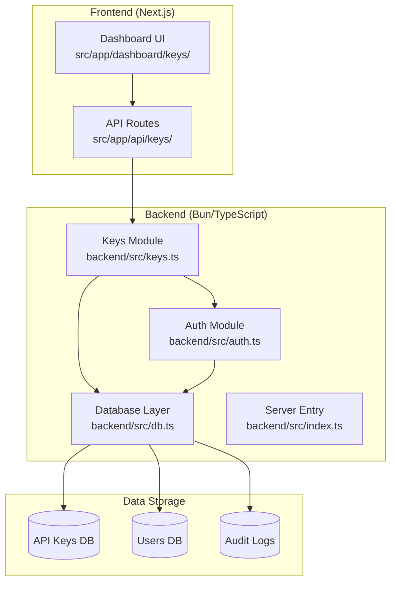
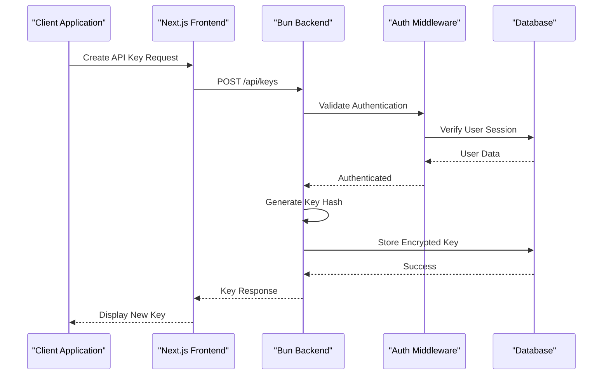
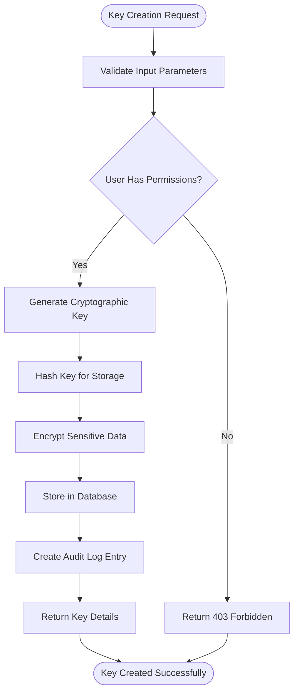
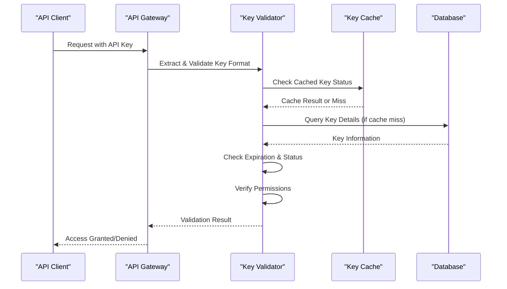
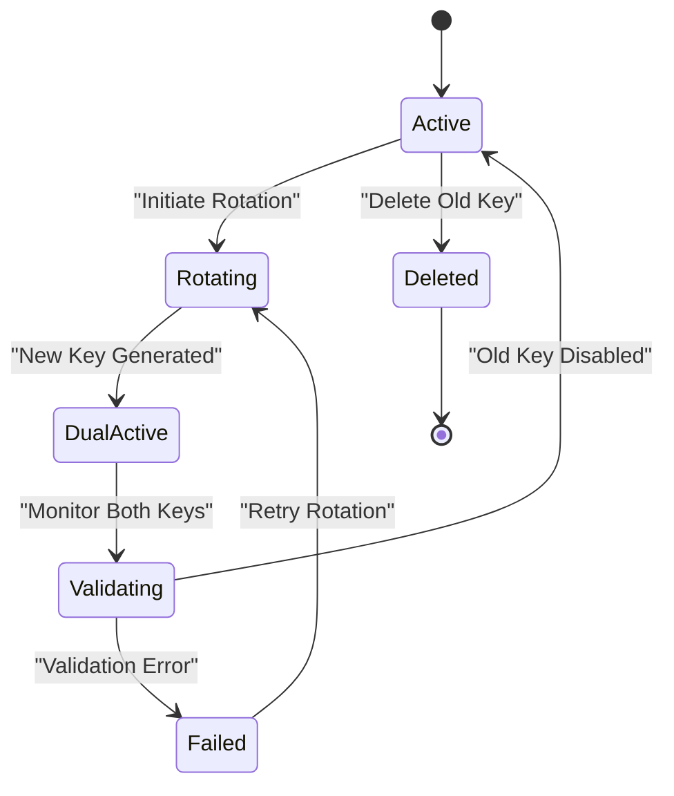
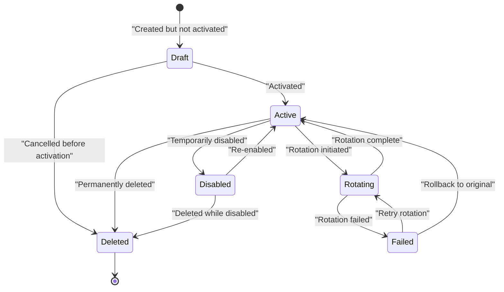
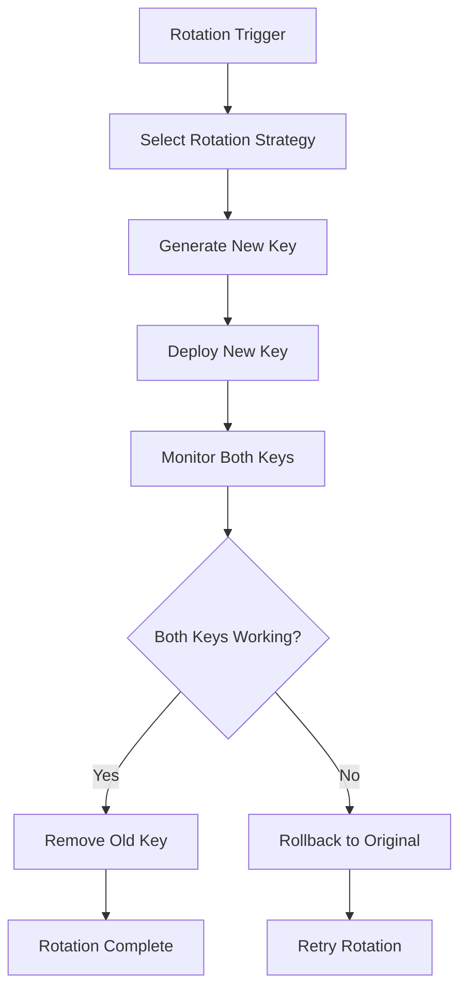
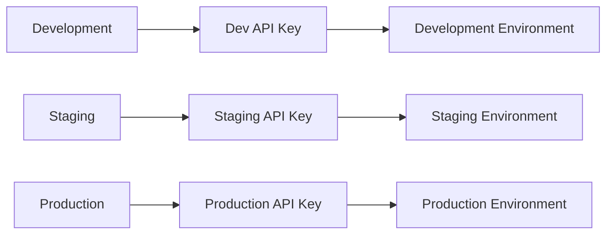

# API Key Management

<cite>
**Referenced Files in This Document**
- [keys.ts](file://backend/src/keys.ts)
- [auth.ts](file://backend/src/auth.ts)
- [route.ts](file://src/app/api/keys/route.ts)
- [route.ts](file://src/app/api/keys/[id]/route.ts)
- [page.tsx](file://src/app/dashboard/keys/page.tsx)
- [db.ts](file://backend/src/db.ts)
- [index.ts](file://backend/src/index.ts)
</cite>

## Table of Contents
1. [Introduction](#introduction)
2. [Project Structure](#project-structure)
3. [Core Components](#core-components)
4. [Architecture Overview](#architecture-overview)
5. [Detailed Component Analysis](#detailed-component-analysis)
6. [API Endpoints](#api-endpoints)
7. [Security Best Practices](#security-best-practices)
8. [Key Lifecycle Management](#key-lifecycle-management)
9. [Access Control Mechanisms](#access-control-mechanisms)
10. [Monitoring and Audit Logging](#monitoring-and-audit-logging)
11. [Automated Key Rotation](#automated-key-rotation)
12. [Bulk Operations](#bulk-operations)
13. [CI/CD Integration](#cicd-integration)
14. [Performance Considerations](#performance-considerations)
15. [Troubleshooting Guide](#troubleshooting-guide)
16. [Conclusion](#conclusion)

## Introduction

This document provides comprehensive documentation for the API key management system within the application. The system implements secure API key creation, rotation, deletion, and lifecycle management with robust security measures, access control mechanisms, and monitoring capabilities.

The API key management system serves as a critical security component that enables secure authentication and authorization for API requests while maintaining proper audit trails and compliance requirements.

## Project Structure

The API key management system is distributed across both backend and frontend components:



**Diagram sources**
- [keys.ts](file://backend/src/keys.ts)
- [auth.ts](file://backend/src/auth.ts)
- [route.ts](file://src/app/api/keys/route.ts)
- [page.tsx](file://src/app/dashboard/keys/page.tsx)

**Section sources**
- [keys.ts](file://backend/src/keys.ts)
- [auth.ts](file://backend/src/auth.ts)
- [route.ts](file://src/app/api/keys/route.ts)
- [page.tsx](file://src/app/dashboard/keys/page.tsx)

## Core Components

### Backend Architecture

The backend implements a modular architecture with clear separation of concerns:

- **Keys Module**: Handles core API key operations including creation, validation, rotation, and deletion
- **Auth Module**: Manages authentication middleware and request authorization
- **Database Layer**: Provides data persistence and query operations
- **Server Entry**: Configures routes and middleware setup

### Frontend Architecture

The frontend provides a user interface for key management through:

- **Dashboard Interface**: User-friendly key management dashboard
- **API Routes**: Next.js API endpoints for client-server communication
- **State Management**: Client-side state handling for key operations

**Section sources**
- [keys.ts](file://backend/src/keys.ts)
- [auth.ts](file://backend/src/auth.ts)
- [db.ts](file://backend/src/db.ts)
- [index.ts](file://backend/src/index.ts)

## Architecture Overview

The API key management system follows a layered architecture pattern with clear separation between presentation, business logic, and data access layers.



**Diagram sources**
- [route.ts](file://src/app/api/keys/route.ts)
- [keys.ts](file://backend/src/keys.ts)
- [auth.ts](file://backend/src/auth.ts)
- [db.ts](file://backend/src/db.ts)

## Detailed Component Analysis

### Key Creation Process

The key creation process involves multiple security layers and validation steps to ensure secure key generation and storage.



**Diagram sources**
- [keys.ts](file://backend/src/keys.ts)
- [auth.ts](file://backend/src/auth.ts)

### Key Validation Flow

The key validation process ensures that only valid, active keys can access protected resources.



**Diagram sources**
- [auth.ts](file://backend/src/auth.ts)
- [keys.ts](file://backend/src/keys.ts)

### Key Rotation Process

Key rotation ensures continuous security by regularly updating credentials without service interruption.



**Diagram sources**
- [keys.ts](file://backend/src/keys.ts)

**Section sources**
- [keys.ts](file://backend/src/keys.ts)
- [auth.ts](file://backend/src/auth.ts)

## API Endpoints

### Key Management Endpoints

The system provides comprehensive RESTful API endpoints for key management operations:

| Endpoint | Method | Description | Authentication | Rate Limit |
|----------|--------|-------------|----------------|------------|
| `/api/keys` | GET | List all API keys | Required | 100/min |
| `/api/keys` | POST | Create new API key | Required | 10/min |
| `/api/keys/:id` | DELETE | Delete specific key | Required | 50/min |
| `/api/keys/:id/rotate` | POST | Rotate specific key | Required | 5/min |
| `/api/keys/:id/disable` | POST | Disable specific key | Required | 50/min |
| `/api/keys/:id/enable` | POST | Enable specific key | Required | 50/min |

### Request/Response Formats

#### Create Key Request
```json
{
  "name": "Production API Key",
  "permissions": ["read", "write"],
  "expires_in": 86400,
  "description": "Key for production environment"
}
```

#### Create Key Response
```json
{
  "id": "key_abc123",
  "name": "Production API Key",
  "key": "sk_live_xxxxxxxx",
  "permissions": ["read", "write"],
  "created_at": "2024-01-01T00:00:00Z",
  "expires_at": "2024-01-02T00:00:00Z",
  "status": "active"
}
```

**Section sources**
- [route.ts](file://src/app/api/keys/route.ts)
- [route.ts](file://src/app/api/keys/[id]/route.ts)

## Security Best Practices

### Key Generation and Storage

- **Cryptographic Strength**: Use cryptographically secure random number generators for key generation
- **Hashing Strategy**: Implement one-way hashing for key storage to prevent plaintext exposure
- **Encryption at Rest**: Apply database-level encryption for sensitive key data
- **Memory Security**: Clear sensitive data from memory after use

### Access Control Implementation

- **Principle of Least Privilege**: Grant minimum required permissions to each key
- **Permission Scoping**: Implement granular permission controls for different operations
- **IP Whitelisting**: Support IP-based access restrictions for enhanced security
- **Rate Limiting**: Apply per-key rate limiting to prevent abuse

### Audit and Monitoring

- **Comprehensive Logging**: Log all key-related operations with timestamps and user context
- **Anomaly Detection**: Monitor for unusual key usage patterns
- **Real-time Alerts**: Set up alerts for suspicious activities
- **Retention Policies**: Maintain audit logs according to compliance requirements

**Section sources**
- [auth.ts](file://backend/src/auth.ts)
- [keys.ts](file://backend/src/keys.ts)

## Key Lifecycle Management

### Complete Lifecycle States

The API key lifecycle encompasses several distinct states with well-defined transitions:



### State Transition Rules

Each state transition has specific validation rules and side effects:

- **Draft to Active**: Requires user confirmation and permission verification
- **Active to Rotating**: Triggers dual-key period with monitoring
- **Active to Disabled**: Immediate effect on new requests, existing tokens remain valid until expiration
- **Any to Deleted**: Permanent removal with audit trail preservation

**Section sources**
- [keys.ts](file://backend/src/keys.ts)

## Access Control Mechanisms

### Permission Model

The system implements a hierarchical permission model:

| Permission Level | Scope | Examples |
|-----------------|-------|----------|
| Read | View-only access | List models, view analytics |
| Write | Modify resources | Create conversations, update settings |
| Admin | Full system access | Manage users, system configuration |
| Custom | Granular permissions | Specific API endpoints, resource types |

### Role-Based Access Control (RBAC)

- **User Roles**: Define roles with predefined permission sets
- **Dynamic Permissions**: Allow runtime permission adjustments
- **Context-Aware Access**: Consider user context, IP location, and time-based restrictions

### Multi-Tenant Support

- **Tenant Isolation**: Ensure keys are scoped to specific tenants
- **Cross-Tenant Access**: Controlled sharing mechanisms when needed
- **Tenant-Level Policies**: Apply organization-wide security policies

**Section sources**
- [auth.ts](file://backend/src/auth.ts)
- [keys.ts](file://backend/src/keys.ts)

## Monitoring and Audit Logging

### Comprehensive Audit Trail

The system maintains detailed audit logs for all key-related operations:

| Event Type | Data Captured | Retention Period |
|------------|---------------|------------------|
| Key Creation | User ID, IP address, timestamp, key metadata | 7 years |
| Key Usage | Request details, response codes, latency metrics | 90 days |
| Permission Changes | Previous/current permissions, change reason | 7 years |
| Rotation Events | Rotation timestamps, success/failure status | 7 years |
| Deletion Events | Deletion reason, authorizing user | 7 years |

### Real-time Monitoring

- **Usage Analytics**: Track key usage patterns and performance metrics
- **Alerting System**: Configure alerts for suspicious activities
- **Dashboard Integration**: Visualize key usage trends and anomalies
- **Export Capabilities**: Export audit logs for compliance reporting

### Compliance Features

- **GDPR Compliance**: Support for data subject requests and right to erasure
- **SOC 2 Controls**: Maintain controls for security and availability
- **Audit Report Generation**: Automated report generation for compliance audits

**Section sources**
- [keys.ts](file://backend/src/keys.ts)
- [auth.ts](file://backend/src/auth.ts)

## Automated Key Rotation

### Rotation Strategies

The system supports multiple automated rotation strategies:

#### Time-based Rotation
- **Fixed Intervals**: Rotate keys every N days/months
- **Calendar-based**: Rotate on specific dates or recurring schedules
- **Grace Periods**: Allow overlapping periods during rotation

#### Usage-based Rotation
- **Threshold-based**: Rotate after N requests or data volume
- **Anomaly-triggered**: Automatic rotation on suspicious activity detection
- **Performance-based**: Rotate when performance degradation is detected

### Rotation Workflow



**Diagram sources**
- [keys.ts](file://backend/src/keys.ts)

### Zero-Downtime Rotation

The system ensures zero-downtime rotation through:

- **Dual-Key Period**: Both old and new keys remain active during transition
- **Gradual Migration**: Support gradual client migration to new keys
- **Automatic Fallback**: Clients automatically retry with backup keys
- **Health Checks**: Continuous monitoring during rotation process

**Section sources**
- [keys.ts](file://backend/src/keys.ts)

## Bulk Operations

### Batch Key Management

The system provides efficient bulk operations for managing multiple keys:

| Operation | Description | Rate Limit |
|-----------|-------------|------------|
| Bulk Create | Create multiple keys simultaneously | 10 batches/min |
| Bulk Rotate | Rotate multiple keys in sequence | 5 batches/min |
| Bulk Disable | Temporarily disable multiple keys | 50 batches/min |
| Bulk Delete | Permanently remove multiple keys | 10 batches/min |

### Batch Processing

Batch operations support:

- **Asynchronous Processing**: Long-running operations processed asynchronously
- **Progress Tracking**: Monitor batch operation progress via webhooks or polling
- **Error Handling**: Individual operation failures don't affect entire batch
- **Rollback Support**: Automatic rollback on critical failures

### Import/Export Capabilities

- **CSV Import**: Bulk import keys from CSV files with validation
- **JSON Export**: Export key configurations and audit logs
- **Template Support**: Reusable templates for common key configurations
- **Validation Rules**: Pre-import validation to prevent errors

**Section sources**
- [keys.ts](file://backend/src/keys.ts)

## CI/CD Integration

### Environment-Specific Keys

The system supports environment-specific key management for development, staging, and production:



### Pipeline Integration

#### GitHub Actions Example
```yaml
name: API Key Management
on:
  push:
    branches: [main]
  workflow_dispatch:

jobs:
  rotate-keys:
    runs-on: ubuntu-latest
    steps:
      - uses: actions/checkout@v3
      
      - name: Rotate Production Keys
        run: |
          curl -X POST https://api.example.com/keys/rotate \
            -H "Authorization: Bearer ${{ secrets.ADMIN_TOKEN }}" \
            -H "Content-Type: application/json" \
            -d '{"environment": "production"}'
      
      - name: Update Configuration
        run: |
          # Update deployment configuration with new keys
          ./scripts/update-config.sh
```

#### Docker Integration
```dockerfile
FROM node:18-alpine
WORKDIR /app
COPY package*.json ./
RUN npm ci --only=production
COPY . .
ENV API_KEY=${API_KEY}
CMD ["node", "server.js"]
```

### Secret Management

- **Environment Variables**: Secure injection of keys into container environments
- **Secret Managers**: Integration with AWS Secrets Manager, Azure Key Vault, etc.
- **Configuration Templates**: Version-controlled templates for different environments
- **Validation Hooks**: Pre-deployment validation of key configurations

**Section sources**
- [keys.ts](file://backend/src/keys.ts)
- [auth.ts](file://backend/src/auth.ts)

## Performance Considerations

### Caching Strategies

- **Key Lookup Caching**: Redis-backed caching for frequently accessed key data
- **Permission Caching**: Cache permission checks to reduce database load
- **Rate Limit Caching**: Distributed rate limiting with shared state
- **Connection Pooling**: Efficient database connection management

### Optimization Techniques

- **Lazy Loading**: Load key details only when needed
- **Pagination**: Implement pagination for large key lists
- **Background Jobs**: Offload heavy operations to background workers
- **Database Indexing**: Optimize queries with proper indexing strategies

### Scalability Patterns

- **Horizontal Scaling**: Stateless design allows easy horizontal scaling
- **Load Balancing**: Distribute key validation requests across instances
- **Database Sharding**: Shard key data by tenant or region
- **Read Replicas**: Use read replicas for high-volume query operations

**Section sources**
- [keys.ts](file://backend/src/keys.ts)
- [db.ts](file://backend/src/db.ts)

## Troubleshooting Guide

### Common Issues and Solutions

#### Key Validation Failures
- **Symptoms**: 401 Unauthorized responses despite valid key
- **Causes**: Expired keys, incorrect key format, network connectivity issues
- **Solutions**: Verify key expiration, check key format, validate network connectivity

#### Performance Degradation
- **Symptoms**: Slow API responses, increased error rates
- **Causes**: Database bottlenecks, cache misses, excessive key lookups
- **Solutions**: Monitor cache hit rates, optimize database queries, implement connection pooling

#### Rotation Failures
- **Symptoms**: Keys stuck in rotating state, service interruptions
- **Causes**: Network timeouts, database locks, insufficient permissions
- **Solutions**: Check system health, verify permissions, implement retry logic

### Diagnostic Tools

#### Health Check Endpoints
- `/health`: Basic service health status
- `/health/keys`: Key system specific health checks
- `/metrics`: Prometheus-compatible metrics endpoint

#### Debug Logging
- **Structured Logging**: JSON-formatted logs with correlation IDs
- **Request Tracing**: End-to-end request tracing across services
- **Performance Profiling**: Identify bottlenecks in key validation flow

### Recovery Procedures

#### Emergency Key Reset
1. Access admin console with emergency credentials
2. Verify identity through multi-factor authentication
3. Select target keys for reset
4. Execute reset with audit logging
5. Notify affected parties

#### Backup and Restore
1. Export current key configurations
2. Verify backup integrity
3. Restore from backup when needed
4. Validate restored configuration
5. Monitor system stability post-restore

**Section sources**
- [keys.ts](file://backend/src/keys.ts)
- [auth.ts](file://backend/src/auth.ts)

## Conclusion

The API key management system provides a comprehensive, secure, and scalable solution for managing API credentials throughout their lifecycle. The system's modular architecture, robust security measures, and extensive monitoring capabilities ensure reliable operation in production environments.

Key strengths include:

- **Security-first Design**: Multiple layers of security protection with comprehensive audit trails
- **Operational Excellence**: Zero-downtime rotation, bulk operations, and CI/CD integration
- **Scalability**: Horizontal scaling support with efficient caching and database optimization
- **Compliance Ready**: Built-in features for GDPR, SOC 2, and other regulatory requirements

The system's flexibility allows it to adapt to various organizational needs while maintaining consistent security standards and operational reliability.