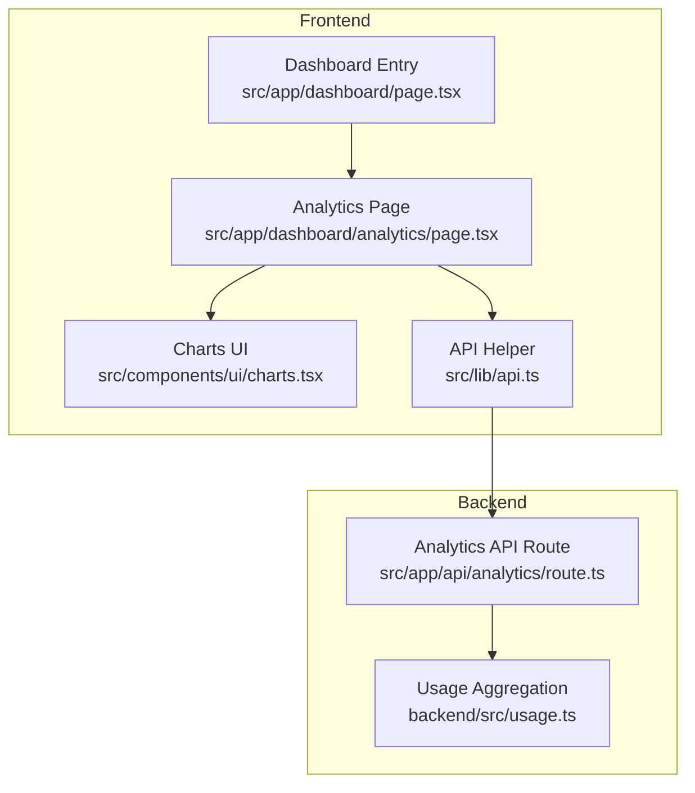
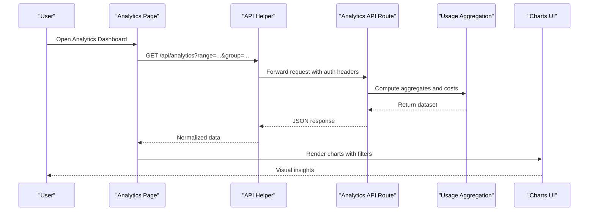
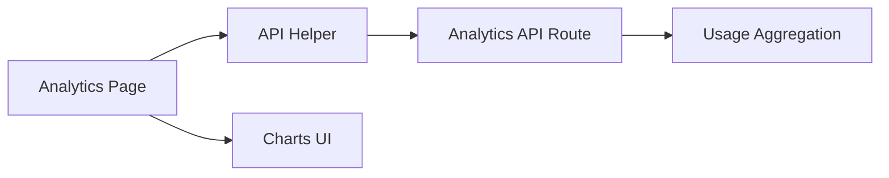

# Analytics & Usage Tracking

<cite>
**Referenced Files in This Document**
- [analytics/page.tsx](file://src/app/dashboard/analytics/page.tsx)
- [api/analytics/route.ts](file://src/app/api/analytics/route.ts)
- [dashboard/layout.tsx](file://src/app/dashboard/layout.tsx)
- [dashboard/page.tsx](file://src/app/dashboard/page.tsx)
- [ui/charts.tsx](file://src/components/ui/charts.tsx)
- [lib/api.ts](file://src/lib/api.ts)
- [backend/src/usage.ts](file://backend/src/usage.ts)
</cite>

## Table of Contents
1. [Introduction](#introduction)
2. [Project Structure](#project-structure)
3. [Core Components](#core-components)
4. [Architecture Overview](#architecture-overview)
5. [Detailed Component Analysis](#detailed-component-analysis)
6. [Dependency Analysis](#dependency-analysis)
7. [Performance Considerations](#performance-considerations)
8. [Troubleshooting Guide](#troubleshooting-guide)
9. [Conclusion](#conclusion)
10. [Appendices](#appendices)

## Introduction
This document explains the analytics and usage tracking dashboard, focusing on cost monitoring, usage trend visualization, and performance metrics display. It covers chart components, data visualization options, filtering capabilities, interpretation of usage patterns, identifying cost optimization opportunities, exporting reports, example queries, custom report generation, and integration with external monitoring tools.

## Project Structure
The analytics feature spans both frontend pages and backend API routes:
- Frontend page for the analytics dashboard
- API route to fetch aggregated analytics data
- Shared UI chart component used by the dashboard
- Dashboard layout and entry point
- Client-side API helper for requests
- Backend usage aggregation logic

**Diagram sources**
- [dashboard/page.tsx](file://src/app/dashboard/page.tsx)
- [analytics/page.tsx](file://src/app/dashboard/analytics/page.tsx)
- [ui/charts.tsx](file://src/components/ui/charts.tsx)
- [api/analytics/route.ts](file://src/app/api/analytics/route.ts)
- [lib/api.ts](file://src/lib/api.ts)
- [backend/src/usage.ts](file://backend/src/usage.ts)

**Section sources**
- [dashboard/page.tsx](file://src/app/dashboard/page.tsx)
- [dashboard/layout.tsx](file://src/app/dashboard/layout.tsx)
- [analytics/page.tsx](file://src/app/dashboard/analytics/page.tsx)
- [api/analytics/route.ts](file://src/app/api/analytics/route.ts)
- [ui/charts.tsx](file://src/components/ui/charts.tsx)
- [lib/api.ts](file://src/lib/api.ts)
- [backend/src/usage.ts](file://backend/src/usage.ts)

## Core Components
- Analytics Page: Orchestrates fetching analytics data, applying filters (time range, provider/model), rendering charts, and providing export actions.
- Charts UI: Reusable chart primitives for line, bar, and area visualizations; supports theming and responsive sizing.
- Analytics API Route: Accepts query parameters for time windows, grouping, and aggregations; returns normalized datasets for charts.
- Usage Aggregation: Computes totals, trends, and breakdowns across providers and models; may include cost calculations based on usage and pricing metadata.
- API Helper: Centralized client request wrapper handling headers, base URL, and error normalization.

Key responsibilities:
- Data acquisition and caching strategy
- Filtering and grouping semantics
- Chart configuration and interactivity
- Export formats and triggers

**Section sources**
- [analytics/page.tsx](file://src/app/dashboard/analytics/page.tsx)
- [ui/charts.tsx](file://src/components/ui/charts.tsx)
- [api/analytics/route.ts](file://src/app/api/analytics/route.ts)
- [backend/src/usage.ts](file://backend/src/usage.ts)
- [lib/api.ts](file://src/lib/api.ts)

## Architecture Overview
End-to-end flow from user interaction to rendered analytics:

**Diagram sources**
- [analytics/page.tsx](file://src/app/dashboard/analytics/page.tsx)
- [api/analytics/route.ts](file://src/app/api/analytics/route.ts)
- [backend/src/usage.ts](file://backend/src/usage.ts)
- [ui/charts.tsx](file://src/components/ui/charts.tsx)
- [lib/api.ts](file://src/lib/api.ts)

## Detailed Component Analysis

### Analytics Page
Responsibilities:
- Fetches analytics data using the API helper with query parameters for time window and grouping.
- Applies client-side filters (provider, model, metric type).
- Renders multiple chart types (trends, breakdowns, KPI cards).
- Provides export actions (CSV/JSON) and shareable links via URL state.

Filtering capabilities:
- Time range selection (e.g., last 7/30 days, custom range).
- Provider and model selectors.
- Metric toggles (tokens, latency, cost, errors).

Interpretation guidance:
- Spikes in token usage often correlate with prompt length or streaming behavior.
- Cost increases can be traced to specific providers/models; compare unit costs over time.
- Latency outliers may indicate provider throttling or network issues.

Export options:
- CSV for tabular breakdowns.
- JSON for programmatic consumption.
- Shareable URL snapshot including active filters.

Common queries:
- Daily token usage per provider for the last 30 days.
- Average latency by model over a selected range.
- Top models by cost within a date window.

Custom report generation:
- Combine multiple grouped views into a single report payload.
- Persist report presets for quick access.

Integration points:
- Webhook-friendly JSON output for ingestion into external dashboards.
- Optional tagging for correlation with incident timelines.

**Section sources**
- [analytics/page.tsx](file://src/app/dashboard/analytics/page.tsx)
- [lib/api.ts](file://src/lib/api.ts)

### Charts UI
Capabilities:
- Line, bar, and area charts with consistent theming.
- Responsive sizing and accessibility attributes.
- Tooltip formatting for precise values and units.
- Multi-series support for comparing providers/models.

Data visualization options:
- Axis labels and units (tokens, ms, USD).
- Aggregation modes (sum, average, p95).
- Date formatting and timezone handling.

Best practices:
- Use area charts for cumulative trends (cost).
- Use bar charts for categorical breakdowns (by provider).
- Limit series count to maintain readability.

**Section sources**
- [ui/charts.tsx](file://src/components/ui/charts.tsx)

### Analytics API Route
Responsibilities:
- Validates query parameters (date range, groupBy, metrics).
- Delegates computation to usage aggregation module.
- Returns structured datasets aligned with chart expectations.

Filtering and grouping:
- Supports grouping by provider, model, region, or custom tags.
- Allows metric selection (tokens, latency, cost, error counts).

Response shape:
- Array of time-bucketed records with labeled dimensions and numeric metrics.

Error handling:
- Returns standardized error codes and messages for invalid ranges or missing permissions.

**Section sources**
- [api/analytics/route.ts](file://src/app/api/analytics/route.ts)

### Usage Aggregation
Responsibilities:
- Computes usage totals, averages, percentiles, and cost estimates.
- Joins usage events with provider/model metadata when available.
- Handles large datasets efficiently with server-side aggregation.

Cost modeling:
- Applies per-provider/per-model pricing to convert usage to currency.
- Supports discounts or tiered pricing if configured.

Performance considerations:
- Uses indexed queries and pre-aggregated tables where possible.
- Implements pagination for very large exports.

**Section sources**
- [backend/src/usage.ts](file://backend/src/usage.ts)

### API Helper
Responsibilities:
- Centralizes HTTP calls to backend routes.
- Attaches authentication headers and base URLs.
- Normalizes responses and surfaces typed errors.

Reliability:
- Retries transient failures.
- Enforces timeouts and cancellation for long-running exports.

**Section sources**
- [lib/api.ts](file://src/lib/api.ts)

## Dependency Analysis
High-level dependencies between modules:

**Diagram sources**
- [analytics/page.tsx](file://src/app/dashboard/analytics/page.tsx)
- [ui/charts.tsx](file://src/components/ui/charts.tsx)
- [api/analytics/route.ts](file://src/app/api/analytics/route.ts)
- [backend/src/usage.ts](file://backend/src/usage.ts)
- [lib/api.ts](file://src/lib/api.ts)

**Section sources**
- [analytics/page.tsx](file://src/app/dashboard/analytics/page.tsx)
- [ui/charts.tsx](file://src/components/ui/charts.tsx)
- [api/analytics/route.ts](file://src/app/api/analytics/route.ts)
- [backend/src/usage.ts](file://backend/src/usage.ts)
- [lib/api.ts](file://src/lib/api.ts)

## Performance Considerations
- Prefer server-side aggregation to minimize payload sizes.
- Cache frequently accessed time windows at the edge or application layer.
- Debounce filter changes to avoid excessive re-renders.
- Use virtualization for large tabular exports.
- Set sensible defaults for time ranges to reduce initial load times.

[No sources needed since this section provides general guidance]

## Troubleshooting Guide
Common issues and resolutions:
- Empty charts: Verify date range validity and ensure sufficient data exists for the selected window.
- High latency: Check backend aggregation complexity and consider narrowing filters.
- Missing cost data: Confirm pricing metadata is present for providers/models.
- Export failures: Validate file size limits and retry with smaller ranges.

Operational checks:
- Inspect API route logs for parameter validation errors.
- Review usage aggregation logs for slow queries or missing indexes.
- Ensure authentication headers are correctly attached by the API helper.

**Section sources**
- [api/analytics/route.ts](file://src/app/api/analytics/route.ts)
- [backend/src/usage.ts](file://backend/src/usage.ts)
- [lib/api.ts](file://src/lib/api.ts)

## Conclusion
The analytics and usage tracking dashboard provides comprehensive visibility into usage trends, cost drivers, and performance metrics. By leveraging robust charting, flexible filtering, and efficient backend aggregation, teams can identify optimization opportunities, generate actionable reports, and integrate insights with external monitoring systems.

[No sources needed since this section summarizes without analyzing specific files]

## Appendices

### Example Analytics Queries
- Daily token usage by provider for the last 30 days.
- Average latency by model over a custom date range.
- Top 5 models by cost within a selected period.
- Error rate trend per provider over the last week.

### Custom Report Generation
- Combine multiple grouped views into a single JSON payload.
- Save report presets with named filters for quick access.
- Schedule periodic exports to an external storage endpoint.

### Integration with External Monitoring Tools
- Ingest JSON exports into SIEM or observability platforms.
- Push key metrics to alerting systems via webhooks.
- Correlate usage spikes with deployment timelines using shared timestamps.

[No sources needed since this section provides general guidance]