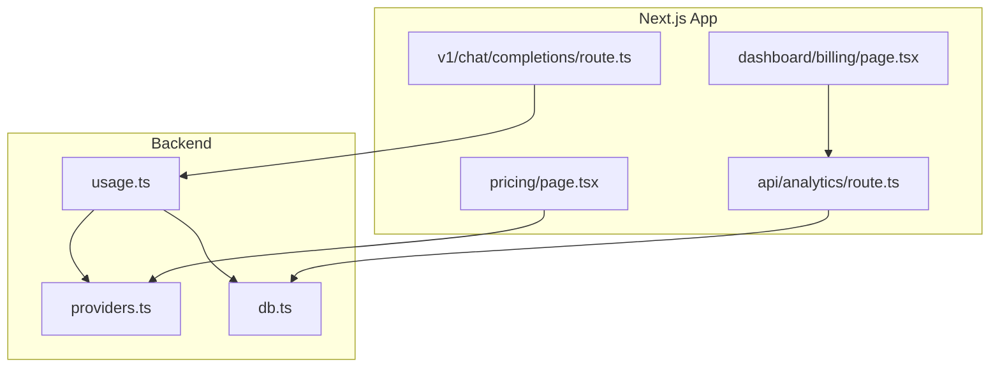
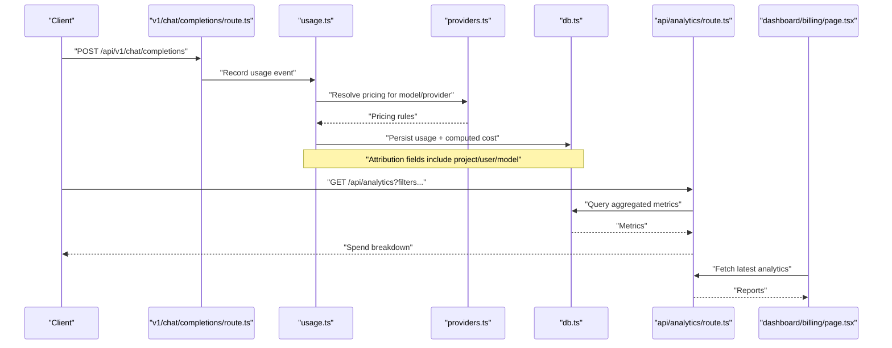
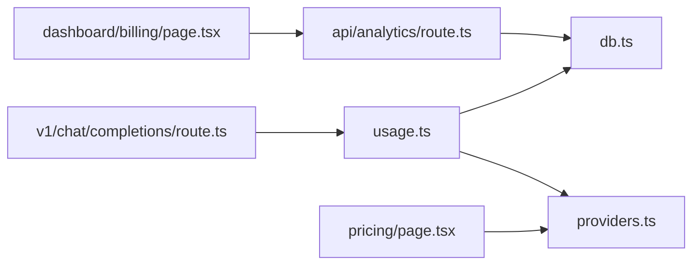

# Cost Tracking & Optimization

<cite>
**Referenced Files in This Document**
- [backend/src/usage.ts](file://backend/src/usage.ts)
- [backend/src/providers.ts](file://backend/src/providers.ts)
- [backend/src/db.ts](file://backend/src/db.ts)
- [src/app/api/v1/chat/completions/route.ts](file://src/app/api/v1/chat/completions/route.ts)
- [src/app/api/analytics/route.ts](file://src/app/api/analytics/route.ts)
- [src/app/dashboard/billing/page.tsx](file://src/app/dashboard/billing/page.tsx)
- [src/app/pricing/page.tsx](file://src/app/pricing/page.tsx)
- [backend/package.json](file://backend/package.json)
</cite>

## Table of Contents
1. [Introduction](#introduction)
2. [Project Structure](#project-structure)
3. [Core Components](#core-components)
4. [Architecture Overview](#architecture-overview)
5. [Detailed Component Analysis](#detailed-component-analysis)
6. [Dependency Analysis](#dependency-analysis)
7. [Performance Considerations](#performance-considerations)
8. [Troubleshooting Guide](#troubleshooting-guide)
9. [Conclusion](#conclusion)
10. [Appendices](#appendices)

## Introduction
This document explains how cost tracking and optimization are implemented across AI providers, pricing models, and usage tiers. It covers:
- How costs are calculated per provider and model
- How usage is attributed to projects, users, or model types
- Budget alerts, spending limits, and forecasting approaches
- Practical strategies for cost optimization (model selection, batching, caching)
- Examples of cost analysis reports and integration points with billing systems

The goal is to help engineers and product owners understand the data flows, configuration points, and extensibility hooks needed to track and optimize AI spend effectively.

## Project Structure
Cost-related functionality spans backend modules for usage tracking and provider configuration, Next.js API routes for analytics and chat completions, and dashboard pages for billing and pricing.

**Diagram sources**
- [backend/src/usage.ts](file://backend/src/usage.ts)
- [backend/src/providers.ts](file://backend/src/providers.ts)
- [backend/src/db.ts](file://backend/src/db.ts)
- [src/app/api/v1/chat/completions/route.ts](file://src/app/api/v1/chat/completions/route.ts)
- [src/app/api/analytics/route.ts](file://src/app/api/analytics/route.ts)
- [src/app/dashboard/billing/page.tsx](file://src/app/dashboard/billing/page.tsx)
- [src/app/pricing/page.tsx](file://src/app/pricing/page.tsx)

**Section sources**
- [backend/src/usage.ts](file://backend/src/usage.ts)
- [backend/src/providers.ts](file://backend/src/providers.ts)
- [backend/src/db.ts](file://backend/src/db.ts)
- [src/app/api/v1/chat/completions/route.ts](file://src/app/api/v1/chat/completions/route.ts)
- [src/app/api/analytics/route.ts](file://src/app/api/analytics/route.ts)
- [src/app/dashboard/billing/page.tsx](file://src/app/dashboard/billing/page.tsx)
- [src/app/pricing/page.tsx](file://src/app/pricing/page.tsx)

## Core Components
- Usage tracking module: records token counts, timestamps, and attribution metadata; computes costs using provider pricing rules.
- Provider configuration: centralizes pricing tables, currency, and tiered rates for different models and endpoints.
- Database layer: persists usage events, aggregated metrics, and budget thresholds.
- Analytics API: exposes time-series and breakdowns by project, user, and model type.
- Billing UI: visualizes spend, budgets, and forecasts; integrates with external billing where applicable.
- Pricing page: surfaces current model prices and helps compare options.

Key responsibilities:
- Normalize usage into a consistent schema
- Apply provider-specific pricing and discounts
- Attribute costs to entities (project/user/model)
- Surface insights via analytics endpoints and dashboards

**Section sources**
- [backend/src/usage.ts](file://backend/src/usage.ts)
- [backend/src/providers.ts](file://backend/src/providers.ts)
- [backend/src/db.ts](file://backend/src/db.ts)
- [src/app/api/analytics/route.ts](file://src/app/api/analytics/route.ts)
- [src/app/dashboard/billing/page.tsx](file://src/app/dashboard/billing/page.tsx)
- [src/app/pricing/page.tsx](file://src/app/pricing/page.tsx)

## Architecture Overview
End-to-end flow from request to cost reporting:

**Diagram sources**
- [src/app/api/v1/chat/completions/route.ts](file://src/app/api/v1/chat/completions/route.ts)
- [backend/src/usage.ts](file://backend/src/usage.ts)
- [backend/src/providers.ts](file://backend/src/providers.ts)
- [backend/src/db.ts](file://backend/src/db.ts)
- [src/app/api/analytics/route.ts](file://src/app/api/analytics/route.ts)
- [src/app/dashboard/billing/page.tsx](file://src/app/dashboard/billing/page.tsx)

## Detailed Component Analysis

### Usage Tracking and Cost Calculation
Responsibilities:
- Capture tokens used (input/output), latency, and provider response codes
- Compute cost using provider pricing tables and any applicable discounts or tiers
- Persist normalized usage records with attribution keys

Implementation highlights:
- Normalization of provider responses into a common usage schema
- Mapping of model identifiers to pricing entries
- Optional multi-currency handling and rounding policies
- Idempotent recording to avoid double-counting on retries

Optimization opportunities:
- Batch writes to reduce database overhead
- Precompute daily aggregates for faster analytics queries
- Cache frequently accessed pricing tables in memory with TTL refresh

**Section sources**
- [backend/src/usage.ts](file://backend/src/usage.ts)
- [backend/src/providers.ts](file://backend/src/providers.ts)
- [backend/src/db.ts](file://backend/src/db.ts)

### Provider Configuration and Pricing Models
Responsibilities:
- Centralize provider definitions, including base prices, per-token rates, and tiered discounts
- Support multiple currencies and region-based pricing variants
- Expose a stable interface for cost calculation regardless of provider differences

Configuration aspects:
- Model registry mapping logical model names to provider-specific IDs
- Pricing tiers based on volume or subscription level
- Flags for features like streaming vs non-streaming cost adjustments

Extensibility:
- Adding new providers requires defining pricing entries and adapter mappings
- Versioned pricing tables allow safe rollouts and historical accuracy

**Section sources**
- [backend/src/providers.ts](file://backend/src/providers.ts)
- [backend/package.json](file://backend/package.json)

### Database Layer for Usage and Metrics
Responsibilities:
- Store raw usage events and pre-aggregated metrics
- Index by entity dimensions (project, user, model) and time windows
- Provide efficient queries for dashboards and analytics

Design considerations:
- Partitioning by date ranges for large datasets
- Materialized views or summary tables for fast analytics
- Retention policies and archival strategies

**Section sources**
- [backend/src/db.ts](file://backend/src/db.ts)

### Analytics API
Responsibilities:
- Serve filtered and grouped cost metrics for dashboards
- Support aggregations by project, user, model, provider, and time range
- Return both granular events and summarized totals

Typical filters:
- Date range, project ID, user ID, model name, provider
- Currency and rounding options

Response patterns:
- Time-series arrays for charts
- Breakdown objects for pie/bar visuals

**Section sources**
- [src/app/api/analytics/route.ts](file://src/app/api/analytics/route.ts)

### Billing Dashboard and Pricing Page
Responsibilities:
- Visualize spend trends, top models, and cost drivers
- Display budget thresholds and alert status
- Show current pricing for comparison and planning

Integration points:
- Pulls analytics data via the analytics API
- Optionally connects to external billing systems for invoices and credits

**Section sources**
- [src/app/dashboard/billing/page.tsx](file://src/app/dashboard/billing/page.tsx)
- [src/app/pricing/page.tsx](file://src/app/pricing/page.tsx)

### Chat Completions Entry Point
Responsibilities:
- Route requests to appropriate providers
- Ensure usage is recorded after successful responses
- Enforce basic guardrails (e.g., rate limits) before invoking providers

Operational notes:
- Use idempotency keys to prevent duplicate charges
- Attach attribution metadata (project/user/model) consistently

**Section sources**
- [src/app/api/v1/chat/completions/route.ts](file://src/app/api/v1/chat/completions/route.ts)

## Dependency Analysis
High-level dependencies among cost-tracking components:

**Diagram sources**
- [src/app/api/v1/chat/completions/route.ts](file://src/app/api/v1/chat/completions/route.ts)
- [backend/src/usage.ts](file://backend/src/usage.ts)
- [backend/src/providers.ts](file://backend/src/providers.ts)
- [backend/src/db.ts](file://backend/src/db.ts)
- [src/app/api/analytics/route.ts](file://src/app/api/analytics/route.ts)
- [src/app/dashboard/billing/page.tsx](file://src/app/dashboard/billing/page.tsx)
- [src/app/pricing/page.tsx](file://src/app/pricing/page.tsx)

**Section sources**
- [backend/src/usage.ts](file://backend/src/usage.ts)
- [backend/src/providers.ts](file://backend/src/providers.ts)
- [backend/src/db.ts](file://backend/src/db.ts)
- [src/app/api/analytics/route.ts](file://src/app/api/analytics/route.ts)
- [src/app/dashboard/billing/page.tsx](file://src/app/dashboard/billing/page.tsx)
- [src/app/pricing/page.tsx](file://src/app/pricing/page.tsx)
- [src/app/api/v1/chat/completions/route.ts](file://src/app/api/v1/chat/completions/route.ts)

## Performance Considerations
- Batch usage writes to minimize database round-trips
- Maintain in-memory caches for pricing tables with periodic refresh
- Pre-aggregate daily metrics to speed up analytics queries
- Use pagination and server-side filtering for large result sets
- Avoid redundant cost recomputation by storing computed cost alongside usage

[No sources needed since this section provides general guidance]

## Troubleshooting Guide
Common issues and resolutions:
- Missing attribution fields: ensure every usage event includes project, user, and model identifiers
- Duplicate charges: verify idempotency keys and retry logic around provider calls
- Incorrect costs: validate provider pricing mappings and currency conversions
- Slow analytics: check indexes on time and entity dimensions; consider materialized summaries
- Stale pricing: confirm cache TTL and refresh mechanisms for provider pricing tables

**Section sources**
- [backend/src/usage.ts](file://backend/src/usage.ts)
- [backend/src/providers.ts](file://backend/src/providers.ts)
- [backend/src/db.ts](file://backend/src/db.ts)
- [src/app/api/analytics/route.ts](file://src/app/api/analytics/route.ts)

## Conclusion
The cost tracking system normalizes provider usage, applies pricing rules, and attributes costs to meaningful entities. With robust analytics and a billing dashboard, teams can monitor spend, set budgets, and forecast future costs. Extensible provider configuration and performance-oriented design enable accurate, scalable cost management across diverse AI workloads.

[No sources needed since this section summarizes without analyzing specific files]

## Appendices

### Cost Allocation Dimensions
- By project: group usage by project identifier for departmental chargebacks
- By user: attribute costs to individual users for accountability
- By model type: analyze spend by model family or capability tier
- By provider: compare costs across vendors and negotiate better terms

[No sources needed since this section doesn't analyze specific files]

### Budget Alerts and Spending Limits
- Define monthly or rolling-window budgets per project or user
- Trigger alerts at thresholds (e.g., 80%, 100%)
- Enforce hard limits by rejecting new requests when exceeded
- Integrate with notification channels (email, Slack)

[No sources needed since this section doesn't analyze specific files]

### Cost Forecasting Approaches
- Trend extrapolation using recent daily spend
- Seasonality-aware projections for predictable spikes
- Scenario modeling based on planned feature launches or traffic growth

[No sources needed since this section doesn't analyze specific files]

### Cost Optimization Strategies
- Model selection: choose smaller or specialized models for simpler tasks
- Batch processing: aggregate prompts to reduce per-request overhead
- Caching: memoize repeated inputs or similar queries
- Prompt efficiency: shorten context and refine instructions
- Streaming vs non-streaming: prefer streaming when latency matters more than cost

[No sources needed since this section doesn't analyze specific files]

### Example Cost Analysis Reports
- Daily spend by model and provider
- Top cost drivers by project and user
- Cost per token trend over time
- Budget utilization and remaining allowance

[No sources needed since this section doesn't analyze specific files]

### Integration with Billing Systems
- Export aggregated usage and costs to CSV or APIs
- Map internal entities to billing accounts and line items
- Reconcile platform charges with provider invoices
- Handle credits, discounts, and currency conversions

[No sources needed since this section doesn't analyze specific files]