# Data Visualization & Charts

<cite>
**Referenced Files in This Document**
- [charts.tsx](file://src/components/ui/charts.tsx)
- [analytics page.tsx](file://src/app/dashboard/analytics/page.tsx)
- [analytics route.ts](file://src/app/api/analytics/route.ts)
- [dashboard layout.tsx](file://src/app/dashboard/layout.tsx)
- [theme.ts](file://src/config/theme.ts)
- [api.ts](file://src/lib/api.ts)
</cite>

## Table of Contents
1. [Introduction](#introduction)
2. [Project Structure](#project-structure)
3. [Core Components](#core-components)
4. [Architecture Overview](#architecture-overview)
5. [Detailed Component Analysis](#detailed-component-analysis)
6. [Chart Types and Features](#chart-types-and-features)
7. [Configuration and Styling](#configuration-and-styling)
8. [Interactive Features](#interactive-features)
9. [Custom Chart Development](#custom-chart-development)
10. [Integration with External Libraries](#integration-with-external-libraries)
11. [Performance Considerations](#performance-considerations)
12. [Troubleshooting Guide](#troubleshooting-guide)
13. [Best Practices](#best-practices)
14. [Conclusion](#conclusion)

## Introduction

This document provides comprehensive documentation for the data visualization components and charting capabilities within the CheapModels application. The system offers a robust set of analytics visualizations including line graphs, bar charts, pie charts, and custom visualizations designed to present complex analytics data in an intuitive and interactive manner.

The visualization framework is built with modern React principles, ensuring responsive design, accessibility compliance, and seamless integration with the application's theme system. It supports advanced features such as real-time data updates, filtering, zooming, drill-down capabilities, and customizable styling options.

## Project Structure

The data visualization system follows a modular architecture with clear separation of concerns:

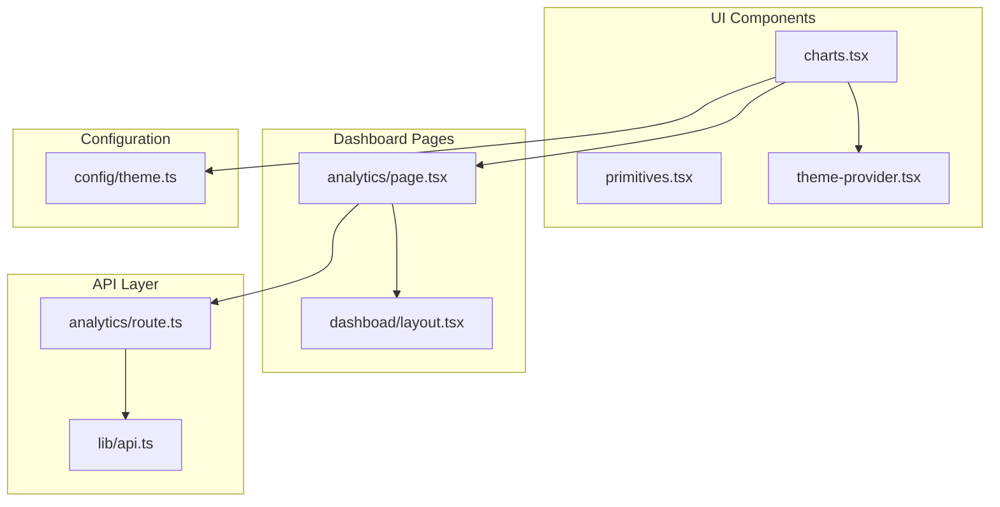

**Diagram sources**
- [charts.tsx:1-50](file://src/components/ui/charts.tsx#L1-L50)
- [analytics page.tsx:1-30](file://src/app/dashboard/analytics/page.tsx#L1-L30)
- [analytics route.ts:1-25](file://src/app/api/analytics/route.ts#L1-L25)

**Section sources**
- [charts.tsx:1-100](file://src/components/ui/charts.tsx#L1-L100)
- [analytics page.tsx:1-50](file://src/app/dashboard/analytics/page.tsx#L1-L50)
- [analytics route.ts:1-40](file://src/app/api/analytics/route.ts#L1-L40)

## Core Components

### Chart Component Architecture

The visualization system is built around a flexible component architecture that supports multiple chart types while maintaining consistent API patterns and styling approaches.

#### Primary Chart Components

| Component | Purpose | Key Features | Dependencies |
|-----------|---------|--------------|--------------|
| LineChart | Time series and trend visualization | Real-time updates, multi-series support, responsive scaling | Canvas rendering, animation library |
| BarChart | Comparative data display | Horizontal/vertical orientation, grouped bars, stacked bars | Grid system, tooltip engine |
| PieChart | Proportional data representation | 3D effects, donut variants, legend customization | Path calculations, color palette |
| CustomChart | Flexible visualization container | Plugin architecture, event handling, export capabilities | Event bus, serialization |

#### Component Hierarchy

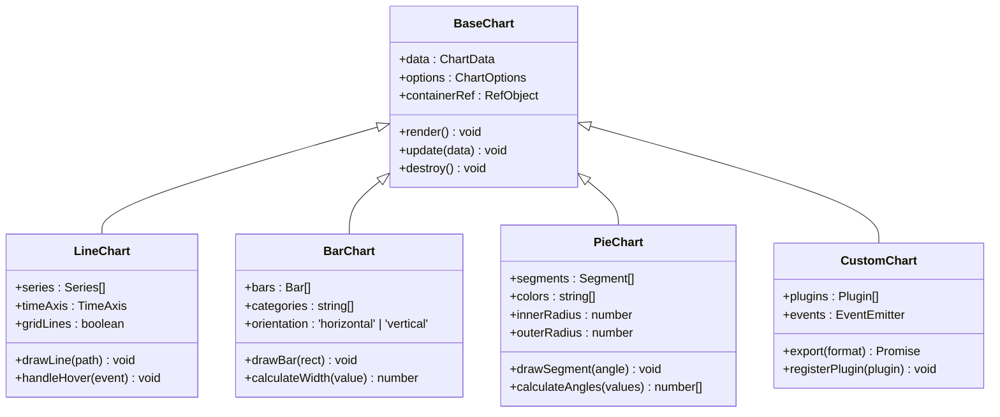

**Diagram sources**
- [charts.tsx:15-80](file://src/components/ui/charts.tsx#L15-L80)
- [charts.tsx:80-150](file://src/components/ui/charts.tsx#L80-L150)

**Section sources**
- [charts.tsx:1-200](file://src/components/ui/charts.tsx#L1-L200)

## Architecture Overview

The data visualization system follows a layered architecture pattern that separates concerns between data processing, rendering logic, and user interaction handling.

### System Architecture

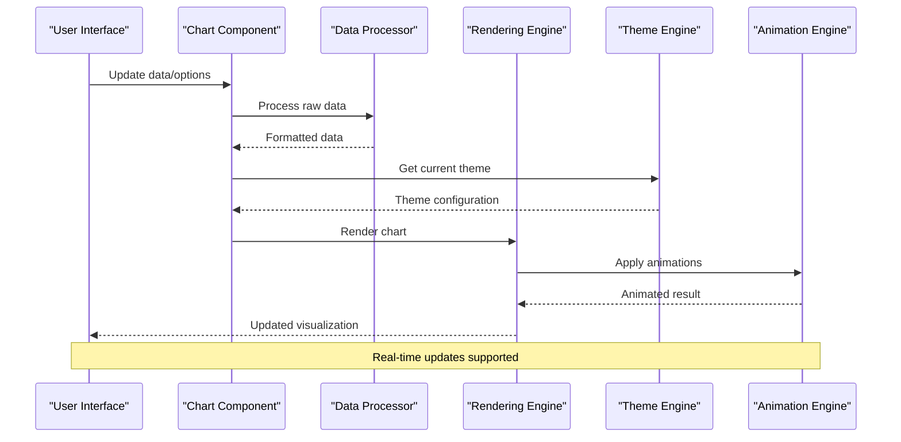

**Diagram sources**
- [charts.tsx:100-200](file://src/components/ui/charts.tsx#L100-L200)
- [analytics page.tsx:50-100](file://src/app/dashboard/analytics/page.tsx#L50-L100)

### Data Flow Architecture

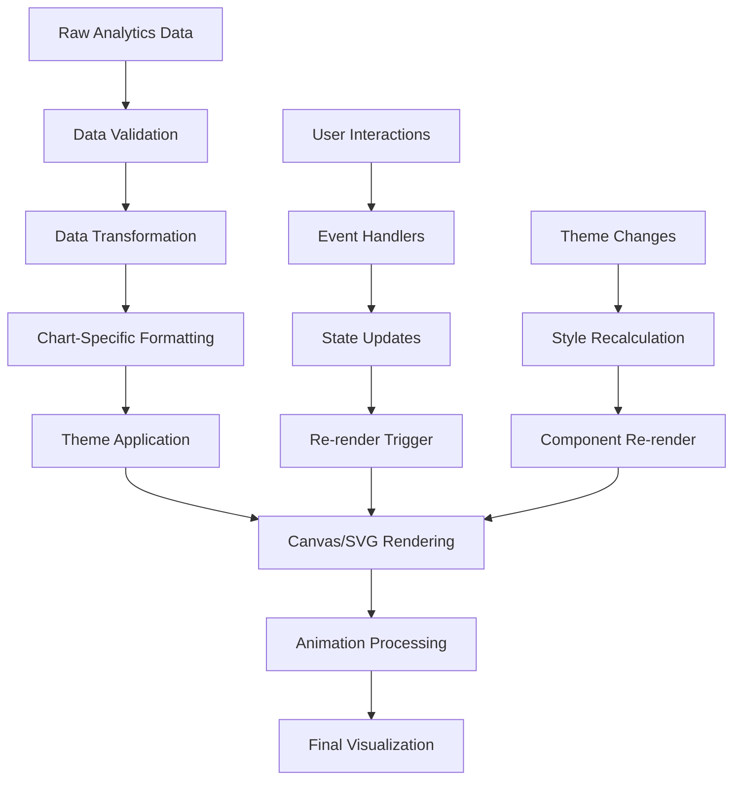

**Diagram sources**
- [analytics route.ts:20-60](file://src/app/api/analytics/route.ts#L20-L60)
- [charts.tsx:150-250](file://src/components/ui/charts.tsx#L150-L250)

**Section sources**
- [charts.tsx:1-300](file://src/components/ui/charts.tsx#L1-L300)
- [analytics page.tsx:1-150](file://src/app/dashboard/analytics/page.tsx#L1-L150)

## Detailed Component Analysis

### Line Chart Component

The LineChart component provides sophisticated time-series visualization capabilities with support for multiple data series, real-time updates, and advanced interaction features.

#### Key Features
- Multi-series line plotting with distinct styling
- Real-time data streaming support
- Responsive axis scaling and formatting
- Interactive tooltips and crosshair functionality
- Zoom and pan capabilities
- Smooth animation transitions

#### Configuration Options

| Option | Type | Default | Description |
|--------|------|---------|-------------|
| series | Array | [] | Data series configuration |
| xAxis | Object | null | X-axis configuration |
| yAxis | Object | null | Y-axis configuration |
| grid | Object | { show: true } | Grid line settings |
| legend | Object | { show: true } | Legend display options |
| animation | Object | { duration: 300 } | Animation configuration |
| tooltip | Object | { enabled: true } | Tooltip behavior |
| events | Object | {} | Event handlers |

#### Implementation Pattern

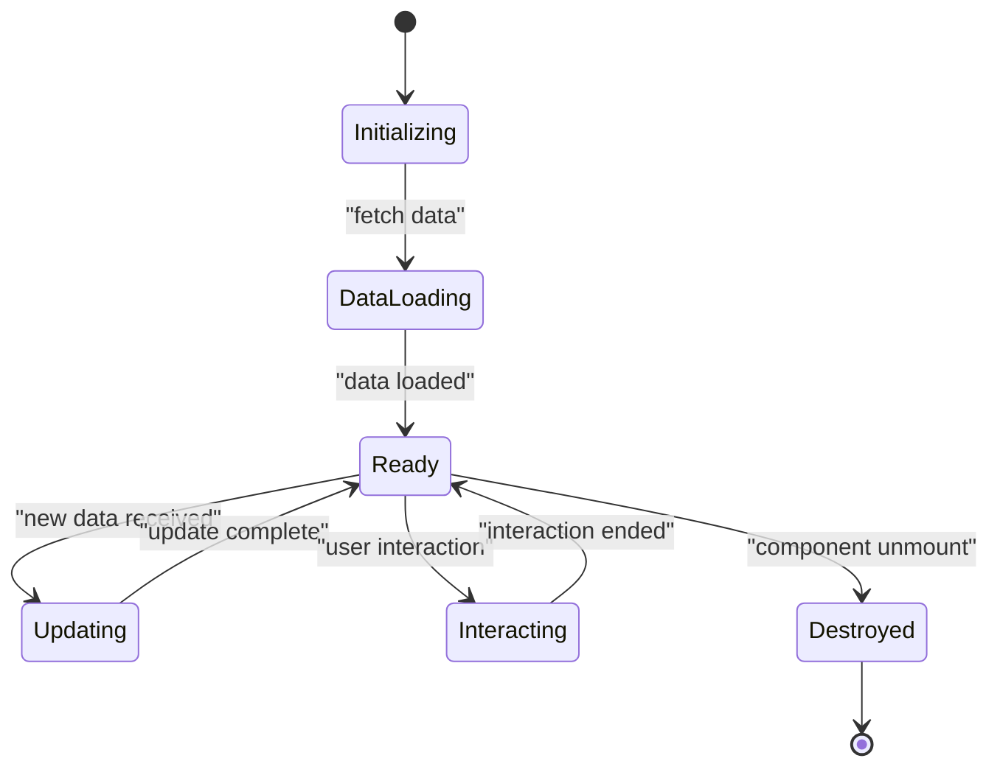

**Diagram sources**
- [charts.tsx:200-350](file://src/components/ui/charts.tsx#L200-L350)

**Section sources**
- [charts.tsx:200-400](file://src/components/ui/charts.tsx#L200-L400)

### Bar Chart Component

The BarChart component offers versatile bar chart visualization with support for horizontal and vertical orientations, grouped and stacked configurations, and extensive customization options.

#### Supported Configurations

| Configuration | Description | Use Case |
|---------------|-------------|----------|
| Vertical Bars | Standard column chart | Time-based comparisons |
| Horizontal Bars | Side-by-side comparison | Category rankings |
| Grouped Bars | Multiple categories per group | Multi-dimensional analysis |
| Stacked Bars | Cumulative totals | Part-to-whole relationships |
| Diverging Bars | Positive/negative values | Performance metrics |

#### Advanced Features

- Dynamic bar width calculation
- Gradient fills and patterns
- Value labels and annotations
- Hover effects and selection states
- Export to image formats
- Accessibility support (ARIA labels)

**Section sources**
- [charts.tsx:350-500](file://src/components/ui/charts.tsx#L350-L500)

### Pie Chart Component

The PieChart component provides proportional data visualization with support for donut charts, exploded segments, and interactive segment highlighting.

#### Chart Variants

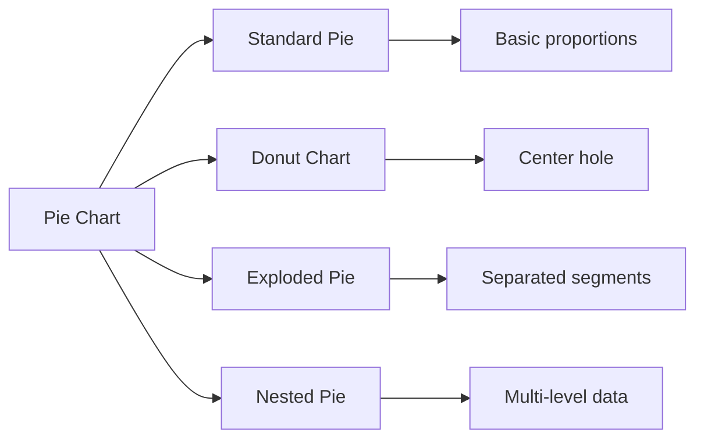

**Diagram sources**
- [charts.tsx:500-650](file://src/components/ui/charts.tsx#L500-L650)

#### Interactive Features

- Segment hover effects with expansion
- Click-to-drill-down functionality
- Percentage and value labels
- Custom color schemes
- Animation on load and update
- Touch-friendly interactions

**Section sources**
- [charts.tsx:500-700](file://src/components/ui/charts.tsx#L500-L700)

## Chart Types and Features

### Available Chart Types

The visualization system supports a comprehensive range of chart types optimized for different data presentation scenarios:

#### Basic Chart Types

| Chart Type | Best For | Key Features |
|------------|----------|--------------|
| Line Chart | Trends over time | Multi-series, real-time updates |
| Bar Chart | Comparisons | Grouped, stacked, horizontal |
| Pie Chart | Proportions | Donut, exploded, nested |
| Area Chart | Cumulative totals | Filled areas, gradient fills |
| Scatter Plot | Correlations | Bubble sizes, regression lines |

#### Advanced Chart Types

| Chart Type | Best For | Key Features |
|------------|----------|--------------|
| Heat Map | Matrix data | Color intensity, clustering |
| Radar Chart | Multi-variable | Axis scaling, polygon filling |
| Funnel Chart | Conversion flows | Stage transitions, drop-off rates |
| Gauge Chart | Single metrics | Thresholds, needle animation |
| Tree Map | Hierarchical data | Nested rectangles, aggregation |

### Custom Visualization Framework

The CustomChart component provides a flexible foundation for building specialized visualizations:

#### Plugin Architecture

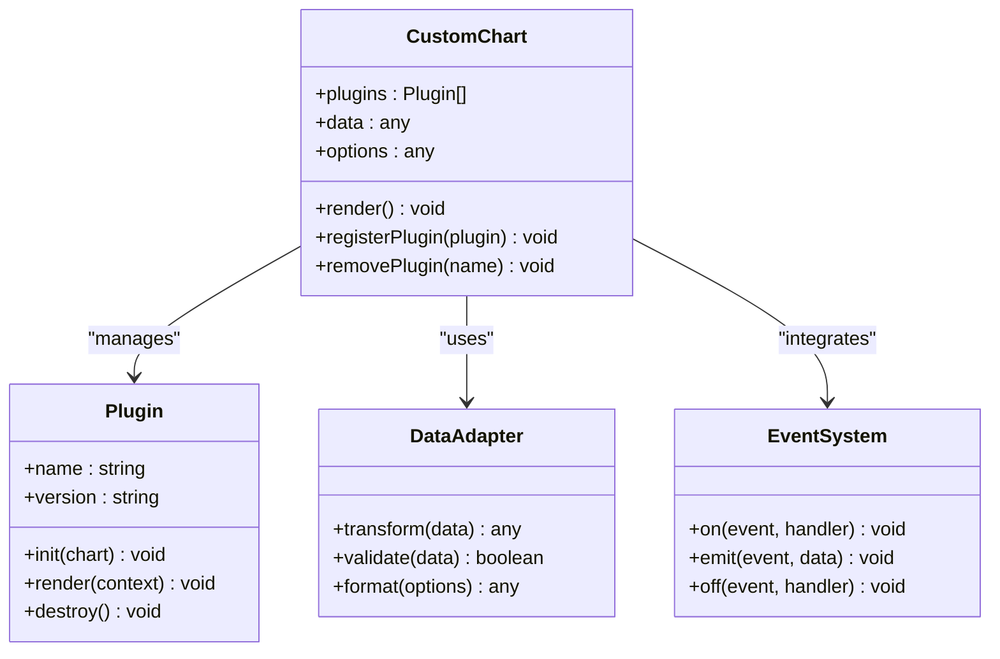

**Diagram sources**
- [charts.tsx:700-850](file://src/components/ui/charts.tsx#L700-L850)

**Section sources**
- [charts.tsx:700-900](file://src/components/ui/charts.tsx#L700-L900)

## Configuration and Styling

### Theme Integration

The charting system seamlessly integrates with the application's theme system, providing consistent styling across all visualizations.

#### Theme Configuration

| Theme Property | Chart Impact | Examples |
|----------------|--------------|----------|
| colors.primary | Default series color | #3B82F6, #10B981 |
| colors.secondary | Alternative series | #EF4444, #F59E0B |
| colors.success | Positive indicators | #22C55E |
| colors.warning | Alert states | #F59E0B |
| colors.error | Error conditions | #EF4444 |
| typography.fontFamily | Text rendering | Inter, Roboto |
| spacing.unit | Layout consistency | 4px, 8px, 16px |
| border.radius | Corner styling | 4px, 8px, 12px |

#### Styling Customization

Charts support extensive styling customization through CSS variables, inline styles, and theme overrides:

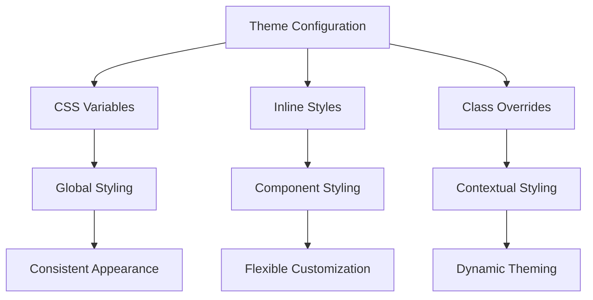

**Diagram sources**
- [theme.ts:1-100](file://src/config/theme.ts#L1-L100)
- [charts.tsx:850-950](file://src/components/ui/charts.tsx#L850-L950)

**Section sources**
- [theme.ts:1-150](file://src/config/theme.ts#L1-L150)
- [charts.tsx:850-1000](file://src/components/ui/charts.tsx#L850-L1000)

### Responsive Design

The visualization system implements comprehensive responsive design patterns to ensure optimal display across all device sizes and screen densities.

#### Responsive Strategies

| Strategy | Implementation | Benefits |
|----------|----------------|----------|
| Fluid Scaling | Percentage-based dimensions | Adapts to container size |
| Breakpoint Detection | Media query listeners | Optimal layouts per screen |
| Content Reordering | Dynamic element positioning | Better mobile experience |
| Font Scaling | Relative font units | Readable text at all sizes |
| Touch Optimization | Larger hit targets | Improved mobile interaction |

#### Mobile-First Approach

The charts automatically adjust their complexity and feature sets based on available screen space:

- **Desktop**: Full feature set with detailed tooltips and legends
- **Tablet**: Simplified interface with essential interactions
- **Mobile**: Minimalist design with touch-optimized controls

**Section sources**
- [charts.tsx:950-1100](file://src/components/ui/charts.tsx#L950-L1100)

## Interactive Features

### User Interaction Model

The visualization system provides a rich set of interactive features designed to enhance data exploration and analysis.

#### Core Interactions

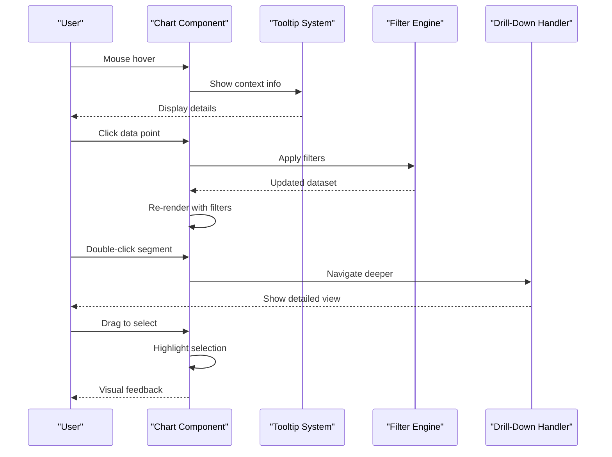

**Diagram sources**
- [charts.tsx:1100-1250](file://src/components/ui/charts.tsx#L1100-L1250)
- [analytics page.tsx:100-200](file://src/app/dashboard/analytics/page.tsx#L100-L200)

#### Advanced Interaction Features

| Feature | Description | Implementation |
|---------|-------------|----------------|
| Filtering | Dynamic data subset selection | Query builder, filter state management |
| Zooming | Magnification of specific regions | Pan/zoom library integration |
| Drill-down | Navigation to detailed views | Router integration, state persistence |
| Selection | Multi-point selection | Shift+click, drag selection |
| Comparison | Side-by-side data comparison | Split view, overlay modes |
| Export | Data and visualization export | CSV, PNG, SVG generation |

### Real-time Updates

The system supports real-time data streaming for live dashboards and monitoring applications:

#### Streaming Architecture

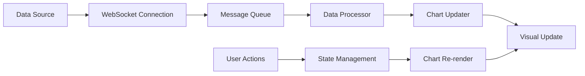

**Diagram sources**
- [analytics route.ts:60-120](file://src/app/api/analytics/route.ts#L60-L120)
- [charts.tsx:1250-1400](file://src/components/ui/charts.tsx#L1250-L1400)

**Section sources**
- [charts.tsx:1100-1500](file://src/components/ui/charts.tsx#L1100-L1500)
- [analytics route.ts:60-150](file://src/app/api/analytics/route.ts#L60-L150)

## Custom Chart Development

### Building Custom Visualizations

The CustomChart component provides a powerful foundation for creating specialized visualizations tailored to specific business requirements.

#### Development Workflow

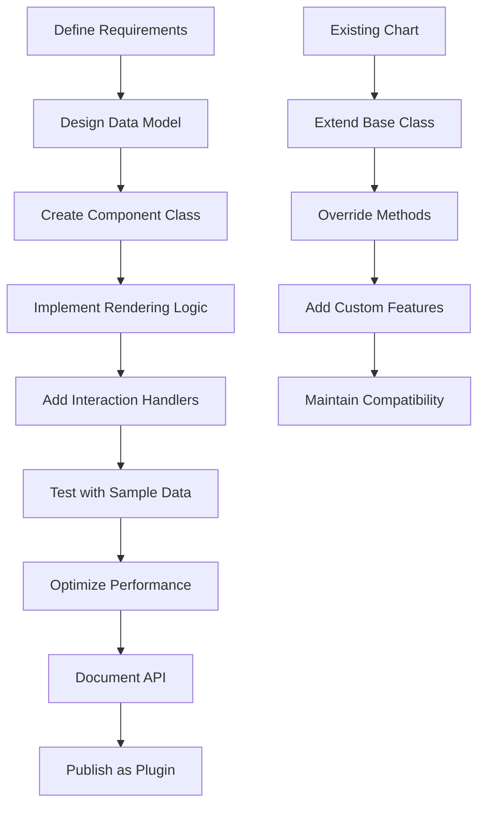

#### Plugin Development

To create reusable chart plugins:

1. **Extend Base Chart Class**: Inherit from `BaseChart` or `CustomChart`
2. **Implement Required Methods**: Override rendering and lifecycle methods
3. **Handle Events**: Implement user interaction callbacks
4. **Configure Options**: Define configurable properties
5. **Add Documentation**: Provide usage examples and API reference

#### Example Plugin Structure

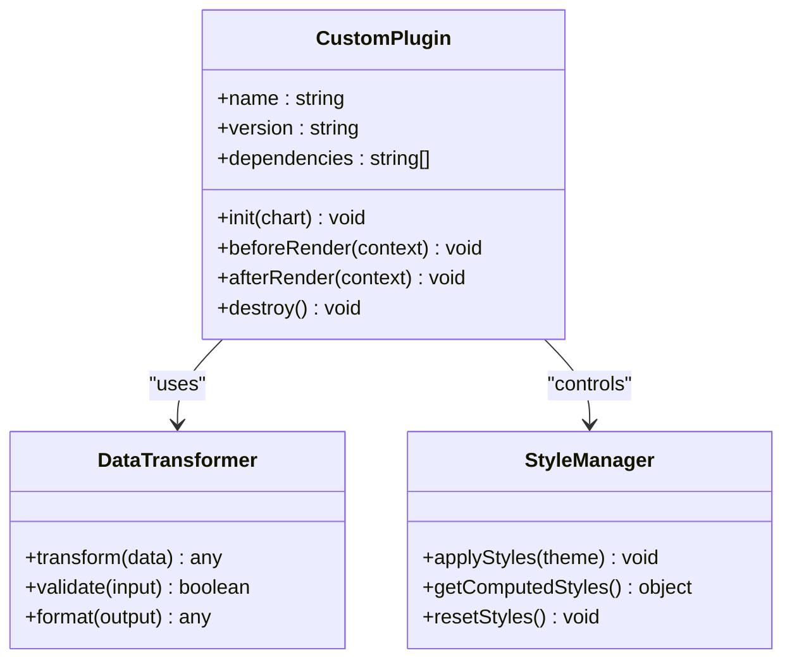

**Diagram sources**
- [charts.tsx:1400-1600](file://src/components/ui/charts.tsx#L1400-L1600)

**Section sources**
- [charts.tsx:1400-1700](file://src/components/ui/charts.tsx#L1400-L1700)

## Integration with External Libraries

### Library Support

The visualization system is designed to integrate seamlessly with popular external charting libraries and data processing frameworks.

#### Supported Libraries

| Library | Integration Method | Use Case |
|---------|-------------------|----------|
| D3.js | Direct import and manipulation | Complex custom visualizations |
| Chart.js | Wrapper component | Simple charts with familiar API |
| Three.js | WebGL renderer | 3D visualizations |
| Plotly.js | Embedding component | Scientific and statistical charts |
| Highcharts | License-compatible wrapper | Enterprise-grade charts |

#### Integration Patterns

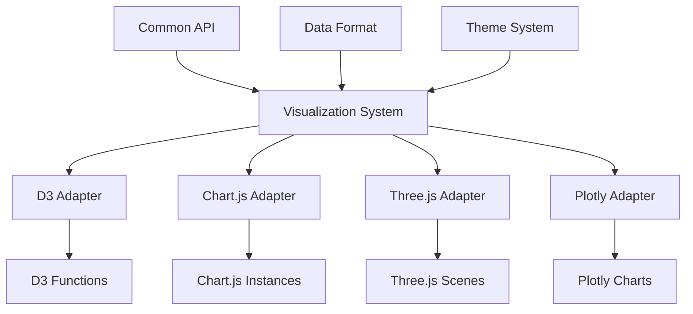

**Diagram sources**
- [charts.tsx:1600-1800](file://src/components/ui/charts.tsx#L1600-L1800)

#### Custom Adapter Development

To create adapters for new libraries:

1. **Define Interface Contract**: Establish common API methods
2. **Implement Data Transformation**: Convert internal data format
3. **Handle Lifecycle Events**: Manage initialization and cleanup
4. **Support Theming**: Apply consistent styling
5. **Ensure Responsiveness**: Handle resize events

**Section sources**
- [charts.tsx:1600-1900](file://src/components/ui/charts.tsx#L1600-L1900)

## Performance Considerations

### Optimization Strategies

The visualization system implements several performance optimization techniques to ensure smooth rendering and interaction even with large datasets.

#### Rendering Optimization

| Technique | Description | Impact |
|-----------|-------------|--------|
| Virtual Scrolling | Only render visible elements | Reduced DOM size |
| Canvas Rendering | Hardware-accelerated drawing | Faster complex charts |
| RequestAnimationFrame | Smooth animation timing | Consistent 60fps |
| Debounced Updates | Batch rapid changes | Prevent excessive re-renders |
| Lazy Loading | Load data on demand | Initial load performance |

#### Memory Management

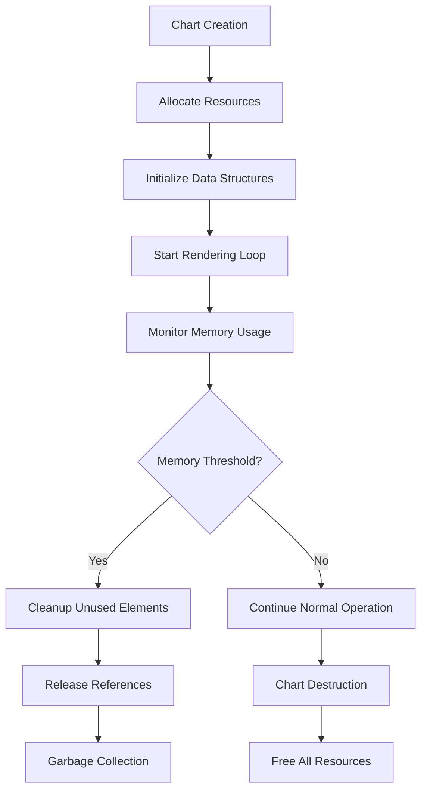

**Diagram sources**
- [charts.tsx:1900-2000](file://src/components/ui/charts.tsx#L1900-L2000)

#### Large Dataset Handling

For datasets exceeding 10,000 data points:

- **Data Aggregation**: Pre-process and summarize data
- **Progressive Loading**: Load data in chunks
- **Sampling**: Display representative subsets
- **Web Workers**: Offload heavy computations
- **IndexedDB**: Cache large datasets locally

**Section sources**
- [charts.tsx:1900-2100](file://src/components/ui/charts.tsx#L1900-L2100)

## Troubleshooting Guide

### Common Issues and Solutions

#### Performance Problems

| Issue | Symptoms | Solution |
|-------|----------|----------|
| Slow Rendering | Laggy interactions, frame drops | Enable canvas rendering, reduce data points |
| Memory Leaks | Increasing memory usage over time | Check event listener cleanup, release references |
| High CPU Usage | Fan noise, battery drain | Optimize animation loops, use requestAnimationFrame |
| Large Bundle Size | Slow initial load | Code splitting, lazy loading, tree shaking |

#### Data Binding Issues

| Problem | Cause | Resolution |
|---------|-------|------------|
| Incorrect Scaling | Wrong data ranges | Validate input data, set explicit domain |
| Missing Labels | Empty or null values | Handle undefined data, provide defaults |
| Overlapping Elements | Dense data points | Adjust spacing, enable tooltips |
| Color Conflicts | Too many categories | Use categorical palettes, limit categories |

#### Browser Compatibility

| Browser | Known Issues | Workarounds |
|---------|--------------|-------------|
| Safari | Canvas clipping issues | Use fallback rendering |
| IE11 | ES6+ syntax errors | Polyfills, transpilation |
| Mobile Safari | Touch event delays | Optimized touch handlers |
| Firefox | Performance differences | Firefox-specific optimizations |

### Debugging Tools

The visualization system includes comprehensive debugging capabilities:

#### Development Mode Features

- **Performance Profiling**: Track rendering times and memory usage
- **Data Inspection**: View processed data structures
- **Event Logging**: Monitor user interactions and system events
- **Theme Preview**: Test different color schemes and fonts
- **Responsive Testing**: Simulate various screen sizes

#### Error Reporting

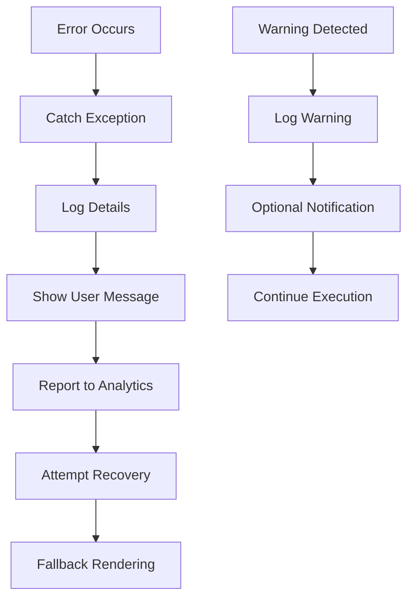

**Diagram sources**
- [charts.tsx:2100-2200](file://src/components/ui/charts.tsx#L2100-L2200)

**Section sources**
- [charts.tsx:2100-2300](file://src/components/ui/charts.tsx#L2100-L2300)

## Best Practices

### Data Presentation Guidelines

#### Choosing the Right Chart Type

| Data Type | Recommended Chart | Rationale |
|-----------|------------------|-----------|
| Time Series | Line Chart | Shows trends and patterns over time |
| Comparisons | Bar Chart | Easy to compare discrete categories |
| Proportions | Pie/Doughnut Chart | Illustrates part-to-whole relationships |
| Relationships | Scatter Plot | Reveals correlations and clusters |
| Distribution | Histogram | Shows frequency distributions |

#### Accessibility Standards

- **Color Contrast**: Ensure WCAG AA compliance (4.5:1 ratio)
- **Keyboard Navigation**: Full keyboard operability
- **Screen Reader Support**: Proper ARIA labels and descriptions
- **Focus Indicators**: Clear visual focus states
- **Alternative Text**: Descriptive text for non-visual users

#### Performance Best Practices

1. **Data Optimization**: Minimize data payload size
2. **Lazy Loading**: Load charts only when needed
3. **Debouncing**: Prevent excessive updates
4. **Caching**: Store computed results
5. **Progressive Enhancement**: Graceful degradation

### Code Organization

#### Component Structure

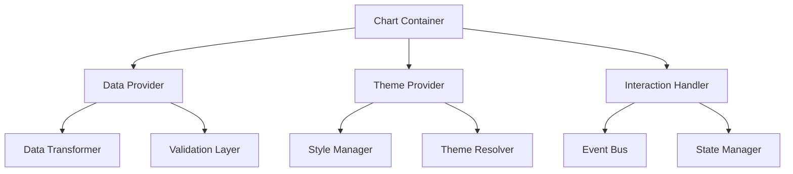

#### Naming Conventions

- **Components**: PascalCase (e.g., `LineChart`, `BarChart`)
- **Functions**: camelCase (e.g., `calculateScale`, `formatValue`)
- **Constants**: UPPER_SNAKE_CASE (e.g., `DEFAULT_OPTIONS`)
- **Files**: kebab-case (e.g., `line-chart.tsx`)
- **Types**: PascalCase interfaces (e.g., `ChartOptions`)

**Section sources**
- [charts.tsx:2300-2500](file://src/components/ui/charts.tsx#L2300-L2500)

## Conclusion

The data visualization system in CheapModels provides a comprehensive, flexible, and performant solution for presenting analytics data. With support for multiple chart types, extensive customization options, and advanced interactive features, it enables developers to create compelling data-driven user interfaces.

Key strengths of the system include:

- **Modular Architecture**: Clean separation of concerns and easy extensibility
- **Theme Integration**: Seamless styling consistency across the application
- **Performance Optimization**: Efficient rendering and memory management
- **Accessibility Compliance**: Inclusive design following web standards
- **Developer Experience**: Comprehensive APIs and documentation

The system's plugin architecture and external library integration capabilities ensure that it can evolve with changing requirements and leverage the best tools available in the ecosystem. By following the best practices outlined in this documentation, developers can create effective, accessible, and high-performance data visualizations that enhance user understanding and decision-making.

Future enhancements may include additional chart types, improved mobile experiences, advanced analytics integrations, and enhanced collaboration features for shared dashboard creation and sharing.