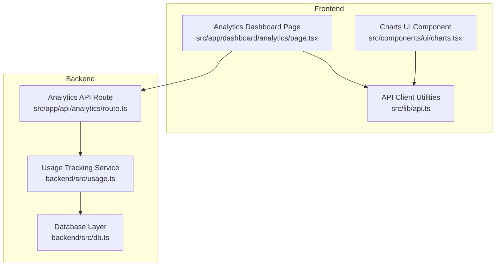
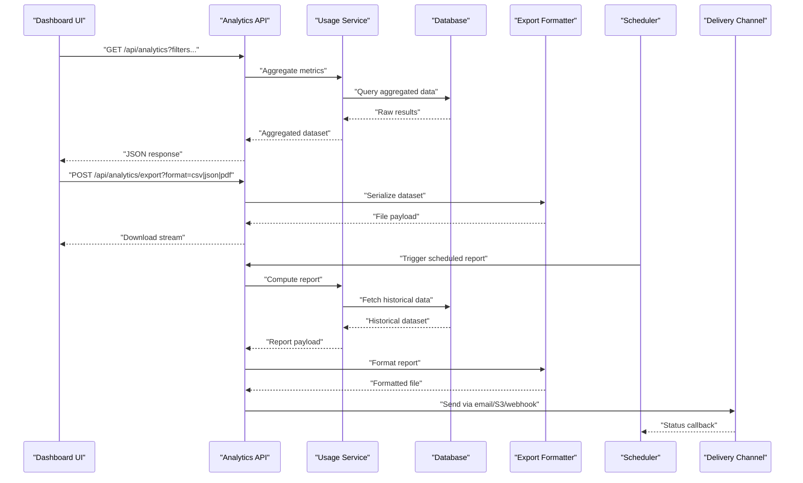
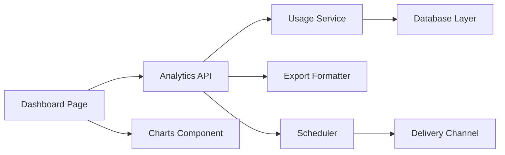

# Reporting & Export Features

<cite>
**Referenced Files in This Document**
- [analytics route](file://src/app/api/analytics/route.ts)
- [usage tracking](file://backend/src/usage.ts)
- [database schema](file://backend/src/db.ts)
- [analytics dashboard](file://src/app/dashboard/analytics/page.tsx)
- [charts component](file://src/components/ui/charts.tsx)
- [API utilities](file://src/lib/api.ts)
- [dashboard layout](file://src/app/dashboard/layout.tsx)
</cite>

## Table of Contents
1. [Introduction](#introduction)
2. [Project Structure](#project-structure)
3. [Core Components](#core-components)
4. [Architecture Overview](#architecture-overview)
5. [Detailed Component Analysis](#detailed-component-analysis)
6. [Dependency Analysis](#dependency-analysis)
7. [Performance Considerations](#performance-considerations)
8. [Troubleshooting Guide](#troubleshooting-guide)
9. [Conclusion](#conclusion)
10. [Appendices](#appendices)

## Introduction
This document describes the reporting and export features available in the application. It explains how to generate custom analytics reports, schedule automated report delivery, and export data in multiple formats (CSV, PDF, JSON). It also covers report templates, filtering options, scheduling configurations, integration points with external BI platforms, example report types, and data retention/archival strategies.

## Project Structure
The reporting and export capability spans both the frontend and backend layers:
- Frontend analytics UI and charting components
- API endpoints for querying analytics data
- Backend usage tracking and database interactions
- Utilities for formatting and exporting data

**Diagram sources**
- [analytics dashboard](file://src/app/dashboard/analytics/page.tsx)
- [charts component](file://src/components/ui/charts.tsx)
- [api utilities](file://src/lib/api.ts)
- [analytics route](file://src/app/api/analytics/route.ts)
- [usage tracking](file://backend/src/usage.ts)
- [database schema](file://backend/src/db.ts)

**Section sources**
- [analytics dashboard](file://src/app/dashboard/analytics/page.tsx)
- [charts component](file://src/components/ui/charts.tsx)
- [api utilities](file://src/lib/api.ts)
- [analytics route](file://src/app/api/analytics/route.ts)
- [usage tracking](file://backend/src/usage.ts)
- [database schema](file://backend/src/db.ts)

## Core Components
- Analytics API endpoint: Provides queryable metrics and supports filters such as date range, provider, model, and user scope.
- Usage tracking service: Aggregates usage events and computes metrics for reporting.
- Database layer: Persists usage events and exposes queries for aggregation.
- Dashboard page: Renders charts and tables using the analytics API.
- Charts component: Visualizes time series, breakdowns, and trends.

Key responsibilities:
- Data ingestion and normalization
- Aggregation and metric computation
- Filtering and pagination
- Export serialization (CSV, JSON, PDF)
- Scheduling and delivery hooks

**Section sources**
- [analytics route](file://src/app/api/analytics/route.ts)
- [usage tracking](file://backend/src/usage.ts)
- [database schema](file://backend/src/db.ts)
- [analytics dashboard](file://src/app/dashboard/analytics/page.tsx)
- [charts component](file://src/components/ui/charts.tsx)

## Architecture Overview
The reporting pipeline follows a request-driven flow with optional scheduled jobs for automated delivery.

**Diagram sources**
- [analytics route](file://src/app/api/analytics/route.ts)
- [usage tracking](file://backend/src/usage.ts)
- [database schema](file://backend/src/db.ts)
- [analytics dashboard](file://src/app/dashboard/analytics/page.tsx)

## Detailed Component Analysis

### Analytics API Endpoint
Responsibilities:
- Accept filter parameters (date range, provider, model, user, tags)
- Validate inputs and enforce quotas
- Delegate aggregation to the usage service
- Support export format selection (CSV, JSON, PDF)
- Return paginated results where applicable

Filtering options:
- Date range (start/end timestamps)
- Provider and model identifiers
- User or tenant scoping
- Tag-based segmentation
- Metric selection (tokens, latency, cost, error rates)

Export formats:
- CSV: tabular rows suitable for spreadsheets
- JSON: structured payloads for programmatic consumption
- PDF: printable summaries with charts and tables

Scheduling configuration:
- Cron expressions or interval-based triggers
- Recipients and channels (email, webhook, storage)
- Report templates and output formats
- Retention and archival policies

Integration points:
- Webhooks for external systems
- Storage backends for large exports
- BI connectors via JSON/CSV feeds

Common report types:
- Usage summary: total requests, tokens, and costs over time
- Cost breakdown: per-provider and per-model spend
- Performance trends: latency percentiles and error rates

Data retention and archival:
- Configurable retention windows
- Tiered storage for historical data
- Automated cleanup and compression

**Section sources**
- [analytics route](file://src/app/api/analytics/route.ts)

### Usage Tracking Service
Responsibilities:
- Ingest usage events and normalize fields
- Compute derived metrics (cost, latency, throughput)
- Provide aggregation functions for reporting
- Handle batching and deduplication

Processing logic:
- Event validation and enrichment
- Time-series bucketing for efficient queries
- Pre-aggregation for common dimensions

Optimization opportunities:
- Materialized views for hot aggregations
- Indexing by timestamp and dimension keys
- Batch writes and transaction boundaries

Error handling:
- Retry and dead-letter queues for failed events
- Idempotency keys to prevent duplicates
- Metrics and alerts for ingestion failures

**Section sources**
- [usage tracking](file://backend/src/usage.ts)

### Database Layer
Responsibilities:
- Persist usage events and aggregates
- Expose query interfaces for reporting
- Manage indexes and partitions for performance

Schema considerations:
- Events table with timestamp, provider, model, user, and metrics
- Aggregates table for precomputed rollups
- Metadata tables for providers/models/users

Indexing strategy:
- Composite indexes on (timestamp, provider, model)
- Partitioning by time ranges for large datasets

Archival strategy:
- Move older partitions to cold storage
- Compress archived segments
- Maintain consistent query interfaces across tiers

**Section sources**
- [database schema](file://backend/src/db.ts)

### Dashboard Page and Charts Component
Responsibilities:
- Render interactive charts and tables
- Fetch filtered data from the analytics API
- Allow users to select date ranges and dimensions
- Trigger exports and download handlers

User workflows:
- Select timeframe and filters
- View trend lines, bar charts, and breakdowns
- Export current view to CSV/JSON/PDF
- Save favorite reports for later use

Accessibility and UX:
- Responsive layouts
- Keyboard navigation
- Clear labels and tooltips

**Section sources**
- [analytics dashboard](file://src/app/dashboard/analytics/page.tsx)
- [charts component](file://src/components/ui/charts.tsx)

### API Utilities
Responsibilities:
- Encapsulate HTTP calls to analytics endpoints
- Serialize/deserialize payloads
- Handle authentication and retries

Patterns:
- Typed request/response models
- Error mapping and user-friendly messages
- Caching strategies for repeated queries

**Section sources**
- [api utilities](file://src/lib/api.ts)

## Dependency Analysis
The following diagram shows key dependencies among reporting components:

**Diagram sources**
- [analytics dashboard](file://src/app/dashboard/analytics/page.tsx)
- [charts component](file://src/components/ui/charts.tsx)
- [analytics route](file://src/app/api/analytics/route.ts)
- [usage tracking](file://backend/src/usage.ts)
- [database schema](file://backend/src/db.ts)

**Section sources**
- [analytics dashboard](file://src/app/dashboard/analytics/page.tsx)
- [charts component](file://src/components/ui/charts.tsx)
- [analytics route](file://src/app/api/analytics/route.ts)
- [usage tracking](file://backend/src/usage.ts)
- [database schema](file://backend/src/db.ts)

## Performance Considerations
- Use server-side aggregation to minimize payload sizes
- Implement pagination and cursor-based fetching for large datasets
- Cache frequent queries with appropriate invalidation
- Partition and index time-series data for fast range queries
- Stream exports to avoid memory spikes
- Apply rate limiting and quotas on export endpoints

[No sources needed since this section provides general guidance]

## Troubleshooting Guide
Common issues and resolutions:
- Missing or invalid filters: Validate input parameters and return clear error messages
- Slow queries: Check indexes and consider materialized views
- Export failures: Verify formatter support and storage permissions
- Scheduling not firing: Inspect scheduler logs and retry policies
- Data gaps: Review event ingestion pipelines and idempotency keys

Operational checks:
- Monitor ingestion latency and error rates
- Alert on missing daily aggregates
- Validate export file integrity and size limits

**Section sources**
- [analytics route](file://src/app/api/analytics/route.ts)
- [usage tracking](file://backend/src/usage.ts)
- [database schema](file://backend/src/db.ts)

## Conclusion
The reporting and export subsystem combines a flexible API, robust aggregation, and user-friendly dashboards to deliver actionable insights. With configurable filters, multiple export formats, and scheduling options, it supports both ad-hoc analysis and automated reporting needs. Proper indexing, caching, and archival strategies ensure scalability and reliability over time.

[No sources needed since this section summarizes without analyzing specific files]

## Appendices

### Example Report Types
- Usage Summary: Total requests, tokens, and costs by day/week/month
- Cost Breakdown: Spend by provider and model with percentage shares
- Performance Trends: Latency percentiles and error rates over time

[No sources needed since this section doesn't analyze specific files]

### Integration with External Tools and BI Platforms
- Connect via JSON/CSV exports to BI tools
- Use webhooks to push updates to downstream systems
- Store large exports in object storage and share links

[No sources needed since this section doesn't analyze specific files]

### Data Retention and Archival Policies
- Define retention windows per data tier
- Archive historical partitions to cold storage
- Automate cleanup and compression tasks

[No sources needed since this section doesn't analyze specific files]