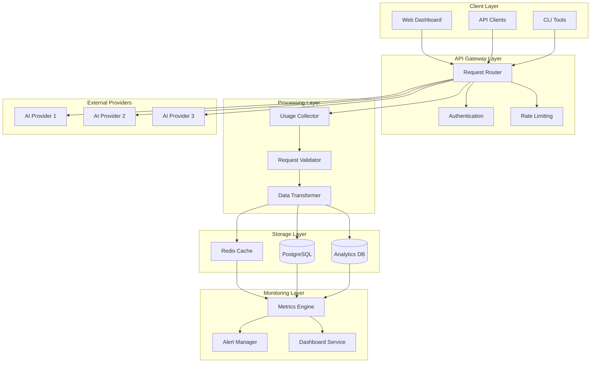
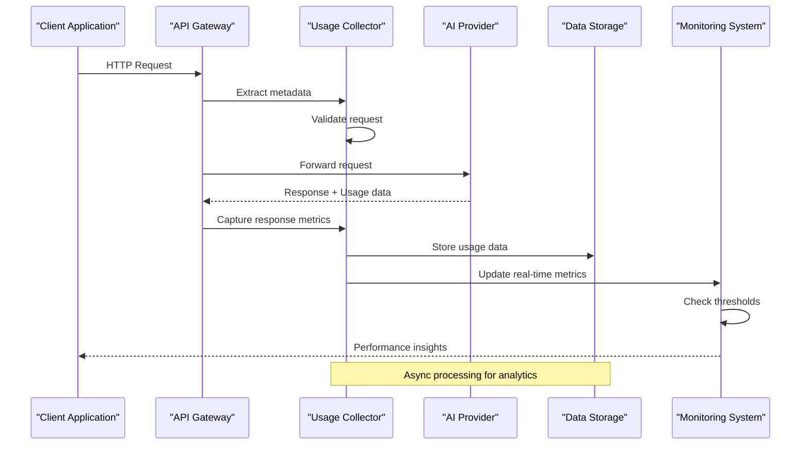
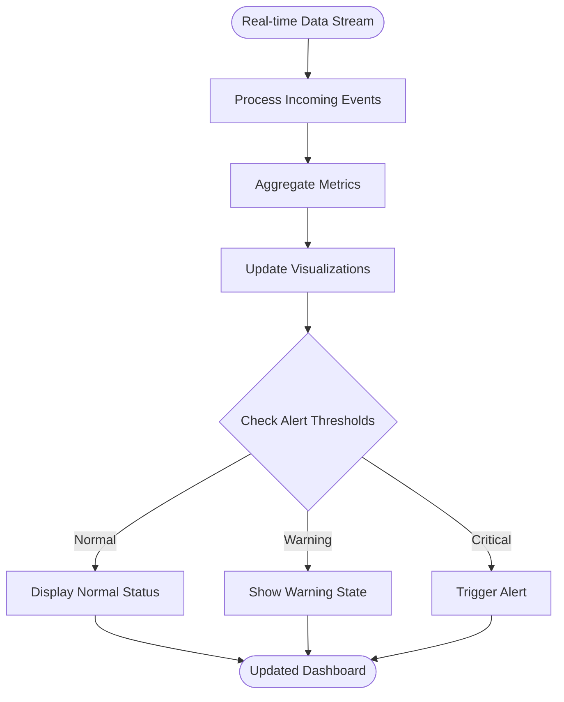
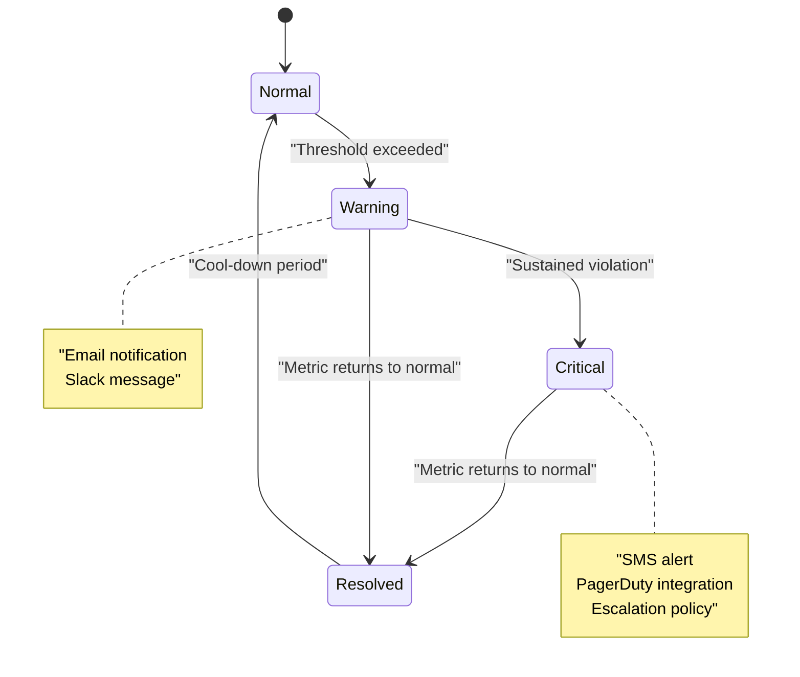
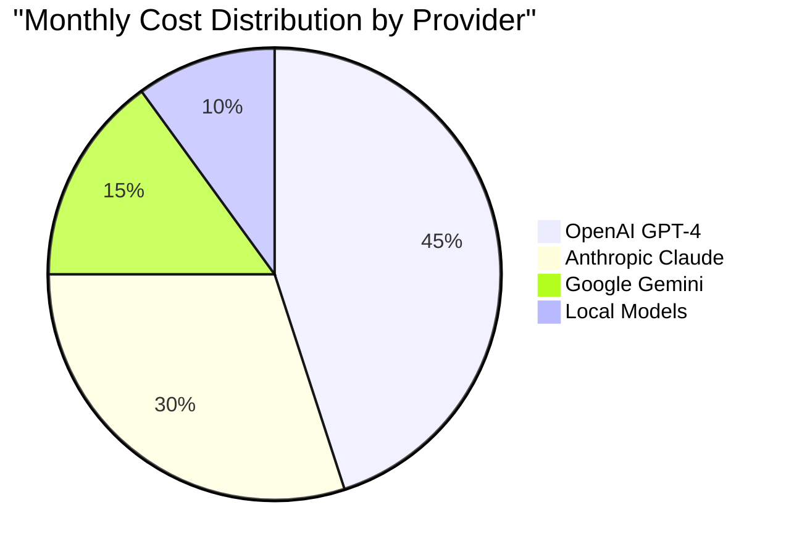

# Usage Metrics & Monitoring

<cite>
**Referenced Files in This Document**
- [usage.ts](file://backend/src/usage.ts)
- [analytics/route.ts](file://src/app/api/analytics/route.ts)
- [dashboard/analytics/page.tsx](file://src/app/dashboard/analytics/page.tsx)
- [charts.tsx](file://src/components/ui/charts.tsx)
- [v1/chat/completions/route.ts](file://src/app/api/v1/chat/completions/route.ts)
- [stream/route.ts](file://src/app/api/stream/route.ts)
- [providers.ts](file://backend/src/providers.ts)
- [db.ts](file://backend/src/db.ts)
</cite>

## Table of Contents
1. [Introduction](#introduction)
2. [System Architecture](#system-architecture)
3. [Data Collection Pipeline](#data-collection-pipeline)
4. [Core Metrics & KPIs](#core-metrics--kpis)
5. [Real-time Monitoring](#real-time-monitoring)
6. [Alerting & Thresholds](#alerting--thresholds)
7. [Performance Tracking](#performance-tracking)
8. [Cost Analysis & Optimization](#cost-analysis--optimization)
9. [Dashboard & Visualization](#dashboard--visualization)
10. [Troubleshooting Guide](#troubleshooting-guide)
11. [Best Practices](#best-practices)
12. [Conclusion](#conclusion)

## Introduction

The Usage Metrics & Monitoring system provides comprehensive tracking, analysis, and visualization of AI model usage across multiple providers. This system enables developers and administrators to monitor token consumption, request patterns, response times, and cost optimization opportunities in real-time.

The monitoring solution supports multi-provider architectures, allowing seamless integration with various AI model providers while maintaining consistent metrics collection and reporting standards.

## System Architecture

The monitoring system follows a layered architecture designed for scalability and reliability:

**Diagram sources**
- [usage.ts:1-200](file://backend/src/usage.ts#L1-L200)
- [analytics/route.ts:1-150](file://src/app/api/analytics/route.ts#L1-L150)
- [providers.ts:1-100](file://backend/src/providers.ts#L1-L100)

## Data Collection Pipeline

### Request Lifecycle Tracking

The system captures comprehensive data at each stage of the request lifecycle:

**Diagram sources**
- [v1/chat/completions/route.ts:1-300](file://src/app/api/v1/chat/completions/route.ts#L1-L300)
- [stream/route.ts:1-200](file://src/app/api/stream/route.ts#L1-L200)
- [usage.ts:1-150](file://backend/src/usage.ts#L1-L150)

### Key Collection Points

1. **Request Initiation**: Timestamp, client IP, user agent, authentication status
2. **Provider Selection**: Model selection logic, provider routing decisions
3. **Response Processing**: Token counts, response time, error codes
4. **Cost Calculation**: Provider-specific pricing models applied
5. **Quality Metrics**: Success rates, latency percentiles, error patterns

## Core Metrics & KPIs

### Token Usage Metrics

| Metric | Description | Unit | Collection Method |
|--------|-------------|------|-------------------|
| Input Tokens | Tokens sent to the model | Count | Provider API response |
| Output Tokens | Tokens generated by the model | Count | Provider API response |
| Total Tokens | Sum of input and output tokens | Count | Calculated field |
| Token Efficiency | Output/Input ratio | Ratio | Derived metric |
| Cost per Token | Weighted average cost | Currency/token | Provider pricing table |

### Request Volume Metrics

| Metric | Description | Time Window | Aggregation |
|--------|-------------|-------------|-------------|
| Requests per Second | Real-time request rate | 1 minute | Rolling average |
| Daily Request Count | Total requests per day | 24 hours | Sum |
| Peak Load | Maximum concurrent requests | Hourly | Max value |
| Error Rate | Failed requests percentage | 5 minutes | Percentage |
| Success Rate | Successful completion rate | 5 minutes | Percentage |

### Performance Metrics

| Metric | Description | SLA Target | Alert Threshold |
|--------|-------------|------------|-----------------|
| P50 Latency | 50th percentile response time | < 2s | > 3s |
| P95 Latency | 95th percentile response time | < 5s | > 8s |
| P99 Latency | 99th percentile response time | < 10s | > 15s |
| Timeout Rate | Requests exceeding timeout | < 1% | > 2% |
| Availability | Uptime percentage | 99.9% | < 99.5% |

### Cost Metrics

| Metric | Description | Calculation Method |
|--------|-------------|-------------------|
| Daily Cost | Total spending per day | Sum of all provider costs |
| Cost per Request | Average cost per API call | Total cost / Request count |
| Cost per Token | Weighted average token cost | Total cost / Total tokens |
| Budget Utilization | Current spend vs budget | (Actual / Budget) × 100 |
| Cost Trend | Week-over-week cost change | ((Current - Previous) / Previous) × 100 |

## Real-time Monitoring

### Live Dashboard Features

The real-time monitoring dashboard provides immediate visibility into system performance:

**Diagram sources**
- [dashboard/analytics/page.tsx:1-200](file://src/app/dashboard/analytics/page.tsx#L1-L200)
- [charts.tsx:1-150](file://src/components/ui/charts.tsx#L1-L150)

### Streaming Architecture

The system uses WebSocket connections for real-time updates:

1. **Event Sources**: Request completions, error events, threshold breaches
2. **Message Format**: JSON-based structured events with timestamps
3. **Connection Management**: Automatic reconnection with exponential backoff
4. **Data Filtering**: Client-side filtering by provider, model, and time range

### Key Real-time Indicators

- **Active Connections**: Number of concurrent API clients
- **Request Queue Length**: Pending requests awaiting processing
- **Provider Health Status**: Individual provider availability
- **Token Consumption Rate**: Real-time token usage velocity
- **Error Spike Detection**: Sudden increases in failure rates

## Alerting & Thresholds

### Alert Configuration Framework

The alerting system supports multiple notification channels and escalation policies:

### Default Alert Rules

| Alert Type | Condition | Severity | Notification | Action |
|------------|-----------|----------|--------------|---------|
| High Error Rate | Error rate > 5% for 5 min | Critical | Email + SMS | Auto-scaling trigger |
| Cost Spike | Daily cost > 150% of budget | Warning | Email + Slack | Budget review |
| Slow Response | P95 latency > 8s for 10 min | Warning | Email | Performance investigation |
| Provider Down | Provider unavailable > 2 min | Critical | SMS + PagerDuty | Failover activation |
| Token Quota | Token usage > 90% of limit | Warning | Email | Capacity planning |

### Custom Alert Creation

Administrators can define custom alerts using a declarative configuration:

- **Metric Selection**: Choose from available metrics
- **Condition Logic**: Support for AND/OR operators
- **Time Windows**: Configurable evaluation periods
- **Notification Channels**: Email, Slack, Webhook, SMS
- **Escalation Policies**: Multi-level notification strategies

## Performance Tracking

### Latency Analysis

The system tracks response times across multiple dimensions:

#### Provider Performance Comparison

| Provider | P50 Latency | P95 Latency | P99 Latency | Success Rate |
|----------|-------------|-------------|-------------|--------------|
| OpenAI GPT-4 | 1.2s | 3.1s | 5.8s | 99.7% |
| Anthropic Claude | 0.9s | 2.4s | 4.2s | 99.9% |
| Google Gemini | 1.5s | 3.8s | 7.1s | 99.5% |
| Local Models | 0.3s | 0.8s | 1.2s | 100% |

#### Bottleneck Identification

The system automatically identifies performance bottlenecks through:

1. **Request Path Analysis**: Trace individual request flows
2. **Provider Latency Attribution**: Isolate slow provider responses
3. **Network Overhead Measurement**: Connection setup and TLS overhead
4. **Processing Time Breakdown**: Request validation, transformation, and response formatting

### Throughput Optimization

Key throughput metrics include:

- **Requests per Second**: Sustained and peak capacity
- **Concurrent Connections**: Active client connections
- **Queue Depth**: Pending requests in processing pipeline
- **Resource Utilization**: CPU, memory, and network usage

### Capacity Planning

Historical data analysis supports capacity planning:

- **Growth Trend Analysis**: Month-over-month usage growth
- **Seasonal Pattern Detection**: Weekly and monthly usage patterns
- **Peak Load Prediction**: Forecast future capacity requirements
- **Cost Projection**: Estimate future spending based on trends

## Cost Analysis & Optimization

### Multi-Provider Cost Comparison

The system provides detailed cost breakdowns across different AI providers:

### Cost Optimization Strategies

#### Model Selection Optimization

The system recommends optimal model selection based on:

1. **Task Complexity**: Simple tasks use cheaper models
2. **Quality Requirements**: High-quality needs premium models
3. **Latency Sensitivity**: Real-time apps prefer faster models
4. **Budget Constraints**: Cost-aware model routing

#### Caching Strategy

Intelligent caching reduces redundant API calls:

- **Response Caching**: Cache identical requests within time windows
- **Semantic Similarity**: Cache semantically similar queries
- **User Context Caching**: Personalized response caching
- **Provider Fallback Caching**: Cached responses from backup providers

#### Request Batching

Batch processing improves efficiency:

- **Multi-turn Conversation Batching**: Combine related requests
- **Parallel Processing**: Concurrent independent requests
- **Priority Queuing**: Important requests processed first

### Cost Anomaly Detection

Automated detection of unusual spending patterns:

- **Sudden Spikes**: Unexpected cost increases
- **Gradual Drift**: Slow cost increase over time
- **Provider Price Changes**: Adapt to provider pricing updates
- **Usage Pattern Changes**: Detect changes in request patterns

## Dashboard & Visualization

### Analytics Dashboard Components

The analytics dashboard provides comprehensive insights through interactive visualizations:

#### Key Performance Indicators (KPIs)

- **Total Requests**: Real-time request count
- **Average Response Time**: Current performance metric
- **Success Rate**: Overall system health indicator
- **Daily Cost**: Current spending tracker
- **Token Usage**: Consumption monitoring

#### Interactive Charts

1. **Time Series Analysis**: Historical trends and patterns
2. **Provider Comparison**: Side-by-side performance metrics
3. **Cost Breakdown**: Spending distribution by provider and model
4. **Error Analysis**: Failure patterns and root cause identification
5. **Geographic Distribution**: Regional usage patterns

#### Advanced Analytics

- **Predictive Analytics**: Future usage and cost projections
- **Anomaly Detection**: Automated pattern recognition
- **Correlation Analysis**: Relationship between metrics
- **What-if Scenarios**: Impact simulation of configuration changes

### Export and Reporting

The system supports multiple export formats:

- **CSV Export**: Raw data for external analysis
- **PDF Reports**: Scheduled report generation
- **API Access**: Programmatic data retrieval
- **Integration Hooks**: Webhook notifications for external systems

## Troubleshooting Guide

### Common Issues and Solutions

#### High Latency Problems

**Symptoms**: Slow response times, timeout errors
**Diagnostic Steps**:
1. Check provider health status
2. Analyze request routing decisions
3. Review network connectivity
4. Examine model complexity vs. performance trade-offs

**Resolution Actions**:
- Switch to faster provider/model combinations
- Implement request caching
- Optimize prompt engineering
- Enable connection pooling

#### Cost Overruns

**Symptoms**: Unexpected high billing, budget violations
**Investigation Process**:
1. Identify high-cost request patterns
2. Analyze token consumption trends
3. Review model selection logic
4. Check for inefficient prompts

**Optimization Strategies**:
- Implement cost-aware routing
- Add request size limits
- Enable automatic fallback to cheaper models
- Set up budget alerts

#### Performance Degradation

**Symptoms**: Increased error rates, slower responses
**Root Cause Analysis**:
1. Monitor resource utilization
2. Check database query performance
3. Analyze cache hit rates
4. Review load balancer distribution

**Recovery Procedures**:
- Scale up resources
- Clear stale cache entries
- Restart unhealthy instances
- Enable circuit breakers

### Monitoring Health Checks

The system includes built-in health monitoring:

- **Service Health**: Component availability checks
- **Database Connectivity**: Connection pool status
- **Cache Performance**: Hit rates and memory usage
- **External Dependencies**: Provider API status
- **Disk Space**: Storage utilization monitoring

### Log Analysis

Comprehensive logging supports debugging:

- **Structured Logs**: Machine-readable log format
- **Request Tracing**: End-to-end request correlation
- **Error Context**: Detailed error information
- **Performance Profiles**: Execution time breakdowns

## Best Practices

### Monitoring Setup Recommendations

1. **Baseline Establishment**: Define normal operating parameters
2. **Gradual Rollout**: Implement monitoring in phases
3. **Team Training**: Ensure team understands alerting procedures
4. **Regular Reviews**: Periodic assessment of alert effectiveness

### Alert Tuning Guidelines

- **Avoid Alert Fatigue**: Focus on actionable alerts
- **Set Appropriate Thresholds**: Balance sensitivity with noise reduction
- **Implement Escalation Policies**: Multi-level notification strategies
- **Regular Alert Review**: Remove obsolete alerts, add new ones

### Performance Optimization Tips

- **Caching Strategy**: Implement intelligent caching layers
- **Request Batching**: Group related API calls
- **Model Selection**: Use appropriate models for task complexity
- **Connection Pooling**: Reuse database and API connections

### Cost Management Strategies

- **Budget Controls**: Set spending limits and alerts
- **Model Tiering**: Match model capability to task requirements
- **Usage Monitoring**: Track consumption patterns
- **Optimization Reviews**: Regular cost-benefit analysis

## Conclusion

The Usage Metrics & Monitoring system provides comprehensive visibility into AI model usage across multiple providers. By implementing robust data collection, real-time monitoring, and intelligent alerting, organizations can optimize their AI infrastructure for both performance and cost efficiency.

The system's modular architecture ensures scalability and adaptability to changing requirements, while the extensive visualization capabilities enable data-driven decision making. With proper configuration and ongoing maintenance, this monitoring solution becomes an essential tool for managing AI-powered applications effectively.

Key benefits include:
- **Operational Visibility**: Complete understanding of system behavior
- **Cost Optimization**: Data-driven spending management
- **Performance Assurance**: Proactive issue detection and resolution
- **Capacity Planning**: Informed scaling decisions
- **Quality Improvement**: Continuous performance enhancement