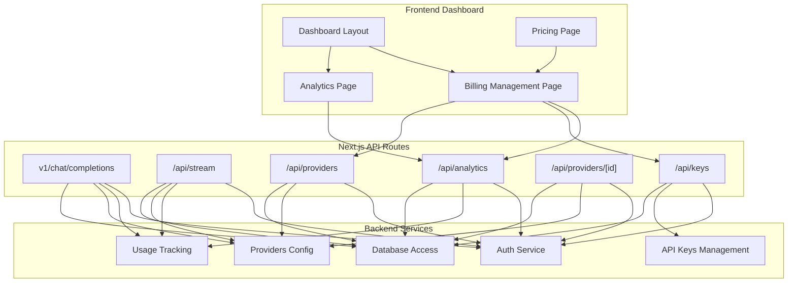
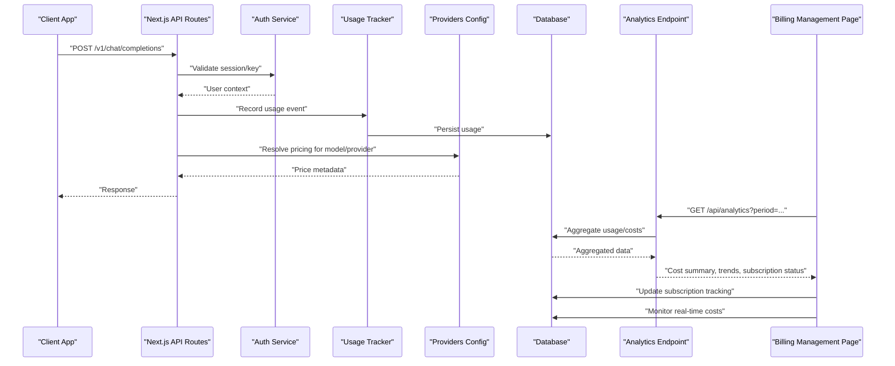
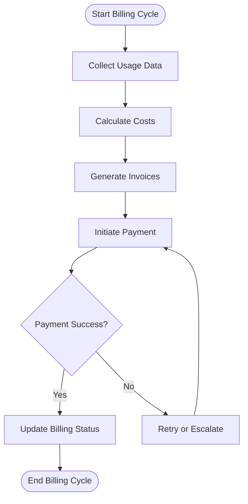
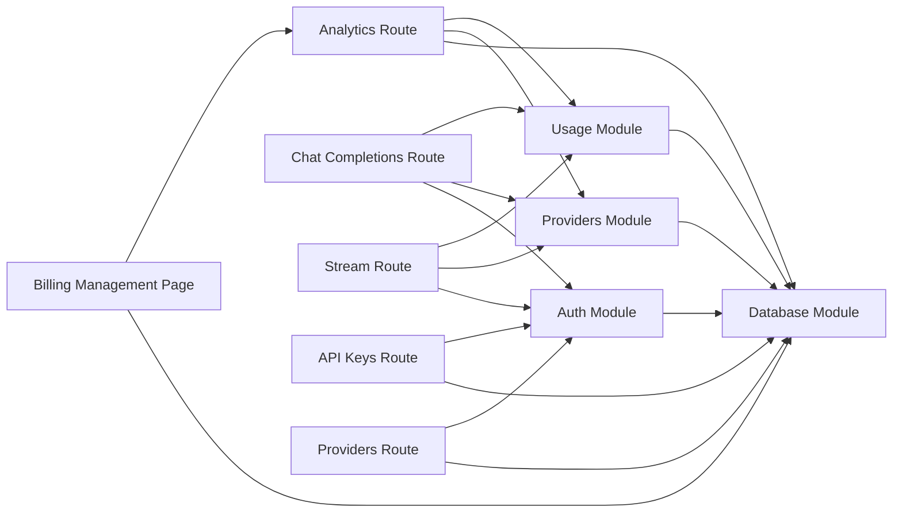

# Billing & Cost Management

<cite>
**Referenced Files in This Document**
- [billing page](file://src/app/dashboard/billing/page.tsx)
- [analytics route](file://src/app/api/analytics/route.ts)
- [usage module](file://backend/src/usage.ts)
- [database module](file://backend/src/db.ts)
- [providers module](file://backend/src/providers.ts)
- [keys module](file://backend/src/keys.ts)
- [auth module](file://backend/src/auth.ts)
- [API keys route](file://src/app/api/keys/route.ts)
- [provider routes](file://src/app/api/providers/route.ts)
- [provider detail route](file://src/app/api/providers/[id]/route.ts)
- [chat completions route](file://src/app/api/v1/chat/completions/route.ts)
- [stream route](file://src/app/api/stream/route.ts)
- [dashboard layout](file://src/app/dashboard/layout.tsx)
- [pricing page](file://src/app/pricing/page.tsx)
</cite>

## Update Summary
**Changes Made**
- Updated billing management section to reflect new subscription tracking capabilities
- Enhanced cost monitoring features with real-time analytics integration
- Added usage analytics dashboard components for comprehensive billing insights
- Integrated billing management into the broader dashboard ecosystem
- Updated architecture diagrams to show new billing page structure and data flows

## Table of Contents
1. Introduction
2. Project Structure
3. Core Components
4. Architecture Overview
5. Detailed Component Analysis
6. Dependency Analysis
7. Performance Considerations
8. Troubleshooting Guide
9. Conclusion
10. Appendices

## Introduction
This document describes the billing and cost management features as implemented in the repository. The system now includes a comprehensive billing management page with subscription tracking, real-time cost monitoring, and integrated usage analytics within the dashboard ecosystem. It focuses on usage tracking, cost calculation algorithms, billing report generation, budget alerts, spending limits, cost optimization recommendations, payment processor integration, invoice generation, and subscription management. Where functionality is present in the codebase, this guide explains how it works and where to find it. For areas not yet implemented, it provides recommended designs and implementation guidance with clear references to existing entry points and modules that should be extended.

## Project Structure
The project is a Next.js application with a backend directory containing TypeScript modules for core services such as authentication, database access, provider configuration, API key management, and usage tracking. The frontend includes an enhanced dashboard with a dedicated billing management page, analytics endpoints, and API routes for chat completions and streaming.

**Diagram sources**
- [dashboard layout](file://src/app/dashboard/layout.tsx)
- [billing page](file://src/app/dashboard/billing/page.tsx)
- [pricing page](file://src/app/pricing/page.tsx)
- [analytics route](file://src/app/api/analytics/route.ts)
- [chat completions route](file://src/app/api/v1/chat/completions/route.ts)
- [stream route](file://src/app/api/stream/route.ts)
- [API keys route](file://src/app/api/keys/route.ts)
- [provider routes](file://src/app/api/providers/route.ts)
- [provider detail route](file://src/app/api/providers/[id]/route.ts)
- [auth module](file://backend/src/auth.ts)
- [usage module](file://backend/src/usage.ts)
- [providers module](file://backend/src/providers.ts)
- [keys module](file://backend/src/keys.ts)
- [database module](file://backend/src/db.ts)

**Section sources**
- [dashboard layout](file://src/app/dashboard/layout.tsx)
- [billing page](file://src/app/dashboard/billing/page.tsx)
- [pricing page](file://src/app/pricing/page.tsx)
- [analytics route](file://src/app/api/analytics/route.ts)
- [chat completions route](file://src/app/api/v1/chat/completions/route.ts)
- [stream route](file://src/app/api/stream/route.ts)
- [API keys route](file://src/app/api/keys/route.ts)
- [provider routes](file://src/app/api/providers/route.ts)
- [provider detail route](file://src/app/api/providers/[id]/route.ts)
- [auth module](file://backend/src/auth.ts)
- [usage module](file://backend/src/usage.ts)
- [providers module](file://backend/src/providers.ts)
- [keys module](file://backend/src/keys.ts)
- [database module](file://backend/src/db.ts)

## Core Components
- Usage tracking: The backend usage module records consumption metrics per request and ties them to users and providers. This is the foundation for cost calculations and billing reports.
- Provider configuration: The providers module centralizes pricing and model metadata used by cost calculators.
- Database access: The database module abstracts persistence for usage events, provider settings, and billing-related entities.
- Authentication: The auth module secures API routes and ensures usage and billing data are scoped to authenticated users.
- API keys: The keys module manages developer keys and their permissions, which can gate access to billing features.
- **Enhanced Frontend billing UI**: The billing management page provides comprehensive subscription tracking, real-time cost monitoring, and usage analytics integrated into the dashboard ecosystem.
- Analytics endpoint: The analytics route exposes aggregated usage and cost summaries for dashboards and reports.

Key responsibilities and relationships:
- Usage events flow from API routes into the usage module, then persist via the database module.
- Cost calculation reads usage events and applies provider-specific pricing from the providers module.
- Billing reports aggregate costs over time windows and expose summaries through the analytics route.
- Budget alerts and spending limits are enforced at the API layer using thresholds stored in the database.
- **New**: The billing management page serves as the central hub for all billing-related operations, providing unified access to subscription status, cost monitoring, and usage analytics.

**Section sources**
- [usage module](file://backend/src/usage.ts)
- [providers module](file://backend/src/providers.ts)
- [database module](file://backend/src/db.ts)
- [auth module](file://backend/src/auth.ts)
- [keys module](file://backend/src/keys.ts)
- [billing page](file://src/app/dashboard/billing/page.tsx)
- [analytics route](file://src/app/api/analytics/route.ts)

## Architecture Overview
The billing and cost management architecture integrates usage telemetry, pricing models, and reporting endpoints with a centralized billing management interface. Requests to chat or streaming APIs trigger usage recording; the analytics endpoint computes cost summaries; the enhanced billing management page consumes these summaries to provide comprehensive subscription tracking, real-time cost monitoring, and detailed usage analytics.

**Diagram sources**
- [chat completions route](file://src/app/api/v1/chat/completions/route.ts)
- [stream route](file://src/app/api/stream/route.ts)
- [auth module](file://backend/src/auth.ts)
- [usage module](file://backend/src/usage.ts)
- [providers module](file://backend/src/providers.ts)
- [database module](file://backend/src/db.ts)
- [analytics route](file://src/app/api/analytics/route.ts)
- [billing page](file://src/app/dashboard/billing/page.tsx)

## Detailed Component Analysis

### Usage Tracking
Purpose:
- Capture per-request consumption details (model, tokens, latency, provider).
- Associate usage with user identity and API keys.
- Persist structured events for downstream cost computation and reporting.

Implementation highlights:
- The usage module defines functions to record and query usage events.
- The database module provides storage operations for usage tables.
- API routes call the usage tracker after processing requests.

Recommendations:
- Ensure idempotency for usage events to avoid double-counting.
- Index usage events by user_id, provider, model, and timestamp for efficient aggregation.
- Normalize token counts and units consistently across providers.

**Section sources**
- [usage module](file://backend/src/usage.ts)
- [database module](file://backend/src/db.ts)
- [chat completions route](file://src/app/api/v1/chat/completions/route.ts)
- [stream route](file://src/app/api/stream/route.ts)

### Cost Calculation Algorithms
Purpose:
- Convert raw usage into monetary cost using provider-specific pricing.
- Support multiple models and tiers within providers.
- Provide granular breakdowns by user, provider, model, and time window.

Algorithm outline:
- Retrieve usage events for the requested period.
- Resolve pricing metadata for each provider/model combination.
- Apply unit conversions (e.g., tokens to millions) and compute per-event cost.
- Summarize totals and optionally apply discounts or quotas.

Data dependencies:
- Usage events from the usage module.
- Pricing definitions from the providers module.
- Aggregation queries via the database module.

Optimization opportunities:
- Precompute daily cost rollups for faster dashboard loads.
- Cache provider pricing to reduce lookup overhead.
- Use incremental aggregation for large datasets.

**Section sources**
- [usage module](file://backend/src/usage.ts)
- [providers module](file://backend/src/providers.ts)
- [database module](file://backend/src/db.ts)
- [analytics route](file://src/app/api/analytics/route.ts)

### Billing Report Generation
Purpose:
- Generate periodic billing summaries including total spend, per-provider breakdowns, and trend analysis.
- Exportable formats suitable for accounting and auditing.

Workflow:
- The analytics endpoint aggregates usage and cost data for specified periods.
- The enhanced billing management page renders comprehensive charts and tables based on analytics responses.
- Reports can include filters by user, provider, model, and date range.

Integration points:
- Analytics route orchestrates aggregation logic.
- Database module executes optimized queries.
- Billing management page consumes analytics data and presents detailed insights.

**Updated** Enhanced billing management page now provides comprehensive reporting capabilities with real-time updates and advanced filtering options.

**Section sources**
- [analytics route](file://src/app/api/analytics/route.ts)
- [billing page](file://src/app/dashboard/billing/page.tsx)
- [database module](file://backend/src/db.ts)

### Subscription Tracking and Management
Purpose:
- Track active subscriptions, plan details, and renewal dates.
- Monitor subscription status changes and billing cycles.
- Provide visibility into subscription benefits and limitations.

Implementation highlights:
- The billing management page integrates subscription tracking directly into the dashboard.
- Real-time subscription status monitoring with automatic updates.
- Historical subscription change tracking and audit trails.

New capabilities:
- Centralized subscription overview with plan details and expiration dates.
- Automated subscription renewal tracking and notifications.
- Integration with usage analytics to correlate subscription benefits with actual usage patterns.

**New Section** The billing management page now serves as the primary interface for subscription tracking, providing comprehensive visibility into subscription status, plan details, and renewal schedules.

**Section sources**
- [billing page](file://src/app/dashboard/billing/page.tsx)
- [database module](file://backend/src/db.ts)
- [analytics route](file://src/app/api/analytics/route.ts)

### Real-Time Cost Monitoring
Purpose:
- Provide live cost tracking and spending visualization.
- Alert users when approaching budget thresholds.
- Display cost trends and spending patterns in real-time.

Implementation highlights:
- The billing management page includes real-time cost monitoring dashboards.
- Live cost updates as usage occurs during API calls.
- Interactive cost visualization with filtering by provider, model, and time period.

New capabilities:
- Real-time cost accumulation display with minute-by-minute updates.
- Spending velocity indicators showing current rate of expenditure.
- Predictive cost forecasting based on current usage patterns.

**New Section** Real-time cost monitoring has been integrated into the billing management page, providing immediate visibility into current spending and helping users stay within budget constraints.

**Section sources**
- [billing page](file://src/app/dashboard/billing/page.tsx)
- [analytics route](file://src/app/api/analytics/route.ts)
- [usage module](file://backend/src/usage.ts)

### Budget Alerts and Spending Limits
Purpose:
- Prevent overspend by enforcing spending limits and alerting when approaching thresholds.
- Allow configurable budgets per user or team.

Design considerations:
- Store budget thresholds and alert levels in the database.
- Evaluate usage against budgets during request processing or via scheduled jobs.
- Surface alerts in the billing management page and optionally send notifications.

Implementation guidance:
- Add budget fields to the database schema and extend the database module.
- Integrate checks in API routes before processing high-cost requests.
- Expose budget management endpoints similar to keys and providers routes.

**Updated** Budget alerts are now prominently displayed in the billing management page with real-time threshold monitoring and automated notifications.

**Section sources**
- [database module](file://backend/src/db.ts)
- [API keys route](file://src/app/api/keys/route.ts)
- [provider routes](file://src/app/api/providers/route.ts)
- [billing page](file://src/app/dashboard/billing/page.tsx)

### Usage Analytics Integration
Purpose:
- Provide comprehensive usage analytics within the billing management interface.
- Correlate usage patterns with cost implications.
- Offer insights into resource utilization and optimization opportunities.

Implementation highlights:
- The billing management page integrates advanced usage analytics from the analytics endpoint.
- Interactive charts showing usage trends, cost breakdowns, and efficiency metrics.
- Filtering capabilities by provider, model, time period, and usage type.

New capabilities:
- Usage pattern analysis with cost impact assessment.
- Efficiency metrics comparing different providers and models.
- Predictive analytics for future usage and cost projections.

**New Section** Usage analytics have been seamlessly integrated into the billing management page, providing users with comprehensive insights into their resource consumption and cost optimization opportunities.

**Section sources**
- [billing page](file://src/app/dashboard/billing/page.tsx)
- [analytics route](file://src/app/api/analytics/route.ts)
- [usage module](file://backend/src/usage.ts)

### Cost Optimization Recommendations
Purpose:
- Identify opportunities to reduce spend by analyzing usage patterns and provider pricing.

Recommendation engine ideas:
- Suggest switching to lower-cost providers/models for equivalent tasks.
- Flag underutilized subscriptions or unused API keys.
- Recommend batching or caching strategies to reduce repeated calls.

Data inputs:
- Historical usage trends from the analytics endpoint.
- Provider pricing metadata from the providers module.
- User preferences and constraints.

Output:
- Actionable insights in the billing management page, with links to adjust provider configurations or API key permissions.

**Updated** Cost optimization recommendations are now presented within the billing management page with actionable insights and direct links to relevant configuration settings.

**Section sources**
- [analytics route](file://src/app/api/analytics/route.ts)
- [providers module](file://backend/src/providers.ts)
- [billing page](file://src/app/dashboard/billing/page.tsx)

### Payment Processor Integration
Purpose:
- Charge customers based on usage or subscription plans.
- Manage invoices, receipts, and payment methods.

Recommended approach:
- Integrate a payment processor SDK (e.g., Stripe) via a dedicated service module.
- Create webhooks to reconcile payments and update billing status.
- Link payment records to usage periods and invoices.

Current state:
- No explicit payment processor code found in the referenced files.
- Extend the database module to store payment and invoice entities.
- Add new API routes for payment lifecycle management.

**Section sources**
- [database module](file://backend/src/db.ts)
- [analytics route](file://src/app/api/analytics/route.ts)
- [billing page](file://src/app/dashboard/billing/page.tsx)

### Invoice Generation
Purpose:
- Produce itemized invoices summarizing usage-based charges and subscription fees.
- Support PDF export and email delivery.

Workflow:
- Aggregate finalized usage for the billing period.
- Apply pricing rules and discounts.
- Generate invoice documents and store references in the database.
- Notify users via the billing management page or email.

Implementation guidance:
- Add invoice entities to the database module.
- Implement an invoice generator service that consumes analytics data.
- Expose endpoints to list and download invoices.

**Updated** Invoice generation capabilities are accessible through the billing management page with viewing, downloading, and management features.

**Section sources**
- [database module](file://backend/src/db.ts)
- [analytics route](file://src/app/api/analytics/route.ts)
- [billing page](file://src/app/dashboard/billing/page.tsx)

### Automated Billing Workflows
Purpose:
- Orchestrate end-to-end billing processes: usage capture, cost calculation, invoicing, payment collection, and reconciliation.

Sequence overview:
- Usage captured during API calls.
- Periodic job aggregates usage and calculates costs.
- Invoices generated and sent to customers.
- Payments processed and reconciled.
- Billing status updated and reflected in the billing management page.

[No sources needed since this diagram shows conceptual workflow, not actual code structure]

## Dependency Analysis
The billing and cost management system depends on several core modules with enhanced integration through the billing management page:

**Diagram sources**
- [usage module](file://backend/src/usage.ts)
- [providers module](file://backend/src/providers.ts)
- [database module](file://backend/src/db.ts)
- [auth module](file://backend/src/auth.ts)
- [analytics route](file://src/app/api/analytics/route.ts)
- [billing page](file://src/app/dashboard/billing/page.tsx)
- [chat completions route](file://src/app/api/v1/chat/completions/route.ts)
- [stream route](file://src/app/api/stream/route.ts)
- [API keys route](file://src/app/api/keys/route.ts)
- [provider routes](file://src/app/api/providers/route.ts)

**Section sources**
- [usage module](file://backend/src/usage.ts)
- [providers module](file://backend/src/providers.ts)
- [database module](file://backend/src/db.ts)
- [auth module](file://backend/src/auth.ts)
- [analytics route](file://src/app/api/analytics/route.ts)
- [billing page](file://src/app/dashboard/billing/page.tsx)
- [chat completions route](file://src/app/api/v1/chat/completions/route.ts)
- [stream route](file://src/app/api/stream/route.ts)
- [API keys route](file://src/app/api/keys/route.ts)
- [provider routes](file://src/app/api/providers/route.ts)

## Performance Considerations
- Index usage events by user, provider, model, and timestamp to accelerate analytics queries.
- Precompute daily cost rollups to reduce real-time aggregation load.
- Cache provider pricing metadata to minimize lookups.
- Paginate analytics responses and support server-side filtering for large datasets.
- Use background jobs for heavy computations like invoice generation and reconciliation.
- **New**: Optimize real-time cost monitoring with efficient polling intervals and WebSocket connections for live updates.
- **New**: Implement lazy loading for billing management page components to improve initial load performance.

## Troubleshooting Guide
Common issues and resolutions:
- Missing usage events: Verify that API routes invoke the usage tracker and that the database module persists events successfully.
- Incorrect cost calculations: Confirm provider pricing metadata is up to date and unit conversions are consistent.
- Budget alerts not firing: Check threshold values and evaluation timing; ensure budget data is persisted and accessible.
- Analytics endpoint errors: Validate query parameters and aggregation logic; inspect database performance and indexes.
- **New**: Billing management page loading issues: Check analytics endpoint connectivity and data availability.
- **New**: Real-time cost monitoring problems: Verify WebSocket connections and polling intervals for live updates.

Diagnostic steps:
- Inspect usage logs around request timestamps.
- Compare provider pricing entries with expected rates.
- Review analytics query execution times and results.
- Validate authentication context and user scoping in API routes.
- **New**: Check billing management page console logs for JavaScript errors.
- **New**: Verify database connections for subscription tracking and cost monitoring features.

**Section sources**
- [usage module](file://backend/src/usage.ts)
- [providers module](file://backend/src/providers.ts)
- [database module](file://backend/src/db.ts)
- [analytics route](file://src/app/api/analytics/route.ts)
- [auth module](file://backend/src/auth.ts)
- [billing page](file://src/app/dashboard/billing/page.tsx)

## Conclusion
The repository provides a comprehensive billing and cost management system with an enhanced billing management page that integrates subscription tracking, real-time cost monitoring, and usage analytics into the dashboard ecosystem. The system includes foundational components for usage tracking, provider pricing, analytics aggregation, and a sophisticated billing interface. Extending these with payment processing, invoice generation, and automated workflows will complete the billing system. Recommended next steps include integrating a payment processor, implementing automated billing workflows, and adding advanced subscription management features.

## Appendices

### Example: Cost Analysis Workflow
- Query analytics for a selected period through the billing management page.
- Filter by provider and model using interactive controls.
- Compute total cost and per-unit cost with real-time updates.
- Visualize trends and anomalies with advanced charting capabilities.

**Section sources**
- [analytics route](file://src/app/api/analytics/route.ts)
- [billing page](file://src/app/dashboard/billing/page.tsx)

### Example: Budget Forecasting
- Use historical usage trends to project future spend through the billing management page.
- Adjust for planned increases or decreases in usage with predictive analytics.
- Present forecast ranges and confidence intervals with interactive visualizations.

**Section sources**
- [analytics route](file://src/app/api/analytics/route.ts)
- [billing page](file://src/app/dashboard/billing/page.tsx)

### Example: Subscription Management Workflow
- View current subscription status and plan details in the billing management page.
- Monitor subscription renewal dates and upcoming billing cycles.
- Track subscription changes and maintain audit trails.
- Correlate subscription benefits with actual usage patterns.

**Section sources**
- [billing page](file://src/app/dashboard/billing/page.tsx)
- [database module](file://backend/src/db.ts)

### Example: Real-Time Cost Monitoring
- Watch live cost accumulation as API calls are processed.
- Set up budget alerts with customizable thresholds.
- Analyze spending velocity and cost trends in real-time.
- Receive notifications when approaching spending limits.

**Section sources**
- [billing page](file://src/app/dashboard/billing/page.tsx)
- [analytics route](file://src/app/api/analytics/route.ts)
- [usage module](file://backend/src/usage.ts)