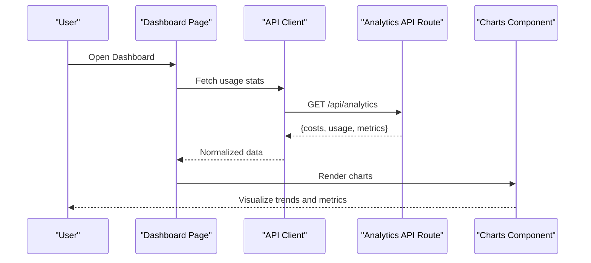
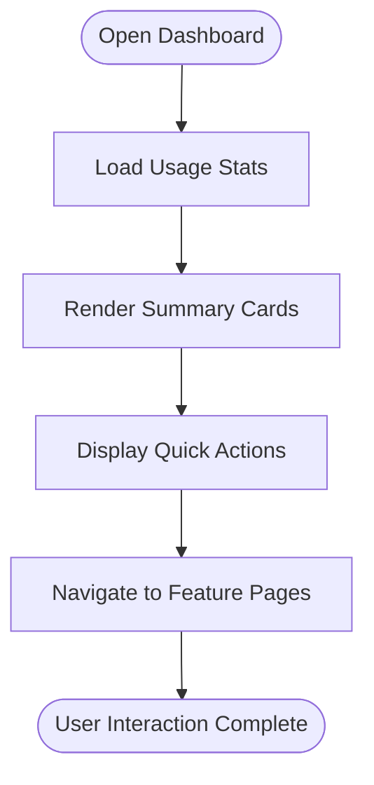
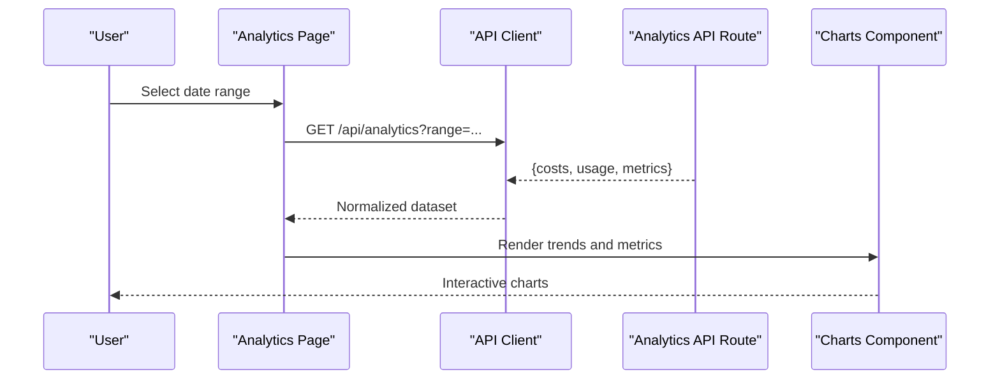
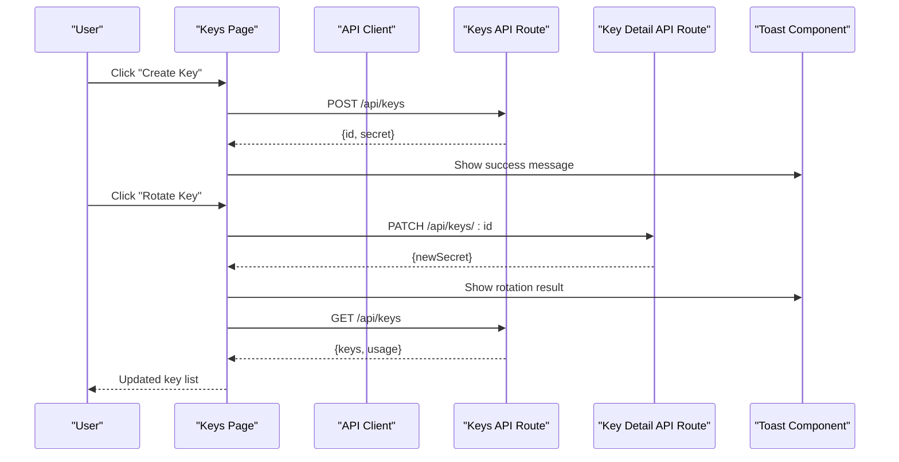
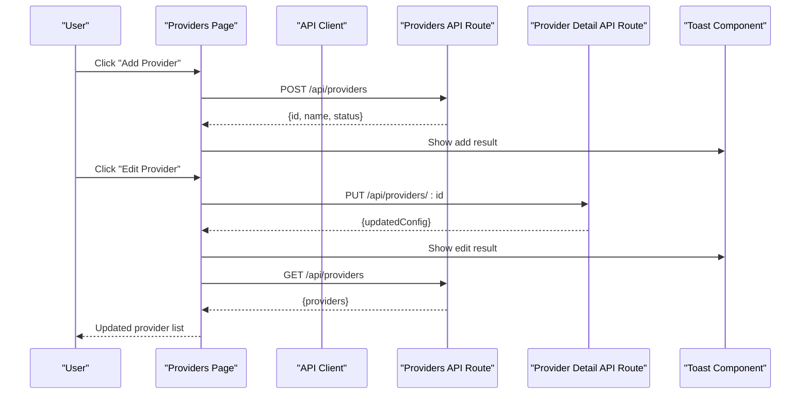
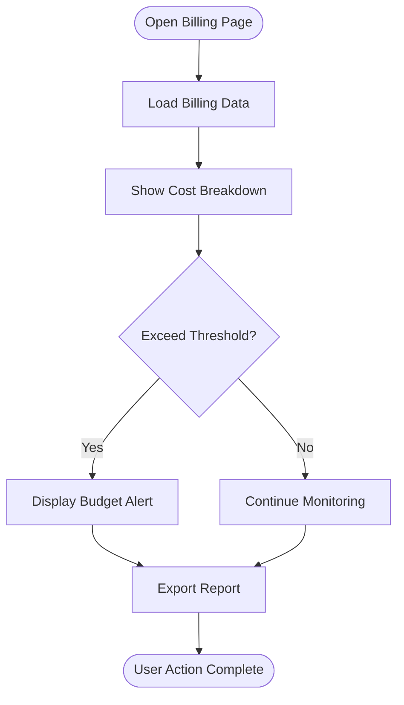
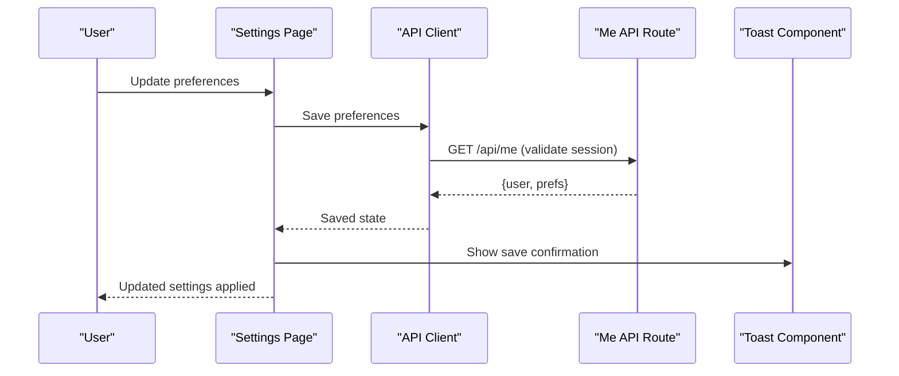

# Dashboard Features

<cite>
**Referenced Files in This Document**
- [dashboard page](file://src/app/dashboard/page.tsx)
- [dashboard layout](file://src/app/dashboard/layout.tsx)
- [dashboard styles](file://src/app/dashboard/dashboard.module.css)
- [analytics page](file://src/app/dashboard/analytics/page.tsx)
- [billing page](file://src/app/dashboard/billing/page.tsx)
- [keys page](file://src/app/dashboard/keys/page.tsx)
- [providers page](file://src/app/dashboard/providers/page.tsx)
- [settings page](file://src/app/dashboard/settings/page.tsx)
- [analytics API route](file://src/app/api/analytics/route.ts)
- [keys API routes](file://src/app/api/keys/route.ts)
- [key detail API route](file://src/app/api/keys/[id]/route.ts)
- [providers API routes](file://src/app/api/providers/route.ts)
- [provider detail API route](file://src/app/api/providers/[id]/route.ts)
- [chat completions API route](file://src/app/api/v1/chat/completions/route.ts)
- [stream API route](file://src/app/api/stream/route.ts)
- [auth login route](file://src/app/api/auth/login/route.ts)
- [auth signup route](file://src/app/api/auth/signup/route.ts)
- [me user info route](file://src/app/api/me/route.ts)
- [models route](file://src/app/api/models/route.ts)
- [charts UI component](file://src/components/ui/charts.tsx)
- [primitives UI component](file://src/components/ui/primitives.tsx)
- [toast UI component](file://src/components/ui/toast.tsx)
- [space button UI component](file://src/components/ui/space-button.tsx)
- [api client](file://src/lib/api.ts)
- [utils](file://src/lib/utils.ts)
- [theme config](file://src/config/theme.ts)
</cite>

## Table of Contents
1. [Introduction](#introduction)
2. [Project Structure](#project-structure)
3. [Core Components](#core-components)
4. [Architecture Overview](#architecture-overview)
5. [Detailed Component Analysis](#detailed-component-analysis)
6. [Dependency Analysis](#dependency-analysis)
7. [Performance Considerations](#performance-considerations)
8. [Troubleshooting Guide](#troubleshooting-guide)
9. [Conclusion](#conclusion)
10. [Appendices](#appendices)

## Introduction
This document provides comprehensive documentation for the dashboard features and user interface components, including:
- Main dashboard overview with usage statistics and quick actions
- Analytics page covering cost tracking, usage trends, and performance metrics visualization
- API key management interface for creating, rotating, and monitoring keys
- Provider configuration panel for managing AI service connections
- Billing and usage tracking features
- Settings management and user preferences

The goal is to help both technical and non-technical users understand how to use each feature effectively, along with best practices and troubleshooting guidance.

## Project Structure
The dashboard is implemented as a Next.js application with server-side API routes and reusable UI components. The structure separates pages (routes), API endpoints, shared UI components, and utilities.

```mermaid
graph TB
subgraph "Dashboard Pages"
DPage["Dashboard Page<br/>src/app/dashboard/page.tsx"]
Layout["Dashboard Layout<br/>src/app/dashboard/layout.tsx"]
Styles["Dashboard Styles<br/>src/app/dashboard/dashboard.module.css"]
Analytics["Analytics Page<br/>src/app/dashboard/analytics/page.tsx"]
Billing["Billing Page<br/>src/app/dashboard/billing/page.tsx"]
Keys["Keys Page<br/>src/app/dashboard/keys/page.tsx"]
Providers["Providers Page<br/>src/app/dashboard/providers/page.tsx"]
Settings["Settings Page<br/>src/app/dashboard/settings/page.tsx"]
end
subgraph "API Routes"
AAnalytics["Analytics Route<br/>src/app/api/analytics/route.ts"]
AKeys["Keys Route<br/>src/app/api/keys/route.ts"]
AKeyId["Key Detail Route<br/>src/app/api/keys/[id]/route.ts"]
AProviders["Providers Route<br/>src/app/api/providers/route.ts"]
AProviderId["Provider Detail Route<br/>src/app/api/providers/[id]/route.ts"]
AChat["Chat Completions Route<br/>src/app/api/v1/chat/completions/route.ts"]
AStream["Stream Route<br/>src/app/api/stream/route.ts"]
AAuthLogin["Auth Login Route<br/>src/app/api/auth/login/route.ts"]
AAuthSignup["Auth Signup Route<br/>src/app/api/auth/signup/route.ts"]
AMe["Me Route<br/>src/app/api/me/route.ts"]
AModels["Models Route<br/>src/app/api/models/route.ts"]
end
subgraph "UI Components"
Charts["Charts Component<br/>src/components/ui/charts.tsx"]
Primitives["Primitives Component<br/>src/components/ui/primitives.tsx"]
Toast["Toast Component<br/>src/components/ui/toast.tsx"]
SpaceButton["Space Button Component<br/>src/components/ui/space-button.tsx"]
end
subgraph "Libraries"
ApiClient["API Client<br/>src/lib/api.ts"]
Utils["Utils<br/>src/lib/utils.ts"]
Theme["Theme Config<br/>src/config/theme.ts"]
end
DPage --> Layout
DPage --> Styles
Analytics --> AAnalytics
Keys --> AKeys
Keys --> AKeyId
Providers --> AProviders
Providers --> AProviderId
Analytics --> Charts
Keys --> Toast
Providers --> Toast
Settings --> Toast
DPage --> ApiClient
Analytics --> ApiClient
Keys --> ApiClient
Providers --> ApiClient
Settings --> ApiClient
ApiClient --> Utils
ApiClient --> Theme
```

**Diagram sources**
- [dashboard page](file://src/app/dashboard/page.tsx)
- [dashboard layout](file://src/app/dashboard/layout.tsx)
- [dashboard styles](file://src/app/dashboard/dashboard.module.css)
- [analytics page](file://src/app/dashboard/analytics/page.tsx)
- [billing page](file://src/app/dashboard/billing/page.tsx)
- [keys page](file://src/app/dashboard/keys/page.tsx)
- [providers page](file://src/app/dashboard/providers/page.tsx)
- [settings page](file://src/app/dashboard/settings/page.tsx)
- [analytics API route](file://src/app/api/analytics/route.ts)
- [keys API routes](file://src/app/api/keys/route.ts)
- [key detail API route](file://src/app/api/keys/[id]/route.ts)
- [providers API routes](file://src/app/api/providers/route.ts)
- [provider detail API route](file://src/app/api/providers/[id]/route.ts)
- [chat completions API route](file://src/app/api/v1/chat/completions/route.ts)
- [stream API route](file://src/app/api/stream/route.ts)
- [auth login route](file://src/app/api/auth/login/route.ts)
- [auth signup route](file://src/app/api/auth/signup/route.ts)
- [me user info route](file://src/app/api/me/route.ts)
- [models route](file://src/app/api/models/route.ts)
- [charts UI component](file://src/components/ui/charts.tsx)
- [primitives UI component](file://src/components/ui/primitives.tsx)
- [toast UI component](file://src/components/ui/toast.tsx)
- [space button UI component](file://src/components/ui/space-button.tsx)
- [api client](file://src/lib/api.ts)
- [utils](file://src/lib/utils.ts)
- [theme config](file://src/config/theme.ts)

**Section sources**
- [dashboard page](file://src/app/dashboard/page.tsx)
- [dashboard layout](file://src/app/dashboard/layout.tsx)
- [dashboard styles](file://src/app/dashboard/dashboard.module.css)
- [analytics page](file://src/app/dashboard/analytics/page.tsx)
- [billing page](file://src/app/dashboard/billing/page.tsx)
- [keys page](file://src/app/dashboard/keys/page.tsx)
- [providers page](file://src/app/dashboard/providers/page.tsx)
- [settings page](file://src/app/dashboard/settings/page.tsx)
- [analytics API route](file://src/app/api/analytics/route.ts)
- [keys API routes](file://src/app/api/keys/route.ts)
- [key detail API route](file://src/app/api/keys/[id]/route.ts)
- [providers API routes](file://src/app/api/providers/route.ts)
- [provider detail API route](file://src/app/api/providers/[id]/route.ts)
- [chat completions API route](file://src/app/api/v1/chat/completions/route.ts)
- [stream API route](file://src/app/api/stream/route.ts)
- [auth login route](file://src/app/api/auth/login/route.ts)
- [auth signup route](file://src/app/api/auth/signup/route.ts)
- [me user info route](file://src/app/api/me/route.ts)
- [models route](file://src/app/api/models/route.ts)
- [charts UI component](file://src/components/ui/charts.tsx)
- [primitives UI component](file://src/components/ui/primitives.tsx)
- [toast UI component](file://src/components/ui/toast.tsx)
- [space button UI component](file://src/components/ui/space-button.tsx)
- [api client](file://src/lib/api.ts)
- [utils](file://src/lib/utils.ts)
- [theme config](file://src/config/theme.ts)

## Core Components
- Dashboard overview page: Presents usage statistics, recent activity, and quick actions such as starting a new chat or navigating to analytics and settings.
- Analytics page: Displays cost tracking, usage trends, and performance metrics using chart components.
- API key management: Provides creation, rotation, and monitoring of API keys with success/error feedback via toast notifications.
- Provider configuration: Allows adding, editing, and removing provider connections with validation and status indicators.
- Billing and usage tracking: Shows billing summaries, usage breakdowns, and alerts for thresholds.
- Settings and preferences: Manages user profile, theme, and notification preferences with persistence.

Reusable UI components include charts for visualizations, primitives for base elements, toast for notifications, and space button for primary actions.

**Section sources**
- [dashboard page](file://src/app/dashboard/page.tsx)
- [analytics page](file://src/app/dashboard/analytics/page.tsx)
- [keys page](file://src/app/dashboard/keys/page.tsx)
- [providers page](file://src/app/dashboard/providers/page.tsx)
- [billing page](file://src/app/dashboard/billing/page.tsx)
- [settings page](file://src/app/dashboard/settings/page.tsx)
- [charts UI component](file://src/components/ui/charts.tsx)
- [primitives UI component](file://src/components/ui/primitives.tsx)
- [toast UI component](file://src/components/ui/toast.tsx)
- [space button UI component](file://src/components/ui/space-button.tsx)

## Architecture Overview
The dashboard follows a page-based architecture with dedicated API routes for data operations. Pages consume an API client that handles requests, error handling, and response normalization. UI components are modular and reused across pages.

**Diagram sources**
- [dashboard page](file://src/app/dashboard/page.tsx)
- [analytics API route](file://src/app/api/analytics/route.ts)
- [charts UI component](file://src/components/ui/charts.tsx)
- [api client](file://src/lib/api.ts)

## Detailed Component Analysis

### Dashboard Overview
- Purpose: Central hub showing usage statistics, quick actions, and navigation shortcuts.
- Key interactions:
  - View summary cards for total usage, costs, and active providers.
  - Quick actions to start a new chat, open analytics, manage keys, configure providers, view billing, and access settings.
- Data flow:
  - Loads aggregated stats from analytics endpoint.
  - Renders summary cards and action buttons.
- Best practices:
  - Keep summary numbers concise and up-to-date.
  - Use clear labels and icons for quick actions.
  - Provide tooltips for context on metrics.

**Section sources**
- [dashboard page](file://src/app/dashboard/page.tsx)
- [dashboard layout](file://src/app/dashboard/layout.tsx)
- [dashboard styles](file://src/app/dashboard/dashboard.module.css)

### Analytics Page
- Purpose: Track costs, usage trends, and performance metrics over time.
- Features:
  - Cost tracking by provider and model.
  - Usage trends with time-series charts.
  - Performance metrics such as latency and throughput.
- Data sources:
  - Aggregated analytics from backend via analytics API route.
- Visualization:
  - Uses charts component for line/bar graphs.
- Best practices:
  - Allow date range selection for trend analysis.
  - Provide drill-down options by provider/model.
  - Include threshold lines for budget alerts.

**Diagram sources**
- [analytics page](file://src/app/dashboard/analytics/page.tsx)
- [analytics API route](file://src/app/api/analytics/route.ts)
- [charts UI component](file://src/components/ui/charts.tsx)
- [api client](file://src/lib/api.ts)

**Section sources**
- [analytics page](file://src/app/dashboard/analytics/page.tsx)
- [analytics API route](file://src/app/api/analytics/route.ts)
- [charts UI component](file://src/components/ui/charts.tsx)

### API Key Management Interface
- Purpose: Create, rotate, and monitor API keys securely.
- Features:
  - Create new keys with optional scopes and expiration.
  - Rotate existing keys with immediate deprecation of old ones.
  - Monitor usage per key with counters and last-used timestamps.
- Interactions:
  - Success and error feedback via toast notifications.
  - Confirmation dialogs for destructive actions like deletion.
- Data flow:
  - CRUD operations through keys API routes.
  - Real-time updates for usage counters.

**Diagram sources**
- [keys page](file://src/app/dashboard/keys/page.tsx)
- [keys API routes](file://src/app/api/keys/route.ts)
- [key detail API route](file://src/app/api/keys/[id]/route.ts)
- [toast UI component](file://src/components/ui/toast.tsx)
- [api client](file://src/lib/api.ts)

**Section sources**
- [keys page](file://src/app/dashboard/keys/page.tsx)
- [keys API routes](file://src/app/api/keys/route.ts)
- [key detail API route](file://src/app/api/keys/[id]/route.ts)
- [toast UI component](file://src/components/ui/toast.tsx)

### Provider Configuration Panel
- Purpose: Manage different AI service connections (providers).
- Features:
  - Add new providers with credentials and endpoints.
  - Edit existing provider configurations.
  - Remove providers and validate connectivity.
- Interactions:
  - Validation feedback and error messages via toast.
  - Status indicators for connection health.
- Data flow:
  - Provider CRUD operations through providers API routes.
  - Optional test connection calls before saving.

**Diagram sources**
- [providers page](file://src/app/dashboard/providers/page.tsx)
- [providers API routes](file://src/app/api/providers/route.ts)
- [provider detail API route](file://src/app/api/providers/[id]/route.ts)
- [toast UI component](file://src/components/ui/toast.tsx)
- [api client](file://src/lib/api.ts)

**Section sources**
- [providers page](file://src/app/dashboard/providers/page.tsx)
- [providers API routes](file://src/app/api/providers/route.ts)
- [provider detail API route](file://src/app/api/providers/[id]/route.ts)
- [toast UI component](file://src/components/ui/toast.tsx)

### Billing and Usage Tracking
- Purpose: Monitor billing summaries and usage breakdowns.
- Features:
  - Display total costs, per-provider costs, and per-model usage.
  - Alerts for approaching budget limits.
  - Exportable reports for accounting.
- Data sources:
  - Aggregated billing data from analytics and usage endpoints.
- Best practices:
  - Provide filters by date range and provider.
  - Highlight anomalies and spikes in usage.
  - Offer downloadable CSV/PDF exports.

**Section sources**
- [billing page](file://src/app/dashboard/billing/page.tsx)
- [analytics API route](file://src/app/api/analytics/route.ts)

### Settings and Preferences
- Purpose: Manage user profile, theme, and notification preferences.
- Features:
  - Update profile information and avatar.
  - Toggle dark/light theme with persistent storage.
  - Configure notification channels and frequency.
- Interactions:
  - Save changes with confirmation via toast.
  - Validate inputs and show inline errors.
- Data flow:
  - Persist preferences locally and sync with backend when available.

**Diagram sources**
- [settings page](file://src/app/dashboard/settings/page.tsx)
- [me user info route](file://src/app/api/me/route.ts)
- [toast UI component](file://src/components/ui/toast.tsx)
- [api client](file://src/lib/api.ts)

**Section sources**
- [settings page](file://src/app/dashboard/settings/page.tsx)
- [me user info route](file://src/app/api/me/route.ts)
- [toast UI component](file://src/components/ui/toast.tsx)
- [api client](file://src/lib/api.ts)

## Dependency Analysis
The dashboard relies on a cohesive set of dependencies between pages, API routes, UI components, and libraries.

```mermaid
graph TB
Dashboard["Dashboard Page"] --> ApiClient["API Client"]
Analytics["Analytics Page"] --> ApiClient
Keys["Keys Page"] --> ApiClient
Providers["Providers Page"] --> ApiClient
Billing["Billing Page"] --> ApiClient
Settings["Settings Page"] --> ApiClient
ApiClient --> AnalyticsRoute["Analytics API Route"]
ApiClient --> KeysRoute["Keys API Route"]
ApiClient --> KeyDetailRoute["Key Detail API Route"]
ApiClient --> ProvidersRoute["Providers API Route"]
ApiClient --> ProviderDetailRoute["Provider Detail API Route"]
ApiClient --> ChatRoute["Chat Completions API Route"]
ApiClient --> StreamRoute["Stream API Route"]
ApiClient --> AuthLoginRoute["Auth Login API Route"]
ApiClient --> AuthSignupRoute["Auth Signup API Route"]
ApiClient --> MeRoute["Me API Route"]
ApiClient --> ModelsRoute["Models API Route"]
Analytics --> Charts["Charts Component"]
Keys --> Toast["Toast Component"]
Providers --> Toast
Settings --> Toast
ApiClient --> Utils["Utils"]
ApiClient --> Theme["Theme Config"]
```

**Diagram sources**
- [dashboard page](file://src/app/dashboard/page.tsx)
- [analytics page](file://src/app/dashboard/analytics/page.tsx)
- [keys page](file://src/app/dashboard/keys/page.tsx)
- [providers page](file://src/app/dashboard/providers/page.tsx)
- [billing page](file://src/app/dashboard/billing/page.tsx)
- [settings page](file://src/app/dashboard/settings/page.tsx)
- [analytics API route](file://src/app/api/analytics/route.ts)
- [keys API routes](file://src/app/api/keys/route.ts)
- [key detail API route](file://src/app/api/keys/[id]/route.ts)
- [providers API routes](file://src/app/api/providers/route.ts)
- [provider detail API route](file://src/app/api/providers/[id]/route.ts)
- [chat completions API route](file://src/app/api/v1/chat/completions/route.ts)
- [stream API route](file://src/app/api/stream/route.ts)
- [auth login route](file://src/app/api/auth/login/route.ts)
- [auth signup route](file://src/app/api/auth/signup/route.ts)
- [me user info route](file://src/app/api/me/route.ts)
- [models route](file://src/app/api/models/route.ts)
- [charts UI component](file://src/components/ui/charts.tsx)
- [toast UI component](file://src/components/ui/toast.tsx)
- [api client](file://src/lib/api.ts)
- [utils](file://src/lib/utils.ts)
- [theme config](file://src/config/theme.ts)

**Section sources**
- [dashboard page](file://src/app/dashboard/page.tsx)
- [analytics page](file://src/app/dashboard/analytics/page.tsx)
- [keys page](file://src/app/dashboard/keys/page.tsx)
- [providers page](file://src/app/dashboard/providers/page.tsx)
- [billing page](file://src/app/dashboard/billing/page.tsx)
- [settings page](file://src/app/dashboard/settings/page.tsx)
- [analytics API route](file://src/app/api/analytics/route.ts)
- [keys API routes](file://src/app/api/keys/route.ts)
- [key detail API route](file://src/app/api/keys/[id]/route.ts)
- [providers API routes](file://src/app/api/providers/route.ts)
- [provider detail API route](file://src/app/api/providers/[id]/route.ts)
- [chat completions API route](file://src/app/api/v1/chat/completions/route.ts)
- [stream API route](file://src/app/api/stream/route.ts)
- [auth login route](file://src/app/api/auth/login/route.ts)
- [auth signup route](file://src/app/api/auth/signup/route.ts)
- [me user info route](file://src/app/api/me/route.ts)
- [models route](file://src/app/api/models/route.ts)
- [charts UI component](file://src/components/ui/charts.tsx)
- [toast UI component](file://src/components/ui/toast.tsx)
- [api client](file://src/lib/api.ts)
- [utils](file://src/lib/utils.ts)
- [theme config](file://src/config/theme.ts)

## Performance Considerations
- Optimize chart rendering by limiting data points and using lazy loading for large datasets.
- Debounce input fields in settings and provider forms to reduce unnecessary API calls.
- Cache frequently accessed analytics data with appropriate invalidation strategies.
- Use pagination for long lists of keys and providers to improve initial load times.
- Implement skeleton loaders for better perceived performance during data fetching.

[No sources needed since this section provides general guidance]

## Troubleshooting Guide
Common issues and resolutions:
- Authentication failures: Ensure login and signup routes return proper tokens; verify session validity via me route.
- API key rotation errors: Check key detail route responses and confirm old keys are revoked.
- Provider connection failures: Validate credentials and endpoints; use toast notifications to display specific error messages.
- Chart rendering problems: Inspect data shapes passed to charts component; ensure correct types and formats.
- Settings not persisting: Confirm local storage usage and backend sync; check for validation errors.

**Section sources**
- [auth login route](file://src/app/api/auth/login/route.ts)
- [auth signup route](file://src/app/api/auth/signup/route.ts)
- [me user info route](file://src/app/api/me/route.ts)
- [key detail API route](file://src/app/api/keys/[id]/route.ts)
- [providers API routes](file://src/app/api/providers/route.ts)
- [provider detail API route](file://src/app/api/providers/[id]/route.ts)
- [charts UI component](file://src/components/ui/charts.tsx)
- [toast UI component](file://src/components/ui/toast.tsx)

## Conclusion
The dashboard provides a comprehensive suite of tools for managing AI service usage, costs, and configurations. By leveraging modular UI components and well-structured API routes, it offers a scalable and maintainable platform. Following the best practices outlined here will enhance usability, reliability, and performance.

[No sources needed since this section summarizes without analyzing specific files]

## Appendices
- Screenshot examples: Capture each page to illustrate typical workflows and confirm UI consistency.
- Workflow examples: Document step-by-step procedures for common tasks such as creating a key, adding a provider, and reviewing analytics.
- Best practices checklist:
  - Always validate inputs before submission.
  - Provide clear feedback for all user actions.
  - Keep data visualizations simple and informative.
  - Securely handle sensitive information like API keys.

[No sources needed since this section provides general guidance]