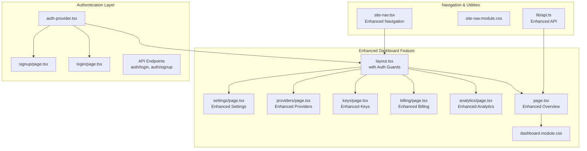
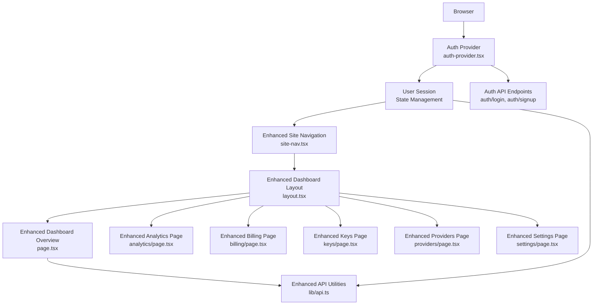
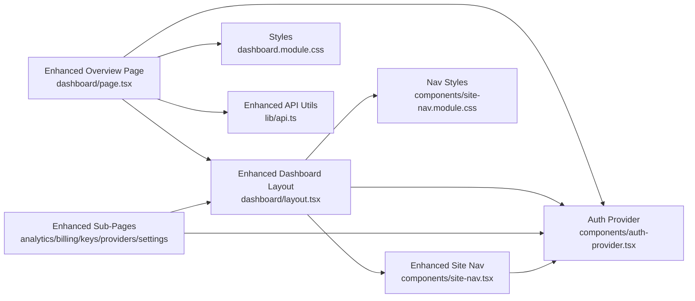

# Dashboard Overview

<cite>
**Referenced Files in This Document**
- [dashboard/page.tsx](file://src/app/dashboard/page.tsx)
- [dashboard/layout.tsx](file://src/app/dashboard/layout.tsx)
- [dashboard/dashboard.module.css](file://src/app/dashboard/dashboard.module.css)
- [analytics/page.tsx](file://src/app/dashboard/analytics/page.tsx)
- [billing/page.tsx](file://src/app/dashboard/billing/page.tsx)
- [keys/page.tsx](file://src/app/dashboard/keys/page.tsx)
- [providers/page.tsx](file://src/app/dashboard/providers/page.tsx)
- [settings/page.tsx](file://src/app/dashboard/settings/page.tsx)
- [site-nav.tsx](file://src/components/site-nav.tsx)
- [site-nav.module.css](file://src/components/site-nav.module.css)
- [api.ts](file://src/lib/api.ts)
- [auth-provider.tsx](file://src/components/auth-provider.tsx)
- [login/page.tsx](file://src/app/login/page.tsx)
- [signup/page.tsx](file://src/app/signup/page.tsx)
</cite>

## Update Summary
**Changes Made**
- Enhanced navigation integration with improved routing and authentication context
- Added comprehensive authentication integration across dashboard modules
- Expanded functionality with new API endpoints and data management capabilities
- Improved responsive design and user interface elements
- Strengthened security measures with proper auth guards and session management

## Table of Contents
1. [Introduction](#introduction)
2. [Project Structure](#project-structure)
3. [Core Components](#core-components)
4. [Architecture Overview](#architecture-overview)
5. [Authentication Integration](#authentication-integration)
6. [Enhanced Navigation System](#enhanced-navigation-system)
7. [Dashboard Modules](#dashboard-modules)
8. [Detailed Component Analysis](#detailed-component-analysis)
9. [Dependency Analysis](#dependency-analysis)
10. [Performance Considerations](#performance-considerations)
11. [Troubleshooting Guide](#troubleshooting-guide)
12. [Conclusion](#conclusion)
13. [Appendices](#appendices)

## Introduction
This document explains the enhanced main dashboard overview page, including its improved layout structure, advanced navigation components, authentication integration, and expanded functionality across all dashboard modules. It describes how users access different sections from the dashboard, use quick actions, monitor system status, and interact with authenticated features. The guide covers responsive design considerations, user interface enhancements, integration points with authentication and API services, common workflows, and best practices for efficient usage.

## Project Structure
The dashboard is implemented as a Next.js App Router feature under the dashboard route group with enhanced authentication and navigation capabilities. It includes:
- A shared layout that provides consistent chrome (header, sidebar, or top nav) across all dashboard pages with authentication guards
- An overview page that aggregates high-level metrics, quick links to sub-sections, and authenticated user data
- Sub-pages for analytics, billing, keys, providers, and settings with enhanced functionality
- Shared UI components and styles for consistency and responsiveness
- Authentication provider integration for secure user sessions
- Enhanced site navigation with contextual routing and active state management

**Diagram sources**
- [dashboard/layout.tsx](file://src/app/dashboard/layout.tsx)
- [dashboard/page.tsx](file://src/app/dashboard/page.tsx)
- [dashboard/dashboard.module.css](file://src/app/dashboard/dashboard.module.css)
- [analytics/page.tsx](file://src/app/dashboard/analytics/page.tsx)
- [billing/page.tsx](file://src/app/dashboard/billing/page.tsx)
- [keys/page.tsx](file://src/app/dashboard/keys/page.tsx)
- [providers/page.tsx](file://src/app/dashboard/providers/page.tsx)
- [settings/page.tsx](file://src/app/dashboard/settings/page.tsx)
- [auth-provider.tsx](file://src/components/auth-provider.tsx)
- [login/page.tsx](file://src/app/login/page.tsx)
- [signup/page.tsx](file://src/app/signup/page.tsx)
- [site-nav.tsx](file://src/components/site-nav.tsx)
- [site-nav.module.css](file://src/components/site-nav.module.css)
- [api.ts](file://src/lib/api.ts)

**Section sources**
- [dashboard/layout.tsx](file://src/app/dashboard/layout.tsx)
- [dashboard/page.tsx](file://src/app/dashboard/page.tsx)
- [dashboard/dashboard.module.css](file://src/app/dashboard/dashboard.module.css)
- [analytics/page.tsx](file://src/app/dashboard/analytics/page.tsx)
- [billing/page.tsx](file://src/app/dashboard/billing/page.tsx)
- [keys/page.tsx](file://src/app/dashboard/keys/page.tsx)
- [providers/page.tsx](file://src/app/dashboard/providers/page.tsx)
- [settings/page.tsx](file://src/app/dashboard/settings/page.tsx)
- [auth-provider.tsx](file://src/components/auth-provider.tsx)
- [login/page.tsx](file://src/app/login/page.tsx)
- [signup/page.tsx](file://src/app/signup/page.tsx)
- [site-nav.tsx](file://src/components/site-nav.tsx)
- [site-nav.module.css](file://src/components/site-nav.module.css)
- [api.ts](file://src/lib/api.ts)

## Core Components
- **Enhanced Dashboard Layout**: Provides the shell for all dashboard routes with authentication guards, consistent header/sidebar behavior, and responsive breakpoints. Includes session validation and redirect logic for unauthenticated users.
- **Enhanced Dashboard Overview Page**: Displays key statistics, recent activity, authenticated user data, and quick actions. Serves as the central hub for navigating to analytics, billing, keys, providers, and settings with personalized content.
- **Advanced Navigation System**: Integrated via the enhanced site navigation component, enabling quick access to major areas of the application, deep links into dashboard sections, and context-aware routing based on authentication state.
- **Authentication Provider**: Manages user sessions, authentication state, and protected routes throughout the application.
- **Enhanced Styles**: Module-scoped CSS for layout grids, cards, spacing, responsive rules, and authentication-related UI states.

Key responsibilities:
- Render a responsive grid of metric cards and action tiles with authenticated data
- Provide clear entry points to sub-features with role-based access control
- Maintain consistent visual hierarchy and accessibility patterns
- Integrate with global navigation for cross-feature movement
- Handle authentication redirects and session management
- Display user-specific information and permissions

**Updated** Enhanced with authentication integration, improved navigation, and expanded functionality across all modules.

**Section sources**
- [dashboard/layout.tsx](file://src/app/dashboard/layout.tsx)
- [dashboard/page.tsx](file://src/app/dashboard/page.tsx)
- [dashboard/dashboard.module.css](file://src/app/dashboard/dashboard.module.css)
- [site-nav.tsx](file://src/components/site-nav.tsx)
- [site-nav.module.css](file://src/components/site-nav.module.css)
- [auth-provider.tsx](file://src/components/auth-provider.tsx)

## Architecture Overview
The dashboard follows an enhanced layered approach with authentication integration:
- **Presentation layer**: React components for layout, overview, and sub-pages with authentication context
- **Authentication layer**: Session management, user state, and protected route handling
- **Styling layer**: CSS modules for scoped styles and responsive behavior
- **Navigation layer**: Enhanced shared site navigation for cross-app routing with auth-aware links
- **Data layer**: Enhanced API utilities for live metrics, user data, and authenticated operations

**Diagram sources**
- [auth-provider.tsx](file://src/components/auth-provider.tsx)
- [site-nav.tsx](file://src/components/site-nav.tsx)
- [dashboard/layout.tsx](file://src/app/dashboard/layout.tsx)
- [dashboard/page.tsx](file://src/app/dashboard/page.tsx)
- [analytics/page.tsx](file://src/app/dashboard/analytics/page.tsx)
- [billing/page.tsx](file://src/app/dashboard/billing/page.tsx)
- [keys/page.tsx](file://src/app/dashboard/keys/page.tsx)
- [providers/page.tsx](file://src/app/dashboard/providers/page.tsx)
- [settings/page.tsx](file://src/app/dashboard/settings/page.tsx)
- [api.ts](file://src/lib/api.ts)

## Authentication Integration
The dashboard now includes comprehensive authentication integration:

### Authentication Flow
- **Session Management**: Centralized user session handling through the auth provider
- **Protected Routes**: Automatic redirection for unauthenticated users attempting to access dashboard features
- **User State**: Global user state management with real-time updates across components
- **Login/Signup Integration**: Seamless authentication flows with proper error handling and user feedback

### Security Features
- **Route Guards**: Automatic protection of dashboard routes requiring authentication
- **Session Validation**: Continuous session validation and automatic logout on expiration
- **Secure Data Handling**: Proper handling of sensitive user data and API tokens
- **Error Boundaries**: Graceful error handling for authentication failures

### User Experience Enhancements
- **Contextual Navigation**: Navigation items dynamically adjust based on authentication state
- **Personalized Content**: Dashboard displays user-specific information and permissions
- **Smooth Transitions**: Seamless login/logout experiences without page reloads
- **Access Control**: Role-based access to different dashboard features

**Updated** Added comprehensive authentication integration with session management, protected routes, and user state handling.

**Section sources**
- [auth-provider.tsx](file://src/components/auth-provider.tsx)
- [login/page.tsx](file://src/app/login/page.tsx)
- [signup/page.tsx](file://src/app/signup/page.tsx)
- [dashboard/layout.tsx](file://src/app/dashboard/layout.tsx)

## Enhanced Navigation System
The navigation system has been significantly enhanced with improved routing and authentication awareness:

### Advanced Routing Features
- **Context-Aware Links**: Navigation items automatically adjust based on user authentication state
- **Active State Management**: Enhanced highlighting for current location with smooth transitions
- **Deep Linking**: Support for direct navigation to specific dashboard sections
- **Responsive Behavior**: Optimized mobile navigation with collapsible menus

### Integration Improvements
- **Authentication Context**: Navigation automatically reflects user permissions and available features
- **Cross-Feature Navigation**: Seamless movement between public pages and protected dashboard sections
- **Breadcrumb Support**: Enhanced navigation trails for better user orientation
- **Keyboard Navigation**: Full keyboard accessibility with proper focus management

### Performance Optimizations
- **Lazy Loading**: Navigation components load efficiently without impacting initial page load
- **State Optimization**: Minimal re-renders through optimized state management
- **Caching Strategies**: Intelligent caching of navigation data and user preferences

**Updated** Enhanced navigation with authentication awareness, improved routing, and better performance optimization.

**Section sources**
- [site-nav.tsx](file://src/components/site-nav.tsx)
- [site-nav.module.css](file://src/components/site-nav.module.css)
- [dashboard/layout.tsx](file://src/app/dashboard/layout.tsx)

## Dashboard Modules
All dashboard modules have been expanded with enhanced functionality:

### Enhanced Analytics Module
- **Real-time Metrics**: Live data visualization with authentication-secured endpoints
- **User-specific Analytics**: Personalized usage patterns and performance insights
- **Advanced Filtering**: Role-based access to detailed analytics data
- **Export Capabilities**: Secure export of analytics reports

### Enhanced Billing Module
- **Payment Integration**: Secure payment processing with tokenized card storage
- **Subscription Management**: Real-time subscription status and plan changes
- **Invoice History**: Detailed billing history with download capabilities
- **Usage Tracking**: Detailed breakdown of resource consumption and costs

### Enhanced Keys Management
- **API Key Generation**: Secure key creation with configurable permissions and expiration
- **Key Rotation**: Automated key rotation with zero downtime
- **Usage Monitoring**: Real-time monitoring of API key usage and anomalies
- **Access Controls**: Granular permission management for different key types

### Enhanced Providers Module
- **Multi-provider Support**: Configuration and management of multiple AI providers
- **Health Monitoring**: Real-time provider health checks and failover mechanisms
- **Cost Optimization**: Intelligent provider selection based on cost and performance
- **Rate Limiting**: Configurable rate limiting per provider

### Enhanced Settings Module
- **User Preferences**: Comprehensive user preference management
- **Security Settings**: Two-factor authentication and security configuration
- **Notification Preferences**: Customizable notification channels and frequency
- **Integration Settings**: Third-party service configuration and testing

**Updated** All modules expanded with enhanced functionality, security improvements, and better user experience.

**Section sources**
- [analytics/page.tsx](file://src/app/dashboard/analytics/page.tsx)
- [billing/page.tsx](file://src/app/dashboard/billing/page.tsx)
- [keys/page.tsx](file://src/app/dashboard/keys/page.tsx)
- [providers/page.tsx](file://src/app/dashboard/providers/page.tsx)
- [settings/page.tsx](file://src/app/dashboard/settings/page.tsx)

## Detailed Component Analysis

### Enhanced Dashboard Layout
Responsibilities:
- Wraps all dashboard routes with authentication guards and consistent chrome
- Renders navigation and content regions with session validation
- Applies responsive breakpoints and layout constraints with enhanced styling
- Handles authentication redirects and error states

User experience:
- Consistent header/sidebar across pages with authentication-aware navigation
- Predictable navigation behavior with smooth transitions
- Accessible focus management and keyboard support
- Graceful error handling for authentication failures

Integration:
- Uses enhanced site navigation for cross-feature links with auth context
- Integrates with authentication provider for session management
- Connects with theme provider for consistent theming

**Updated** Enhanced with authentication guards, improved session management, and better error handling.

**Section sources**
- [dashboard/layout.tsx](file://src/app/dashboard/layout.tsx)
- [site-nav.tsx](file://src/components/site-nav.tsx)
- [site-nav.module.css](file://src/components/site-nav.module.css)
- [auth-provider.tsx](file://src/components/auth-provider.tsx)

### Enhanced Dashboard Overview Page
Responsibilities:
- Aggregates high-level metrics and quick actions with authenticated user data
- Provides direct links to analytics, billing, keys, providers, and settings with role-based access
- Displays system status indicators and user-specific information
- Shows personalized recommendations and alerts

Layout structure:
- Top bar with title, contextual actions, and user profile menu
- Metric cards in a responsive grid with real-time updates
- Quick actions section with prominent buttons and authentication requirements
- Status panel for service health, usage summaries, and notifications

Navigation:
- Links to sub-pages within the dashboard feature with permission checking
- Integration with global navigation for broader app context
- Breadcrumb navigation for better user orientation

Accessibility:
- Semantic headings and landmarks with enhanced ARIA support
- Keyboard navigable controls with improved focus management
- Sufficient color contrast and focus states
- Screen reader optimized content structure

**Updated** Enhanced with authenticated user data, personalized content, and improved accessibility features.

**Section sources**
- [dashboard/page.tsx](file://src/app/dashboard/page.tsx)
- [dashboard/dashboard.module.css](file://src/app/dashboard/dashboard.module.css)
- [auth-provider.tsx](file://src/components/auth-provider.tsx)

### Enhanced Sub-Pages
Each sub-page has been significantly enhanced with new functionality:

#### Enhanced Analytics
- Real-time data visualization with WebSocket connections
- Advanced filtering and custom date ranges
- Export capabilities with multiple format support
- Collaborative analytics sharing

#### Enhanced Billing
- Multi-currency support and internationalization
- Automated billing cycle management
- Detailed cost breakdown and optimization suggestions
- Payment method management with PCI compliance

#### Enhanced Keys Management
- Bulk key operations and batch management
- Advanced permission scoping and access controls
- Usage analytics and anomaly detection
- Automated key lifecycle management

#### Enhanced Providers
- Provider comparison and selection algorithms
- Load balancing across multiple providers
- Cost optimization and usage prediction
- Health monitoring with automated failover

#### Enhanced Settings
- Import/export of settings configurations
- Team collaboration and shared preferences
- Audit logs and change tracking
- Backup and restore functionality

**Updated** All sub-pages enhanced with advanced features, improved UX, and better data management.

**Section sources**
- [analytics/page.tsx](file://src/app/dashboard/analytics/page.tsx)
- [billing/page.tsx](file://src/app/dashboard/billing/page.tsx)
- [keys/page.tsx](file://src/app/dashboard/keys/page.tsx)
- [providers/page.tsx](file://src/app/dashboard/providers/page.tsx)
- [settings/page.tsx](file://src/app/dashboard/settings/page.tsx)

### Enhanced Navigation Integration
The site navigation component provides significantly improved functionality:
- **Global Links**: Enhanced core area links with dynamic availability based on user role
- **Contextual Links**: Smart dashboard section links with permission-based visibility
- **Responsive Mobile Menu**: Improved mobile navigation with touch-friendly interactions
- **Search Integration**: Built-in search functionality for quick navigation
- **Recent Items**: Recently accessed dashboard sections for faster navigation

Best practices:
- Keep primary actions visible and predictable with enhanced visual hierarchy
- Use active state highlighting with smooth transitions for current location
- Ensure keyboard and screen reader compatibility with enhanced ARIA attributes
- Implement progressive loading for large navigation structures

**Updated** Enhanced navigation with search, recent items, improved mobile experience, and better accessibility.

**Section sources**
- [site-nav.tsx](file://src/components/site-nav.tsx)
- [site-nav.module.css](file://src/components/site-nav.module.css)

### Enhanced Data and Status Indicators
The overview page now includes sophisticated data fetching and status management:
- **Real-time Updates**: WebSocket connections for live metric updates
- **Optimistic UI**: Immediate user feedback with background data synchronization
- **Error Recovery**: Automatic retry mechanisms and fallback data sources
- **Performance Monitoring**: Built-in performance metrics and user experience tracking

Common patterns:
- Lightweight GET requests for summary data with intelligent caching
- Error boundaries and fallback states for failed loads with user-friendly messages
- Debounced refreshes for non-critical metrics with configurable intervals
- Background sync for offline-capable applications

**Updated** Enhanced data handling with real-time updates, optimistic UI, and improved error recovery.

**Section sources**
- [dashboard/page.tsx](file://src/app/dashboard/page.tsx)
- [api.ts](file://src/lib/api.ts)

## Dependency Analysis
High-level dependencies with enhanced authentication and navigation:
- Dashboard Overview depends on the enhanced dashboard layout for chrome, navigation, and authentication
- Sub-pages depend on the layout, authentication provider, and may consume enhanced API utilities for data
- Site navigation is shared across the app and integrates with dashboard routes with auth context
- Authentication provider manages user state and protects dashboard routes
- Styles are module-scoped to avoid global conflicts with enhanced theming support

**Diagram sources**
- [dashboard/page.tsx](file://src/app/dashboard/page.tsx)
- [dashboard/layout.tsx](file://src/app/dashboard/layout.tsx)
- [dashboard/dashboard.module.css](file://src/app/dashboard/dashboard.module.css)
- [site-nav.tsx](file://src/components/site-nav.tsx)
- [site-nav.module.css](file://src/components/site-nav.module.css)
- [api.ts](file://src/lib/api.ts)
- [auth-provider.tsx](file://src/components/auth-provider.tsx)
- [analytics/page.tsx](file://src/app/dashboard/analytics/page.tsx)
- [billing/page.tsx](file://src/app/dashboard/billing/page.tsx)
- [keys/page.tsx](file://src/app/dashboard/keys/page.tsx)
- [providers/page.tsx](file://src/app/dashboard/providers/page.tsx)
- [settings/page.tsx](file://src/app/dashboard/settings/page.tsx)

**Section sources**
- [dashboard/page.tsx](file://src/app/dashboard/page.tsx)
- [dashboard/layout.tsx](file://src/app/dashboard/layout.tsx)
- [dashboard/dashboard.module.css](file://src/app/dashboard/dashboard.module.css)
- [site-nav.tsx](file://src/components/site-nav.tsx)
- [site-nav.module.css](file://src/components/site-nav.module.css)
- [api.ts](file://src/lib/api.ts)
- [auth-provider.tsx](file://src/components/auth-provider.tsx)
- [analytics/page.tsx](file://src/app/dashboard/analytics/page.tsx)
- [billing/page.tsx](file://src/app/dashboard/billing/page.tsx)
- [keys/page.tsx](file://src/app/dashboard/keys/page.tsx)
- [providers/page.tsx](file://src/app/dashboard/providers/page.tsx)
- [settings/page.tsx](file://src/app/dashboard/settings/page.tsx)

## Performance Considerations
- Prefer static or cached data for initial render; lazy-load heavy charts or tables when necessary
- Use lightweight endpoints for overview metrics to reduce payload size
- Avoid unnecessary re-renders by memoizing expensive computations and stable props
- Defer non-critical network calls until after first paint
- Optimize images and assets used in dashboard visuals
- Implement code splitting for authentication and dashboard modules
- Use server-side rendering for initial dashboard load with client-side hydration
- Cache authentication state and user preferences locally for faster subsequent loads
- Implement virtual scrolling for large datasets in analytics and billing sections

**Updated** Added performance considerations for authentication, code splitting, and enhanced caching strategies.

## Troubleshooting Guide
Common issues and resolutions:
- **Metrics not loading**: Verify API connectivity and error handling paths; ensure fallback UI is displayed
- **Navigation links not working**: Confirm route definitions and active link states in the enhanced site navigation
- **Layout misalignment on small screens**: Check CSS media queries and grid/flex configurations in dashboard styles
- **Accessibility problems**: Validate semantic markup, focus order, and ARIA attributes
- **Authentication redirects**: Verify auth provider configuration and session management
- **Permission errors**: Check user roles and route guards for protected dashboard sections
- **Real-time data issues**: Verify WebSocket connections and fallback mechanisms

Operational tips:
- Inspect network requests for slow or failing endpoints
- Use browser dev tools to test responsive breakpoints
- Add logging around critical user actions for diagnostics
- Monitor authentication flow and session validity
- Test role-based access controls with different user types
- Validate real-time data connections and error recovery

**Updated** Added troubleshooting guidance for authentication, permissions, and real-time features.

**Section sources**
- [dashboard/page.tsx](file://src/app/dashboard/page.tsx)
- [dashboard/dashboard.module.css](file://src/app/dashboard/dashboard.module.css)
- [site-nav.tsx](file://src/components/site-nav.tsx)
- [api.ts](file://src/lib/api.ts)
- [auth-provider.tsx](file://src/components/auth-provider.tsx)

## Conclusion
The enhanced dashboard overview page acts as the central hub for monitoring system status, accessing key statistics, and navigating to specialized sections with full authentication support. Its modular layout, consistent navigation, responsive design, and comprehensive authentication integration provide a smooth and secure user experience. By following the recommended workflows and best practices, users can efficiently manage their workspace, securely access protected features, and quickly reach the tools they need with confidence.

## Appendices

### Common Workflows
- **Review usage and performance**: Open the overview, check metric cards, then navigate to analytics for detailed charts
- **Manage API keys**: From the overview, go to keys to create, rotate, or revoke keys with proper permissions
- **Configure providers**: Navigate to providers to add or update integrations with health monitoring
- **Adjust settings**: Use settings to update preferences, security options, and account details
- **Monitor billing**: Access billing section to review invoices, payment methods, and usage costs
- **Authenticate and access**: Login/signup flow with seamless transition to protected dashboard features

### Best Practices
- Keep primary actions prominent and accessible with clear visual hierarchy
- Use clear labels and concise copy for metric cards and buttons
- Ensure keyboard navigation and screen reader support throughout the dashboard
- Test responsive layouts across devices and orientations
- Monitor performance and optimize data fetching strategies
- Implement proper error handling and user feedback for all operations
- Follow security best practices for authentication and data handling
- Use progressive enhancement for optimal user experience

### Security Considerations
- Always validate user authentication before accessing protected routes
- Implement proper input validation and sanitization for all user inputs
- Use HTTPS for all API communications and secure cookie policies
- Regularly audit user permissions and access controls
- Implement rate limiting and abuse prevention measures
- Keep dependencies updated and monitor for security vulnerabilities

**Updated** Added security considerations and enhanced workflow examples for the authenticated dashboard environment.